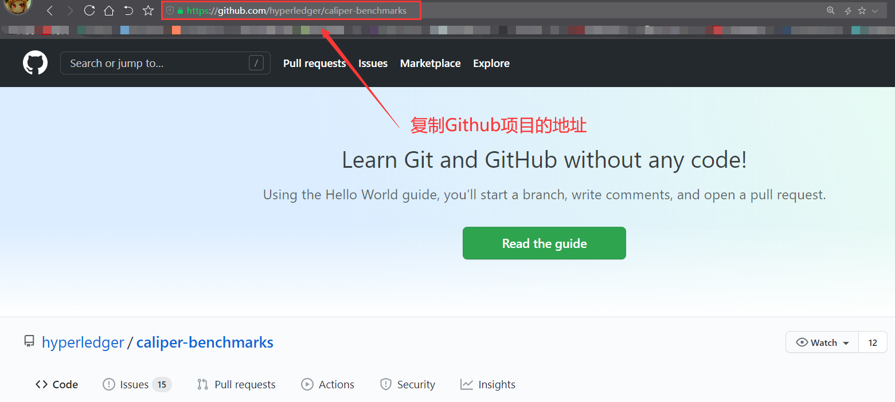
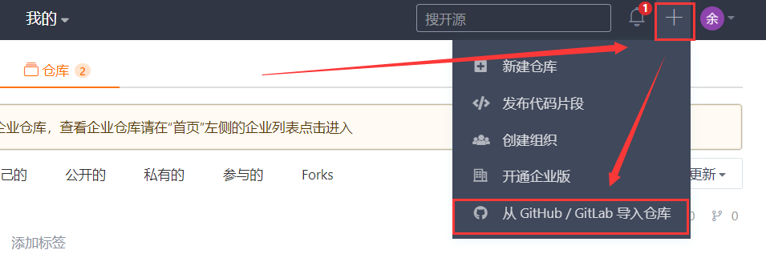
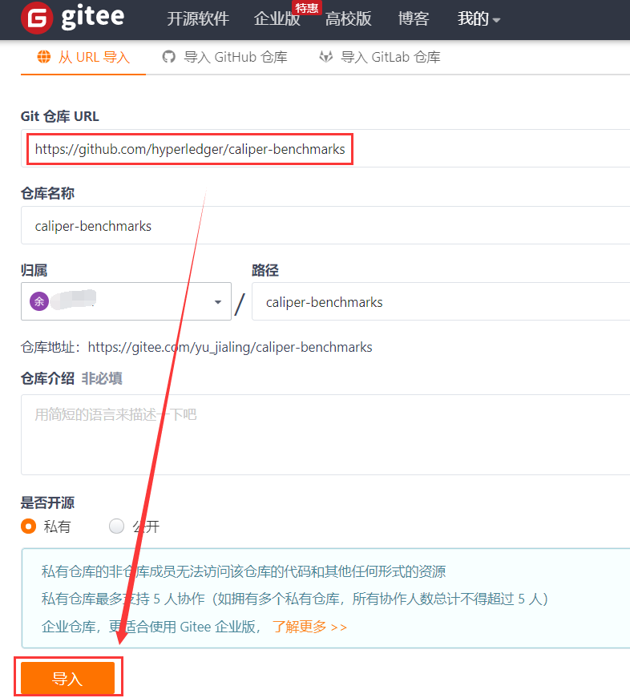
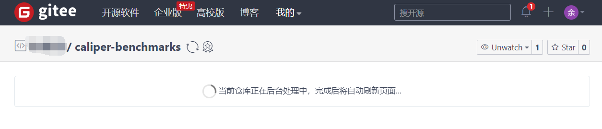
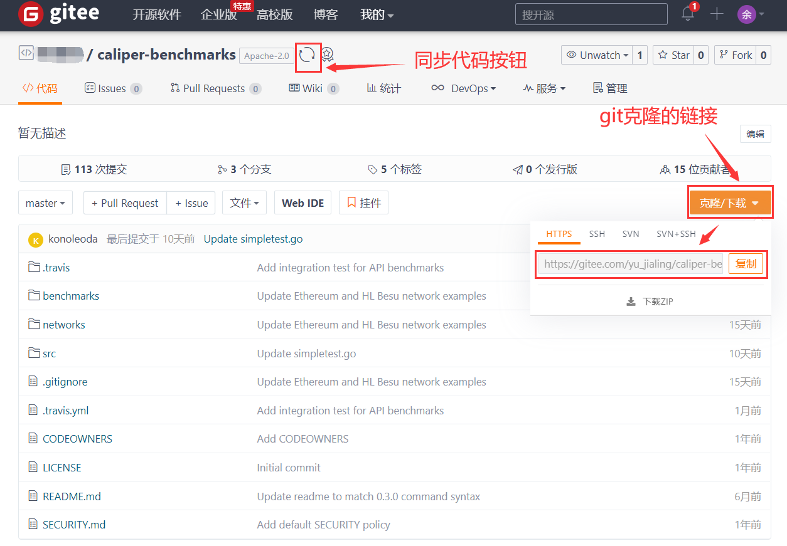
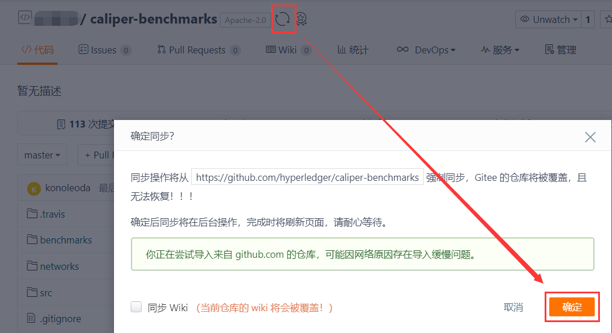
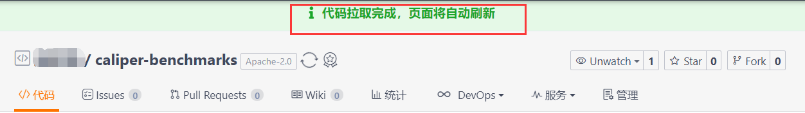
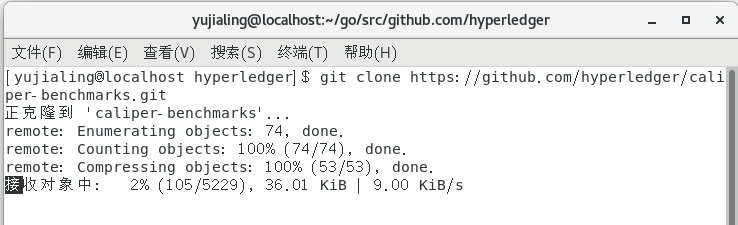
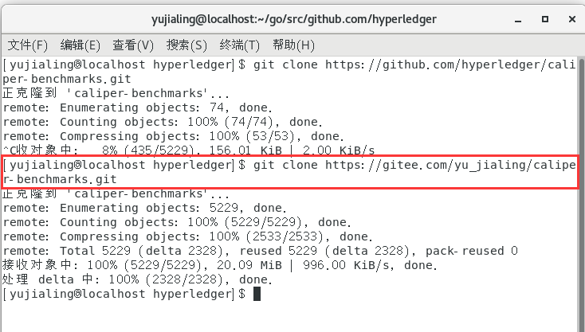

# Github项目导入Gitee流程

- 首先进入Gitee官网 https://gitee.com，没注册的小伙伴先注册账号。
- 打开Github上的项目，复制链接地址，这里以caliper-benchmarks为例子

- 点击右上角**+**，选择从GitHub/GitLab导入仓库选项 

- 将复制的Github**链接复制到Git仓库URL中**，仓库名称和是否开源按照自己需求设定，随后按下导入按钮即可导入。

- 按下导入后，Gitee正在导入URL中的项目，稍等片刻后便导入完成

- 稍等片刻后便同步完成，图片中**旋转按钮**是同步代码的按钮，点击**克隆/下载**即可获取下载代码的链接。

- 如果要更新代码，则点击**旋转按钮**，会弹出是否确认同步的确定请求，此时点击**确定**便可同步Github项目中的代码

- 稍等片刻后便会出现**代码拉取完成**，页面将自动刷新的提示

如果是经常需要下载的代码，而且通过Github克隆时常网速不稳定，可以尝试本博文的方法。

通过Github的URL克隆的速度：有时候很快，有时候很慢，甚至慢到个位数。比如下图：

- 通过Gitee克隆的速度：只要网络通畅，基本上是能吃到很高的网速。

- 同样的网络条件下，Github的克隆速度是9KiB/s，Gitee的克隆速度是996kiB/S，和修改hosts文件一样，通过Gitee导入Github项目也是一种解决Git克隆Github项目慢的方法。
  