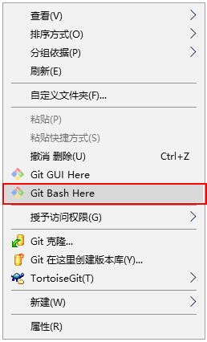
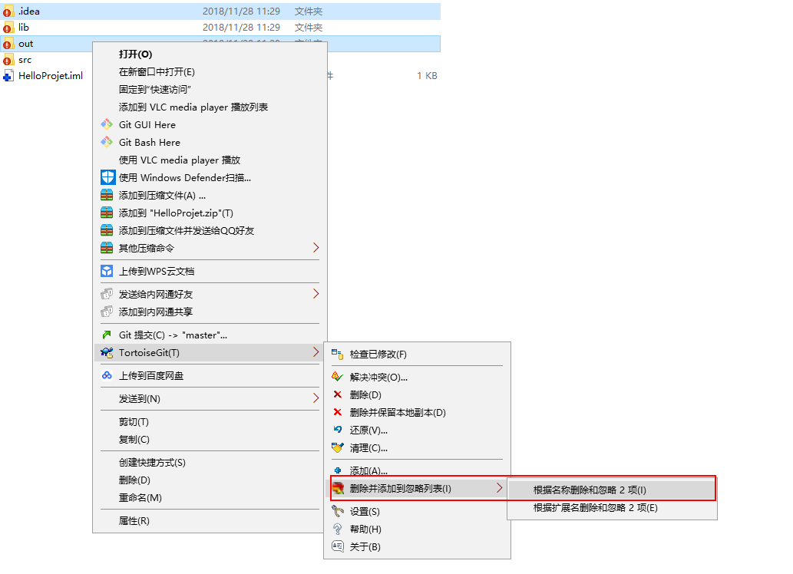
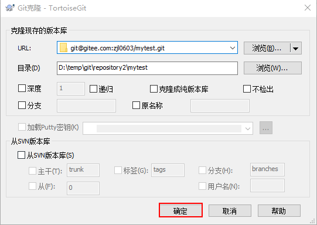
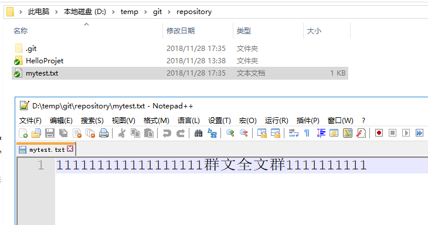

# Git

今日内容:

* git 的历史
* git 和 svn区别
* git的执行流程
* git的安装(Windows)
* git的操作
* git的私有服务器的安装(linux)
* git的分支操作
* git在idea中使用


## 1. Git历史

​	同生活中的许多伟大事件一样，Git 诞生于一个极富纷争大举创新的年代。Linux 内核开源项目有着为数众广的参与者。绝大多数的 Linux 内核维护工作都花在了提交补丁和保存归档的繁琐事务上（1991－2002年间）。到 2002 年，整个项目组开始启用分布式版本控制系统 BitKeeper 来管理和维护代码。

​	到 2005 年的时候，开发 BitKeeper 的商业公司同 Linux 内核开源社区的合作关系结束，他们收回了免费使用 BitKeeper 的权力。这就迫使 Linux 开源社区（特别是 Linux的缔造者 Linus Torvalds ）不得不吸取教训，只有开发一套属于自己的版本控制系统才不至于重蹈覆辙。他们对新的系统订了若干目标：

• 速度

• 简单的设计

• 对非线性开发模式的强力支持（允许上千个并行开发的分支）

• 完全分布式

• 有能力高效管理类似 Linux 内核一样的超大规模项目（速度和数据量）


## 2. Git 与 SVN 对比

### 2.1 SVN概述

​	SVN是集中式版本控制系统，版本库是集中放在中央服务器的，而干活的时候，用的都是自己的电脑，所以首先要从中央服务器哪里得到最新的版本，然后干活，干完后，需要把自己做完的活推送到中央服务器。集中式版本控制系统是必须联网才能工作，如果在局域网还可以，带宽够大，速度够快，如果在互联网下，如果网速慢的话，就郁闷了。

​	下图就是标准的集中式版本控制工具管理方式：


​	集中管理方式在一定程度上看到其他开发人员在干什么，而管理员也可以很轻松掌握每个人的开发权限。

​	但是相较于其优点而言，集中式版本控制工具缺点很明显：

* 服务器单点故障

* 容错性差

### 2.2 Git的概述

​	Git是分布式版本控制系统，那么它就没有中央服务器的，每个人的电脑就是一个完整的版本库，这样，工作的时候就不需要联网了，因为版本都是在自己的电脑上。既然每个人的电脑都有一个完整的版本库，那多个人如何协作呢？比如说自己在电脑上改了文件A，其他人也在电脑上改了文件A，这时，你们两之间只需把各自的修改推送给对方，就可以互相看到对方的修改了。

下图就是分布式版本控制工具管理方式：


## 3. Git 工作流程

一般工作流程如下：

* 1) 从远程仓库中克隆 Git 资源作为本地仓库。

* 2) 从本地仓库中checkout代码然后进行代码修改

* 3) 在提交前先将代码提交到暂存区。

* 4) 提交修改。提交到本地仓库。本地仓库中保存修改的各个历史版本。

* 5) 在修改完成后，需要和团队成员共享代码时，可以将代码push到远程仓库。

下图展示了 Git 的工作流程：


## 4. Git的安装

​	最早Git是在Linux上开发的，很长一段时间内，Git也只能在Linux和Unix系统上跑。不过，慢慢地有人把它移植到了Windows上。现在，Git可以在Linux、Unix、Mac和Windows这几大平台上正常运行了。由于开发机大多数情况都是windows，所以本教程只讲解windows下的git的安装及使用。

### 4.1 软件下载

下载地址：https://git-scm.com/download


参考资料中安装包已经下载完毕，根据不同的操作系统选择对应的安装包。

### 4.2 软件安装

#### 4.2.1 安装 git for Windows


* 一路下一步使用默认选项即可

#### 4.2.2 安装TortoiseGit


* 一路下一步, 即可安装, 安装后会出现如下界面:


* 点击下一步:一直到如下这个界面

  * 如果在安装git时候,没有设置安装目录, 此处选择默认即可

  


* 点击下一步,配置开发者姓名及邮箱，每次提交代码时都会把此信息包含到提交的信息中


* 完整安装后, 会添加右键快捷项,会出现如图的内容


#### 4.2.3 安装中文语言包

> 说明中文语言包并不是必须选择, 可以根据个人情况来选择安装


* 直接下一步, 即可安装, 安装完成后, 就可以修改为中文


## 5. 使用git管理文件版本

### 5.1 创建版本库

​	什么是版本库呢？版本库又名仓库，英文名repository，你可以简单理解成一个目录，这个目录里面的所有文件都可以被Git管理起来，每个文件的修改、删除，Git都能跟踪，以便任何时刻都可以追踪历史，或者在将来某个时刻可以“还原”。由于git是分布式版本管理工具，所以git在不需要联网的情况下也具有完整的版本管理能力。

​	创建一个版本库非常简单，可以使用git bash也可以使用tortoiseGit。首先，选择一个合适的地方，创建一个空目录（D:\temp\git\repository）。空目录名称可以自定义

#### 5.1.1 使用Git bash 创建

* 在当前的空目录中右键选择 Git bash来启动




* 创建版本库的命令:

```
git  init
```

#### 5.1.2 使用 TortoiseGit

> 使用TortoiseGit时只需要在空目录中点击右键菜单选择“在这里创建版本库”


* 版本库创建成功，会在此目录下创建一个.git的隐藏目录，如下所示


>概念说明:
>
>​	版本库: ".git" 目录就是版本库, 将来文件都需要保存到版本库当中
>
>​	工作目录: 包含 ".git"目录的目录, 也就是git目录的上一级目录就是工作目录, 只有工作目录中的文件才能保存到版本库中

### 5.2 添加文件

#### 5.2.1 添加文件整个过程:

* 1) 在D:\temp\git\repository目录下创建一个mytest.txt文件


* 2) 选择文件, 右键


\*\*\**\*\* 此时文件变为带 '+' 号的图标


* 3) 提交文件: 在带有+号的文件上, 右键选择提交, 将其保存到版本库中


#### 5.2.2 工作区 和 暂存区

什么是工作区（Working Directory）？

> 工作区就是你在电脑里能看到的目录，比如我的reporstory文件夹就是一个工作区。
>
> 有的同学可能会说repository不是版本库吗怎么是工作区了？其实repository目录是工作区，在这个目录中的“.git”隐藏文件夹才是版本库。这回概念清晰了吧。
>
> Git的版本库里存了很多东西，其中最重要的就是称为stage（或者叫index）的暂存区，还有Git为我们自动创建的第一个分支master，以及指向master的一个指针叫HEAD。如下图所示


> 分支和HEAD的概念我们稍后再讲。前面讲了我们把文件往Git版本库里添加的时候，是分两步执行的：
>
> 第一步是用git add把文件添加进去，实际上就是把文件修改添加到暂存区；
>
> 第二步是用git commit提交更改，实际上就是把暂存区的所有内容提交到当前分支。 
>
> 因为我们创建Git版本库时，Git自动为我们创建了唯一一个master分支，所以，现在，git commit就是往master分支上提交更改。
>
> 你可以简单理解为，需要提交的文件修改通通放到暂存区，然后，一次性提交暂存区的所有修改。

### 5.3 修改文件

#### 5.3.1 提交修改

被版本库管理的文件不可避免的要发生修改，此时只需要直接对文件修改即可。修改完毕后需要将文件的修改提交到版本库。

在mytest.txt文件上点击右键，然后选择“提交”


​	<span style="color:red;background:white;font-size:20px;font-family:楷体;">**注意： **</span>

​	<span style="color:blue;background:white;font-size:20px;font-family:楷体;">**这里提交日志不能每次写一样的。**</span>


#### 5.3.2 查看修改历史

在开发过程中可能会经常查看代码的修改历史，或者叫做修改日志。来查看某个版本是谁修改的，什么时间修改的，修改了哪些内容。

可以在文件上点击右键选择“显示日志”来查看文件的修改历史。


#### 5.3.3 差异比较

​	当文件内容修改后，需要和修改之前对比一下修改了哪些内容此时可以使用“比较差异功能”

* 选择查看日志的窗口后, 选择要比较的版本, 直接进行差异化比较即可


#### 5.3.4 还原修改

当文件修改后不想把修改的内容提交，还想还原到未修改之前的状态。此时可以使用“还原”功能


​	**注意：此操作会撤销所有未提交的修改，所以当做还原操作是需要慎重慎重！！！**

### 5.4 删除文件

​	需要删除无用的文件时可以使用git提供的删除功能直接将文件从版本库中删除

注意： 删除完后必须要commit, 才算真正的删除成功


### 5.5 案例：将java工程提交到版本库

* 第一步：将参考资料中的java工程project-test复制到工作目录中


* 第二步: 将工程添加到暂存区


* 第三步: 忽略文件 或 文件夹

​        在此工程中，并不是所有文件都需要保存到版本库中的例如“bin”目录及目录下的文件就可以忽略。好在Git考虑到了大家的感受，这个问题解决起来也很简单，在Git工作区的根目录下创建一个特殊的.gitignore文件，然后把要忽略的文件名填进去，Git就会自动忽略这些文件。

​	如果使用TortoiseGit的话可以使用菜单项直接进行忽略。

​	


​	选择保留本地文件。完成后在此文件夹内会多出一个.gitignore文件，这个文件就是文件忽略文件，当然也可以手工编辑。其中的内容就是把对应的目录忽略掉


* 第四步: 提交代码
  * 将代码添加到master分支上, 启动.gitignore文件也需要添加到暂存区, 然后提交代码

### 5.6 忽略文件语法规则

空行或是以 # 开头的行即注释行将被忽略。

可以在前面添加正斜杠 / 来避免递归,下面的例子中可以很明白的看出来与下一条的区别。

可以在后面添加正斜杠 / 来忽略文件夹，例如 build/ 即忽略build文件夹。

可以使用 ! 来否定忽略，即比如在前面用了 *.apk ，然后使用 !a.apk ，则这个a.apk不会被忽略。

\* 用来匹配零个或多个字符，如 *.[oa] 忽略所有以".o"或".a"结尾， *~ 忽略所有以 ~ 结尾的文件（这种文件通常被许多编辑器标记为临时文件）； [] 用来匹配括号内的任一字符，如 [abc] ，也可以在括号内加连接符，如 [0-9] 匹配0至9的数； ? 用来匹配单个字符。 

看了这么多，还是应该来个例子：

1) 忽略 .a 文件

*.a

2) 但否定忽略 lib.a, 尽管已经在前面忽略了 .a 文件

!lib.a

3) 仅在当前目录下忽略 TODO 文件， 但不包括子目录下的 subdir/TODO

/TODO

4) 忽略 build/ 文件夹下的所有文件

build/

5) 忽略 doc/notes.txt, 不包括 doc/server/arch.txt

doc/*.txt

6) 忽略所有的 .pdf 文件 在 doc/ directory 下的

doc/**/*.pdf

## 6. 远程仓库

### 6.1 添加远程仓库

现在我们已经在本地创建了一个Git仓库，又想让其他人来协作开发，此时就可以把本地仓库同步到远程仓库，同时还增加了本地仓库的一个备份。

常用的远程仓库:

​	github：https://github.com/

​	码云: https://gitee.com/ 

​	这两个都可以作为git的远程仓库, GitHub是国外的, 码云是国内的, 其使用上都是类似的, 这里演示将代码上传至码云上的方式:

#### 6.1.1 在 码云上创建仓库

> 首先你得先在码云上有一个账户, 这里就不在演示, 注册一个即可, 然后就在码云上常见一个仓库


>不管是GitHub 还是码云, 都支持两种同步方式"https" 和 "ssh",如果使用https很简单基本不需要配置就可以使用，但是每次提交代码和下载代码时都需要输入用户名和密码。如果使用ssh方式就需要客户端先生成一个密钥对，即一个公钥一个私钥。然后还需要把公钥放到githib的服务器上。这两种方式在实际开发中都用应用，所以我们都需要掌握。接下来我们先看ssh方式。

#### 6.1.2  ssh协议

##### 6.1.2.1 什么是ssh

​	SSH 为 Secure Shell（安全外壳协议）的缩写，由 IETF 的网络小组（Network Working Group）所制定。SSH 是目前较可靠，专为远程登录会话和其他网络服务提供安全性的协议。利用 SSH 协议可以有效防止远程管理过程中的信息泄露问题。

##### 6.1.2.2 基于密钥的安全验证

​	使用ssh协议通信时，推荐使用基于密钥的验证方式。你必须为自己创建一对密匙，并把公用密匙放在需要访问的服务器上。如果你要连接到SSH服务器上，客户端软件就会向服务器发出请求，请求用你的密匙进行安全验证。服务器收到请求之后，先在该服务器上你的主目录下寻找你的公用密匙，然后把它和你发送过来的公用密匙进行比较。如果两个密匙一致，服务器就用公用密匙加密“质询”（challenge）并把它发送给客户端软件。客户端软件收到“质询”之后就可以用你的私人密匙解密再把它发送给服务器。

##### 6.1.2.3 ssh密钥的生成

在windows下我们可以使用 Git Bash.exe来生成密钥，可以通过开始菜单或者右键菜单打开Git Bash


git bash 执行命令,生命公钥和私钥

命令: ssh-keygen -t rsa


执行命令完成后,在window本地用户.ssh目录C:\Users\用户名\.ssh下面生成如下名称的公钥和私钥:


##### 6.1.2.4 ssh 密钥配置

​	密钥生成后需要在码云上配置密钥本地才可以顺利访问


>在key部分将id_rsa.pub文件内容添加进去，然后点击“Add SSH key”按钮完成配置

#### 6.1.3 同步到远程仓库

​	同步到远程仓库可以使用git bash也可以使用tortoiseGit

##### 6.1.3.1 使用 git bash

​	在仓库所在的目录（D:\temp\git\repository）点击右键选择“Git Bash Here”，启动git bash程序


然后在git bash中执行如下语句：

git remote add origin git@gitee.com:**zjl0603**/mytest.git

git push -u origin master

注意：其中加粗字体部分需要替换成个人的用户名。

 

如何出现如下错误：


可以先执行如下命令，然后再执行上面的命令

$ git remote rm origin

##### 6.1.3.2 使用TortoiseGit同步

> ​	由于TortoiseGit使用的ssh工具是“PuTTY”git Bash使用的ssh工具是“openSSH”，如果想让TortoiseGit也使用刚才生成的密钥可以做如下配置：


> Url：远程仓库的地址
>
> 推送URL：也是相同的
>
> Putty密钥：选择刚才生成的密钥中的私钥

* 在本地仓库的文件夹中单击右键，选择“Git同步”


<span style="color:red;background:white;font-size:30px;font-family:楷体;">**注意： **</span>

​			<span style="color:blue;background:white;font-size:20px;font-family:楷体;">**如果报错信息如下**</span>

​			

​			 原因： 在commit 提交的时候所写的提交日志跟上次提交的日志一样导致；

​			解决方法： Bash Git 中执行命名： 

```sql
			git push -f origin master
```


### 6.2 从远程仓库克隆

​	克隆远程仓库也就是从远程把仓库复制一份到本地，克隆后会创建一个新的本地仓库。选择一个任意部署仓库的目录，然后克隆远程仓库。

#### 6.2.1 使用 git bash

```
$ git clone git@gitee.com:zjl0603/mytest.git
```

#### 6.2.2 使用 TortoiseGit

在任意目录点击右键：




### 6.3 从远程仓库取代码

Git中从远程的分支获取最新的版本到本地有这样2个命令：

1. git fetch：相当于是从远程获取最新版本到本地，不会自动merge（合并代码）

2. git pull：相当于是从远程获取最新版本并merge到本地

上述命令其实相当于git fetch 和 git merge

在实际使用中，git fetch更安全一些

因为在merge前，我们可以查看更新情况，然后再决定是否合并

如果使用TortoiseGit的话可以从右键菜单中点击“拉取”（pull）或者“获取”（fetch）

### 6.4 搭建私有的Git服务器

#### 6.4.1 服务器搭建

​	远程仓库实际上和本地仓库没啥不同，纯粹为了7x24小时开机并交换大家的修改。GitHub就是一个免费托管开源代码的远程仓库。但是对于某些视源代码如生命的商业公司来说，既不想公开源代码，又舍不得给GitHub交保护费，那就只能自己搭建一台Git服务器作为私有仓库使用。

搭建Git服务器需要准备一台运行Linux的机器，在此我们使用CentOS。以下为安装步骤：

1、安装git服务环境准备

yum -y install curl curl-devel zlib-devel openssl-devel perl cpio expat-devel gettext-devel gcc cc

2、下载git-2.5.0.tar.gz(资料中)

```
yum -y install lrzsz
使用命令: rz 进行上传文件
```


1）解压缩(/export/servers)

2）cd git-2.5.0

3）autoconf

4）./configure

5）make

6）make install

3、添加用户

adduser -r -c 'git version control' -d /home/git -m git

此命令执行后会创建/home/git目录作为git用户的主目录。

5、设置密码

passwd git

输入两次密码

6、切换到git用户

su git

7、创建git仓库

git --bare init /home/git/first

注意：如果不使用“--bare”参数，初始化仓库后，提交master分支时报错。这是由于git默认拒绝了push操作，需要.git/config添加如下代码：

[receive]

​      denyCurrentBranch = ignore

推荐使用：git --bare init初始化仓库。

#### 6.4.2 连接服务器

私有git服务器搭建完成后就可以向连接github一样连接使用了，但是我们的git服务器并没有配置密钥登录，所以每次连接时需要输入密码。

使用命令连接：

$ git remote add origin ssh://git@192.168.72.141/home/git/first

这种形式和刚才使用的形式好像不一样，前面有ssh://前缀，好吧你也可以这样写：

$ git remote add origin git@192.168.72.144:first

 

使用TortoiseGit同步的话参考上面的使用方法。

## 7. 分支管理

### 7.1 创建合并分支

​	在我们每次的提交，Git都把它们串成一条时间线，这条时间线就是一个分支。截止到目前，只有一条时间线，在Git里，这个分支叫主分支，即master分支。HEAD指针严格来说不是指向提交，而是指向master，master才是指向提交的，所以，HEAD指向的就是当前分支。

​	一开始的时候，master分支是一条线，Git用master指向最新的提交，再用HEAD指向master，就能确定当前分支，以及当前分支的提交点：


每次提交，master分支都会向前移动一步，这样，随着你不断提交，master分支的线也越来越长。

当我们创建新的分支，例如dev时，Git新建了一个指针叫dev，指向master相同的提交，再把HEAD指向dev，就表示当前分支在dev上：


你看，Git创建一个分支很快，因为除了增加一个dev指针，改改HEAD的指向，工作区的文件都没有任何变化！

 

不过，从现在开始，对工作区的修改和提交就是针对dev分支了，比如新提交一次后，dev指针往前移动一步，而master指针不变：


假如我们在dev上的工作完成了，就可以把dev合并到master上。Git怎么合并呢？最简单的方法，就是直接把master指向dev的当前提交，就完成了合并：


所以Git合并分支也很快！就改改指针，工作区内容也不变！

 

合并完分支后，甚至可以删除dev分支。删除dev分支就是把dev指针给删掉，删掉后，我们就剩下了一条master分支：


### 7.2 使用TortoiseGit实现分支管理

​	使用TortoiseGit管理分支就很简单了

#### 7.2.1 创建分支

* 在本地仓库文件夹中点击右键，然后从菜单中选择“创建分支”：


* 如果想创建完毕后直接切换到新分支可以勾选“切换到新分支”选项或者从菜单中选择“切换/检出”来切换分支：


#### 7.2.2 合并分支

​	分支切换到dev后就可以对工作区的文件进行修改，然后提交到dev分支原master分支不受影响。例如我们修改mytest.txt中的内容，然后提交到dev分支。


* 接着将其进行提交到版本库中


* 切换到master分支上, 查看文件内容



> 切换到master分支上, 查看, 并没有数据, 也就是说, 如果用户在分支上进行修改代码, 不会影响master分支的内容

* 将dev分支的内容, 合并到主master分支上


> 此时, 分支的内容就合并的主master分支上了

### 7.3 解决冲突

​	两个分支中编辑的内容都是相互独立互不干扰的，那么如果在两个分支中都对同一个文件进行编辑，然后再合并，就有可能会出现冲突。

例如在master分支中对mytest.txt进行编辑：


将修改后的添加到版本库中:


将分支切换到dev上, 然后修改文件内容, 并提交


切换到master分支上, 将dev分支的内容合并过来


>提示不是最新的版本, 需要先解决冲突, 在进行合并

解决冲突:


>解决冲突必须手动解决, 因为程序并不知道, 对应的内容应该放置在什么位置, 需要手动处理


解决冲突完成后, 在重新提交即可合并

## 8. 在IDEA中使用git

### 8.1 在 idea中配置git

安装好IntelliJ IDEA后，如果Git安装在默认路径下，那么idea会自动找到git的位置，如果更改了Git的安装位置则需要手动配置下Git的路径。

选择File→Settings打开设置窗口，找到Version Control下的git选项：


选择git的安装目录后可以点击“Test”按钮测试是否正确配置。


### 8.2 将工程添加到git

* 1) 在idea中创建一个工程, 例如 创建一个java工程, 名称为idea-git-test, 如下图所示


* 2）创建本地仓库
  * 在菜单中选择“vcs”→Import into Version Control→Create Git Repository...


		选择工程所在的上级目录。本例中应该选择idea-projects目录，然后点击“OK”按钮，在工程的上级目录创建本地仓库，那么idea-projects目录就是本地仓库的工作目录，此目录中的工程就可以添加到本地仓库中。也就是可以把idea-git-test工程添加到本地仓库中。  

选择之后在工具栏上就多出了git相关工具按钮：


* 将其添加到本地版本库中: 点击commit即可提交到本地的版本库中


* 推送至远程

  在码云上创建一个仓库然后将本地仓库推送到远程。

  在工程上点击右键，选择git→Repository→push，

  或者在菜单中选择vcs→git→push


> 选择Define remote


成功后, idea会显示


### 8.3 从远程仓库克隆

​	关闭工程后，在idea的欢迎页上有“Check out from version control”下拉框，选择git


> 使用idea选择克隆后, 会出现如下内容, 一直下一步即可


> 此时就又回来了


### 8.4 从远程拉取代码

​	如果需要从服务端同步代码可以使用工具条中的“update”按钮


