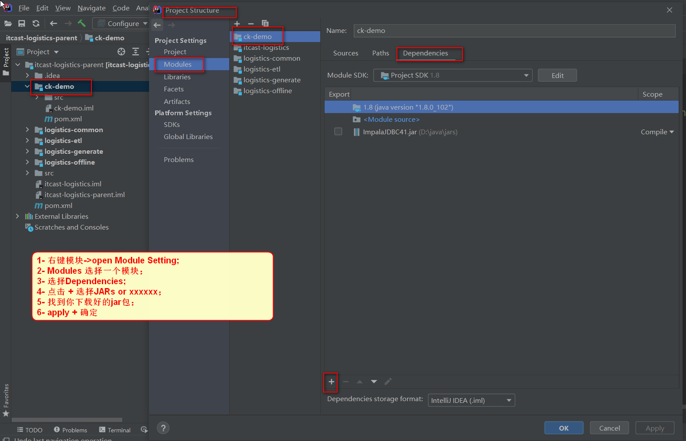
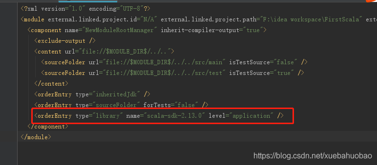
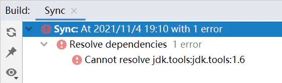
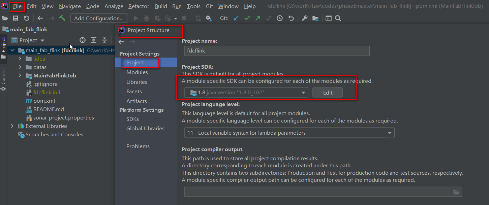
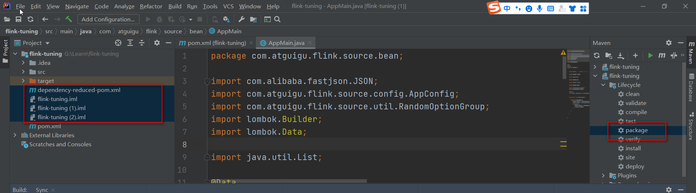
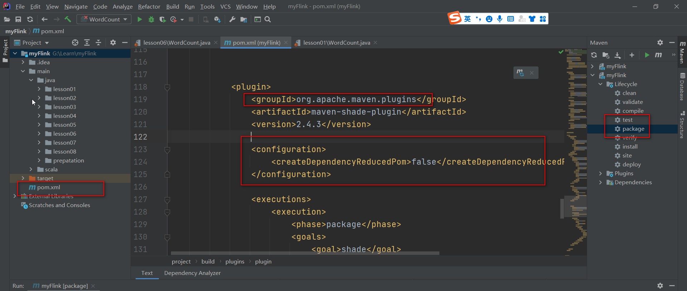
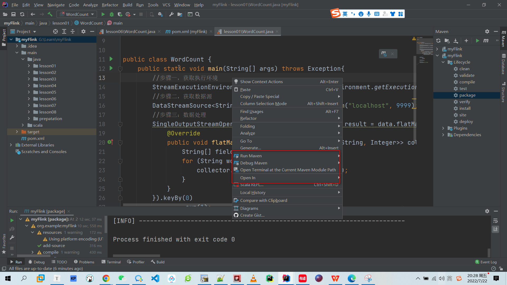
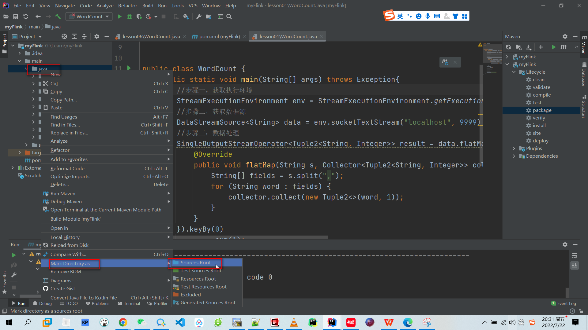

[TOC]

# 0- 常用快捷键

- 查找类:  ctrl + N   或者 双击 shift;
- 上一步、下一步 ： ctrl + alt + 左右方向键；
- 字符串所有文件查询 ： ctrl + shift + R ; 
- 本文件字符串查询 ：ctrl + F;
- 本文定位行数: ctrl + G;
- 

# 1- 编译jar包-并引用


## 1-1 编译JAR包

### 创建工程

​		01- 创建工程01


​		02- 创建工程02


​		03- 创建工程03


​		04- 生成的工程


​		05- 修改类名


​		06-编写新增接口代码


### 设置模块编译JAR包

file->

​	ProjectStructure->

​		ProjectSetting->

​			Artifacts->

​				"+"->

​					JAR->

​						from moudles with dependencxxx ->


### 编译

​	Build-> Build Artifacts...->Build


### 生成的jar包


## 1-2 使用jar包


### 创建使用jar包工程


### 配置工程保证可正常运行

Edit Configuratios->"+"->Application


### 添加jar包

file->

​	ProjectStructure->

​		ProjectSetting->

​			Libraries->

​				"+" ->

​					java ->

01- 配置新增jar包


02- 新增jar包后查看


03- 使用jar包中的接口方法


# 2- 导入新工程

## 2-1 IDEA导入他人maven工程

1. 先删除他人工程下的 .idea文件；
2. 使用Idea打开工程;
3. 配置自己的maven；
4. 刷新maven; [如果自己仓库中没有jar包， 可能需要很久时间下载；]()
5. 每个模块add framework support 添加scala；
6. 每个模块下的scala目录需要 Make Directory As -> Source Root;
7. maven 依赖刷新完成后 rebuild一下；
8. 使用maven install ; 


## 2-2 IDEA 使用maven加载本地jar包

- 一般用于某个jar包不方便使用maven下载；

- systemPath

``` xml
<dependency>
    <groupId>com.oracle.jdbc</groupId>
    <artifactId>ojdbc8</artifactId>
    <version>${ojdbc.version}</version>
    <systemPath>D:/java/jars/ojdbc8-12.2.0.1.jar</systemPath>
    <scope>system</scope>
</dependency>
```

## 2-3 IDEA 使用modules加载本地jar包





## 2-4 maven 强制更新

``` properties
mvn clean install -e -U
```


## 2-5 Idea 新建不了scala文件

- 首先是检测下自己是否有在idea上安装Scala插件，在File--Settings-Plugins中直接搜索Scala，如果没安装的话就直接install就好啦；


- 查看下是否给项目配置好了Scala环境，至于有没有电脑上有没有安装并配置好Scala环境这个就不说啦。在File--Project Structure--Platform Settings--Global Libreries中，如果没有的话就点击+，将自己电脑上安装的Scala配置进去；


这个时候你就可以再试试看能不能new出一个Scala文件出来，不行的话不急，再接着第三步


- 进入File--Project Structure--Project Settings--Modules中，你会发现右边有点类似与java的maven文件目录一样，点击src，并将它设置为Sources

这个时候你就可以再试试看能不能new出一个Scala文件出来，不行的话不急，再接着第四步


- 在项目的目录下，找到.idea文件，同目录下里面有个以.iml为后缀的文件，打开它
- 

将 

<orderEntry type="library" name="scala-sdk-2.13.0" level="application" />
这段字体复制到这个红色圈圈的位置，然后就大功告成。name指的是你自己安装的scala版本，最后你再右键的时候可以发现能new出来一个Scala文件啦


## 2-6 Cannot resolve jdk.tools:jdk.tools:1.6

- 报错



- 解决办法 : 在pom.xml 中 将tools exclusion掉

  ``` xml
   <dependency>
       <groupId>org.apache.hive</groupId>
       <artifactId>hive-jdbc</artifactId>
       <version>1.2.1</version>
       <exclusions>
           <exclusion>
               <artifactId>jdk.tools</artifactId>
               <groupId>jdk.tools</groupId>
           </exclusion>
       </exclusions>
  </dependency>
  ```


## 2-7 net.alchim31.maven:scala-maven-plugin:3.2.0:compile

- 报错：

``` xml
[ERROR] Failed to execute goal net.alchim31.maven:scala-maven-plugin:3.2.0:compile (default) on project iteblog: wrap: org.apache.commons.exec.ExecuteException:

 Process exited with an error: 1 (Exit value: 1) -> [Help 1]

[ERROR]

[ERROR] To see the full stack trace of the errors, re-run Maven with the -e swit

ch.

[ERROR] Re-run Maven using the -X switch to enable full debug logging.


[ERROR] For more information about the errors and possible solutions, please read the following articles:

[ERROR] [Help 1] http://cwiki.apache.org/confluence/display/MAVEN/MojoExecutionException

```

- 解决办法：

  1- 项目右键 --> add frameworks support 添加scala ；

  2- 


## 2-8 git-commit-id-plugin

``` xml
<!--            获取git版本信息-->
<plugin>
    <groupId>pl.project13.maven</groupId>
    <artifactId>git-commit-id-plugin</artifactId>
    <version>2.2.5</version>
    <executions>
        <execution>
            <goals>
                <goal>revision</goal>
            </goals>
        </execution>
    </executions>
    <configuration>
        <!--日期格式;默认值:dd.MM.yyyy '@' HH:mm:ss z;-->
        <dateFormat>yyyyMMddHHmmss</dateFormat>
        <!--,构建过程中,是否打印详细信息;默认值:false;-->
        <verbose>true</verbose>
        <!-- ".git"文件路径;默认值:${project.basedir}/.git; -->
        <dotGitDirectory>${project.basedir}/.git</dotGitDirectory>
        <!--若项目打包类型为pom,是否取消构建;默认值:true;-->
        <skipPoms>false</skipPoms>
        <!--是否生成"git.properties"文件;默认值:false;-->
        <generateGitPropertiesFile>false</generateGitPropertiesFile>
        <!--指定"git.properties"文件的存放路径(相对于${project.basedir}的一个路径);-->
        <generateGitPropertiesFilename>/src/main/resources/git.properties</generateGitPropertiesFilename>
        <!--".git"文件夹未找到时,构建是否失败;若设置true,则构建失败;若设置false,则跳过执行该目标;默认值:true;-->
        <failOnNoGitDirectory>true</failOnNoGitDirectory>

        <!--git描述配置,可选;由JGit提供实现;-->
        <gitDescribe>
            <!--是否生成描述属性-->
            <skip>false</skip>
            <!--提交操作未发现tag时,仅打印提交操作ID,-->
            <always>false</always>
            <!--提交操作ID显式字符长度,最大值为:40;默认值:7;
                            0代表特殊意义;后面有解释;
                        -->
            <abbrev>7</abbrev>
            <!--构建触发时,代码有修改时(即"dirty state"),添加指定后缀;默认值:"";-->
            <dirty>-dirty</dirty>
            <!--always print using the "tag-commits_from_tag-g_commit_id-maybe_dirty" format, even if "on" a tag.
                            The distance will always be 0 if you're "on" the tag.
                        -->
            <forceLongFormat>false</forceLongFormat>
        </gitDescribe>
    </configuration>
</plugin>
```


## 2-9 maven-shade-plugin

``` xml
<plugin>
    <groupId>org.apache.maven.plugins</groupId>
    <artifactId>maven-shade-plugin</artifactId>
    <version>3.2.1</version>
    <executions>
        <execution>
            <phase>package</phase>
            <goals>
                <goal>shade</goal>
            </goals>
            <configuration>
                <relocations>
                    <relocation>
                        <pattern>com.fasterxml.jackson</pattern>
                        <shadedPattern>noc.com.fasterxml.jackson</shadedPattern>
                    </relocation>
                    <relocation>
                        <pattern>com.google.guava</pattern>
                        <shadedPattern>noc.com.google.guava</shadedPattern>
                    </relocation>
                </relocations>
                <filters>
                    <filter>
                        <!-- Do not copy the signatures in the META-INF folder.
                                    Otherwise, this might cause SecurityExceptions when using the JAR. -->
                        <artifact>*:*</artifact>
                        <excludes>
                            <exclude>META-INF/*.SF</exclude>
                            <exclude>META-INF/*.DSA</exclude>
                            <exclude>META-INF/*.RSA</exclude>
                        </excludes>
                    </filter>
                </filters>
                <transformers>
                    <transformer
                                 implementation="org.apache.maven.plugins.shade.resource.ManifestResourceTransformer">
                    </transformer>
                </transformers>
            </configuration>
        </execution>
    </executions>
</plugin>
```


## 2-10 spark应用中jackson版本冲突的解决

- 报错： ScalaObjectMapper

``` properties
com.fasterxml.jackson.module.scala.experimental.ScalaObjectMapper$class.$init$(ScalaObjectMapper.scala:50)

```

- 解决方案： **使用maven的shade插件**

  - 首先增加依赖项，使用默认的compile scope

  ``` xml
  <dependency>
      <groupId>com.fasterxml.jackson.core</groupId>
      <artifactId>jackson-core</artifactId>
      <version>2.4.4</version>
  </dependency>
  <dependency>
      <groupId>com.fasterxml.jackson.core</groupId>
      <artifactId>jackson-databind</artifactId>
      <version>2.4.4</version>
  </dependency>
  <dependency>
      <groupId>com.fasterxml.jackson.core</groupId>
      <artifactId>jackson-annotations</artifactId>
      <version>2.4.4</version>
  </dependency>
  <dependency>
      <groupId>com.fasterxml.jackson.module</groupId>
      <artifactId>jackson-module-scala_2.10</artifactId>
      <version>2.4.4</version>
  </dependency>
  ```

  

  - 然后增加maven-shade-plugin

  ``` xml
  <plugin>
      <groupId>org.apache.maven.plugins</groupId>
      <artifactId>maven-shade-plugin</artifactId>
      <version>3.1.0</version>
      <executions>
          <execution>
              <phase>package</phase>
              <goals>
                  <goal>shade</goal>
              </goals>
              <configuration>
                  <relocations>
                      <relocation>
                          <pattern>com.fasterxml.jackson</pattern>
                          <shadedPattern>noc.com.fasterxml.jackson</shadedPattern>
                      </relocation>
                      <relocation>
                          <pattern>com.google.guava</pattern>
                          <shadedPattern>noc.com.google.guava</shadedPattern>
                      </relocation>
                  </relocations>
              </configuration>
          </execution>
      </executions>
  </plugin>
  ```

## 2-11 maven-shade-plugin报错

- 报错

``` xml
idea 打包 报错maven-shade-plugin:2.4.3:shade (default) on project xxx : Error creating shaded jar: null
```

- 解决方案： **<font color='red'>需要把maven-shade-plugin的版本改成3.2.1</font>**

``` xml
idea版本:ideaIU-2020.1.2
JDK:1.8.0_141
maven版本:3.6.3

<plugin>
    <groupId>org.apache.maven.plugins</groupId>
    <artifactId>maven-shade-plugin</artifactId>
    <version>3.2.1</version>
    <executions>
        <execution>
            <phase>package</phase>
            <goals>
                <goal>shade</goal>
            </goals>
            <configuration>
                <minimizeJar>true</minimizeJar>
            </configuration>
        </execution>
    </executions>
</plugin>
```


# 3- 界面问题

## 3-1 idea右边找不到maven窗口不见了

- 方案一：
  - 首先idea自带了maven控件，不像Eclipse还需要下载控件，如果你以前有maven在右边，出于某种原因，消失找不到 了，你可以试试我写的方法。
  - **方法1**.你点击一下你idea界面最左下角的那个小框，maven应该从里面找到
  - **方法2**.点击菜单栏View->Tool Windows->Maven projects
  - **方法3**.点击菜单栏Help->Find Action(Ctrl+Shift+A),输入Maven projects

- 方案二：
  - 右侧边栏没有出现maven, 还有一种可能就是pom.xml文件没有识别, idea觉得这个项目就不是个maven项目，导致idea无法加载依赖包。因此上述三种方法都没有用，
  - 解决办法:
    **右键pom.xml文件, 点击" add as maven project "**


## 3-2 IDEA项目正常编译，但是代码部分飘红

情况1：

- IntelliJ IDEA一直用的好好的，今天切换了一个项目，**能正常编译，但是代码部分飘红**。


- 辛酸历程：
  - 最开始以为是新改代码引起，直接switch，然而问题还是存在
  - 怀疑是依赖包问题，在命令行用mvn clean install整个项目编译一次，问题还是存在
  - 怀疑是IDEA本身配置问题，将整个项目除原始代码外的文件全部删除，重启IDEA导入项目，然而问题依然存在
  - 猛然想到，以前用过的一个**清除缓存功能**，**<font color='red'>File->Invalidate Caches/Restart.</font>**..


情况2：

``` properties
不止一次碰到IDEA代码可以正常编译，运行。

但是import语句飘红，找不到Java类的问题。

尝试过File-Invalidate Cache重启IDEA还是没有效果。

可以尝试，在项目目录下，ls -a有一个.idea的隐藏文件夹，

里面应该是IDEA的索引文件，rm -rf .idea再重新导入项目就好了
```


## 3-3  maven项目打包时生成dependency-reduced-pom.xml




原因: 

- 在pom.xml 文件中使用了 maven-shade-plugin插件打jar包,才导致这个问题；

解决办法：

- 添加以下配置即可

``` xml
<configuration>
      <createDependencyReducedPom>false</createDependencyReducedPom>
</configuration>

```




## 3-4 Idea 右键项目没有run 运行选项

- 现象



- 原因： 

  - https://www.cnblogs.com/wbs1324/p/12630485.html
  - 没有讲目录设置为 source

- 解决方法：

  