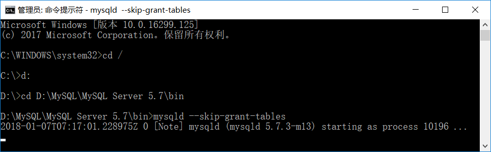
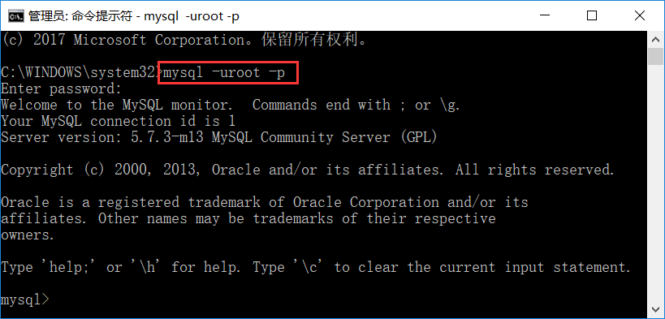
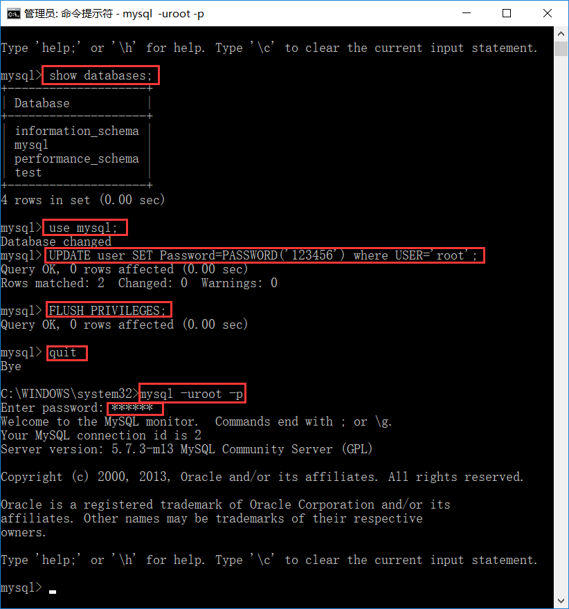

# 1- UTC 时区问题

- 报错信息如下：
  - 在idea 发生连接错误

``` properties
The server time zone value ‘�й���׼ʱ��’ is unrecognized or represents more than one time zone. You must configure either the server or JDBC driver (via the serverTimezone configuration
```


``` properties
net start/stop mysql  # 必须使用管理员权限打开CMD
show variables like '%time_zone%';
SELECT @@GLOBAL.time_zone, @@SESSION.time_zone;
set global time_zone="+8:00"；
```


# 2- Window 忘记Mysql密码

- 环境：
  - 系统：Win10
  - 数据库版本：mysql5.7.3.0

## 2-1 关闭数据库服务

我的电脑（此电脑）——> 右键 ——> 管理 ——> 服务和应用程序 ——> 服务，找到MySQL服务进行停止。


## 2-2 跳过权限启动MySQL

- 管理员身份运行命令提示符，在命令窗口中进入本地MySQL的bin目录下，我的目录是：D:\MySQL\MySQL Server 5.7\bin，
- 然后输入：<font color='red'>mysqld --skip-grant-tables</font>，会出现等待的状态。



- 这时，用管理员身份<font color='red'>**另起**</font>一个命令提示符窗口，输入：
  - mysql -uroot -p
  - 会出现Enter password:
  - 这里直接回车跳过，不需要输入密码即可成功登录。



- 然后输入下面命令，查看数据库列表：
  - show databases;
  - 接着输入下面命令，切换到mysql数据库：
  - use mysql;
  - 使用命令修改root用户密码： UPDATE user SET Password=PASSWORD('123456') where USER='root';
  - 这里将密码修改为：123456

- 然后刷新权限：
  - FLUSH PRIVILEGES;
  - 然后退出：
  - quit
  - 重新登录：
  - mysql -uroot -p
  - 出现输入密码提示，输入刚才设置的新密码即可登录。



<font color='red'>最后关闭命令提示符窗口后，记得在任务管理器（Ctrl + Alt + Delete）中，将mysqld.exe的进程也给关掉。</font>

