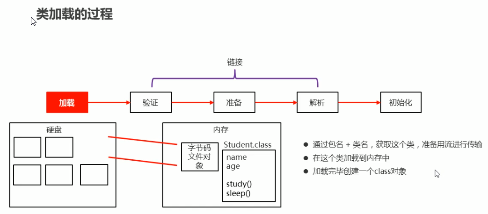
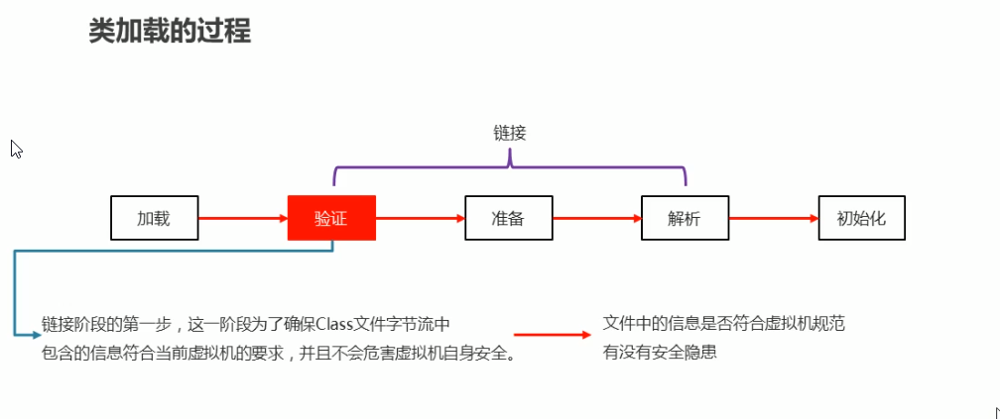
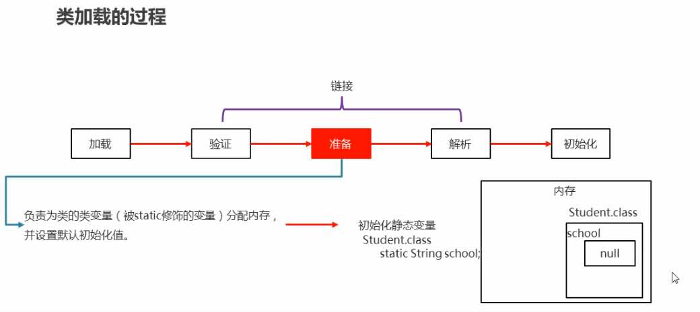
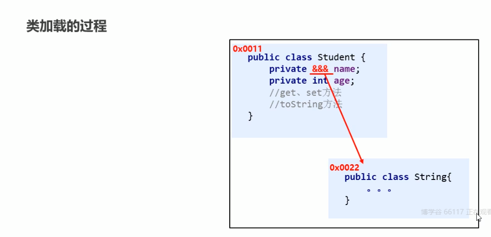
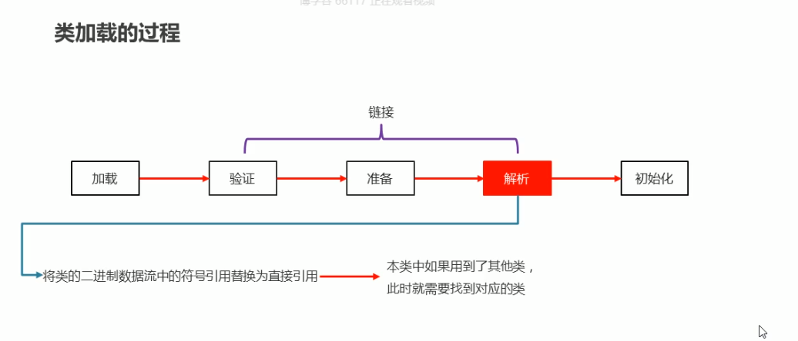

## 类加载时机 

1. 创建类的实例（对象）
2. 调用类的静态方法；
3. 访问类的静态变量；
4. 使用反射方式来创建某个类或者接口对应的java.lang.Class对象（字节码对象）
5. 创建子类的对象；
6. 直接使用java.exe命令来运行某个主类；

​	总结： **用到就加载， 不用不加载**

## 类加载过程

### 1- 加载

- 通过包名+类名，获取这个类，准备用流进行传输；

- 把这个类加载到内存中；

- 加载完毕创建一个Class对象（字节码对象）；

  任何类被使用时，系统都会为之建立一个java.lang.Class对象；

- 如图：

### 2-1 链接-验证

- 验证文件中的信息释放符合虚拟机规范，有没有安全隐患；

- 如图：

  

### 2-2 链接-准备

- 初始化静态变量
- 如图：

### 2-3 链接-解析

- 将类的二进制数据流中的符号引用替换为直接引用；（本类中如果使用到了其它类，此时就需要找到对应的类）
- 如图：

### 3- 初始化

- 给静态变量赋值以及初始化其它资源；

## 类加载器的分类

- 启动类加载器（Bootstrap ClassLoader）

  虚拟机内置的类加载器；

- 平台类加载器（Platform ClassLoader)

  负责加载JDK中一些特殊的模块；

- **系统类加载器** （System ClassLoader)

  负责加载用户类路径上所指定的类库；