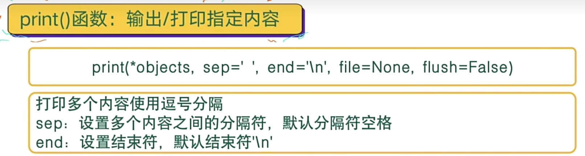

# 输出

## 0- print函数介绍




## 1- 普通输出

``` python
name = "Tom"
age = 29

print("name = ",name,";age = ",age)

结果：
	name =  Tom ;age =  29

```


## 2- 占位符输出

``` python
name = "Tom"
age = 29

print("name = %s ;age = %s" %(name,age))

结果：
	name =  Tom ;age =  29
```


```python

year = 2024
month = 2
day = 20
week = "一"
weather = "晴"
temp = 19.4

# %02d 表示 占用2个字符， 不够的用 0 填充
# %.2f 表示 保留小数点2位 
print("%d年 %02d 月 %2d 日 ; 星期%s 天气:%s 温度 %.2f"%(year,month,day,week,weather,temp))
print("{}年 {} 月 {} 日 ; 星期{} 天气:{} 温度 {}".format(year,month,day,week,weather,temp))

结果：
2024年 02 月 20 日 ; 星期一 天气:晴 温度 19.40
2024年 2 月 20 日 ; 星期一 天气:晴 温度 19.4
```


## 3- 格式化输出 format    和  f 

``` python
name = "Tom"
age = 29

print("name = {} ;age = {}".format(name,age))
print("name = {0} ;age = {1}".format(name,age))
print("age = {1} ;name = {0}".format(name,age))

结果：
	name = Tom ;age = 29
	name = Tom ;age = 29
	age = 29 ;name = Tom
```

``` python
name = "Tom"
age = 29

print(f"name = {name} ;age = {age}")
```


## 4- 指定结束符输出

``` python
name = "Tom"
age = 29

# end 默认是"/n"
print("name = ",name,end=";")
print("age = ",age,end=";")
print()

for i in range(10):
    if i < 9:
        print(i,end= "#")
    else:
        print(i)
        
结果：
	name =  Tom;age =  29;
	0#1#2#3#4#5#6#7#8#9
```


## 5- r/R字符串原样输出

``` python
rint("hello\tworld")
print("hello\nworld")
print(r"hello \t \n world")


结果：
	hello	world
  hello
  world
  hello \t \n world
```


## 6- 模板输出

``` python
name = input("请输入您的姓名：")
age = input("请输入您的年龄：")
job = input("请输入您的工作：")
hobbie = input("请输入您的爱好：")

msg = '''
---------info of %s--------
Name    : %s
Age     : %s
Job     : %s
Hobbie  : %s
------------ end -----------
''' % (name , name, age, job, hobbie)

print(msg)


  结果
  请输入您的姓名：Tom
  请输入您的年龄：29
  请输入您的工作：IT
  请输入您的爱好：girl

  ---------info of Tom--------
  Name    : Tom
  Age     : 29
  Job     : IT
  Hobbie  : girl
  ------------ end -----------
```


## 7- 输出到文件

``` python
strFile = "写入文件中"
fileFp = open("file.txt","a+")
print(strFile,file = fileFp)
fileFp.close()

结果：
	创建一个file.txt 文件，并将“写入文件中” 写入file.txt 
```


