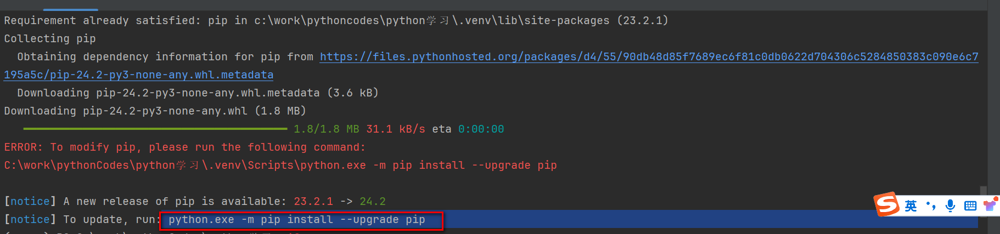
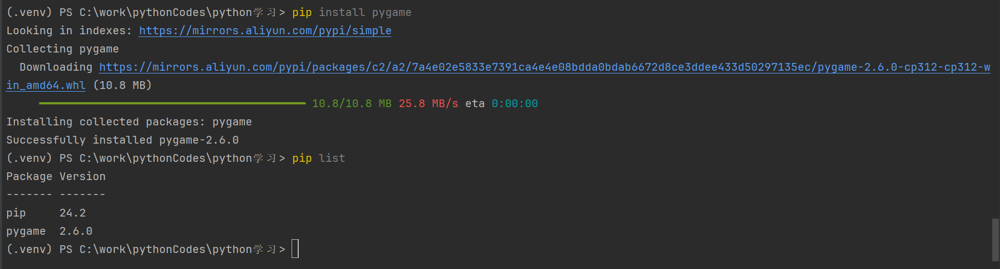
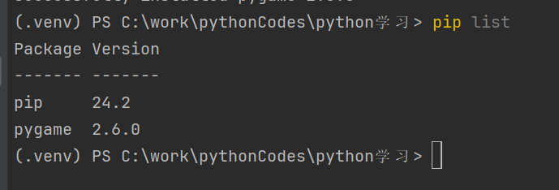
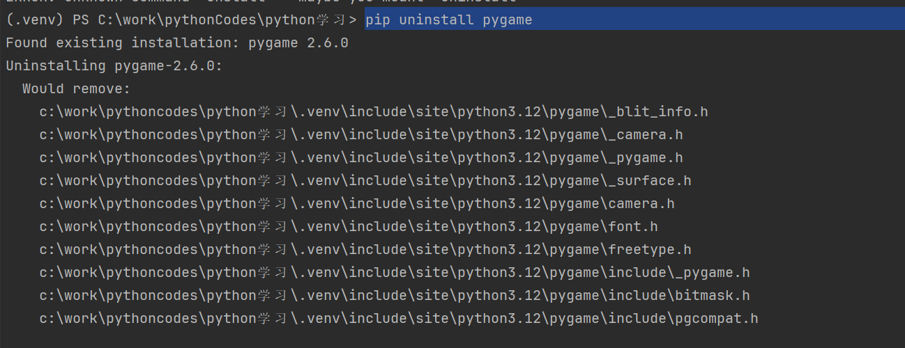

# 1- 更新pip

```shell
python.exe -m pip install --upgrade pip
```




# 2- 设置下载第三方库的源

``` shell
pip config set global.index-url https://mirrors.aliyun.com/pypi/simple


pip config get global.index-url                                       
https://mirrors.aliyun.com/pypi/simple


```


# 3- 安装第三方库

```shell
pip install xxxxxx
```




# 4- 查看安装了哪些第三方库

```shell
pip list
```



# 5- 卸载第三方库

```shell
pip uninstall xxxxx
```




