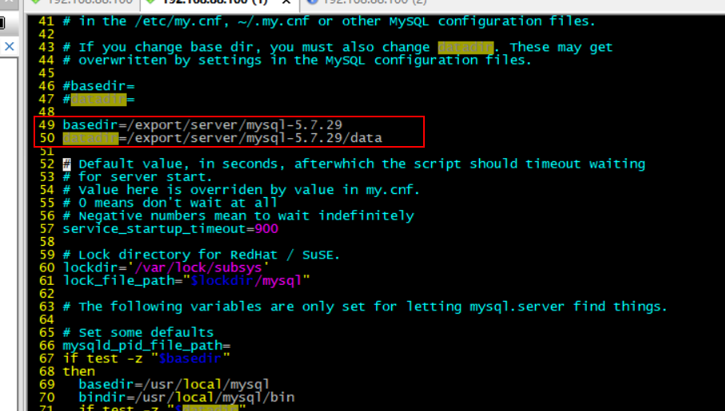

## 安装Mysql (centOS7.7 系统)
注意!!!!!，在安装Mysql之前，给虚拟机保存一个快照，一旦安装失败，可以恢复快照，重新安装!


- 查看MySQL是否安装

``` shell
rpm -qa|grep mysql

rpm -e --nodeps 

```


- 0、安装之前需要在Linux上提前创建三个目录:


``` python
mkdir -p /export/software  #软件包存放目录
mkdir -p /export/server    #安装目录
mkdir -p /export/data      #数据存放目录
```


- 1、解压mysql安装包

``` sql
将MySQL的安装包提前上传到Linux的/export/software目录

cd /export/software
tar  -zxvf mysql-5.7.29-linux-glibc2.12-x86_64.tar.gz -C /export/server/
```


- 2、重命名　

``` sql
cd /export/server
mv mysql-5.7.29-linux-glibc2.12-x86_64  mysql-5.7.29
```


- 3、添加用户组与用户

``` sql
groupadd mysql
useradd -r -g mysql mysql
```


- 4、修改目录权限

``` sql
chown -R mysql:mysql /export/server/mysql-5.7.29/
```


- 5、配置mysql服务

``` sql
cp /export/server/mysql-5.7.29/support-files/mysql.server /etc/init.d/mysql
```


- 6、修改mysql配置文件

``` sql
1）修改/etc/init.d/mysql文件
vim /etc/init.d/mysql

将该文件的basedir和datadir路径修改为以下内容
basedir=/export/server/mysql-5.7.29
datadir=/export/server/mysql-5.7.29/data

2）修改配置文件my.cnf
修改/etc/my.cnf文件
vim /etc/my.cnf
将/etc/my.cnf原来的内容全部删除，然后将以下内容复制进去.
[client]
	port=3306
	default-character-set=utf8
	[mysqld]
	basedir=/export/server/mysql-5.7.29
	datadir=/export/server/mysql-5.7.29/data
	port=3306
	character-set-server=utf8
default_storage_engine=InnoDB
```




- 7、初始化mysql

```sql
/export/server/mysql-5.7.29/bin/mysqld --defaults-file=/etc/my.cnf --initialize --user=mysql --basedir=/export/server/mysql-5.7.29 --datadir=/export/server/mysql-5.7.29/data

执行该命令之后，会生成一个mysql的临时密码,这个密码后边要使用。  (dYdurh=s9#7

```


- 8、启动服务

``` sql
service mysql start
```


- 9、登录mysql

``` sql
使用第7步生成的临时密码
/export/server/mysql-5.7.29/bin/mysql -uroot -p临时密码

请注意，如果回车之后临时密码报错，则可以执行以下指令，然后手动输入临时密码:
/export/server/mysql-5.7.29/bin/mysql -uroot -p
```


- 10、修改密码

``` sql
注意这条命令是在登录mysql之后执行
set password=password('123456');
```


- 11、开启远程访问权限

``` sql
注意这条命令是在登录mysql之后执行

GRANT ALL PRIVILEGES ON *.* TO 'root'@'%' IDENTIFIED BY '123456'; 
flush privileges;
```


- 12、修改环境变量

``` sql
退出mysql,然后修改Linux的/etc/profile文件
vim /etc/profile

在该文件末尾最后添加以下内容
export MYSQL_HOME=/export/server/mysql-5.7.29
export PATH=$PATH:$MYSQL_HOME/bin
```


- 12、配置文件生效

``` sql
保存修改之后，让该文件的修改生效
source /etc/profile
```


- 13、将mysql设置为开机启动

``` sql
chkconfig --add mysql  #mysql服务到自启服务
chkconfig mysql on #设置自启
```


- 14-1、关闭防火墙

``` shell
systemctl stop firewalld.service          #停止firewall
systemctl disable firewalld.service       #禁止firewall开机启动
```


- 14-2、查看防火墙 dead 状态

``` shell
[root@tanghui ~]# systemctl status firewalld.service
● firewalld.service - firewalld - dynamic firewall daemon
   Loaded: loaded (/usr/lib/systemd/system/firewalld.service; disabled; vendor preset: enabled)
   Active: inactive (dead)
     Docs: man:firewalld(1)
[root@tanghui ~]# 

```


- 15、关闭Selinux

``` sh
编辑虚拟机的Selinux的配置文件.

vim /etc/selinux/config 
修改以下参数:
#该选项默认是: SELINUX=enforcing,修改为以下值
SELINUX=disabled
```


- 16、使用Mysql的连接工具远程连接到Mysql