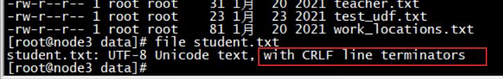
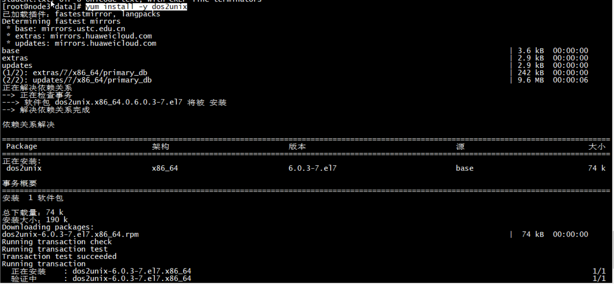

# shell编程


## 变量


### 变量赋值
``` shell
	name="Tom" ## 注意:等号两边不能有空格
	
	
```

### 从键盘获取变量值

``` shell
	read name ## 从键盘获取变量
	read -p "Please input you name：" name ## 从键盘输入变量值(有提示信息)
	
```

### 执行一个命令后获取变量值

``` shell
	pwdStr=$(pwd)  #$() 执行一个命令
	datestr=`date`  #反引号 执行一个命令
```


### 只读变量 readonly 

``` shell
#!/bin/bash

readonly myUrl="http://www.baidu.com"

echo "myUrl=${myUrl}"

```


### 删除变量unset

``` shell
#!/bin/bash

name="Tom"
echo ${name}

unset name

echo ${name}

结果：
[root@node01 shell]# sh unset.sh 
Tom

[root@node01 shell]# 

```


### 环境变量
```sh
/ect/profile  # 环境变量配置文件

env # 查看环境变量

export MY_SHELL_HOME=/export/shell   #自定义环境变量

export PATH=%MY_SHELL_HOME%:$PATH	#将自定义的环境变量添加到path中

source /etc/profile
```


### 特殊变量

| 变量 | 介绍                                                      |
| ---- | --------------------------------------------------------- |
| $#   | 参数个数（脚本除外）                                      |
| $n   | $1 : 第一个参数<br>$2: 第二个参数<br>...<br>$n：第n个参数 |
| $0   | 脚本本身                                                  |
| $?   | 前一个命令或函数的返回码                                  |
| $*   | 以“参数1 参数2 ...”形式保存所有参数                       |
| $@   | 以“参数1” “参数2” "..." "..."形式保存所有参数             |
| $$   | 本程序的进程ID  (PID)                                     |
| $!   | 上一个命令的PID                                           |


#### 案例


``` shell

#!/bin/bash
# $0 $n $# $$ $@ $* $!

echo '$0 = '${0}
echo '$# = '${#}

echo '$1 = ' ${1}
echo '$2 = ' ${2}
echo '$3 = ' ${3}
echo '$4 = ' ${4}
echo '$* = ' $*
echo '$@ = ' $@
echo '$$ = ' $$
echo '$! = ' $!

结果：
[root@node01 shell]# specialVar.sh  aaa bbb ccc ddd
$0 = ./specialVar.sh
$# = 4
$1 =  aaa
$2 =  bbb
$3 =  ccc
$4 =  ddd
$* =  aaa bbb ccc ddd
$@ =  aaa bbb ccc ddd
$$ =  3611
$! = 
[root@node01 shell]# 


```


### $() 执行一个命令

``` shell
[root@node01 shell]# echo ${str3}
hello and world
[root@node01 shell]# echo $(expr substr "${str3}" 7 3)
and
[root@node01 shell]# 

```


### ${} 使用一个变量


## 字符串

### 字符串拼接

``` shell
#!/bin/bash
str1="hello"
str2="world"
str3=${str1}" and "${str2}

echo ${str1}
echo ${str2}
echo ${str3}
结果：
[root@node01 shell]# sh strcat.sh 
hello
world
hello and world
```


### 字符串切片01  ${str:start:count}

start : 从第几个字符开始切 （从0 开始数）

count:截取多少个字符

``` shell
#!/bin/bash

str="hello and world"

substr1=${str:6:3}
echo ${substr1}

```


### 字符串切片02   ``  expr substr 

n+1 :  从第几个字符开始切 ( 从1开始数)

count:截取多少个字符

``` shell
#!/bin/bash

str="hello and world"

substr1=`expr substr "${str}" 7 3`
echo ${substr1}

```


### 字符串切片03 $( expr substr)

n+1 :  从第几个字符开始切 ( 从1开始数)

count:截取多少个字符

``` shell
#!/bin/bash

str="hello and world"

substr1=$(expr substr "${str}" 7 3)
echo ${substr1}

```


### 字符串长度 01 - 方法 length

``` shell
#!/bin/bash

str="hello and world"

length=$(expr length "${str}")
echo ${length}

结果：
[root@node01 shell]# sh strlength.sh 
15
[root@node01 shell]# 
```


### 字符串长度02 - ${# }

``` shell
#!/bin/bash

str="hello and world"
length2=${#str}
echo ${length2}

结果：
[root@node01 shell]# sh strlength.sh 
15
[root@node01 shell]# 
```


### 从开头处开始删除字符串
``` shell
${str#x*y}   ## 删除x到y 最短的子字符串 (x必须是开头字符，可以不写)
${str#*y}   ## 删除x到y 最短的子字符串 (x必须是开头字符，可以不写)

${str##x*y}  ## 删除x到y 最长的子字符串(x必须是开头字符，可以不写)
${str##*y}  ## 删除x到y 最长的子字符串(x必须是开头字符，可以不写)


#!/bin/bash

str="hello and world"

# 删除最短的子字符串
newstr1=${str#h*o}
newstr2=${str#*o}       # 首字符'h'可以不写

echo ${newstr1}
echo ${newstr2}


# 删除最长的子字符串
newstr3=${str##h*o}
newstr4=${str##*o}   # 首字符'h'可以不写

echo ${newstr3}
echo ${newstr4}

结果：
[root@node01 shell]# sh strdelete.sh 
and world
and world
rld
rld
[root@node01 shell]# 
```


### 字符串替换

``` shell
${str/substr/newstr}  ## 替换第一次出现的substr 为newstr
${str//substr/newstr} ## 替换所有的substr 为newstr
如果不写newstr 可以删除substr

#!/bin/bash
str="you and you with me"

substr1=${str/you/your}         # 将第一个you 替换成your
substr2=${str//you/your}        # 将所有的you替换成your

echo ${substr1}
echo ${substr2}

结果
[root@node01 shell]# sh strreplace.sh 
your and you with me
your and your with me
[root@node01 shell]# 


```


### 字符串查找子字符串

**（哪个字母先出现就计算哪个）**

``` shell
#!/bin/bash
string="i am a boy"   # 
echo `expr index "$string" io`  # i先找到 所以输出1

结果：
1
```


## 算术运算符

有思种方式

1-  `expr ${变量名称1}  运算符  ${变量名称2} ``

2- $(expr ${变量名称1}  运算符  ${变量名称2})

3- $((变量名称1 运算符 变量名称2))

4- $[变量名称1 运算符 变量名称2]


### 案例


``` shell

#!/bin/bash
a=4
b=20
## 或者
## a="4"
## b="20"

# 加法
echo "a + b = "`expr ${a} + ${b}`
echo "a + b = "$((a+b))
echo "a + b = "$[a+b]
echo "************************"

# 减法
echo "b - a = "`expr ${b} - ${a}`
echo "b - a = "$((b-a))
echo "b - a = "$[b-a]
echo "************************"

## 乘法
echo "a * b = "`expr ${a} \* ${b}`  # 陈法需要使用转义字符串\ 
echo "a * b = "$((a*b))
echo "a * b = "$[a*b]
echo "************************"

## 除法
echo "b / a = "`expr ${b} / ${a}`
echo "b / a = "$((b/a))
echo "b / a = "$[b/a]
echo "************************"


```


## 流程控制

### 语句判断

#### 数字

| 运算符 | 说明              |
| ------ | ----------------- |
| -eq    | 相等 ： true      |
| -ne    | 不等 :    true    |
| -gt    | 大于 :    true    |
| -lt    | 小于 :    true    |
| -ge    | 大于等于 : true   |
| -le    | 小于等于 :   true |

``` shell
#!/bin/bash
a=102
b=102


if [ ${a} -eq ${b} ];then    	## -eq 等于
	echo "a==b"
elif [ ${a} -gt ${b} ];then		## -gt 大于
	echo "a>b"
elif [ ${a} -lt ${b} ];then		## -lt 小于
	echo "a<b"
else
	echo "error"
	
fi

if [ ${a} -ge ${b} ] ; then    ## 大于等于
	echo "a>=b"
else	
	echo "error"
fi 

if [ ${a} -le ${b} ] ; then  	## 小于等于
	echo "a<=b"
else	
	echo "error"
fi

```


#### 字符串

| 判断符    | **说明**               |
| --------- | ---------------------- |
| -n STRING | 字符串长度不为零       |
| -z STRING | 字符串长度为0          |
| =         | 两个字符串一样: true   |
| !=        | 两个字符串不一样: true |

``` shell
#!/bin/bash

name1="tanghui"
name2="TangHui"
name3="tanghui"

if [ ${name1} != ${name2} ];then
	echo "name1 不等于 name2"

else
	echo "name1 等于 name2"
fi

if [ ${name1} = ${name3} ];then
	echo "name1 等于 name3"

else
	echo "name1 不等于 name3"
fi


str1=""
str2="hello"

if [ ${str1} ] ; then
	echo "str1 长度不为0"
else
	echo "str1 长度为0"
fi


if [ ${str2} ] ; then
	echo "str2 长度不为0"
else
	echo "str2 长度为0"
fi
	
```


#### 文件

| 判断符 | 说明               |
| ------ | ------------------ |
| -f     | 存在且是普通文件   |
| -d     | 存在且是目录       |
| -h     | 存在且是符号链接   |
| -e     | 文件存在           |
| -r     | 文件存在且可读     |
| -w     | 文件存在且可写     |
| -x     | 文件存在且儿可执行 |

``` shell
#!/bin/bash

# 文件判断

dir="/root/work/study"

if [ -e ${dir} ]; then   # -e 判断文件是否存在
	echo "文件存在"
else
	echo "文件不存在"
	mkdir -p ${dir}
fi


file2="/export/shell/test"
if [ -d ${file2} ] ; then 				# -d 判断目录是否存在
	echo "目录存在"
else 
	echo "目录不存在"
fi


file1="/export/shell/iftest03"
if [ -f ${file1} ] ; then  				# -f 判断文件存在且是普通文件
	echo "文件存在且是普通文件"
else
	echo "文件不存在"
fi

if [ -r ${file1} ] ; then 				# -r 判断文件存在且课读
	echo "文件存在且可读"

fi

if [ -w ${file1} ] ;then 				# -w 判断文件存在且课写
	echo "文件存在且可写"
fi

if [ -x ${file1} ] ;then 				# -x 判断文件存在且课执行
	echo "文件存在且可执行"
fi


```


### if 语法

**注意： if 后面的 [  ] 内部两边必须要有空格**

``` shell
if [ condition1 ]
then
    command1
elif [ condition2 ] 
then 
    command2
else
    commandN
fi
```


``` shell
if [ condition1 ]; then
    command1
elif [ condition2 ]; then 
    command2
else
    commandN
fi
```


#### 案例


输入您的分数输出您的成绩是 优良中差


``` shell
#!/bin/bash

read -p "Please enter you score[1-100]:" score  #-p参数表示给出提示信息
info="你的成绩是"

echo ${score}

if [ ${score} -le 100 ] && [ ${score} -ge 80 ] ; then

	info=${info}"优"
	
elif [ ${score} -lt 80 ] && [ ${score} -ge 70 ]	; then

	info=${info}"良"
	
elif [ ${score} -lt 70 ] && [ ${score} -ge 60 ] ; then 

	info=${info}"中"
	
else 

	info=${info}"差"
	
fi

echo ${info}
	

```


### for循环

#### 语法1 in

``` shell
for 变量 in 值1 值2 值3…
do
程序
done
```


#### 案例1

``` shell
#!/bin/bash

# 定义一个数组
arrs=("java" "python" "C#" "C++" "C" "shell" "scala" "PHP")

# 遍历数组
for language in ${arrs[@]}
do
	echo ${language}

done
```


#### 语法2((  ))

``` shell
for ((初始值；循环控制条件；变量变化)）
do
程序
done
```


#### 案例2

``` shell
#!/bin/bash

# 定义一个数组
arrs=("java" "python" "C#" "C++" "C" "shell" "scala" "PHP")

# for (())  遍历数组
for (( i=0 ; i<${#arrs[*]} ;i++ ))
do 
	echo  ${arrs[${i}]}
done

```


### while循环

#### 语法1

``` shell
while 条件
do
    程序
done
```


#### 案例

``` shell
#!/bin/bash

# 定义一个数组
arrs=("java" "python" "C#" "C++" "C" "shell" "scala" "PHP")


#while 遍历数组
i=0
while [ ${i} -lt ${#arrs[*]} ]
do
	echo ${arrs[${i}]}
	let i++
done


#while 遍历数组
i=0
while (( i<${#arrs[@]} ))
do
	echo ${arrs[${i}]}
	let i++
done
```


### 死循环 -- 语法

#### 语法1

``` shell
for (( ; ; ))
do

done
```


#### 语法2

``` shell
while :
do 

done
```


#### 语法3

``` shell
while true
do 

done
```


### case语句

#### 语法

``` shell
case 值 in
模式1)
    sql command1 	# 执行命令列表1
    ;;			 	# 结束模式1
模式2)
    sql command2 	# 执行命令列表2
    ;;				# 结束模式2
   *)				# default 
   	sql command3 	# 执行命令列表3
    ;;
esac				# case 结束
```

#### 案例

``` shell

```


## shell系统函数

### date日期

``` sql
date +'%Y-%m-%d %H:%M:%S'   -- 以特定的格式输出当前的日期
date -d '-1 week' +'%Y-%m-%d %H:%M:%S'   	-- 1周前
date -d '-1 day' +'%Y-%m-%d %H:%M:%S'		-- 1天前
date -d '-2 min'  +'%Y-%m-%d %H:%M:%S'		-- 1分钟前
date -d '-2 hour'  +'%Y-%m-%d %H:%M:%S'		-- 2小时前
```

 


## 自定义函数

### 语法

``` shell
[ function ] funname()
{
    action;
    [return int;]
}
```


### 函数参数


### 函数带 return 状态

​	return status ;

​	status:  并不是函数的返回值， 而是表示函数执行的状态，取值范围：0-65535；

​	基本没有


### 函数返回值

​	echo ${变量名称}    # 就是把这个变量作为一个返回值返回出去。

​	如果有多个 echo xxxx,  那么将叠加多有的内容一起返回给调用者


### 案例

#### 定义一个函数并进行调用

``` shell
#!/bin/bash

# 定义一个 函数 testfun
function testfun(){
	
	echo "hello testfun"
	
}

echo "start ...."
testfun				#调用函数testfun
echo "end ...."

结果：
[root@tanghui shell]# sh funtest
start ....
hello testfun
end ....
[root@tanghui shell]# 
```


#### 定义一个带参数的函数

``` shell
#!/bin/bash

# 定义一个 函数 testfun
function testfun(){
	
	echo $1
	echo $2
	echo "hello testfun"
	
}


echo "start ...."
testfun 100 200     ## 传递参数
echo "end ...."

结果：
[root@tanghui shell]# sh funtest
start ....
100
200
hello testfun
end ....

```


#### 定义一个带有return状态码的函数

``` shell
#!/bin/bash

# 定义一个 函数 testfun
function testfun(){
	
	echo $1
	echo $2
	echo "hello testfun"
	if [ $1 -eq $2 ] ; then
		return 0				# 返回状态码
	else
		return 1				# 返回状态码
	fi
	
}


echo "start ...."
testfun $1 $2					## 传递参数
echo "testfun 函数的返回状态码是:"$?
echo "end ...."


结果1：
[root@tanghui shell]# sh funtest 100 100
start ....
100
100
hello testfun
testfun 函数的返回状态码是:0
end ....
[root@tanghui shell]# 

结果2：
[root@tanghui shell]# sh funtest 100 200
start ....
100
200
hello testfun
testfun 函数的返回状态码是:1
end ....
[root@tanghui shell]# 

```


#### 定义一个带返回值的函数

``` shell
#!/bin/bash

# 定义一个 函数 testfun
function testfun(){
	
	
	if [ $1 -eq $2 ] ; then
	
		echo $(( $1 + $2 ))   	# 返回值
		return 0				# 返回状态码
	else
		
		echo $(( $2 - $1 ))		# 返回值
		return 1				# 返回状态码
	fi
	
}


echo "start ...."
result=$(testfun $1 $2)					## 传递参数
status=$?
echo "testfun 函数的返回状态码是:"${status}
echo "testfun 函数的返回值是:"${result}
echo "end ...."

结果1：
[root@tanghui shell]# sh funtest 100 200
start ....
testfun 函数的返回状态码是:1
testfun 函数的返回值是:100
end ....

结果2：
[root@tanghui shell]# sh funtest 100 100
start ....
testfun 函数的返回状态码是:0
testfun 函数的返回值是:200
end ....
[root@tanghui shell]#
```


## 数组

- 数组元素的下标由0开始;

- Shell 数组用括号来表示，元素用 "**空格**" 符号分割开，语法格式如下：

  ​	array_name=(value1 ... valuen)

#### 语法

``` shell
#!/bin/bash

my_array=("A" "B" "C" "D")

#我们也可以使用下标来定义数组:

array_name[0]=value0

array_name[1]=value1

array_name[2]=value2
```


#### 读取数组

``` shell
${array_name[index]}
```


#### 案例

``` shell
请看遍历数组的案例
```


#### 获取数组的长度

``` shell
${#my_array[*]} ## 方式一
${#my_array[@]} ## 方式二
```


#### 获取数组中的所有元素

``` shell
${my_array[*]} ## 方式一
${my_array[@]} ## 方式二
```


#### 遍历数组--案例

``` shell
#!/bin/bash

arrs=("java" "C" "C++" "object-C" "shell" "python")
arrs[${#arrs[@]}]="scala"

# 普通for 循环遍历
echo "普通for 循环遍历"
for (( i=0 ; i<${#arrs[@]} ; i++ ))
do
	echo ${arrs[${i}]}
done


# 增强for 循环 遍历
echo "增强for 循环 遍历"
for language in ${arrs[@]}
do
	echo ${language}
done

# while 循环遍历
echo "while 循环遍历1111111"
i=0
while (( i< ${#arrs[@]} ))
do
	
	echo ${arrs[${i}]}
	let i++
done


# while 循环遍历
echo "while 循环遍历2222"
i=0
while [ ${i} -lt ${#arrs[@]} ]
do
	
	echo ${arrs[${i}]}
	let i++
done
```


## select

**注意**

- select 是个无限循环，因此要记住用 **break** 命令退出循环，或用 **exit** 命令终止脚本

#### 语法

``` shell

select var in ... ;
do
　commond
　break
done
.... now $var can be used ...

```


#### 案例 select + case

``` shell
#!/bin/bash

echo "Please chose you Language"
PS3="you have chosed :"   # 选择提示语

## 注意： select 是个无限循环，因此要记住用 **break** 命令退出循环，或用 **exit** 命令终止脚本
select var in "java" "python" "PHP" "shell"    
do
	# case 语句
	case ${var} in
	"java")
		echo "java"
		;;
	"python")
		echo "python"
		;;
	"PHP")
		echo "PHP"
		;;
	"shell")
		echo "shell"
		;;
	*)
		echo "you have chose error,please try again"
		continue
		;;
	esac   # case结束
	
break   ## 注意： select 是个无限循环，因此要记住用 **break** 命令退出循环，或用 **exit** 命令终止脚本
done


```


## 引用其它文件 . 或 source 


#### 语法

``` shell
. filename   # 注意点号(.)和文件名中间有一空格
或
source filename 
```

#### 案例

- myfile

``` shell
#!/bin/bash

# 数组
myarray=("java" "python" "C" "C++" "object-C" "shell")

# 求和函数
function sum(){ 		
	sum=0
	sum=$(( $1 + $2 ))
	echo ${sum}
	return 100
}

```

- 调用者

``` shell
#!/bin/bash

source ./myfile

## 遍历myfile 中的数组
for var in ${myarray[@]}
do
	echo ${var}
done

## 遍历myfile 中的数组
for (( i=0 ; i<${#myarray[@]} ; i++ ))
do
	echo ${myarray[${i}]}
done

# 调用sum函数
getSum=$(sum $1 $2)

# 获取sum函数状态码
status=$?

# 打印
echo "100 + 200 = "${getSum}
echo "status = "${status}

```


## 定时执行 crontab -e  corntab -e 

\*  ：代表所有可能的值，例如month字段如果是星号，则表示在满足其它字段的制约条件后每月都执行该命令操作;
?   :  字符仅被用于 **天** 和 **星期** 两个子表达式，表示不指定值;
,   ：可以用逗号隔开的值指定一个列表范围，例如，“1,2,5,7,8,9”
\-   ：可以用整数之间的中杠表示一个整数范围，例如“2-6”表示“2,3,4,5,6”
/   ：可以用正斜线指定时间的间隔频率 , 例如*/10，如果用在minute字段，表示每十分钟执行一次。

### 实例

``` shell
秒（0~59）----  # 没有实现
分（0~59） 
时（0~23）
日（1~31，但是你需要考虑你月的天数）
月（1~12）
周（0~6 0=SUN 或 SUN，MON，TUE，WED，THU，FRI，SAT）
年（1970－2099）

"* * * * *"         	#每隔一分钟触发
"15 * ? * *"       		#每小时的第15分触发
"15 10 ? * *"      		#每天上午10:15触发
"15 10 * * ?"      		#每天上午10:15触发
"* 14 * * ?"       		#在每天下午2点到下午2:59期间的每1分钟触发
"0/5 14 * * ?"     		#在每天下午2点到下午2:55期间的每5分钟触发
"0/5 14,18 * * ?"  		#在每天下午2点到2:55期间和下午6点到6:55期间的每5分钟触发
"0-5 14 * * ?"     		#在每天下午2点到下午2:05期间的每1分钟触发
"10,44 14 ? 3 WED" 		#每年四月的星期三的下午2:10和2:44触发


15 1 * * * /export/data/shell/mysqldump_demo.sh

*/1 * * * * /export/shell/auto_put_logs  每分钟执行一次

* */1 * * * /export/shell/auto_put_logs  每小时执行一次
```


## shell 编程综合案例

### 自动安装jdk

``` shell
#!/bin/bash

## 1- 先卸载centos中自带的jdk

oldjava=$(rpm -qa | grep java)
for old in ${oldjava}
do
	echo "uninstall"${old}
	$(rpm -e -nodeps ${old})
done

## 2- 判断安装目录 /export/servers 目录是否存在，如果存在就直接安装， 如果不存在需要新建一个
installPath="/export/jdkservers/"
softwarePath="/export/software"
if [ ! -d ${installPath} ] ;then
	#$(mkdir -p ${installPath})
	mkdir -p ${installPath}
fi

## 3- 解压jdk
tar -xzvf ${softwarePath}"/"$1 -C ${installPath}

## 4- 拼接jdk安装的全路径
jdk_installSubPath=$(ls ${installPath} | grep jdk)
jdk_installPath=${installPath}${jdk_installSubPath}
echo "jdk 安装全路径:"${jdk_installPath}

## 5- 配置环境变量
pathFile="/etc/profile"

if ! grep "JAVA_HOME" /etc/profile 
then
	
	echo '# my java jdk 环境变量' >> ${pathFile}
	
	echo "export JAVA_HOME="${jdk_installPath} >> ${pathFile}
	
	echo 'export PATH=$JAVA_HOME/bin:$PATH' >> ${pathFile}
fi


## 6- 加载环境变量
source /etc/profile

## 7- 测试
java -version


测试命令：
[root@tanghui export]# jdk_install jdk-8u241-linux-x64.tar.gz 

```


### 自动备份数据

``` shell
#!/bin/bash

# 1- 备份目录
backPath="/export/data/db/"
dateTime=$(date +%Y_%m_%d_%H%M%S)
backFilePath=${backPath}${dateTime}

# 2- 备份文件名称
backFileNmae=${backFilePath}"/"${dateTime}".sql"

# 3- 备份主机 ip 
hostIp=$1

# 4- 备份数据库名称
databaseName=$2

# 5- 数据库用户名
username=$3

# 6- 数据库密码
password=$4


# 7- 如果备份路径不存在就创建
[ ! -d ${backFilePath} ] && mkdir -p ${backFilePath}

# 8- 执行备份命令
mysqldump -u${username} -p${password} --host=${hostIp} ${databaseName} > ${backFileNmae}

# 9- 打包
cd ${backPath}
tar czvf ${dateTime}".tar.gz" ${dateTime}

# 10- 删除临时目录
rm -rf ${dateTime}

# 11- 删除之前的备份文件
find ${backPath} -name "*.tar.gz" -amin +5 -exec rm -rf {} \;

#find ${backPath} -name "*.tar.gz" -amin -5 -exec rm -rf {} \;

#find ${backPath} -name "*.tar.gz" -ntime +10 -exec rm -rf {} \;

#find ${backPath} -name "*.tar.gz" -ntime -10 -exec rm -rf {} \;

echo "备份成功！"


```

### 知识点

``` shell
# 7- 如果备份路径不存在就创建
[ ! -d ${backFilePath} ] && mkdir -p ${backFilePath}

# 8- 执行备份命令
mysqldump -u${username} -p${password} --host=${hostIp} ${databaseName} > ${backFileNmae}

# 9- 打包
tar czvf ${dateTime}".tar.gz" ${dateTime}

# 11- 删除之前的备份文件
find ${backPath} -name "*.tar.gz" -amin +5 -exec rm -rf {} \;
```


# Unix格式转换

- windows 编辑文件上传到Unix后格式转换
- 查看文件编码格式

``` shell
file   文件名称
```




- 安装转换工具

``` shell
yum install -y dos2unix
```



- 转换unix格式

```shell
[root@node3 data]# dos2unix student.txt 
dos2unix: converting file student.txt to Unix format ...
[root@node3 data]# file student.txt 
student.txt: UTF-8 Unicode text
[root@node3 data]# 
```


