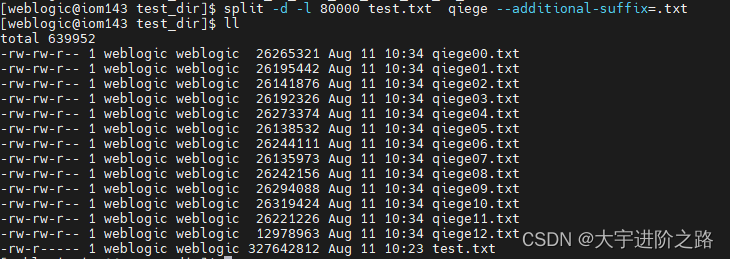

split -a 2 -d -b 22188 out.txt child

# 切割文件

## 按照大小切割

``` shell
split -a 2 -d -b 1M app.log.10 child
-a 2  后缀是2位
-d  后缀是数字
-b 1M 每个文件最大1M
tomcat-bankgw-app.log.10 child     需要切割的文件是tomcat-bankgw-app.log.10，生成的子文件前缀是 "child"

案例：
[hadoop@fdc08 testSplit]$ split -a 2 -d -b 22188 out.txt child     
[hadoop@fdc08 testSplit]$ ll
total 92
-rw-rw-r-- 1 hadoop hadoop 22188 Jun  9 17:13 child00
-rw-rw-r-- 1 hadoop hadoop 22187 Jun  9 17:13 child01
-rw-rw-r-- 1 hadoop hadoop 44375 Jun  9 17:12 out.txt
```


## 按照行数切割

```properties
# 先查看文件有多少行
使用 wc 命令： wc -l 文件名 
例如： wc -l file.txt

split -d -l 80000 test.txt  qiege --additional-suffix=.txt
-d表示切割后的文件按照00,01,02...排序

-l表示按100000行进行切割

test.txt 表示切割的文件

qiege表示切割后文件的前缀名

--additional-suffix=.txt 表示切割后的后缀名
```




# 文件有多少行

```properties
使用 wc 命令： wc -l 文件名 
例如： wc -l file.txt
```


 