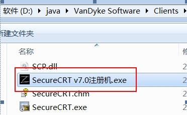
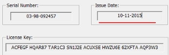

# SecureCRT使用

## 第1章 CRT安装

- 步骤1：安装“scrt_sfx731-x86.exe”

 

 

- 步骤2：欢迎页面

 

 

- 步骤3：如果是64位操作系统，存在此提示。

 

 

- 步骤4：同意许可

 

 

- 步骤5：选择配置文件是否共享（默认）

 

 

- 步骤6：安装类型，自定义

 

 

- 步骤7：选择安装路径

 

 

- 步骤8：快捷方式（默认）

 

 

- 步骤9：开始安装

 

 

- 步骤10：完成

 

 

 

 

 

## 第2章  激活

- 步骤1：将对应的激活程序拷贝到安装目录下

​	

- 步骤2：以“管理员”运行“SecureCRT v7.0注册机.exe”激活程序，打补丁

​	

​	

​	

 

- 步骤3：生成序列号

 

 

 

 

- 步骤4：运行程序，“SecureCRT 7.3”，并输入激活码

 

1）不输入任何内容，下一步

​	

2）点击输入详情选项

​	

3）输入详细内容

​	

​	

​	

 

 

## **第3章**  连接

- l步骤1：登录linux成功之后，输入“ifconfig”查询ip地址

 

 

- 步骤2：运行“SecureCRT.exe”进行连接

 

- 步骤3：保存当次连接

​	

 

- 步骤4：输入密码并连接

 

 

 

## **第4章**  常见设置

l 设置操作窗口“背景黑色”。运行“SecureCRT 7.3”

 

修改后结果

 

l 设置操作窗口“字体”和“字符集”

​	

 

 

 

 