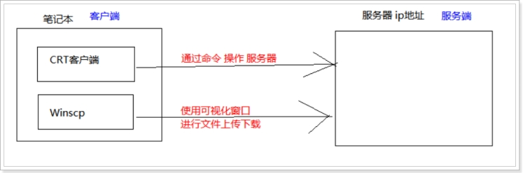
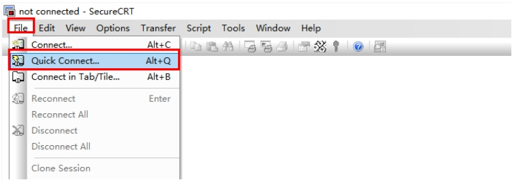
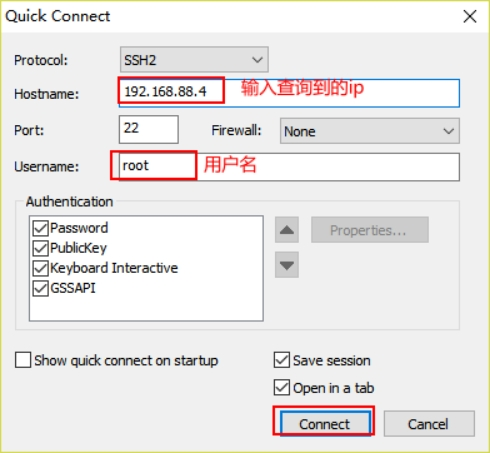
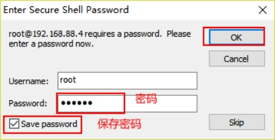
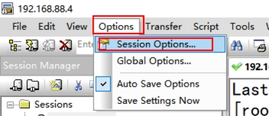
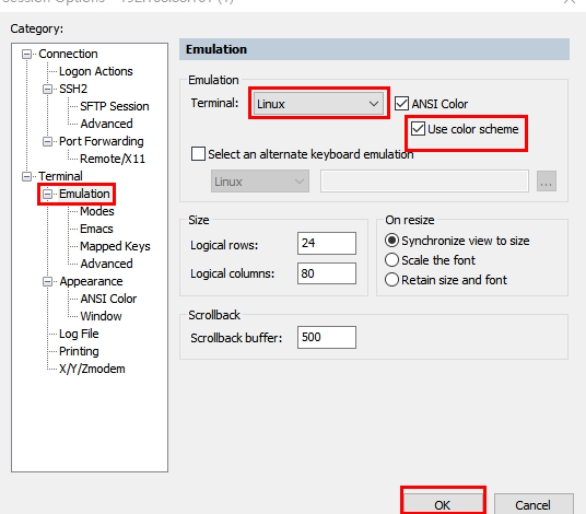
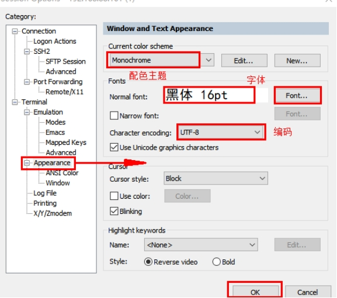
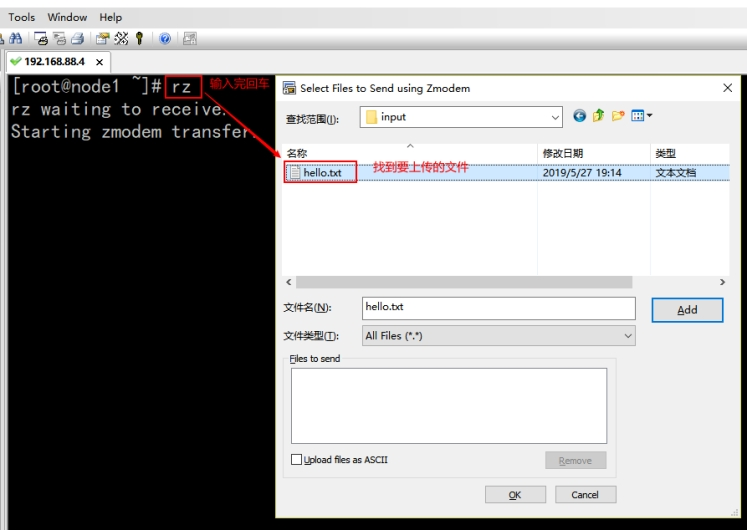
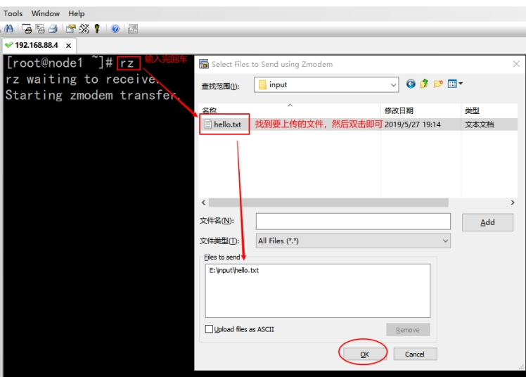
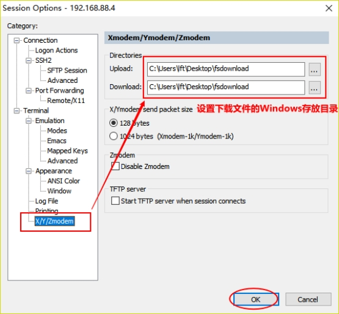

# Linux连接工具CRT使用

## 概述

通常linux都是作为远程服务器存在的。那么我们在自己的机子上如何远程操作服务器端的linux呢？这里一款强大远程连接工具CRT。

 

 

## CRT安装

**参考** :CRT连接linux文档.doc

## 使用步骤

- **1、建立连接**

 

- **2、参数配置**

 

 

- **3、设置主题，颜色和仿真**

 

 

 

 

 

## 文件上传 rz

 

文件上传有多种方式, 此处介绍常用的一种方式

上传方式: 使用linux的上传工具进行上传

1**)** 安装上传工具 **:** 使用yum进行联网下载软件并安装	sudo yum -y install lrzsz

2**)** 使用方式**:**	

2**.**1**)** 输入上传命令**:** rz  弹出上传框	

2**.**2**)** 选择对应文件**,** 点击ok进行上传 上传后文件存储在什么位置上**?**  答**:** 在那个目录下输入的rz**,** 就会将文件存储到那个目录下

 

 

## 文件的下载  sz

- **1）设置windows的下载存放目录:**

 

- **2）下载文件**

 **sz 要下载的文件**

[root@node1 ~]# sz  anaconda-ks.cfg

下载完之后，去之前设置的windows下载目录查看文件即可.