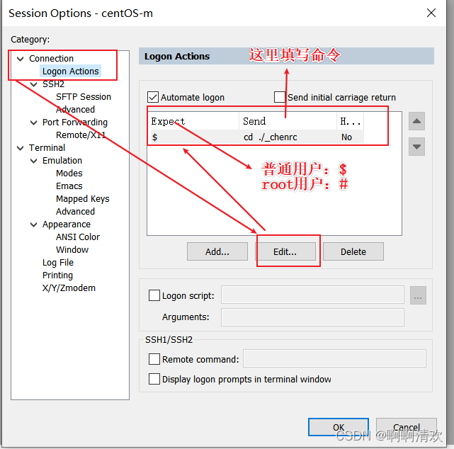
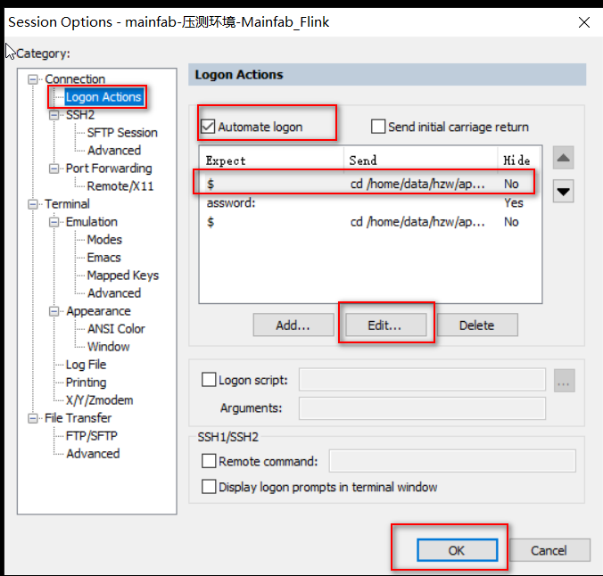

# 怎么设置secureCRT登录并进入指定路径？

## 问题：

- 每次用CRT登录进入机子时，总是得cd 到指定的工作目录，这就很烦了，还好CRT可以设置登录并进入指定目录。

## 解决：

- 点击对应的机子 -> 右键”Properties”

- 点击 “connection” -> 点击 “Logon Actions” -> 选中Automate logon->点击 ”Edit...” 进行编辑；

  

