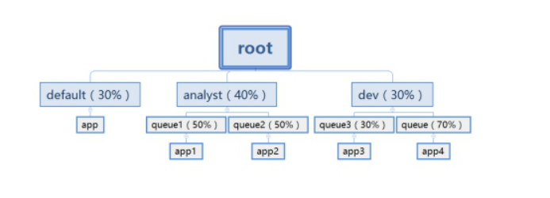

## 1- Yarn通俗介绍


​		Apache Hadoop YARN （Yet Another Resource Negotiator，另一种资源协调者）是一种新的 **Hadoop 资源管理器**，它是一个**通用资源管理系统和调度平台**，可为上层应用提供统一的资源管理和调度，它的引入为集群在**利用率、资源统一管理和数据共享**等方面带来了巨大好处。

​		可以把yarn理解为相当于一个分布式的操作系统平台，而mapreduce等运算程序则相当于运行于操作系统之上的应用程序，Yarn为这些程序提供运算所需的资源（内存、cpu）。

 

- yarn并不清楚用户提交的程序的运行机制

- yarn只提供运算资源的调度（用户程序向yarn申请资源，yarn就负责分配资源）

- yarn中的主管角色叫ResourceManager

- yarn中具体提供运算资源的角色叫NodeManager

- yarn与运行的用户程序完全解耦，意味着yarn上可以运行各种类型的分布式运算程序，比如mapreduce、storm，spark，tez ……

- spark、storm等运算框架都可以整合在yarn上运行，只要他们各自的框架中有符合yarn规范的资源请求机制即可

- yarn成为一个通用的资源调度平台.企业中以前存在的各种运算集群都可以整合在一个物理集群上，提高资源利用率，方便数据共享


## 2- Yarn基本架构


YARN是一个**资源管理**、**任务调度**的框架，主要包含三大模块：

- ResourceManager（RM）**负责所有资源的监控、分配和管理**；
- NodeManager（NM）**负责每一个节点的维护**；
- ApplicationMaster（AM）**负责每一个具体应用程序的调度和协调**。

对于所有的applications，RM拥有绝对的控制权和对资源的分配权。而每个AM则会和RM协商资源，同时和NodeManager通信来执行和监控task。


## 3- Yarn三大组件介绍

### 3-1 ResourceManager

- ResourceManager**负责整个集群的资源管理和分配**，是一个**全局的资源管理系统**。

- NodeManager以**心跳**的方式向ResourceManager汇报资源使用情况（目前主要是CPU和内存的使用情况）。ResourceManager只接受NodeManager的资源回报信息，对于具体的资源处理则交给NodeManager自己处理。

- ResourceManager中的**YARN Scheduler组件**根据application的请求为其分配资源，**不负责具体job的监控、追踪、运行状态反馈、启动等工作**。

  

### 3-2 NodeManager

- NodeManager是每个节点上的**资源和任务管理器**，它是管理这台机器的代理，**负责该节点程序的运行，以及该节点资源的管理和监控**。YARN集群每个节点都运行一个NodeManager。

- NodeManager定时**向ResourceManager汇报本节点资源**（CPU、内存）的使用情况**和Container的运行状态**。当ResourceManager宕机时NodeManager自动连接ResourceManager备用节点。

- **NodeManager接收并处理来自ApplicationMaster的Container启动、停止等各种请求**。


### 3-3 ApplicationMaster

- **用户提交的每个应用程序均包含一个ApplicationMaster**，它可以运行在ResourceManager以外的机器上。

- **负责与ResourceManage调度器协商以获取资源**（用**Container**表示）。

- **将得到的任务进一步分配给内部的任务**(资源的二次分配)。

- 与**NodeManager通信以启动/停止任务**。

- **监控所有任务运行状态，并在任务运行失败时重新为任务申请资源以重启任务**。

## 4- Yarn运行流程


1. **client向RM提交应用程序**，其中包括启动该应用的ApplicationMaster的必须信息，例如ApplicationMaster程序、启动ApplicationMaster的命令、用户程序等。

   

2. **ResourceManager启动一个container用于运行ApplicationMaster**。

   

3. 启动中的ApplicationMaster向ResourceManager**注册自己**，启动成功后**与RM保持心跳**。

   

4. **申请资源**：ApplicationMaster向ResourceManager的**Scheduler**发送请求，申请相应数目的container。

   

5. ResourceManager(Scheduler)返回ApplicationMaster的申请的containers信息。**申请成功的container**，由ApplicationMaster进行初始化。container的启动信息初始化后，AM与对应的NodeManager通信，要求NM启动container。**AM与NM保持心跳**，从而对**NM上运行的任务进行监控和管理**。

   

6. container运行期间，**ApplicationMaster对container进行监控**。**container通过RPC协议向对应的AM汇报自己的进度和状态等信息**。

   

7. 应用运行期间，**client直接与AM通信获取应用的状态、进度更新等信息**。

   

8. 应用运行结束后，**ApplicationMaster向ResourceManager注销自己**，并允许属于它的container被收回。


## 5- Yarn的调度器Scheduler

​		理想情况下，我们应用对Yarn资源的请求应该立刻得到满足，但现实情况资源往往是有限的，特别是在一个很繁忙的集群，一个应用资源的请求经常需要等待一段时间才能的到相应的资源。<span style="color:red;background:white;font-size:20px;font-family:楷体;">**在Yarn中，负责给应用分配资源的就是Scheduler**</span>。其实调度本身就是一个难题，很难找到一个完美的策略可以解决所有的应用场景。为此，Yarn提供了多种调度器和可配置的策略供我们选择。

在Yarn中有三种调度器可以选择：

- FIFO Scheduler ；

- Capacity Scheduler；

- Fair Scheduler；

  

### 5-1 FIFO Scheduler 队列调度器

​		**FIFO Scheduler**把应用按提交的顺序排成一个队列，这是一个**先进先出**队列，在进行资源分配的时候，先给队列中最头上的应用进行分配资源，待最头上的应用需求满足后再给下一个分配，以此类推。


​		FIFO Scheduler是最简单也是最容易理解的调度器，也不需要任何配置，但它并**不适用于共享集群**。大的应用可能会占用所有集群资源，这就导致其它应用被阻塞。在共享集群中，更适合采用Capacity Scheduler或Fair Scheduler，这两个调度器都允许大任务和小任务在提交的同时获得一定的系统资源。


### 5-2 Capacity Scheduler 容量调度器

​		**Capacity 调度器**允许多个组织共享整个集群，每个组织可以获得集群的一部分计算能力。通过为每个组织分配专门的队列，然后再为每个队列分配一定的集群资源，这样整个集群就可以通过设置多个队列的方式给多个组织提供服务了。除此之外，队列内部又可以垂直划分，这样一个组织内部的多个成员就可以共享这个队列资源了，在一个队列内部，资源的调度是采用的是先进先出(FIFO)策略。


<span style="color:red;background:white;font-size:20px;font-family:楷体;">**容量调度器**</span> Capacity Scheduler 最初是由 Yahoo 最初开发设计使得 Hadoop 应用能够被多用户使用，且最大化整个集群资源的吞吐量，现被 IBM BigInsights 和 Hortonworks HDP 所采用。



​		Capacity Scheduler 被设计为**允许应用程序在一个可预见的和简单的方式共享集群资源**，即"作业队列"。Capacity Scheduler 是根据租户的需要和要求把现有的资源分配给运行的应用程序。Capacity Scheduler 同时允许应用程序访问还没有被使用的资源，以确保队列之间共享其它队列被允许的使用资源。管理员可以控制每个队列的容量，Capacity Scheduler 负责把作业提交到队列中。


### 5-3 Fair Scheduler 公平调度器

​		在**Fair调度器**中，我们不需要预先占用一定的系统资源，Fair调度器会<span style="color:red;background:white;font-size:20px;font-family:楷体;">**为所有运行的job动态的调整系统资源**</span>。如下图所示，当第一个大job提交时，只有这一个job在运行，此时它获得了所有集群资源；当第二个小任务提交后，Fair调度器会分配一半资源给这个小任务，让这两个任务公平的共享集群资源。

​		需要注意的是，在下图Fair调度器中，从第二个任务提交到获得资源会有一定的**延迟**，因为它需要等待第一个任务**释放占用的Container**。小任务执行完成之后也会释放自己占用的资源，大任务又获得了全部的系统资源。最终效果就是Fair调度器即得到了高的资源利用率又能保证小任务及时完成。


​		**公平调度器** Fair Scheduler 最初是由 Facebook 开发设计使得 Hadoop 应用能够被多用户公平地共享整个集群资源，现被 Cloudera CDH 所采用。

​		Fair Scheduler 不需要保留集群的资源，因为它会动态在所有正在运行的作业之间平衡资源。


### 5-4 示例：Capacity调度器配置使用

调度器的使用是通过yarn-site.xml配置文件中的

**yarn.resourcemanager.scheduler.class**参数进行配置的，默认采用Capacity Scheduler调度器。

假设我们有如下层次的队列：

root

├── prod

└── dev

  ├── mapreduce

  └── spark

​		下面是一个简单的Capacity调度器的配置文件，文件名为**capacity-scheduler.xml**。在这个配置中，在root队列下面定义了两个子队列prod和dev，分别占40%和60%的容量。

​		需要注意，一个队列的配置是通过属性**yarn.sheduler.capacity.**<queue-path>.<sub-property>指定的，<queue-path>代表的是队列的继承树，如root.prod队列，<sub-property>一般指capacity和maximum-capacity。

``` xml
<configuration>
 <property>
    <name>yarn.scheduler.capacity.root.queues</name>
    <value>prod,dev</value>
  </property>
 <property>
    <name>yarn.scheduler.capacity.root.dev.queues</name>
    <value>mapreduce,spark</value>
  </property>
    <property>
    <name>yarn.scheduler.capacity.root.prod.capacity</name>
    <value>40</value>
  </property>
    <property>
    <name>yarn.scheduler.capacity.root.dev.capacity</name>
    <value>60</value>
  </property>
    <property>
    <name>yarn.scheduler.capacity.root.dev.maximum-capacity</name>
    <value>75</value>
  </property>
  <property>
    <name>yarn.scheduler.capacity.root.dev.mapreduce.capacity</name>
    <value>50</value>
  </property>
   <property>
    <name>yarn.scheduler.capacity.root.dev.spark.capacity</name>
    <value>50</value>
  </property>
</configuration>
```


我们可以看到:

- dev队列又被分成了**mapreduce和spark **两个相同容量的子队列;
- **dev 的maximum-capacity属性被设置成了75%**，所以即使prod队列完全空闲dev也不会占用全部集群资源，也就是说，prod队列仍有25%的可用资源用来应急;
- **可能会占用队列/集群全部资源** : mapreduce和spark两个队列没有设置maximum-capacity属性，也就是说mapreduce或spark队列中的job可能会用到整个dev队列的所有资源（最多为集群的75%）。而类似的，prod由于没有设置maximum-capacity属性，它有可能会占用集群全部资源。


​		关于队列的设置，这取决于我们具体的应用。比如，在MapReduce中，我们可以通过**mapreduce.job.queuename**属性指定要用的队列。如果队列不存在，我们在提交任务时就会收到错误。<span style="color:red;background:white;font-size:20px;font-family:楷体;">**如果我们没有定义任何队列，所有的应用将会放在一个default队列中**</span>。


注意：对于**Capacity调度器**，我们的<span style="color:red;background:white;font-size:20px;font-family:楷体;">**队列名必须是队列树中的最后一部分**</span>，如果我们使用队列树则不会被识别。比如，在上面配置中，我们使用prod和mapreduce作为队列名是可以的，但是如果我们用root.dev.mapreduce或者dev. mapreduce是无效的。


## 6- .关于yarn常用参数设置

``` properties
设置container分配最小内存
yarn.scheduler.minimum-allocation-mb 1024  给应用程序container分配的最小内存

设置container分配最大内存
yarn.scheduler.maximum-allocation-mb 8192 给应用程序container分配的最大内存

设置每个container的最小虚拟内核个数
yarn.scheduler.minimum-allocation-vcores 1 每个container默认给分配的最小的虚拟内核个数

设置每个container的最大虚拟内核个数
yarn.scheduler.maximum-allocation-vcores 32 每个container可以分配的最大的虚拟内核的个数

设置NodeManager可以分配的内存大小
yarn.nodemanager.resource.memory-mb 8192 nodemanager 可以分配的最大内存大小，默认8192Mb

定义每台机器的内存使用大小
yarn.nodemanager.resource.memory-mb 8192

定义交换区空间可以使用的大小
交换区空间就是讲一块硬盘拿出来做内存使用,这里指定的是nodemanager的2.1倍
yarn.nodemanager.vmem-pmem-ratio 2.1 
```

