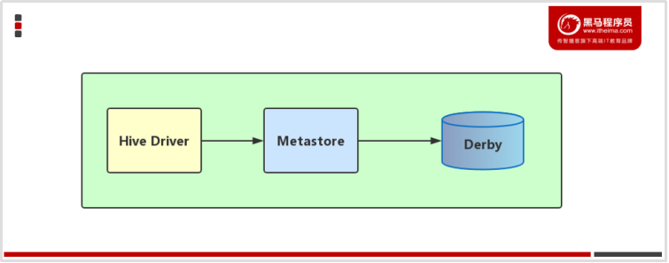
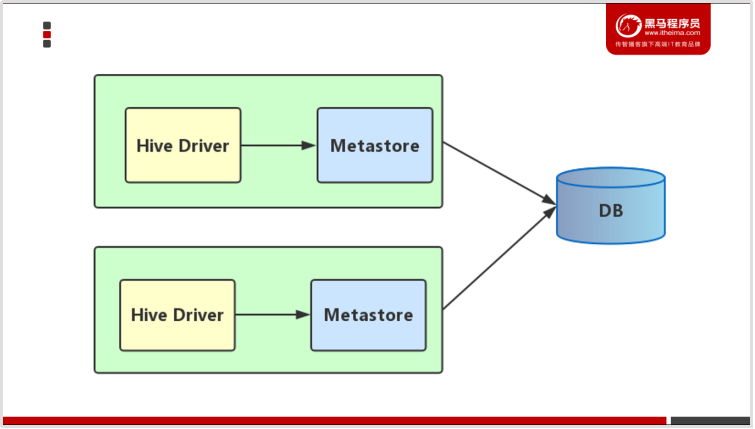
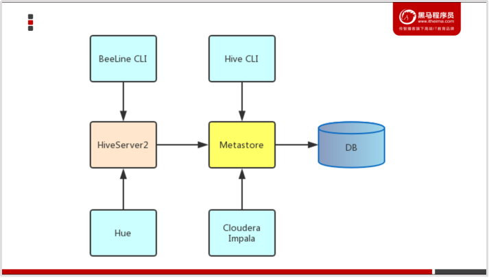

# 安装Hive


## 0- Hive的安装模式

### 0-1 内嵌模式

- 使用自己的Derby数据库,并且 Hive 与 metastore在同一个进程中；

- **内嵌模式**使用的是内嵌的**[Derby数据库]()**来存储元数据，也不需要额外起Metastore服务。
- 数据库 和 Metastore服务都嵌入在主Hive Server进程中。
- 配置简单，但是[**一次只能一个客户端连接**]()，适用于用来实验，不适用于生产环境。
- 解压hive安装包  bin/hive 启动即可使用
- 缺点：不同路径启动hive，[每一个hive拥有一套自己的元数据，无法共享]()。



### 0-2 本地模式 

- [**使用外部数据库保存元数据**]() ， **[hive与metastore在同一个进程]()**

- **本地模式**采用[**外部数据库来存储元数据**]()，目前支持的数据库有：MySQL、Postgres、Oracle、MS SQL Server.一般使用**MySQL**。
- 本地模式[不需要单独起metastore服务]()，用的是跟hive在同一个进程里的 metastore 服务。也就是说当你启动一个hive 服务，里面默认会帮我们启动一个metastore服务。
- hive根据hive.metastore.uris 参数值来判断，如果为空，则为本地模式。
- 缺点是：每启动一次hive服务，都内置启动了一个metastore。



### 0-3 远程模式

- [**使用外部数据保存元数据 ， metastore 服务单独启动一个进程；**]()

- **远程模式**下，[需要单独起metastore服务]()，然后每个客户端都在配置文件里配置连接到该metastore服务。
- 远程模式的[metastore服务 和 hive运行在**不同的进程**里]()。
- 在生产环境中，建议用远程模式来配置Hive Metastore。
- 在这种情况下，其他依赖hive的软件都可以通过Metastore访问hive。比如：**[BeeLine]()**




## 1- 解压Hive安装包并重命名

``` shell
cd /export/software
tar -zxvf apache-hive-2.1.0-bin.tar.gz  -C /export/server
cd /export/server
mv apache-hive-2.1.0-bin hive-2.1.0
```


## 2- 修改hive的配置文件

- hive-env.sh  

添加我们的hadoop的环境变量

``` shell
cd  /export/server/hive-2.1.0/conf
cp hive-env.sh.template hive-env.sh
vim hive-env.sh
```

- 修改内容如下：

``` shell
HADOOP_HOME=/export/server/hadoop-2.7.5 
export HIVE_CONF_DIR=/export/server/hive-2.1.0/conf
```


## 3- 修改hive-site.xml

``` shell
cd  /export/server/hive-2.1.0/conf
vim hive-site.xml
```


- 在该文件中添加以下内容

``` xml
<?xml version="1.0" encoding="UTF-8" standalone="no"?>
<?xml-stylesheet type="text/xsl" href="configuration.xsl"?>
<configuration>
<property>
      <name>javax.jdo.option.ConnectionUserName</name>
      <value>root</value>
  </property>
  <property>
      <name>javax.jdo.option.ConnectionPassword</name>
      <value>123456</value>
  </property>
  <property>
      <name>javax.jdo.option.ConnectionURL</name>
      <value>jdbc:mysql://node3:3306/hive?createDatabaseIfNotExist=true&amp;useSSL=false</value>
  </property>
  <property>
      <name>javax.jdo.option.ConnectionDriverName</name>
      <value>com.mysql.jdbc.Driver</value>
  </property>
  <property>
      <name>hive.metastore.schema.verification</name>
      <value>false</value>
  </property>
  <property>
    <name>datanucleus.schema.autoCreateAll</name>
    <value>true</value>
 </property>
 <property>
	<name>hive.server2.thrift.bind.host</name>
	<value>node3</value>
   </property>
</configuration>
```


## 4- 上传mysql的lib驱动包

将mysql的lib驱动包上传到hive的lib目录下

``` shell
cd /export/server/hive-2.1.0/lib
```

将mysql-connector-java-5.1.41.jar 上传到这个目录下


## 5- 拷贝相关jar包

将hive-2.1.0/jdbc/目录下的hive-jdbc-2.1.0-standalone.jar 拷贝到hive-2.1.0/lib/目录

``` shell
cp /export/server/hive-2.1.0/jdbc/hive-jdbc-2.1.0-standalone.jar /export/server/hive-2.1.0/lib/
```


## 6- 配置hive的环境变量

**node03** 服务器执行以下命令配置hive的环境变量

``` shell
vim /etc/profile

添加以下内容:
export HIVE_HOME=/export/server/hive-2.1.0
export PATH=:$HIVE_HOME/bin:$PATH
3.3.Hive的交互方式
```


## 7- 初始化元数据

``` shell
cd /export/server/hive-2.1.0/

#初始化元数据
bin/schematool -dbType mysql -initSchema

```

