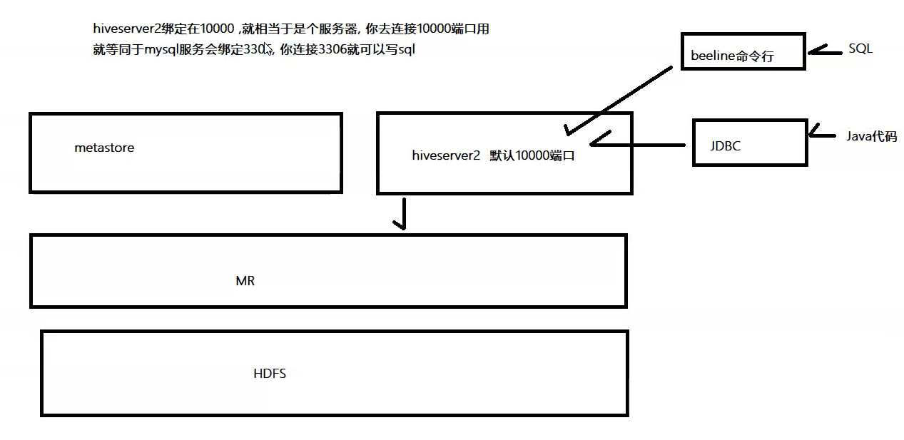

# Hive的交互方式

## 第一种交互方式：hive命令

- **先启动两个服务**

``` shell
nohup /export/server/hive-2.1.0/bin/hive --service metastore &
sleep 5s;
nohup /export/server/hive-2.1.0/bin/hive --service hiveserver2 &
```

- 进入hive安装包启动hive 

``` shell
[root@node3 ~]# cd /export/server/hive-2.1.0/
[root@node3 ~]# hive
which: no hbase in (:/export/server/hive-2.1.0/bin::/export/server/hadoop-2.7.5/bin:/export/server/hadoop-2.7.5/sbin::/export/shell/bin::/export/server/zookeeper-3.4.6/bin::/export/server/jdk1.8.0_241/bin:/usr/local/sbin:/usr/local/bin:/usr/sbin:/usr/bin:/export/server/mysql-5.7.29/bin:/root/bin)
SLF4J: Class path contains multiple SLF4J bindings.
SLF4J: Found binding in [jar:file:/export/server/hive-2.1.0/lib/hive-jdbc-2.1.0-standalone.jar!/org/slf4j/impl/StaticLoggerBinder.class]
SLF4J: Found binding in [jar:file:/export/server/hive-2.1.0/lib/log4j-slf4j-impl-2.4.1.jar!/org/slf4j/impl/StaticLoggerBinder.class]
SLF4J: Found binding in [jar:file:/export/server/hadoop-2.7.5/share/hadoop/common/lib/slf4j-log4j12-1.7.10.jar!/org/slf4j/impl/StaticLoggerBinder.class]
SLF4J: See http://www.slf4j.org/codes.html#multiple_bindings for an explanation.
SLF4J: Actual binding is of type [org.apache.logging.slf4j.Log4jLoggerFactory]

Logging initialized using configuration in jar:file:/export/server/hive-2.1.0/lib/hive-common-2.1.0.jar!/hive-log4j2.properties Async: true
Hive-on-MR is deprecated in Hive 2 and may not be available in the future versions. Consider using a different execution engine (i.e. spark, tez) or using Hive 1.X releases.
hive> show databases;  # 查看所有数据库
OK
default
didi
myhive
Time taken: 0.536 seconds, Fetched: 3 row(s)
hive> 

```


## 第二种交互方式：hive -e 或 hive -f

### hive -e

``` shell
cd /export/server/hive-2.1.0/
bin/hive -e "create database mytest2"  # 创建一个数据库
```


### hive -f

- 我们可以将我们的hql语句写成一个sql脚本然后执行

``` shell
cd /export/server
vim  hive.sql
```

- hive.sql内容

``` sql
create database mytest3;
use mytest3;
create table stu(id int , name string);
insert into stu values(1,"Tom");

```

- 通过hive -f  来执行我们的sql脚本

``` shell
[root@node3 bin]# hive -f ./hive.sql 
```


## 第三种交互方式：Beeline Client

``` properties
方式一：交互式命令行（CLI）
	bin/hive，编写SQL语句及DDL语句

方式二：启动服务HiveServer2（Hive ThriftServer2)
	将Hive当做一个服务启动(类似MySQL数据库，启动一个服务)，端口为10000
	1)、交互式命令行，bin/beeline，CDH 版本HIVE建议使用此种方式，CLI方式过时
	2)、JDBC/ODBC方式，类似MySQL中JDBC/ODBC方式

```


- hive经过发展，推出了第二代客户端beeline，但是beeline客户端不是直接访问metastore服务的，而是需要单独启动hiveserver2服务 ;

- hiveserver2 提供了 一个服务thrift, **默认端口是10000**。(hiveserver2: thrift:10000端口)

  

- 在node1的/export/server/hadoop-2.7.5/etc/hadoop目录下，修改core-site.xml，在该文件中添加以下配置,实现用户代理:

``` xml
<property>
    <name>hadoop.proxyuser.root.hosts</name>
    <value>*</value>
</property>
<property>
    <name>hadoop.proxyuser.root.groups</name>
    <value>*</value>
</property>
```

- 将修改好的core-site.xml文件分发到node2和node3,然后重启Hadoop（stop-all.sh start-all.sh）

  

- 在hive运行的服务器上，首先启动metastore服务，然后启动hiveserver2服务。

``` properties
nohup /export/server/hive-2.1.0/bin/hive --service metastore &
nohup /export/server/hive-2.1.0/bin/hive --service hiveserver2 &
# nohup 和 & 表示后台启动
```


- 查看两个服务是否启动

``` shell
[root@node3 ~]# jps
63655 NodeManager
41720 QuorumPeerMain
63544 DataNode
63816 JobHistoryServer
59229 RunJar   # metastore
75279 Jps
59311 RunJar	# hiveserver2
[root@node3 ~]# 
```


- 在node3上使用beeline客户端进行连接访问

``` properties
beeline
```

根据提醒进行以下操作:

``` shell
[root@node3 hive-2.1.0]# beeline
which: no hbase in (:/export/server/hive-2.1.0/bin::/export/server/hadoop-2.7.5/bin:/export/server/hadoop-2.7.5/sbin::/export/shell/bin::/export/server/zookeeper-3.4.6/bin::/export/server/jdk1.8.0_241/bin::/export/server/hive-2.1.0/bin::/export/server/hadoop-2.7.5/bin:/export/server/hadoop-2.7.5/sbin::/export/shell/bin::/export/server/zookeeper-3.4.6/bin::/export/server/jdk1.8.0_241/bin:/usr/local/sbin:/usr/local/bin:/usr/sbin:/usr/bin:/export/server/mysql-5.7.29/bin:/root/bin:/export/server/mysql-5.7.29/bin)
Beeline version 2.1.0 by Apache Hive
beeline> !connect jdbc:hive2://node3:10000  # 输入：  !connect jdbc:hive2://fdc10:10000
Connecting to jdbc:hive2://node3:10000
Enter username for jdbc:hive2://node3:10000: root  # 输入 root
Enter password for jdbc:hive2://node3:10000: ******  # 输入 123456
SLF4J: Class path contains multiple SLF4J bindings.
SLF4J: Found binding in [jar:file:/export/server/hive-2.1.0/lib/hive-jdbc-2.1.0-standalone.jar!/org/slf4j/impl/StaticLoggerBinder.class]
SLF4J: Found binding in [jar:file:/export/server/hive-2.1.0/lib/log4j-slf4j-impl-2.4.1.jar!/org/slf4j/impl/StaticLoggerBinder.class]
SLF4J: Found binding in [jar:file:/export/server/hadoop-2.7.5/share/hadoop/common/lib/slf4j-log4j12-1.7.10.jar!/org/slf4j/impl/StaticLoggerBinder.class]
SLF4J: See http://www.slf4j.org/codes.html#multiple_bindings for an explanation.
SLF4J: Actual binding is of type [org.apache.logging.slf4j.Log4jLoggerFactory]
Connected to: Apache Hive (version 2.1.0)
Driver: Hive JDBC (version 2.1.0)
21/01/20 14:18:22 [main]: WARN jdbc.HiveConnection: Request to set autoCommit to false; Hive does not support autoCommit=false.
Transaction isolation: TRANSACTION_REPEATABLE_READ
0: jdbc:hive2://node3:10000> 
0: jdbc:hive2://node3:10000> 

```

- 连接成功之后，出现以下内容，可以在提示符后边输入hive sql命令

``` sql
0: jdbc:hive2://node3:10000> show databases;
+----------------+--+
| database_name  |
+----------------+--+
| default        |
| didi           |
| myhive         |
| mytest3        |
+----------------+--+
4 rows selected (0.867 seconds)
0: jdbc:hive2://node3:10000> 

```


# Hive一键启动脚本

- 我们写一个expect脚本，可以一键启动beenline，并登录到hive。expect是建立在tcl基础上的一个自动化交互套件, 在一些需要交互输入指令的场景下, 可通过脚本设置自动进行交互通信。


## 1- 安装expect

``` shell
yum  -y install expect
```


## 2- 创建脚本

``` shell
cd /export/shell/expect
vim /export/shell/expect/beenline.exp
```

- 添加以下内容

``` shell
#!/bin/expect
spawn beeline 
set timeout 5

# 在 beeline>  后面输入 !connect jdbc:hive2://node3:10000  回车
expect "beeline>"   
send "!connect jdbc:hive2://node3:10000\r"

# 在 Enter username for jdbc:hive2://node3:10000:  后面输入  root 回车
expect "Enter username for jdbc:hive2://node3:10000:"
send "root\r"

# 在 Enter password for jdbc:hive2://node3:10000: 后面输入 123456 回车
expect "Enter password for jdbc:hive2://node3:10000:"
send "123456\r"
interact
```


## 3- 修改脚本权限

``` shell
chmod 777 beenline.exp
```


## 4- 启动beeline  脚本

``` expect
expect beenline.exp
```


## 5- 编写shell 脚本启动 beeline.exp 脚本

``` shell
[root@node3 bin]# vim /export/shell/bin/start-beeline
```

- 内容：

``` shell
#!/bin/bash
nohup /export/server/hive-2.1.0/bin/hive --service metastore &
sleep 5s;
nohup /export/server/hive-2.1.0/bin/hive --service hiveserver2 &
sleep 5s;
expect /export/shell/expect/beeline.exp

```


## 6- 最后直接使用shell 脚本mybeeline启动beeline

``` shell
[root@node3 bin]# start-beeline 
nohup: 把输出追加到"nohup.out"
nohup: 把输出追加到"nohup.out"
spawn beeline
which: no hbase in (:/export/server/hive-2.1.0/bin::/export/server/hadoop-2.7.5/bin:/export/server/hadoop-2.7.5/sbin::/export/shell/bin::/export/server/zookeeper-3.4.6/bin::/export/server/jdk1.8.0_241/bin::/export/server/hive-2.1.0/bin::/export/server/hadoop-2.7.5/bin:/export/server/hadoop-2.7.5/sbin::/export/shell/bin::/export/server/zookeeper-3.4.6/bin::/export/server/jdk1.8.0_241/bin:/usr/local/sbin:/usr/local/bin:/usr/sbin:/usr/bin:/export/server/mysql-5.7.29/bin:/root/bin:/export/server/mysql-5.7.29/bin)
Beeline version 2.1.0 by Apache Hive
beeline> !connect jdbc:hive2://node3:10000
Connecting to jdbc:hive2://node3:10000
Enter username for jdbc:hive2://node3:10000: root
Enter password for jdbc:hive2://node3:10000: ******
SLF4J: Class path contains multiple SLF4J bindings.
SLF4J: Found binding in [jar:file:/export/server/hive-2.1.0/lib/hive-jdbc-2.1.0-standalone.jar!/org/slf4j/impl/StaticLoggerBinder.class]
SLF4J: Found binding in [jar:file:/export/server/hive-2.1.0/lib/log4j-slf4j-impl-2.4.1.jar!/org/slf4j/impl/StaticLoggerBinder.class]
SLF4J: Found binding in [jar:file:/export/server/hadoop-2.7.5/share/hadoop/common/lib/slf4j-log4j12-1.7.10.jar!/org/slf4j/impl/StaticLoggerBinder.class]
SLF4J: See http://www.slf4j.org/codes.html#multiple_bindings for an explanation.
SLF4J: Actual binding is of type [org.apache.logging.slf4j.Log4jLoggerFactory]
Connected to: Apache Hive (version 2.1.0)
Driver: Hive JDBC (version 2.1.0)
21/01/20 14:29:05 [main]: WARN jdbc.HiveConnection: Request to set autoCommit to false; Hive does not support autoCommit=false.
Transaction isolation: TRANSACTION_REPEATABLE_READ
0: jdbc:hive2://node3:10000> 
0: jdbc:hive2://node3:10000> 
0: jdbc:hive2://node3:10000> 

```


