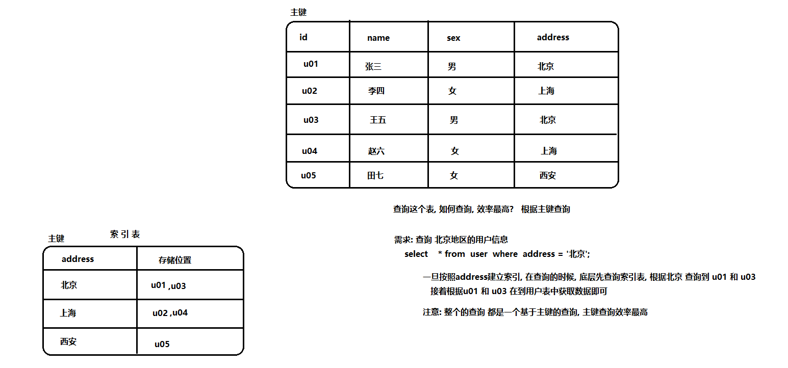
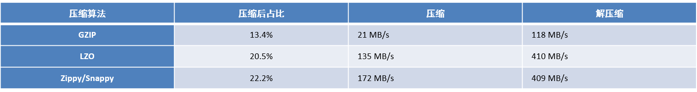

[TOC]


# Hive的优化

## 1- hive的优化_基础优化

### 1.1 hive的并行操作

* Hive**编译查询限制** :  (一般是作为通用配置:  cm的hive上面)

  * 说明: Hive默认同时只能编译一段HiveQL，并上锁；

  ```properties
  如何解决多个会话时, 同时只能有一个会话进行编译的问题 ? 
  hive.driver.parallel.compilation 设置为true  是否开启一次性编译多个sql的功能 默认为 false
  hive.driver.parallel.compilation.global.limit  默认值为3 表示一次性最多同时有三个会话进行编译sql
  	注意: 如果此值设置为 0 表示无边界, 此值是否会生效取决于第一个参数是否设置为true
  
  ```

* Hive**不同阶段任务并行执行** : (一般是进行单独会话配置)

  * 说明: Hive会将一个查询转化为一个或多个阶段，包括：MapReduce阶段、抽样阶段、合并阶段、limit阶段等。默认情况下，一次只执行一个阶段。不过，如果某些阶段不是互相依赖，是可以并行执行的。

  ```properties
  set hive.exec.parallel=true;   默认值为false  表示是否要开启hive的并行执行
  set hive.exec.parallel.thread.number=16; 表示一次性一个sql中最大运行并行的数量  默认值8
  ```

### 1.2 hive的小文件合并

- map 端小文件过多会有什么影响?  

​		hive在执行的sql的时候, 会将sql翻译为MR来执行, MR的读取目标数据的时候, 如果目标数据中有大量的小文件, 此时就会导致启动多个mapTask来执行, 此时对系统资源是一种极大的浪费, 导致执行效率降低

- reduce小文件过多会有什么影响?  

​		1) 对HDFS不友好 ,(不建议保存小文件)

​		2) 下次对结果表进行操作, 又会小文件过多的问题；

- 解决方案:

   在读取数据的时候, 对目标数据进行小文件合并, 将其合并为一个较大的文件 从而减少mapTask的数量

```properties
hive.merge.mapfiles : 是否开启 map端的小文件合并的操作:  默认值为 true
hive.merge.mapredfiles:  是否要开启reduce的输出小文件合并 : 默认值为false
hive.merge.size.per.task: 表示合并后的文件的大小 默认值为 268435456(256M) 
hive.merge.smallfiles.avgsize: 表示当输出文件的平均大小小于此设置值时，启动一个独立的map-reduce任务进行文件merge，默认值为16M。


注意: 以上调整的参数, 均可以直接在CM上调整操作
```


### 1.3 hive的矢量(批量)化操作

​		hive的[默认查询执行引擎**一次处理一行**]()，而矢量化查询执行是一种hive特性，[目的是按照每批1024行读取数据]()，并且一次性对整个记录整合（而不是对单条记录）应用操作,也可以理解为批量化操作

如何配置呢?

```sql
set hive.vectorized.execution.enabled=true; 默认就是true   是否开启批量化查询
```

**注意事项:** <span style="color:red;background:white;font-size:20px;font-family:楷体;">**要求读取的表的数据格式为ORC **</span>


### 1.4 读取零拷贝

​	在读取HDFS的数据的时候, <span style="color:blue;background:white;font-size:20px;font-family:楷体;">**只将需要的字段数据读取到内存中, 不需要的字段, 就不进行读取操作**</span>,

​	注意事项: <span style="color:red;background:white;font-size:20px;font-family:楷体;">**如果想要实现此功能, 要求表的数据格式 ORC**</span>

​	如何配置:

```properties
set hive.exec.orc.zerocopy=true;   默认值为false

示例: 
	A 表中 b c d 三个字段
	执行以下操作:
		select  b,c from A where  b= '' ;  
		
	说明:在开启读取零拷贝的情况下, 读取数据的时候, 只需要将表中 b和c这两列的数据读取到内存中即可
```


### 1.5 hive的压缩配置操作（yarn）

- map阶段

```properties
mapreduce.map.output.compress :  是否开启MR中map阶段的压缩配置
	默认值为: true
mapreduce.map.output.compress.codec : map阶段压缩采用合并压缩算法
	推荐配置:
	   org.apache.hadoop.io.compress.SnappyCodec


```

- reduce端

``` properties
mapreduce.output.fileoutputformat.compress : 是否开启reduce端压缩配置
	默认为:false
mapreduce.output.fileoutputformat.compress.codec : reduce端采用何种压缩算法
	推荐配置:
	   org.apache.hadoop.io.compress.SnappyCodec
mapreduce.output.fileoutputformat.compress.type :  reduce端采用压缩方式
	默认值:  RECORD(行压缩)  
	可选值: BLOCK(块压缩)
	推荐配置: BLOCK


```

- 中间/最终结果(再会话中配置，就是写sql的时候设置)

``` properties
set hive.exec.compress.intermediate=true; : hive是否开启中间结果压缩配置	默认为 trueset hive.exec.compress.output=true;  hive是否开启最终结果压缩配置    默认为 false
```


### 1.6 基础优化总结: 

```properties
-- hive的并行查询操作
set hive.driver.parallel.compilation=true --是否开启一次性编译多个sql的功能
set hive.driver.parallel.compilation.global.limit=3 --表示一次性最多同时有三个会话进行编译sql

-- hive的不同阶段任务并行执行
set hive.exec.parallel=true; --表示是否要开启hive的并行执行
set hive.exec.parallel.thread.number=16; --表示一次性一个sql中最大运行并行的数量

-- 小文件合并
hive.merge.mapfiles : 是否开启 map端的小文件合并的操作:  默认值为 true
hive.merge.mapredfiles:  是否要开启reduce的输出小文件合并 : 默认值为false
hive.merge.size.per.task: 表示合并后的文件的大小 默认值为 268435456(256M) 
hive.merge.smallfiles.avgsize: 表示当输出文件的平均大小小于此设置值时，启动一个独立的map-reduce任务进行文件merge，默认值为16M。

-- hive的批量查询优化
set hive.vectorized.execution.enabled=true; 默认就是true   是否开启批量化查询

-- hive的零拷贝优化(只读取有用字段)
set hive.exec.orc.zerocopy=true; --是否开启读取零拷贝（只要有用字段）
```


## 2. hive的优化_数据倾斜

- 数据倾斜: 

  ​	在整个MR执行过程中, 有多个reduce程序, 多个reduce程序之间处理数据量相差甚远

- 思考: 在做什么样操作的时候下, 会导致有可能出现数据倾斜? 

  ​	 <span style="color:red;background:white;font-size:20px;font-family:楷体;">**join操作 和 group by**</span> 

  - join

    

  - group by 

    

### 2.1 数据倾斜_join倾斜

* 解决方案一:  <span style="color:red;background:white;font-size:20px;font-family:楷体;">**通过 mapjoin 、 bucket mapjoin 以及 smb join**</span>

* 解决方案二:  将那些容易产生数据倾斜的key值抽取出来, 使用一个单独的MR进行处理即可

  * 实施方案一: 运行时优化 

    * 配置:

      ```properties
      set hive.optimize.skewjoin=true; 开启 运行时的join数据倾斜优化
      set hive.skewjoin.key=100000; 当这个key的值出现多少个的时候, 认为是有数据倾斜的问题
      ```

    * 说明: 在运行的过程中, 时刻监控着k2的值, 当k2中某个值出现的次数大于设置的值, 认为此值出现数据倾斜, 将其单独存储起来, 通过一个单独的MR对其进行单独处理即可

    * 注意: 

      ​	<span style="color:red;background:white;font-size:20px;font-family:楷体;">**此种优化, 如果数据中 大多数key都大于了此值, 此时不建议开启此优化。如果要使用这个优化, 需要调整hive.skewjoin.key此值大小**</span>。

  * 实施方案二: 编译时优化

    * 相关的配置

      ```properties
      set hive.optimize.skewjoin.compiletime=true;  默认关闭  
      ```

    * 整体优化思想都是一样的, 只不过编译时优化在编译器形成执行计划的时候, 就已经优化完毕了

    * 注意: <span style="color:red;background:white;font-size:20px;font-family:楷体;">**在执行之前,或者建表之前,  就需要指定那些key的值会导致数据倾斜**</span>

    * 示例

      ```sql
      CREATE TABLE list_bucket_single (key STRING, value STRING)
      -- 倾斜的字段和需要拆分的key值
      SKEWED BY (key) ON (1,5,6)
      --  为倾斜值创建子目录单独存放
      [STORED AS DIRECTORIES];
      ```

  - 实际使用中, 如何选择呢?   

    ​		在具体使用时候, 可以两个都开启为true, 这样当出现了编译期设置的key值, 直接抬走；如果是编译期没有考虑到的值, 在运行过程中, 发现了, 也可以进行优化处理。

    

  - 我们怎么知道数据倾斜？

    - 1- 查看SQL执行的时候,转换的MR是否出现了多个reduce;

    

    - 2- 查看各个reduce,是否有reduce执行时长远远大于其它的reduce;

    


### 2.2 union all的优化

​		在进行join的数据倾斜优化的时候, 不管采用 运行时的, 还是编译时, 都是将能产生倾斜的key值, 单独拿出来, 使用一个单独MR进行处理, 处理后和之前结果进行union all 合并操作

​		正常情况下, union all 也需要单独运行一个MR, 将两个结果进行合并, 出现到一个目标目录下

​		在跑一个MR 对效率也会产生影响, 能否不执行union all的合并操作呢, 直接让上面的MR 直接将结果输出的目的地

```properties
解决方案:
	set hive.optimize.union.remove=true;

此操作一般与 数据倾斜_join倾斜优化 同时开启, 对 数据倾斜_join倾斜优化 最后合并操作进行优化
```

``` properties
set hive.optimize.skewjoin=true;  --开启 运行时的join数据倾斜优化
set hive.skewjoin.key=100000;  --当这个key的值出现多少个的时候, 认为是有数据倾斜的问题
set hive.optimize.skewjoin.compiletime=true; -- 开启 编译时的join数据倾斜优化
set hive.optimize.union.remove=true;  -- 开启 union all 的优化
```


### 2.3 数据倾斜_group by的数据倾斜

- 数据倾斜案例，如图：


* 方案一:<span style="color:red;background:white;font-size:20px;font-family:楷体;">**小规约  开启 map端的局部聚合操作（combiner）**</span>
  * 配置: **hive.map.aggr=true;**
  * 方案一原理流程图：


* 方案二: <span style="color:red;background:white;font-size:20px;font-family:楷体;">**大规约  运行两个MR , 第一个MR 进行局部聚合操作, 第二个MR 进行最终聚合操作**</span>

  * 配置: **hive.groupby.skewindata=true;** 

  * 思想：

    ``` properties
    	当选项设定为 true，生成的查询计划会有两个MR Job。第一个MR Job中，Map的输出结果会随机分布到Reduce中，每个Reduce做部分聚合操作，并输出结果，这样处理的结果是相同的Group By Key有可能被分发到不同的Reduce中，从而达到负载均衡的目的；第二个MR Job再根据预处理的数据结果按照Group By Key分布到Reduce中（这个过程可以保证相同的Group By Key被分布到同一个Reduce中），最后完成最终的聚合操作。
    ```
  
  * 使用的注意事项:
  
    ```properties
    如果使用方案二进行group by 数据倾斜的解决, 要求sql中不允许出现多个列做distinct操作, 只能出现一次
    
    例如: 
  	SELECT ip, count(DISTINCT uid), count(DISTINCT uname) FROMlog GROUP BY ip 
    		此操作 就会直接报错, 因为此sql中出现多次distinct操作
  		报错内容: DISTINCT on different columns notsupported with skew in data.
    ```

  - 方案二原理流程图：

    第一个MR：先将所有的数据轮询一样分给两个reduce，这样就不会有数据倾斜；
  
  
  
     第二个MR : 将第一个MR的输出结果作为第二个MR的输入；
  
  


- 总结：

``` sql
--（1）hive group by 数据倾斜 是否在Map端进行聚合，默认为True
set hive.map.aggr = true;

--（2）在Map端进行聚合操作的条目数目
set hive.groupby.mapaggr.checkinterval = 100000;

--（3）有数据倾斜的时候进行负载均衡（默认是false）  group by 数据倾斜，使用两个MR的优化
set hive.groupby.skewindata = true;
```


### 2.4 关联优化器

​		在hive执行sql的时候, 一个sql翻译的MR中可能会出现多次shuffle操作, [而多次的shuffle操作有可能是可以共享的](), 此时就可以将shuffle进行共享, 从而[减少shuffle次数](), 从而提升效率

如何实施:

```properties
set hive.optimize.correlation=true;
```


### 2.5 总结

```properties
-- 以下是hive的并行优化
set hive.driver.parallel.compilation=true  --是否开启一次性编译多个sql的功能
set hive.driver.parallel.compilation.global.limit=3 ----表示一次性最多同时有三个会话编译sql
set hive.exec.parallel=true;		--开启hive的并行执行
set hive.exec.parallel.thread.number=16;    --表示一次性一个sql中最大运行并行的数量 

-- 以下是hive的小文件合并优化
set hive.merge.mapfiles = true ;  -- 开启hive的map端小文件合并
set hive.merge.mapredfiles= true; -- 开启hive的reduce端小文件合并
hive.merge.size.per.task: 表示合并后的文件的大小 默认值为 268435456(256M) 
hive.merge.smallfiles.avgsize: 表示当输出文件的平均大小小于此设置值时，启动一个独立的map-reduce任务进行文件merge，默认值为16M。


set hive.exec.orc.zerocopy=true;   -- hive的读取零拷贝
set hive.vectorized.execution.enabled=true; -- hive的矢量化的查询优化

-- 以下是hive 的join操作数据倾斜优化
set hive.optimize.skewjoin=true;	--开启 运行时的join数据倾斜优化
set hive.skewjoin.key=100000;  --当这个key的值出现多少个的时候, 认为是有数据倾斜的问题
set hive.optimize.skewjoin.compiletime=true;  -- hive的 开启 编译时的join数据倾斜优化
set hive.optimize.union.remove=true;  -- hive union all的优化方案

-- 以下是hive 的 group by 操作数据倾斜优化
set hive.map.aggr=true;   -- hive group by 数据倾斜 map端局部聚合优化
set hive.groupby.skewindata=true;   -- hive的 group by 数据倾斜，使用两个MR的优化

-- hive的关联优化器
set hive.optimize.correlation=true; -- hive的关联优化器 减少shuffle次数

```


## 3. hive的索引优化

- 索引: **提升读写的效率**


- 为什么说索引可以提升性能? 

  - 对某个列建立索引后，会基于这个列创建一个索引表，主键就是这个列；
  - 基于这个列的查询时都是基于主键的查询，而主键查询效率最高；




- 在hive中, 同样也是支持索引的, hive的索引主要三大类: 

  - 原始索引
  - Row Group Index: 行组索引
  - Bloom Filter Index:  开发过滤索引

  

###  3.1 原始索引 -- 不推荐使用

* 特点：
  * <span style="color:blue;background:white;font-size:20px;font-family:楷体;">**索引表不会自动更新**</span>；
* 注意: 
  * [手动更新, 本质就上在重建索引操作]()， 而重建索引效率非常低；

```properties
在对目标表进行数据的更新(增删改)操作, hive的原始索引不会进行自动更新的,需要进行手动更新手动更新的效率是极低的所以说, 在hive的3.0版本后, 不支持构建原始索引了;

注意: 手动更新, 本质就上在重建索引操作;
```


### 3.2 Row Group Index: 行组索引


- 原理描述：
  - 针对**ORC类型存储格式**的表, 一旦开启了行组索引, 在ORC文件中每个stripts的块（256M）中会保存每个字段的**最大最小值的索引数据**（[IndexData]()）；
  - 这里的IndexData 就是Row Group Index 行组索引 也叫**min-max Index大小对比索引**;	
  - 当查询时候, 根据这个建立行组索引的字段查询时候, [可以过滤掉不需要扫描的块, 从而减少扫描量, 提升查询的性能;]()


- 使用行组条件必要条件
  - 1) 表必须是**ORC存储格式**
  - 2) 建表时, 必须制定以下信息: ’orc.create.index’=’true’   **开启行组索引**
  - 3) 在插入数据的时候, 必须要对建立**索引的字段进行排序**;否则min/max值就无意义;
  - 4) 一般使用在数值类型的字段上;


例子:

```sql
CREATE TABLE lxw1234_orc2 stored AS ORC
TBLPROPERTIES
(
    'orc.compress'='SNAPPY',

    'orc.create.index'='true'    --     开启行组索引
)

插入数据: 
    insert into table  lxw1234_orc2 
        SELECT CAST(siteid AS INT) AS id,
            pcid
            FROM lxw1234_text

            DISTRIBUTE BY id sort BY id; --     插入的数据保持排序
    
查询数据: 
	SELECT COUNT(1) FROM lxw1234_orc1 WHERE id >= 1382 AND id <= 1399;

```


### 3.3 Bloom Filter Index:  开发过滤索引

- 原理描述：
  - 在建表的时候, 需要**指定那些字段作为开发过滤索引**: ["orc.bloom.filter.columns"="字段1,字段2.."]()；
  - 一旦通过**开发过滤索引**, 指定对表中某几个字段建立索引, [在ORC的每个script块中, 就会记录下这个字段对应的值,存储在那些位置上]()；
  - 查询时候, [根据查询的字段的值](), [从索引中确定要查询的值在哪些片段中, 直接到片段中获取即可](), 这样也相当于减少扫描量, 从而提升性能;

- 使用开发过滤索引必要条件
  - 表必须是**ORC存储格式**;
  - 在建表的时候, **需要指定那些字段作为开发过滤索引**: ["orc.bloom.filter.columns"="字段1,字段2.."]()；
  - **[只能进行 等值（=） 过滤查询]()**, 不局限于类型

 

例子:

```sql
CREATE TABLE lxw1234_orc2 stored AS ORC
TBLPROPERTIES
(
    'orc.compress'='SNAPPY',
    'orc.create.index'='true',  -- 可以共用, 也可以单用
--     pcid字段开启BloomFilter索引
    "orc.bloom.filter.columns"="pcid"
)

插入数据: 如果是单用开发过滤索引, 插入方案不限
insert into table lxw1234_orc2 
SELECT CAST(siteid AS INT) AS id,
pcid
FROM lxw1234_text
DISTRIBUTE BY id sort BY id;
注意: 由于在建表的额时候, 使用行组索引, 所以需要对建立行组索引字段, 进行排序插入

使用操作: 
	SELECT COUNT(1) FROM lxw1234_orc1 WHERE id >= 0 AND id <= 1000  
	AND pcid IN ('0005E26F0DCCDB56F9041C','A');

```


### 3.4 Hive 索引对比

- 行组索引 与 开发索引 对比

|                 | 行组索引                                               | 开发索引                                                     |
| --------------- | ------------------------------------------------------ | ------------------------------------------------------------ |
| 存储格式        | **ORC**                                                | **ORC**                                                      |
| 语法            | ['orc.create.index'='true'  -- 开启行组索引]()         | ["orc.bloom.filter.columns"="字段1,字段2.."]()               |
| 针对对象类型    | 一般为**数值类型**的字段                               | **任何类型**的字段都可以                                     |
| stripts块中信息 | **所有字段最大最小值，(块中存储的范围)**               | **索引字段的值；**                                           |
| 查询条件        | **支持范围查询  :   >   <    =**                       | **只支持 等于 查询  ： =**                                   |
| 插入数据要求    | **必须根据索引字段排序**                               | 无                                                           |
| 优化方案        | [查询的时候根据块中的最大最小值过滤掉不需要扫描的块]() | [根据查询的字段的值](), [从索引中确定要查询的值在哪些片段中, 直接到片段中获取即可](), |


### 3.5 hive的索引优化总结

- **空间换时间的操作**；
- **[行组索引]()和[开发索引]()可以一起使用也可以单独使用**；

- 在使用开发过滤索引, 如何选择索引字段:  

```properties
 将那些经过被作为where条件或者是join条件的等值连接的字段, 作为开发过滤索引的字段。 
```


## 4.本地模式

​		大多数的Hadoop Job是需要Hadoop提供的完整的可扩展性来处理大数据集的。<span style="color:red;background:white;font-size:20px;font-family:楷体;">**不过，有时Hive的输入数据量是非常小的**</span>。在这种情况下，为查询触发执行任务时消耗可能会比实际job的执行时间要多的多。对于大多数这种情况，<span style="color:blue;background:white;font-size:20px;font-family:楷体;">**Hive可以通过本地模式在单台机器上处理所有的任务**</span>。对于小数据集，执行时间可以明显被缩短。

​		用户可以通过设置hive.exec.mode.local.auto的值为true，来让Hive在适当的时候自动启动这个优化。

``` sql
set hive.exec.mode.local.auto=true;  --开启本地mr


--设置local mr的最大输入数据量,当输入数据量小于这个值时采用local MR的方式，默认为134217728，即128M
set hive.exec.mode.local.auto.inputbytes.max=51234560; -- 512M


--设置local mr的最大输入文件个数，当输入文件个数小于这个值时采用local mr的方式，默认为4
set hive.exec.mode.local.auto.input.files.max=10;
```

## 5.空key过滤-转换

### 5.1 空key 过滤

​		有时join超时是因为某些key对应的数据太多，而相同key对应的数据都会发送到相同的reducer上，从而导致内存不够。此时我们应该仔细分析这些异常的key，很多情况下，这些key对应的数据是异常数据，我们需要在SQL语句中进行过滤。例如key对应的字段为空，操作如下：

- 主要思想：

``` properties
当有过滤清洗的时候， 过滤只涉及到单独表中的条件，可以使用子查询的方法先过滤掉数据再去做join操作;
```

- 不过滤

``` sql
INSERT OVERWRITE TABLE jointable
SELECT a.* FROM nullidtable a JOIN ori b ON a.id = b.id;
结果：
No rows affected (152.135 seconds)
```

- 过滤

``` sql
INSERT OVERWRITE TABLE jointable
SELECT a.* FROM (SELECT * FROM nullidtable WHERE id IS NOT NULL ) a JOIN ori b ON a.id = b.id;
结果：
No rows affected (141.585 seconds)
```

### 5.2 空key 转换

​		空key 过滤的处理方案是清洗掉这些数据， 但是有时这些数据时有用的就可以使用空key 转换的方案处理；

​		有时虽然某个key为空对应的数据很多，但是相应的数据不是异常数据，必须要包含在join的结果中，此时我们可以表a中key为空的字段赋一个随机的值，使得数据随机均匀地分不到不同的reducer上。例如：


- 设计思想：

``` properties
当key值为空的时候添加一个key 值;

1) 不随机分布:当key 为空时，直接设置为一个固定的key值，如 hive;
	缺点:这样的后果就是所有为null值的id全部都变成了相同的字符串，及其容易造成数据的倾斜（所有的key相同，相同key的数据会到同一个reduce当中去）
	
2) 随机分布:当key 为空时，直接设置为一个固定的key值 + 随机值，如 hive + rand();
	
```


#### 不随机分布:

``` sql
set hive.exec.reducers.bytes.per.reducer=32123456;
set mapreduce.job.reduces=7;
INSERT OVERWRITE TABLE jointable
SELECT a.*
FROM nullidtable a
LEFT JOIN ori b 
	ON 
		CASE WHEN 
			a.id IS NULL 
		THEN 
			'hive' 
		ELSE 
			a.id END = b.id;

No rows affected (41.668 seconds)   52.477
```


#### 随机分布:

``` sql
set hive.exec.reducers.bytes.per.reducer=32123456;
set mapreduce.job.reduces=7;
INSERT OVERWRITE TABLE jointable
SELECT a.*
FROM nullidtable a
LEFT JOIN ori b ON CASE WHEN a.id IS NULL THEN concat('hive', rand()) ELSE a.id END = b.id;


No rows affected (42.594 seconds)
```


## 6.Count(distinct)

​		数据量小的时候无所谓，数据量大的情况下，<span style="color:red;background:white;font-size:20px;font-family:楷体;">**由于COUNT DISTINCT操作需要用一个Reduce Task来完成**</span>，这一个Reduce需要处理的数据量太大，就会导致整个Job很难完成，<span style="color:red;background:white;font-size:20px;font-family:楷体;">**一般COUNT DISTINCT使用先GROUP BY再COUNT的方式替换**</span>：

``` sql
SELECT count(id) FROM (SELECT id FROM bigtable GROUP BY id) a;
```

缺点：<span style="color:blue;background:white;font-size:20px;font-family:楷体;">**多了一个MR，但在数据量大的情况下，这个绝对是值得的。**</span>


## 7.严格模式

- Hive提供了一个严格模式，可以防止用户执行那些可能意向不到的不好的影响的查询。

- 开启关闭严格模式

  ``` sql
  set hive.mapred.mode = strict;  --开启严格模式
  set hive.mapred.mode = nostrict; --开启非严格模式
  ```

- 配置文件

  ``` xml
  <property>
      <name>hive.mapred.mode</name>
      <value>strict</value>
  </property>
  ```

- 限制操作：

  - 限制笛卡尔积的查询

    ``` properties
    	对关系型数据库非常了解的用户可能期望在执行JOIN查询的时候不使用ON语句而是使用where语句，这样关系数据库的执行优化器就可以高效地将WHERE语句转化成那个ON语句。不幸的是，Hive并不会执行这种优化，因此，如果表足够大，那么这个查询就会出现不可控的情况。
    ```

    

  - order by  后面必须加上 limit;

    ``` properties
    	对于使用了order by语句的查询，要求必须使用limit语句。因为order by为了执行排序过程会将所有的结果数据分发到同一个Reducer中进行处理，强制要求用户增加这个LIMIT语句可以防止Reducer额外执行很长一段时间。
    ```

    

  - 对于分区表，在where语句中必须含有分区字段作为过滤条件来限制范围，否则不允许执行;

    ``` properties
    	对于分区表，在where语句中必须含有分区字段作为过滤条件来限制范围，否则不允许执行。换句话说，就是用户不允许扫描所有分区。进行这个限制的原因是，通常分区表都拥有非常大的数据集，而且数据增加迅速。没有进行分区限制的查询可能会消耗令人不可接受的巨大资源来处理这个表。
    ```


## 8.存储方式和压缩方式

- 压缩方法



- ORC存储格式


- 大数据场景下存储格式压缩格式尤为关键；
- 优点：
  - 可以提升计算速度；
  - 减少存储空间；
  - 降低网络io；
  - 磁盘io；


