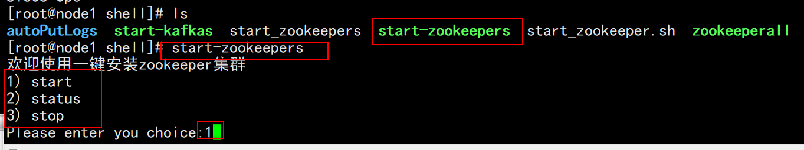
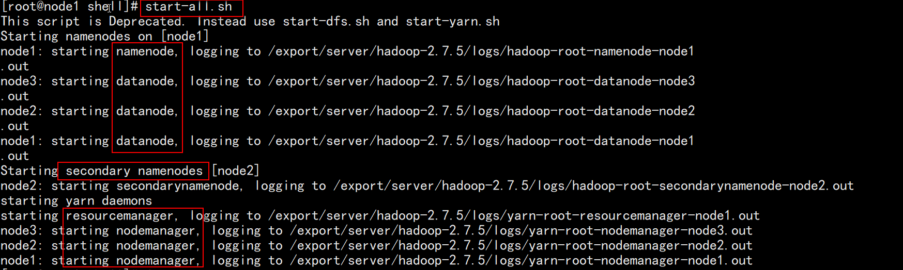
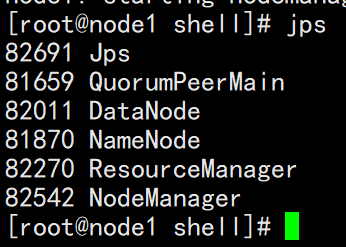
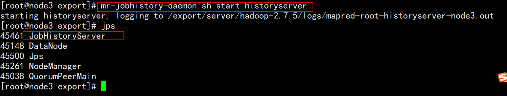

# HBase 安装

​	请查看HBase 安装视频已经《HBase安装操作.doc》文档

# hbase的安装操作

## 在安装过程中: 

* 注意:

  * 1) 在hbase-site.xml中, 关于 zookeeper的目录位置, 不要写错了(每个人都有可能不一样)
  * 2) 在hbase-env.sh中, 在修改配置的时候, 忘记将前面的注释打开
  * 3) 在修改regionsever文件的时候, 忘记将localhost删除, 直接在后面拼接了

  * 4) 没有将对应jar包拷贝到hbase的lib目录下

## 在启动过程中:

* 1) 首先要先启动 zookeeper, 同时必须保证zookeeper集群是启动良好的

  * 一键启动

    

  * 通过 ./zkServer.sh status  查看状态  (启动一个zookeeper不算启动集群)

* 2) 接着启动 hadoop集群, 同时必须保证hadoop是启动良好的

  * 一键启动

    

  * 第一步: 通过 jps 判断各个节点是否启动  

    

  * 第二步： node3启动history

    

  * 第三部: 通过浏览器 查看是否退出安装模式, 各个节点是否激活良好状态

* 3) 启动Hbase:  start-hbase.sh   (此命令在node1执行即可, 任意位置)

* 4. 进入hbase shell   :  hbase shell

* 5) 退出hbase shell ： quit