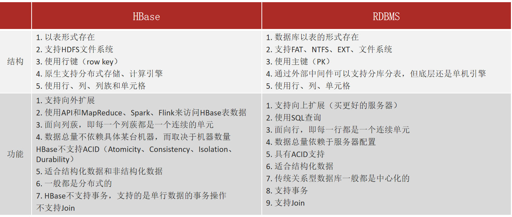
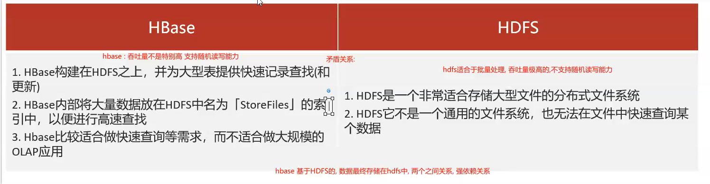
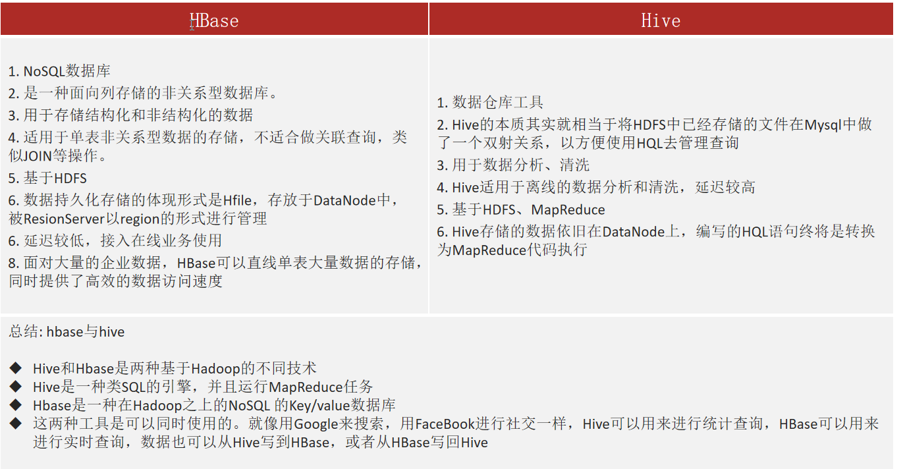

#  1- hbase的基本介绍

- ## Hbase 特点:
  - 大数据中一款nosql型的数据库;
  - **hbase不支持多行事务(只支持单行事务);** 
  - **也不支持SQL;**
  - **也没有表关系;**
  - **不支持join操作;**
  - **基于HDFS的, 数据最终都是存储在HDFS上**； 
  - **主要是用于存储结构化和半结构化的数据 ；**

- hbase中查询数据主要有三种方式: 
  - **1) 通过主键查询**
  - **2) 通过主键的range范围查询**
  - **3) 全表扫描**

- 一切皆字节
  - hbase中支持的数据类型: byte[] (字节数组) 
  - nosql型数据库:  一切皆字节

- hbase中表一般具有以下的特征:
  - 1) 大: 一个表可以支持有上十亿行的数据, 支持有上百万个列
  - 2) 面向列: 面向列族的存储和权限的管理工作
  - 3) 稀疏性: 对于为空(null)的列, 并不占用存储空间, 因为表可以设计非常的稀疏

  

- hbase的使用场景:  
  
  - **数据量比较的庞大, 而且这些数据需要进行随机的读写操作**,  不妨使用hbase来试一试;

- 官网
  - 目前hbase是apache的顶级项目: 其域名为 https://hbase.apache.org

- Hbase的特点: 
  - 1) [**强一致性的读写操作**]()
  - 2) 自动分块: region划分
  - 3) 自动的故障转移
  - 4) hbase可以和HDFS进行集成: 本身基于HDFS
  - 5) hbase可以和MR进行集成: 
  - 6) 支持普通的java API
  - 7) 支持Thrift 接口API : 可以通过此API 实现和HUE的集成工作
  - 8) 块缓存和布隆过滤器
  - 9) hbase提供管理界面
  
  

## 2- Hbase数据存储结构

- [**表->region->CF->Hfile**]()
- 一个HBase 内有多个表；
- 一个表内有多个region; (一个region是一个文件夹)
- 一个region 内有多个CF ；（一个CF是一个文件夹）CF 就是一个列族，[**列式存储格式**]()；
- 一个CF内有多个Hfile文件；
- 多个Hfile定期会合并为一个Hfile;

# 2-hbase和其他软件的区别

## 2-1 hbase 和 RDBMS的区别

- RDBMS: 

  - 以表的方式来存储, 
  - 支持SQL 有表关系, 
  - 支持join 
  - 支持事务 
  - 单机存储方案

  

- HBase: 

  - 以表的方式来存储, 不支持SQL, 
  - 不存在表关系, 
  - 不支持join, 
  - 仅支持单行的事务 
  - 支持分布式存储
  
  

## 2-2 hbase 和 HDFS的区别

- HDFS: **文件系统**，适合于批量数据的操作, **吞吐量极高**的, **不支持[随机]()读写的能力**

- Hbase: **非关系型数据库**，基于HDFS, 数据最终都是存储在HDFS中, **支持高效随机读写的能力**,  **不合适做大规模的逻辑分析工作（就是不适合做有逻辑计算的一些分析型工作）**, [一般都是存什么就读什么]():效率极高；

- 注意: 
  - **发现两者之间存在一定的矛盾关系, HDFS不支持随机读写, 但是HBASE支持随机读写, 而hbase基于HDFS** (后续讲解)

## 2-3 hbase 和 hive的区别

- hive: 
  - 数据分析的工具, 
  - 数据存储在hdfs中,
  -  数据仓库的工具,  
  - 主要是用于进行离线的分析处理, 
  - 延迟比较的高

- hbase: 
  - noSQL型数据库, 
  - 数据存储在hdfs中, 
  - 主要提供快速的随机读写能力, 
  - 延迟较低, 
  - 可以接入在线业务

