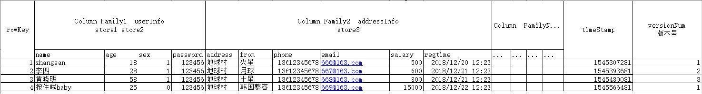

# HBase的表模型

- **表(Table)**: 
  - hbase中数据存储在表中,  一个表可以支持有上百万列 也可以存储上十亿上数据

- **row key**: 
  - [**行键(主键)**]() 理解为MySQL中主键
  - rowkey中数据 都是以字典序进行排序, 数据最长支持16kb长度 ,但是实际上一般只有10~100字节左右 , 建议短一点
  - rowkey在设计的时候, 确保是唯一的, 否则就会覆盖的问题, 并且保证相关的数据要存储在一起

- **列族(column family) CF:**  
  - 在创建表的时候, 必须要指定列族 , hbase中基于列族的管理;
  - 列族在构建的时候, 不建议过多, 列族越多, 对我们性能影响就会越大(IO越大), 建议是越少越好
  - 公式: 能用一个解决的, 坚决不用二个

- **列名:** 
  - 一个列族下 可以有多个列名(列限定符号),  列名支持上百万;
  - 列名是在添加数据的时候 动态指定的, 不需要建表指定

- **时间戳(timestamp):** 
  - 每一个数据都有时间戳的概念, 表示着这个数据在何时添加到hbase中
  -  一个单元格可能会有多个时间戳, 多个时间戳也可以理解为多个版本, 默认安装时间戳的倒序排序(将最新的数据展示)

- **版本号(version num):**  
  - 表示单元格数据是否保留其历史的版本(变更记录), 以及最多保留多少个
  - 默认情况: hbase的版本号为 1 只保留最新

- **单元格(cell):** 	
  - 如何确定一个单元格:  [**rowkey+列族+列名+时间戳**]()