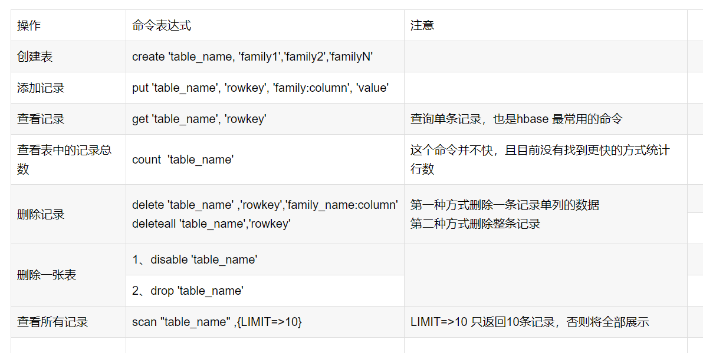

# 1- 启动与关闭HBase

- 启动start-hbase.sh 

``` shell
[root@node1 ~]# start-hbase.sh 
SLF4J: Class path contains multiple SLF4J bindings.
SLF4J: Found binding in [jar:file:/export/server/hadoop-2.7.5/share/hadoop/common/lib/slf4j-log4j12-1.7.10.jar!/org/slf4j/impl/StaticLoggerBinder.class]
SLF4J: Found binding in [jar:file:/export/server/hbase-2.1.0/lib/client-facing-thirdparty/slf4j-log4j12-1.7.25.jar!/org/slf4j/impl/StaticLoggerBinder.class]
SLF4J: See http://www.slf4j.org/codes.html#multiple_bindings for an explanation.
SLF4J: Actual binding is of type [org.slf4j.impl.Log4jLoggerFactory]
running master, logging to /export/server/hbase-2.1.0/logs/hbase-root-master-node1.out
SLF4J: Class path contains multiple SLF4J bindings.
SLF4J: Found binding in [jar:file:/export/server/hadoop-2.7.5/share/hadoop/common/lib/slf4j-log4j12-1.7.10.jar!/org/slf4j/impl/StaticLoggerBinder.class]
SLF4J: Found binding in [jar:file:/export/server/hbase-2.1.0/lib/client-facing-thirdparty/slf4j-log4j12-1.7.25.jar!/org/slf4j/impl/StaticLoggerBinder.class]
SLF4J: See http://www.slf4j.org/codes.html#multiple_bindings for an explanation.
SLF4J: Actual binding is of type [org.slf4j.impl.Log4jLoggerFactory]
node3: running regionserver, logging to /export/server/hbase-2.1.0/bin/../logs/hbase-root-regionserver-node3.out
node1: running regionserver, logging to /export/server/hbase-2.1.0/bin/../logs/hbase-root-regionserver-node1.out
node2: running regionserver, logging to /export/server/hbase-2.1.0/bin/../logs/hbase-root-regionserver-node2.out
[root@node1 ~]#
```

- 关闭 stop-hbase.sh

``` shell
[root@node1 ~]# stop-hbase.sh 
stopping hbase............
SLF4J: Class path contains multiple SLF4J bindings.
SLF4J: Found binding in [jar:file:/export/server/hadoop-2.7.5/share/hadoop/common/lib/slf4j-log4j12-1.7.10.jar!/org/slf4j/impl/StaticLoggerBinder.class]
SLF4J: Found binding in [jar:file:/export/server/hbase-2.1.0/lib/client-facing-thirdparty/slf4j-log4j12-1.7.25.jar!/org/slf4j/impl/StaticLoggerBinder.class]
SLF4J: See http://www.slf4j.org/codes.html#multiple_bindings for an explanation.
SLF4J: Actual binding is of type [org.slf4j.impl.Log4jLoggerFactory]
[root@node1 ~]# 

```

# 2- 进入HBase shell

- hbase shell

``` shell
[root@node1 ~]# hbase shell
SLF4J: Class path contains multiple SLF4J bindings.
SLF4J: Found binding in [jar:file:/export/server/hadoop-2.7.5/share/hadoop/common/lib/slf4j-log4j12-1.7.10.jar!/org/slf4j/impl/StaticLoggerBinder.class]
SLF4J: Found binding in [jar:file:/export/server/hbase-2.1.0/lib/client-facing-thirdparty/slf4j-log4j12-1.7.25.jar!/org/slf4j/impl/StaticLoggerBinder.class]
SLF4J: See http://www.slf4j.org/codes.html#multiple_bindings for an explanation.
SLF4J: Actual binding is of type [org.slf4j.impl.Log4jLoggerFactory]
HBase Shell
Use "help" to get list of supported commands.
Use "exit" to quit this interactive shell.
Version 2.1.0, re1673bb0bbfea21d6e5dba73e013b09b8b49b89b, Tue Jul 10 17:26:48 CST 2018
Took 0.0097 seconds    
```

# 3- 查看状态

- status

``` sql
hbase(main):001:0> status
1 active master, 0 backup masters, 3 servers, 0 dead, 1.0000 average load
Took 0.8161 seconds                                                                                            
hbase(main):002:0> 
```


# 4- hbase的相关操作_shell命令

注意： HBase shell 命令 是对英文大小写敏感的。

- shell常用命令




## 4-1 hbase的基本shell操作

### 4-1-1 查看hbase中所有的表:  list

- 格式

``` sql
list
```

- 案例

``` sql
hbase(main):001:0> list
TABLE                                                                                                                        
MOMO_CHAT:MSG                                                                                                                
ORDER_DTL                                                                                                                    
ORDER_INFO                                                                                                                   
SYSTEM:CATALOG                                                                                                               
SYSTEM:FUNCTION                                                                                                              
SYSTEM:LOG                                                                                                                   
SYSTEM:MUTEX                                                                                                                 
SYSTEM:SEQUENCE                                                                                                              
SYSTEM:STATS                                                                                                                 
9 row(s)
Took 0.5063 seconds                                                                                                          
=> ["MOMO_CHAT:MSG", "ORDER_DTL", "ORDER_INFO", "SYSTEM:CATALOG", "SYSTEM:FUNCTION", "SYSTEM:LOG", "SYSTEM:MUTEX", "SYSTEM:SEQUENCE", "SYSTEM:STATS"]
hbase(main):002:0> 

```


### 4-1-2 如何创建一个表

- 格式
  - 注意: 建表时必须保证有表名和列族名

``` sql
-- 格式1:
create '表名','列族1','列族2',...

-- 格式2：
create '表名'，{NAME=>'列族名'，VERSIONS=>n}

```

- 案例

``` sql
hbase(main):013:0> create 'user','c1','c2'
Created table user
Took 0.7346 seconds                                                                                                                
=> Hbase::Table - user
hbase(main):014:0> 


hbase(main):014:0> create 'user2',{NAME=>'f1',VERSIONS=>2}
Created table user2
Took 0.7389 seconds                                                                                                                
=> Hbase::Table - user2
hbase(main):015:0> 

```


### 4-1-3 如何添加数据 put

- 格式

``` sql
put '表名' , 'rowkey','列族:列名','值'
```

- 案例

``` sql
hbase(main):017:0> put 'user', 'rk0001','c1:name','zhangsan'
Took 0.0195 seconds                                                                                                                
hbase(main):018:0> put 'user','rk0001','c1:age','20'
Took 0.0100 seconds                                                                                                                
hbase(main):019:0> put 'user','rk0001','c1:sez','男'
Took 0.0070 seconds                                                                                                                
hbase(main):020:0> 
```


### 4-1-4 如何查看某一条数据 get

- 格式

``` sql
-- 格式1:
get '表名','rowkey'

-- 格式2:
get '表名','rowkey','列族'

-- 格式3:
get '表名','rowkey','列族:列名'
```

- 案例

``` sql
-- 格式1:
-- get '表名','rowkey'
hbase(main):020:0> get 'user','rk0001'
COLUMN                            CELL                                                                                             
 c1:age                           timestamp=1612251615075, value=20                                                                
 c1:name                          timestamp=1612251597057, value=zhangsan                                                          
 c1:sez                           timestamp=1612251632530, value=\xE7\x94\xB7                                                      
1 row(s)
Took 0.0397 seconds                                                                                                                
hbase(main):021:0> 

-- 格式化中文
hbase(main):021:0> get 'user','rk0001',{FORMATTER=>'toString'}
COLUMN                            CELL                                                                                             
 c1:age                           timestamp=1612251615075, value=20                                                                
 c1:name                          timestamp=1612251597057, value=zhangsan                                                          
 c1:sez                           timestamp=1612251632530, value=男                                                                 
1 row(s)
Took 0.0146 seconds                                                                                                                
hbase(main):022:0> 

-- 格式2: get '表名','rowkey','列族'
hbase(main):026:0> get 'user','rk0001','c1'
COLUMN                            CELL                                                                                             
 c1:age                           timestamp=1612251615075, value=20                                                                
 c1:name                          timestamp=1612251597057, value=zhangsan                                                          
 c1:sez                           timestamp=1612251632530, value=\xE7\x94\xB7                                                      
1 row(s)
Took 0.0077 seconds                                                                                                                
hbase(main):027:0> 


-- 格式3: get '表名','rowkey','列族:列名'
hbase(main):027:0> get 'user','rk0001','c1:name'
COLUMN                            CELL                                                                                             
 c1:name                          timestamp=1612251597057, value=zhangsan                                                          
1 row(s)
Took 0.0149 seconds                                                                                                                
hbase(main):028:0> 

```


### 4-1-5 扫描整个表的数据 scan 显示中文

#### 4-1-5-1 全局扫描 scan

- 格式

``` sql
scan '表名',{FORMATTER=>'toString'}
```

- 案例

``` sql
hbase(main):023:0> scan 'user' , {FORMATTER=>'toString'}
ROW                               COLUMN+CELL                                                                                      
 rk0001                           column=c1:age, timestamp=1612251615075, value=20                                                 
 rk0001                           column=c1:name, timestamp=1612251597057, value=zhangsan                                          
 rk0001                           column=c1:sez, timestamp=1612251632530, value=男                                                  
1 row(s)
Took 0.0251 seconds                                                                                                                
hbase(main):024:0> 

```

#### 4-1-5-2 显示中文

- 格式

``` sql
scan '表名'，{FORMATTER=>'toString'}
```

- 案例

``` sql
hbase(main):034:0> scan 'user' ,{LIMIT=>1,FORMATTER=>'toString'}
ROW                               COLUMN+CELL                                                                                      
 rk0001                           column=c1:age, timestamp=1612251615075, value=20                                                 
 rk0001                           column=c1:name, timestamp=1612251597057, value=zhangsan                                          
 rk0001                           column=c1:sez, timestamp=1612251632530, value=男                                                  
1 row(s)
Took 0.0261 seconds                                                                                                                
hbase(main):035:0> 
```

#### 4-1-5-3 查询前N条数据

- 格式

``` sql
 scan '表名',{LIMIT=>N}  查询前N条数据
```

- 案例

``` sql
hbase(main):034:0> scan 'user' ,{LIMIT=>1,FORMATTER=>'toString'}
ROW                               COLUMN+CELL                                                                                      
 rk0001                           column=c1:age, timestamp=1612251615075, value=20                                                 
 rk0001                           column=c1:name, timestamp=1612251597057, value=zhangsan                                          
 rk0001                           column=c1:sez, timestamp=1612251632530, value=男                                                  
1 row(s)
Took 0.0261 seconds                                                                                                                
hbase(main):035:0>
```


#### 4-1-5-4 指定列族名显示

- 格式

``` sql
scan '表名',{COLUMNS=>['列族1','列族2'...], VERSIONS=>N}
```

- 案例

``` sql
hbase(main):003:0> scan 'user',{COLUMNS=>['c1']}
ROW                               COLUMN+CELL                                                                                      
 rk0001                           column=c1:age, timestamp=1612251615075, value=20                                                 
 rk0001                           column=c1:name, timestamp=1612251597057, value=zhangsan                                          
 rk0001                           column=c1:sez, timestamp=1612251632530, value=\xE7\x94\xB7                                       
 rk0002                           column=c1:age, timestamp=1612252096673, value=21                                                 
 rk0002                           column=c1:name, timestamp=1612252079938, value=lisi                                              
 rk0002                           column=c1:sex, timestamp=1612252110761, value=\xE5\xA5\xB3                                       
2 row(s)
Took 0.0405 seconds                                                                                                                
hbase(main):004:0> 

```

#### 4-1-5-4 指定列族名:列名显示

- 格式

``` sql
scan '表名',{COLUNMS=>['列族1:列名','列族2:列名'...], VERSIONS=>N}
```

- 案例

``` sql
 hbase(main):003:0> scan 'user',{COLUMNS=>['c1:name','c1:age'],FORMATTER=>'toString'}
ROW                               COLUMN+CELL                                                                                      
 rk0001                           column=c1:age, timestamp=1612251615075, value=20                                                 
 rk0001                           column=c1:name, timestamp=1612251597057, value=zhangsan                                          
 rk0002                           column=c1:age, timestamp=1612252096673, value=21                                                 
 rk0002                           column=c1:name, timestamp=1612252079938, value=lisi                                              
2 row(s)
Took 0.0301 seconds                                                                                                                
hbase(main):004:0> 


```


###  4-1-6 rowkey的范围查询

- 格式
- 注意: 包头不包尾

``` sql
scan 'user', { STARTROW => '起始rowkey值', ENDROW => '结束rowkey值'}
```

- 案例

``` sql
 hbase(main):010:0> scan 'user',{STARTROW=>'rk0001',ENDROW=>'rk0002'}
ROW                               COLUMN+CELL                                                                                      
 rk0001                           column=c1:age, timestamp=1612251615075, value=20                                                 
 rk0001                           column=c1:name, timestamp=1612251597057, value=zhangsan                                          
 rk0001                           column=c1:sex, timestamp=1612253100000, value=\xE7\x94\xB7                                       
1 row(s)
Took 0.0139 seconds                                                                                                                
hbase(main):011:0> 
```


### 4-1-7 过滤器操作

#### 4-1-7-1 ValueFilter: 列值过滤器

- 格式 

``` sql
-- 列值 等于这个 查询值
{FILTER=>"ValueFilter(=,'binary:查询值')"} 

-- 列值包含 这个 查询值
{FILTER=>"ValueFilter(=,'substring:查询值')"} 
```

- 案例

``` sql
-- 列值 等于这个 查询值
hbase(main):012:0> scan 'user',{FILTER=>"ValueFilter(=,'binary:zhangsan')"}
ROW                               COLUMN+CELL                                                                                      
 rk0001                           column=c1:name, timestamp=1612251597057, value=zhangsan                                          
1 row(s)
Took 0.0056 seconds                                                                                                                
hbase(main):013:0> 

-- 列值包含 这个 查询值  
-- 查询列值 包含 字符串 "s"的信息
hbase(main):014:0> scan 'user',{FILTER=>"ValueFilter(=,'substring:s')"}
ROW                               COLUMN+CELL                                                                                      
 rk0001                           column=c1:name, timestamp=1612251597057, value=zhangsan                                          
 rk0002                           column=c1:name, timestamp=1612252079938, value=lisi                                              
2 row(s)
Took 0.0115 seconds                                                                                                                
hbase(main):015:0> 

```


#### 4-1-7-2 列名过滤器: QualifierFilter

- 格式

``` sql
-- 列名 等于这个 查询值
{FILTER=>"QualifierFilter(=,'binary:查询值')"} 

-- 列名包含 这个 查询值
{FILTER=>"QualifierFilter(=,'substring:查询值')"} 
```

- 案例

``` sql
-- 列名 等于这个 查询值
hbase(main):015:0> scan 'user',{FILTER=>"QualifierFilter(=,'binary:name')"}
ROW                               COLUMN+CELL                                                                                      
 rk0001                           column=c1:name, timestamp=1612251597057, value=zhangsan                                          
 rk0002                           column=c1:name, timestamp=1612252079938, value=lisi                                              
2 row(s)
Took 0.0312 seconds                                                                                                                
hbase(main):016:0> 


-- 列名包含 这个 查询值
-- 查询列名 包含'a'的信息
hbase(main):017:0> scan 'user',{FILTER=>"QualifierFilter(=,'substring:a')"}
ROW                               COLUMN+CELL                                                                                      
 rk0001                           column=c1:age, timestamp=1612251615075, value=20                                                 
 rk0001                           column=c1:name, timestamp=1612251597057, value=zhangsan                                          
 rk0002                           column=c1:age, timestamp=1612252096673, value=21                                                 
 rk0002                           column=c1:name, timestamp=1612252079938, value=lisi                                              
2 row(s)
Took 0.0082 seconds                                                                                                                
hbase(main):018:0> 

```


#### 4-1-7-3 rowkey的前缀过滤器: PrefixFilter

- 格式

``` sql
{FILTER=>"PrefixFilter('字符串')"}
```

- 案例

``` sql
-- 查询 rowkey 前缀是 rk 开头的数据
hbase(main):018:0> scan 'user',{FILTER=>"PrefixFilter('rk')"}
ROW                               COLUMN+CELL                                                                                      
 rk0001                           column=c1:age, timestamp=1612251615075, value=20                                                 
 rk0001                           column=c1:name, timestamp=1612251597057, value=zhangsan                                          
 rk0001                           column=c1:sex, timestamp=1612253100000, value=\xE7\x94\xB7                                       
 rk0002                           column=c1:age, timestamp=1612252096673, value=21                                                 
 rk0002                           column=c1:name, timestamp=1612252079938, value=lisi                                              
 rk0002                           column=c1:sex, timestamp=1612252110761, value=\xE5\xA5\xB3                                       
2 row(s)
Took 0.0223 seconds                                                                                                                
hbase(main):019:0> 

```


#### 4-1-7-4 根据时间戳过滤

- 格式

``` properties
{TIMERANGE=>[1658284200000, 1658286370312]}
```


- 案例

``` properties
scan 'mainfab_alarm_history',{TIMERANGE=>[1658284200000, 1658286370312] , LIMIT => 2}
```


### 4-1-8 修改数据	

- 格式
- 修改数据和添加数据的语法是一致的 只要保证rowkey一致, 那么就是修改

``` sql
put '表名' , 'rowkey','列族:列名','值'
```

- 案例

``` sql
hbase(main):019:0> put 'user','rk0001','c1:age','22'
Took 0.0167 seconds                                                                                                                
hbase(main):020:0> 

```

​														

### 4-1-9 删除数据（删除一个列）

- 格式
- 删除数据就是删除了这个列族的一个列
- 注意事项:
  - deleteall 是在 hbase 2.0版本后出现的, 在2.0版本之前, 只需要使用delete这个命令即可完成所有的删除数据工作
  - delete删除数据时候, 只会删除最新版本的数据, 而deleteall 直接将对应数据的所有的历史版本全部删除

``` sql
-- 删除当前版本
delete '表名','rowkey','列族:列名'

-- 删除这列所有历史版本的数据
deleteall '表名','rowkey' [,'列族:列名']    
```

- 案例

``` sql
hbase(main):020:0> delete 'user','rk0001','c1:sex'
Took 0.0162 seconds 
```


### 4-1-10 添加一个列族

- 格式

``` properties
--格式1:
alter  '表名' ,NAME =>'列族名称'[,VERSIONS => N]
--格式2:
alter '表名'，{NAME=>'列族名称' [,VERSIONS=>N]}
```

- 案例

```properties

```


### 4-1-10 删除一个列族

- 格式

``` sql
-- 格式1:
alter '表名',NAME=>'列族',METHOD=>'delete' 


-- 格式2:
alter '表名','delete'=>'列族'
```

- 案例

``` sql
hbase(main):096:0> alter 'user',{NAME=>'C2',METHOD=>'delete'}
Updating all regions with the new schema...
1/1 regions updated.
Done.
Took 1.7380 seconds                                                                                                                   
hbase(main):097:0> desc 'user'
Table user is ENABLED                                                                                                                 
user                                                                                                                                  
COLUMN FAMILIES DESCRIPTION                                                                                                           
{NAME => 'C1', VERSIONS => '2', EVICT_BLOCKS_ON_CLOSE => 'false', NEW_VERSION_BEHAVIOR => 'false', KEEP_DELETED_CELLS => 'FALSE', CACH
E_DATA_ON_WRITE => 'false', DATA_BLOCK_ENCODING => 'NONE', TTL => 'FOREVER', MIN_VERSIONS => '0', REPLICATION_SCOPE => '0', BLOOMFILTE
R => 'ROW', CACHE_INDEX_ON_WRITE => 'false', IN_MEMORY => 'false', CACHE_BLOOMS_ON_WRITE => 'false', PREFETCH_BLOCKS_ON_OPEN => 'false
', COMPRESSION => 'NONE', BLOCKCACHE => 'true', BLOCKSIZE => '65536'}                                                                 
1 row(s)
Took 0.0208 seconds                                                                                                                   
hbase(main):098:0> 

```


### 4-1-11 清空表

- 格式

``` sql
truncate '表名'
```

- 案例

``` sql
hbase(main):039:0> truncate 'user'
Truncating 'user' table (it may take a while):
Disabling table...
Truncating table...
Took 1.1869 seconds                                                                                                                
hbase(main):040:0> scan 'user'
ROW                               COLUMN+CELL                                                                                      
0 row(s)
Took 0.1137 seconds                                                                                                                
hbase(main):041:0> 
```


### 4-1-12 删除表

- 格式
- 注意： 
  - 在删除一个表时必须先禁用这个表

``` sql
disable '表名'
drop '表名'
```

- 案例

``` sql
-- 先 禁用 disable
hbase(main):042:0> disable 'user'
Took 0.4258 seconds                                                                                        
-- 在删除 drop
hbase(main):043:0> drop 'user'
Took 0.2226 seconds                                                                                                                
hbase(main):044:0> list
TABLE                                                                                                                              
MOMO_CHAT:MSG                                                                                                                      
ORDER_DTL                                                                                                                          
ORDER_INFO                                                                                                                         
SYSTEM:CATALOG                                                                                                                     
SYSTEM:FUNCTION                                                                                                                    
SYSTEM:LOG                                                                                                                         
SYSTEM:MUTEX                                                                                                                       
SYSTEM:SEQUENCE                                                                                                                    
SYSTEM:STATS                                                                                                                       
user2                                                                                                                              
10 row(s)
Took 0.0180 seconds                                                                                                                
=> ["MOMO_CHAT:MSG", "ORDER_DTL", "ORDER_INFO", "SYSTEM:CATALOG", "SYSTEM:FUNCTION", "SYSTEM:LOG", "SYSTEM:MUTEX", "SYSTEM:SEQUENCE", "SYSTEM:STATS", "user2"]
hbase(main):045:0> 

```


### 4-1-13 统计表中有多少行数据

- 格式

``` sql
count '表名'
```

- 案例

``` sql
hbase(main):022:0> count 'user'
2 row(s)
Took 0.0180 seconds                                                                                                                
=> 2
hbase(main):023:0> 

```


### 4-1-14 执行hbase脚本


- 执行中hbase添加数据的脚本, 如何执行这个脚本将数据添加到表中
- 格式 : Linux shell窗口下  执行:  hbase shell  数据文件路径

``` properties
hbase shell 文件名称
```

- 案例

``` sql

```


## 4-2 hbase的高级shell命令

### 4-2-1 whoami: 显示当前hbase的登录用户名

- 格式

``` sql
whoami
```

- 案例

``` sql
hbase(main):023:0> whoami
root (auth:SIMPLE)
    groups: root
Took 0.0066 seconds                                                                                                                
hbase(main):024:0> 

```


### 4-2-2 describe: 显示表详细结构信息

- 格式

``` sql
describe '表名'
```

- 案例

``` sql
hbase(main):024:0> describe 'user'
Table user is ENABLED                                                                                                              
user                                                                                                                               
COLUMN FAMILIES DESCRIPTION                                                                                                        
{NAME => 'c1', VERSIONS => '1', EVICT_BLOCKS_ON_CLOSE => 'false', NEW_VERSION_BEHAVIOR => 'false', KEEP_DELETED_CELLS => 'FALSE', C
ACHE_DATA_ON_WRITE => 'false', DATA_BLOCK_ENCODING => 'NONE', TTL => 'FOREVER', MIN_VERSIONS => '0', REPLICATION_SCOPE => '0', BLOO
MFILTER => 'ROW', CACHE_INDEX_ON_WRITE => 'false', IN_MEMORY => 'false', CACHE_BLOOMS_ON_WRITE => 'false', PREFETCH_BLOCKS_ON_OPEN 
=> 'false', COMPRESSION => 'NONE', BLOCKCACHE => 'true', BLOCKSIZE => '65536'}                                                     
{NAME => 'c2', VERSIONS => '1', EVICT_BLOCKS_ON_CLOSE => 'false', NEW_VERSION_BEHAVIOR => 'false', KEEP_DELETED_CELLS => 'FALSE', C
ACHE_DATA_ON_WRITE => 'false', DATA_BLOCK_ENCODING => 'NONE', TTL => 'FOREVER', MIN_VERSIONS => '0', REPLICATION_SCOPE => '0', BLOO
MFILTER => 'ROW', CACHE_INDEX_ON_WRITE => 'false', IN_MEMORY => 'false', CACHE_BLOOMS_ON_WRITE => 'false', PREFETCH_BLOCKS_ON_OPEN 
=> 'false', COMPRESSION => 'NONE', BLOCKCACHE => 'true', BLOCKSIZE => '65536'}                                                     
2 row(s)
Took 0.0538 seconds                                                                                                                
hbase(main):025:0> 

```


### 4-2-3 exists : 判断表是否存在

- 格式

``` sql
exists '表名'
```

- 案例

``` sql
hbase(main):025:0> exists 'user'
Table user does exist                                                                                                              
Took 0.0047 seconds                                                                                                                
=> true
hbase(main):026:0> 

```


### 4-2-4 如何添加一个新的列族

- 格式

``` sql
--格式1:
alter  '表名' ,NAME =>'列族名称'[,VERSIONS => N]
--格式2:
alter '表名'，{NAME=>'列族名称' [,VERSIONS=>N]}
```

- 案例

``` sql
hbase(main):035:0> alter 'user',{NAME=>'c3',VERSIONS=>3}
Updating all regions with the new schema...
1/1 regions updated.
Done.
Took 1.7005 seconds                                                                                                                
hbase(main):036:0> describe 'user'
Table user is ENABLED                                                                                                              
user                                                                                                                               
COLUMN FAMILIES DESCRIPTION                                                                                                        
{NAME => 'c1', VERSIONS => '1', EVICT_BLOCKS_ON_CLOSE => 'false', NEW_VERSION_BEHAVIOR => 'false', KEEP_DELETED_CELLS => 'FALSE', C
ACHE_DATA_ON_WRITE => 'false', DATA_BLOCK_ENCODING => 'NONE', TTL => 'FOREVER', MIN_VERSIONS => '0', REPLICATION_SCOPE => '0', BLOO
MFILTER => 'ROW', CACHE_INDEX_ON_WRITE => 'false', IN_MEMORY => 'false', CACHE_BLOOMS_ON_WRITE => 'false', PREFETCH_BLOCKS_ON_OPEN 
=> 'false', COMPRESSION => 'NONE', BLOCKCACHE => 'true', BLOCKSIZE => '65536'}                                                     
{NAME => 'c2', VERSIONS => '3', EVICT_BLOCKS_ON_CLOSE => 'false', NEW_VERSION_BEHAVIOR => 'false', KEEP_DELETED_CELLS => 'FALSE', C
ACHE_DATA_ON_WRITE => 'false', DATA_BLOCK_ENCODING => 'NONE', TTL => 'FOREVER', MIN_VERSIONS => '0', REPLICATION_SCOPE => '0', BLOO
MFILTER => 'ROW', CACHE_INDEX_ON_WRITE => 'false', IN_MEMORY => 'false', CACHE_BLOOMS_ON_WRITE => 'false', PREFETCH_BLOCKS_ON_OPEN 
=> 'false', COMPRESSION => 'NONE', BLOCKCACHE => 'true', BLOCKSIZE => '65536'}                                                     
{NAME => 'c3', VERSIONS => '3', EVICT_BLOCKS_ON_CLOSE => 'false', NEW_VERSION_BEHAVIOR => 'false', KEEP_DELETED_CELLS => 'FALSE', C
ACHE_DATA_ON_WRITE => 'false', DATA_BLOCK_ENCODING => 'NONE', TTL => 'FOREVER', MIN_VERSIONS => '0', REPLICATION_SCOPE => '0', BLOO
MFILTER => 'ROW', CACHE_INDEX_ON_WRITE => 'false', IN_MEMORY => 'false', CACHE_BLOOMS_ON_WRITE => 'false', PREFETCH_BLOCKS_ON_OPEN 
=> 'false', COMPRESSION => 'NONE', BLOCKCACHE => 'true', BLOCKSIZE => '65536'}                                                     
3 row(s)
Took 0.0269 seconds                                                                                                                
hbase(main):037:0> 

```


# 5- 导入数据的操作


## 5-1 在HDFSS上创建目录

``` properties
hdfs dfs -mkdir -p /HBase/datas
```


## 5-2 将数据文件上传到HDFS目录中

``` properties
hdfs dfs -put part-m-00000_10w  /HBase/datas
```


## 5-3 创建Hbase 表

``` sql

```


## 5-4 执行导入到Hbase的操作


- 导入语法格式 Import
- 在Linux shell 下执行

``` sql
hbase org.apache.hadoop.hbase.mapreduce.Import 表名 hdfs的数据所在路径
```


- 导出语法格式 Export
- 在Linux shell 下执行

``` sql
hbase org.apache.hadoop.hbase.mapreduce.Export 表名 导出hdfs的路径
```


- 案例

``` sql
[root@node1 ~]# hbase org.apache.hadoop.hbase.mapreduce.Import WATER_BILL /HBase/datas/part-m-00000_10w

```


