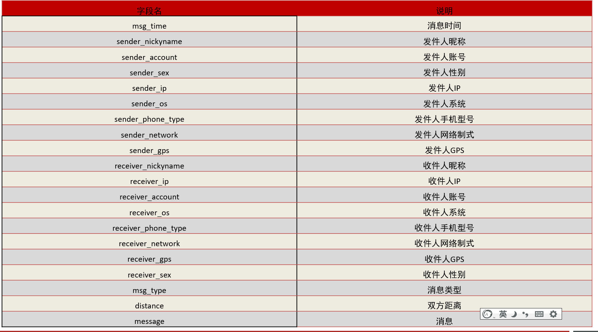
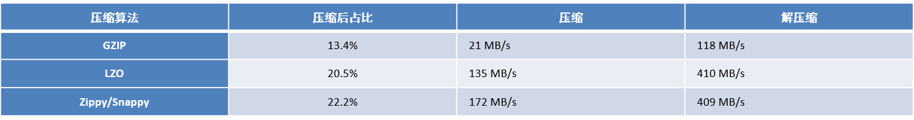

# 1- 陌陌案例介绍

- 需求: 将陌陌中聊天记录存储到hbase中, 并提供查询的方案
- 数据特点: 需要高并发写入操作, 读取操作较少  写多读少场景




# 2- 陌陌案例之HBase表结构设计

## 2-1 hbase的名称空间(命名空间)

- hbase的名称空间, 可以将其理解为MySQL中数据库
- 注意:

  * hbase默认提供了两个名称空间: default  和  hbase
    * default: 默认名称空间, 当我们创建表的时候, 没有指定名称空间, 默认就是创建到这个default空间下
    * hbase: 系统的名称空间, 主要是用于存储系统相关的表  meta表(元数据表) ,一般不使用


### 2-1-1 操作hbase的名称空间

#### 2-1-1-1 创建名称空间create_namespace

- 格式

``` sql
create_namespace '名称空间名称'
```

- 案例

``` sql
hbase(main):016:0> create_namespace 'momo_chat'
Took 0.2421 seconds                                                                                                                   
hbase(main):017:0> 
```

#### 2-1-1-2 查看名称空间list_namespace

- 格式

``` sql
list_namespace
describe_namespace '名称空间名称'
```

- 案例1： list_namespace

``` sql
hbase(main):018:0> list_namespace
NAMESPACE                                                                                                                             
default                                                                                                                               
hbase                                                                                                                                 
momo_chat                                                                                                                             
3 row(s)
Took 0.0105 seconds                                                                                                                   
hbase(main):019:0> 

```

- 案例2： describe_namespace

``` sql
hbase(main):017:0> describe_namespace 'momo_chat'
DESCRIPTION                                                                                                                           
{NAME => 'momo_chat'}                                                                                                                 
Took 0.0103 seconds                                                                                                                   
=> 1
hbase(main):018:0>
```


#### 2-1-1-3 在指定的名称空间下, 创建表

- 格式

``` sql
create '名称空间:表名' ,'列族1'...
```

- 案例

``` sql
hbase(main):022:0> create 'momo_chat:msg','C1'
Created table momo_chat:msg
Took 1.3587 seconds                                                                                                                   
=> Hbase::Table - momo_chat:msg
hbase(main):023:0> 

```


#### 2-1-1-4 删除名称空间drop_namespace

- 注意：
  -  如果对应空间下, 还有表, 是无法删除, 必须先删除表

- 格式

``` sql
drop_namespace '名称空间'
```

- 案例 ： 如果命名空间下有表不能直接删除

``` sql
hbase(main):028:0> drop_namespace 'momo_chat'

ERROR: org.apache.hadoop.hbase.constraint.ConstraintException: Only empty namespaces can be removed. Namespace momo_chat has 1 tables
	at org.apache.hadoop.hbase.master.procedure.DeleteNamespaceProcedure.prepareDelete(DeleteNamespaceProcedure.java:217)
	at org.apache.hadoop.hbase.master.procedure.DeleteNamespaceProcedure.executeFromState(DeleteNamespaceProcedure.java:78)
	at org.apache.hadoop.hbase.master.procedure.DeleteNamespaceProcedure.executeFromState(DeleteNamespaceProcedure.java:45)
	at org.apache.hadoop.hbase.procedure2.StateMachineProcedure.execute(StateMachineProcedure.java:189)
	at org.apache.hadoop.hbase.procedure2.Procedure.doExecute(Procedure.java:850)
	at org.apache.hadoop.hbase.procedure2.ProcedureExecutor.execProcedure(ProcedureExecutor.java:1473)
	at org.apache.hadoop.hbase.procedure2.ProcedureExecutor.executeProcedure(ProcedureExecutor.java:1241)
	at org.apache.hadoop.hbase.procedure2.ProcedureExecutor.access$800(ProcedureExecutor.java:75)
	at org.apache.hadoop.hbase.procedure2.ProcedureExecutor$WorkerThread.run(ProcedureExecutor.java:1761)

For usage try 'help "drop_namespace"'

Took 0.1256 seconds                                                                                                                   
hbase(main):029:0> 

```

- 先删除命名空间下的表再删除命名空间

``` sql
hbase(main):034:0> disable 'momo_chat:msg'
Took 0.4504 seconds                                                                                                                   
hbase(main):035:0> drop 'momo_chat:msg'
Took 0.2342 seconds                                                                                                                                                 
hbase(main):037:0> drop_namespace 'momo_chat'
Took 0.2200 seconds                                                                                                                   
hbase(main):038:0> 

```


## 2-2 hbase表的列族的设计

- **能少则少**, 能用一个解决的, 坚决不使用两个;


- 官方建议: 一般列族的配置 不大于 5个  支持非常多;
- 两个以上的列族HBase性能并不是很好；
- 一个列族所存储的数据达到flush的阈值（128M）时，表中所有列族将同时进行flush操作；
- 这将带来不必要的I/O开销，列族越多，对性能影响越大；


## 2-3 hbase表的版本设计

- 版本设计考虑点: 
  - 是否需要存储历史变更记录；
  - 数据是否会有历史变更操作；
- HBase表的默认版本值为1；
- 版本是相对于列族而言；
- 查看表的版本信息  VERSIONS =>

``` sql
hbase(main):041:0> describe 'MOMO_CHAT:MSG'                 {NAME => 'C1', VERSIONS => '1', EVICT_BLOCKS_ON_CLOSE => 'false', NEW_VERSION_BEHAVIOR => 'false', KEEP_DELETED_CELLS => 'FALSE', CACH
E_DATA_ON_WRITE => 'false', DATA_BLOCK_ENCODING => 'NONE', TTL => 'FOREVER', MIN_VERSIONS => '0', REPLICATION_SCOPE => '0', BLOOMFILTE
R => 'ROW', CACHE_INDEX_ON_WRITE => 'false', IN_MEMORY => 'false', CACHE_BLOOMS_ON_WRITE => 'false', PREFETCH_BLOCKS_ON_OPEN => 'false
', COMPRESSION => 'NONE', BLOCKCACHE => 'true', BLOCKSIZE => '65536'}                                                                 
1 row(s)
Took 0.0494 seconds                                                                                                                   
hbase(main):042:0> 

```


## 2-4 hbase的表的压缩方案的选择

### 2-4-1 压缩算法对比



### 2-4-2 查看表的压缩算法

``` sql
查看表的压缩算法 : describe 表名   看COMPRESSION
hbase(main):041:0> describe 'MOMO_CHAT:MSG'                 
{NAME => 'C1', VERSIONS => '1', EVICT_BLOCKS_ON_CLOSE => 'false', NEW_VERSION_BEHAVIOR => 'false', KEEP_DELETED_CELLS => 'FALSE', CACH
E_DATA_ON_WRITE => 'false', DATA_BLOCK_ENCODING => 'NONE', TTL => 'FOREVER', MIN_VERSIONS => '0', REPLICATION_SCOPE => '0', BLOOMFILTE
R => 'ROW', CACHE_INDEX_ON_WRITE => 'false', IN_MEMORY => 'false', CACHE_BLOOMS_ON_WRITE => 'false', PREFETCH_BLOCKS_ON_OPEN => 'false
', COMPRESSION => 'NONE', BLOCKCACHE => 'true', BLOCKSIZE => '65536'}                                                             
hbase(main):042:0> 
```

### 2-4-3 设置数据压缩 COMPRESSION

#### 2-4-3-1 创建表时指定压缩方案

- 格式：

``` sql
在创建表时指定压缩方案:
	create '表名' , {NAME=>'列族',COMPRESSION=>'压缩方案'}
```

- 案例

``` sql
hbase(main):049:0> create 'MOMO_CHAT:MSG' , {NAME=>'C1',COMPRESSION=>'GZ'}
Created table MOMO_CHAT:MSG
Took 0.8150 seconds                                                                                                                   
=> Hbase::Table - MOMO_CHAT:MSG
hbase(main):050:0> describe 'MOMO_CHAT:MSG'
Table MOMO_CHAT:MSG is ENABLED                                                                                                        
MOMO_CHAT:MSG                                                                                                                         
COLUMN FAMILIES DESCRIPTION                                                                                                           
{NAME => 'C1', VERSIONS => '1', EVICT_BLOCKS_ON_CLOSE => 'false', NEW_VERSION_BEHAVIOR => 'false', KEEP_DELETED_CELLS => 'FALSE', CACH
E_DATA_ON_WRITE => 'false', DATA_BLOCK_ENCODING => 'NONE', TTL => 'FOREVER', MIN_VERSIONS => '0', REPLICATION_SCOPE => '0', BLOOMFILTE
R => 'ROW', CACHE_INDEX_ON_WRITE => 'false', IN_MEMORY => 'false', CACHE_BLOOMS_ON_WRITE => 'false', PREFETCH_BLOCKS_ON_OPEN => 'false
', COMPRESSION => 'GZ', BLOCKCACHE => 'true', BLOCKSIZE => '65536'}                                                                   
1 row(s)
Took 0.0318 seconds                                                                                                                   
hbase(main):051:0> 

```

#### 2-4-3-2 建好的表添加压缩方案

- 格式：

``` sql
给以及建好的表添加压缩方案:
	alter '表名' , {NAME='列族',COMPRESSION=>'压缩方案'}
```

- 案例

``` sql

```


## 2-5 hbase表的预分区Region

- 一个表中默认只有一个region；

- 一个region只能有一个RegionServer管理； 

- 如果有大量的读写这个表，就会有高并发的问题；

- 每个region 有两个重要的属性：start key  和 end key ,表示这个region维护rowkey的范围;

- 默认一个region的表，start key  和 end key 都是空，没有边界；

- 当所有的数据都写入这个region时，达到了分裂的值（10G）,就会分裂Region. 取一个Mid key 来分裂两个region;

  

### 2-5-1 设置hbase的预分区

#### 2-5-1-1 方式一: 手动分区

- 使用条件： 如果提前我已经知道了rowkey有哪些，就用这种

- 格式: 

``` sql
create '表名' ,'列族1'... , SPLITS=>['1','2','3','4','5']
```

- 案例 : 这个案例生成了5个region

``` sql
hbase(main):039:0> create 'split1','c1',SPLITS=>['10','20','30','40']
Created table split1
Took 1.2467 seconds                                                                                                                     
=> Hbase::Table - split1
hbase(main):040:0> 

```


#### 2-5-1-2 通过读取一个外部的文件, 来划分region

- 格式

``` sql
方式二: 通过读取一个外部的文件, 来划分region
	格式: 
		create '表名','列族1' ...., SPLITS_FILE => '文件路径'
```


#### 2-5-1-3 hash 16进制hash 分区方案

- 使用条件： 如果不知道了rowkey有哪些，就用这种；

- 格式

``` sql
方式三: hash 16进制 分区方案
	create '表名' ,'列族名称1', .... , {NUMREGIONS=>N , SPLITALGO=>'HexStringSplit'}
```

- 案例

``` sql
hbase(main):040:0> create 'split2','c1',{NUMREGIONS=>5,SPLITALGO=>'HexStringSplit'}
Created table split2
Took 2.2800 seconds                                                                                                                     
=> Hbase::Table - split2
hbase(main):041:0> 

```


## 2-6 hbase的中rowkey的设计原则

### 2-6-1 官方rowkey的设置建议要求

- 避免使用递增行键/时序数据 当做rowkey的前缀; **散列原则**

  ``` properties
  因为: 递增行键或者时序数据, 前面数字有可能是一成不变, 此时会出现数据热点问题(所有数据都跑到一个region中)
  ```

  

- 避免rowkey和列的长度过大(长)： 一般20字节左右

  ```properties
  因为: 希望数据能够在内存中保留的越多, 读取的效率越高, 如果rowkey或者列设置比较长, 导致在有限内存中存储数据更小, 从而让数据提前的就flush磁盘上, 影响读取效率
  建议: rowkey长度一般为 10~100字节左右 , 尽可能的越短越好
  ```

- 使用Long类型比String类型更节省空间: 

  ``` properties
  如果rowkey中都是数字, 建议使用Long获取其他数值类型
  ```

- 保证rowkey的**唯一性**


### 2-6-2 避免数据出现热点问题

​	热点就是值client直接访问集群一个或者几个节点读写。大量的访问可能使得服务器节点超出承受能力。

### 2-6-3 解决热点问方案

#### 2-6-3-1 反转策略

​	缺点： 将原来的rowkey 自然顺序打乱；

#### 2-6-3-2 加盐策略

​	缺点： 将原来的rowkey 自然顺序打乱；

#### 2-6-3-3 hash取模策略（给固定的数据加固定的盐）

​	可以保证相关的数据放在一起；


# 3-准备工作

- 在hbase中创建存储数据的表:

``` sql
create 'MOMO_CHAT:MSG' ,{NAME=>'C1',COMPRESSION=>'GZ'},{NUMREGIONS=>6 , SPLITALGO=>'HexStringSplit'}

```


# 3- 陌陌案例之数据生成到HBase


请查看项目：

``` java
E:\JAVAworkSpace\HBase\day16_HBase_MOMO：

src\main\java\com\fiberhome\momo_chat\utils\ExcelReader.java

src\main\java\com\fiberhome\momo_chat\utils\Gen.java
```


# 4- 陌陌案例之数据查询

请查看项目：

``` sql
E:\JAVAworkSpace\HBase\day16_HBase_MOMO：

src\main\java\com\fiberhome\momo_chat\service\impl\ChatMessageServiceImpl.java
```


# 5- scan查询缺点

- scan 扫描查询都是将所有的数据全部查询到Client,然后再在Client进行过滤的。 这样的效率非常低； 
- 一边扫描数据库到Client,Client 一边在过滤。
- 优化方案：
  - 在服务器上就过滤；(协处理器)
  - 使用工具Phoenix;