[TOC]

# 1- Hbase介绍 Hbase 特点:

- 大数据中一款nosql型的数据库;
- <span style="color:red;background:white;font-size:20px;font-family:楷体;">**hbase不支持多行事务(只支持单行事务);**</span> 
- <span style="color:red;background:white;font-size:20px;font-family:楷体;">**也不支持SQL;**</span>
- <span style="color:red;background:white;font-size:20px;font-family:楷体;">**也没有表关系;**</span>
- <span style="color:red;background:white;font-size:20px;font-family:楷体;">**不支持join操作;**</span>
- <span style="color:red;background:white;font-size:20px;font-family:楷体;">**基于HDFS的, 数据最终都是存储在HDFS上**</span>； 
- <span style="color:blue;background:white;font-size:20px;font-family:楷体;">**主要是用于存储结构化和半结构化的数据 ；**</span>

# 2- Hbase数据存储结构 与 表模型

## 2-1 数据储存结构图

- [**表->region->CF->Hfile**]()
- 一个HBase 内有多个表table；
- 一个表内有多个region; (一个region是一个文件夹)
- 一个region 内有多个CF ；（一个CF是一个文件夹）CF 就是一个列族，[**列式存储格式**]()；
- 一个CF内有多个Hfile文件；
- 多个Hfile定期会合并为一个Hfile;

## 2-2 表模型

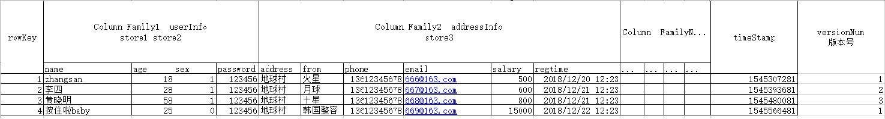

- **表(Table)**: 

- **row key**: 

- **列族(column family) CF**:

- **列名**

- **时间戳(timestamp):** 

- **版本号(version num):**  

- **单元格(cell):**

  - 如何确定一个单元格:  [**rowkey+列族+列名+时间戳**]()

  


- **列族(column family) CF:**  

# 3- hbase 和 RDBMS的区别

- RDBMS: 

  - 以表的方式来存储, 
  - 支持SQL 有表关系, 
  - 支持join 
  - 支持事务 
  - 单机存储方案

  

- HBase: 

  - 以表的方式来存储, 不支持SQL, 
  - 不存在表关系, 
  - 不支持join, 
  - 仅支持单行的事务 
  - 支持分布式存储

  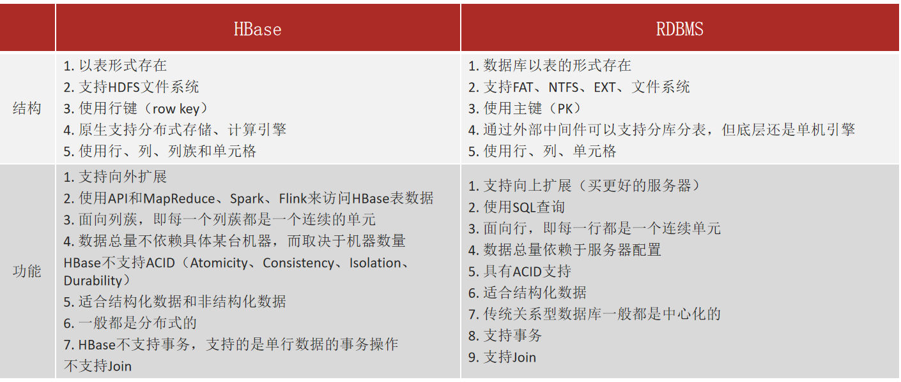


# 4- hbase 和 HDFS的区别


- HDFS: 
  - **文件系统**，适合于批量数据的操作, **吞吐量极高**的, 
  - **不支持[随机]()读写的能力**

- Hbase: 
  - **非关系型数据库**，
  - 基于HDFS, 数据最终都是存储在HDFS中, 
  - **支持高效随机读写的能力**,  
  - **不合适做大规模的逻辑分析工作（就是不适合做有逻辑计算的一些分析型工作）**, [一般都是存什么就读什么]():效率极高；

- 注意: 
  - <span style="color:red;background:white;font-size:20px;font-family:楷体;">**发现两者之间存在一定的矛盾关系, HDFS不支持随机读写, 但是HBASE支持随机读写, 而hbase基于HDFS**</span> (Hbase是标记删除和更新) 

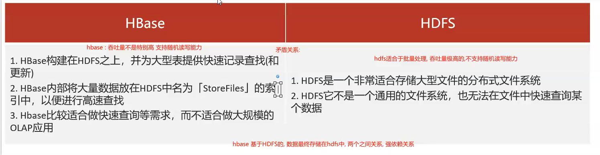


# 5- hbase 和 hive的区别

- hive: 
  - 数据分析的工具, 
  - 数据存储在hdfs中,
  -  数据仓库的工具,  
  - 主要是用于进行离线的分析处理, 
  - 延迟比较的高


- hbase: 
  - noSQL型数据库, 
  - 数据存储在hdfs中, 
  - 主要提供快速的随机读写能力, 
  - 延迟较低, 
  - 可以接入在线业务;
  - **不适合做分析型的工作；**

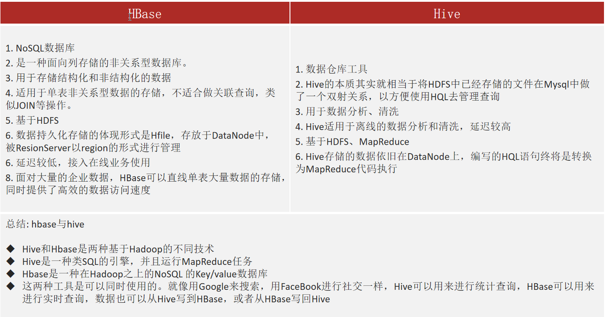


# 6- HBase 架构图

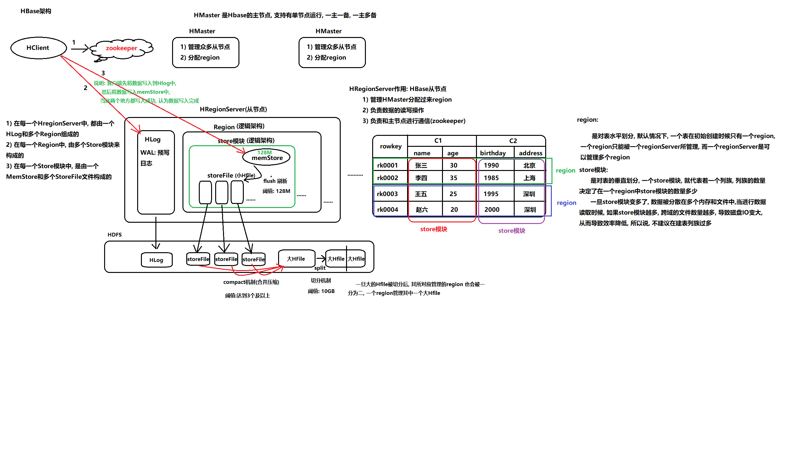

## 6-1 HMaster 主节点

- 主节点一般有 单个节点、 一主一备、一主多备。 但是一般使用的是**一主一备**

- 作用：
  - **管理所有的从节点 HRegionServer**；
  - **分配region**; 

## 6-2  HRegionServer从节点

- HRegionServer 一般都是一个集群，有多个HRegionServer;
- 作用：
  - **管理HMaster 分配过来的region;**
  - **负责数据的读写操作；**
  - **负责和主节点进行通信（zookeeper）；**
- 结构：
  - **HRegionServer = 1个HLog + n 个Region;**
  - **Region = n 个store模块；**
  - **store = 1个memStore + n 个 storefile;**


### 6-2-1 HLog

- **HLog 也叫做 WAL (预写日志)；**
- 在写数据之前先写日志并保存；
- HLog 日志是直接追加的方式写到**HDFS 磁盘**中；
- 如果内存的数据丢失可以在HLog 中找到；


### 6-2-2 region

- region是对表的水平划分(**根据rowkey水平划分**)；
- 默认情况下，一个表在初始创建时只有一个region;
- 一个region只能被一个regionserver 所管理； 
- 一个regionserver可以管理多个region;
- 一个region只能管理一个大的HFile文件；


### 6-2-3 store模块

- store 是对表的垂直划分；
- **一个store模块就代表一个列族**；
- 列族的数量决定了在一个region 中store模块的数量；
- store 模块越多，在读取数据的时候跨越文件读取就越复杂，导致磁盘IO变大，导致效率降低。（**这就是不建议在建表时创建多个列族**）


### 6-2-4 memstore 内存空间flush机制

- **刷新memstore中的数据到storeFile文件中**；

- 默认大小128M;
- 写满**128M 或者 一个小时候 就溢写**（flush）到一个文件storeFile(小Hfile)；


### 6-2-5 文件合并compact机制

- **当storefile 达到一定数量后就会合并storeFile生成一个大的Hfile文件**；（compact合并压缩机制）
- storefile 一般有3个以上就会合并；


### 6-2-6 大HFile 文件切分机制（split）

- **当HFile 被合并到一定大后就会被切分**；
- 阈值：10GB；
- 具体切分大小计算公式：**Min( region 个数的平方 * 128M，10Gb)**;  当region个数> 8 后， 每隔10GB切分HFile;
- HFile 被切分后就会**生成两个新的region，之前的region挂掉**；
- **一个region只能管理一个大的HFile**;


# 7- Hbase读写流程

## 7-1 HBase读取数据流程

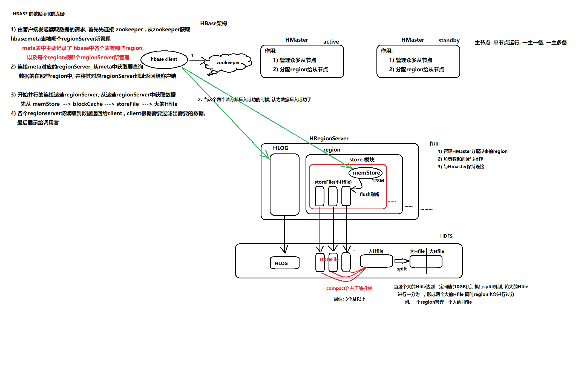

### 7-1-1读取流程描述

1. Client发起读取数据的请求；
2. Client连接zookeeper,**从zk 中获取hbase:meta表被哪个regionServer所管理**；
   - meta表中主要记录了 哪些信息？
     1. 记录了各个表；
     2. **每个表有哪些region，以及每个region的startkey 和 endkey**；
     3. **每个region在哪个regionServer上管理**；
     4. **表跟region的对应关系；**
3. Client 连接meta表所在的regionServer，从meta中获取要查询数据的表在哪个region中，并将对应的regionServer地址返回给客户端；
   - 如果是get() 查询直接返回某个region 所在的regionServer地址即可；
   - 如果是scan() 查询需要获取 该表的所有region 所在的regionServer地址；
4. 开始**并行** 连接这些regionServer，从中获取数据；
   - 获取数据顺序:
     - **memStore --> blockCache(块缓存)--> pipeLine管道(尽可能晚的flush到HDFS)--> storefile --> 大的Hfile**
     - 可以把memStore 理解为一级缓存；blockCache为二级缓存；
     - 注意: **块缓存**将一些[经常查询的数据单独缓存起来]()；块缓存并不是HBase技术，而是HDFS的技术
5. 各个regionServer **将读取到的数据返回个Client,Client 再根据条件要求过滤数据**，展示给调用者； 


## 7-2 HBase写数据流程

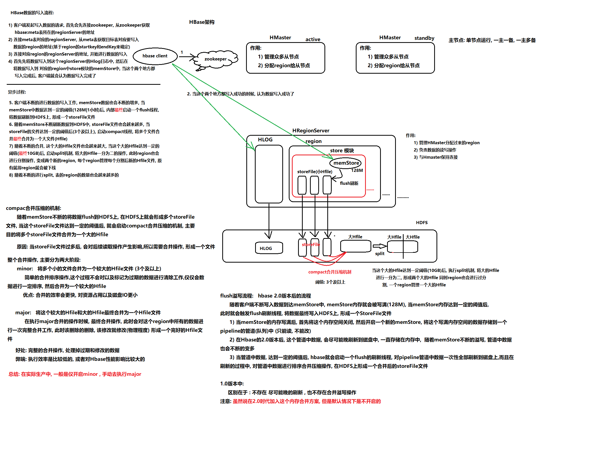

### 7-2-1写数据流程描述

1. Client发起写数据的请求；
2. Client连接zookeeper,**从zk 中获取hbase:meta表被哪个regionServer所管理**；
   - meta表中主要记录了 哪些信息？
     1. 记录了各个表；
     2. **每个表有哪些region，以及每个region的startkey 和 endkey**；
     3. **每个region在哪个regionServer上管理**；
     4. **表跟region的对应关系；**
3. Client 连接meta表所在的regionServer，从meta中获取要写入数据的表在哪个region中，并将对应的regionServer地址返回给客户端；
4. 连接对应region 的regionServer地址，并开始进行数据写入；
5. 写入顺序:
   - **首先将数据写入到这个regionServer的[Hlog]()日志中；**
   - **然后再将数据写入region中store模块的[memStore]()中；**
   - **Client写入工作完成；**

# 8- Hbase的各种机制

## 8-1 HBase的flush刷新机制

- **什么时候触发flush刷新机制？**
  - memstore 内存写满

- 当memstore 内存写满，**首先将这块内存关闭，然后开启一个新的memStore,将这个写满的内存空间的数据存储到一个pipeLine的管道（队列）中**（只能读，不能改）；
  - **尽可能晚**的flush到HDFS （目的:**1- 防止小文件产生；2- 在读数据的时候可以加快**）
  - 内存合并机制:
    - 基础型；（**不过滤过期和标记删除的数据**）
    - 饥渴型；（**过滤过期和标记删除的数据**）
    - 适应型；（**根据数据的量自动选择 基础型 和 饥渴型**）

- 这个管道中的数据会**尽可能晚的刷新到HDFS中**，一致存储在内存中随着memStore不断的溢写，管道中的数据也会不断的变多；
  - **好处**：1- 读数据的时候速度快；2- 防止过多的小文件生成
  - **缺点**就是占用内存；

- Hbase启动**flush刷新机制 ,刷新的过程中，对管道中的数据进行[排序合并压缩]()操作**之后在HDFS上生成一个合并后的sotreFile文件（这个文件很可能远远大于128M）；


## 8-2 HBase的合并压缩compact机制

- 什么条件出发storeFile合并机制？
  - 随着memStore不断将数据flush到HDFS上，在HDFS上形成的storefile文件越来越多，当sotrefile文件个数达到一定的阈值后，就会启动**compact机制**，主要目的**将多个storeFile文件合并成一个大的Hfile文件；**

- **合并操作分为两个步骤**
  - **minor** : [将多个小文件（sotrefile）合并成一个较大的HFile文件]()
    - minor: 触发时机 
      - storeFile文件达到3及以上的时候 
      - 刚刚启动Hbase集群的时候；
    - **这个过程不会对已经标记过期的数据进行清理工作**，仅仅会简单的合并排序操作， 然后形成一个较大的HFile文件；
    - 优点: 合并效率更快，对资源占用以及磁盘IO更小；
  - **major** :  [将较大的HFile文件合并大的Hfile]()
    - major: 触发时机
      - 默认触发时间: 7天  
      - 刚刚启动Hbase集群的时候；
    - 这就是最终的合并，此过程中会对region中所有的数据**进行一次完整的合并操作，该删除的删除，该修改的修改**，最终形成一个大的Hfile文件；
    - 优点:完整的合并操作，处理掉过期和修改的数据； 
    - 缺点:执行效率比较低，或者对HBase性能影响比较大；
- 总结:

  - **在实际生产中，一般仅开启minor,手动去执行major;**


## 8-3 Hbase的split的分裂的流程

- 功能描述:
  - split在最终达到10GB时候, 就会执行split分裂, **分裂之后, 就会形成两个新的Region, 原有Region就会被下线, 新的region会分别各种切分后Hfile文件**

* 注意: 

  * split的 最终10Gb 指的是当Hbase中Region数量达到9个及以上的时候, 采用按照10GB进行分裂,而什么分裂取决于以下这个公式:

  

``` sql
 R: 表的Region的数量
 flush.size: 默认值为 128
 Mmax.Filesize: 默认值 10GB
```


# 9- Hbase 对Region管理

## 9-1 region分配

- 任何时刻，**一个region只能分配给一个regionserver**;

- regionServer 与 region 是**一对多的关系**； 

- master记录了当前有哪些可用的regionserver,以及当前哪些region分配给了哪些regionserver，哪些region 还没有分配。（所有**region与regionServer的对应关系**）

- 当需要分配新region并且有regionserver有可用的空间时，master就给regionserver发送一个装载请求，把region分配给这个regionserver,regionserver 收到这个请求，就开始管理和对此region提供服务；


## 9-2 regionserver上线、下线

- regionserver的上线下线主要是通过两个机制来感知的:
  - **临时节点（会话级别）；**
  - **watch机制；**

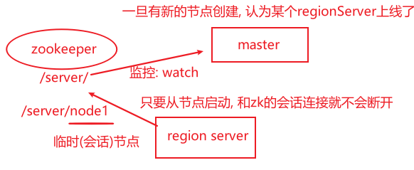

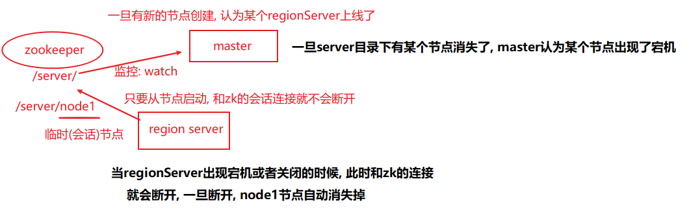


# 10- HBase的Master工作机制

## 10-1 master 上线流程

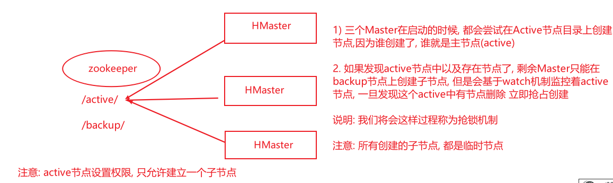

## 10-2 master 下线

- 由于**master 只维护表和region的元数据**，而不参与与表数据IO的过程，master下线仅导致所有元数据的修改被冻结；

  - **无法创建表**
  - **无法修改表的schema**
  - **无法进行region的负载均衡**
  - **无法处理region上下线**
  - **无法进行region的合并**
  - **唯一例外的是region的split可以正常进行，因为只有regionserver 参与**

  - **表的数据读写还可以正常进行**

- 因此**master下线短时间内对整个Hbase集群没有影响**


# 11- Hbase的 批量装载 --Bulk load

- 功能:

  - **将原来已经存在的数据加载到Hbase中**；

- 实现步骤:

  - 第一个步骤: **将数据文件转换为HFile文件格式**   -- MapReduce	
  - 第二个步骤: **将Hfile文件格式数据加载到Hbase中**

  ``` properties
  hbase org.apache.hadoop.hbase.tool.LoadIncrementalHFiles  数据路径 Hbase表名
  
  案例:
  hbase org.apache.hadoop.hbase.tool.LoadIncrementalHFiles  hdfs://node1.itcast.cn:8020/bulkLoad/output/  ITCAST_BANK:TRANSFER_RECORD
  ```

  

# 12- Hbase协处理器

- Hbase 作为列族数据库最经常被人诟病的特性包括:
  - 无法轻易建立“**二级索引**”   (使用Observer协处理器 可解决)
  - 难以执 行**求和、计数、排序**等操作， 无法实现**预聚合**操作； (使用endPoint协处理器 可解决)
- 总结
  - **Observer** 允许集群在正常的客户端操作过程中可以有不同的行为表现 (**Hook 钩子**)
  - **Endpoint** 允许扩展集群的能力，对客户端应用开放新的运算命令 （**预聚合**）
  - **observer** 类似于 RDBMS 中的**触发器**，主要在服务端工作
  - **endpoint** 类似于 RDBMS 中的**存储过程**，主要在 服务器端、client 端工作
  - **observer** 可以实现 **权限管理、优先级设置、监控、 ddl 控制、 二级索引**等功能
  - **endpoint** 可以实现 **min、 max、 avg、 sum、 distinct、 group by** 等功能

# 13- Rowkey设计原则 和 方法

## 13-1 RowKey的设计原则

- **rowkey长度原则**
  - 越短越好，10-100个字符；
- **rowkey高位散列原则**
  - <span style="color:red;font-size:20px;font-family:黑体;">如果不进行散列处理，首字段直接使用时间信息，所有该时段的数据都将集中到一个regionServer当中，这样当检索数据时，负载会集中到个别regionServer上，造成热点问题，会降低查询效率。</span>
  - 建议将**rowkey的高位字节采用散列字段处理，由程序随即生成,低位放时间字段**。这样将提高数据均衡分布，各个regionServer负载均衡的几率。
- **rowkey唯一原则**
  - 必须在设计上保证其唯一性；
  - rowkey是按照字典顺序排序存储的；

## 13-2 常用的rowkey设计方法

- **Salt加盐**

  - Salt是将每一个Rowkey加一个前缀，**前缀使用一些随机字符**，使得数据分散在多个不同的Region，达到Region负载均衡的目标；
  - 缺点
    - **Salt增加了写操作的吞吐量，缺点是同时增加了读操作的开销**： 因为，前缀加盐后分散到多个region中，写数据时：吞吐量大大增加； 读数据时：需要读多个region中的数据，会产生一定的开销；
    - 新的rowkey在查询的时候无法计算出来；
  - 案例

  ```properties
  比如在一个有4个Region(注：以 [ ,a)、[a,b)、[b,c)、[c, )为Region起至)的HBase表中，
  加Salt前的Rowkey：abc001、abc002、abc003
  我们分别加上a、b、c前缀，加Salt后Rowkey为：a-abc001、b-abc002、c-abc003
  ```

  

- **Hash散列或者Mod ** 

  - 用**Hash散列**来替代随机Salt前缀的好处是能让一个给定的行有**相同的前缀**，这在分散了Region负载的同时，使**读操作也能够推断**;
  - 确定性Hash(比如md5后取前4位做前缀)能让客户端重建完整的RowKey，**可以使用get操作直接get想要的行。**
  - **优点就是新的rowkey是可以计算出来的**。
  - 案例

  ``` properties
  例如将上述的原始Rowkey经过hash处理，此处我们采用md5散列算法取前4位做前缀，结果如下：
  9bf0-abc001 （abc001在md5后是9bf049097142c168c38a94c626eddf3d，取前4位是9bf0）
  7006-abc002
  95e6-abc003
  ```

- **Reverse反转**

  - **针对固定长度的Rowkey反转后存储**，这样可以使Rowkey中**经常改变的部分放在最前面**，可以有效的随机Rowkey。
  - 缺点
    - **牺牲了Rowkey的有序性**
  - 案例：手机号码

  ``` properties
  反转Rowkey的例子通常以手机举例，可以将手机号反转后的字符串作为Rowkey，这样的就避免了以手机号那样比较固定开头(137x、15x等)导致热点问题，
  ```

  

# 14 HBase写数据优化 BufferedMutator

- [一条条数据put到表中，对于大量数据的写入]()，**效率极低**，因此针对此项进行优化；
  - hbase的每一次put操作写入数据，实际上是一个**RPC操作**，将客户端的数据传输到hbase服务器再返回结果，适合小数据量写入，当需要写入大量数据时，**每一次put连接一次RPC连接，会增加连接次数，因此会增加传输时间和 IO 消耗**；
- 使用hbase客户端写**缓存进行批量写入数据到hbase中**；
- 使用hbase客户端写缓存对象:**BufferedMutator**；
- 区别：

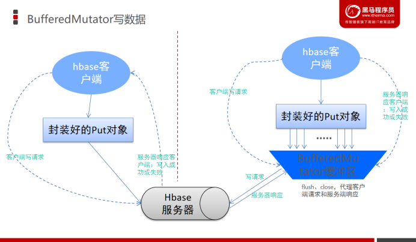


# 15- Hbase的预分区  SPLITS

## 15-1 手动分区

- 使用条件： 如果提前我已经知道了rowkey有哪些，就用这种

- 通过读取一个外部的文件, 来划分region;

## 15-2 hash 16进制hash 分区方案

- 使用条件： 如果不知道了rowkey有哪些，就用这种；	

