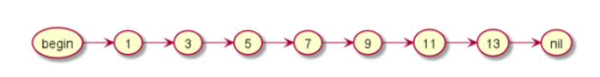
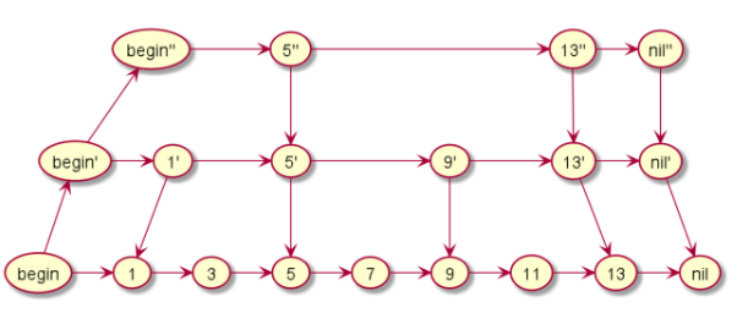
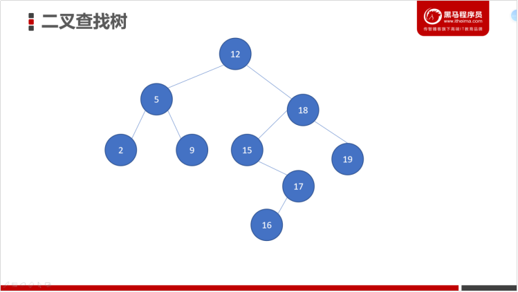
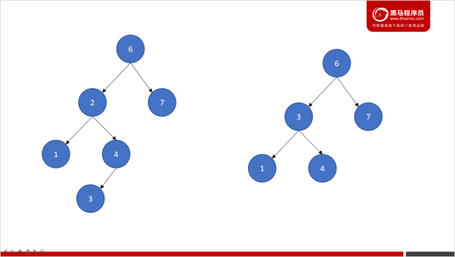
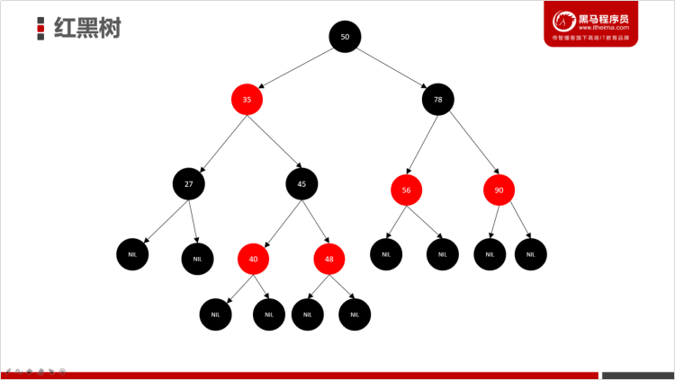

# 1- HBase 数据结构（扩展）

- Hbase 是使用的**LSM合并树** 的数据结构；

## 1-1 跳表

​	

​		上图是一个有序链表，我们要检索一个数据就挨个遍历。如果想要再提升查询效率，可以变种为以下结构：



- 跳表查询流程：

  - 先随机找到一个开始的地方；
  - 向右走一步，比较（目标数与当前节点数）；
  - 如果比当前节点数大，继续往右走；
  - 如果比当前节点数小，退回去向下走一步；

  总结：**整个走的路线 为z字形**；


## 1-2 二叉搜索树

- 二叉搜索树也叫二叉查找树。它是一种比较特殊的二叉树。
- 每个节点的两个子节点比较 (左边一定小于右边)
  - **左边子节点 < 当前节点 < 右边节点**




### 1-3-1 树的高度、深度、层数

- l 深度
  - 节点的深度是**根节点**到**这个节点**所经历的**边的个数**，**深度是从上往下数**的

- l 高度
  - 节点的高度是**该节点**到**叶子节点**的**最长路径**（**边数**），**高度是从下往上数**的

- l 层数
  - 根节点为第一层，往下依次递增


- 上图：
  - 节点12的  深度为0，高度为4，在第1层
  - 节点15的  深度为2，高度为2，在第3层

### 1-2-2 二叉搜索树的查询方式

``` properties
1- 首先和根节点进行比较，如果等于根节点，则返回
2- 如果小于根节点，则在根节点的左子树进行查找
3- 如果大于根节点，则在根节点的右子树进行查找
```


### 1-2-3 二叉搜索树缺点

- **1- 树越高，性能开销越大；**
  - 因为二叉搜索树是一种二叉树，每个节点只能有两个子节点，但有较多节点时，整棵树的高度会比较大，树的高度越大，搜索的性能开销也就越大;

- **2- 容易出现歪脖子树；**


## 1-3 平衡二叉树 （AVL树）


### 1-3-1  平衡二叉树概念

- 平衡二叉树也称为**AVL树**

- 它的任意节点**左右两个子节点**的**高度差**绝对值**不超过1**

- 平衡二叉树很好地解决了二叉查找树退化成链表（**歪脖子树**）的问题



- 上图分析：

``` properties
1. 两棵树都是二叉查找树

2. 左边的不是平衡二叉树

	节点2的高度为:2，
	节点7的高度为:0，
	左右字节的的高度差 超过了 1; 

3. 右边的是平衡二叉树

	节点3的高度为:1，
	节点7的高度为:0，
	左右字节的的高度差 没有超过1; 
```

### 1-3-2 平衡二叉树的特点

- AVL树是高度平衡的（严格平衡）；
- 频繁的插入和删除，**会引起频繁的rebalance**，导致效率下降；
- 它比较使用与**插入/删除较少，查找较多的场景**


## 1-4 红黑树

### 1-4-1 简介

- 红黑树是一种含有**红黑节点**并能**自平衡**的二叉搜索树，它满足以下性质：
  - 每个节点要么是黑色，要么是红色；
  - 根节点是黑色；
  - 每个叶子节点（NIL）是黑色；
  - 每个红色结点的两个子节点一定都是黑色；
  - **任意一结点到每个叶子节点的路径都包含数量相同的黑节点**；



### 1-4-2 红黑树的特点

- 和AVL树不一样，红黑树是一种弱平衡的二叉树；
- 它的插入/删除效率更高，所以对于插入、删除较多的情况下，就用红黑树；
- 查找效率也不低。例如：Java中的TreeMap就是基于红黑树实现的。


## 1-5 B树


## 1-6 B+树


## 1-7 LSM树数据结构


