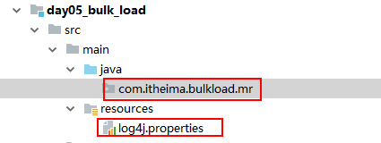
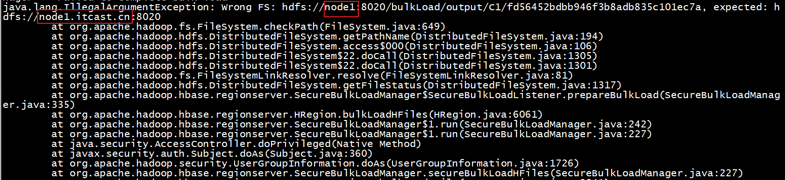
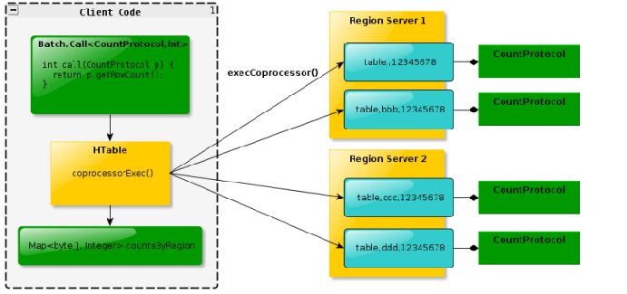
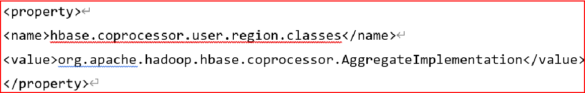
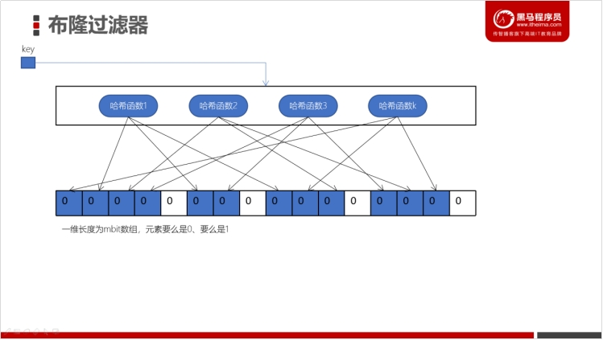

# 1- HBase的重要工作原理

## 1-1 HBase读取数据流程

### 1-1-1 图片:

- E:\笔记\MyNotes\Notes\大数据\05-HBase\06- HBase高级\images\01- HBase的数据读取流程.png


### 1-1-2 读取流程描述

1. Client发起读取数据的请求；
2. Client连接zookeeper,**从zk 中获取hbase:meta表被哪个regionServer所管理**；
   - meta表中主要记录了 哪些信息？
     1. 记录了各个表；
     2. **每个表有哪些region，以及每个region的startkey 和 endkey**；
     3. **每个region在哪个regionServer上管理**；
     4. **表跟region的对应关系；**
3. Client 连接meta表所在的regionServer，从meta中获取要查询数据的表在哪个region中，并将对应的regionServer地址返回给客户端；
   - 如果是get() 查询直接返回某个region 所在的regionServer地址即可；
   - 如果是scan() 查询需要获取 该表的所有region 所在的regionServer地址；
4. 开始**并行** 连接这些regionServer，从中获取数据；
   - 获取数据顺序:
     - **memStore --> blockCache(块缓存)--> storefile --> 大的Hfile**
     - 可以把memStore 理解为一级缓存；blockCache为二级缓存；
     - 注意: 块缓存将一些经常查询的数据单独缓存起来；块缓存并不是HBase技术，而是HDFS的技术
     - 
5. 各个regionServer **将读取到的数据返回个Client,Client 再根据条件要求过滤数据**，展示给调用者； 


## 1-2 HBase存储数据流程

### 1-2-1 图片:

- E:\笔记\MyNotes\Notes\大数据\05-HBase\06- HBase高级\images\02- HBase的数据写入流程.png


### 1-2-2 写入流程描述

#### 1-2-2-1 客户端流程

1. Client发起写数据的请求；
2. Client连接zookeeper,**从zk 中获取hbase:meta表被哪个regionServer所管理**；
   - meta表中主要记录了 哪些信息？
     1. 记录了各个表；
     2. **每个表有哪些region，以及每个region的startkey 和 endkey**；
     3. **每个region在哪个regionServer上管理**；
     4. **表跟region的对应关系；**
3. Client 连接meta表所在的regionServer，从meta中获取要写入数据的表在哪个region中，并将对应的regionServer地址返回给客户端；
4. 连接对应region 的regionServer地址，并开始进行数据写入；
5. 写入顺序:
   - 首先将数据写入到这个regionServer的**[Hlog]()**日志中；
   - 然后再将数据写入region中store模块的**[memStore]()**中；
   - Client写入工作完成；


#### 1-2-2-2 服务器端流程（异步流程）

1. 客户端不断的进行数据的写入工作， memStore中的数据达到一定的阈值（128M 或者 1个小时）后内部最终启动一个**flush机制**，将数据刷新到HDFS上形成一个storeFile文件； 
   - Hbase2.0后有个**内存合并**的机制 :合并到内存队列中， 尽可能晚的flush 到 storeFile中。
   - 合并方案:
     - **基础**型（**不过滤**过期、标记删除的数据）;
     - **饥渴**型（**过滤**过期、标记删除的数据）;
     - **适应**型 （根据过期、标记删除数据的量 **自动** 选择基础型或者饥渴型）；
2. 随着memStore不断的刷新数据到HDFS，sotreFile文件也会越来越多，当storeFile的文件达到一定的阈值（3个及以上），启动**compact机制**，将多个文件最终合并为一个较大的HFile文件 （**minor**）；
   - 不过滤过期、标记删除的数据；
3. 再将较大的HFile合并成一个更大的HFile 中（**major**）；
   - 过滤过期、标记删除的数据；
4. 随着不断的合并，这个大的HFile文件也越来越大，当这个大的Hfile文件达到一定的阈值（一般10G）后， 启动**split机制** 将大的Hfile一分为二，此时region也会进行分割操作， 变成两个region。每个region管理一个HFile文件，原来的region就会别下线； 
   - 阈值 公式:Min(region ^2 * 128M , 10G)
5. 随着不断的进行split,表的region 数量也会越来越多；


# 2- HBase原理之各种机制


## 2-1 HBase的flush刷新机制


### 2-1-1 内存flush溢写的流程

- hbase2.0版本flush溢写流程
  1. 随着客户端不断的写入数据到memStore到128M或者一个小时候，就触发**flush刷新机制**，将数据写入HDFS中，生成一个storefile 文件； 
     1. 当memstore 内存写满，**首先将这块内存关闭，然后开启一个新的memStore,将这个写满的内存空间的数据存储到一个pipeLine的管道（队列）中**（只能读，不能改）；
        - **尽可能晚**的flush到HDFS （目的:**1- 防止小文件产生；2- 在读数据的时候可以加快**）
        - 内存合并机制:
          - 基础型；（不过滤过期和标记删除的数据）
          - 饥渴型；（过滤过期和标记删除的数据）
          - 适应型；（根据数据的量自动选择 基础型 和 饥渴型）
     2. 这个管道中的数据会**尽可能晚的刷新到HDFS中**，一致存储在内存中随着memStore不断的溢写，管道中的数据也会不断的变多；
        - **好处**：1- 读数据的时候速度快；2- 防止过多的小文件生成
        - **缺点**就是占用内存；
     3. 当管道中的数据达到一定的阈值后(看你的内存)，hbase就会启动**flush刷新机制**，对pipeline管道中的数据一次性全部刷新操作，而且**这个刷新的过程中，对管道中的数据进行排序合并压缩操作**之后在HDFS上生成一个合并后的sotreFile文件（这个文件很可能远远大于128M）； 
- hbase1.0版本flush溢写流程
  1. 区别在于:不存在 **尽可能的晚刷新** ，也不存在合并溢写操作；
  2. 注意: 
     1. **虽然2.0版本加入了内存合并方案，但是默认情况下也是不开启的；**

- 溢写触发条件配置

  - 一旦memstore 达到128M时，触发flush溢写

    

  - memstore存活时间操过1小时（默认）触发flush溢写

    


### 2-1-2 pipeLine管道_内存合并的策略

#### 2-1-2-1 basic(基础型)

- 说明:仅做作为基本的合并, **不会对过期数据进行清除操作**；
- 优点:效率高 ,适合于这种有大量写的模式；
- 缺点:如果数据中大多数都是已经过期的时候, 此时做了许多无用功, 对磁盘IO开销也会比较大；

#### 2-1-2-2 eager(饥渴型)

- 说明:在合并的过程中, **尽可能的去除过期的无用的数据**, 保证合并后数据在当下都是可用的；
- 优点:合并后的文件会较少, 对磁盘IO比较低, 适用于数据过期比较快的场景(比如 购物车数据)；
- 缺点:由于合并需要多干活,会资源使用也会更多,  导致合并效率降低, 虽然IO减少, 但是依然效率是比较低下的；

#### 2-1-2-3 adaptive(适应型)

- 说明:在合并的过程中, 会根据**过期或者标记删除数据量** 来决定是否需要采用哪种方案, 当重复数据过多, 就会采用eager型, 否则使用basic(基础型)；
- 优点:更智能化, 自动切换
- 缺点:如果重复数据比较多 但是写入也比较频繁, 此时采用eager, 会导致资源被eager占用较大, 从而影响写入的效率

#### 2-1-2-4 配置内存合并策略

- 方案一:全局配置hbase-site.xml，所有的表都生效

``` xml
<property>
    <name>hbase.hregion.compacting.memstore.type</name>
    <value><none|basic|eager|adaptive></value>
</property>
```

- 方案二:针对某个表来设置

``` sql
create '表名'，{NAME=>'C1',IN_MEMORY_COMPACTION=>'BASIC'}
```


## 2-2 HBase的合并压缩compact机制

- 功能描述:

  随着memStore不断将数据flush到HDFS上，在HDFS上形成的storefile文件越来越多，当sotrefile文件个数达到一定的阈值后，就会启动**compact机制**，主要目的将多个storeFile文件合并成一个大的Hfile文件；

- 原因:

  当sotrefile文件过多，会对后续读取操作产生影响，所以需要合并操作形成一个文件；

### 2-2-1 合并操作分为两个步骤

#### 2-2-1-1 minor

- 将多个小文件（sotrefile）合并成一个较大的HFile文件；

  - **这个过程不会对已经标记过期的数据进行清理工作**，仅仅会简单的合并排序操作， 然后形成一个较大的HFile文件；
  - 优点: 合并效率更快，对资源占用以及磁盘IO更小；

  

#### 2-2-1-2 major

- 将较大的HFile文件合并大的Hfile；

  - 这就是最终的合并，此过程中会对region中所有的数据**进行一次完整的合并操作，改删除的删除，改修改的修改**，最终形成一个大的Hfile文件；
  - 优点:完整的合并操作，处理掉过期和修改的数据； 
  - 缺点:执行效率比较低，或者对HBase性能影响比较大；

- 总结:

  - **在实际生产中，一般仅开启minor,手动去执行major;**

  

#### 2-2-1-3 触发条件

- minor: 触发时机 
  - storeFile文件达到3及以上的时候 
  -  刚刚启动Hbase集群的时候；
- major: 触发时机
  - 默认触发时间: 7天  
  - 刚刚启动Hbase集群的时候；

#### 2-2-1-4 HBase与HDFS矛盾点

- 矛盾描述:
  - HBase支持随机读写功能, HBase基于HDFS, 而HDFS不支持随机读写, 如何解决呢?
- 矛盾处理方案:**在内存中处理过期的数据**
  - 在Hbase中, 所有的数据随机操作,都是对内存中数据进行处理, 如果是添加, 在内存中加入数据, 如果修改, 同样也是添加操作(时间戳记录版本),  如果删除,本应该是直接到磁盘中将数据删除, 但是HDFS不支持, 在内存中记录好这个标记,不显示给用户看即可;
  - 在进行storeFile的major合并操作的时候, **此时将HDFS的数据读取出来到内存中, 边读取边处理（在内存中处理过期的数据）**, 边将数据追加到HDFS中 ；


## 2-3 Hbase的split的分裂的流程

- 功能描述:
  - split在最终达到10GB时候, 就会执行split分裂, **分裂之后, 就会形成两个新的Region, 原有Region就会被下线, 新的region会分别各种切分后Hfile文件**

* 注意: 

  * split的 最终10Gb 指的是当Hbase中Region数量达到9个及以上的时候, 采用按照10GB进行分裂,而什么分裂取决于以下这个公式:

  

``` sql
 R: 表的Region的数量
 flush.size: 默认值为 128
 Mmax.Filesize: 默认值 10GB
```


## 2-4 HBase的Region管理


### 2-5-1 region分配

- 任何时刻，一个region只能分配给一个regionserver;

- regionServer 与 region 是一对多的关系； 

- master记录了当前有哪些可用的regionserver,以及当前哪些region分配给了哪些regionserver，哪些region 还没有分配。（所有**region与regionServer的对应关系**）

- 当需要分配新region并且有regionserver有可用的空间时，master就给regionserver发送一个装载请求，把region分配给这个regionserver,regionserver 收到这个请求，就开始管理和对此region提供服务；

  


### 2-5-2 regionserver上线


- master使用ZK来跟踪regionserver的状态； 
- 当某个regionserver启动时:
  - **首先在ZK上的server目录下建立代表自己的 znode(临时节点)**；（临时节点的特点是会话级别，没有子节点）
  - **由于master订阅了server目录的变更消息（match机制）** 当server目录下的文件出现了新增或者删除操作时，master可以获取来自ZK的实时通知；
  - 一旦regionserver上线，master能马上得到消息； 


### 2-5-3 regionserver下线


- 当regionserver下线时，它和ZK的会话断开，ZK会自动释放代表这台server的文件上的**独占锁**；
- master就可以确定
  - regionserver和ZK之间的网络断开了；
  - regionserver挂了；
- 无论哪种情况，regionserver都无法继续为它的region提供服务了，此时，master会删除server目录下代表这台regionserver的znode数据，并将这台regionserver的region分配给其它还活着的节点；

- 总结:

``` sql
regionserver的上线下线主要是通过两个机制来感知的:
	1- 临时节点（会话级别）；
	2- watch机制
```


## 2-5 HBase的Master工作机制


### 2-5-1 master 上线流程


- 从ZK上**获取唯一一个代表active master的锁**，用来阻止其它master成为active master;（**抢锁机制**）
- 一般hbase集群中有一个master在提供服务（active）,还有一个或多个standby 的‘master'在等待时机抢占它的位置；
- 扫描ZK上的server父节点，获得当前可用的regionserver列表；
- 和每个regionserver 通信，获得当前已分配的region和regionserver的对应关系； 
- 扫描meta.region的集合，计算当前还未分配的region，将它们放入待分配的region列表中； 


### 2-5-2 master 下线流程

- 由于**master 只维护表和region的元数据**，而不参与与表数据IO的过程，master下线仅导致所有元数据的修改被冻结；

  - **无法创建表**
  - **无法修改表的schema**
  - **无法进行region的负载均衡**
  - **无法处理region上下线**
  - **无法进行region的合并**
  - **唯一例外的是region的split可以正常进行，因为只有regionserver 参与**

  - **表的数据读写还可以正常进行**

- 因此**master下线短时间内对整个hbase集群没有影响**
- 从上线过程可以看到，master保存的信息全是冗余信息（都可以从系统其它地方收集或者计算出来）


# 3- HBase批量装载--bulk load


- 功能:
  - **将原来已经存在的数据加载到Hbase中**；

- 实现步骤:
  - 第一个步骤: **将数据文件转换为HFile文件格式**   -- MapReduce	
  - 第二个步骤: **将Hfile文件格式数据加载到Hbase中**


原有的数据写入操作大致流转流程: 

```properties
正常写入数据的流程: 数据写入到Hlog --> memStore --> pipeLine --> storeFile --> Hfile  
```

​       如果已经有一批数据, 需要写入到Hbase中某个表中, 传统做法, 按照上述流程, 一步步将数据最终写入Hfile中, 此时整个region集群会经历大量的写入请求操作, hbase集群需要调度大量资源来满足本次的数据写入工作,如果这个时候, 又出现大量的读取数据请求也去访问这个表, 会发生什么问题呢? 读取性能有可能回受到影响 甚至出现卡顿现象

思考如何解决呢? 

```properties
hbase的Bulk Load 说明: 
	对一批数据, 提前按照HBase的Hfile文件格式存储好, 然后将Hfile文件格式数据直接放置到Hbase对应数据目录下, 让Hbase直接加载, 此时不需要Hbase提供大量的写入资源, 即可完成全部数据写入操作
	
	
总结: 
	第一个步骤: 将数据文件转换为HFile文件格式   -- MapReduce
	第二个步骤: 将Hfile文件格式数据加载到Hbase中
```


## 3-1 需求说明

* 需求: 需要将每一天的银行转账记录的数据 存储到HBase中 , 数据量比较的庞大
  * 数据所在位置: HDFS中, 
  * 数据格式为: CSV  分割符号为逗号

![[image-20210119145033844]](images/image-20210119145033844.png)

## 3-2 准备工作  

* 1) 在hbase中创建名称空间, 并创建hbase的表

```shell
# 创建名称空间: 
create_namespace 'ITCAST_BANK'
# 在名称空间下, 创建目标表: 
create 'ITCAST_BANK:TRANSFER_RECORD' ,{NAME=>'C1',COMPRESSION=>'GZ'},{NUMREGIONS=>6,SPLITALGO=>'HexStringSplit'}
```

* 2) 创建 maven项目 加载相关的pom 依赖

  说明: 如果将此全部导入到本项目中, 出现全部爆红错误, 可以将此内容放置到父工程的pom依赖中

  此时 有可能导致其他某个项目爆红(不用管), 只需要保证当前自己的项目没有任何问题即可

```xml
    <repositories>
        <repository>
            <id>aliyun</id>
            <url>http://maven.aliyun.com/nexus/content/groups/public/</url>
            <releases>
                <enabled>true</enabled>
            </releases>
            <snapshots>
                <enabled>false</enabled>
                <updatePolicy>never</updatePolicy>
            </snapshots>
        </repository>
    </repositories>


    <dependencies>

        <dependency>
            <groupId>org.apache.hbase</groupId>
            <artifactId>hbase-client</artifactId>
            <version>2.1.0</version>
        </dependency>

        <dependency>
            <groupId>org.apache.hbase</groupId>
            <artifactId>hbase-mapreduce</artifactId>
            <version>2.1.0</version>
        </dependency>

        <dependency>
            <groupId>org.apache.hadoop</groupId>
            <artifactId>hadoop-mapreduce-client-jobclient</artifactId>
            <version>2.7.5</version>
        </dependency>

        <dependency>
            <groupId>org.apache.hadoop</groupId>
            <artifactId>hadoop-common</artifactId>
            <version>2.7.5</version>
        </dependency>

        <dependency>
            <groupId>org.apache.hadoop</groupId>
            <artifactId>hadoop-mapreduce-client-core</artifactId>
            <version>2.7.5</version>
        </dependency>

        <dependency>
            <groupId>org.apache.hadoop</groupId>
            <artifactId>hadoop-auth</artifactId>
            <version>2.7.5</version>
        </dependency>

        <dependency>
            <groupId>org.apache.hadoop</groupId>
            <artifactId>hadoop-hdfs</artifactId>
            <version>2.7.5</version>
        </dependency>

        <dependency>
            <groupId>commons-io</groupId>
            <artifactId>commons-io</artifactId>
            <version>2.6</version>
        </dependency>
    </dependencies>


    <build>
        <plugins>
            <plugin>
                <groupId>org.apache.maven.plugins</groupId>
                <artifactId>maven-compiler-plugin</artifactId>
                <version>3-1</version>
                <configuration>
                    <target>1.8</target>
                    <source>1.8</source>
                </configuration>
            </plugin>
        </plugins>
    </build>
```

* 3) 在项目中创建包 和 添加配置文件log4j.properties



* 4) 将转换csv数据上传到HDFS中: 数据在资料中

```shell
hdfs dfs -mkdir -p /bulkLoad/output

hdfs dfs -put bank_record.csv /bulkLoad/output
```


## 3-3 将CSV数据转换为HFile文件格式数据

* map 程序的代码

```java
package com.itheima.bulkload.mr;

import org.apache.hadoop.hbase.client.Put;
import org.apache.hadoop.hbase.io.ImmutableBytesWritable;
import org.apache.hadoop.io.LongWritable;
import org.apache.hadoop.io.Text;
import org.apache.hadoop.mapreduce.Mapper;

import java.io.IOException;

public class BulkLoadMapper extends Mapper<LongWritable,Text,ImmutableBytesWritable,Put> {
    private  ImmutableBytesWritable k2 = new ImmutableBytesWritable();
    @Override
    protected void map(LongWritable key, Text value, Context context) throws IOException, InterruptedException {

        //1. 获取一行数据
        String line = value.toString();

        if(line != null && !"".equalsIgnoreCase(line)){
            //2. 对数据进行切割操作
            String[] fields = line.split(",");
            //3- 封装k2 和 v2的数据
            //封装 k2
            String rowkeyStr = fields[0];
            k2.set(rowkeyStr.getBytes());

            // 封装v2
            Put v2 = new Put(rowkeyStr.getBytes());
            v2.addColumn("C1".getBytes(),"code".getBytes(),fields[1].getBytes());
            v2.addColumn("C1".getBytes(),"rec_account".getBytes(),fields[2].getBytes());
           		 		v2.addColumn("C1".getBytes(),"rec_bank_name".getBytes(),fields[3].getBytes());
            v2.addColumn("C1".getBytes(),"rec_name".getBytes(),fields[4].getBytes());
            v2.addColumn("C1".getBytes(),"pay_account".getBytes(),fields[5].getBytes());
            v2.addColumn("C1".getBytes(),"pay_name".getBytes(),fields[6].getBytes());
            v2.addColumn("C1".getBytes(),"pay_comments".getBytes(),fields[7].getBytes());
            v2.addColumn("C1".getBytes(),"pay_channel".getBytes(),fields[8].getBytes());
            v2.addColumn("C1".getBytes(),"pay_way".getBytes(),fields[9].getBytes());
            v2.addColumn("C1".getBytes(),"status".getBytes(),fields[10].getBytes());
            v2.addColumn("C1".getBytes(),"timestamp".getBytes(),fields[11].getBytes());
            v2.addColumn("C1".getBytes(),"money".getBytes(),fields[12].getBytes());


            //4. 输出
            context.write(k2,v2);

        }


    }
}

```

* 驱动类的代码

```java
package com.itheima.bulkload.mr;

import org.apache.hadoop.conf.Configuration;
import org.apache.hadoop.fs.Path;
import org.apache.hadoop.hbase.HBaseConfiguration;
import org.apache.hadoop.hbase.TableName;
import org.apache.hadoop.hbase.client.*;
import org.apache.hadoop.hbase.io.ImmutableBytesWritable;
import org.apache.hadoop.hbase.mapreduce.HFileOutputFormat2;
import org.apache.hadoop.mapreduce.Job;
import org.apache.hadoop.mapreduce.lib.input.TextInputFormat;

public class BulkLoadDriver {


    public static void main(String[] args) throws Exception {

        //1. 获取job对象
        //Configuration conf = new Configuration();
        Configuration conf = HBaseConfiguration.create();
        conf.set("hbase.zookeeper.quorum","node1:2181,node2:2181,node3:2181");
        Job job = Job.getInstance(conf, "BulkLoadDriver");

        //2. 配置集群运行的必备项
        job.setJarByClass(BulkLoadDriver.class);

        //3- 配置 MR的天龙八部

        //3-1: 指定输入类, 及其输入的路径
        job.setInputFormatClass(TextInputFormat.class);
        TextInputFormat.addInputPath(job,new Path("hdfs://node1:8020/bulkLoad/input/bank_record.csv"));

        //3-2: 指定map类 及其输出的k2和v2的类型
        job.setMapperClass(BulkLoadMapper.class);
        job.setMapOutputKeyClass(ImmutableBytesWritable.class);
        job.setMapOutputValueClass(Put.class);

        //3-3 : 指定 shuffle操作:  分区 排序 规约 分组  默认即可

        //3-7: 指定reduce类, 及其输出 k3 和 v3的类型
        job.setNumReduceTasks(0);

        job.setOutputKeyClass(ImmutableBytesWritable.class);
        job.setOutputValueClass(Put.class);


        //3-8: 设置输出类, 及其输出的路径: HFile文件格式
        job.setOutputFormatClass(HFileOutputFormat2.class);
        HFileOutputFormat2.setOutputPath(job,new Path("hdfs://node1:8020/bulkLoad/output"));

        Connection conn = ConnectionFactory.createConnection(conf);
        Table table = conn.getTable(TableName.valueOf("ITCAST_BANK:TRANSFER_RECORD"));

        HFileOutputFormat2.configureIncrementalLoad(job,table,conn.getRegionLocator(TableName.valueOf("ITCAST_BANK:TRANSFER_RECORD")));

        //4. 提交任務
        boolean flag = job.waitForCompletion(true);

        //5. 退出程序
        System.exit(flag ? 0 : 1);
    }

}

```


## 3-4 将Hfile文件格式数据加载HBase中

语法说明:

```shell
hbase org.apache.hadoop.hbase.tool.LoadIncrementalHFiles  数据路径 Hbase表名
```

案例

```shell
hbase org.apache.hadoop.hbase.tool.LoadIncrementalHFiles  hdfs://node1.itcast.cn:8020/bulkLoad/output/  ITCAST_BANK:TRANSFER_RECORD
```


导入时 发现报错了


此时可以通过查看当前执行对应regionServer的日志文件:

 tail -100f hbase-root-regionserver-node2.out



错误原因: 是由于在安装软件过程中, 采用不同域名来操作, 导致Hbase无法识别  从而导致数据加载失败了

如何解决呢? 建议选择 HDFS的修改 

```shell
修改 node1的hdfs的core-site.xml
cd /export/server/hadoop-2.7.5/etc/hadoop
vim core-site.xml
# 修改一下内容: 
 		<property>
             <name>fs.defaultFS</name>
             <value>hdfs://node1.itcast.cn:8020</value>
         </property>
修改完成后, 将core-site.xml 发送给node2和node3
scp -r core-site.xml node2:$PWD
scp -r core-site.xml node3:$PWD

还需要修改: slaves文件:  
vim slaves
# 修改为以下内容:
node1.itcast.cn
node2.itcast.cn
node3-itcast.cn

# 将此文件 发生给 node2 和 node3
scp -r slaves node2:$PWD
scp -r slaves node3:$PWD

```


# 4- HBasede 协处理器（Compressor）

## 4-1 协处理器的起因

- Hbase 作为列族数据库最经常被人诟病的特性包括:
  - 无法轻易建立“**二级索引**”   (使用Observer协处理器 可解决)
  - 难以执 行**求和、计数、排序**等操作， 无法实现**预聚合**操作； (使用endPoint协处理器 可解决)
  - Hbase 0.92版本之后能够轻易的建立二级索引。


- Hbase的协处理器主要有二大类: observer  和 endpoint


## 4-2 observer: 

* 可以将其看做是**拦截器(过滤器 触发器)**,  可以基于这种协处理器对Hbase相关操作进行**监控**(**钩子 Hook**)
  * **Hook 钩子:前置Hook （preXxx）, 后置Hook(posXxx);**
  * 三种观察者observer:
    * **RegionObserver: 提供客户端的数据操纵事件钩子:get,put,delete,scan等**；
    * **WALObserver : 提供WAL相关操作钩子**；
    * **MasterObserver: 提供DDL-类型的操作钩子**。如:创建、删除、修改数据表等；
* 例如: 监控用户插入到某个表操作, 插入之前要打印一句话
* ObServer所提供一些类, 这些类可以监控到HBase中各种操作: 对数据的CURD 对表的CURD 对region的操作 对日志操作
* Observer能做什么事情?
  * 1) 记录操作日志
  * 2) 权限的管理
* Observer协处理器的原理流程
  * 比如客户端发起get请求
  * 该请求被分派给合适的RegionServer和Region
  * **coprocessorHost拦截该请求**，然后在该表上登记的每个RegionObserer上调用**前置Hook preGet()**
  * 如果没有被preGet拦截，该请求继续送到Region，然后进行处理
  * Region产生的结果再次被**coprocessorHost拦截**，调用**后置Hook posGet**() 处理
  * 加入没有postGet()拦截该响应，最终结果被返回给客户端


## 4-3 endpoint: 

- 理解:
  - 可以看做数据库中**存储过程**；
  - 也可以看做在**java代码中封装一个方法(功能)**；
  - **MR思想**:将这个方法放置服务端, 让服务器进行执行操作, 客户端只需要拿到服务端执行结果即可

* 作用: 执行一些聚合操作: 求和 求差  求最大 ....
* 原理:**MR思想**， 将每个region先各自计算结果， 再将各自的结果返回给客户端， 最后客户端做一次计算即可；




## 4-4 HBase的协处理器_概念总结

- Observer 允许集群在正常的客户端操作过程中可以有不同的行为表现 (**Hook 钩子**)
- Endpoint 允许扩展集群的能力，对客户端应用开放新的运算命令 （**预聚合**）
- observer 类似于 RDBMS 中的**触发器**，主要在服务端工作
- endpoint 类似于 RDBMS 中的**存储过程**，主要在 服务器端、client 端工作
- observer 可以实现 **权限管理、优先级设置、监控、 ddl 控制、 二级索引**等功能
  endpoint 可以实现 **min、 max、 avg、 sum、 distinct、 group by** 等功能


## 4-5 HBase的协处理器_加载的方式

- **静态加载:** 
  - 通过修改 **hbase-site.xml** 这个文件来实现
  - 启动**全局** aggregation，能过**操纵所有的表**上的数据。只需要添加如下代码




- **动态加载:**
  - 启用表 aggregation，只对特定的表生效
  - 通过 HBase Shell 来实现，disable 禁用表
  - 添加 aggregation , 添加后启用表即可
          hbase> alter 'mytable', METHOD => 'table_att','coprocessor'=>'|org.apache.Hadoop.hbase.coprocessor.AggregateImplementation||'


## 4-6 HBase的协处理器_卸载的方式

- 1) 禁用表: 
       disable 'test'
- 2) 修改表: 删除协处理器的配置信息
       alter ‘test’, METHOD => 'table_att_unset', NAME => 'coprocessor$1’
- 3) 启动表
      enable 'test'


# 5- HBase调优说明

## 5-1 通用调优

- NameNode的元数据备份使用SSD(固态硬盘)
- 定时备份NameNode上的元数据
  - 每小时或者每天备份，如果数据极其重要，可以5~10分钟备份一次。
  - 备份可以通过定时任务(crontab -e)复制元数据目录即可。
- 为NameNode指定多个元数据目录
  - 使用dfs.name.dir或者dfs.namenode.name.dir指定。一个指定本地磁盘，一个指定网络磁盘。这样可以提供元数据的冗余和健壮性，以免发生故障。
  - 设置dfs.namenode.name.dir.restore为true，允许尝试恢复之前失败的dfs.namenode.name.dir目录，在创建checkpoint时做此尝试，如果设置了多个磁盘，建议允许。
- NameNode节点配置为**RAID1（镜像盘）**结构; （**就是一个磁盘放数据， 另一个磁盘备份数据**）
- **保持NameNode日志目录有足够的空间**，有助于帮助发现问题;
- Hadoop是IO密集型框架，所以尽量提升存储的速度和吞吐;


总结：**NameNode 服务器硬件性能好 + 数据备份** 


## 5-2 Linux调优

- 开启**文件系统的预读缓存**可以提高读取速
  - $ sudo blockdev --setra 32768 /dev/sda   （尖叫提示:ra是readahead的缩写）

- **最大限度使用物理内存** （尽可能少的使用交换内存）

``` shell
$ sudo sysctl -w vm.swappiness=0

# swappiness，Linux内核参数，控制换出运行时内存的相对权重
# swappiness 参数值可设置范围在0到100之间，低参数值会让内核尽量少用交换，更高参数值会使内核更多的去使用交换空间
# 默认值为60（当剩余物理内存低于40%（40=100-60）时，开始使用交换空间）
# 对于大多数操作系统，设置为100可能会影响整体性能，而设置为更低值（甚至为0）则可能减少响应延迟
```

- 调整**ulimit上限**, 默认值为比较小的数字 （每个用启动程序的个数）

``` shell
$ ulimit -n 查看允许最大进程数
$ ulimit -u 查看允许打开最大文件数
```

- 开启集群的**时间同步**NTP


## 5-3 HDFS调优

- 保证RPC调用会有**较多的线程**

``` properties
属性:dfs.namenode.handler.count
解释:该属性是NameNode服务默认线程数，默认值是10，根据机器的可用内存可以调整为50~100


属性:dfs.datanode.handler.count
解释:该属性默认值为10，是DataNode的处理线程数，如果HDFS客户端程序读写请求比较多，可以调高到15~20，设置的值越大，内存消耗越多，不要调整的过高，一般业务中，5~10即可。

```

- 副本数量的调整

``` properties
属性:dfs.replication
解释:如果数据量巨大，且不是非常之重要，可以调整为2~3，如果数据非常之重要，可以调整为3~5。
```

- 文件块大小的调整

``` properties
属性:dfs.blocksize
解释:块大小定义，该属性应该根据存储的大量的单个文件大小来设置，如果大量的单个文件都小于100M，建议设置成64M块大小，对于大于100M或者达到GB的这种情况，建议设置成256M，一般设置范围波动在64M~256M之间。
```


## 5-4 HBase的调优

- 优化DataNode允许的最大文件数

``` properties
属性:dfs.datanode.max.transfer.threads
文件:hdfs-site.xml
解释:HBase一般都会同一时间操作大量的文件，根据集群的数量和规模以及数据动作，设置为4096或者更高。默认值:4096
```

- 优化延迟高的数据操作的等待时间

``` properties
属性:dfs.image.transfer.timeout
文件:hdfs-site.xml
解释:如果对于某一次数据操作来讲，延迟非常高，socket需要等待更长的时间，建议把该值设置为更大的值（默认60000毫秒），以确保socket不会被timeout掉。
```

- 优化数据的写入效率

```properties
属性:
          mapreduce.map.output.compress
          mapreduce.map.output.compress.codec
文件:mapred-site.xml
解释:开启这两个数据可以大大提高文件的写入效率，减少写入时间。第一个属性值修改为true，第二个属性值修改为:org.apache.hadoop.io.compress.GzipCodec
```

- 优化DataNode存储

``` properties
属性:dfs.datanode.failed.volumes.tolerated
文件:hdfs-site.xml
解释:默认为0，意思是当DataNode中有一个磁盘出现故障，则会认为该DataNode shutdown了。如果修改为1，则一个磁盘出现故障时，数据会被复制到其他正常的DataNode上。
```

-  设置RPC监听数量

``` properties
属性:hbase.regionserver.handler.count
文件:hbase-site.xml
解释:默认值为30，用于指定RPC监听的数量，可以根据客户端的请求数进行调整，读写请求较多时，增加此值。 
```

- 优化HStore文件大小

``` properties
属性:hbase.hregion.max.filesize
文件:hbase-site.xml
解释:默认值10737418240（10GB），如果需要运行HBase的MR任务，可以减小此值，因为一个region对应一个map任务，如果单个region过大，会导致map任务执行时间过长。该值的意思就是，如果HFile的大小达到这个数值，则这个region会被切分为两个Hfile。
```

- 优化hbase客户端缓存

``` properties
属性:hbase.client.write.buffer
文件:hbase-site.xml
解释:用于指定HBase客户端缓存，增大该值可以减少RPC调用次数，但是会消耗更多内存，反之则反之。一般我们需要设定一定的缓存大小，以达到减少RPC次数的目的。
```

- 指定scan.next扫描HBase所获取的行数(设置scan默认显示多少条数据)

``` properties
属性:hbase.client.scanner.caching
文件:hbase-site.xml
解释:用于指定scan.next方法获取的默认行数，值越大，消耗内存越大。
```


## 5-5 Zookeeper的调优

``` properties
参数:zookeeper.session.timeout
文件:hbase-site.xml
解释:In hbase-site.xml, set zookeeper.session.timeout to 30 seconds or less to bound failure detection (20-30 seconds is a good start).

该值会直接关系到master发现服务器宕机的最大周期，默认值为30秒，如果该值过小，会在HBase在写入大量数据发生而GC时，导致RegionServer短暂的不可用，从而没有向ZK发送心跳包，最终导致认为从节点shutdown。一般20台左右的集群需要配置5台zookeeper。

理解: 为了防止RegionServer忙的时候来不及给ZK发送心跳包，HMaster误认为该RegionServer挂死;

```


# 5- 布隆过滤器


## 5-1 简介

客户端：这个key存在吗？

服务器：不存在/不知道

​		本质上，布隆过滤器是一种**数据结构**，是一种比较巧妙的**概率型数据结构**。它的特点是**高效地插入和查询**。但我们要检查一个key是否在某个结构中存在时，通过使用布隆过滤器，我们可以快速了解到**「这个key一定不存在或者可能存在」**。相比于以前学习过的List、Set、Map这些数据结构，它更加高效、占用的空间也越少，但是它返回的结果是概率性的，是不确切的。

## 5-2 应用场景

### 5-2-1 缓存穿透

​		为了提高访问效率，我们会将一些数据放在Redis缓存中。当进行数据查询时，可以先从缓存中获取数据，无需读取数据库。这样可以有效地提升性能。

​		在数据查询时，首先要判断缓存中是否有数据，如果有数据，就直接从缓存中获取数据。

​		但如果没有数据，就需要从数据库中获取数据，然后放入缓存。如果大量访问都无法命中缓存，会造成数据库要扛较大压力，从而导致数据库崩溃。而使用布隆过滤器，当访问不存在的缓存时，可以迅速返回避免缓存或者DB crash。

### 5-2-2 判断某个数据是否在海量数据中存在

​		HBase中存储着非常海量数据，要判断某个ROWKEYS、或者某个列是否存在，使用布隆过滤器，可以快速获取某个数据是否存在。但有一定的误判率。但如果某个key不存在，一定是准确的。

### 5-2-3 HashMap的问题

​		要判断某个元素是否存在其实用HashMap效率是非常高的。HashMap通过把值映射为HashMap的Key，这种方式可以实现O(1)常数级时间复杂度。


​		但是，如果存储的数据量非常大的时候（例如：上亿的数据），HashMap将会耗费非常大的内存大小。而且也根本无法一次性将海量的数据读进内存。


### 5-2-4 理解布隆过滤器

 

- 布隆过滤器是一个bit数组或者称为一个bit二进制向量
- 这个数组中的元素存的要么是0(不存在）、要么是1(存在)
- k个hash函数都是彼此独立的，并将每个hash函数计算后的结果对数组的长度m**取模**，并将对一个的bit设置为1（蓝色单元格）
- 我们将每个key都按照这种方式设置单元格，就是「**布隆过滤器**」

### 5-2-5根据布隆过滤器查询元素

- 假设输入一个key，我们使用之前的k个hash函数求哈希，得到k个值；
- 判断这k个值是否都为蓝色，**如果有一个不是蓝色，那么这个key一定不存在** （**蓝色表示存在 1**）
- 如果都是蓝色，那么key是可能存在（布隆过滤器会存在误判）
- 因为如果输入对象很多，而集合比较小的情况，会导致集合中大多位置都会被描蓝，那么检查某个key时候为蓝色时，刚好某个位置正好被设置为蓝色了，此时，会错误认为该key在集合中


