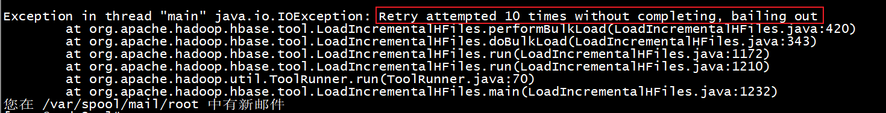
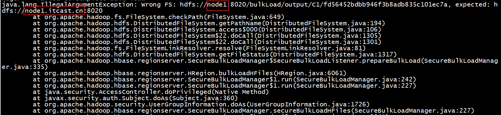

# 1- HBase的Bulk Load 批量加载操作


- 功能：
  - **将原来已经存在的数据加载到Hbase中**；

- 实现步骤：

  - 第一个步骤: **将数据文件转换为HFile文件格式**   -- MapReduce	
  - 第二个步骤: **将Hfile文件格式数据加载到Hbase中**

  

- 原有的数据写入操作大致流转流程: 

``` properties
正常写入数据的流程: 数据写入到Hlog --> memStore--> pipeLine --> storeFile --> Hfile  
```

​		如果以及有一批数据, 需要写入到Hbase中某个表中, 传统做法, 按照上述流程, 一步步将数据最终写入Hfile中, 此时整个region集群会经历大量的写入请求操作, hbase集群需要调度大量资源来满足本次的数据写入工作,如果这个时候, 又出现大量的读取数据请求也去访问这个表, 会发生什么问题呢? 读取性能有可能回受到影响 甚至出现卡顿现象

- 思考如何解决

``` properties
hbase的Bulk Load 说明: 
	对一批数据, 提前按照HBase的Hfile文件格式存储好, 然后将Hfile文件格式数据直接放置到Hbase对应数据目录下, 让Hbase直接加载, 此时不需要Hbase提供大量的写入资源, 即可完成全部数据写入操作
	
	
总结: 
	第一个步骤: 将数据文件转换为HFile文件格式   -- MapReduce
	第二个步骤: 将Hfile文件格式数据加载到Hbase中
		hbase org.apache.hadoop.hbase.tool.LoadIncrementalHFiles  数据路径 Hbase表名
```


# 2-案例- 银行转账案例


## 2-1 需求说明

* 需求: 需要将每一天的银行转账记录的数据 存储到HBase中 , 数据量比较的庞大
  * 数据所在位置: HDFS中, 
  * 数据格式为: CSV  分割符号为逗号


## 2-2 准备工作  

* 1) 在hbase中创建名称空间, 并创建hbase的表

```shell
# 创建名称空间: 
create_namespace 'BANK'
# 在名称空间下, 创建目标表: 
create 'ITCAST_BANK:TRANSFER_RECORD' ,{NAME=>'C1',COMPRESSION=>'GZ'},{NUMREGIONS=>6,SPLITALGO=>'HexStringSplit'}
```

* 2) 创建 maven项目 加载相关的pom 依赖

  说明: 如果将此全部导入到本项目中, 出现全部爆红错误, 可以将此内容放置到父工程的pom依赖中

  此时 有可能导致其他某个项目爆红(不用管), 只需要保证当前自己的项目没有任何问题即可

```xml
    <repositories>
        <repository>
            <id>aliyun</id>
            <url>http://maven.aliyun.com/nexus/content/groups/public/</url>
            <releases>
                <enabled>true</enabled>
            </releases>
            <snapshots>
                <enabled>false</enabled>
                <updatePolicy>never</updatePolicy>
            </snapshots>
        </repository>
    </repositories>


    <dependencies>

        <dependency>
            <groupId>org.apache.hbase</groupId>
            <artifactId>hbase-client</artifactId>
            <version>2.1.0</version>
        </dependency>

        <dependency>
            <groupId>org.apache.hbase</groupId>
            <artifactId>hbase-mapreduce</artifactId>
            <version>2.1.0</version>
        </dependency>

        <dependency>
            <groupId>org.apache.hadoop</groupId>
            <artifactId>hadoop-mapreduce-client-jobclient</artifactId>
            <version>2.7.5</version>
        </dependency>

        <dependency>
            <groupId>org.apache.hadoop</groupId>
            <artifactId>hadoop-common</artifactId>
            <version>2.7.5</version>
        </dependency>

        <dependency>
            <groupId>org.apache.hadoop</groupId>
            <artifactId>hadoop-mapreduce-client-core</artifactId>
            <version>2.7.5</version>
        </dependency>

        <dependency>
            <groupId>org.apache.hadoop</groupId>
            <artifactId>hadoop-auth</artifactId>
            <version>2.7.5</version>
        </dependency>

        <dependency>
            <groupId>org.apache.hadoop</groupId>
            <artifactId>hadoop-hdfs</artifactId>
            <version>2.7.5</version>
        </dependency>

        <dependency>
            <groupId>commons-io</groupId>
            <artifactId>commons-io</artifactId>
            <version>2.6</version>
        </dependency>
    </dependencies>


    <build>
        <plugins>
            <plugin>
                <groupId>org.apache.maven.plugins</groupId>
                <artifactId>maven-compiler-plugin</artifactId>
                <version>3.1</version>
                <configuration>
                    <target>1.8</target>
                    <source>1.8</source>
                </configuration>
            </plugin>
        </plugins>
    </build>
```

* 3) 在项目中创建包 和 添加配置文件log4j.properties


* 4) 将转换csv数据上传到HDFS中: 数据在资料中

```shell
hdfs dfs -mkdir -p /HBase/data/bank/input

hdfs dfs -put bank_record.csv /HBase/data/bank/input
```


## 2-3 将CSV数据转换为HFile文件格式数据

* map 程序的代码

```java
package com.fiberhome.bankrecord.mapper;

import org.apache.commons.lang.StringUtils;
import org.apache.hadoop.hbase.client.Put;
import org.apache.hadoop.hbase.io.ImmutableBytesWritable;
import org.apache.hadoop.io.LongWritable;
import org.apache.hadoop.io.Text;
import org.apache.hadoop.mapreduce.Mapper;

import java.io.IOException;

public class BankRecordMapper  extends Mapper<LongWritable, Text, ImmutableBytesWritable, Put> {

    @Override
    protected void map(LongWritable key, Text value, Context context) throws IOException, InterruptedException {
        ImmutableBytesWritable k2 = new ImmutableBytesWritable();
        String line = value.toString();
        if (StringUtils.isNotEmpty(line) ) {

            String[] fields = line.split(",");
            if (13 > fields.length ) {
                System.out.println("该数据不全");
                return;
            }

            String rowkey = fields[0];
            k2.set(rowkey.getBytes());

            Put put = new Put(rowkey.getBytes());

            put.addColumn("C1".getBytes(),"CODE".getBytes(),fields[1].getBytes());
            put.addColumn("C1".getBytes(),"REC_ACCOUNT".getBytes(),fields[2].getBytes());
            put.addColumn("C1".getBytes(),"REC_BANK_NAME".getBytes(),fields[3].getBytes());
            put.addColumn("C1".getBytes(),"REC_NAME".getBytes(),fields[4].getBytes());
            put.addColumn("C1".getBytes(),"PAY_ACCOUNT".getBytes(),fields[5].getBytes());
            put.addColumn("C1".getBytes(),"PAY_NAME".getBytes(),fields[6].getBytes());
            put.addColumn("C1".getBytes(),"PAY_COMMENTS".getBytes(),fields[7].getBytes());
            put.addColumn("C1".getBytes(),"PAY_CHANNEL".getBytes(),fields[8].getBytes());
            put.addColumn("C1".getBytes(),"PAY_WAY".getBytes(),fields[9].getBytes());
            put.addColumn("C1".getBytes(),"STATUS".getBytes(),fields[10].getBytes());
            put.addColumn("C1".getBytes(),"TIMESTAMP".getBytes(),fields[11].getBytes());
            put.addColumn("C1".getBytes(),"MONEY".getBytes(),fields[12].getBytes());

            context.write(k2,put);

        }


    }
}

```

* 驱动类JobMain的代码

```java
package com.fiberhome.bankrecore;

import com.fiberhome.bankrecord.mapper.BankRecordMapper;
import com.fiberhome.utils.MapreduceUtils;
import org.apache.hadoop.conf.Configuration;
import org.apache.hadoop.fs.Path;
import org.apache.hadoop.hbase.HBaseConfiguration;
import org.apache.hadoop.hbase.TableName;
import org.apache.hadoop.hbase.client.Connection;
import org.apache.hadoop.hbase.client.ConnectionFactory;
import org.apache.hadoop.hbase.client.Put;
import org.apache.hadoop.hbase.client.Table;
import org.apache.hadoop.hbase.io.ImmutableBytesWritable;
import org.apache.hadoop.hbase.mapreduce.HFileOutputFormat2;
import org.apache.hadoop.mapreduce.Job;
import org.apache.hadoop.mapreduce.lib.input.TextInputFormat;

import java.io.IOException;

public class JobMain {
    public static  String tableName = "BANK:TRANSFER_RECORD";

    public static void main(String[] args) throws Exception {

        //1. 获取job对象
        //Configuration conf = new Configuration();
        Configuration conf  = HBaseConfiguration.create();
        conf.set("hbase.zookeeper.quorum","node1:2181,node2:2181,node3:2181");
        Job job = Job.getInstance(conf, "BankRecord");

        //2. 配置集群运行的必备项
        job.setJarByClass(JobMain.class);

        // 3- 指定输入类
        job.setInputFormatClass(TextInputFormat.class);

        // 指定输入的路径
        TextInputFormat.addInputPath(job,new Path("hdfs://node1:8020/HBase/datas/bank/input/"));


        // 指定Mapper类
        job.setMapperClass(BankRecordMapper.class);

        // 指定K2类型
        job.setMapOutputValueClass(ImmutableBytesWritable.class);

        // 指定V2类型
        job.setMapOutputValueClass(Put.class);

        // 这里没有 shuffle操作： 分区 排序 规约 分组

        // 设置reduce个数
        job.setNumReduceTasks(0);

        // 指定输出k3类型
        job.setOutputKeyClass(ImmutableBytesWritable.class);

        // 指定输出v3类型
        job.setOutputValueClass(Put.class);

        // 指定输出格式
        job.setOutputFormatClass(HFileOutputFormat2.class);

        // 指定输出路径
        Path outputPath = new Path("hdfs://node1:8020/HBase/datas/bank/output");
        MapreduceUtils.deleteOutputPath(outputPath);
        HFileOutputFormat2.setOutputPath(job,outputPath);


        //
        Connection connection = ConnectionFactory.createConnection(conf);
        Table table = connection.getTable(TableName.valueOf(tableName));
        HFileOutputFormat2.configureIncrementalLoad(job,
                table,
                connection.getRegionLocator(TableName.valueOf(tableName)));

        // 提交任务
        boolean flag = job.waitForCompletion(true);


        System.exit(flag?0:1);

    }

}

```


## 2-4 将Hfile文件格式数据加载HBase中

- 语法说明:


```properties
hbase org.apache.hadoop.hbase.tool.LoadIncrementalHFiles  数据路径 Hbase表名
```

- 案例


```properties
hbase org.apache.hadoop.hbase.tool.LoadIncrementalHFiles  hdfs://node1:8020/HBase/datas/bank/output/  BANK:TRANSFER_RECORD
```


导入时 发现报错了



此时可以通过查看当前执行对应regionServer的日志文件:

 **tail -100f hbase-root-regionserver-node2.out**



错误原因: 是由于在安装软件过程中, 采用不同域名来操作, 导致Hbase无法识别  从而导致数据加载失败了

如何解决呢? 建议选择 HDFS的修改 

```shell
修改 node1的hdfs的core-site.xml
cd /export/server/hadoop-2.7.5/etc/hadoop
vim core-site.xml
# 修改一下内容: 
 		<property>
             <name>fs.defaultFS</name>
             <value>hdfs://node1.itcast.cn:8020</value>
         </property>
修改完成后, 将core-site.xml 发送给node2和node3
scp -r core-site.xml node2:$PWD
scp -r core-site.xml node3:$PWD

还需要修改: slaves文件:  
vim slaves
# 修改为以下内容:
node1.itcast.cn
node2.itcast.cn
node3.itcast.cn

# 将此文件 发生给 node2 和 node3
scp -r slaves node2:$PWD
scp -r slaves node3:$PWD

```


## 2-5 使用HBase查询数据

- 查询总数


- 查询前10个数据


## 2-6 使用Phoenix创建视图

``` sql
create view if not exists "BANK"."TRANSFER_RECORD"(
pk varchar primary key,
"C1"."CODE" varchar,
"C1"."REC_ACCOUNT" varchar,
"C1"."REC_BANK_NAME" varchar,
"C1"."REC_NAME" varchar,
"C1"."PAY_ACCOUNT" varchar,
"C1"."PAY_NAME" varchar,
"C1"."PAY_COMMENTS" varchar,
"C1"."PAY_CHANNEL" varchar,
"C1"."PAY_WAY" varchar,
"C1"."STATUS" varchar,
"C1"."TIMESTAMP" varchar,
"C1"."MONEY" varchar
);
```


- 查询前10行数据
  - 查询语句

  ``` sql
  select 
  	rec_bank_name,
  	pay_account,
  	rec_account,
  	pay_way,
  	money 
  from bank.transfer_record 
  	limit 10 offset 0;
  ```

  

  

  - 查询结果

``` tex
+----------------+-------------------+-------------------+----------+----------+
| REC_BANK_NAME  |    PAY_ACCOUNT    |    REC_ACCOUNT    | PAY_WAY  |  MONEY   |
+----------------+-------------------+-------------------+----------+----------+
| 中国建设银行         | 4520750834609336  | 6225506305682240  | 电子银行转账   | 20557.0  |
| 北京银行           | 3956591711781354  | 6225256780794589  | 电子银行转账   | 23690.0  |
| 中国民生银行         | 2038458857630095  | 6225211014197441  | 电子银行转账   | 7129.0   |
| 西安银行           | 1971641953509295  | 6225957713694544  | 电子银行转账   | 6941.0   |
| 杭州银行           | 8736879534356975  | 6225878690779441  | 电子银行转账   | 20557.0  |
| 中国民生银行         | 2591153963048481  | 6225158534379909  | 电子银行转账   | 10057.0  |
| 中国光大银行         | 5862522867517733  | 6225594612590037  | 电子银行转账   | 15067.0  |
| 中国中信银行         | 7979323755051525  | 6225717251023277  | 电子银行转账   | 20295.0  |
| 深圳发展银行         | 3746515314112373  | 6225645778610138  | 电子银行转账   | 18689.0  |
| 中国银行           | 6233127464571785  | 6225376344744584  | 电子银行转账   | 11310.0  |
+----------------+-------------------+-------------------+----------+----------+

```


