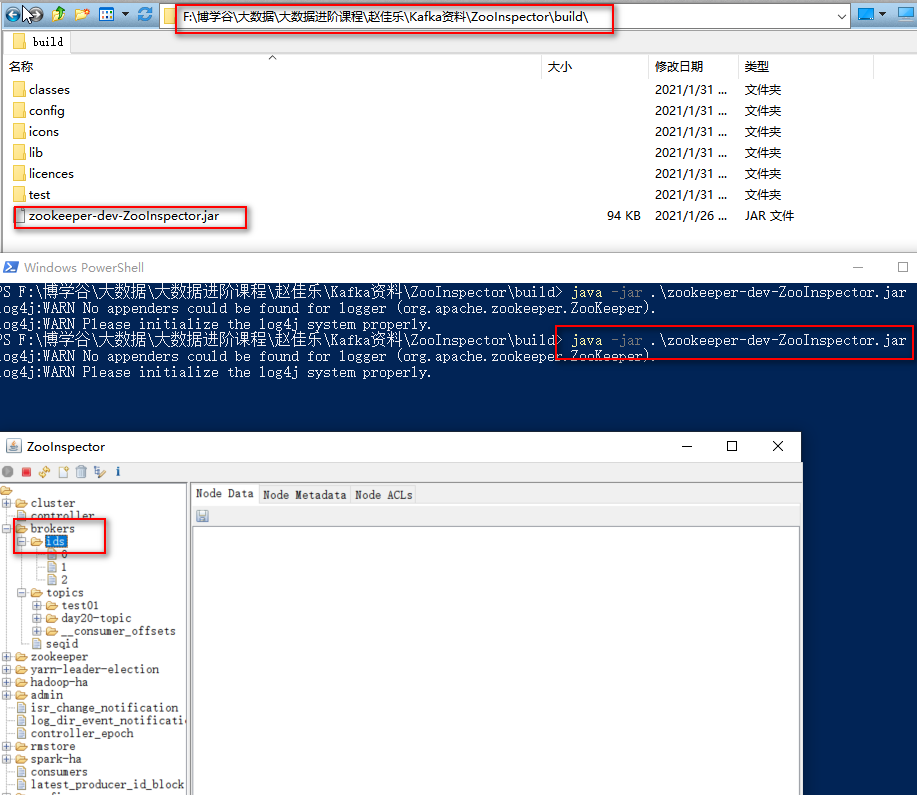
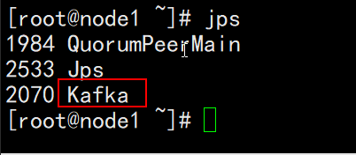

# 1- Kafka安装

请查看文档：.\kafka安装\kafka环境搭建.docx


# 2- kafka集群一键启动

- 注意： 启动kafka之前必须启动zookeeper.(有一键启动脚本)


- 编写一键启动 start-kafka.sh脚本

 ``` sql
vim start-kafka.sh
cat /export/onekey/slave | while read line
do
{
 echo $line
 ssh $line "source /etc/profile;export JMX_PORT=9988;nohup ${KAFKA_HOME}/bin/kafka-server-start.sh ${KAFKA_HOME}/config/server.properties >/dev/nul* 2>&1 & "
}&
wait
done
 ```


- 编写一键关闭 stop-kafka.sh脚本

``` sql
vim stop-kafka.sh
cat /export/onekey/slave | while read line
do
{
 echo $line
 ssh $line "source /etc/profile;jps |grep Kafka |cut -d' ' -f1 |xargs kill -s 9"
}&
wait
done
```

- 知识点

  - cut -d' ' -f1 

  ``` sql
  cut -d'x'  :表示 根据 -d 后面的字符x来切片 ;
  -fn 	: 表示切片后取第n个值(从1开始数);
  ```

  - xargs kill -s 9

  ``` sql
  xargs kill -s 9”中的xargs命令是用来把前面命令的输出结果（PID）作为“kill -s 9”命令的参数，并执行该命令。“kill -s 9”会强行杀掉指定进程。
  ```

  - 还可以写成

  ``` sql
  ps -ef | grep Kafka | grep -v grep | cut -c 9-15 | xargs kill -s 9
  ```

  


``` sql
#!/bin/bash

## 所有 kafka 服务列表
myArrNodes=("node1" "node2" "node3")

kafkaPath="/export/server/kafka_2.12-2.4.1/"
kafkaServerProperties=${kafkaPath}"config/server.properties"

echo "欢迎使用一键安装kafka集群"
PS3="Please enter you choice:"
select operation in "start" "stop"
do
	case ${operation} in 
	"start")
		echo "you have chose "${operation}
		;;
		
		
	"stop")
		echo "you have chose "${operation}
		;;
		
	*)
		echo "You have chose error , Please try again!"
		continue
		;;
		
	esac

break;
done

echo "*****************${operation}*****************"

# source /etc/profile 命令
commandSource="source /etc/profile"

# kafka 命令
commandKafkaServer="kafka-server-"${operation}".sh"

echo ${commandKafkaServer}

# 判断是 start 还是 stop 
if [ ${operation} = "start" ] ;then 
	## 启动 kafka
	echo "----------------------------- start kafka ----------------------------"
	
	startKafkaServerCommand="nohup ${commandKafkaServer} ${kafkaServerProperties} >/dev/nul* 2>&1 & "
	echo ${startKafkaServerCommand}
	
	# 遍历所有服务并执行命令
	for node in ${myArrNodes[@]} 
	do 
		ssh ${node} "${commandSource} ; export JMX_PORT=9988; ${startKafkaServerCommand}"	
		echo "----------${operation} ${node} ok----------"
	done


elif [ ${operation} = "stop" ] ; then 
		
	echo "----------------------------- stop kafka ----------------------------"
	
	# 遍历所有服务并执行命令
	for node in ${myArrNodes[@]} 
	do 
		ssh ${node} "${commandSource} ; ${commandKafkaServer}"	
		echo "----------${operation} ${node} ok----------"
	done
	
else	
	## 目录不存在
	echo "error! "
	
fi


echo "************************************end ${operation} all node*******************************"


```


# 3- 查看状态

- 启动后使用zookeeper工具是否正常

- 工具路径

  ``` properties
  F:\博学谷\大数据\大数据进阶课程\赵佳乐\Kafka资料\ZooInspector\build\
  ```

- 工具使用命令

  ``` properties
  java -jar .\zookeeper-dev-ZooInspector.jar
  ```

  



