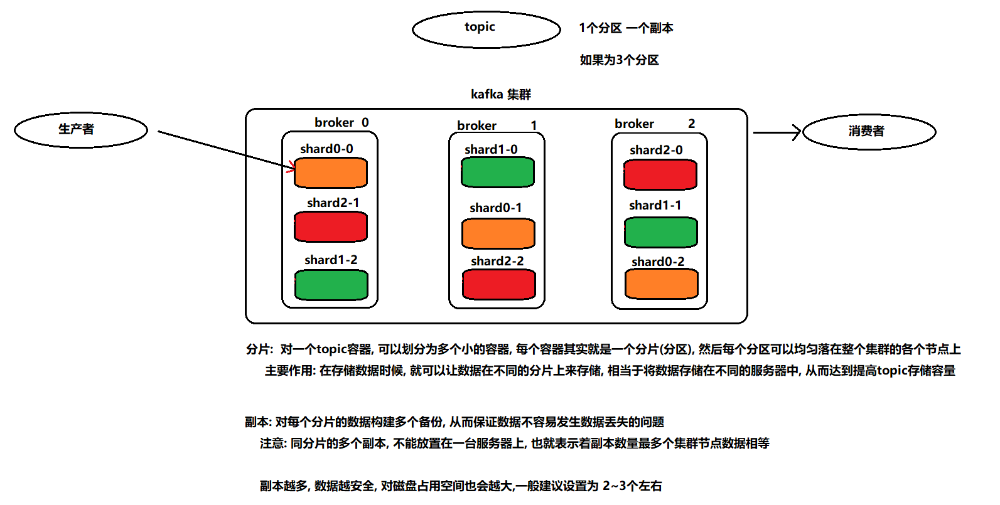
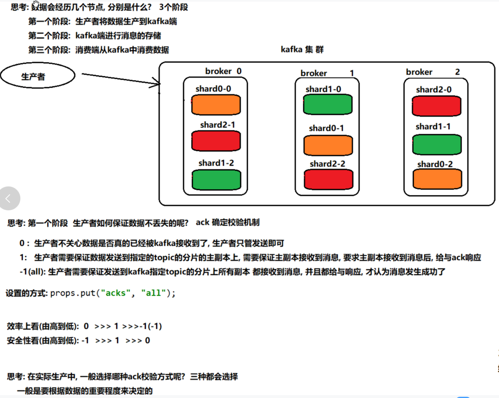
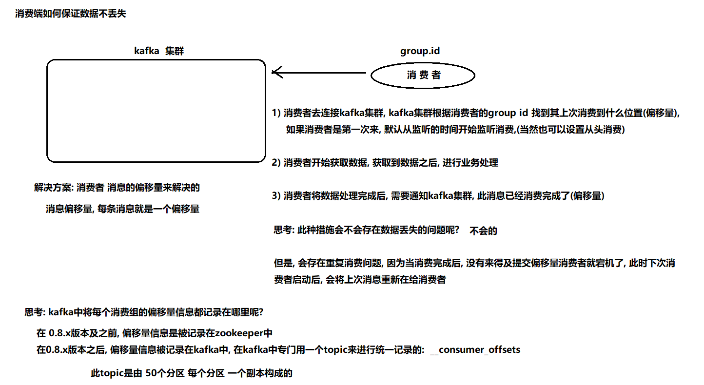
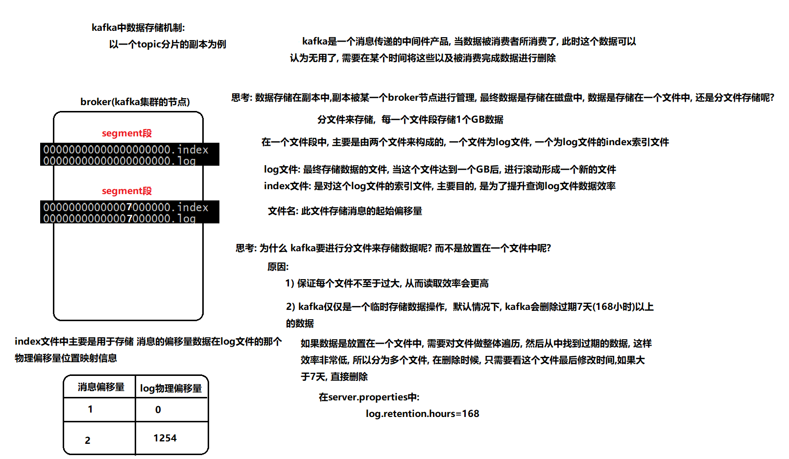
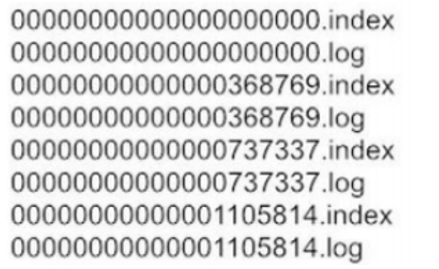
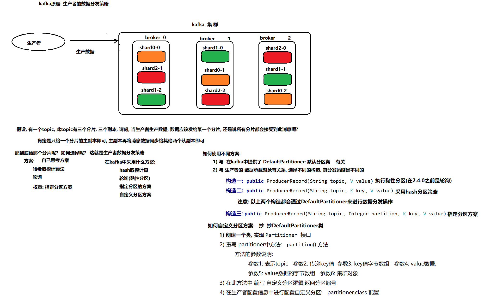
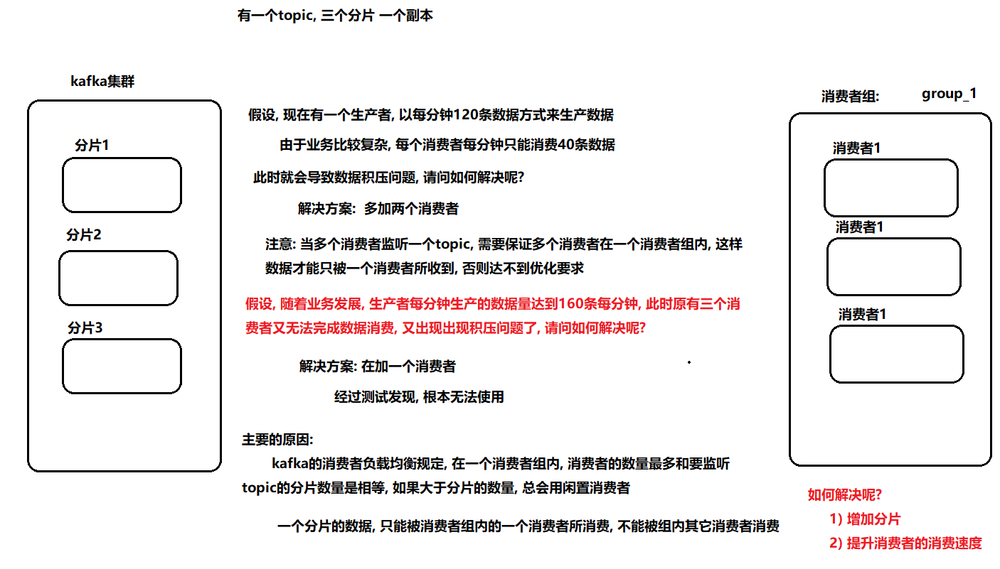
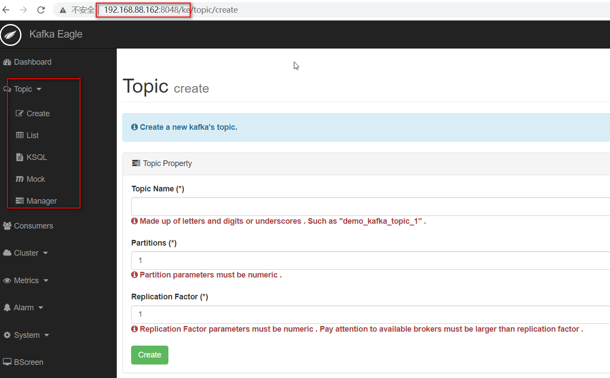
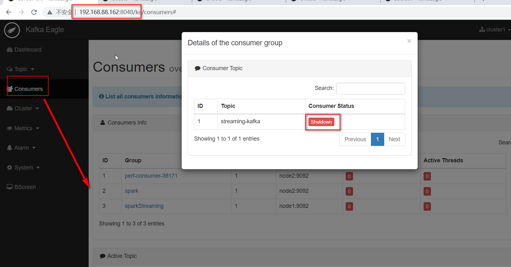
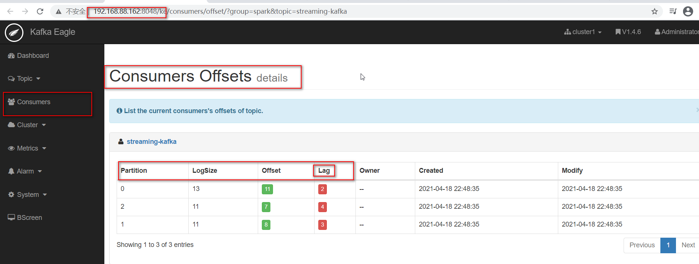

# 二、kafka高级

## 1. kafka的javaAPI的操作

### 1.1 生产者代码:

* 生产者代码1: **默认异步发生数据方式, 不含回调函数**

```java
package com.itheima.producer;

import org.apache.kafka.clients.producer.KafkaProducer;
import org.apache.kafka.clients.producer.Producer;
import org.apache.kafka.clients.producer.ProducerRecord;

import java.util.Properties;
// kafka的生产者的代码:
public class KafkaProducerTest {

    public static void main(String[] args) {

        //1.1: 构建生产者的配置信息:
        Properties props = new Properties();
        props.put("bootstrap.servers", "node1:9092,node2:9092,node3:9092");
        props.put("acks", "all"); // 消息确认机制:  all表示 必须等待kafka端所有的副本全部接受到数据 确保数据不丢失
        // 说明: 在数据发送的时候, 可以发送键值对的, 此处是用来定义k v的序列化的类型
        props.put("key.serializer", "org.apache.kafka.common.serialization.StringSerializer");
        props.put("value.serializer", "org.apache.kafka.common.serialization.StringSerializer");


        //1. 创建 kafka的生产者对象:  KafkaProducer
        Producer<String, String> producer = new KafkaProducer<String, String>(props);

        //2. 执行数据的发送
        for (int i = 0; i < 10; i++) {
            // producerRecord对象:  生产者的数据承载对象

            ProducerRecord<String, String> producerRecord =
                    new ProducerRecord<String, String>("day20-topic",  Integer.toString(i));

            producer.send(producerRecord);

        }

        //3. 释放资源
        producer.close();


    }
}

```

* 生产者的代码2:  **同步发送操作**

```java
package com.itheima.producer;

import org.apache.kafka.clients.producer.KafkaProducer;
import org.apache.kafka.clients.producer.Producer;
import org.apache.kafka.clients.producer.ProducerRecord;

import java.util.Properties;
import java.util.concurrent.ExecutionException;

// kafka的生产者的代码:
public class KafkaProducerTest2 {
    @SuppressWarnings("all")
    public static void main(String[] args) {

        //1.1: 构建生产者的配置信息:
        Properties props = new Properties();
        props.put("bootstrap.servers", "node1.itcast.cn:9092,node2.itcast.cn:9092,node3.itcast.cn:9092");
        props.put("acks", "all"); // 消息确认机制:  all表示 必须等待kafka端所有的副本全部接受到数据 确保数据不丢失
        // 说明: 在数据发送的时候, 可以发送键值对的, 此处是用来定义k v的序列化的类型
        props.put("key.serializer", "org.apache.kafka.common.serialization.StringSerializer");
        props.put("value.serializer", "org.apache.kafka.common.serialization.StringSerializer");


        //1. 创建 kafka的生产者对象:  KafkaProducer
        Producer<String, String> producer = new KafkaProducer<String, String>(props);

        //2. 执行数据的发送
        for (int i = 0; i < 10; i++) {
            // producerRecord对象:  生产者的数据承载对象

            ProducerRecord<String, String> producerRecord =
                    new ProducerRecord<String, String>("day20-topic",  Integer.toString(i));

            try {
                
                producer.send(producerRecord).get(); // get方法, 表示是同步发送数据的方式
            } catch (Exception e) {
                // 如果发生操作, 出现了异常, 认为, 数据发生失败了 ....

                e.printStackTrace();
            }

        }

        //3. 释放资源
        producer.close();


    }
}

```

* 生产者代码3: **异步发生数据, 带有回调函数操作**

```java
package com.itheima.producer;

import org.apache.kafka.clients.producer.*;

import java.util.Properties;
// kafka的生产者的代码:
public class KafkaProducerTest {

    public static void main(String[] args) {

        //1.1: 构建生产者的配置信息:
        Properties props = new Properties();
        props.put("bootstrap.servers", "node1.itcast.cn:9092,node2.itcast.cn:9092,node3.itcast.cn:9092");
        props.put("acks", "all"); // 消息确认机制:  all表示 必须等待kafka端所有的副本全部接受到数据 确保数据不丢失
        // 说明: 在数据发送的时候, 可以发送键值对的, 此处是用来定义k v的序列化的类型
        props.put("key.serializer", "org.apache.kafka.common.serialization.StringSerializer");
        props.put("value.serializer", "org.apache.kafka.common.serialization.StringSerializer");


        //1. 创建 kafka的生产者对象:  KafkaProducer
        Producer<String, String> producer = new KafkaProducer<String, String>(props);

        //2. 执行数据的发送
        for (int i = 0; i < 10; i++) {
            // producerRecord对象:  生产者的数据承载对象

            ProducerRecord<String, String> producerRecord =
                    new ProducerRecord<String, String>("day20-topic",  Integer.toString(i));

            producer.send(producerRecord, new Callback() {
                public void onCompletion(RecordMetadata metadata, Exception exception) {
                    
                    // 在参数2中, 表示发生的状态异常, 如果 异常为null 表示数据以及发送成功, 如果不为null, 表示数据没有发送成功
                    if(exception != null){

                        // 执行数据发生失败的后措施...
                        
                    }
                    
                }
            }); // 异步发送方式

        }

        //3. 释放资源
        producer.close();


    }
}

```

### 1.2 消费者代码

* 消费者代码1: **自动提交偏移量数据**

```java
package com.itheima.consumer;

import org.apache.kafka.clients.consumer.ConsumerRecord;
import org.apache.kafka.clients.consumer.ConsumerRecords;
import org.apache.kafka.clients.consumer.KafkaConsumer;

import java.time.Duration;
import java.util.Arrays;
import java.util.Properties;

// kafka的消费者的代码
public class KafkaConsumerTest {

    public static void main(String[] args) {
        //1.1: 指定消费者的配置信息
        Properties props = new Properties();
        props.setProperty("bootstrap.servers", "node1:9092,node2:9092,node3:9092");
        props.setProperty("group.id", "test"); // 消费者组的名称
        props.setProperty("enable.auto.commit", "true"); // 消费者自定提交消费偏移量信息给kafka
        props.setProperty("auto.commit.interval.ms", "1000"); // 每次自动提交偏移量时间间隔  1s一次
        props.setProperty("key.deserializer", "org.apache.kafka.common.serialization.StringDeserializer");
        props.setProperty("value.deserializer", "org.apache.kafka.common.serialization.StringDeserializer");

        //1. 创建kafka的消费者核心类对象:  KafkaConsumer
        KafkaConsumer<String, String> consumer = new KafkaConsumer<String, String>(props);

        //2. 让当前这个消费, 去监听那个topic?
        consumer.subscribe(Arrays.asList("day20-topic")); // 一个消费者 可以同时监听多个topic的操作
        while (true) { // 一致监听
            //3. 从topic中 获取数据操作:  参数表示意思, 如果队列中没有数据, 最长等待多长时间
            // 如果超时后, topic中依然没有数据, 此时返回空的  records(空对象)
            ConsumerRecords<String, String> records = consumer.poll(Duration.ofMillis(100));
            //4. 遍历ConsumerRecords, 从中获取消息数据
            for (ConsumerRecord<String, String> record : records) {

                String value = record.value();

                System.out.println("接收到消息为:"+value);

            }

        }
    }
}

```

* 消费者代码2: **手动提交偏移量数据**

``` properties
修改配置:
"enable.auto.commit"
"auto.commit.interval.ms"

消费完后需要手动提交偏移量
// 当执行完成后, 认为消息已经消费完成
consumer.commitAsync(); // 手动提交偏移量信息
```


```java
package com.itheima.consumer;

import org.apache.kafka.clients.consumer.ConsumerRecord;
import org.apache.kafka.clients.consumer.ConsumerRecords;
import org.apache.kafka.clients.consumer.KafkaConsumer;

import java.time.Duration;
import java.util.Arrays;
import java.util.Properties;

// kafka的消费者的代码
public class KafkaConsumerTest2 {

    public static void main(String[] args) {

        //1.1 定义消费者的配置信息
        Properties props = new Properties();

        props.setProperty("bootstrap.servers", "node1:9092,node2:9092,node3:9092");
        props.setProperty("group.id", "test01"); // 消费者组的名称
        props.setProperty("enable.auto.commit", "false"); // 消费者自定提交消费偏移量信息给kafka
        //props.setProperty("auto.commit.interval.ms", "1000"); // 每次自动提交偏移量时间间隔  1s一次
        props.setProperty("key.deserializer", "org.apache.kafka.common.serialization.StringDeserializer");
        props.setProperty("value.deserializer", "org.apache.kafka.common.serialization.StringDeserializer");


        //1. 创建消费者的核心类对象
        KafkaConsumer<String,String> consumer = new KafkaConsumer<String,String>(props);

        //2. 指定要监听的topic
        consumer.subscribe(Arrays.asList("day20-topic"));

        //3. 获取数据
        while(true) {

            ConsumerRecords<String, String> consumerRecords = consumer.poll(Duration.ofMillis(1000));

            for (ConsumerRecord<String, String> consumerRecord : consumerRecords) {

                String value = consumerRecord.value();
                // 执行消费数据操作
                System.out.println("数据为:"+ value);

                // 当执行完成后, 认为消息已经消费完成
                consumer.commitAsync(); // 手动提交偏移量信息
            }

        }

    }
}

```


## 2. kafka的topic分片和副本机制



```properties
分片: 解决单台节点存储容量有限的问题, 通过分片进行分布式存储方案
副本: 保证数据不丢失, 提升数据可用性
```


## 3. kafka如何保证数据不丢失


### 3.1 生产者端如何保证数据不丢失




- **isr同步副本机制**：

  - 如果长时间处于等待状态的副本就是从isr中移除掉 

    

- 面试题


### 3.2 broker端如何保证数据不丢失

<span style="color:red;background:white;font-size:20px;font-family:楷体;">**broker端主要是通过数据的副本和 ack为-1 来保证数据不丢失操作**</span>


### 3.3 消费端如何保证数据不丢失




## 4. kafka的数据存储机制

如何保证写数据的一致性： **幂等性**




## 5. kafka的数据查询机制



需求: 上述是一个副本的数据, 现在想从中找到 368866这条数据 , 请问如何寻找呢? 

```properties
寻找的步骤
1) 确定数据所在的segment段, 所以可以推断  368866 这条数据在第二个segment段中
2) 在这个段中, 先去查询 index文件, 从中找到 368866消息在log文件具体的物理偏移量位置
3) 遍历log文件, 顺序查询到具体位置, 将数据直接获取即可


什么是顺序读写  和 随机读写吗?   顺序读写效率远远大于随机读写效率
```


## 6. kafka的生产者分区策略




## 7. kafka的消费者负载均衡机制



问题: 请问如何通过kafka模拟点对点和发布订阅模式呢?

```properties
点对点: 
    让所有监听这个topic的消费者, 都属于同一个消费者组即可
    或者
    监听这个topic消费者, 保证唯一
    
发布订阅:
     定义多个消费者, 让多个消费者属于不同组即可

```


## 8.工具kafka-eagle


### 8-1 kafka-eagle 介绍

- 在开发工作中，当业务前提不复杂时，可以使用Kafka命令来进行一些集群的管理工作。但如果业务变得复杂，例如：我们需要增加group、topic分区，此时，我们再使用命令行就感觉很不方便，此时，如果使用一个可视化的工具帮助我们完成日常的管理工作，将会大大提高对于Kafka集群管理的效率，而且我们使用工具来监控消费者在Kafka中消费情况。

  

- 早期，要监控Kafka集群我们可以使用Kafka Monitor以及Kafka Manager，但随着我们对监控的功能要求、性能要求的提高，这些工具已经无法满足。

  

- Kafka Eagle是一款结合了目前大数据Kafka监控工具的特点，重新研发的一块开源免费的Kafka集群优秀的监控工具。它可以非常方便的监控生产环境中的offset、lag变化、partition分布、owner等。

  

- 官网地址：https://www.kafka-eagle.org/


### 8-2 安装

请查看 .\kafka-eagle安装\kafka-eagle安装操作.docx

### 8-3 启动/关闭kafka-eagle

- 启动 kafka_eagle。
  /export/server/kafka-eagle-web-1.4.6/bin/ke.sh start

  

- 停止
  /export/server/kafka-eagle-web-1.4.6/bin/ke.sh stop


- 注意： **需要启动zk 和 kfk 的集群**


- 访问Kafka eagle，默认用户为**admin**，密码为：**123456**
  http://node2:8048/ke


### 8-3 kafka-eagle 能做什么

- topic
  - 创建topic
  - 查看所有topic 信息
  - KSQL查询信息
    - **select \* from "ke_topic" where "partition" in (0,1,2) limit 10**
  - 模拟发送消息Mock
  - topic 管理 
    - 修改配置
    - 获取信息 
    - .....




- 查看消费者信息 Consumers
  - groupid 
- 查看消费者**数据积压** Lag






### 8-4 如何解决数据积压问题

- 出现积压的原因:  
  - 因为数据写入目的容器失败,从而导致消费失败
  - 因为网络延迟消息消费失败
  - 消费逻辑过于复杂, 导致消费过慢,出现积压问题

- 解决方案:
  - 对于第一种, 我们常规解决方案, 处理目的容器,保证目的容器是一直可用状态
  - 对于第二种, 如果之前一直没问题, 只是某一天出现, 可以调整消费的超时时间
  - 对于第三种, 一般解决方案,调整消费代码, 消费更快即可, 利于消费者的负载均衡策略,提升消费者数量


## 9.Kafka配额限速机制

​		生产者和消费者以极高的速度生产/消费大量数据或产生请求，从而占用broker上的全部资源，造成网络IO饱和。有了配额（Quotas）就可以避免这些问题。Kafka支持配额管理，从而可以对Producer和Consumer的produce&fetch操作进行流量限制，防止个别业务压爆服务器。


### 9-1 限制producer端的速率

为所有client id设置默认值，以下为所有producer程序设置其TPS不超过1MB/s，即1048576/s，命令如下：

``` properties
kafka-configs.sh --zookeeper node1.itcast.cn:2181 --alter --add-config 'producer_byte_rate=1048576' --entity-type clients --entity-default

```


运行基准测试，观察生产消息的速率

``` properties
kafka-producer-perf-test.sh --topic test --num-records 500000 --throughput -1 --record-size 1000 --producer-props bootstrap.servers=node1:9092,node2:9092,node3:9092 acks=1

```


### 9-2 限制consumer端的速率

​	对consumer限速与producer类似，只不过参数名不一样。
​    为指定的topic进行限速，以下为所有consumer程序设置topic速率不超过1MB/s，即1048576/s。命令如下：

``` properties
bin/kafka-configs.sh --zookeeper node1.itcast.cn:2181 --alter --add-config 'consumer_byte_rate=1048576' --entity-type clients --entity-default
```

​	运行基准测试，观察消息消费的速率

``` properties
bin/kafka-consumer-perf-test.sh --broker-list node1:9092,node2:9092,node3:9092 --topic test --fetch-size 1048576 --messages 500000

```


### 9-3 取消kafka的Quota(限速)配置

``` properties
生产者:
kafka-configs.sh --zookeeper node1:2181 --alter --delete-config 'producer_byte_rate' --entity-type clients --entity-default

消费者:
kafka-configs.sh --zookeeper node1:2181 --alter --delete-config 'consumer_byte_rate' --entity-type clients --entity-default

```


