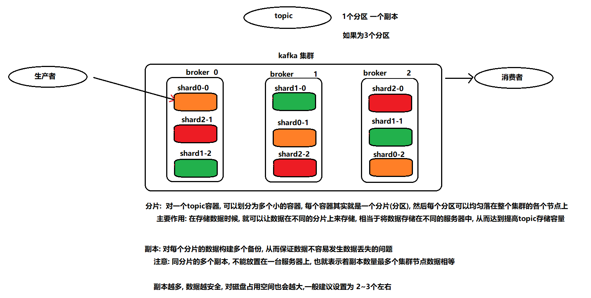
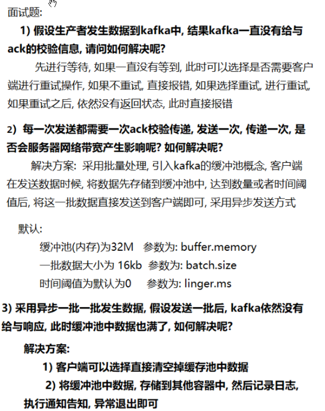
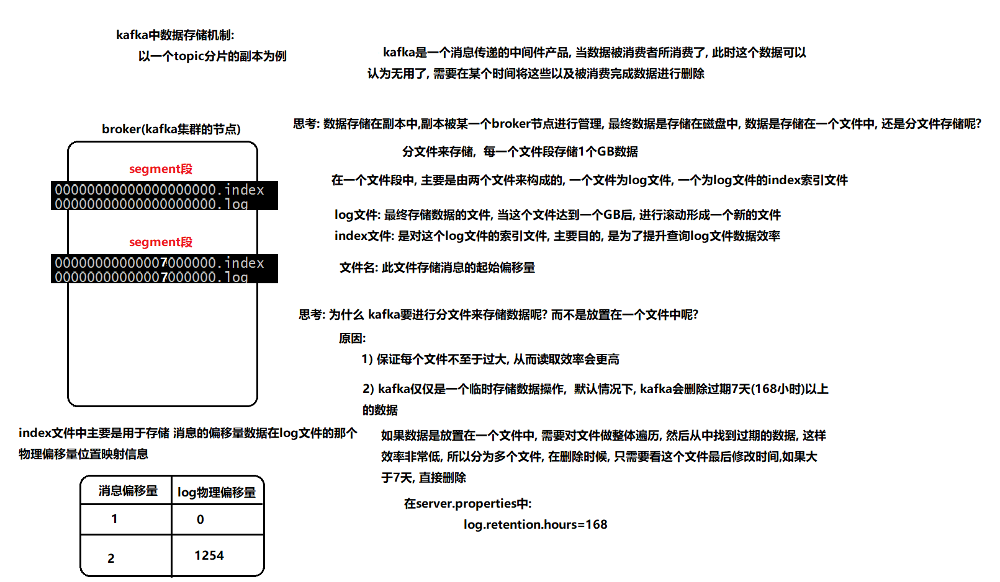
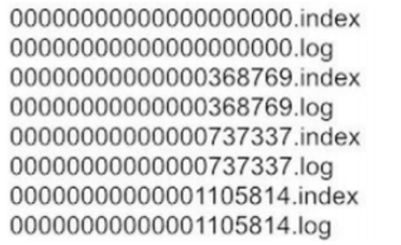

[TOC]


# 1- Kafka介绍

## 1-1 消息队列的基本介绍

- 什么是消息？
  - 消息就是**数据**，只不过这个消息是**数据流动的状态**；
- 什么是队列？
  - 队列就是一个**容器**，只不过这个容器有**FIFO的特性(先进先出)**；
- 什么是消息队列？
  - **指的是数据存储在队列中, 从队列的一端流向对队列的另一端过程；**
- 消息队列的应用场景:

  * 1) 同步转**异步操作**
  * 2) 应用解**耦合**
  * 3) 限流**削峰**
  * 4) 消息驱动系统

## 1-2 Kafka为什么这么快  

### 1-2-1 顺序读写 

### 1-2-2 MMFile 

### 1-2-3 SendFile

### 1-2-4 批量压缩

- 写数据：
  - kafka讲数据缓存在磁盘的时候使用搞得是**顺序写入 和 MMFile**（Memory Mapped File 内存映射文件） ，这别随机读写要快多了；
  - MMFile 内存映射文件：**利用操作系统的Page来实现文件到物理内存的直接映射，** 对物理内存的操作会被同步到硬盘上，通过mmap，基本可以达到读写内存差不多的速度；这种方式可以获取很大的磁盘I/O提升；
- 读数据：
  - 传统读模式：**硬盘—>内核buf—>用户buf—>socket相关缓冲区—>协议引擎**; （对数据有四次的copy操作）
  - **sendfile技术**：
    - **减少了两次copy的操作**；不用copy到用户缓冲区；
  - **批量压缩技术：**
    - 压缩算法： GZip  Snappy ；
    - 大大提升了**网络IO的效率**；

## 1-3 kafka的特点:

- 0) **高吞吐、低延时**；

* 1) **高可靠性** : **数据不容易丢失, 数据分布式存储**, 集群某个节点宕机也不会影响；
* 2) **高可扩展性** :  **动态的进行添加或者减少集群的节点**
* 3) **高耐用性** :  **数据持久化的磁盘上**
* 4) **高性能** :  **数据具有高吞吐量**
* 5) **非常快**:  **零停机 和  零数据丢失** (存在重复消费问题)

# 2- Kafka架构

- 专业术语

``` properties
kafka cluster:  	kafka的集群
broker:  			kafka集群中各个节点
producer:  			生产者
consumer: 			消费者
topic:  			主题 话题    类似于大的容器
shard: 				分片  类似于将大的容器切分为多个小的容器
	问:分片数量是否受限于集群节点数量呢?   答: 不会的

replicas: 			副本  对每个分片构建多个副本, 保证数据不丢失
	问:副本数量是否会受限于集群节点的数据呢?  答: 是  最多和节点是一致的
```


# 3- Kafka的性能测试

## 3-1 测试生产者写入的效率

``` properties
./kafka-producer-perf-test.sh  --topic test01 --num-records 5000000 --throughput -1 --record-size 1000 --producer-props bootstrap.servers=node1:9092,node2:9092,node3:9092 acks=1
```


配置：32G内存  200M以太网  测试吞吐量结果 10w条/s；

如果是128G  1Gb以太网， 测试的吞吐量可以高达**百万条/秒；**


## 3-2 测试消费者消费的效率

``` properties
./kafka-consumer-perf-test.sh --broker-list node1:9092,node2:9092,node3:9092 --topic test01 --fetch-size 1048576 --messages 5000000
```

配置：32G内存  200M以太网  测试吞吐量结果 50w条/s；


# 4- Kafka的topic 分片和副本机制

- 分片: 解决**单台节点存储容量有限的问题**, 通过分片进行分布式存储方案；**分片就是分区**；
  - 在存储数据的时候，可以让**数据均匀的存储在不同的分片上，提高topic存储容量**；（**横向扩展**）
- 副本: **保证数据不丢失**, 提升数据可用性； (2-3个副本)
  - **同一个分片的多个副本，不能存储在同一个服务器上；（也就说副本数<=节点数）**





# 5- kafka如何保证数据不丢失

## 5-1 生产者端如何保证数据不丢失--ack


### 5-1-1 副本同步机制   ISR 集合  

- ISR     ： in-sync replica

- **每个分区都有自己的一个 ISR 集合**，处于 ISR 集合中的副本，意味着 follower 副本与 leader 副本保持同步状态；
- **只有处于 ISR 集合中的副本才有资格被选举为 leader**；
- **一条 Kafka 消息，只有被 ISR 中的副本都接收到，才被视为“已同步”状态**；

- **如果长时间处于等待状态的副本就会从isr集合中移除掉** ；


5-1-2 生产者




## 5-2 broker端如何保证数据不丢失 --副本

<span style="color:red;background:white;font-size:20px;font-family:楷体;">**broker端主要是通过数据的副本和 ack为-1 来保证数据不丢失操作**</span>；


## 5-3 消费端如何保证数据不丢失--offsets

- kafka消费端保证数据不丢失  offsets
  - **消费者消费数据完成后需要通知 kafka，表示这个消息已经消费完成；**
  - **kafka收到消息就记录offsets信息；**
- 缺点：
  - kafka使用offset机制可以保证消费端数据不会丢失，但是**会有重复消费的问题**；
    - 当消费者完成了消费当前数据， 但是没有来得及提交offset信息就宕机；

- kafka 中每个消费组的**偏移量offsets信息都记录在哪里？** 
  - **0.8版本**之前 ，偏移量信息都被记录在**zookeeper中**；
  - **0.8版本**之后， 偏移量信息都被记录在**kafka中**，[在kafka中专门用一个topic来进行统一记录]()： __consumer_offsets ;


# 6- kafka的数据 存储 机制

- **如何保证写数据的一致性**： **幂等性**；
- kafka存储数据是分文件存储的；
  - **每个文件段大小为1GB;**
  - **每个文件段主要有两个文件来构成： log文件 ， index索引文件；**
  - **log文件文件名 ：就是此文件存储消息的起始偏移量；**
  - **log文件：最终存储数据的文件，当文件大小达到1GB，进行滚动形成一个新的文件；**
  - **index文件：对log文件的索引文件， 主要目的 是为了提高查询log 文件的效率；**
- **kafka为什么要分文件存储数据？**
  - 原因1：保证文件不至于过大，**提高查询效率**；
  - 原因2：可以**定期删除过期的数据文件**（7天）；



# 7- kafka的数据 查询 机制



- 需求: 上述是一个副本的数据, 现在想从中找到 368866这条数据 , 请问如何寻找呢? 
- **寻找的步骤**
  1. **确定数据所在的segment段** ：所以可以推断  368866 这条数据在第二个segment段中；
  2. **根据index索引文件确定物理偏移量位置**：在这个段中, [先去查询 index文件, 从中找到 368866消息在log文件具体的物理偏移量位置；]()
  3. **读取数据**： 遍历log文件, 顺序查询到具体位置, 将数据直接获取即可；


# 8- kafka的生产者 分发策略

- **问： 生产者生产数据，数据是发给某一个分片，还是发给所有的分区？** 

  - **答： 只发给一个分区的主副本即可；** 

  

- **问：生产者有哪些分发策略？** ；

  - **hash 取模计算；**
  - **轮询(黏性分区)；**
  - **指定分区；**
  - **自定义分区；**

- 问：如何使用不同的分发策略？ 

  -  **DefaultPartitioner 默认分区类 有 多个构造方法**
  - **轮询策略(黏性分区) : public ProducerRecord(String topic , V value);**
  - **hash 取模：public ProducerRecord(String topic , [K key]() , V value);**
  - **指定分区方案：public ProducerRecord(String topic ，[Integer partition]() ,  [K key]() , V value);**
  - **自定义分区方案：**抄 DefaultPartitioner类；
    1. **创建类，实现 Partitioner接口；**
    2. **重新partitioner中的方法： partition()方法**
       1. **参数1 ： 表示topic;**  
       2. **参数2：key值；** 
       3. **参数3：key值字节数组；** 
       4. **参数4：value 数据；**
       5. **参数5：value数据字节数组；**
       6. **参数6：Kafka集群对象；**
    3. **在partition方法中自定义分区逻辑，以及返回分区编号；**
    4. **在生产者配置信息中使用自定义分区的类 Partitioner.class;**


# 9- kafka的消费者 负载均衡机制

- 注意：<span style="color:red;font-size:20px;font-family:黑体;">一个分片中的数据，只能被消费者组内的一个消费者所消费；</span>(**重点**)
- 注意：<span style="color:red;font-size:20px;font-family:黑体;">消费者数量 <= topic 分片数量：Kafka的消费者负载均衡规定， 在一个消费者组内，消费者的数量最多 和 topic分片数据相等，如果大于分片的数量， 总会有闲置的消费者；</span>


