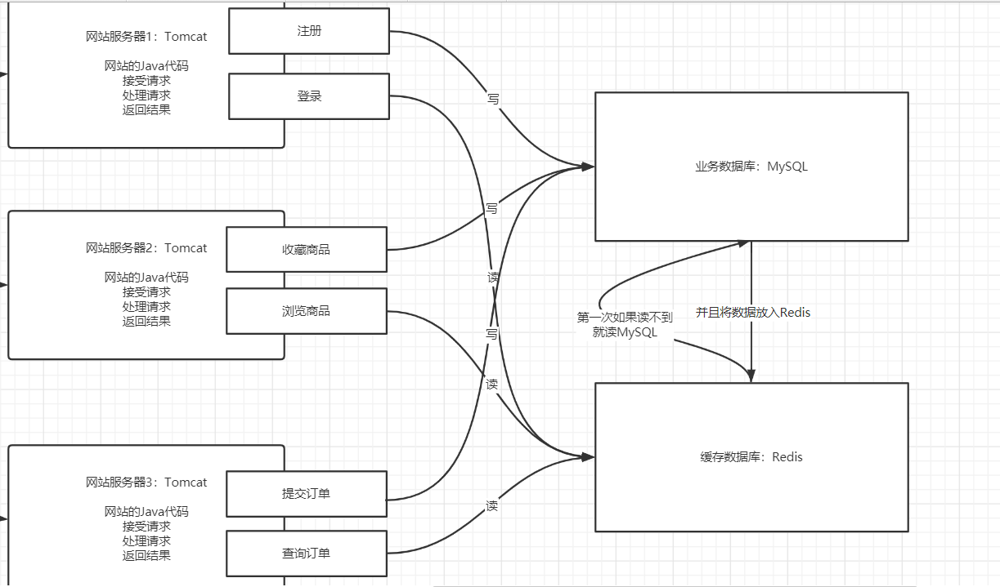

# 分布式实时消息队列Kafka（一）

## 知识点01：课程目标

1. 消息队列的基本内容

   - 什么是消息队列？优点和缺点
   - 什么是同步和异步？
   - 订阅发布模式？

2. **Kafka功能和应用场景**

   - Kafka是做什么的？
   - 大数据平台架构中Kafka角色？

3. **==Kafka中核心概念==**

   - 什么是Broker、Producer、Consumer Group
   - 什么是Topic、Partition、Replicas、Segment、Offset

4. Kafka架构及分布式集群部署

   - Kafka分布式架构：公平分布式架构

   - **动手**搭建Kafka分布式集群【严格按照笔记搭建成功即可】
   - 小工具：Kafka可视化工具


## 知识点02：传统架构面临的问题

- **目标**：**了解传统架构中存在的问题及解决方案**

- **路径**

  - step1：传统网站的存储架构
  - step2：高并发读问题
  - step3：高并发写问题

- **实施**

  - **Web1.0版本的网站架构**

    

    

  - **问题1**：读的请求比较多，MySQL无法支撑这么大的读并发，怎么解决？

    - 引入Redis，作为读缓存，解决高并发的读

    

    

  - **问题2**：如果写的请求也比较多怎么办？

    - 引入消息队列：解决高并发写问题

    

- **小结**

  - 了解传统架构中存在的问题及解决方案
  - Redis缓存：解决高并发读：并发特性，数据安全不是最重要的
    - MQ消息队列：解决高并发写：并发特性，最注重于数据安全性

  

## 知识点03：消息队列：MQ介绍

- **目标**：**了解消息队列的功能，应用场景及特点**

- **路径**

  - step1：消息队列是什么？
  - step2：什么情况下需要使用消息队列？
  - step3：消息队列的优缺点是什么？

- **实施**

  - **定义**

    - 官方定义：消息队列是一种异步的服务间通信方式,是分布式系统中重要的组件,主要解决应用耦合,异步消息,流量削锋等问题,实现高性能,高可用,可伸缩和最终一致性架构。
    - 简单点说：**消息队列MQ用于实现两个系统之间或者两个模块之间传递消息数据时，实现数据缓存**

  - **功能**

    - 基于**队列**的方式，实现消息传递的数据**缓存【长久】**
      - 队列的特点：顺序：先进先出

  - **应用场景**

    - 用于所有需要实现实时、高性能、高吞吐、高可靠的消息传递架构中
    - 大数据应用中：作为唯一的实时数据存储平台
      - 实时数据采集：生产写入Kafka
        - 数据库：Canal、OGG
        - 文件日志：Flume
        - |
        - Kafka
      - 实时数据处理：消费读取Kafka
        - Spark/Flink

  - **优点**

    - **实现了架构解耦**
      - 随意添加消费者，前端系统只需要将数据写入消息队列，所有后台系统想获取消息，直接从消息队列中获取
    - **实现异步，提高传输性能**
    - 实现最终一致性，所有消费者可以并行的到MQ中获取数据
    - **限流削峰**

  - **缺点**

    

    - a.增加了消息队列，架构运维更加复杂
      - 绝对保障消息队列是高可靠，才能保证整个系统是高可靠
      - 进程故障或者机器故障：单点故障
      - |
      - 分布式架构：任何一台机器故障，都不影响整个MQ正常运行
    - b.数据保证更加复杂，必须保证生产安全和消费安全
      - 变成了异步模式：必须保证最终一致性
      - 写数据：生产数据：不丢失不重复
      - 读数据：消费数据：不丢失不重复

- **小结**

  - 了解消息队列的功能，应用场景及特点

  

## 知识点04：消息队列：同步与异步

- **目标**：**了解什么是同步与异步**

- **路径**

  - step1：什么是同步与异步？
  - step2：同步的特点和应用场景？
  - step3：异步的特点和应用场景？

- **实施**

  - **同步的概念**
    - 流程
      - step1：客户端提交请求
      - step2：服务端处理请求
      - step3：客户端等待服务端将处理的结果返回，再继续下一步操作
    - 特点：客户端看到的结果是处理好的结果，等待看到结果以后，进行下一步
    - 场景：去银行存钱、转账等，必须看到真正处理的结果才能表示成功，实现**立即一致性**
    - 优点：结果肯定是准确的
    - 缺点：性能问题
  - **异步的概念**
    - 流程
      - step1：客户端提交第一个请求
      - step2：服务端将请求放入消息队列，等待处理，客户端不等待处理结果，直接进行下一步
    - 特点：客户端不用等待处理的结果
    - 场景：暂时不需要关心真正处理结果的场景下，只要保证这个最终结果是用户想要的结果即可，实现**最终一致性**
    - 优点：性能更高
    - 缺点：可能结果误差
  - **数据传递的同步与异步**
    - A给B发送消息：基于UDP协议
      - A首先给B发送一条数据
      - A不管B有没有收到，继续发送下一条
      - 优点：快
      - 缺点：数据容易丢失
      - 异步过程
    - A给B发送消息：基于TCP协议
      - A首先给B发送一条数据
      - A会等待B告诉A收到了这条消息，A才会发送下一条
      - 优点：安全
      - 缺点：性能相对差一些
      - 同步过程

- **小结**

  - 同步：提交和处理是同步操作，立即就能看到结果，立即一致性
  - 异步：提交和处理是异步操作，最终得到一个处理的结果，最终一致性

  


## 知识点05：消息队列：订阅发布模式

- **目标**：**掌握消息队列中消息传递的订阅发布模式**

- **路径**

  

- **实施**

  - 角色
    - 生产者：MQ中写数据的客户端
    - 消息队列：MQ
    - 消费者：MQ中读数据的客户端
    - Topic：主题，用于划分存储不同业务的数据
  - 流程
    - step1：生产者往消息队列中生产数据，将数据写入对应的主题中
    - step2：消费者可以订阅主题，如果主题中出现新的数据，消费就可以立即消费
  - **特点：一个消费者可以订阅多个主题，一个主题可以被多个消费者订阅**
    - 消费成功以后，**不会立即主动删除数据**
    - 可以实现数据共享

- **小结**

  - 掌握消息队列中消息传递的订阅发布模式

- 高度类似于微信公众号

  - 生产者：公众号后台的管理者，不断发布文章
  - 消费者：用户，订阅公众号，只要公众号有新的文章，就会立即收到推送

  

## 知识点06：Kafka的介绍及特点

- **目标**：**掌握Kafka的功能、特点及应用场景**

- **路径**

  - Kafka是什么？
  - Kafka在大数据中的应用场景是什么？
  - Kafka有哪些特点？

- **实施**

  - 官网：kafka.apache.org

    - 领英公司基于Scala语言开发的工具

    - Scala语言：基于JVM之上的语言，理解为一个简化版的Java

      ```
      val input = sc.textFile(文件)
      val rs = input.flatMap.map.reduceByKey
      rs.saveAsTextFile(目标)
      ```


  - **功能**

    - **分布式流式数据实时存储：分布式存储**
      - **实时==消息队列==存储，工作中主要使用的功能**
    - 分布式流式计算：分布式计算：KafkaStream
      - 这个功能一般不用，工作中用流式计算：Spark | Flink

  - **定义**

    - **分布式的基于订阅发布模式的高吞吐高性能的实时消息队列系统**

  - **应用场景**

    - 实时场景

      

      

    - 目前：只要做实时大数据，都必用Kafka

      - 离线数据仓库：Hive
      - 实时数据仓库：Kafka

    - Kafka生产者：数据采集的工具

      - Flume、Canal、OGG

    - Kafka消费者：实时计算的程序

      - Spark StructStreaming、Flink

  - **特点**

    - **高性能**：实时的对数据进行实时读写
      - 快：基于内存存储、Zero Copy机制、顺序写磁盘
    - **高并发**：分布式并行读写
      - 分布式主从架构
    - **高吞吐**：使用分布式磁盘存储
      - 使用磁盘进行数据持久化
    - **高可靠**：分布式主从架构
    - **高安全性**：数据安全保障机制
      - 副本机制
    - **高灵活性**：根据需求，随意添加生产者和消费者
      - 异步架构

- **小结**

  - Kafka在大数据中专门用于实现实时的数据存储，实现大数据实时计算


## 知识点07：Kafka概念：Producer、Broker、Consumer

- **目标**：**掌握Kafka中的Producer、Broker、Consumer概念及其功能**

- **路径**

  

- **实施**

  - **Broker**：Kafka是一个分布式集群，多台机器构成，每台Kafka的节点就是一个Broker

  - **Producer**：生产者

    - 负责将数据写入Kafka中，工作中一般生成都是数据采集工具
    - 本质：Kafka写入数据的客户端
    - Kafka的每条数据格式：KV格式

  - **Consumer：消费者**

    - 负责从Kafka中消费数据
    - 本质：Kafka读取数据的客户端
    - 消费数据：主要消费的数据是V

  - **Consumer Group**：==**Kafka中必须以消费者组的形式从Kafka中消费数据**==

    - 消费者组到kafka消费数据
    - **任何一个消费者必须属于某一个消费者组**
    - ==一个消费者组中可以有多个消费者==：**多个消费者共同并行消费数据，提高消费性能**
      - **消费者组中多个消费者消费的数据是不一样的**
      - **整个消费者组中所有消费者消费的数据加在一起是一份完整的数据**

    

    - 理解
      - 消费者组订阅Kafka中的Topic
      - 消费者会消费Topic中的分区

- **小结**

  - 掌握Kafka中的Producer、Broker、Consumer概念及其功能

  

## 知识点08：Kafka概念：Topic、Partition

- **目标**：**掌握Kafka中的Topic、Partition概念及其功能**

- **路径**

  

- **实施**

  - **Topic：数据主题**，用于区分不同的数据，**对数据进行分类**
    - 类似于MySQL中会将数据划分到不同的表：不同的数据存储在不同的表中
    - Kafka是分布式存储：将写入Topic的数据分布式存储在不同的机器上
    - Topic就是分布式的概念：==**一个Topic可以划分多个分区Partition**==，每个不同分区存储在不同的Kafka节点上
      - 写入Topic的数据实现分布式存储
    - 问题：生产者写入一条KV结构数据，这条数据写入这个Topic的哪个分区由分区规则来决定，分区规则是什么呢？
      - 有多种分区规则：不同场景对应的分区规则不一样
      - 类似于Map输出一条数据，但是我有多个Reduce，我这条数据最终会进入哪个Reduce？
        - 分区规则：Hash区域
  - **Partition：数据分区**，用于实现Topic的分布式存储，对Topic的数据进行划分
    - 每个分区可以存储在不同的Kafka节点Broker上
    - 例如上图中：Topic名称为T1，T1有三个分区：P0、P1、P2
    - 写入Topic：根据一定的规则决定写入哪个具体的分区

- **小结**

  - 掌握Kafka中的Topic、Partition概念及其功能

  

## 知识点09：Kafka概念：分区副本机制

- **目标**：**掌握Kafka中的分区副本机制**

- **路径**

  

- **实施**

  - **问题1：Kafka中的每个Topic的每个分区存储在不同的节点上，如果某个节点故障，怎么保证集群正常可用？**
    - Kafka选用了**副本机制**来保证数据的安全性
      - 如果某台机器故障，其他机器还有这个分区的副本，其他机器的副本照样可以对外提供客户端读写
    - **==Kafka副本机制：每一个分区都可以有多个副本==**
      - 类似于HDFS的副本机制，一个块构建多个副本
    - **注意：Kafka中一个分区的副本个数最多只能等于机器的个数**，相同分区的副本不允许放在同一台机器，没有意义
  - **问题2：一个分区有多个副本，读写这个分区的数据时候，到底读写哪个分区副本呢？**
    - 主从副本机制：Kafka将一个分区的多个副本，划分为两种角色
    - **Leader副本**：负责对外提供读写
      - 生产者和消费者只对leader副本进行读写
    - **Follower副本**
      - 与Leader同步数据
      - 如果leader故障，从follower中选举新的leader副本对外提供读写

- **小结**

  - 掌握Kafka中的分区副本机制

    


## 知识点10：Kafka概念：Segment

- **目标**：**掌握Kafka中的Segment概念及其功能**

- **路径**

  

- **实施**

  - Segment：分区段，Kafka将所有存储的数据落地在文件中

  - **定义**：对每个分区的数据进行了更细的划分，先写入的数据会先生成一对Segment文件，存储到一定条件以后，后面数据写入另外一对Segment文件，每个文件就叫Segment文件对

  - **内容**：每个Segment对应一对【两个】文件

    - xxxxxxxxx.log：存储数据
    - xxxxxxxxx.index：对应.log的文件的数据索引

  - **设计**：为了加快数据检索的效率，将数据按照规则写入不同文件，以后可以根据规则快速的定位数据所在的文件，读取对应的小的segment文件，不用读取所有数据文件

  - 举例

    - 如果分区第一次写入数据，会产生第一个segment

      ```
      00000000000000000000000.log
      00000000000000000000000.index
      00000000000000000000000.timeindex
      ```

    - 当文件越来越大，存储的数据越来越多，影响读的性能，会再构建一个新的segment，老的segment不再被写入

      ```
      00000000000000000000000.log			
      00000000000000000000000.index
      00000000000000000000000.timeindex
      
      00000000000000000199999.log
      00000000000000000199999.index
      00000000000000000199999.timeindex
      
      00000000000002000000000.log
      00000000000002000000000.index
      00000000000002000000000.timeindex
      ```

    - Segment文件的名字就是这个Segment记录的offset的最小值

      - 消费者消费数据是根据offset进行消费的
      - 消费者1：想消费分区1:39999这个offset开始消费
      - 先根据文件文件名来判断我要的offset在哪个文件中

- **小结**

  - 掌握Kafka中的Segment概念及其功能

    

## 知识点11：Kafka概念：Offset

- **目标**：**掌握Kafka中的Offset概念及其功能**

- **路径**

  

- **实施**

  - 消息队列：存储数据，让消费者按照顺序去消费写入数据

    - 怎么保证消费者消费是有序的？

      - 写入顺序：hadoop、hive、spark

        ```
        offset		data
        0			hadoop
        1			hive
        2			spark
        ……
        ```

        

      - 读取顺序：从0开始依次消费

    - 设计：保证了消费的顺序，保证消费数据不丢失和不重复

  - **定义**：**Kafka中所有==消费者数据的读取都是按照Offset==来读取数据**，每条数据在自己分区中的偏移量

    - 写入分区的顺序就是offset偏移量，==**Offset是分区级别的，每个分区的offset独立管理，都从0开始**==

    - 消息队列：先进先出

    - 先写入的offset就越小

      - 第一条数据的offset就为0
      - 第二条数据的offset就为1
      - ……

  - **生成**：生产者往Kafka中写入数据，写入某个分区

    - **每个分区单独管理一套Offset【分区】**，offset从0开始对每条数据进行编号

    - Kafka写入数据也是按照KV来写入数据

      ```
      #Kafka中一条数据存储的结构
      offset		Key				Value
      ```

  - **功能**：基于offset来指定数据的顺序，消费时候按照offset顺序来读取

    - 消费者消费Topic分区中的数据是按照offset进行==**顺序消费**==的

    - 怎么保证**不丢失不重复**：只要保证消费者每次按照offset的顺序消费即可

      - 如果没有Offset
        - 从头取一遍：数据重复
        - 从最新的去：数据丢失

      

      

      

- **小结**

  - Offset用于标记分区中的每条数据，消费者根据上一次消费的offset对分区继续进行消费，保证顺序
  - 实现保证数据不丢失不重复


## 知识点12：Kafka概念：概念总结

- **目标**：掌握Kafka中的概念对比加深理解

- **路径**

  

  

- **实施**

  |     Kafka     | 解释                                                         | HDFS       |
  | :-----------: | :----------------------------------------------------------- | ---------- |
  |   Producer    | 生产者，写入数据到Kafka的Topic                               | 写入客户端 |
  |   Consumer    | 消费者，消费Kafka的Topic的Partition数据                      | 读取客户端 |
  | ConsumerGroup | 消费者组，消费Kafka的Topic                                   |            |
  |    Broker     | Kafka节点                                                    | HDFS节点   |
  |     Topic     | 逻辑数据分类的对象，类似于数据库或者表的概念，Topic是分布式的，一个Topic可以有多个分区 | 文件       |
  |   Partition   | 分区结构，物理概念，数据按照写入先后顺序写入分区，一个Topic有多个分区，每个分区有多个副本 | Block块    |
  |  Replication  | 副本机制，通过副本来保证分区数据安全，相同分区的副本不能再同一台机器 | 副本机制   |
  |    Segment    | 对分区的数据进行更细的划分，一个分区的数据存在多个Segment文件中，由两种文件组成.log和.log，为了加快查询的性能 | -          |
  |      KV       | Kafka中的每条数据都以KV结构存在，V就是存储的数据，K决定分区规则 | -          |
  |    Offset     | 每条数据在这个分区中的偏移量，分区级别，从0开始，用于消费者进行顺序消费 | -          |

- **小结**

  - 掌握Kafka中的概念加深理解


## 知识点13：Kafka集群架构

- **目标**：**了解Kafka集群架构及角色功能**

- **路径**

  - Kafka集群有哪些角色？
  - Kafka每个角色的功能是什么？
  - Zookeeper在架构中的作用是什么？

- **实施**

  

  

  - **架构角色**
    - Kafka：分布式主从架构，实现消息队列的构建
    - Zookeeper：辅助选举Controller、元数据存储
  - **Kafka中的每个角色以及对应的功能**
    - 分布式**主从架构**
      - 节点：Broker
      - 进程：Kafka
    - 公平主从架构：主节点和从节点的功能是类似的，如果主节点故障，允许从节点选举成为主节点
      - 依赖ZK实现选举：所有存活的Kafka节点会到ZK中创建临时节点，谁创建成功谁就是主节点
    - 主：**Kafka Controller**
      - 是一种特殊的Broker，从所有Broker中选举出来的，负责普通Broker的工作
      - 负责管理所有从节点：Topic、分区和副本
      - 每次启动集群，会从所有Broker中选举一个Controller，由ZK实现
    - 从：**Kafka Broker**
      - 对外提供读写请求
      - 其他的Broker监听Controller，如果Controller故障，会重新从Broker选举一个新的Controller
  - **ZK的功能**
    - 辅助选举Controller
    - 存储元数据
  - **注意：区分**
    - Kafka的主从架构选举依赖ZK
    - Kafka中分区的副本的leader和follower选举不依赖于zk：由Kafka的Crontroller来实现

- **小结**

  - kafka是一个主从架构，整体对外提供分布式读写
  - ZK主要负责选举Controller和实现元数据存储


## 知识点14：Kafka分布式集群部署

- **目标**：**实现Kafka分布式集群的搭建部署**

- **路径**

  - step1：选择版本
  - step2：下载解压安装
  - step:3：修改配置文件

- **实施**

  - **版本的选型**

    - 0.8.x：老的版本，很多的问题
    - 0.10.x +：消息功能上基本没有问题
    - 选择：kafka_2.12-2.4.1.tgz
      - Kafka：2.4.1
      - Scala：2.12，Kafka是由Scala语言开发

  - 下载解压安装

    - 下载：http://archive.apache.org/dist/kafka/

    - 上传到第一台机器

      ```shell
      cd /export/software/
      rz
      ```

    - 解压

      ```shell
      tar -zxvf kafka_2.12-2.4.1.tgz -C /export/server/
      cd /export/server/kafka_2.12-2.4.1/
      mkdir logs
      ```

      - bin：一般用于存放客户端操作命令脚本
      - sbin：一般用于存放集群的启动和关闭的命令脚本，如果没有这个命令，脚本放在bin目录中
      - conf/etc/config：配置文件目录
      - lib：jar包的存放目录
      - logs：一般用于存放服务日志

  - 修改配置

    - 切换到配置文件目录

      ```
      cd /export/server/kafka_2.12-2.4.1/config
      ```

      

      

    - 修改server.properties

      ```properties
      #21行：唯一的 服务端id
      broker.id=0
      #60行：指定kafka的日志及数据【segment【.log + .index】】存储的位置
      log.dirs=/export/server/kafka_2.12-2.4.1/logs 
      #123行：指定zookeeper的地址
      zookeeper.connect=node1:2181,node2:2181,node3:2181
      #在最后添加两个配置，允许删除topic，当前kafkaServer的主机名
      delete.topic.enable=true
      host.name=node1
      ```

    - 分发

      ```shell
      cd /export/server/
      scp -r kafka_2.12-2.4.1 node2:$PWD
      scp -r kafka_2.12-2.4.1 node3:$PWD
      ```

    - 第二台：server.properties

      ```properties
      #21行：唯一的 服务端id
      broker.id=1
      #最后
      host.name=node2
      ```

    - 第三台：server.properties

      ```properties
      #21行：唯一的 服务端id
      broker.id=2
      #最后
      host.name=node3
      ```

    - 添加环境变量

      ```shell
      vim /etc/profile
      ```

      ```shell
      #KAFKA_HOME
      export KAFKA_HOME=/export/server/kafka_2.12-2.4.1
      export PATH=:$PATH:$KAFKA_HOME/bin
      ```

      ```shell
      source /etc/profile
      ```

      

- **小结**

  - 按照笔记一步步来，不做过多要求，只要配置含义，实现安装即可
  - 解压安装
  - 修改配置：server.properties

  

## 知识点15：Kafka启动与关闭

- **目标**：**掌握kafka集群的启动与关闭命令及脚本封装**

- **路径**

  - step1：如何启动Kafka集群？
  - step2：如何关闭Kafka集群？
  - step3：如何封装启动及关闭脚本？

- **实施**

  - 启动Zookeeper

    ```
    start-zk-all.sh 
    ```

  - 启动Kafka

    ```
    bin/kafka-server-start.sh config/server.properties >>/dev/null 2>&1 &
    ```

  - 关闭Kafka

    ```
    bin/kafka-server-stop.sh 
    ```

  - 封装Kafka脚本

    - 启动脚本

      ```shell
      vim /export/server/kafka_2.12-2.4.1/bin/start-kafka.sh
      ```

      ```shell
      #!/bin/bash
      KAFKA_HOME=/export/server/kafka_2.12-2.4.1
      
      for number in {1..3}
      do
              host=node${number}
              echo ${host}
              /usr/bin/ssh ${host} "cd ${KAFKA_HOME};source /etc/profile;export JMX_PORT=9988;${KAFKA_HOME}/bin/kafka-server-start.sh ${KAFKA_HOME}/config/server.properties >>/dev/null 2>&1 &"
              echo "${host} started"
      done
      ```

      ```
      chmod u+x /export/server/kafka_2.12-2.4.1/bin/start-kafka.sh
      ```

      

    - 关闭脚本

      ```shell
      vim /export/server/kafka_2.12-2.4.1/bin/stop-kafka.sh
      ```

      ```shell
      #!/bin/bash
      KAFKA_HOME=/export/server/kafka_2.12-2.4.1
      
      for number in {1..3}
      do
        host=node${number}
        echo ${host}
        /usr/bin/ssh ${host} "cd ${KAFKA_HOME};source /etc/profile;${KAFKA_HOME}/bin/kafka-server-stop.sh"
        echo "${host} stoped"
      done
      ```

      ```
      chmod u+x /export/server/kafka_2.12-2.4.1/bin/stop-kafka.sh
      ```

      - 关闭，可能需要多等待一会，才看不到进程

- **小结**

  - 启动：kafka-server-start.sh
  - 关闭：kafka-server-stop.sh


## 知识点16：可视化工具Kafka Tool

- **目标**：**了解Windows版可视化工具Kafka Tool的使用** 

- **路径**

  - step1：安装Kafka Tool
  - step2：启动构建连接
  - step3：查看Kafka集群信息

- **实施**

  - **安装Kafka Tool：不断下一步即可**

    

    

    

  - **构建集群连接：连接Kafka集群**

    

    

    

  - **查看集群信息**

    

    ```
    kafka-topics.sh --create --topic bigdata01 --partitions 3 --replication-factor 2 --bootstrap-server node1:9092,node2:9092,node3:9092
    ```

    

- **小结**

  - 可视化工具，界面或者交互性不是很友好
  - 后面会学习：Kafka Eagle

