# 分布式实时消息队列Kafka（二）

## 知识点01：课程回顾

1. Kafka中的Broker、Producer、Consumer、Consumer Group 分别是什么？

   - Broker：分布式Kafka中的每一个节点
   - Producer：生产者，往Kafka写数据的客户端
   - Consumer：消费者，从Kafka读数据的客户端
   - Consumer Group：消费者组，Kafka中要求所有消费者想要消费，必须以消费者组的形式提交消费
     - 一个消费者组去订阅Kafka中的Topic，可以是多个
     - 一个消费者组中可以包含多个消费者，每个消费者会去消费Topic中的分区
     - 一个消费者组中所有消费者消费到的数据加在一起是一份完整的数据
     - 设计：为了加快消费速度
     - 消费者组：逻辑概念
     - 消费者：物理上实际执行的任务

2. Kafka中的Topic与Partition是什么？

   - Topic：数据分类的对象，用于区分不同的数据存储，类似于表的概念
     - 分布式存储
   - Partition：Topic中分布式的体现，每个Topic都可以指定拥有多个分区，每个分区可以存储在不同Kafka的Broker节点上
     - 生产者提交一个KV结构数据写入Kafka的这个Topic中，会根据分区规则，将数据写入这个Topic的某一个分区
     - 类似于HDFS中的分块的概念
       - 如果HDFS中的文件是不分块，整体是一个文件，将整体一个文件存储在某一台机器
   - 怎么保证分区的数据安全？
     - 副本机制：每个Topic的每个分区可以构建多个副本，相同分区的副本必须存储在不同机器上
   - 如果一个分区有多份，读写到底操作哪一份？
     - 划分角色：每个分区的多个副本划分为leader和follower
     - leader：负责对外提供读写
     - follower：负责与leader同步数据，参与选举成为Leader

3. Kafka中的Segment是什么？

   - 分区段

   - 设计：通过Segment提高对于Kafka数据的查询效率
     - Kafka存储：所有数据会落地在磁盘文件中
     - 如果所有数据都存储在一个文件中，每次需要从非常大的文件中找到需要的某一条数据
   - 实现：将一个分区的数据划分为多个文件段，每一个Segment段由两类文件组成
     - xxx.log：数据持久化文件
     - xxx.index/xxx.timeindex：对应数据的索引文件
     - 命令：以当前这个文件中存储的最小offset来命令的

4. Kafka中的Offset是什么？

   - 设计：消费队列要保证消费的顺序，以及保证消费数据的一致性【不丢失不重复】
     - Kafak给每个分区的每一条数据按照写入顺序加上一个编号：数据在这个分区中的偏移量 = offset
     - 每个分区的数据消费是顺序消费的
     - 只要按照offset消费就可以保证不丢失不重复
   - 实现：让所有消费者根据offset来进行消费
     - 消费者要消费数据，提交给Kafka以下参数
     - Topic + Partition + offset

5. Kafka怎么解决架构和数据安全性问题？

   - 架构：分布式公平架构
     - 多台机器构建，主从节点
     - 主：kafka Controller：负责存储，负责管理【负责选择分区的leader】
     - 从：Kafka Broker：负责存储
     - 如果主节点故障，会从所有剩余Broker中重新选举一个：依赖于ZK来实现
   - 数据：副本机制来实现

   

## 知识点02：课程目标

1. Kafka使用
   - **Topic管理**：创建、删除、查询
   - **生产者API**：怎么实现通过开发将数据写入Kafka？
   - **消费者API**：怎么实现通过开发读取Kafka中数据？
   - 集群压力测试
2. **生产分区规则**
   - Kafka中一个Topic有多个分区，当生产者写入一条数据时，这条数据进入哪个分区了？
   - Hash分区、Sticky分区、自定义分区
3. **消费者消费安全问题**
   - 怎么保证消费者消费是不丢失不重复？
   - 消费是怎么消费的？
   - 为什么会导致数据丢失和重复？
   - 怎么解决？
4. **消费分配策略**
   - 一个消费者组有多个消费者，消费者组订阅了多个Topic，每个Topic有多个分区，这些分区是怎么分给消费者？
   - 范围分配、轮询分配、Sticky分配


## 知识点03：Topic管理：创建与列举

- **目标**：**掌握Kafka集群中Topic的管理命令，实现创建Topic及列举Topic**

- **路径**

  - step1：Topic脚本的使用
  - step2：创建Topic
  - step3：列举Topic

- **实施**

  - Topic管理脚本

    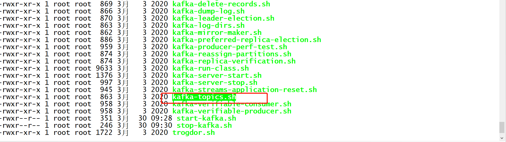

    - 查看用法

      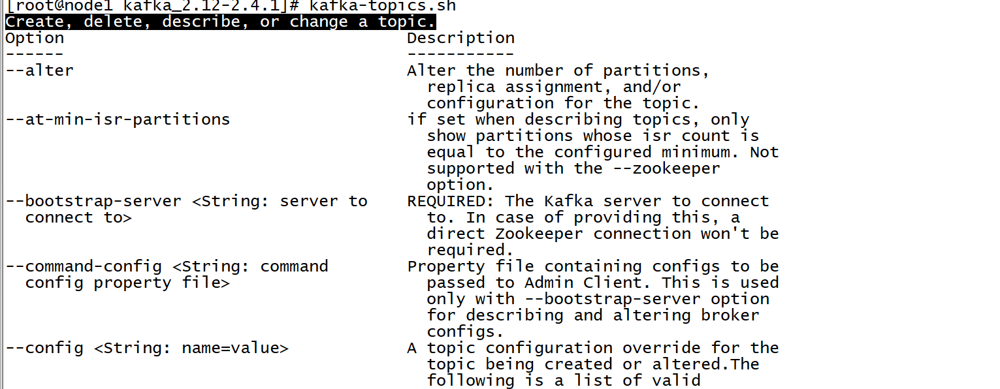

      

  - 创建Topic

    ```
    kafka-topics.sh --create --topic bigdata01 --partitions 3 --replication-factor 2 --bootstrap-server node1:9092,node2:9092,node3:9092
    ```

    - --create：创建
    - --topic：指定名称
    - --partitions ：分区个数
    - --replication-factor：分区的副本个数
    - --bootstrap-server：指定Kafka服务端地址
    - --list：列举

  - 列举Topic

    ```
    kafka-topics.sh --list -bootstrap-server node1:9092,node2:9092,node3:9092
    ```

    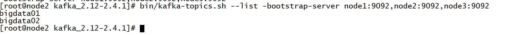

- **小结**

  - 掌握Kafka集群中Topic的管理命令，实现创建Topic及列举Topic

  

## 知识点04：Topic管理：查看与删除

- **目标**：**掌握Kafka集群中Topic的管理命令，实现查看Topic信息及删除Topic**

- **路径**

  - step1：查看Topic详细信息
  - step2：删除Topic

- **实施**

  - 查看Topic信息

    ```
    kafka-topics.sh --describe --topic bigdata01  --bootstrap-server node1:9092,node2:9092,node3:9092
    
    
    Topic: bigdata01        PartitionCount: 3       ReplicationFactor: 2  
    Topic: bigdata01        Partition: 0    Leader: 0       Replicas: 0,1   Isr: 1,0
    Topic: bigdata01        Partition: 1    Leader: 2       Replicas: 2,0   Isr: 2,0
    Topic: bigdata01        Partition: 2    Leader: 1       Replicas: 1,2   Isr: 2,1
    ```

    - Topic: bigdata01        Partition: 0    Leader: 0       Replicas: 0,1   Isr: 1,0
    - Topic：这个分区所属的Topic的名称
    - Partition：这个分区在这个Topic中的编号
      - 怎么唯一决定一个分区：Topic名称 + 分区编号
    - Leader：当前这个分区的leader副本在哪台brokerid节点上
      - 0：第一台机器
      - 1：第二台机器
      - 2：第三台机器
    - Rplicas：这个分区所有副本所在节点的Brokerid
      - 分区0，总共有两个副本，分别在第一台机器和第二台机器
      - 分区1，总共有两个副本，分别在第三台机器和第一台机器
      - 分区2，总共有两个副本，分别在第二台机器和第三台机器
    - ISR：当前这个分区可用副本

  - 删除Topic

    ```
    kafka-topics.sh --delete --topic bigdata02  --bootstrap-server node1:9092,node2:9092,node3:9092
    ```

    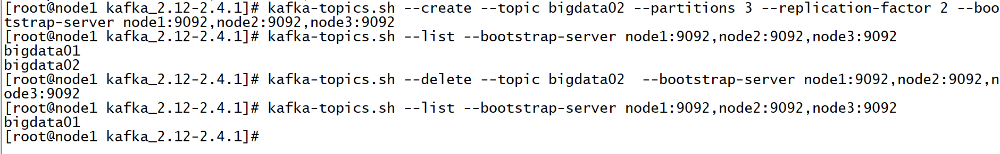

  - 修改Topic

    ```
    kafka-topics.sh --alter --topic bigdata02 分区/副本/属性=值 --bootstrap-server node1:9092,node2:9092,node3:9092
    ```

- **小结**

  - 查看信息：describe
  - 删除：delete

  

## 知识点05：生产者及消费者测试

- **目标**：了解命令行如何模拟测试生产者和消费者

- **路径**

  - step1：构建一个生产者往Topic中生产数据
    - 指定Topic
    - 指定Kafka集群地址
  - step2：构建一个消费者从Topic中消费数据
    - 指定Topic
    - 指定Kafka集群地址

- **实施**

  - 命令行提供的脚本

    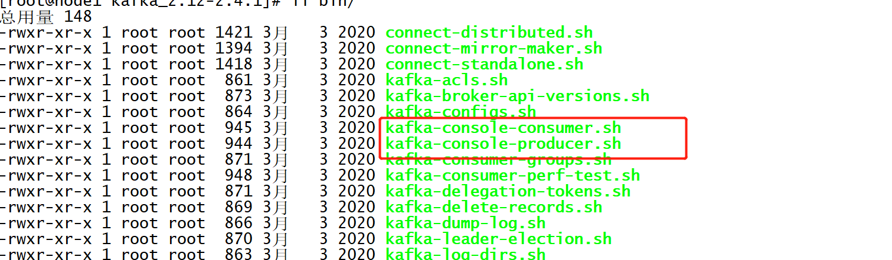

    

  - Console生产者

    ```
    bin/kafka-console-producer.sh --topic bigdata01 --broker-list node1:9092,node2:9092,node3:9092
    ```

    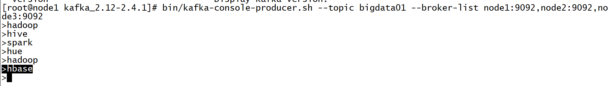

    

  - Console消费者

    ```
    bin/kafka-console-consumer.sh --topic bigdata01 --bootstrap-server node1:9092,node2:9092,node3:9092  --from-beginning
    ```

    - --from-beginning：从每个分区的最初开始消费，默认从最新的offset进行消费

    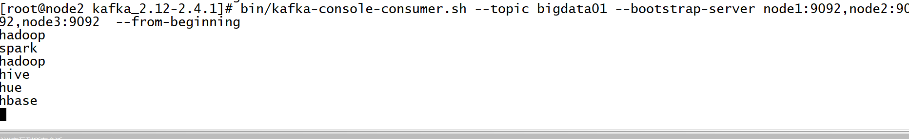

    - 默认从最新位置开始消费
    - --from-beginning：从最早的位置开始消费

- **小结**

  - 只要生产者不断生产，消费就能实时的消费到Topic中的数据

  

## 知识点06：Kafka集群压力测试

- **目标**：**了解如何实现Kafka集群的吞吐量及压力测试**

- **路径**

  - step1：生产压力测试
  - step2：消费压力测试

- **实施**

  - 创建Topic

    ```
    kafka-topics.sh --create --topic bigdata --partitions 2 --replication-factor 2 --bootstrap-server node1:9092,node2:9092,node3:9092
    ```

    

  - 生产测试

    ```shell
    kafka-producer-perf-test.sh --topic bigdata --num-records 1000000 --throughput -1 --record-size 1000 --producer-props bootstrap.servers=node1:9092,node2:9092,node3:9092 acks=1
    ```

    - --num-records：写入数据的条数
    - --throughput：是否做限制，-1表示不限制
    - --record-size：每条数据的字节大小

    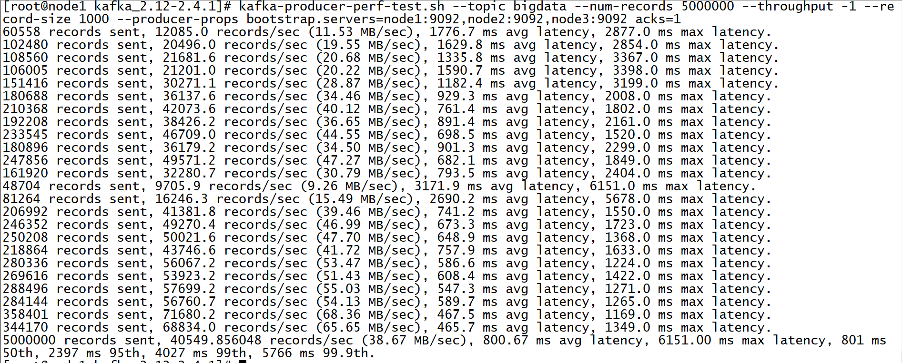

    

  - 消费测试

    ```shell
    kafka-consumer-perf-test.sh --topic bigdata --broker-list node1:9092,node2:9092,node3:9092  --fetch-size 1048576 --messages 1000000
    ```

    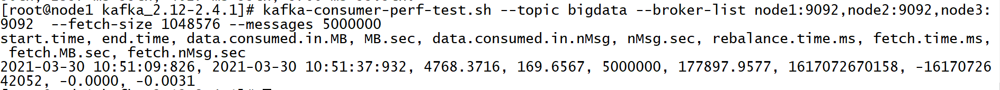

- **小结**

  - 工作中一般根据实际的需求来调整参数，测试kafka集群的最高性能，判断是否能满足需求


## 知识点07：Kafka API 的应用

- **目标**：**了解工作中使用Kafka API的场景**

- **路径**

  - step1：工作中使用Kafka的方式
  - step2：Kafka API的分类

- **实施**

  - 命令行使用Kafka

    - 一般只用于topic的管理：创建、删除

  - **大数据架构中使用Kafka**

    - Java API：构建生产者和消费者

    - 工作中一般不用自己开发生产者

    - 生产者：数据采集工具

      - Flume：Kafka sink
        - 配置kafka集群地址
        - Topic的名称

    - 消费者：实时计算程序

      - Flink程序：Kafka Source

      - SparkStream：KafkaUtil

        ```
        KafkaUtil.createDirectStream（Kafka集群地址，消费的Topic）
        ```

    - 这些软件的API已经将Kafka生产者和消费者的API封装了，只要调用即可

    - ==**重点掌握：用到哪些类和方法**==

  - **Kafka的API的分类**

    - **High Level API：高级API**
      - 基于了SimpleAPI做了封装，让用户开发更加方便
      - 但是由于封装了底层的API，有很多的东西不能控制，无法控制数据安全
      - Offset自动存储Zookeeper中，不用自己管理
    - **Simple API：简单API**
      - 并不简单，最原始的API
      - 自定义控制所有消费和生产、保证数据安全

- **小结**

  - 大数据工作中一般不自己开发Java API：掌握类和方法即可
  - 只使用Simple API来实现开发


## 知识点08：生产者API：生产数据到Kafka

- **目标**：**了解如何将数据写入Kafka中**

- **路径**

  - step1：构建ProducerRecord对象
  - step2：调用KafkaProducer的send方法将数据写入Kafka

- **实施**

  ```java
  package bigdata.itcast.cn.kafka.producer;
  
  import org.apache.kafka.clients.producer.KafkaProducer;
  import org.apache.kafka.clients.producer.ProducerRecord;
  
  import java.util.Properties;
  
  /**
   * @ClassName KafkaProducerTestClient
   * @Description TODO 实现JavaAPI开发生产者客户端，实现生产数据到Kafka中
   * @Date 2021/11/27 11:20
   * @Create By     Frank
   */
  public class KafkaProducerTestClient {
      public static void main(String[] args) {
          // todo:1-构建连接
          // 构建一个配置对象
          Properties props = new Properties();
          //指定Kafka服务端地址
          props.put("bootstrap.servers", "node1:9092,node2:9092,node3:9092");
          /**
           *  Kafka怎么保证生产者写入的数据不丢失的？数据经过网络传递，必然会出现丢包等数据丢失的情况
           *  ACK ：生产者写入一条数据到Kafka的分区中，Kafka会返回一个ack确认，生产者收到这个ack确认，再写入下一条数据
           *  Retry：如果超过一定时间，Kafka没有返回ack，就认为数据丢失，生产者会重新发送写入这条数据，如果依旧没有收到，就会重试一定次数
           *  0：生产者不用等待ack，发送完一条，直接发送下一条，最快，最不安全，肯定不用
           *  1：生产者写入数据到这个分区中，Kafka将数据写入这个分区的leader副本以后，就返回ack,生产者收到ack，再发送下一条，安全和性能折中方案
           *  all：生产者写入数据到这个分区中，Kafka等待这个分区的所有副本都同步了这条数据，再返回ack，生产者收到ack，再发送下一条，最安全，性能最差
           */
          props.put("acks", "all");
          //定义写入Kafka的KV序列化的类型
          props.put("key.serializer", "org.apache.kafka.common.serialization.StringSerializer");
          props.put("value.serializer", "org.apache.kafka.common.serialization.StringSerializer");
          // 构建一个连接对象，指定KV的类型，加载配置
          KafkaProducer<String, String> producer = new KafkaProducer<>(props);
  
          // todo:2-实现操作
          for (int i = 0; i < 10; i++){
              //调用连接对象方法将数据写入Kafka
              //ProducerRecord：每一条写入的数据必须封装为ProducerRecord对象
              //方式一：指定Topic、Key、Value
  //            producer.send(new ProducerRecord<String, String>("bigdata01", i+"", "itcast"+i));
              //方式二：指定Topic、Value
  //            producer.send(new ProducerRecord<String, String>("bigdata01",  "itcast"+i));
              //方式三：指定Topic、Partition、Key、Value
              producer.send(new ProducerRecord<String, String>("bigdata01",0,i+"","itcast"+i));
          }
  
          // todo:3-释放连接
          producer.close();
      }
  }
  
  ```

- **小结**

  - 掌握具体的类和方法

    


## 知识点09：消费者API：消费Topic数据

- **目标**：**了解如何从Kafka中消费数据**

- **路径**

  - step1：消费者订阅Topic
  - step2：调用poll方法从Kafka中拉取数据，获取返回值
  - step3：从返回值中输出：Topic、Partition、Offset、Key、Value

- **实施**

  ```java
  package bigdata.itcast.cn.kafka.consumer;
  
  import org.apache.kafka.clients.consumer.ConsumerRecord;
  import org.apache.kafka.clients.consumer.ConsumerRecords;
  import org.apache.kafka.clients.consumer.KafkaConsumer;
  
  import java.time.Duration;
  import java.util.Arrays;
  import java.util.Properties;
  
  /**
   * @ClassName KafkaConsumerTestClient
   * @Description TODO 实现JavaAPI开发Kafka消费者，消费Kafka中Topic中的数据
   * @Date 2021/11/27 11:47
   * @Create By     Frank
   */
  public class KafkaConsumerTestClient {
      public static void main(String[] args) {
          // todo:1-构建消费者连接
          Properties props = new Properties();
          // 指定服务端地址
          props.setProperty("bootstrap.servers", "node1:9092,node2:9092,node3:9092");
          // 指定这个消费者属于哪个消费者组，每个消费者组都会有1个id
          props.setProperty("group.id", "test01");
          // 开启自动提交
          props.setProperty("enable.auto.commit", "true");
          // 自动提交的时间间隔
          props.setProperty("auto.commit.interval.ms", "1000");
          // 消费者读取数据KV的反序列化类型
          props.setProperty("key.deserializer", "org.apache.kafka.common.serialization.StringDeserializer");
          props.setProperty("value.deserializer", "org.apache.kafka.common.serialization.StringDeserializer");
          // 构建一个消费者连接对象，指定KV类型以及加载配置
          KafkaConsumer<String, String> consumer = new KafkaConsumer<>(props);
  
          // todo:2-订阅、消费、处理
          //订阅Topic
          consumer.subscribe(Arrays.asList("bigdata01"));
          //消费&处理
          while (true) {
              // 消费：从Kafka拉取数据，拉取到的所有数据放在ConsumerRecords集合对象中
              ConsumerRecords<String, String> records = consumer.poll(Duration.ofMillis(100));
              // 处理：取出每一条数据
              for (ConsumerRecord<String, String> record : records){
                  String topic = record.topic();//这条数据属于哪个topic
                  int part = record.partition();//这条数据属于这个Topic的哪个分区
                  long offset = record.offset();//这条数据在这个分区中的offset是什么
                  String key = record.key();//获取数据中的Key
                  String value = record.value();//获取数据中的Value
                  //输出
                  System.out.println(topic+"\t"+part+"\t"+offset+"\t"+key+"\t"+value);
              }
  
          }
  
          // todo:3-实时计算中：消费者是不停的
      }
  }
  
  ```

  

- **小结**

  - 掌握具体的类和方法


## 知识点10：生产分区规则

- **目标**：**掌握Kafka生产者生产数据的分区规则**

- **实施**

  - **面试题：Kafka生产者怎么实现生产数据的负载均衡？**

    - 生产数据的时候尽量保证相对均衡的分到Topic多个分区中
    - 生产者生产数据到Kafka的Topic中，但是Topic有多个分区，数据到底会进入哪一个分区中？

  - **问题**：为什么生产数据的方式不同，分区的规则就不一样？

    ```java
    - ProducerRecord（Topic，Value）//将所有数据写入某一个分区
    - ProducerRecord（Topic，Key，Value） //按照Key的Hash取余方式
    - ProducerRecord（Topic，Partition，Key，Value） //指定写入某个分区
    ```

    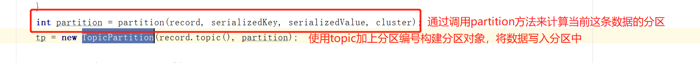

    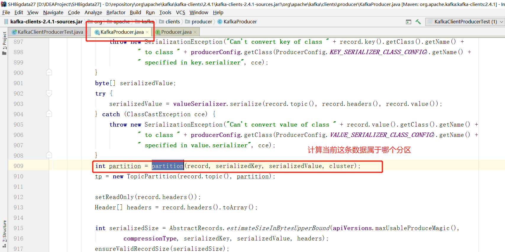

    

  - **规则**

    - **如果指定了分区：写入所指定的分区中**

      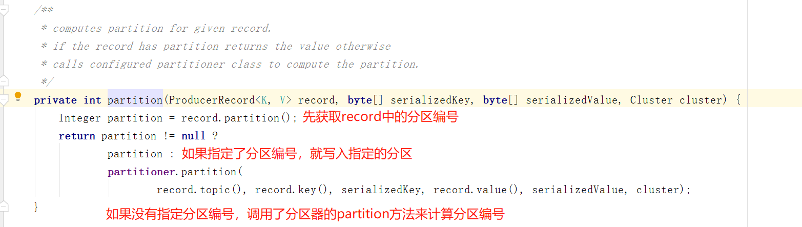

    - 如果没指定分区：默认调用的是DefaultPartitioner分区器中partition这个方法

      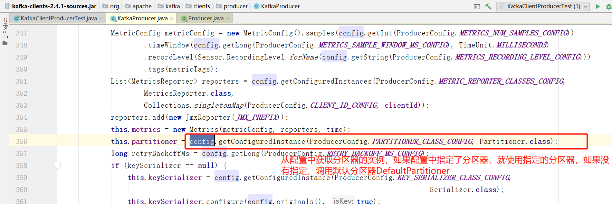

      

      - **如果指定了Key：按照Key的Hash取余分区的个数，来写入对应的分区**

        - 优点：只要Key一样，就会进入同一个分区

    - 缺点：容易导致数据倾斜

  - **如果没有指定Key：按照黏性分区**

    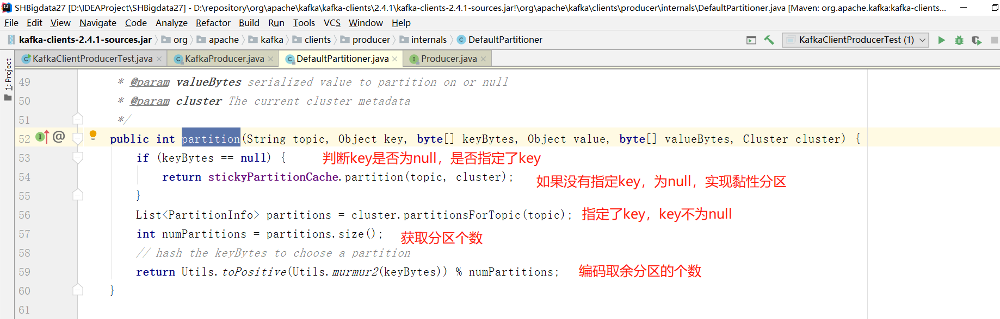

    - 2.4之前：轮询分区

          - 优点：数据分配相对均衡
          
            ```
            Topic		part		key		value
            topic		0			1		itcast1
            topic		1			2		itcast2
            topic		2			3		itcast3
            topic		0			4		itcast4
            topic		1			5		itcast5
            topic		2			6		itcast6
            topic		0			7		itcast7

        topic		1			8		itcast8
            topic		2			9		itcast9

        ```
        - 问题：批次多，每个批次数据量少，性能比较差
      
            - 希望：批次少，每个批次数据量多，性能比较好
      
        - 2.4之后：黏性分区：多个批次随机分区
          
            - 设计：实现少批次多数据，尽量将一个批次的所有数据写入一个分区
            
            - 规则：判断缓存中是否有这个topic的分区连接，如果有，直接使用，如果没有随机写入一个分区，并且放入缓存
            
              
              
              
              
            
          
            
        - 第一次将所有数据随机选择一个分区，全部写入这个分区中，将这次的分区编号放入缓存中
      
        ```

          bigdata01	1	37	null	itcast0
          bigdata01	1	38	null	itcast1
          bigdata01	1	39	null	itcast2
          bigdata01	1	40	null	itcast3
          bigdata01	1	41	null	itcast4
          bigdata01	1	42	null	itcast5
          bigdata01	1	43	null	itcast6
          bigdata01	1	44	null	itcast7

      bigdata01	1	45	null	itcast8
          bigdata01	1	46	null	itcast9

      ```
        - 第二次开始根据缓存中是否有上一次的编号
      
          - 有：直接使用上一次的编号
          - 没有：重新随机选择一个
      ```

- **小结**

  - 掌握Kafka中生产数据的分区规则

    - step1：先判断有没有指定分区
    - 如果指定分区，就写入指定的分区
      - 如果没有，执行第二步
    - step2：调用分区器，再判断有没有Key
      - 有：按照Key的类似于Hash取余的方式来计算分区
      - 没有：使用黏性分区

    

## 知识点11：自定义开发生产分区器

- **目标**：**掌握Kafka自定义开发生产分区器，以随机分区为例**

- **路径**

  - step1：开发一个类实现Partitioner接口
  - step2：实现partition方法
  - step3：生产者加载分区器

- **实施**

  - 开发一个随机分区器

    ```java
    package bigdata.itcast.cn.kafka.userpart;
    
    import org.apache.kafka.clients.producer.Partitioner;
    import org.apache.kafka.common.Cluster;
    
    import java.util.Map;
    import java.util.Random;
    
    /**
     * @ClassName UserPartition
     * @Description TODO 基于分区器的接口，自定义实现分区规则，例如：实现数据的随机分区
     * @Date 2021/11/27 14:43
     * @Create By     Frank
     */
    public class UserPartition implements Partitioner {
    
        /**
         * 分区器被调用的核心方法，用于计算分区的
         * @param topic：topic的名称
         * @param key：Key
         * @param keyBytes：Key
         * @param value：Value
         * @param valueBytes：Value
         * @param cluster：集群配置对象
         * @return 分区编号
         */
        @Override
        public int partition(String topic, Object key, byte[] keyBytes, Object value, byte[] valueBytes, Cluster cluster) {
    
            //获取这个Topic的分区个数
            Integer parts = cluster.partitionCountForTopic(topic);
            // 构建一个随机的分区的编号
            Random random = new Random();
            int part = random.nextInt(parts);
            //返回
            return part;
        }
    
        @Override
        public void close() {
            //释放资源连接
        }
    
        @Override
        public void configure(Map<String, ?> configs) {
            //获取配置
        }
    }
    
    ```

  - 加载分区器

    ```java
    //指定分区器
    props.put("partitioner.class","bigdata.itcast.cn.kafka.userpart.UserPartition");
    ```

  - 结果

    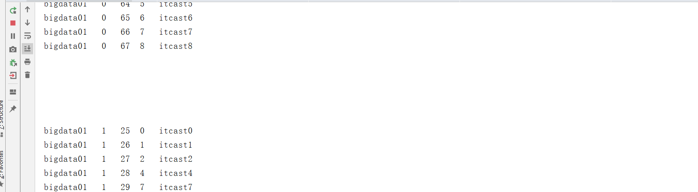

- **小结**

  - 构建一个自定义分区器


## 知识点12：消费者消费过程及问题

- **目标**：**掌握Kafka消费者消费过程及消费问题**

- **路径**

  - step1：消费者是如何消费Topic中的数据的？
  - step2：如果消费者故障重启，消费者怎么知道自己上次消费的位置的？

- **实施**

  - **Kafka中消费者消费数据的规则**

    - 消费者消费Kafka中的Topic根据每个分区的Offset进行消费，每次从上一次的位置继续消费

    - 第一次消费规则：由属性决定

      ```
      auto.offset.reset = latest | earliest | none
      latest：默认的值，从Topic每个分区的最新的位置开始消费
      earliest：从最早的位置开始消费，每个分区的offset为0开始消费
      none：如果是第一次消费，这个属性为none，Kafka会抛出异常
      如果不是第一次消费：上面这个属性不起作用
      ```

    - 第二次消费开始：根据**上一次消费的Offset**位置+1继续进行消费

      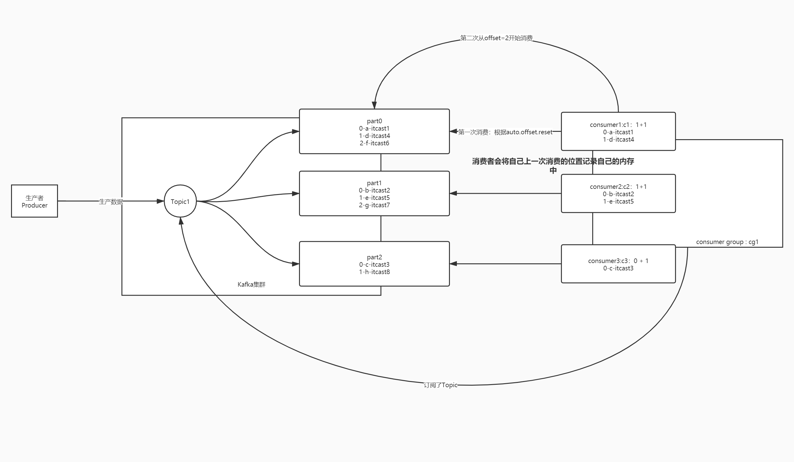

    - **问题1：消费者如何知道上一次消费的位置是什么？**

      - 消费者每次成功消费会在自己的内存中记录offset的值，下次直接请求上一次消费的位置

      - Consumer Offset：表示当前消费者组已经消费到的位置

      - Commit Offset：表示下一次要消费的位置，等于Consumer Offset+1

        

    - **问题2**

      - **只有1个消费：如果因为一些原因，消费者故障了，重启消费者，相当于一个新的消费者，原来内存中offset就没有了，消费者怎么知道上一次消费的位置？**
      - **如果多个消费者：因为一些原因，某个消费者故障，这个消费者本来负责的分区，Kafka会交给别的消费者来继续消费，这个接盘侠它怎么知道之前的那个消费者消费到的位置？**
      - 如果不知道上一次的位置，就无法接着上次的位置继续消费
        - 要么重头消费：数据重复
        - 要么最新消费：数据丢失
      - 原因：offset只放在内存中，进程故障，内存的数据丢失，Offset也就丢失了
      - 解决：将offset持久化存储并且共享

  - **Kafka Offset偏移量管理**

    - Kafka将每个消费者消费的Commit Offset主动记录在一个Topic中：**__consumer_offsets**
    - 如果下次消费者没有给定请求offset，kafka就根据自己记录的offset来提供消费的位置

    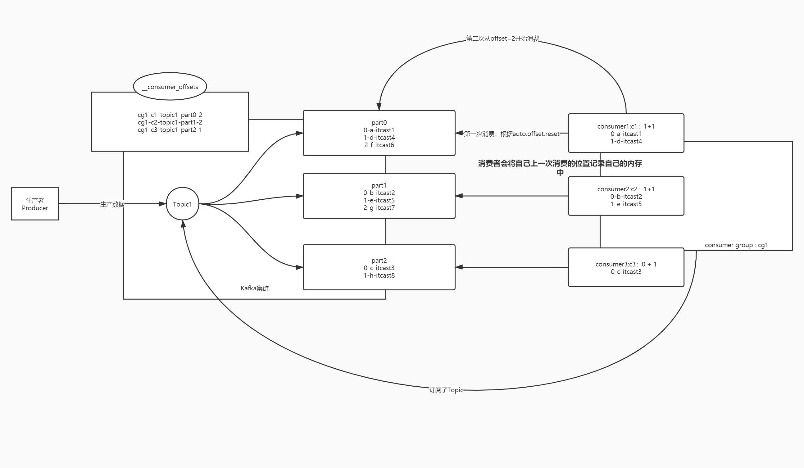

  - 提交的规则：根据时间自动提交

    ```java
    props.setProperty("enable.auto.commit", "true");//是否自动提交offset
    props.setProperty("auto.commit.interval.ms", "1000");//提交的间隔时间
    ```

- **小结**

  - 掌握消费者如何消费kafka中的Topic的数据


## 知识点13：自动提交问题

- **目标**：**了解Kafka自动提交Offset存在的问题**

- **路径**

  - step1：自动提交是否会出现数据丢失问题
  - step2：自动提交是否会出现数据重复问题

- **实施**

  - **自动提交的规则**

    - 根据时间周期来提交下一次要消费的offset，记录在__consumer_offsets中
    - 每1s提交记录一次

  - **数据丢失的情况**

    - 如果刚消费，还没处理，就达到提交周期，记录了当前 的offset

    - 最后处理失败，需要重启，重新消费处理

    - Kafka中已经记录消费过了，从上次消费的后面进行消费

      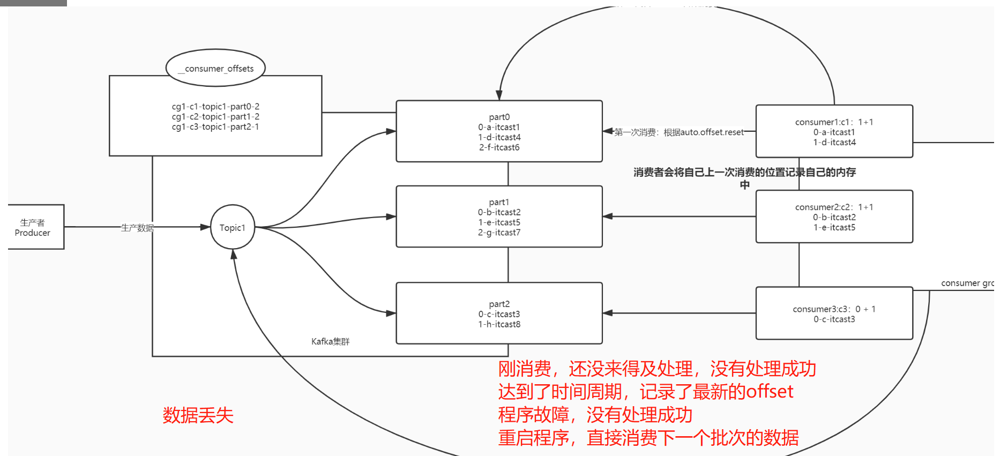

      

    - **数据重复的情况**

      - 如果消费并处理成功，但是没有提交offset，程序故障

      - 重启以后，kafka中记录的还是之前的offset，重新又消费一遍

      - 数据重复问题

        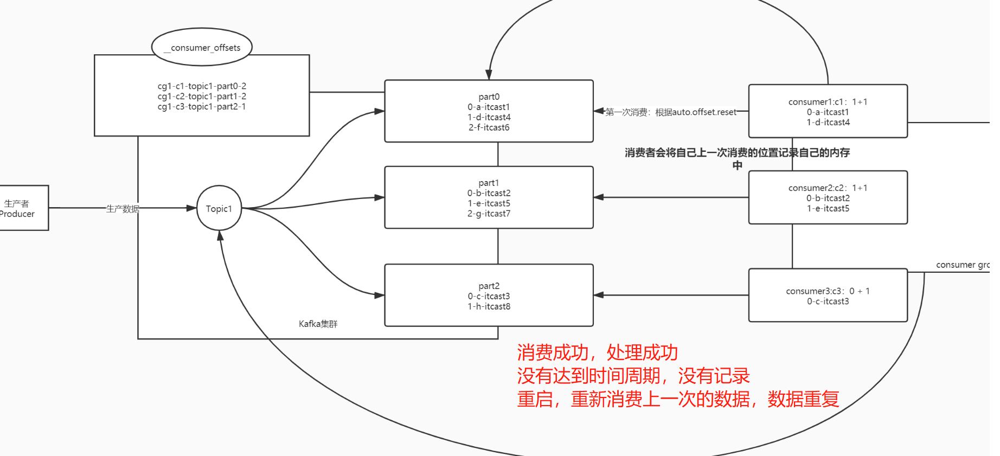

  - 原因

    - 自动提交：按照时间来进行提交
    - 需求：**按照消费和处理的结果**
      - 如果消费并处理成功，提交
      - 如果消费失败或者处理失败，不提交

- **小结**

  - 消费是否成功，是根据处理的结果来决定的


## 知识点14：实现手动提交Topic的Offset

- **目标**：**了解Kafka如何实现手动提交Topic的Offset实现**

- **路径**

  - step1：关闭自动提交
  - step2：消费完整后手动提交

- **实施**

  - 关闭自动提交

    ```java
            //关闭自动提交
            props.setProperty("enable.auto.commit", "false");
            //自动提交的时间间隔
    //        props.setProperty("auto.commit.interval.ms", "1000");
    ```

    

  - 手动提交Offset

    ```java
    package bigdata.itcast.cn.kafka.manual;
    
    import org.apache.kafka.clients.consumer.ConsumerRecord;
    import org.apache.kafka.clients.consumer.ConsumerRecords;
    import org.apache.kafka.clients.consumer.KafkaConsumer;
    
    import java.time.Duration;
    import java.util.Arrays;
    import java.util.Properties;
    
    /**
     * @ClassName KafkaConsumerTestClient
     * @Description TODO 实现JavaAPI开发Kafka消费者，消费Kafka中Topic中的数据，并且手动提交offset到Kafka的__consumer_offsets中
     * @Date 2021/11/27 11:47
     * @Create By     Frank
     */
    public class KafkaConsumerMaualTopicOffset {
        public static void main(String[] args) {
            // todo:1-构建消费者连接
            Properties props = new Properties();
            // 指定服务端地址
            props.setProperty("bootstrap.servers", "node1:9092,node2:9092,node3:9092");
            // 指定这个消费者属于哪个消费者组，每个消费者组都会有1个id
            props.setProperty("group.id", "test01");
            // 开启自动提交
            props.setProperty("enable.auto.commit", "false");
            // 自动提交的时间间隔
    //        props.setProperty("auto.commit.interval.ms", "1000");
            // 消费者读取数据KV的反序列化类型
            props.setProperty("key.deserializer", "org.apache.kafka.common.serialization.StringDeserializer");
            props.setProperty("value.deserializer", "org.apache.kafka.common.serialization.StringDeserializer");
            // 构建一个消费者连接对象，指定KV类型以及加载配置
            KafkaConsumer<String, String> consumer = new KafkaConsumer<>(props);
    
            // todo:2-订阅、消费、处理
            //订阅Topic
            consumer.subscribe(Arrays.asList("bigdata01"));
            //消费&处理
            while (true) {
                // 消费：从Kafka拉取数据，拉取到的所有数据放在ConsumerRecords集合对象中
                ConsumerRecords<String, String> records = consumer.poll(Duration.ofMillis(100));
                // 处理：取出每一条数据
                for (ConsumerRecord<String, String> record : records){
                    String topic = record.topic();//这条数据属于哪个topic
                    int part = record.partition();//这条数据属于这个Topic的哪个分区
                    long offset = record.offset();//这条数据在这个分区中的offset是什么
                    String key = record.key();//获取数据中的Key
                    String value = record.value();//获取数据中的Value
                    //输出
                    System.out.println(topic+"\t"+part+"\t"+offset+"\t"+key+"\t"+value);
                }
                //手动提交Offset：同步提交
                consumer.commitSync();
            }
            // todo:3-实时计算中：消费者是不停的
        }
    }
    
    ```

    

- **小结**

  - 关闭自动提交
  - 根据处理的结果来实现手动提交，如果成功以后，再手动提交


## 知识点15：手动提交Topic Offset的问题

- **目标**：**了解Kafka实现手动提交Topic的Offset的问题**

- **路径**

  - step1：Offset的设计层次
  - step2：手动提交Topic Offset出现数据重复问题
  - step3：解决方案是什么？

- **实施**

  - **Offset的设计**

    - Offset是分区级别，每个分区单独管理一套offset

  - **手动提交Topic Offset的过程中会出现数据重复**

    - 举个栗子

    - 一个消费者，消费一个Topic，Topic有三个分区

      - 第一次消费

        - part0

          ```
          0	hadoop
          1	hive
          ```

          

        - part1

          ```
          0	hive
          1	spark
          2	hue
          ```

          

        - part2

          ```
          0	spark
          1	hadoop
          ```

      - 问题：part0和part1都处理成功，当处理part2时候，程序故障，重启

        - offset有没有提交？没有提交
        - 重启消费者：Kafka中没有消费记录，但是消费者刚刚分区0和分区1已经消费成功了
        - 所有分区都重新消费

  - **原因**

    - Offset是分区级别的
    - 提交offset是按照整个Topic级别来提交的

  - **解决**

    - 提交offset的时候，**按照分区来提交**
    - 消费并处理成功一个分区，就提交这个分区的offset

- **小结**

  - 导致问题：数据重复
  - 导致原因：offset是分区级别，提交时topic级别，只要有一个分区失败，整个提交失败，实际上部分分区已经处理成功了


## 知识点16：手动提交分区Offset的实现

- **目标**：**掌握Kafka实现手动提交Partition的Offset**

- **路径**

  - step1：消费每个分区的数据
  - step2：处理输出每个分区的数据
  - step3：手动提交每个分区的Offset

- **实施**

  ```java
  package bigdata.itcast.cn.kafka.manual;
  
  import org.apache.kafka.clients.consumer.ConsumerRecord;
  import org.apache.kafka.clients.consumer.ConsumerRecords;
  import org.apache.kafka.clients.consumer.KafkaConsumer;
  import org.apache.kafka.clients.consumer.OffsetAndMetadata;
  import org.apache.kafka.common.TopicPartition;
  
  import java.time.Duration;
  import java.util.*;
  
  /**
   * @ClassName KafkaConsumerTestClient
   * @Description TODO 实现JavaAPI开发Kafka消费者，消费Kafka中Topic中的数据，并且手动提交每个分区的offset到Kafka的__consumer_offsets中
   * @Date 2021/11/27 11:47
   * @Create By     Frank
   */
  public class KafkaConsumerMaualPartitionOffset {
      public static void main(String[] args) {
          // todo:1-构建消费者连接
          Properties props = new Properties();
          // 指定服务端地址
          props.setProperty("bootstrap.servers", "node1:9092,node2:9092,node3:9092");
          // 指定这个消费者属于哪个消费者组，每个消费者组都会有1个id
          props.setProperty("group.id", "test01");
          // 开启自动提交
          props.setProperty("enable.auto.commit", "false");
          // 自动提交的时间间隔
  //        props.setProperty("auto.commit.interval.ms", "1000");
          // 消费者读取数据KV的反序列化类型
          props.setProperty("key.deserializer", "org.apache.kafka.common.serialization.StringDeserializer");
          props.setProperty("value.deserializer", "org.apache.kafka.common.serialization.StringDeserializer");
          // 构建一个消费者连接对象，指定KV类型以及加载配置
          KafkaConsumer<String, String> consumer = new KafkaConsumer<>(props);
  
          // todo:2-订阅、消费、处理
          //订阅Topic
          consumer.subscribe(Arrays.asList("bigdata01"));
          //消费&处理
          while (true) {
              // 消费：从Kafka拉取数据，拉取到的所有分区数据放在ConsumerRecords集合对象中
              ConsumerRecords<String, String> records = consumer.poll(Duration.ofMillis(100));
              // 从所有数据中获取这次的所有数据是哪些分区的数据
              Set<TopicPartition> partitions = records.partitions();
              // 对每个分区进行迭代
              for (TopicPartition partition : partitions) {
                  // 从records中把这个分区的所有数据单独取出来
                  List<ConsumerRecord<String, String>> partRecords = records.records(partition);
                  // 处理当前分区的数据：取出这个分区中的每一条数据
                  long offset = 0;
                  for (ConsumerRecord<String, String> record : partRecords){
                      String topic = record.topic();//这条数据属于哪个topic
                      int part = record.partition();//这条数据属于这个Topic的哪个分区
                      offset = record.offset();//这条数据在这个分区中的offset是什么
                      String key = record.key();//获取数据中的Key
                      String value = record.value();//获取数据中的Value
                      //输出
                      System.out.println(topic+"\t"+part+"\t"+offset+"\t"+key+"\t"+value);
                  }
                  // 上面for循环结束，表示这个分区的数据已经处理完了
                  //手动提交Offset：同步提交当前这个分区的commit offset
                  Map<TopicPartition, OffsetAndMetadata> offsets = Collections.singletonMap(partition,new OffsetAndMetadata(offset+1));
                  consumer.commitSync(offsets);
              }
  
          }
          // todo:3-实时计算中：消费者是不停的
      }
  }
  
  ```

  

- **小结**

  - 掌握Kafka实现手动提交Partition的Offset

    


## 知识点17：指定消费Topic分区的数据

- **目标**：**掌握Kafka如何实现消费指定分区的数据**

- **路径**

  - step1：构建Topic分区对象
  - step2：指定消费Topic的分区
  - step3：输出消费结果

- **实施**

  - 构建Topic分区对象

    ```java
    TopicPartition part1 = new TopicPartition("bigdata01", 1);
    TopicPartition part2 = new TopicPartition("bigdata01", 2);
    ```

  - 指定消费Topic分区

    ```java
    consumer.assign(Arrays.asList(part1,part2));  
    ```

  - 观察结果

    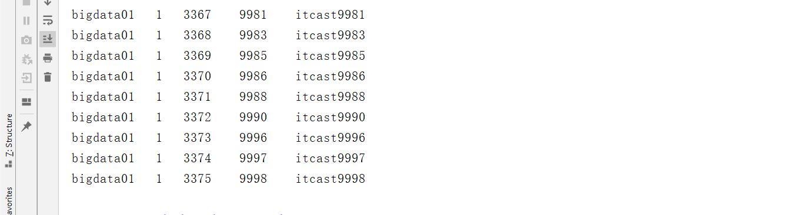

- **小结**

  - Kafka的消费有三个级别

    - Topic级别：subcribe

      - 场景：普通发布订阅

    - Parition级别：assign

      - 场景：限制每个消费者消费的分区

    - Offset级别：seek

      - 场景：自己自由实现数据的消费，根据需求自由从某个位置进行消费

      - 需求：将每个消费者的commit offset自己管理，不用Kafka自带的__consumer_offsets来实现

        - 将Offset存储在MySQL、Redis、ZK中

      - 实现

        - step1：自己保存

          ```java
          // 构建消费者
          // 指定上一次消费位置
          	Map<TopicPartition,offsets> rs = OffsetUtils.readFromMySQL(groupid,topics)
              consumer.seek(rs.key,rs.value)
          // 消费
          // 处理每个分区
          for (TopicPartition partition : partitions) {
                          // 从records中把这个分区的所有数据单独取出来
                          List<ConsumerRecord<String, String>> partRecords = records.records(partition);
                          // 处理当前分区的数据：取出这个分区中的每一条数据
                          long offset = 0;
                          for (ConsumerRecord<String, String> record : partRecords){
                              String topic = record.topic();//这条数据属于哪个topic
                              int part = record.partition();//这条数据属于这个Topic的哪个分区
                              offset = record.offset();//这条数据在这个分区中的offset是什么
                              String key = record.key();//获取数据中的Key
                              String value = record.value();//获取数据中的Value
                              //输出
                              System.out.println(topic+"\t"+part+"\t"+offset+"\t"+key+"\t"+value);
                          }
                          // 自己开发工具类将offset存储在MySQL中
                          OffsetUtils.writeToMySQL(groupid,topic,partition,offset+1){
                          	replace into tb_offset values(?,?,?,?)
                          }
                      }
          ```

          

    

## 知识点18：消费分配策略：基本规则及分配策略

- **目标**：**掌握Kafka消费者组中多个消费者的分配规则及问题**

- **路径**

  - step1：消费者组中消费者分配消费分区的基本规则是什么？
  - step2：如果一个消费者组中有多个消费者，消费者组消费多个Topic，每个Topic有多个分区，如何分配？
  - step3：如果消费者组中，有一个消费者故障了或者新增了一个消费者，Kafka怎么实现负载均衡？

- **实施**

  - **基本规则**

    - **==一个消费者组消费的过程中，一个分区的数据只能由某一个消费者消费==**

      - 一个消费者组中的消费者的个数最多等于消费分区个数

      - 不能实现多个消费者消费一个分区的数据

      - 原因：每个消费者在逻辑上属于同一个消费者组，但是物理上独立的消费者，无法获取彼此的offset的，不能共同协作的，但是可以由Kafka来做负载均衡

      - 问题：怎么实现一个消费者组中有多个消费者？

        - 第一个消费者代码

          ```
          prop.set("group.id","test01")
          consumer01 = new KafkaConsumer(prop)
          ```

        - 第二个消费者代码

          ```
          prop.set("group.id","test01")
          consumer02 = new KafkaConsumer(prop)
          ```

        - ……

    - **==一个消费者可以消费多个分区的数据==**

      - 消费者会挨个分区进行消费

  - **分配策略**：决定了多个分区如何分配给多个消费者

    - 属性

      ```Properties
      partition.assignment.strategy = org.apache.kafka.clients.consumer.RangeAssignor
      ```

    - **策略**

      - **RangeAssignor**：范围分配，**默认的分配策略**

      - **RoundRobinAssignor**：轮询分配，常见于Kafka2.0之前的版本

        ```
        org.apache.kafka.clients.consumer.RoundRobinAssignor
        ```

      - **StickyAssignor**：黏性分配，2.0之后建议使用

        ```
        org.apache.kafka.clients.consumer.StickyAssignor
        ```

- **小结**

  - 掌握Kafka消费者组中多个消费者的分配规则及问题

    - 基本规则：一个分区只能被同一个消费者组中的某一个消费者消费，一个消费者是可以消费多个分区
    - 分配规则：范围分配、轮询分配、黏性分配

    

## 知识点19：消费分配策略：RangeAssignor

- **目标**：**掌握范围分配策略的规则及应用场景**

- **路径**

  - step1：范围分配策略的规则是什么？
  - step2：范围分配的优缺点是什么？

- **实施**

  - **范围分配规则**

    - **Kafka中默认的分配规则**
    - 每个消费者消费一定范围的分区，尽量的实现将分区均分给不同的消费者，如果不能均分，优先将分区分配给编号小的消费者
    - 针对每个消费者的每个Topic进行范围分配
    - 6个分区：part0 ~ part5
      - 2个消费者
        - C1：part0 ~ part2
        - C2：part3 ~ part5
      - 4个消费者
        - C1：part0  part1
        - C2：part2  part3
        - C3：part4
        - C4：part5

  - 举例

    - 假设一：三个消费者，消费1个Topic，Topic1有6个分区

      | 消费者 |   分区    |
      | :----: | :-------: |
      |   C1   | T1【0,1】 |
      |   C2   | T1【2,3】 |
      |   C3   | T1【4,5】 |

      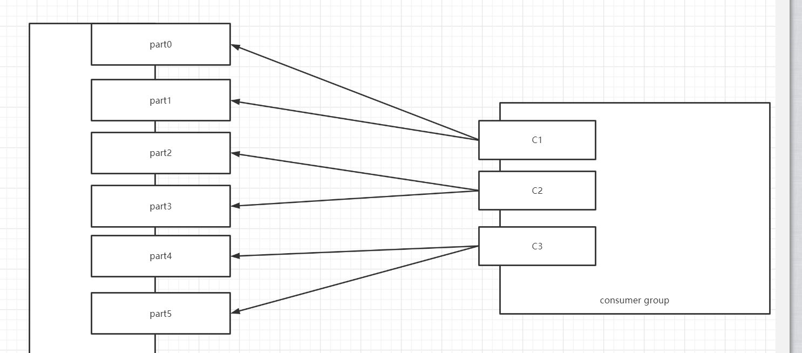

      

    - 假设二：三个消费者，消费1个Topic，Topic1有7个分区

      | 消费者 |    分区     |
      | :----: | :---------: |
      |   C1   | T1【0,1,2】 |
      |   C2   |  T1【3,4】  |
      |   C3   |  T1【5,6】  |

      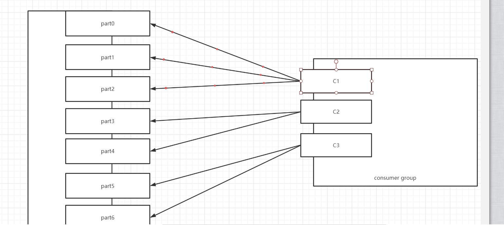

    

    - 假设三：三个消费者，消费3个Topic，Topic1、Topic2、Topic3各有7个分区

      | 消费者 |                分区                 |
      | :----: | :---------------------------------: |
      |   C1   | T1【0,1,2】 T2【0,1,2】 T3【0,1,2】 |
      |   C2   |    T1【3,4】 T2【3,4】 T3【3,4】    |
      |   C3   |    T1【5,6】 T2【5,6】 T3【5,6】    |

      - 问题：负载不均衡

    - 优点

      - 如果Topic的个数比较少，分配会相对比较均衡

    - 缺点

      - 如果Topic的个数比较多，而且不能均分，导致负载不均衡问题

    - 应用：Topic个数少或者每个Topic都均分的场景

- **小结**

  - 规则：每个消费者消费一定范围的分区，尽量做均分，如果不能均分，优先将分区分配给编号小的消费者
  - 应用：适合于Topic个数少或者每个Topic都能均分场景


## 知识点20：消费分配策略：RoundRobinAssignor

- **目标**：**掌握轮询分配策略的规则及应用场景**

- **路径**

  - step1：轮询分配的规则是什么？
  - step2：轮询规则有什么优缺点？

- **实施**

  - **轮询分配的规则**

    - 按照Topic的名称和分区编号排序，轮询分配给每个消费者

    - 如果遇到范围分区的场景，能否均衡

      - 三个消费者，消费3个Topic，每个有7个分区

        - T1：0 ~ 6
        - T2：0 - 6
        - T3：0 - 6

        | 消费者 |               分区               |
        | :----: | :------------------------------: |
        |   C1   | T1【0,3,6】 T2【2,5】 T3【1,4】  |
        |   C2   | T1【1,4】 T2【0,3,6】 T3【2,5】  |
        |   C3   | T1【2,5】 T2【1,4】 T3【0，3,6】 |

  - **举例**

    - 假设一：三个消费者，消费2个Topic，每个Topic3个分区

      | 消费者 |       分区       |
      | :----: | :--------------: |
      |   C1   | T1【0】  T2【0】 |
      |   C2   | T1【1】  T2【1】 |
      |   C3   | T1【2】  T2【2】 |

      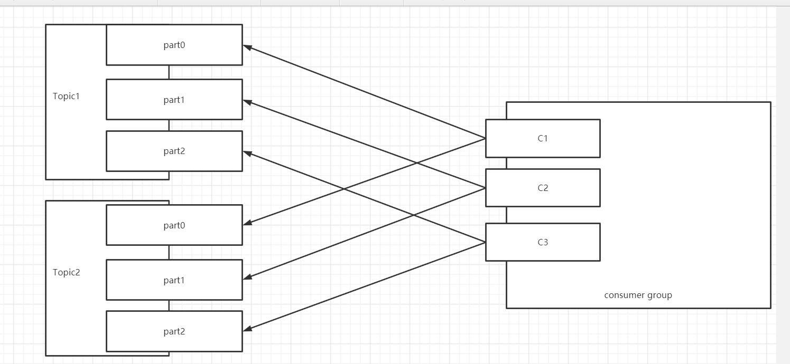

      

    - 假设二：三个消费者，消费3个Topic，第一个Topic1个分区，第二个Topic2个分区，第三个Topic三个分区，消费者1消费Topic1，消费者2消费Topic1，Topic2，消费者3消费Topic1,Topic2,Topic3

      - 消费：C1【T1】，C2【T1,T2】，C3【T1，T2，T3】
        - T1的数据多，让所有消费者都订阅，所有消费者并行消费T1
        - T3的数据少，让部分消费者订阅
      - 实现
        - 排序然后轮询
        - T1【0】
        - T2【0】
        - T2【1】
        - T3【0】
        - T3【1】
        - T3【2】
      - 最优解
        - C1：T1【0】
        - C2：T2【0,1】
        - C3：T3【0,1,2】

| 消费者 |              分区               |
| :----: | :-----------------------------: |
|   C1   |             T1【0】             |
|   C2   |             T2【0】             |
|   C3   | T2【1】 T3【0】 T3【1】 T3【2】 |

  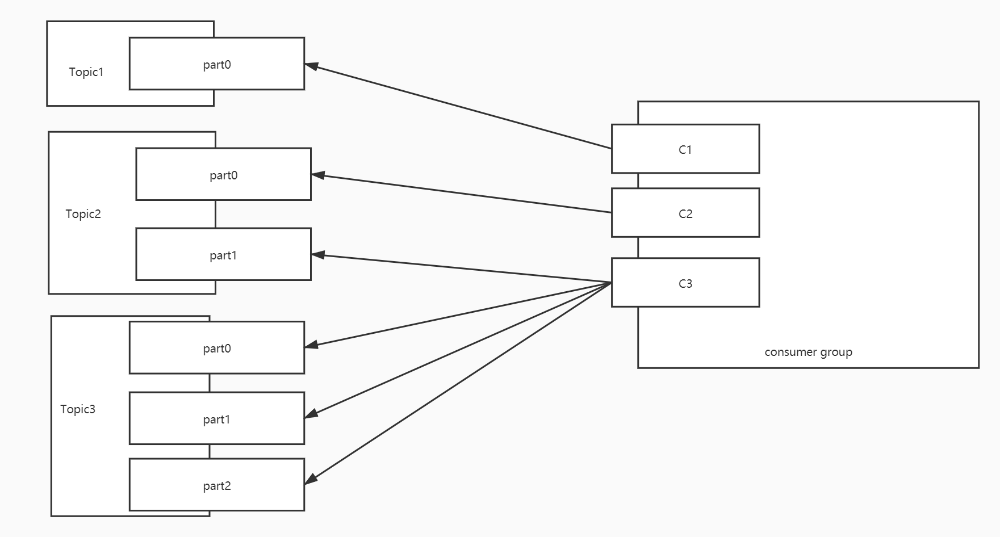

- 问题：负载不均衡

- 优点

  - 如果有多个消费者，消费的Topic都是一样的，实现将所有Topic的所有分区轮询分配给所有消费者，尽量的实现负载的均衡
    - 大多数的场景都是这种场景

- 缺点

  - 遇到消费者订阅的Topic是不一致的，不同的消费者订阅了不同Topic，只能基于订阅的消费者进行轮询分配，导致整体消费者负载不均衡的

- 应用：所有消费者都订阅共同的Topic，能实现让所有Topic的分区轮询分配所有的消费者

- **小结**

  - 规则：根据订阅关系，将订阅的Topic的分区排序轮询分配给订阅的消费者
  - 应用：订阅关系都是一致的


## 知识点21：消费分配策略：StickyAssignor

- **目标**：**掌握黏性分配策略的规则及应用场景**

- **路径**

  - step1：黏性分配的规则是什么？
  - step2：黏性分配有什么特点？

- **实施**

  - 问题：类似于上面的特殊场景，轮询不均衡，以及上面的两种分配策略没有考虑消费者故障问题
  - 某个消费者如果故障，上面两种方案都会重新对整体进行分配，性能非常差
  - **黏性分配的规则**
    - 类似于轮询分配，尽量的将分区均衡的分配给消费者
  - 黏性分配的**==特点==**

    - **相对的保证的分配的均衡**：能实现非常高均衡性

    - **如果某个消费者故障，尽量的避免网络传输**
      - 尽量保证原来的消费的分区不变，将多出来分区均衡给剩余的消费者
      - 假设原来有3个消费，消费6个分区，平均每个消费者消费2个分区
      - 如果有一个消费者故障了，这个消费者负责的分区交给剩下的消费者来做：消费重平衡

- 举例

  - 假设一：三个消费者，消费2个Topic，每个Topic3个分区

    | 消费者 |       分区       |
    | :----: | :--------------: |
    |   C1   | T1【0】  T2【0】 |
    |   C2   | T1【1】  T2【1】 |
    |   C3   | T1【2】  T2【2】 |

    - 效果类似于轮询，比较均衡的分配，但底层实现原理有些不一样

  - 假设二：三个消费者，消费3个Topic，第一个Topic1个分区，第二个Topic2个分区，第三个Topic三个分区，消费者1消费Topic1，消费者2消费Topic1，Topic2，消费者3消费Topic1,Topic2,Topic3

    | 消费者 |          分区           |
    | :----: | :---------------------: |
    |   C1   |         T1【0】         |
    |   C2   |     T2【0】 T2【1】     |
    |   C3   | T3【0】 T3【1】 T3【2】 |

      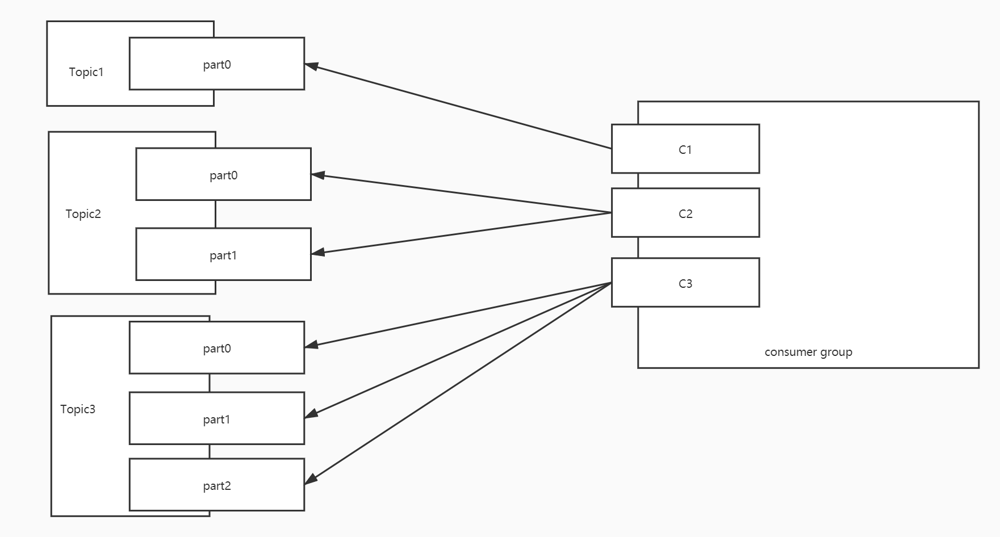

  - **负载均衡的场景**：某个消费者故障，其他的消费者要重新分配所有分区

    - 假设三：如果假设一中的C3出现故障

    - 假设一

      | 消费者 |       分区       |
      | :----: | :--------------: |
      |   C1   | T1【0】  T2【0】 |
      |   C2   | T1【1】  T2【1】 |
      |   C3   | T1【2】  T2【2】 |

    - 轮询：将所有分区重新分配

      | 消费者 |          分区           |
      | :----: | :---------------------: |
      |   C1   | T1【0】 T1【2】 T2【1】 |
      |   C2   | T1【1】 T2【0】 T2【2】 |

    - 黏性：直接故障的分区均分给其他的消费者，其他消费者不用改变原来的分区，降低网络IO消耗

      | 消费者 |           分区           |
      | :----: | :----------------------: |
      |   C1   | T1【0】  T2【0】 T1【2】 |
      |   C2   | T1【1】  T2【1】 T2【2】 |

  - 假设四：如果假设二中的C1出现故障

    - 假设二：轮询

      | 消费者 |              分区               |
      | :----: | :-----------------------------: |
      |   C1   |             T1【0】             |
      |   C2   |             T2【0】             |
      |   C3   | T2【1】 T3【0】 T3【1】 T3【2】 |

    - 轮询负载均衡

      | 消费者 |              分区              |
      | :----: | :----------------------------: |
      |   C2   |        T1【0】 T2【1】         |
      |   C3   | T2【0】T3【0】 T3【1】 T3【2】 |

    - 假设二：黏性

      | 消费者 |          分区           |
      | :----: | :---------------------: |
      |   C1   |         T1【0】         |
      |   C2   |     T2【0】 T2【1】     |
      |   C3   | T3【0】 T3【1】 T3【2】 |

    - 黏性负载均衡

      | 消费者 |          分区           |
      | :----: | :---------------------: |
      |   C2   | T2【0】 T2【1】 T1【0】 |
      |   C3   | T3【0】 T3【1】 T3【2】 |

- **小结**

  - 规则：尽量保证所有分配均衡，尽量保证每个消费者如果出现故障，剩余消费者依旧保留自己原来消费的分区
  - 特点
    - 分配更加均衡
    - 如果消费者出现故障，提高性能，避免重新分配，将多余的分区均衡的分配给剩余的消费者


## 附录一：Kafka Maven依赖

```xml
<repositories>
    <repository>
        <id>aliyun</id>
        <url>http://maven.aliyun.com/nexus/content/groups/public/</url>
    </repository>
</repositories>
<dependencies>
    <!-- Kafka的依赖 -->
    <dependency>
        <groupId>org.apache.kafka</groupId>
        <artifactId>kafka-clients</artifactId>
        <version>2.4.1</version>
    </dependency>
</dependencies>
```

