# 分布式实时消息队列Kafka（三）

## 知识点01：课程回顾

1. 请简述Kafka中Topic管理的脚本及常用选项参数？
   - 脚本：kafka-topics.sh
   - --create
   - --delete
   - --decribe
   - --list
   - --topic
   - --bootstrap-servers
   - --partitions
   - --replication-factors
2. 请简述Kafka生产数据负载均衡的规则？
   - step1：先判断是否指定分区
   - step2：判断是否自定义分区器
   - step3：调用默认分区器，再判断是否指定了Key
     - 指定：类似于Hash取模方式来实现分区
     - 没有：黏性分区
3. 请简述Kafka生产数据时如何保证生产数据不丢失？
   - 应答机制和重试机制
   - acks：应答机制
     - 0：生产者写入数据到对应的分区中，不用返回ack，直接发送下一条【不用】
     - 1：生产者写入数据到对应的分区的Leader副本中，Kafka返回ack，生产者收到ack再发送下一条
     - all：生产者写入数据到对应的分区的Leader副本中，等待所有可用副本同步成功，再返回ack
   - retries：重试机制
     - 如果生产者没有收到ACK，就会重新发送这条数据
4. 请简述Kafka消费者消费数据的规则？
   - 以消费组第一次消费和第一次以后开始
   - 消费者组之前在Kafka中不存在：没有任何一个消费者之前运行过：第一次消费
     - auto.offset.reset = latest | earliest
   - 消费者组已经存在于Kafka中：根据offset进行消费
5. 请简述Kafka如何保证消费数据不丢失以及不重复？
   - 原则：只要让消费者组中的消费者严格的按照offset消费每个分区
   - 问题：offset只有每个消费这个分区的消费者自己知道，如果消费者故障或者消费负载均衡
   - 解决
     - Kafka让所有消费者自动或者手动将commit offset提交写入一个Topic中：__consumer_offsets
     - 自己管理offset，存储在外部系统：MySQL、ZK、Redis
6. 请简述Kafka消费者的负载均衡策略有哪些？
   - 基本规则：一个分区只能被一个消费者所消费，一个消费者可以消费多个分区
   - 分配策略
     - 范围分配：每个消费者消费一定范围的分区，尽量均分，如果不能均分，优先分配给编号小的消费者
       - 不适合消费多个Topic且都不能均分
     - 轮询分配：将所有topic和分区进行排序，轮询分给每个消费者
       - 不适合每个消费者订阅的Topic不一样场景
     - 黏性分配：分配更加均衡，在消费者故障负载均衡，尽量保持原先的分配不动
       - 2.0建议使用


## 知识点02：课程目标

1. **存储过程**
   - 写入流程？
   - 读取流程？
   - Segment设计？
   - Index索引设计？
   - Kafka中数据的清理规则？
   - **==面试题：为什么读写的速度可以很快？==**
2. **==副本机制概念==**
   - 什么是AR、ISR、OSR？
   - 什么是HW、LEO？
   - 分区副本的Leader选举？
3. 总结：Kafka数据安全：一次性语义
   - 生产不丢失
   - 消费不丢失和不重复
   - **生产不重复？**
4. 其他内容
   - 常用配置
   - 可视化监控：Kafka-eagle
   - 数据限流
   - **面试题**


## 知识点03：Kafka存储机制：存储结构

- **目标**：**掌握Kafka的存储结构设计及概念**

- **路径**

  

  

- **实施**

  - Broker：物理存储节点，用于存储Kafka中每个分区的数据

  - Producer：生产者生产数据

  - Topic：逻辑存储对象，用于区分不同数据的的存储

  - Partition：分布式存储单元，一个Topic可以划分多个分区，每个分区可以分布式存储在不同的Broker节点上

    - 名称构成：Topic名称+分区编号

  - Segment：分区段，每个分区的数据存储在1个或者多个Segment中，每个Segment由一组文件组成

    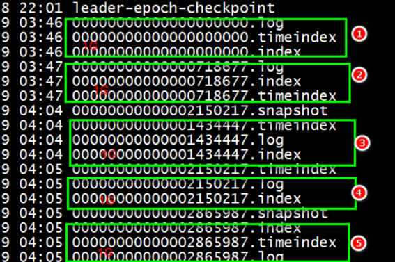

    

- **小结**

  - 掌握Kafka的存储结构设计及概念

    

## 知识点04：Kafka存储机制：写入过程

- **目标**：**掌握Kafka数据的写入过程**

- **实施**

  - **step1**：生产者生产每一条数据，将数据放入一个本地缓存中，等待批次构建，如果batch满了或者达到一定的时间，提交写入请求

    - 批量提交，不是每生产一条就写入一条

  - **step2**：生产者根据分区规则构建数据分区，获取对应的元数据，将请求提交给leader副本所在的Broker

    - 问题：生产者怎么知道这个数据的分区所在的Leader在哪台机器的？

    - 解决

      - 生产者会请求Kafka服务端【9092】，Kafka的服务端会返回元数据存储的地址【ZK地址】
      - 生产者会根据ZK地址到ZK中获取这个分区的元数据，找到这个分区的Leader副本所在的Broker节点

    - ZK中的元数据

      - Kafka的Controller选举

        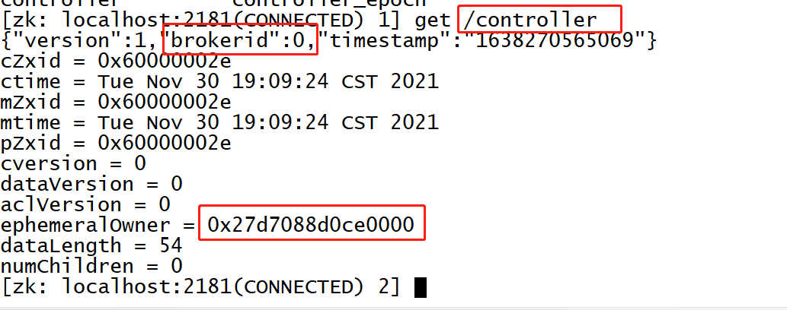

      - 分区元数据

        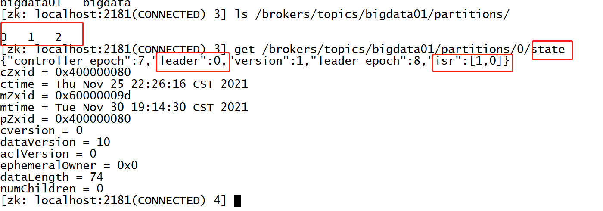

    - 上次课同学出现的问题

      - 现象：生产者运行，会卡住，最终会失败，但是数据没有写进去
      - 问题：服务端连不上
        - Broker：写的是IP地址，是没有问题，消费者可以消费到数据
        - Windows不能识别Broker返回的zk地址
      - 原因：Windows上的主机名解析不对
        - C:\Windows\System32\drivers\etc\hosts
        - 映射要与Linux映射保持一致

  - **step3**：先写入这台Broker的PageCache【操作系统】中，Kafka也用了内存机制来实现数据的快速的读写

    - Kafka使用日志方式记录数据，注意并不是直接写磁盘
    - 所有磁盘文件在生成时操作系统的内存中都必须构建对应的映射
    - 操作系统级别的内存：PageCache
    - Kafka没有选用JVM内存
      - JVM的缺点明显：内存占用比较高，GC比较恶心
      - PageCache：操作系统级别，这个内存除非机器重启，不然数据会一直存在PageCache

  - **step4**：操作系统的后台的自动将页缓存中的数据SYNC同步到磁盘文件中：最新的Segment的.log中

    - 同步条件
    - 空间：Dirty Page所占内存比例达到/proc/sys/vm/dirty_background_ratio的比例，默认10%
    - 时间：数据在Page Cache中已经达到/proc/sys/vm/dirty_expire_centisecs配置时间，默认30s

  - **step5**：其他的Follower到Leader中同步数据

- **小结**

  - 掌握Kafka数据的写入过程

    


## 知识点05：Kafka存储机制：Segment

- **目标**：**掌握Segment的设计及命名规则**

- **路径**

  - 为什么要设计Segment？
  - Segment是如何实现的？

- **实施**

  - **设计思想**

    - **加快查询效率**
      - 通过将分区的数据根据Offset划分多个比较小的Segment文件
      - 在检索数据时，可以根据Offset快速定位数据所在的Segment
      - 加载单个Segment文件查询数据，可以提高查询效率
    - **减少删除数据IO**
      - 删除数据时，**Kafka可以Segment为单位**删除某个Segment的数据
      - 避免一条一条删除，增加IO负载，性能较差

  - **Segment的基本实现**

    - .log：存储真正的数据
    - .index/.timeindex：存储对应的.log文件的索引

  - **Segment的划分规则**：满足任何一个条件都会划分segment

    - 按照时间周期生成

      ```properties
      #如果达到7天，重新生成一个新的Segment
      log.roll.hours = 168
      ```

    - 按照文件大小生成

      ```properties
      #如果一个Segment存储达到1G，就构建一个新的Segment
      log.segment.bytes = 1073741824  
      ```

  - **Segment文件的命名规则**

    - 以当前文件存储的最小offset来命名的

      ```
      00000000000000000000.log			offset : 0 ~ 2344
      00000000000000000000.index
      
      00000000000000002345.log			offset : 2345 ~ 6788
      00000000000000002345.index
      
      00000000000000006789.log			offset : 6789 ~
      00000000000000006789.index
      ```

    - 加快查询效率

    - 查找：offset = 3500

- **小结**

  - 掌握Segment的设计及命名规则


## 知识点06：Kafka存储机制：读取过程

- **目标**：**掌握Kafka数据的读取过程**
- **路径**
  - Kafka数据是如何被读取的？
  - 为什么Kafka读取数据也很快？
- **实施**
  - **step1**：消费者根据**Topic、Partition、Offset**提交给Kafka请求读取数据
  - **step2**：Kafka根据元数据信息，找到对应的这个分区对应的Leader副本节点
  - **step3**：请求Leader副本所在的Broker，**先读PageCache**，通过**零拷贝机制**【Zero Copy】读取PageCache
    - 实现0磁盘读写
    - 直接将内存数据发送到网络端口，实现传输
  - **step4**：如果PageCache中没有，读取Segment文件段，先根据offset找到要读取的那个Segment
    - 先根据offset和segment文件段名称定位这个offset在哪个segment文件段中
  - **step5**：将.log文件对应的.index文件加载到内存中，根据.index中索引的信息找到Offset在.log文件中的最近位置
    - 最近位置：**index中记录的稀疏索引**【不是每一条数据都有索引】
  - **step6**：读取.log，根据索引读取对应Offset的数据
- **小结**
  - 掌握Kafka数据的读取过程


## 知识点07：Kafka存储机制：index索引设计

- **目标**：**掌握Kafka的Segment中index的索引设计**

- **路径**

  - .index文件中的索引的内容是什么？
  - 查询数据时如何根据索引找到对应offset的数据？

- **实施**

  - **索引类型**

    - 全量索引：每一条数据，都对应一条索引

      - index：201条

        ```
        0			0
        1			101
        2			202
        ```

        

      - .log：201条数据

        ```
        0			key1			value1
        1			key2			value2
        ……
        200			key201			value201
        ```

        

    - **稀疏索引**：部分数据有索引，有一部分数据是没有索引的

      - index：10条

        ```
        0			0
        2			202
        9			1010
        ……
        ```

      - log:201条

        ```
        0			key1			value1
        1			key2			value2
        ……
        200			key201			value201
        ```

      - 优点：减少了索引存储的数据量加快索引的索引的检索效率

      - 什么时候生成一条索引？

        ```properties
        #.log文件每增加4096字节，在.index中增加一条索引
        log.index.interval.bytes=4096
        ```

      - **Kafka中选择使用了稀疏索引**

  - **索引内容**

    - 两列

      - 第一列：这条数据在这个文件中的位置

      - 第二列：这条数据在文件中的物理偏移量

        ```
        是这个文件中的第几条,数据在这个文件中的物理位置
        1,0				--表示这个文件中的第一条，在文件中的位置是第0个字节开始
        3,497			--表示这个文件中的第三条，在文件中的位置是第497个字节开始
        ```

        

    

    - 这个文件中的第1条数据是这个分区中的第368770条数据，offset = 368769

  - **检索数据流程**

    - step1：先根据offset计算这条offset是这个文件中的第几条
    - step2：读取.index索引，根据二分检索，从索引中找到离这条数据最近偏小的位置
    - step3：读取.log文件从最近位置读取到要查找的数据

  - 举例

    - 需求：查找offset = 368772

    - step1：计算是文件中的第几条

      ```
      368772 - 368769 = 3 + 1 = 4，是这个文件中的第四条数据
      ```

    - step2：读取.index索引，找到最近位置

      ```
      3,497
      ```

    - step3：读取.log，从497位置向后读取一条数据，得到offset = 368772的数据

  - **问题：为什么不直接将offset作为索引的第一列？**

    - 如果直接使用offset作为索引第一列导致索引过大

- **小结**

  - 掌握Kafka的Segment中index的索引设计


## 知识点08：Kafka数据清理及压缩

- **目标**：**了解Kafka中数据清理的规则**

- **路径**

  - Kafka用于实现实时消息队列的数据缓存，不需要永久性的存储数据，如何将过期数据进行清理？

- **实施**

  - **属性配置**

    ```properties
    #开启清理
    log.cleaner.enable = true
    #清理规则
    log.cleanup.policy = delete | compact
    ```

  - **清理规则：delete**

    - **基于存活时间规则：最常用的方式**

      ```properties
      log.retention.ms
      log.retention.minutes
      log.retention.hours=168/7天
      ```

    - **基于文件大小规则**

      ```properties
      #删除文件阈值，如果整个数据文件大小，超过阈值的一个segment大小，将会删除最老的segment,-1表示不使用这种规则
      log.retention.bytes = -1
      ```

    - **基于offset消费规则**

      - 功能：将明确已经消费的offset的数据删除

      - 如何判断已经消费到什么位置

        - step1：编写一个文件offset.json

          ```json
          {
            "partitions":[
               {"topic": "bigdata", "partition": 0,"offset": 2000},
               {"topic": "bigdata", "partition": 1,"offset": 2000}
             ],
             "version":1
          }
          ```

        - step2：指定标记这个位置

          ```shell
          kafka-delete-records.sh --bootstrap-server node1:9092,node2:9092,node3:9092 --offset-json-file offset.json 
          ```

  - **压缩规则：compact**

    - 功能：将重复的更新数据的老版本删除，保留新版本，要求每条数据必须要有Key，根据Key来判断是否重复

    

      

- **小结**

  - 了解Kafka中数据清理的规则


## 知识点09：Kafka分区副本概念：AR、ISR、OSR

- **目标**：**了解分区副本机制，掌握分区副本中的特殊概念**

- **路径**

  - Kafka中的分区数据如何保证数据安全？
  - 什么是AR、ISR、OSR？

- **实施**

  - **分区副本机制**：每个kafka中分区都可以构建多个副本，相同分区的副本存储在不同的节点上

    - 为了保证安全和写的性能：划分了副本角色
    - leader副本：对外提供读写数据
    - follower副本：与Leader同步数据，如果leader故障，选举一个新的leader
    - 选举实现：Kafka主节点Controller实现

  - **AR：All - Replicas**

    - 所有副本：指的是一个分区在所有节点上的副本

      ```
      Partition: 0   Replicas: 1,0 
      ```

  - **ISR：In - Sync - Replicas**

    - 可用副本：所有正在与Leader同步的Follower副本

      ```
      Partition: 0    Leader: 1       Replicas: 1,0,2   Isr: 1,0
      ```

    - 列表中：按照优先级排列【Controller根据副本同步状态以及Broker健康状态】，越靠前越会成为leader

    - 如果leader故障，是从ISR列表中选择新的leader

    - 如果生产者写入数据：ack=all，写入所有ISR列表中的副本，就返回ack

  - **OSR：Out - Sync  - Replicas**

    - 不可用副本：与Leader副本的同步差距很大，成为一个OSR列表的不可用副本

    - 原因：网路故障等外部环境因素，某个副本与Leader副本很久没有同步

    - 判断是否是一个OSR副本？

      - 0.9之前：时间和数据差异

        ```
        replica.lag.time.max.ms = 10000   可用副本的同步超时时间
        replica.lag.max.messages = 4000   可用副本的同步记录差，该参数在0.9以后被删除
        ```

      - 0.9以后：只按照时间来判断

        ```
        replica.lag.time.max.ms = 10000   可用副本的同步超时时间
        ```

    - 写入、Leader选举：都只从ISR列表中选取

- **小结**

  - 了解分区副本机制，掌握分区副本中的特殊概念

  

## 知识点10：Kafka数据同步概念：HW、LEO

- **目标**：**了解Kafka副本同步过程及同步中的概念**

- **路径**

  - 什么是HW、LEO？
  - Follower副本如何与Leader进行同步的？

- **实施**

  - 什么是HW、LEO？

    - 分区：3个副本

      - Leader：0 1 2 3 4 5 6 7 8

        - LEO：9
        - HW：7

      - Follower1: 0  1 2  3 4 5 6 7 8 

        - LEO：9

      - Follower2：0  1  2  3  4  5 6 7 8

        - LEO = 9

    - 当前这个分区的HW = 6，**消费者只能消费到offset为6前面的位置**

      - LW：low_watermark：最低消费的offset
      - HW：high_watermark：最高消费的offset，当前分区的每个副本的最小LEO

    - LEO：Log End Offset：当前分区最新的offset位置+1，即将写入的下一个offset的位置

    - LSO：Log StartOffset：当前分区最老的offset位置，正常都为0

      

    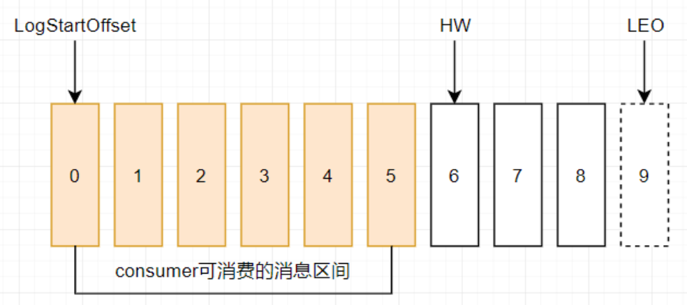

    

    - HW：当前这个分区所有副本同步的最低位置+1，**消费者能消费到的最大位置**
    - LEO：当前每个副本已经写入数据的最新位置 + 1
      - 副本最小的LEO = HW

  - **数据写入Leader及同步过程**

    - step1:数据写入分区的Leader副本

      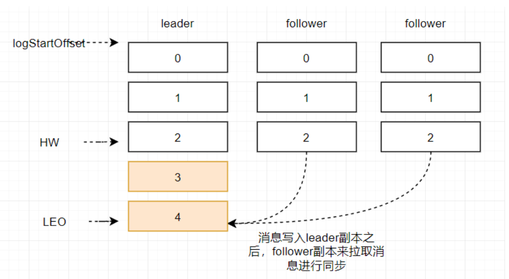

      - leader：LEO = 5 
      - follower1：LEO = 3
      - follower2：LEO = 3
      - |
      - HW = 3

    - step2：Follower发送同步请求到Leader副本中同步数据，然后批量同步数据

      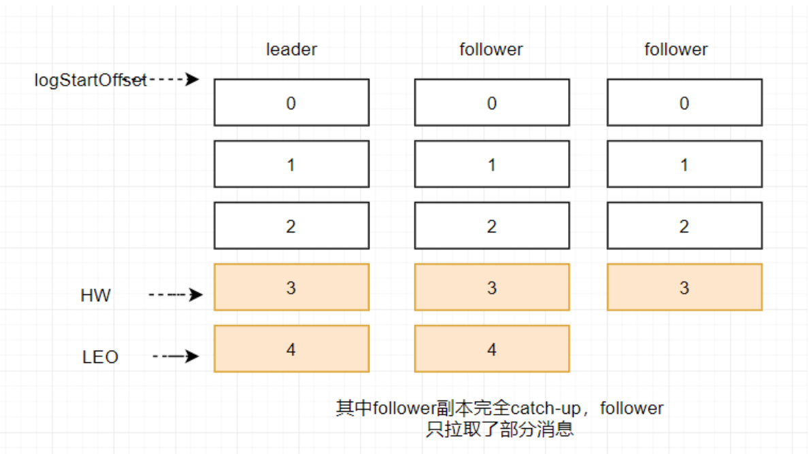

      - leader：LEO = 5 
      - follower1：LEO = 5
      - follower2：LEO = 4
      - |
      - HW = 4

- **小结**

  - HW：所有副本都同步的位置+1，消费者可以消费到的位置
  - LEO：leader当前最新的位置+1


## 知识点11：Kafka分区副本Leader选举

- **目标**：**掌握Kafka的分区副本的Leader选举机制，实现Leader的故障选举测试**

- **路径**

  - 一个分区的Leader副本和Follower副本由谁负责选举？
  - 如何实现Leader负载均衡分配？

- **实施**

  - **Controller选举**

    - Kafka主从节点选举
    - 由ZK来辅助实现：通过抢占临时节点来实现的

  - **Leader的选举**：分区多个副本角色的选举

    - **Controler**根据所有节点的负载均衡进行选举每个分区的Leader

  - 指定Leader负载均衡分配

    - 查看

      ```
      kafka-topics.sh  --describe --topic bigdata01 --zookeeper node1:2181,node2:2181,node3:2181 
      ```

    - 重新分配leader

      ```
      kafka-leader-election.sh --bootstrap-server node1:9092 --topic bigdata01 --partition=0 --election-type preferred
      ```

      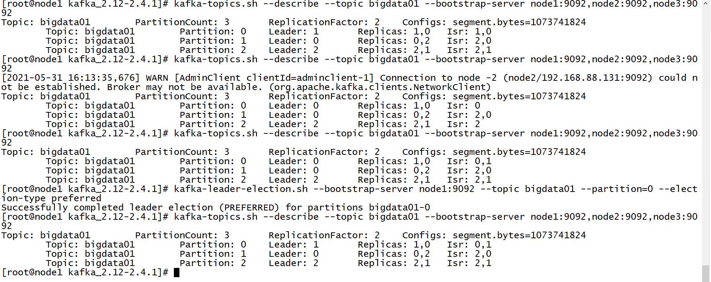

      

- **小结**

  - Kafka中Controller的选举由ZK辅助实现

  - Kafka中分区副本的选举：由Controller来实现

    

## 知识点12：消息队列的一次性语义

- **目标**：**了解消息队列的三种一次性语义**
- **路径**
  - 什么是一次性语义？
- **实施**
  - **at-most-once：至多一次**
    - 会出现数据丢失的问题
  - **at-least-once：至少一次**
    - 会出现数据重复的问题
  - **exactly-once：有且仅有一次**
    - 只消费处理成功一次
    - 所有消息队列的目标
- **小结**
  - Kafka从理论上可以实现Exactly Once
  - 大多数的消息队列一般不能满足Exactly Once就满足at-least-once


## 知识点13：Kafka保证生产不丢失

- **目标**：**掌握Kafka的生产者如何保证生产数据不丢失的机制原理**

- **路径**

  - Kafka如何保证生产者生产的数据不丢失？

- **实施**

  - **ACK + 重试机制**

    - 生产者生产数据写入kafka，等待kafka返回ack确认，收到ack，生产者发送下一条

  - **选项**

    - **0**：不等待ack，直接发送下一条
      - 优点：快
      - 缺点：数据易丢失
    - **1**：生产者将数据写入Kafka，Kafka等待这个分区Leader副本，返回ack，发送下一条
      - 优点：性能和安全做了中和的选项
      - 缺点：依旧存在一定概率的数据丢失的情况
    - **all**：生产者将数据写入Kafka，Kafka等待这个分区所有ISR副本同步成功，返回ack，发送下一条
      - 优点：安全
      - 缺点：性能比较差
      - 问题：如果ISR中只有leader一个，leader写入成功，直接返回，leader故障数据丢失怎么办？
      - 解决：搭配min.insync.replicas来使用
        - min.insync.replicas = 2：表示最少要有几个ISR的副本

  - **重试机制**

    ```
    retries = 3 发送失败的重试次数
    request.timeout.ms：等待返回ack超时时间
    ```

- **小结**

  - 掌握Kafka的生产者如何保证生产数据不丢失的机制原理

  

## 知识点14：Kafka保证生产不重复

- **目标**：**掌握Kafka如何保证生产者生产数据不重复的机制原理**

- **路径**

  - Kafka如何保证生产者生产的数据不重复？
  - 什么是幂等性机制？

- **实施**

  - **数据重复的情况**

    - step1：生产发送一条数据A给kafka
    - step2：Kafka存储数据A，返回Ack给生产者
    - step3：如果ack丢失，生产者没有收到ack，超时，生产者认为数据丢失没有写入Kafka
    - step4：生产者基于重试机制重新发送这条数据A，Kafka写入数据A，返回Ack
    - step5：生产者收到ack，发送下一条B
    - 问题：A在Kafka中写入两次，产生数据重复的问题

  - **Kafka的解决方案**

    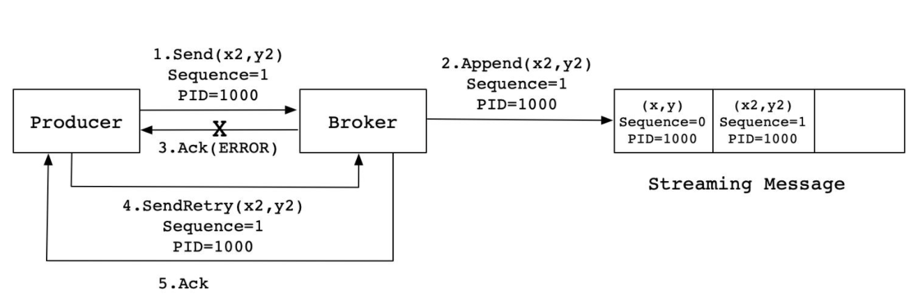

    

    - 实现：**在每条数据中增加一个数据id，下一条数据会比上一条数据id多1，Kafka会根据id进行判断是否写入过了**
      - 如果没有写入：写入kafka
      - 如果已经写入：直接返回ack

  - ==**幂等性机制**==

    ```
    f(x) = f(f(x))
    ```

    - **一个操作被执行多次，结果是一致的**

- **小结**

  - Kafka通过幂等性机制在数据中增加数据id，每条数据的数据id都不一致
  - Kafka会判断每次要写入的id是否比上一次的id多1，如果多1，就写入，不多1，就直接返回ack


## 知识点15：Kafka保证消费一次性语义

- **目标**：**掌握Kafka如何保证消费者消费数据不丢失不重复**

- **路径**

  - Kafka如何保证消费者消费数据不丢失不重复？

- **实施**

  - **规则**
    - 消费者是根据offset来持续消费，只要**保证任何场景下消费者都能知道上一次的Offset**即可
  - 需要：将**offset存储在一种可靠外部存储中，手动管理offset**
  - 实现
    - step1：第一次消费根据属性进行消费
    - step2：消费分区数据，处理分区数据
    - step3：处理成功：将处理成功的分区的Offset进行额外的存储
      - Kafka：默认存储__consumer_offsets
      - 外部：MySQL、Redis、Zookeeper
    - step4：如果消费者故障，可以从外部存储读取上一次消费的offset向Kafka进行请求

- **小结**

  - 掌握Kafka如何保证消费者消费数据不丢失不重复


## 知识点16：Kafka集群常用配置

- **目标**：**了解Kafka集群、生产者、消费者的常用属性配置**

- **路径**

  - 有哪些常用的集群配置？
  - 有哪些常用的生产者配置？
  - 有哪些常用的消费者配置？

- **实施**

  - **集群配置：server.properties**

    | 属性                            | 值                      | 含义                                                         |
    | :------------------------------ | ----------------------- | :----------------------------------------------------------- |
    | broker.id                       | int类型                 | Kafka服务端的唯一id，用于注册zookeeper，一般一台机器一个     |
    | host.name                       | hostname                | 绑定该broker对应的机器地址                                   |
    | port                            | 端口                    | Kafka服务端端口：9092                                        |
    | log.dirs                        | 目录                    | kafka存放数据的路径                                          |
    | zookeeper.connect               | hostname:2181/kafkadata | zookeeper的地址                                              |
    | zookeeper.session.timeout.ms    | 6000                    | zookeeper会话超时时间                                        |
    | zookeeper.connection.timeout.ms | 6000                    | zookeeper客户端连接超时时间                                  |
    | num.partitions                  | 1                       | 分区的个数                                                   |
    | default.replication.factor      | 1                       | 分区的副本数                                                 |
    | log.segment.bytes               | 1073741824              | 单个log文件的大小，默认1G生成一个                            |
    | log.index.interval.bytes        | 4096                    | log文件每隔多大生成一条index                                 |
    | log.roll.hours                  | 168                     | 单个log文件生成的时间规则，默认7天一个log                    |
    | log.cleaner.enable              | true                    | 开启日志清理                                                 |
    | log.cleanup.policy              | delete，compact         | 默认为delete，删除过期数据，compact为合并数据                |
    | log.retention.minutes           | 分钟值                  | segment生成多少分钟后删除                                    |
    | log.retention.hours             | 小时值                  | segment生成多少小时后删除【168】，7天                        |
    | log.retention.ms                | 毫秒值                  | segment生成多少毫秒后删除                                    |
    | log.retention.bytes             | -1                      | 删除文件阈值，如果整个数据文件大小，超过阈值的一个segment大小，将会删除最老的segment，直到小于阈值 |
    | log.retention.check.interval.ms | 毫秒值【5分钟】         | 多长时间检查一次是否有数据要标记删除                         |
    | log.cleaner.delete.retention.ms | 毫秒值                  | segment标记删除后多长时间删除                                |
    | log.cleaner.backoff.ms          | 毫秒值                  | 多长时间检查一次是否有数据要删除                             |
    | log.flush.interval.messages     | Long.MaxValue           | 消息的条数达到阈值，将触发flush缓存到磁盘                    |
    | log.flush.interval.ms           | Long.MaxValue           | 隔多长时间将缓存数据写入磁盘                                 |
    | auto.create.topics.enable       | false                   | 是否允许自动创建topic，不建议开启                            |
    | delete.topic.enable             | true                    | 允许删除topic                                                |
    | replica.lag.time.max.ms         | 10000                   | 可用副本的同步超时时间                                       |
    | unclean.leader.election.enable  | true                    | 允许不在ISR中的副本成为leader                                |
    | num.network.threads             | 3                       | 接受客户端请求的线程数                                       |
    | num.io.threads                  | 8                       | 处理读写硬盘的IO的线程数                                     |
    | background.threads              | 4                       | 后台处理的线程数，例如清理文件等                             |

- **生产配置：producer.properties**

  | 属性                | 值            | 含义                                    |
  | ------------------- | ------------- | --------------------------------------- |
  | bootstrap.servers   | hostname:9092 | KafkaServer端地址                       |
  | poducer.type        | sync \| async | 同步或者异步写入磁盘                    |
  | min.insync.replicas | 3             | 最小ISR个数                             |
  | buffer.memory       | 33554432      | 配置生产者本地发送数据的缓存大小        |
  | compression.type    | none          | 配置数据压缩，可配置snappy              |
  | partitioner.class   | Partition     | 指定分区的类                            |
  | acks                | 1             | 指定写入数据的保障方式                  |
  | request.timeout.ms  | 10000         | 等待ack确认的时间，超时发送失败         |
  | retries             | 3             | 发送失败的重试次数                      |
  | batch.size          | 16384         | 每个批次批量发送的大小                  |
  | linger.ms           | 5000          | 等待批次的发送间隔时间                  |
  | metadata.max.age.ms | 300000        | 更新缓存的元数据【topic、分区leader等】 |

  - **消费配置：consumer.properties**

  | 属性                          | 值            | 含义                                    |
  | ----------------------------- | ------------- | --------------------------------------- |
  | bootstrap.servers             | hostname:9092 | 指定Kafka的server地址                   |
  | group.id                      | id            | 消费者组的 名称                         |
  | consumer.id                   | 自动分配      | 消费者id                                |
  | auto.offset.reset             | latest        | 新的消费者从哪里读取数据latest,earliest |
  | auto.commit.enable            | true          | 是否自动commit当前的offset              |
  | auto.commit.interval.ms       | 1000          | 自动提交的时间间隔                      |
  | partition.assignment.strategy | rangeassigner | 指定消费者分配策略                      |
  | max.poll.records              | 500           | 单次调用poll方法能够返回的记录数量      |
  | session.timeout.ms            | 10000         | 消费者会话超时时间                      |

- **小结**

  - 常用属性了解即可


## 知识点17：可视化工具Kafka Eagle部署及使用

- **目标**：**了解Kafka Eagle的功能、实现Kafka Eagle的安装部署、使用Eagle监控Kafka集群**

- **路径**

  - Kafka Eagle是什么？
  - 如何安装部署Kafka Eagle？
  - Kafka Eagle如何使用？

- **实施**

  - Kafka Eagle的功能

    - 用于集成Kafka，实现Kafka集群可视化以及监控报表平台

  - Kafka Eagle的部署启动

    - 下载解压：以第三台机器为例

      ```shell
      cd /export/software/
      rz
      tar -zxf kafka-eagle-web-1.4.6-bin.tar.gz -C /export/server/
      ```

    - 修改配置

      * 准备数据库：存储eagle的元数据，在Mysql中创建一个数据库

        ```sql
        create database eagle;
        ```

      * 修改配置文件：

        ```shell
        cd /export/server/kafka-eagle-web-1.4.6/
        vim  conf/system-config.properties
        ```

        ```properties
        #配置zookeeper集群的名称
        kafka.eagle.zk.cluster.alias=cluster1
        #配置zookeeper集群的地址
        cluster1.zk.list=node1:2181,node2:2181,node3:2181
        #31行左右配置开启统计指标
        kafka.eagle.metrics.charts=true
        #配置连接MySQL的参数，并注释自带的sqlite数据库
        kafka.eagle.driver=com.mysql.jdbc.Driver
        kafka.eagle.url=jdbc:mysql://node1:3306/eagle
        kafka.eagle.username=root
        kafka.eagle.password=hadoop
        ```

        

    - 配置环境变量

      ```shell
      vim /etc/profile
      
      #KE_HOME
      export KE_HOME=/export/server/kafka-eagle-web-1.4.6
      export PATH=$PATH:$KE_HOME/bin
      source /etc/profile
      ```

    - 添加执行权限

      ```shell
      cd /export/server/kafka-eagle-web-1.4.6
      chmod u+x bin/ke.sh
      ```

    - 启动服务

      ```
      ke.sh start
      ```

    - 登陆

    ```
    网页：node3:8048/ke
      用户名：admin
      密码：123456
    ```

    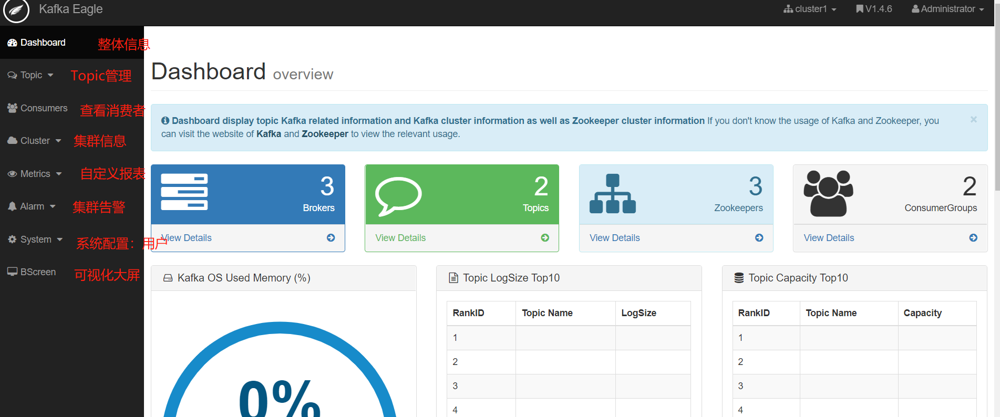

  - Kafka Eagle使用

    - 监控Kafka集群

      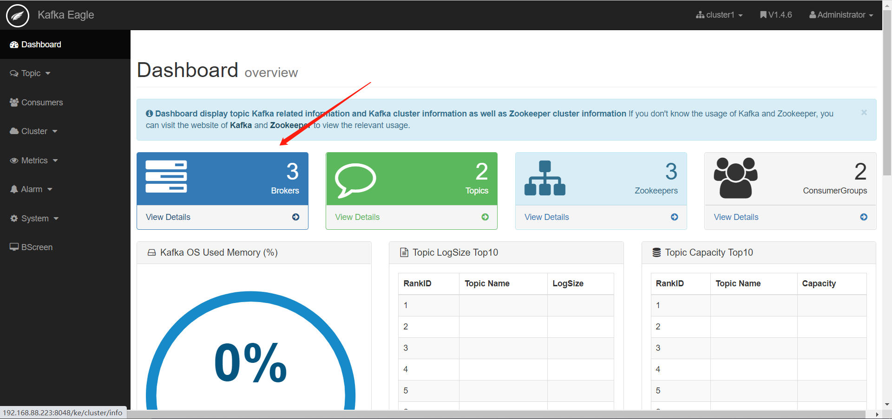

    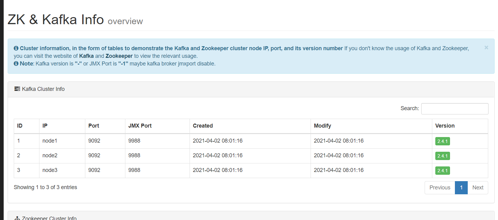

  - 监控Zookeeper集群

    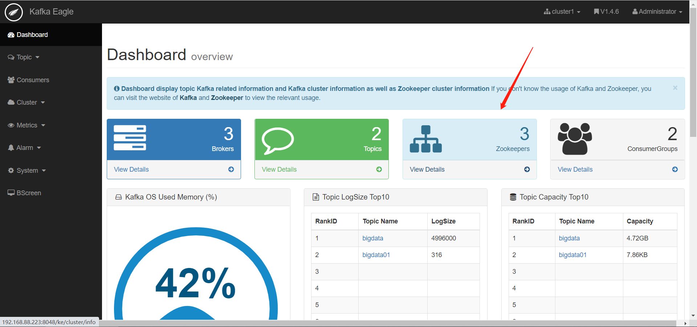

    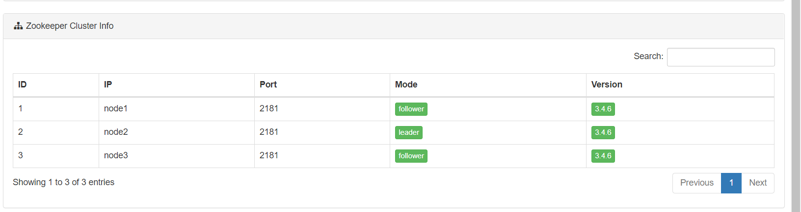

    

  - 监控Topic

    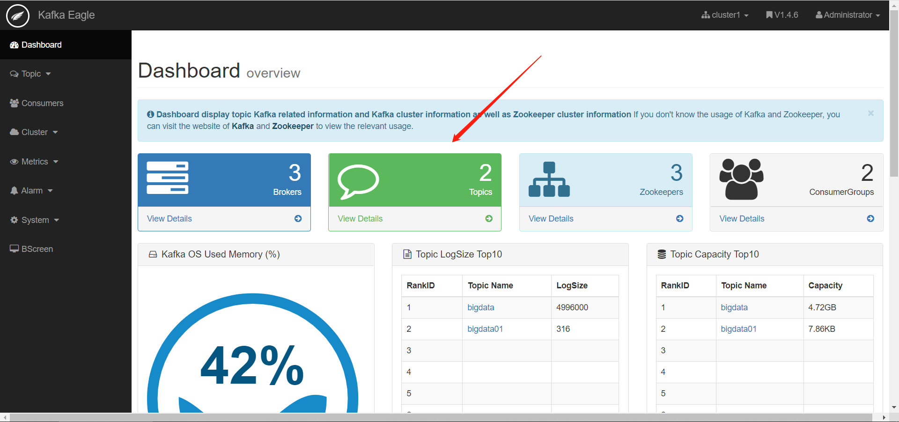

    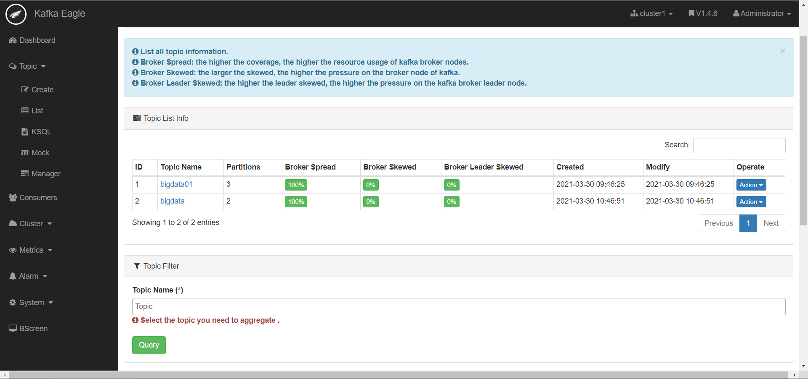

    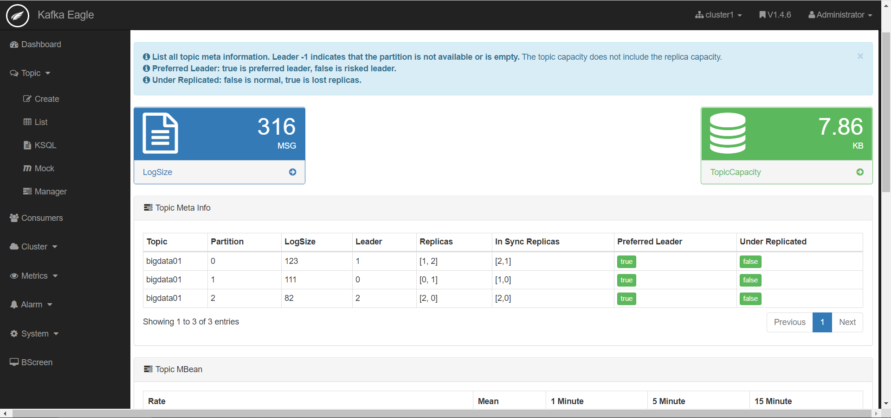

    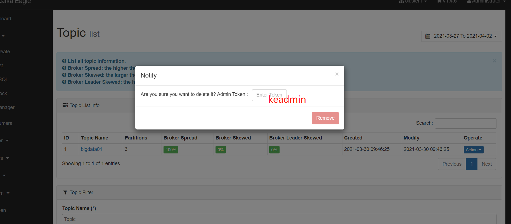

    

  - **查看数据积压**

    - 现象：消费跟不上生产速度，导致处理的延迟

    - **原因**

      - 消费者组的并发能力不够
      - 消费者处理失败

      - 网络故障，导致数据传输较慢

    - 解决

      - 提高消费者组中消费者的并行度

      - 分析处理失败的原因

      - 找到网络故障的原因

      - 查看监控

        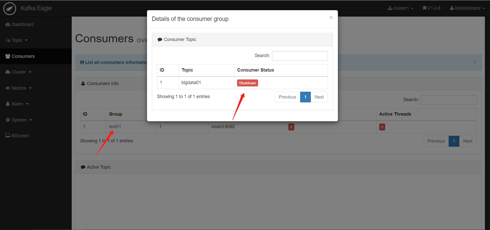

        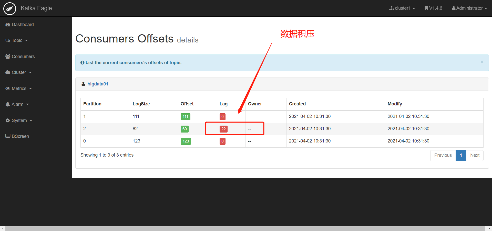

      - 报表

        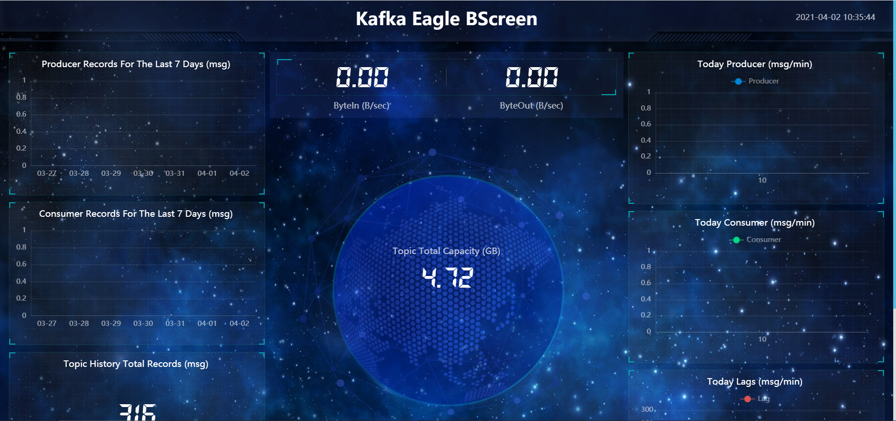

- **小结**

  - Kafka中最常用的监控工具

  - 用于查看集群信息、管理集群、监控集群

    

## 知识点18：Kafka数据限流

- **目标**：**了解Kafka的数据限流及使用场景**

- **路径**

  - 什么是数据限流？
  - 如何实现数据限流？

- **实施**

  - Kafka的实时性比较高，会出现以下现象

    - 生产的太快，消费速度跟不上
    - 生产的太慢，消费的速度太快了

  - 限流：限制生产和消费的速度

    - 限制生产

      ```shell
      bin/kafka-configs.sh --zookeeper node1:2181 --alter --add-config 'producer_byte_rate=1048576' --entity-type clients --entity-default
      ```

      - producer_byte_rate=1048576：限制每个批次生产多少字节

    - 限制消费

      ```shell
      bin/kafka-configs.sh --zookeeper node1:2181 --alter --add-config 'consumer_byte_rate=1048576' --entity-type clients --entity-default
      ```

      - consumer_byte_rate=1048576：限制每次消费的字节

    - 取消限制

      ```shell
      bin/kafka-configs.sh --zookeeper node1:2181 --alter --delete-config 'producer_byte_rate' --entity-type clients --entity-default
      
      bin/kafka-configs.sh --zookeeper node1:2181 --alter --delete-config 'consumer_byte_rate' --entity-type clients --entity-default
      ```

- **小结**

  - 了解有该功能即可


## Kafka其他面试题

- 为什么Kafka读写速度很快？

  - https://zhuanlan.zhihu.com/p/183808742?utm_source=wechat_timeline
  - 写
    - step1：先写内存
    - step2：同步磁盘：顺序写机制【速度可以媲美写内存】
  - 读
    - step1：先读内存，读内存使用了零拷贝机制
    - step2：基于索引顺序检索

- 什么是CAP理论，Kafka满足哪两个？

  - C：一致性，任何一台机器写入数据，其他节点也可以读取到
  - A：可用性，如果一个节点故障，其他节点可以正常提供数据服务
  - P：分区容错性，如果某个分区故障，这个分区的数据照样可用
  - Kafka满足CA，Kafka一个分区多个副本的数据可能是不一致，Leader故障，follower可能没有对应的数据

- Canal实时采集MySLQ，将MySLQ中实时的数据写入kafka的时候，消费端消费的更新日志在插入日志之前，就会因为数据缺失导致异常，怎么保证插入和更新的顺序？

  - 问题：同一条数据在短时间做了两个操作

    ```
    insert into value
    update 
    ```

  - Kafka

    - part0：insert
    - part1：update

  - 消费者去消费的时候，先消费到update，然后再消费到了insert

  - 根本原因：Kafka多个分区不能保证顺序，只能保证分区内部顺序

  - 解决

    - 方案一：只构建一个分区
    - 方案二：将数据库和表名作为key，然后按照Hash取余规则写入Kafka
      - 保证，同一个数据库中同一个表的操作写入同一个分区
    - 方案三：Flink基于事件时间来实现

- timeindex的功能是什么？

  - Kafka存储是提供了两种索引方式

    - index：offset位移索引
    - timeindex：时间索引

  - Kafka提供了两种条件消费数据的方式

    - 方式一：提供Topic、Partition、Offset

      - 默认方式

    - 方式二：提供Topic、Partition、time

      - 需要开启时间记录属性：message.timestamp.type = CreateTime | LogAppendTime

      - 代码中需要指定分区消费，以及指定每个分区消费的时间

        ```
        consumer.assign(分区);
        Map<分区，offset> = consumer.offsetsForTimes(<分区，time>)
        ```

  - 第二种方式的本质还是第一种方式：根据上一次消费的时间去获取对应时间范围内的offset，再消费offset

  - 如何知道上一次消费到当前时间的offset是哪些？

    - 检索timeindex文件

    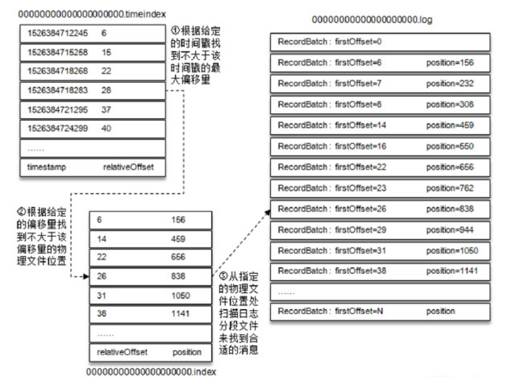

    