# Kafka-Tool 可视化工具

- 使用Kafka的小伙伴，有没有为无法直观地查看 Kafka 的 Topic 里的内容而发过愁呢？

- 下面推荐给大家一款带有[可视化]页面的Kafka工具：**Kafka Tool** （目前最新版本是 **2.0.4**）

 

## 1- Kafka Tool 工具下载

### 1-1 下载地址

http://www.kafkatool.com/download.html

 

### 1-2 下载界面

不同版本的Kafka对应不同版本的工具，个人使用的是0.11，所以下载的是最新的2.0.4版本


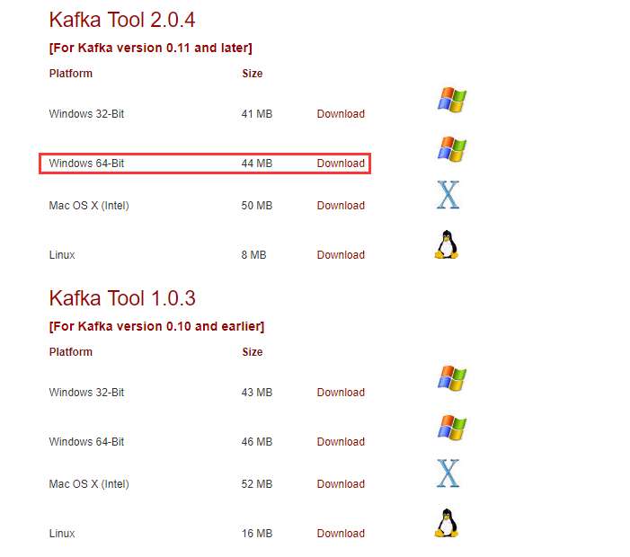

 

如果是Windows，直接点击exe文件，一键安装即可。

------

 

## 2- Kafka Tool 工具使用

### 2-1 Kafka 连接配置

#### 2-1-1 启动 Kafka Tool

在安装目录下，双击可执行文件 **kafkatool.exe**，启动 Kafka Tool


 

#### 2-1-2 配置 Kafka 连接信息

提示配置相应的连接信息


 

依次填写红框中的信息，点击“**Ping**” 和 “**Test**”测试连接情况；测试通过后，点击“Add”进行添加


 

**【注意】**需要在 C:\Windows\System32\drivers\etc 下的 **hosts** 文件中，添加入 kafka 的集群域名

例如，添加如下配置（此处需要根据实际情况配置，配置保存后，需要重启KafkaTools才能读取hosts文件中的内容）：

```properties
10.10.21.107 kafka1
10.10.21.108 kafka2
10.10.21.109 kafka3
```

 

### 2-2 查看 Kafka 数据

#### 2-2-1 查看 Kafka 数据

选择一个Topic --> Data，点击查询即可看到数据（但是Key和Message是二进制的，不能直观的看到具体的消息信息，需要设置展示格式）

Messages选择**Newest**，表示查看**最新**的Kafka数据；

结果列表中的每列，通过点击表头，可以按照升序或者降序排序（一般用在**时间字段**排序，方便查看最新数据）。

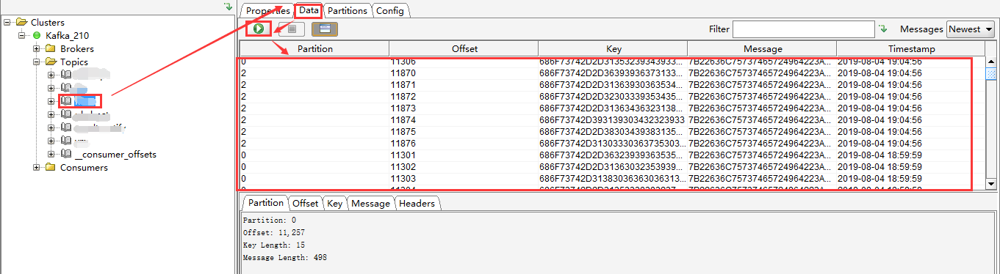

 

#### 2-2-2 设置 Kafka 数据展示格式

在Tools -->Settings --> Topics，将 Key 和 Message 均设置为String 保存。这样是全局设置，对所有 Topic 均生效。


 


 

如果只是想单独设置某个 Topic，可以选中某个 Topic，在 Properties --> Content Type 中，将显示格式设置为String，点击 Update --> Refresh 即可生效


 

设置后的数据列表如下


 

#### 2-2-3 查看具体某一条消息

选中某一个message，点击“Message”查看详情，默认是“Text”格式（如果想看到JSON格式，只需要设置下“View Data As”即可）

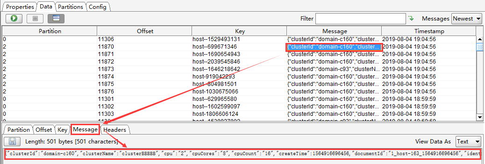

 

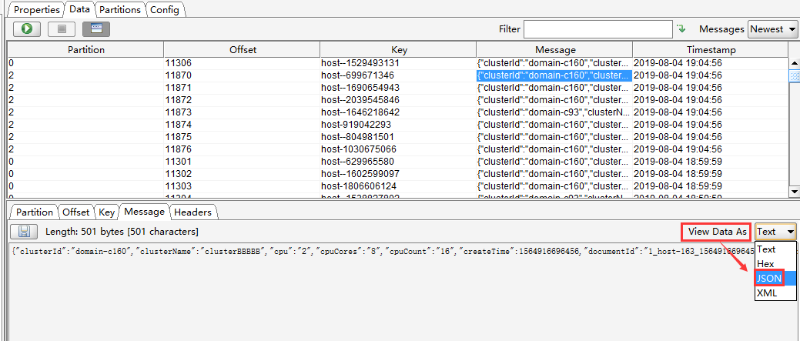

 

“View Data As”设置为 JSON 后，消息信息格式如下

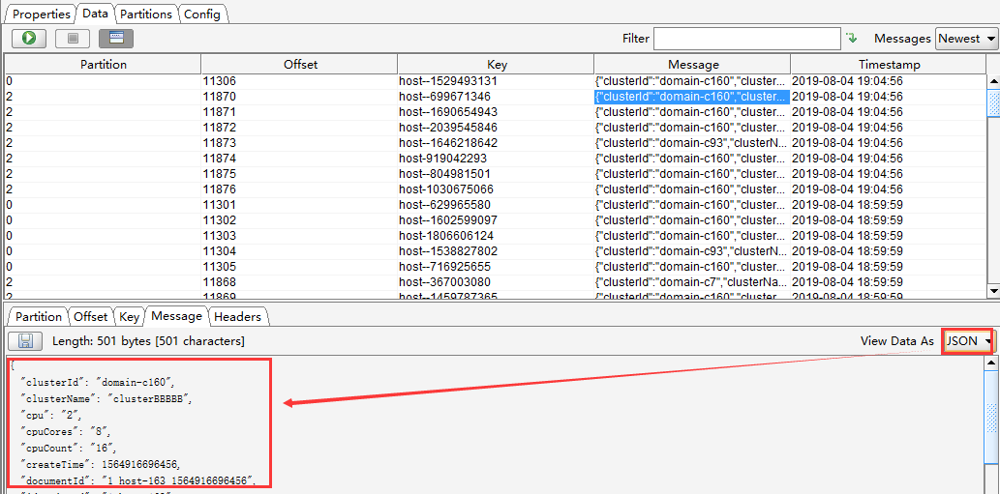

 

#### 2-2-4 过滤查询 Kafka 消息

可以按照Offset（偏移量），Key（消息key），Message（消息主体），Regex（正则表达式）进行单个或者组合查询

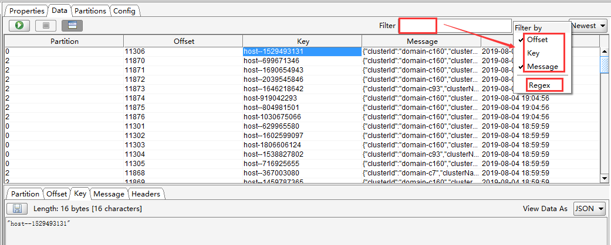

 

### 2-3 使用 Kafka Tool 创建 Topic

#### 2-3-1 创建 Topic

步骤如下：
1、鼠标右键点击 “Topics” 文件夹图标 --> 选择 “Create Topic”，或者点击“Topics”，单击右侧页面中的“+”，会弹出“Add Topic”页面；
2、填写需要创建的Topic名称，分区数和备份数，点击“Add”添加，即可创建 topic。

效果如下：


 


 


 

#### 2-3-2 查看创建的 Topic

创建的出来的 topic， 可以在 Topic 列表或者通过 Kafka topic 命令查看。
自测的截图如下：

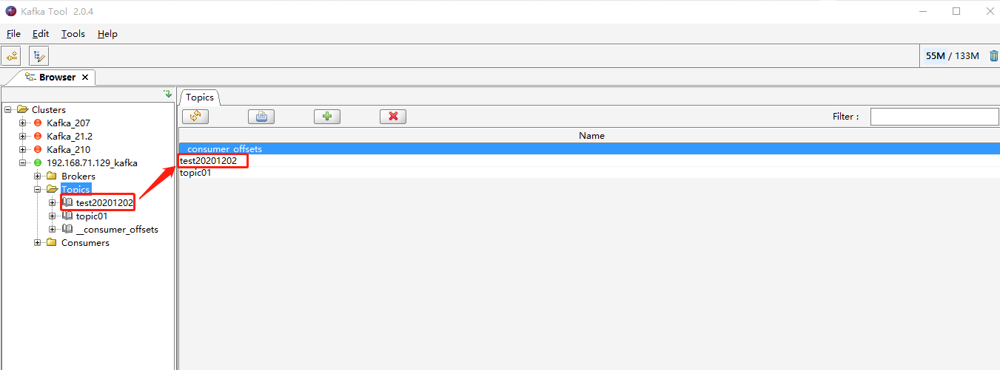

 

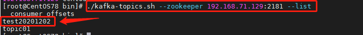

 

#### 2-3-3 删除 Topic 

如果因为失误导致创建的 topic 不是自己想要的，想进行删除，也可以通过 KafkaTool 进行界面化删除。

效果如下：


 

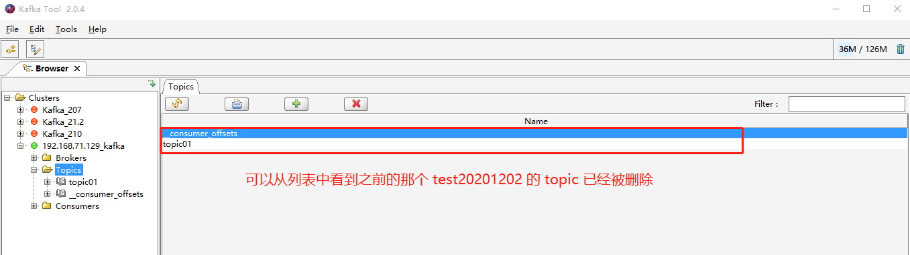

 


 

#### 2-3-4 补充说明

如果通过 Kafka Tool 创建 topic 失败，请确认如下两点：

**a）是否按照如下截图配置的Cluster Connection**

（本次举例是单台机器，如果实际是集群，需要把 bootstrap servers进行集群配置，如3台集群配置：192.168.71.129:9092,192.168.71.130:9092,192.168.71.131:9092）


 

**b）是否按照博客里的说明在hosts文件中配置了域名**


 

如果上述两点均已确认无误，依旧不能通过 Kafka Tool 正确创建出 topic。

请确认 Kafka 服务本身是否正常，是否可以通过 kafka topic 命令创建出来 topic。

 

 

### 2-4 使用 Kafka Tool 模拟发送 Messages

操作步骤如下：

- 点击“Topics” --> 选择一个 topic（如：topic01） --> 选择分区（如：Partition 0），点击右侧“Data”里的“+”，会弹出“Add Message”页面。
- 其中，Key 和 Message 均支持两种方式：From file 和 Enter Manually[Text]
  - **From file**：就是数据来源于文件，需要上传文件（个人建议上传txt格式文件）
  - **Enter Manually[Text]**：手动输入
  - 二者可以混合搭配使用，并且 Key 和 Message **二者必须有值**，否则会报错！！！

效果如下：


 

1）场景1：Key 和 Message 均选择手动输入


 

2）场景2：Key 和 Message 均选择来自文件


 

3）场景3：Key 和 Message 其中一个来自文件，一个来自手动输入

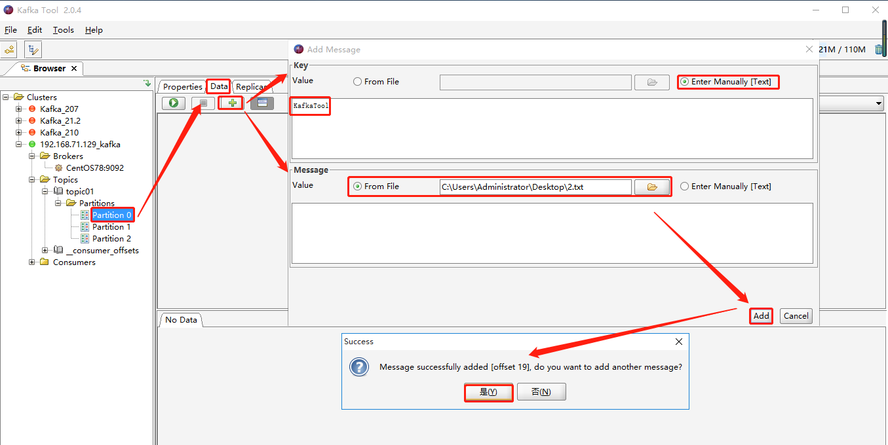

 

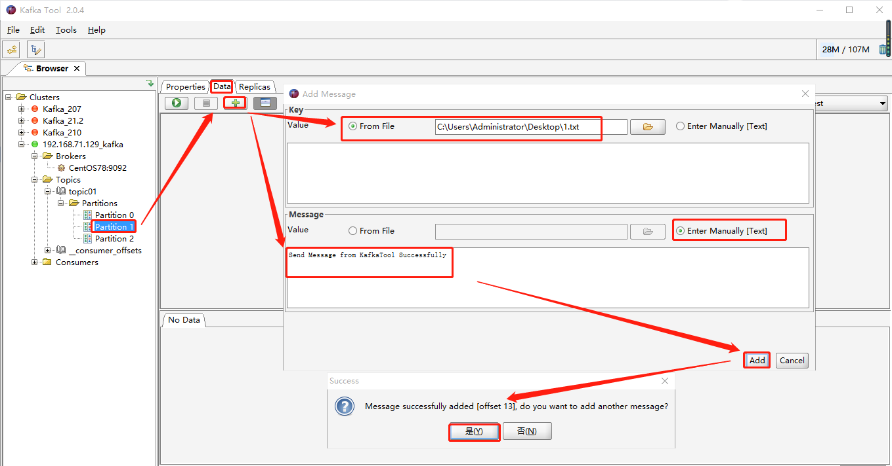

 

2.txt 文件中内容如下：


 

4）消费者消费到的模拟数据

截图如下：


消费命令如下：

```
./kafka-console-consumer.sh --bootstrap-server 192.168.71.129:9092 --topic topic01
```