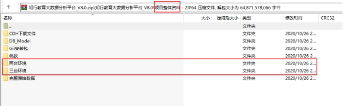
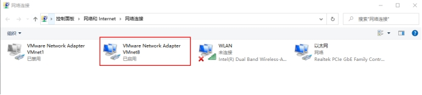

# 教育项目环境初始化

0: 电脑必须是联网状态

1) 解压项目虚拟环境: (三台或者二台)

要求:

32G内存及以上使用三台环境, 其余使用二台环境即可

解压到一个没有中文和空格的目录下

​	

解压到: 目录位置可以自由选择

 

l 2) 将三台虚拟机 挂载到 VMware上

 

如果双击后, 等待一会后, 依然在VMware中无法出现以下内容:

 

解决方案: 

  点击VMware的  x 符号 

 

重新双击即可

 

 

注意: 

第二台  和 第三台 都是一样的操作 成功界面如下:

 

l 3) 点击每一台虚拟机, 启动即可: 

注意: 如果弹出以下界面, ***\*一定一定一定要选择 我以移动此虚拟机\****

 

 

l 4) 查看每一台虚拟机的IP地址及其网关地址: 

Ip查看: ifconfig

三台机子ip地址:   hadoop01 : 192.168.52.150   hadoop02 : 192.168.52.151   hadoop03 : 192.168.52.152网关指定统一为: 192.168.52.1

 

 

 

 

​	查看网关: 

​		cd /etc/sysconfig/network-script/

​		vim ifcfg-ens33

​	

​	

​	

 

l 5) 修改VMware的虚拟网卡配置: 虚拟网络编辑器

 

 

l 6) 修改windows的VMware8的网卡信息: 

 

 

 

l 7) 使用**CRT** 或者 fineShell | xShell …. 连接虚拟机 

 

 

 

 

 

以此类推, 连接第二台和第三台

 

l 8) 修改CRT的各个窗口的编码 和字体 以及颜色背景

 

 

 

其余第二台和第三台都是一样的

l 9) 测试三台机子是否可以联网:

注意: 三台都需要测试  ,如果无法连接, 多测试几次

 

如果多次连接无效, 请检查 第 5步和第六步是否配置成功(完整检查, 不要相信自己)

l 10 修改windows的hosts文件:

地址; C:\Windows\System32\drivers\etc

192.168.52.150 hadoop01 hadoop01.itcast.cn192.168.52.151 hadoop02 hadoop02.itcast.cn192.168.52.152 hadoop03 hadoop03.itcast.cn

 

 

l 11) 通过浏览器连接即可

http://hadoop01:7180 | http://hadoop01.itcast.cn:7180

 

 

成功界面:

 

如果 yarn提示有红色叹号, 直接点击去, 选择下面的内容, 启动即可:

 

 

 

 

注意: 如果进入全部都是红色, 或者都是 ? 请将三台虚拟机重启等待 10~20分钟

重启命令: reboot  注意: 以后关闭, 不允许直接点× 关闭, 必须使用以下命令:shutdown -h now注意: 不允许挂起 以后中午不用的时候, 关闭三台虚拟机, 以免导致长时间不用, 内存出现问题

 