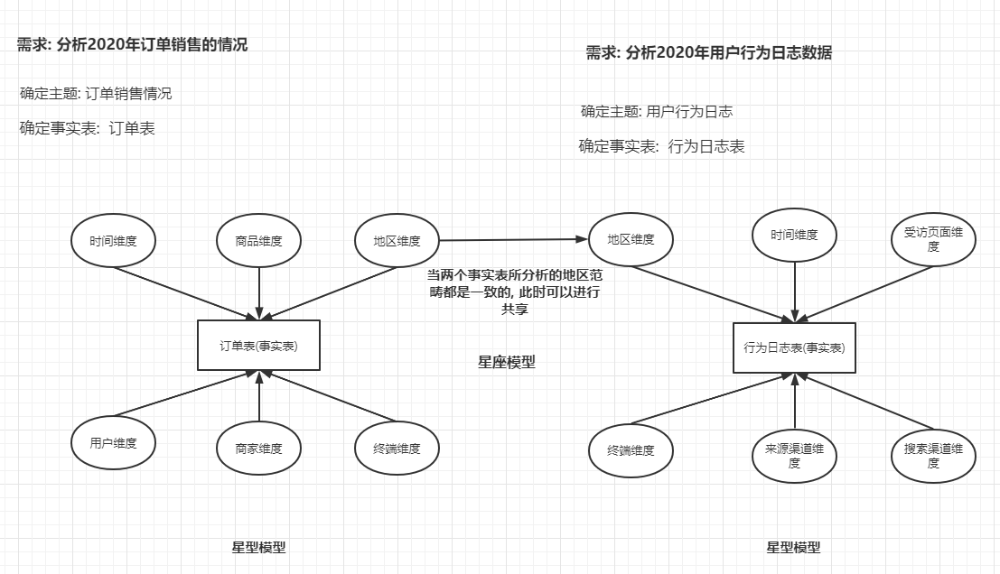

# 维度-指标概念分析

​		维度: 维度是事务的特征, 分析问题角度, 在面对一个分析的需求的时候, 可以站在不同的角度上进行分析, 这些角度其实就是维度

* 例如:  老板 提出一个要分析过去一年订单销售的情况

  * 计算维度: 地区维度, 时间维度, 商品维度, 用户维度, 商家的维度, 订单量在在100~500之间的省份.....

## 维度的分类

* 定性维度 : 地区 , 时间 ,商品 ....
  * SQL中表现一般都是 group by操作
* 定量维度 :  订单量在在100~500 ...
  * SQL中表现一般都是 where

## 维度的分层和分级

* 维度的分层和分级: 在确定了一个维度后, 此维度是依然可以进行细化分层分级的

  * 例如: 时间维度. 细化为有年  月 天小时....
  * 例如: 地区维度: 按照 省份, 市  县..

  

## 维度的上卷 和下钻

* 维度的上卷 和下钻:

  * 例如 以时间为例, 基础分析时间维度为 天

    * 如果需要将小时也分析出来, 此时可以认为 **下钻到小时**
    * 如果需要将 月和年也分析出来, 此时可以理解为**上卷到 月 和 年**

    ```
    需求: 分析过去一年每一天的订单销售总额, 并要求下钻到小时 和上卷到 月
    	时间维度: 
    		月 天 小时
    所以上述需求可以变为两个需求: 
    	1) 统计分析过去一年每一天每个小时的订单销售总额
    	2) 统计分析过去一年每一天的订单销售总额
    	3) 统计分析过去一年每个月份的订单销售总额
    ```


## 指标分类

* 指标: 指标是衡量事务发展的标准，也叫度量, 在根据维度分析后, 计算那些度量值

  * 常见的度量值: 
    * count  sum  max  min  avg  topn ....
  * 指标分类:
    * 绝对数值:  count  sum  max  min  avg  topn
    * 相对数值:  计算比率


```
相关的例子: 
	需求1:  分析过去一年中, 在北京地区, 男性用户, 年龄在20~40之间的, 消费额最高的用户是谁?
		维度:
			时间维度(过去一年)
			地区维度(北京地区)
			性别维度(男性)
			年龄维度(20~40之间)
			用户维度
		指标:  
			消费额
			
		SQL: 
			select sum(price) sum_order  from  订单  where 时间 = '2020年' and 地区 = '北京' and sex = '男性' and age between 20 and 40 group by  用户  order by sum_order desc limit 1 ; 
```


# 数仓建模

建模: 主要指的如何构建表, 一般在进行建模的时候, 都会有一个规范来规定这个建模方式

常见的建模规范主要两种:

* **三范式建模**:  
  * 适用于 关系型数据库, 或者业务库 (OLTP系统)
  * 例如: 三范式规定在建模过程中, 尽可能避免冗余的出现, 建议每个表一般都要有一个主键
* **维度建模**:
  * 适用于分析性数据库 (OLAP)
  * 例如: 可以允许出现有一定冗余, 每个表可以没有主键 (只要利于分析的建模 就没啥大的问题)


## 维度建模-事实表

什么是事实表?  

​      <span style="color:red;background:white;font-size:20px;font-family:楷体;">**要分析的主题是什么 , 事实表就是对应主题的表**</span>

事实表有那些特征呢?  <span style="color:red;background:white;font-size:20px;font-family:楷体;">**一般事实表都是由一坨主键(其他表)聚集组成的**</span>


事实表的三大分类:

​	事务事实表、周期快照事实表、累积快照事实表

### 事务事实表:  

* 事务事实表记录的事务层面的事实，保存的是最原子的数据，也称“原子事实表”或“交易事实表”

* 沟通中常说的事实表，大多指的是事务事实表。

  

### 周期快照事实表:

* 周期快照事实表以具有规律性的、可预见的时间间隔来记录事实，时间间隔如每天、每月、每年；
  * **按照月份构建快照表**，也就是把当前月份的结果单独形成一张表；
  * **按照年份构建快照表**，也是是吧当前年份的结果单独形成一张表；


### 累积快照事实表:


* **累积快照事实表**代表的是完全覆盖一个事务或产品的生命周期的时间跨度，它通常具有多个日期字段，用来记录整个生命周期中的关键时间点


## 维度建模-维度表

什么是维度表? 

​       <span style="color:red;background:white;font-size:20px;font-family:楷体;">**在分析事实表的时候, 可以需要结合其他表来进行分析, 而其他的表就是维度表**</span>

维度表的分类:

* <span style="color:red;background:white;font-size:20px;font-family:楷体;">**高基数维度数据 : 维度表中数据量一般比较庞大, 例如商品表, 用户表**</span>
* <span style="color:red;background:white;font-size:20px;font-family:楷体;">**低基数维度数据: 维度表中数据量一般比较小, 地区表, 日期表**</span>


## 维度建模-数据模型

### 星型模型

- **维度表与维度表之间没有关联；**

- 特点: <span style="color:red;background:white;font-size:20px;font-family:楷体;">**只有一个事实表, 也就是说只有一个分析的主题, 在事实表周围围绕了多个维度表, 维度表与维度表没有任何的关联**</span>
- 请问, 星型模型是数仓发展在什么期在最容易产生模型: 初期阶段

### 雪花模型

- **维度表与维度表之间 有 关联**；

* 特点: <span style="color:red;background:white;font-size:20px;font-family:楷体;">**只有一个事实表, 也就是说只有一个分析的主题, 在事实表周围围绕了多个维度表, 维度表可以接着关联维度表**</span>
* 请问, 雪花模型是数仓发展在什么期在最容易产生模型:  出现畸形的时候
  * 这种模型会导致维护难度提升, 并且分析的SQL难度也提升, 好处 划分更加明确了

### 星座模型

* 特点: <span style="color:red;background:white;font-size:20px;font-family:楷体;">**有多个事实表, 也就说有多个分析的主题, 在事实表周围围绕了多个维度表, 在条件合适情况下, 多个事实表之间可以共享维度表**</span>
* 请问, 星座模型是数仓发展在什么期在最容易产生模型? 一般是在 中  后  期最容易产生模型




## 渐变维

目的: <span style="color:red;background:white;font-size:20px;font-family:楷体;">**用于处理历史变化数据, 是否需要存储历史变更数据**</span>


### 解决方案:

#### SCD1

* <span style="color:red;background:white;font-size:20px;font-family:楷体;">**直接覆盖, 不保存历史变更数据, 仅适合于错误数据的处理**</span>

#### SCD2

* <span style="color:red;background:white;font-size:20px;font-family:楷体;">**采用拉链表方案, 建表时需要多出两个字段(起始时间和结束时间)**</span>再更新数据后将老的数据的结束时间记录；最新数据的结束时间为null;
* 在发生变更数据后, 对之前数据进行过期处理, 然后新增最新变更后的数据即可
* 好处: 
  * 维护简单, 利于分析
* 弊端:
  * 会有冗余数据的出现,每更新一次数据， 全部的数据都会备份一次；
* 适用于需要保存多个历史版本的场景


#### SCD3

* <span style="color:red;background:white;font-size:20px;font-family:楷体;">**当发生数据变更后,在表中新增一个字段, 用于记录最新变更数据即可**</span>每更新一次数据就新增一个字段记录版本时间；
* 好处:
  * 尽可能避免冗余
* 弊端:
  * 维护复杂, 不利于维护多个历史版本
  * 效率降低
* 适用于保存少量历史版本, 而且磁盘空间不足的情况下


# 数据仓库分层架构


请问为什么数据仓库要进行分层呢? 

* 1) 功能划分更加明确
* 2) 维护更加方便

宽泛hive分层架构共计有三层: <span style="color:red;background:white;font-size:20px;font-family:楷体;">**ODS层: 源数据层、DW层: 数据仓库层、APP(DA)层: 数据应用层**</span>


## ODS层: 源数据层

* 作用: 对接数据源, 将数据源中数据加载到ODS层中, 形成一张张表, 一般和数据源中数据保持同样粒度(数据一致)

* 主要用于放置事实表数据, 和少量维度表数据

* 注意: 在导入到ODS层, 可能也会对数据进行预处理工作(清洗) -- 并不一定存在

* 例如:

  ```tex
  1) 如果数据直接来源于MYSQL数据源, 可能一般不需要进行预处理工作 本身数据就是结构化数据
  2) 如果数据直接来源于某个文件的, 可能需要对文件中数据进行判定, 如果有一些脏乱差的数据, 可能需要提前进行预处理工作, 转换为结构化数据
  ```

  

## DW层: 数据仓库层

* 作用:  <span style="color:red;background:white;font-size:20px;font-family:楷体;">**进行数据的分析工作 数据来源于ODS层**</span>

* 细化分层:

  * DWD(detail)层: 明细层

    * 作用: 根据要分析的主题, 从ODS层抽取相关的数据, 对数据进行清洗转换处理工作, 然后将数据加载到DWD层, 一般将此层称为 <span style="color:red;background:white;font-size:20px;font-family:楷体;">**大聚合层, 一般将所有相关的数据全部糅杂在一个表中**</span>, 在此过程中, 可以进行**一定**的维度退化操作

    ```
    什么叫转换处理呢? 
    	比如说: 对于时间而言, 在ODS表中有一个时间字段, 字段数据为:  2020-12-10 15:30:30
    	说明:
    		在ODS层这个时间字段上, 糅杂了太多字段数据, 包含 年  月  日 小时 分钟 秒
    	此时, 需要将字段导入到DWD层时候, 将其转换为  年 月 日 小时 ...
    ```

  * DWM(middle)层: 中间层

    * 作用: 主要是用于对DWD层进行进一步聚合操作, 同时此层可以进行维度退化的操作, <span style="color:red;background:white;font-size:20px;font-family:楷体;">**此层的表一般就是周期快照事实表**</span>

    ```
    例如: 
    	比如分析的维度中有时间维度: 
    		需要分别计算 年  月  日 小时
    	可以先将数据按照 小时进行聚合操作, 形成一张按照小时聚合的表, 当需要按照日来聚合的时候, 只需要将每个小时数据进行累加在一起即可, 从而提升效率
    ```

  * DWS(service)层:  业务层

    * 作用: 主要对DWM层或者DWD层数据, 进行再次细化的聚合统计操作,  在此层需要针对各个维度都进行聚合统计结构了, <span style="color:red;background:white;font-size:20px;font-family:楷体;">**将所有维度统计的结果, 放置在一起, 形成宽表数据**</span>
    * 注意: <span style="color:red;background:white;font-size:20px;font-family:楷体;">**此层一般就是最终分析结果的数据了**</span>


## APP(DA)层: 数据应用层 

* 作用: <span style="color:red;background:white;font-size:20px;font-family:楷体;">**主要是用于存储DW层分析之后的结果数据, 用于对接后续的应用(图表, 机器学习, 推荐 .....)**</span>

* 注意: <span style="color:red;background:white;font-size:20px;font-family:楷体;">**如果不需要在针对DWS层, 在此进行统计工作, 注意DWS层就是最终结果数据**</span>

  ```
  什么时候需要使用APP层: 
  	当DWS层统计结果, 被划分在多个不同结果表, 需要对DWS层数据进行再次的统计工作, 此时需要将统计的结果存储在APP层
  ```

  

## DIM层: 维度层

* 作用: 存储维度表数据
* 说明: 当维度表较多的时, 建议将其放置在DIM层


# 维度建模流程

1- 确认事实表；

2- 确认粒度；

3- 确认维度；固定维度和属性维度；

4- 确认指标字段；

5- 冗余维度生成拉宽表；

