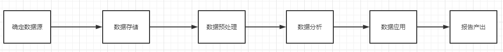

# OOZIE调度工具

## oozie的基本介绍

*Oozie* 是一个开源的工作流和协作服务引擎，基于 Apache Hadoop 的数据处理任务.

什么是工作流?  业务[过程](https://baike.baidu.com/item/过程)的部分或整体在[计算机](https://baike.baidu.com/item/计算机)应用环境下的自动化

工作流具有特点:

* 1) 整个流程可以被分为多个节点
* 2) 各个节点存在依赖关系(前序没有干, 后续就无法执行)
* 3) 此流程需要周而复始不断的干

总结: 如果以后发现有个任务满足了以上三个特征, 那么就可以尝试使用工作流来解决

请问, 大数据的开发流程, 是否可以使用工作流呢?  一定是可以的

如何来实现工作流呢?  apache oozie  和  领英公司 azkaban

* 单独使用角度:  azkaban比oozie更加的方便

  * azkaban: 是由领英提供的一款工作流的调度工具, 其内部主要采用通过配置类似于properties文件来定义工作流, 此定义方式更加的方便,  而且领英宣称 只要是能够使用shell命令执行的软件, 统统都可以使用azkaban完成调度, 所以说azkaban本质上就是一个shell调度客户端
  * oozie: apache旗下的, 出现时间较早, 是大数据一款工作流的调度工具, oozie采用xml方式来完成工作流调度, oozie在单独使用下, 配置是极其复杂的, 而且oozie所提供管理界面 异常难用, 比较慢

  所以说, 从单独使用角度上, azkaban前景要优于oozie

* 如何是结合HUE来使用呢? 

  * azkaban: 由于azkaban是由领英公司开源, 并不属于apache环境, 所以HUE对其是不支持的, 如果需要使用azkaban, 需要单独维护一套azkaban调度环境
  * ooize: 是由apache开源, 属于apache怀抱下产品, 同时HUE也是apache旗下的, HUE如果要整合一款调度工具, 必然会选择自家产品 , 所以HUE是可以直接和oozie进行整合, 整合之后, 用户只需要通过鼠标点一点方式即可完成工作流的配置

  此时: ooize要比azkaban更加方便,同时也是同源产品, 兼容性也会更好, 不需要单独维护