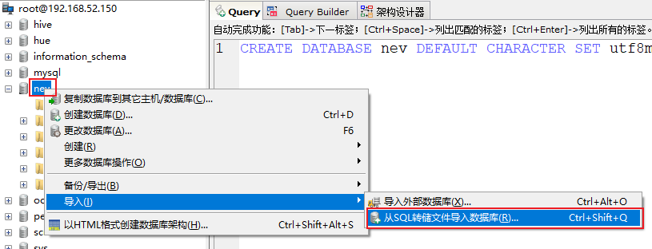
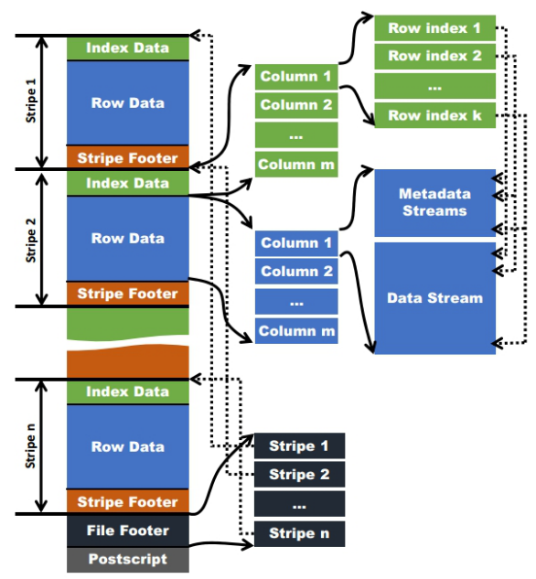
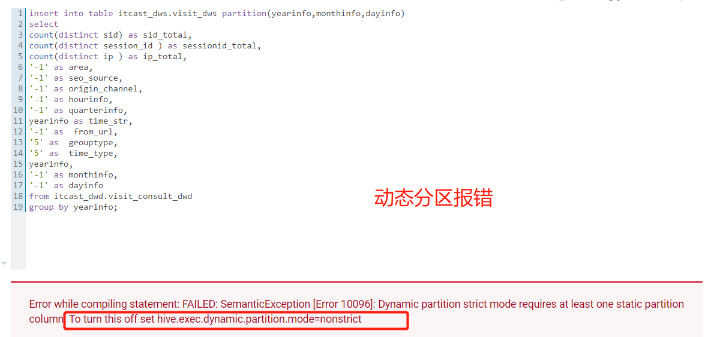

# 教育项目-访问咨询主题看板

## 1. 访问咨询主题看板_需求分析

目的: <span style="color:red;background:white;font-size:20px;">**分析每一个调研需求需要计算什么指标, 以及计算这个指标需要通过那些维度,而且还包括计算这个需求涉及到那些表和那些字段**</span>


* 需求1: 统计指定时间段内，访问客户的总数量。能够下钻到小时数据

* ``` sql
  1.SELECT  
  2.    count( DISTINCT ( wce.sid ) )  '总数', DATE_FORMAT( wce.create_time, '%Y-%m-%d' ) '时间'  
  3.FROM  
  4.    web_chat_ems_2019_12 wce   
  5.GROUP BY  
  6.    DATE_FORMAT( wce.create_time, '%Y-%m-%d' )  
  7.ORDER BY  
  8.    DATE_FORMAT( wce.create_time, '%Y-%m-%d' ) ASC  
  ```

```properties
指标: 访问量
维度: 
   时间维度:  年 季度 月 天  小时
   
涉及到哪些表: web_chat_ems_2019_12
    
涉及到哪些字段: 
   时间维度:  create_time
   		说明: 发现create_time字段中包含有年 月 天 小时这些数据, 此时可以认为一个字段中涵盖了多个字段的数据
   			处理方式: 后期需要对此字段进行转换处理工作
   			    将create_time  转换为:  yearinfo  monthinfo  dayinfo  hourinfo ....
   指标字段: sid
      说明: 指标计算的逻辑 先对sid进行去重操作, 然后统计个数过程
```


* 需求2: 统计指定时间段内，访问客户中各区域人数热力图。能够下钻到小时数据

* ``` sql
  1.SELECT  
  2.    wce.area '区域',  
  3.    count(DISTINCT(wce.sid)) '总数',  
  4.    wce.country '国家',  
  5.    wce.province '省份',  
  6.    wce.city '城市',  
  7.    DATE_FORMAT(wce.create_time,'%Y-%m-%d') '时间'  
  8.FROM  
  9.    web_chat_ems_2019_12 wce  
  10.GROUP BY  
  11.    DATE_FORMAT(wce.create_time,'%Y-%m-%d'),  
  12.    wce.area  
  13.ORDER BY   
  14.    DATE_FORMAT(wce.create_time,'%Y-%m-%d') ASC, count(DISTINCT(wce.sid)) DESC;  
  ```

  

```properties
指标:  访问量
维度:
   时间维度:  年 季度 月 天  小时
   区域维度:
涉及到哪些表:  web_chat_ems_2019_12
    
涉及到哪些字段:
    时间维度: create_time
    区域维度: area
    指标字段: sid
```

* 需求3: 统计指定时间段内，不同地区（省、市）访问的客户中发起咨询的人数占比
  * 占比计算:  统计出每个地区的总访问量 和 每个地区发起咨询的人数之间比例

``` sql
1.SELECT  
2.    CONCAT(msgNumber.num / totalNumber.num * 100, '%')  
3.FROM  
4.    (  
5.    SELECT  
6.        count( DISTINCT ( sid ) ) num   
7.    FROM  
8.        web_chat_ems_2019_12   
9.    WHERE  
10.        msg_count >= 1   
11.    ) msgNumber,  
12.    (  
13.    SELECT  
14.        count( DISTINCT ( sid ) ) num   
15.    FROM  
16.    web_chat_ems_2019_12   
17.    ) totalNumber  
```


```properties
指标: 访问量  和 咨询量
维度:
   时间维度: 年 季度 月 天  小时
   区域维度
说明: 访问量的统计可以直接复用需求2的结果即可, 此处可以省略
涉及到哪些表: web_chat_ems_2019_12
   
涉及到哪些字段: 
    时间维度: create_time
    区域维度: area
    咨询量判断:  msg_count >= 1 即可
    指标字段: sid
       咨询量指标计算:
           先对数据进行过滤得出咨询数据, 然后通过先去重 在求个数过程
```


* 需求4: 统计指定时间段内，每日客户访问量/咨询率双轴趋势图。能够下钻到小时数据。

```properties
指标: 访问量   和 咨询量
维度:
   时间维度: 年 季度 月 天  小时
说明: 访问量的统计可以直接复用需求1的结果即可

涉及到哪些字段: 
   时间维度:  create_time
   		说明: 发现create_time字段中包含有年 月 天 小时这些数据, 此时可以认为一个字段中涵盖了多个字段的数据
   			处理方式: 后期需要对此字段进行转换处理工作
   			    将create_time  转换为:  yearinfo  monthinfo  dayinfo  hourinfo ....
   指标字段: sid
      说明: 指标计算的逻辑 先对sid进行去重操作, 然后统计个数过程
   添加一个咨询数据过滤的条件:
       msg_count >= 1 即可
```


* 需求5: 统计指定时间段内，1-24h之间，每个时间段的访问客户量。

``` sql
1.SELECT  
2.    DATE_FORMAT(wce.create_time,'%H') '时间',  
3.    count(DISTINCT(wce.sid)) '总数' , 
4.FROM  
5.    web_chat_ems_2019_12 wce  
6.GROUP BY  
7.    DATE_FORMAT(wce.create_time,'%H')  
8.ORDER BY   
9.    DATE_FORMAT(wce.create_time,'%H');  
```


```properties
指标: 访问量
维度:
    时间维度 : ....
此需求的结果 在需求1中 已经涵盖了, 不需要再次分析
```


* 需求6: 统计指定时间段内，不同来源渠道的访问客户量占比。能够下钻到小时数据。
  * 理解1: 占比  指的是各个来源渠道的访问量 和 总访问量的占比情况
  * 理解2: 占比  指的是 各个来源渠道中, 访问量 和 咨询量之间占比情况 (按此理解走)

``` sql
1.SELECT  
2.    count( DISTINCT ( wce.sid ) ) '总数',  
3.    wce.origin_channel   
4.FROM  
5.    web_chat_ems_2019_12 wce   
6.GROUP BY  
    wce.origin_channel; 
```


```properties
指标: 访问量  和 咨询量
维度:
   时间维度:  年 季度 月  天 小时
   来源渠道维度
涉及到哪些表: web_chat_ems_2019_12
涉及到哪些字段:
   时间维度: create_time
   来源渠道维度:  origin_channel
   指标字段:  sid
```


* 需求7: 统计指定时间段内，不同搜索来源的访问客户量占比。能够下钻到小时数据。
  * 理解1: 占比  指的是不同搜索来源的访问量 和 总访问量的占比情况 (按此理解走)
  * 理解2: 占比  指的是 不同搜索来源中, 访问量 和 咨询量之间占比情况

``` sql
8.SELECT  
9.    count( DISTINCT ( wce.sid ) ) '总数',  
10.    wce.seo_source   
11.FROM  
12.    web_chat_ems_2019_12 wce   
13.GROUP BY  
    wce.seo_source; 
```


```properties
指标:   访问量
维度:
   时间维度 :  年 季度 月  天 小时
   搜索来源渠道维度
涉及到哪些表: web_chat_ems_2019_12
涉及到那些字段: 
    时间维度: create_time
    搜索来源维度字段: seo_source
    指标字段: sid
```


* 需求8: 统计指定时间段内，产生访问客户量最多的页面排行榜TOPN。能够下钻到小时数据。

``` sql
1.SELECT  
2.    count( 1 ),  
3.    wcte.from_url   
4.FROM  
5.    web_chat_text_ems_2019_11 wcte   
6.GROUP BY  
7.    wcte.from_url   
    LIMIT 20
```


```properties
指标:  访问量
维度: 
    时间维度: 年 季度 月  天 小时
    受访页面维度:
涉及到哪些表: web_chat_text_ems_2019_12 
涉及到哪些字段: 
   时间维度: 暂不知道
   受访页面维度: from_url
   指标计算: 直接计算总数量
```


- 总结:

```properties
指标: 访问量
维度: 
    固有维度:  
       时间维度: 年 季度 月  天 小时
    产品属性维度:
       总访问量
       地区维度
       来源渠道维度
       搜索来源维度
       受访页面维度
       
----------------------------------------------------------------------------------

指标:  咨询量
维度:
    固有维度:  
        时间维度: 年 季度 月 天 小时
    产品属性维度:
        总咨询量
        地区维度
        来源渠道维度
        
发现点: 不管计算咨询量还是访问量 都使用的同一个表, 只是咨询量比访问量在计算的时候多个一个条件:
    msg_count >=1
 
涉及到表: web_chat_ems_2019_12 和  web_chat_text_ems_2019_12

涉及到字段: 
    web_chat_ems_2019_12:
         指标: sid (咨询量 和 访问量)
            说明: 先去重, 在统计个数过程
         时间维度: create_time
         地区维度: area
         来源渠道维度: origin_channel
         搜索来源维度: seo_source
  web_chat_text_ems_2019_12:
         受访页面维度: from_url
 
 需求转换的点:
     create_time字段 后期需要进行转换操作
```


## 2. 访问咨询主题看板_数据初始准备工作

* 1) 在业务库中, 构建 业务数据库: (MySQL)   请采用课件提供建库语句, 以免出现中文乱码问题

```sql
create database nev default character set utf8mb4 collate utf8mb4_unicode_ci;
```

* 2) 执行相关的SQL的脚本, 将数据导入到nev库中





* 3) 表关系的说明:


## 3. 访问咨询主题看板_建模分析

目的: 要计算此主题, 需要如何构建数仓分层, 每一层需要有那些表, 表中有那些字段

### ODS层: 源数据层

* 作用:对接数据源, 将数据源中数据导入到ODS层, 和数据源保持相同粒度(<span style="color:red;background:white;font-size:20px;font-family:楷体;">**数据源中有那些内容, 导入到ODS层也需要有那些内容**</span>)
* 建模操作: <span style="color:blue;background:white;font-size:20px;font-family:楷体;">**此层一般用于放置事实表和少量的维度表**</span>

```properties
1) 在ODS层, 可以放置两张表(在业务端有二张跟此主题相关的事实表)
    web_chat_ems  和   web_chat_text_ems
2) ODS层的两个表中字段 和  业务库中对应表的字段保持一致(业务库中表有几个字段, 此ODS层表中也应该有几个字段)


```

注意: <span style="color:red;background:white;font-size:20px;font-family:楷体;">**需要新增一个字段start_time**</span>

``` properties
在后期执行操作的时候, 先进行全量分析过程, 然后后期都是增量分析,此时需要从ODS层拿到增量数据, 如何区分增量数据呢?
    核心点: 通过时间
    所以: 
        在ODS层建表的时候, 比业务库的表多一个字段,此字段主要作用用于标识抽取时间: start_time 
```


### DW层: 数据仓库层

#### DWD层: 明细层

* 作用: <span style="color:red;background:white;font-size:20px;font-family:楷体;">**数据的清洗转换处理  和 进行少量的维度退化手段**</span>
* 思考: 需要清洗什么内容 , 需要转换什么内容

```properties
清洗什么内容?  没有清洗的工作 , 因为数据来源于mysql, 数据结构是完整, 同时所有数据都是需要的, 所以也不需要处理

转换什么内容?
   1. create_time : (需求必须要转换)
       原始数据:  2019-07-02 00:00:00 
       发现: 一个字段里面糅杂了太多字段数据, 需要对其进行转换
       转换为:
          yearinfo  quarterInfo  monthinfo  dayinfo  hourinfo
          
   2. 将create_time转换为时间戳的操作(为了讲解时间函数)

```

* 建模操作字段:

```properties
  ,create_time,
hourinfo,yearinfo, quarterInfo,  monthinfo, dayinfo  

注意: 以上字段, 是需要进行清洗和转换后, 保留的字段

此时DWD层表:  将上述的字段 和 ODS层中事实表所有的字段汇总在一起, 构建成DWD层表

实际在生产中,具体操作:  
    1) 第一种, 如果事实表中字段比较多, 一般做法 可以只将需要的字段抽取出来即可
    2) 第二种, 如果表中字段比较少, 一般做法, 全部都获取出来

 
最终形成的表字段: 
   sid,session_id,ip ,create_time,area,origin_channel,seo_source,referrer,from_url,
  landing_page_url,url_title,platform_description,other_params,history,msg_count
hourinfo,yearinfo, quarterInfo,  monthinfo, dayinfo  
```

#### DWM层: 中间层

* 作用:  <span style="color:red;background:white;font-size:20px;font-family:楷体;">**提前聚合操作(周期快照事实表)  和 维度退化操作**</span>

```properties
1) 维度退化操作:  此功能在此主题中不存在, 因为没有维度表
2) 做提前聚合操作: 
      比如说: 要分别按照 年 月  日 小时进行统计总访问量, 此时可以先按照小时统计总访问量 , 后的日 月 年可以在小时的基础上进行累加统计即可, 这样效率比较高
      思考, 访问咨询主题中, 是否可以进行提前聚合呢?  不能 
         **在此看板中, 计算指标的 先 去重 在统计个数**
     小案例: 
         2020-10-10 15  s01  
         2020-10-10 15  s02
         2020-10-10 16  s01
         2020-10-10 16  s03
         2020-10-11 10  s02
         2020-10-11 11  s04
         
       统计, 每个小时有几个用户数据呢?
          2020-10-10 15  2
          2020-10-10 16  2
          2020-10-11 10  1
          2020-10-11 11  1
       统计, 每天有几个用户呢? 
           正确结果:
              2020-10-10  3
              2020-10-11  2
           但是, 如果使用每个小时的统计结果, 来计算:
             2020-10-10  4
             2020-10-11  2
             此时, 会发现有问题了....
```

* 此时发现, 在此层, 既不能做维度退化, 也不能进行提前聚合, 所以 不需要DWM层

#### DWS层: 业务层

* 作用: <span style="color:red;background:white;font-size:20px;font-family:楷体;">**针对指标, 进行细化维度统计操作**</span>

```properties
指标: 访问量
维度: 
    固有维度:  
       时间维度: 年 季度 月  天 小时
    产品属性维度:
       总访问量
       地区维度
       来源渠道维度
       搜索来源维度
       受访页面维度

开发需求: 共计有 25个开发需求
   1) 统计每年 的总访问量
   2) 统计 每年 每季度的总访问量
   3) 统计 每年 每季度 每月的总访问量
   .....
   
   1) 统计每年 各个地区的总访问量
   2) 统计每年每季度 各个地区总访问量
   ....
   
   1) 统计每年各个来源渠道的总访问量数据
   2) 统计每年每季度各个来源渠道的总访问量数据
   ....
   
   ....
 在DWS层, 需要将每一个需求的结果统计出来, 然后存储在DWS层  , 针对每一个指标, 构建一个结果表, 存储其所有的结果
 
DWS层表:
  组成部分:
      指标统计结果字段 + 维度字段  + 业务查询字段(time_type,group_type,time_str)
 
 最终组合下DWS层字段:
    sid_total,sessionid_total,ip_total,area,origin_channel,seo_source
    from_url, hourinfo,time_type,group_type,time_str
    yearinfo, quarterinfo,monthinfo,dayinfo,
       
       
-------------------------------------
指标:  咨询量
维度:
    固有维度:  
        时间维度: 年 季度 月 天 小时
    产品属性维度:
        总咨询量
        地区维度
        来源渠道维度
DWS层表:
  组成部分:
      指标统计结果字段 + 维度字段  + 业务查询字段(time_type,group_type,time_str)
      
  最终组合下DWS层字段:
    sid_total,sessionid_total,ip_total,area,origin_channel
    hourinfo,time_type,group_type,time_str
    yearinfo, quarterinfo,monthinfo,dayinfo,

```


### APP层: 数据应用层

* 作用: <span style="color:red;background:white;font-size:20px;font-family:楷体;">**对DWS层结果进行再次分析, 将统计结果存储在APP层**</span>

```properties
思考: 是否还需要对DWS层数据进行统计?  ---> 是否在DWS层以及将需要的结果统计出来了?

此时发现, 需要要求安装各个维度统计结果此时在DWS层以及统计完成了, 此时不需要在继续统计了, 所以不需要app层

如果说, 需要计算比率 , 咨询率  此时可能需要app层
```


* DIM层: 维表层

  * 此层不需要(因为没有维度表)


## 4. 访问咨询主题看板_建模操作

#### 数据格式

##### 列式存储和行式存储

 

 

<span style="color:red;background:white;font-size:20px;font-family:楷体;">**行存储的特点:** 	查询满足条件的一整行（所有列）数据的时候</span>，列存储则需要去每个聚集的字段找到对应的每个列的值，行存储只需要找到其中一个值，其余的值都在相邻地方，所以此时行存储查询的速度更快。

<span style="color:red;background:white;font-size:20px;font-family:楷体;">**列存储的特点：**</span> 因为每个字段的数据聚集存储，<span style="color:red;background:white;font-size:20px;font-family:楷体;">**在查询只需要少数几个字段的时候**</span>，能大大减少读取的数据量；每个字段的数据类型一定是相同的，列式存储可以针对性的设计更好的设计压缩算法。

###### TEXTFILE

​		默认格式，<span style="color:red;background:white;font-size:20px;font-family:楷体;">**行式存储**</span>。可结合Gzip、Bzip2使用(系统自动检查，执行查询时自动解压)，但使用这种方式，<span style="color:red;background:white;font-size:20px;font-family:楷体;">**hive不会对数据进行切分**</span>，从而无法对数据进行并行操作。并且反序列化过程中，必须逐个字符判断是不是分隔符和行结束符，<span style="color:red;background:white;font-size:20px;font-family:楷体;">**性能较差**</span>。

###### ORCFILE

​		使用ORC文件格式可以<span style="color:red;background:white;font-size:20px;font-family:楷体;">**提高hive读、写和处理数据的能力**</span>。ORCFile是RCFile的升级版。

在ORC格式的hive表中，数据按行分块，每块按列存储。<span style="color:red;background:white;font-size:20px;font-family:楷体;">**结合了行存储和列存储的优点**</span>。记录首先会被横向的切分为多个stripes，然后在每一个stripe内数据以列为单位进行存储，所有列的内容都保存在同一个文件中。

每个stripe的默认大小为256MB，相对于RCFile每个4MB的stripe而言，<span style="color:red;background:white;font-size:20px;font-family:楷体;">**更大的stripe使ORC可以支持索引**</span>，数据读取更加高效。

 

 

##### 存储和压缩结合

###### zlib压缩

优点：<span style="color:red;background:white;font-size:20px;font-family:楷体;">**压缩率比较高；hadoop本身支持，在应用中处理gzip格式的文件就和直接处理文本一样。**</span>

缺点：<span style="color:red;background:white;font-size:20px;font-family:楷体;">**压缩性能一般**</span>。 


###### snappy压缩

优点：<span style="color:red;background:white;font-size:20px;font-family:楷体;">**高速压缩速度和合理的压缩率**</span>。

缺点：<span style="color:red;background:white;font-size:20px;font-family:楷体;">**压缩率比zlib要低**</span>；hadoop本身不支持，需要安装（CDH版本已自动支持，可忽略）。


##### 系统采用的格式

``` properties
因为ORCFILE的压缩快、存取快，而且拥有特有的查询优化机制，所以系统采用ORCFILE存储格式（RCFILE升级版），压缩算法采用orc支持的ZLIB和SNAPPY。

在ODS数据源层，因为数据量较大，可以采用orcfile+ZLIB的方式，以节省磁盘空间；

而在计算的过程中（DWD、DWM、DWS、APP），为了不影响执行的速度，可以浪费一点磁盘空间，采用orcfile+SNAPPY的方式，提升hive的执行速度。

存储空间足够的情况下，推荐采用SNAPPY压缩。
```


### 4.1 存储和压缩的选择

  在项目中:

<span style="color:red;background:white;font-size:20px;font-family:楷体;">**ODS层:  ZLIB+ORC**</span>

<span style="color:red;background:white;font-size:20px;font-family:楷体;">**其他层次: SNAPPY + ORC**</span>

说明: 如果存储空间比较宽裕的, 建议在hive中建表时都可以采用snappy压缩方案


### 4.2 hive的分区

分区表的作用:  <span style="color:red;background:white;font-size:20px;font-family:楷体;">**提升查询的性能**</span>

* 为什么说分区表可以提升查询性能呢?

```properties
原因:
   分区表可以将数据按照分区字段将其划分到多个文件夹中, 在查询的时候, 根据分区字段查询, 此时hive回到指定分区目录下查询数据, 不需要在查询其他目录, 从而可以减少查询数据的扫描量, 从而提升效率
   
所以说 在hive中构建表的时候, 一般都是构建分区表
```

思考: 构建分区表, 如何向分区表添加数据

```properties
方案一: 静态分区(人为指定分区的值)
	格式:
	   1) load data [local] inpath '路径' into|overwrite table 表名 partition(分区字段1=值1, 分区字段2=值2,...)
       2) insert into|overwrite table 表名 partition(分区字段1=值1,分区字段2=值2....) +select ....

方案二: 动态分区(一次性向表中添加多个分区)
     格式:
        insert into|overwrite table 表名 partition(分区字段1,分区字段2....) +select ....
     注意:  如果使用动态分区, 必须满足以下条件
       1) 必须配置以下参数:
          set hive.exec.dynamic.partition=true; 开启动态分区支持
          set hive.exec.dynamic.partition.mode=nonstrict; 开启非严格模式
       2) select查询语句结果最后面必须是分区字段,而且要保证顺序

方案三: 动静混合
	格式: 
	  insert into|overwrite table 表名 partition(分区字段1=值1,分区字段2,分区字段3....) +select ....
	 注意:  如果使用动静混合分区, 必须满足以下条件
       1) 必须配置以下参数:
          set hive.exec.dynamic.partition=true; 开启动态分区支持
          set hive.exec.dynamic.partition.mode=nonstrict; 开启非严格模式
       2) select查询语句结果最后面必须是动态分区字段,而且要保证顺序
```

#### 优化动态分区配置:

* hive.optimize.sort.dynamic.partition

```pro
主要作用:
    当电脑内存资源不足时候, 可以开启此参数, 一旦开启, 整个hive翻译MR只会保持一个输出reduce, 从而降低资源的占用情况, 保证正常执行
    弊端: 执行效率会降低
```


### 4.3 建模操作

#### 4.3.1 ODS层

* 表: 2个表

```sql
-- 构建ODS的库
CREATE DATABASE IF NOT EXISTS `itcast_ods`;

--写入时压缩生效
set hive.exec.orc.compression.strategy=COMPRESSION;

CREATE EXTERNAL TABLE IF NOT EXISTS itcast_ods.web_chat_ems (
  id INT comment '主键',
  create_date_time STRING comment '数据创建时间',
  session_id STRING comment '七陌sessionId',
  sid STRING comment '访客id',
  create_time STRING comment '会话创建时间',
  seo_source STRING comment '搜索来源',
  seo_keywords STRING comment '关键字',
  ip STRING comment 'IP地址',
  area STRING comment '地域',
  country STRING comment '所在国家',
  province STRING comment '省',
  city STRING comment '城市',
  origin_channel STRING comment '投放渠道',
  user_match STRING comment '所属坐席',
  manual_time STRING comment '人工开始时间',
  begin_time STRING comment '坐席领取时间 ',
  end_time STRING comment '会话结束时间',
  last_customer_msg_time_stamp STRING comment '客户最后一条消息的时间',
  last_agent_msg_time_stamp STRING comment '坐席最后一下回复的时间',
  reply_msg_count INT comment '客服回复消息数',
  msg_count INT comment '客户发送消息数',
  browser_name STRING comment '浏览器名称',
  os_info STRING comment '系统名称')
comment '访问会话信息表'
PARTITIONED BY(starts_time STRING)
ROW FORMAT DELIMITED
FIELDS TERMINATED BY '\t'
stored as orc
location '/user/hive/warehouse/itcast_ods.db/web_chat_ems_ods'
TBLPROPERTIES ('orc.compress'='ZLIB');


CREATE EXTERNAL TABLE IF NOT EXISTS itcast_ods.web_chat_text_ems (
  id INT COMMENT '主键来自MySQL',
  referrer STRING comment '上级来源页面',
  from_url STRING comment '会话来源页面',
  landing_page_url STRING comment '访客着陆页面',
  url_title STRING comment '咨询页面title',
  platform_description STRING comment '客户平台信息',
  other_params STRING comment '扩展字段中数据',
  history STRING comment '历史访问记录'
) comment 'EMS-PV测试表'
PARTITIONED BY(start_time STRING)
ROW FORMAT DELIMITED 
FIELDS TERMINATED BY '\t'
stored as orc
location '/user/hive/warehouse/itcast_ods.db/web_chat_text_ems_ods'
TBLPROPERTIES ('orc.compress'='ZLIB');

```

#### 4.3.2 DWD层

```sql
-- 构建DWD的库
CREATE DATABASE IF NOT EXISTS `itcast_dwd`;

create table if not exists itcast_dwd.visit_consult_dwd(
  session_id STRING comment '七陌sessionId',
  sid STRING comment '访客id',
  create_time bigint comment '会话创建时间',
  seo_source STRING comment '搜索来源',
  ip STRING comment 'IP地址',
  area STRING comment '地域',
  msg_count int comment '客户发送消息数',
  origin_channel STRING COMMENT '来源渠道',
  referrer STRING comment '上级来源页面',
  from_url STRING comment '会话来源页面',
  landing_page_url STRING comment '访客着陆页面',
  url_title STRING comment '咨询页面title',
  platform_description STRING comment '客户平台信息',
  other_params STRING comment '扩展字段中数据',
  history STRING comment '历史访问记录',
  hourinfo string comment '小时',
  quarterinfo string comment '季度'
)
comment '访问咨询DWD表'
partitioned by(yearinfo String, monthinfo String, dayinfo string)
row format delimited fields terminated by '\t'
stored as orc
location '/user/hive/warehouse/itcast_dwd.db/visit_consult_dwd'
tblproperties ('orc.compress'='SNAPPY');

```

#### 4.3.3 DWS层表 （两个表）

```sql
-- 构建DWS的库
CREATE DATABASE IF NOT EXISTS `itcast_dws`;

CREATE TABLE IF NOT EXISTS itcast_dws.visit_dws (
  sid_total INT COMMENT '根据sid去重求count',
  sessionid_total INT COMMENT '根据sessionid去重求count',
  ip_total INT COMMENT '根据IP去重求count',
  area STRING COMMENT '区域信息',
  seo_source STRING COMMENT '搜索来源',
  origin_channel STRING COMMENT '来源渠道',
  hourinfo STRING COMMENT '创建时间，统计至小时',
  quarterinfo STRING COMMENT '季度',
  time_str STRING COMMENT '时间明细',
  from_url STRING comment '会话来源页面',
  groupType STRING COMMENT '产品属性类型：1.地区；2.搜索来源；3.来源渠道；4.会话来源页面；5.总访问量',
  time_type STRING COMMENT '时间聚合类型：1、按小时聚合；2、按天聚合；3、按月聚合；4、按季度聚合；5、按年聚合；')
comment 'EMS访客日志dws表'
PARTITIONED BY(yearinfo STRING,monthinfo STRING,dayinfo STRING)
ROW FORMAT DELIMITED
FIELDS TERMINATED BY '\t'
stored as orc
location '/user/hive/warehouse/itcast_dws.db/visit_dws'
TBLPROPERTIES ('orc.compress'='SNAPPY');


CREATE TABLE IF NOT EXISTS itcast_dws.consult_dws
(
  sid_total INT COMMENT '根据sid去重求count',
  sessionid_total INT COMMENT '根据sessionid去重求count',
  ip_total INT COMMENT '根据IP去重求count',
  area STRING COMMENT '区域信息',
  origin_channel STRING COMMENT '来源渠道',
  hourinfo STRING COMMENT '创建时间，统计至小时',
  quarterinfo STRING COMMENT '季度',
  time_str STRING COMMENT '时间明细',
  groupType STRING COMMENT '产品属性类型：1.地区；2.来源渠道',
  time_type STRING COMMENT '时间聚合类型：1、按小时聚合；2、按天聚合；3、按月聚合；4、按季度聚合；5、按年聚合；'
)
COMMENT '咨询量DWS宽表'
PARTITIONED BY (yearinfo string, monthinfo STRING, dayinfo string)
ROW FORMAT DELIMITED FIELDS TERMINATED BY '\t'
STORED AS ORC
LOCATION '/user/hive/warehouse/itcast_dws.db/consult_dws'
TBLPROPERTIES ('orc.compress'='SNAPPY');

```


## 5. 数据操作之前基础优化

### 5.1 HDFS的副本数的调整

​    一般情况下, HDFS的副本数量选择为 3   如果数据不是特别重要 可以设置副本数量为2


### 5.2 yarn的相关配置

#### 5.2.1 nodemanager的配置操作

* cpu配置

  * 配置项：yarn.nodemanager.resource.cpu-vcores

    * 默认值: 8 

      ```
      表示: 每一个nodemanager对应服务器的cpu核心数为 8
      ```

    * 推荐配置: 和nodemanager对应服务器的cpu核心保持一致即可

      * 如何查询服务器的cpu的核心数呢?

        ```shell
        grep 'processor' /proc/cpuinfo | sort -u | wc -l
        ```

        

    * 如何配置

    

* 内存配置

  * 配置项: yarn.nodemanager.resource.memory-mb | yarn.scheduler.maximum-allocation-mb | yarn.app.mapreduce.am.command-opts

    ```
    说明:
        yarn.nodemanager.resource.memory-mb | yarn.scheduler.maximum-allocation-mb : 内存大小配置一致
        yarn.app.mapreduce.am.command-opts : 略小于 上面的配置 0.9 左右
    ```

    

    * 默认值: 8GB

    * 推荐配置:  当前服务器剩余内存 * 0.8 

    * 如何查看电脑剩余内存呢?

      * shell命令查询: free -m

        

      * 通过CM查看:

        

    * 如何配置: 

      


> 特殊注意点:  这些内容, 不需要在当前项目中进行修改, 项目中相关配置, 提前配置完成, 不要乱动, 否则会出现不可预估的错误


#### 5.2.2 MR的基础配置

MR的内存配置

```
mapreduce.map.memory.mb  : MR的map程序内存大小配置
mapreduce.reduce.memory.mb :  MR的reduce程序内存大小配置


mapreduce.map.java.opts : MR的map程序的jvm 内存大小配置
mapreduce.reduce.java.opts: MR的reduce程序的jvm 内存大小配置


原则:
   每一个配置, 最大值不能超过nodemanager的内存配置大小
```


### 5.3 hive的基础配置(hive)

#### 5.3.1 hiveserver2的java堆栈内存


<span style="color:red;background:white;font-size:20px;font-family:楷体;">**hiveserver2异常退出错误**</span>

一般出现的原因:

```
hiveserver2内存溢出错误, 导致hiveserver2宕机
```

解决方案: 调整hiveserver2内存大小 , 后期会调整为 2GB


#### 5.3.2   动态生成分区的线程数

* 配置项: hive.load.dynamic.partitions.thread
  * 说明: 生产动态分区的线程数量
  * 默认值: 15
  * 注意: 此值越大, 执行效率越高(占用资源越高), 值越低, 执行效率越差(占用资源越低)

#### 5.3.3 监听输入的文件线程数

* 配置项: hive.exec.input.listing.max.threads
  * 说明: 读取文件的线程数
  * 默认值: 15
  * 注意: 此值越大, 执行效率越高(占用资源越高), 值越低, 执行效率越差(占用资源越低)

### 5.4 hive的压缩配置操作（yarn）

- map阶段

```properties
mapreduce.map.output.compress :  是否开启MR中map阶段的压缩配置
	默认值为: true
mapreduce.map.output.compress.codec : map阶段压缩采用合并压缩算法
	推荐配置:
	   org.apache.hadoop.io.compress.SnappyCodec


```

- reduce端

``` properties
mapreduce.output.fileoutputformat.compress : 是否开启reduce端压缩配置
	默认为:false
mapreduce.output.fileoutputformat.compress.codec : reduce端采用何种压缩算法
	推荐配置:
	   org.apache.hadoop.io.compress.SnappyCodec
mapreduce.output.fileoutputformat.compress.type :  reduce端采用压缩方式
	默认值:  RECORD(行压缩)  
	可选值: BLOCK(块压缩)
	推荐配置: BLOCK


```

- 中间/最终结果(再会话中配置，就是写sql的时候设置)

``` properties
set hive.exec.compress.intermediate=true; : hive是否开启中间结果压缩配置
	默认为 true
set hive.exec.compress.output=true;  hive是否开启最终结果压缩配置
    默认为 false
```


### 5.5 hive的执行引擎

  hive可选引擎:  MR 和 spark

​	hive.execution.engine


## 6. 访问咨询主题看板_数据采集

目的: 将数据源中数据导入到ODS层对应表

* 数据源(MySQL)
* ODS层(hive)

要求: 将mysql的数据 导入 hive中, 请思考, 需要使用什么技术来解决呢? sqoop

思考: 使用sqoop导入到hive中, sqoop支持两种方式导入hive: 原生方式 和 hcatalog方式, 使用那种?  为什么

```
使用hcatalog 因为 表的数据格式为ORC, 而原生方式仅支持 textFile
```

----

* 导入到hive的命令:

```shell
-- 第一种
sqoop import \
--connect jdbc:mysql://192.168.52.150:3306/test \
--username root \
--password 123456 \ 
--table emp \
--fields-terminated-by '\t' \
--hcatalog-database sqooptohive \
--hcatalog-table emp_hive \
-m 1

-- 第二种
sqoop import \
--connect jdbc:mysql://192.168.52.150:3306/test \
--username root \
--password 123456 \
--query "select * from emp where id>1205 and  \$CONDITIONS" \
--fields-terminated-by '\t' \
--hcatalog-database sqooptohive \
--hcatalog-table emp_hive \
-m 1

请问: 在此处选择第几种呢? 为什么
  只能使用第二种方式, 因为 ods中表的user_match字段和数据源中user字段不相同, 如果使用第一种,要求两端字段, 必须完全一致, 否则导入不成功

```

* 编写查询 数据库的SQL语句

```sql
第一个表:
SELECT 
id,create_date_time,session_id,sid,
create_time,seo_source,seo_keywords,ip,AREA,country,
province,city,origin_channel,USER AS user_match,manual_time,begin_time,
end_time,last_customer_msg_time_stamp,last_agent_msg_time_stamp,
reply_msg_count,msg_count,browser_name,os_info,'2021-02-27' AS starts_time
FROM web_chat_ems_2019_07 ;

第二个表:
SELECT 
id,referrer,from_url,landing_page_url,
url_title,platform_description,other_params,
history,'2021-02-27' AS start_time
FROM web_chat_text_ems_2019_07 ;

```

* 编写sqoop脚本命令

```shell
# 第一个表
sqoop import \
--connect jdbc:mysql://192.168.52.150:3306/nev \
--username root \
--password 123456 \
--query "SELECT 
id,create_date_time,session_id,sid,
create_time,seo_source,seo_keywords,ip,AREA,country,
province,city,origin_channel,USER AS user_match,manual_time,begin_time,
end_time,last_customer_msg_time_stamp,last_agent_msg_time_stamp,
reply_msg_count,msg_count,browser_name,os_info,'2021-02-27' AS starts_time
FROM web_chat_ems_2019_07 where 1=1 and \$CONDITIONS" \
--fields-terminated-by '\t' \
--hcatalog-database itcast_ods \
--hcatalog-table web_chat_ems \
-m 1

# 第二个表
sqoop import \
--connect jdbc:mysql://192.168.52.150:3306/nev \
--username root \
--password 123456 \
--query "SELECT 
id,referrer,from_url,landing_page_url,
url_title,platform_description,other_params,
history,'2021-02-27' AS start_time
FROM web_chat_text_ems_2019_07 where 1=1 and \$CONDITIONS" \
--fields-terminated-by '\t' \
--hcatalog-database itcast_ods \
--hcatalog-table web_chat_text_ems \
-m 1

```

* 校验数据是否导入到ODS层

```
1) 分别在mysql和 hive中查询数据的条数, 如果一致, 说明导入成功了

select count(1) from 表 ;

2) 查询表中某一条数据, 观察数据是否导入成功
  select * from itcast_ods.web_chat_ems limit 1;
  
3) 在HDFS中查看是否构建对应分区数据
```


##  7. 访问咨询主题看板_数据清洗转换

目的:  ODS层 --> DWD层 过程

思考:

```properties
清洗什么内容: 在第一个模块中并不需要进行清洗. 此功能没有

转换什么内容: 
   1) create_time 时间字段  需要转换为:
       yearinfo  quarterinfo  monthinfo dayinfo  hourinfo
   2) 将create_time 时间字段, 转换为时间戳:
      
```

* 尝试编写清洗转换的SQL:

```sql
select
wce.session_id,
wce.sid,
wce.create_time , -- 说明: 此处需要转换为时间戳
wce.seo_source,
wce.ip,
wce.area, 
wce.msg_count, 
wce.origin_channel, 
wcte.referrer, 
wcte.from_url, 
wcte.landing_page_url, 
wcte.url_title, 
wcte.platform_description, 
wcte.other_params, 
wcte.history, 

wce.create_time  as hourinfo ,   -- 此处需要转换
wce.create_time  as quarterinfo,  -- 此处需要转换
wce.create_time  as yearinfo,     -- 此处需要转换
wce.create_time  as monthinfo,     -- 此处需要转换
wce.create_time  as dayinfo      -- 此处需要转换

from itcast_ods.web_chat_ems wce join itcast_ods.web_chat_text_ems wcte
   on wce.id = wcte.id ;
   
注意: 此SQL 还没有完成 转换工作
```

* 思考如何进行转换呢?

```sql
1) 转换: 将  create_time 转换为时间戳
    create_time 原始值:   2019-07-02 00:00:00
    
    如何实现转换呢?  需要使用与时间相关的函数
        unix_timestamp(string date, string pattern)
    案例操作:
        -- unix_timestamp(string date, string pattern)

        select  unix_timestamp('2019-07-02 00:00:00', 'yyyy-MM-dd HH:mm:ss');  日期转换时间戳

        -- from_unixtime(1323308943,'yyyyMMdd')
        select  from_unixtime(1561996800,'yyyy-MM-dd HH:mm:ss')  时间戳转日期

2) 转换: 将 create_time 转换为 yearinfo  quarterinfo  monthinfo dayinfo  hourinfo
	create_time 原始值:   2019-07-02 00:00:00
	
	如何转换呢? 
		方式一:  采用日期函数来解决 
			year() quarter()  month() day()  hour()
		   案例:
		      select year('2019-07-02 00:00:00'); -- 2019
              select quarter('2019-07-02 00:00:00'); -- 3
              select month('2019-07-02 00:00:00');   -- 7
              select day('2019-07-02 00:00:00');  -- 2
              select hour('2019-07-02 00:00:00'); -- 0
           说明. 结果要求  月份 小时 天 必须为二位数, 不能写单值, 如果是单值前面必须加 0 
        
        方式二:  采用字符串截取的方式来获取
          相关的函数:substr(string A, int start, int len),substring(string A, int start, int len)
          
          案例:
            select  substr('2019-07-02 00:00:00',1,4 ); -- 2019
            select  substr('2019-07-02 00:00:00',6,2 ) ; -- 07
            select  substr('2019-07-02 00:00:00',9,2 ) ; --  02 
            select  substr('2019-07-02 00:00:00',12,2 ) ; --   00
```

* 最终版本: 清洗转换的SQL:

```sql
select
wce.session_id,
wce.sid,
unix_timestamp(wce.create_time,'yyyy-MM-dd HH:mm:ss')  as create_time,
wce.seo_source,
wce.ip,
wce.area, 
wce.msg_count, 
wce.origin_channel, 
wcte.referrer, 
wcte.from_url, 
wcte.landing_page_url, 
wcte.url_title, 
wcte.platform_description, 
wcte.other_params, 
wcte.history, 
substr(wce.create_time,12,2)  as hourinfo ,   
quarter(wce.create_time)  as quarterinfo, 
substr(wce.create_time,1,4)   as yearinfo,  
substr(wce.create_time,6,2)  as monthinfo,   
substr(wce.create_time,9,2) as dayinfo     
from itcast_ods.web_chat_ems wce join itcast_ods.web_chat_text_ems wcte
   on wce.id = wcte.id ;
```

注意：<span style="color:red;background:white;font-size:20px;font-family:楷体;">**可能报错Execution failed with exit status: 137**</span>

​	

原因:

```
可能是由于服务器内存不足引起的, 在进行mapJoin时候, 内存不足以放下小表中的数据
```

解决方案:

```
set hive.auto.convert.join= false;
```


* 查询的结果导入到DWD层: 完成 清洗转换操作

```sql
--可能是由于服务器内存不足引起的, 在进行mapJoin时候, 内存不足以放下小表中的数据
set hive.auto.convert.join= false;

--动态分区配置
set hive.exec.dynamic.partition=true;
set hive.exec.dynamic.partition.mode=nonstrict;
--hive压缩 DWD层的表是压缩的表， 需要开启压缩
set hive.exec.compress.intermediate=true;
set hive.exec.compress.output=true;
--写入时压缩生效
set hive.exec.orc.compression.strategy=COMPRESSION;


insert into table itcast_dwd.visit_consult_dwd partition(yearinfo,monthinfo,dayinfo)
select
wce.session_id,
wce.sid,
unix_timestamp(wce.create_time,'yyyy-MM-dd HH:mm:ss')  as create_time,
wce.seo_source,
wce.ip,
wce.area, 
wce.msg_count, 
wce.origin_channel, 
wcte.referrer, 
wcte.from_url, 
wcte.landing_page_url, 
wcte.url_title, 
wcte.platform_description, 
wcte.other_params, 
wcte.history, 
substr(wce.create_time,12,2)  as hourinfo ,   
quarter(wce.create_time)  as quarterinfo, 
substr(wce.create_time,1,4)   as yearinfo,  
substr(wce.create_time,6,2)  as monthinfo,   
substr(wce.create_time,9,2) as dayinfo     
from itcast_ods.web_chat_ems wce join itcast_ods.web_chat_text_ems wcte
   on wce.id = wcte.id ;
```

可能报出的错误:


原因:

```
可能是由于服务器内存不足引起的, 在进行mapJoin时候, 内存不足以放下小表中的数据
```

解决方案:

```
set hive.auto.convert.join= false;
```


## 8. 访问咨询主题看板_统计分析操作

目的: DWD --> DWS 

dws的目的 是将要统计的指标, 根据各个维度进行细化统计

* 访问量:

```sql
指标: 访问量
维度: 
    固有维度:  
       时间维度: 年 季度 月  天 小时
    产品属性维度:
       总访问量
       地区维度
       来源渠道维度
       搜索来源维度
       受访页面维度
       
相关的需求: 
    1) 统计每年的总访问量数据
    2) 统计每年 每季度的总访问量数据
    3) 统计每年 每季度 每月的总访问量数据
    4) 统计每年 每季度 每月 每天的总访问量数据
    5) 统计每年 每季度 每月 每天 每小时的总访问量数据
        ......
        
    1) 统计 每年 各个地区的访问量数据
    2) 统计每年 每季度 各个地区访问量数据
    3) 统计 每年 每季度 每月 各个地区的访问量数据
    4) 统计 每年 每季度 每月 每天 各个地区的访问量数据
    5) 统计 每年 每季度 每月 每天 每小时 各个地区的访问量数据
       .....
    
    1) 统计 每年 各个来源渠道的访问量数据
    2) 统计 每年 每季度 各个来源渠道的访问量数据
    3) 统计 每年 每季度 每月 各个来源渠道的访问量数据
    4) 统计 每年 每季度 每月 每天 各个来源渠道的访问量数据
    5) 统计 每年 每季度 每月 每天 每小时 各个来源渠道的访问量数据
        .....
        
	1) 统计 每年 各个搜索来源的访问量数据
    2) 统计 每年 每季度 各个搜索来源的访问量数据
    3) 统计 每年 每季度 每月 各个搜索来源的访问量数据
    4) 统计 每年 每季度 每月 每天 各个搜索来源的访问量数据
    5) 统计 每年 每季度 每月 每天 每小时 各个搜索来源的访问量数据
    
    1) 统计 每年 各个受访页面的访问量数据
    2) 统计 每年 每季度 各个受访页面的访问量数据
    3) 统计 每年 每季度 每月 各个受访页面的访问量数据
    4) 统计 每年 每季度 每月 每天 各个受访页面的访问量数据
    5) 统计 每年 每季度 每月 每天 每小时 各个受访页面的访问量数据
    ......   
指标的计算: 
    先去重  在统计操作, 需要通过三个字段分别计算 (sid  session_id  ip)
```


### 可能报错

#### 1- 动态分区报错

- 报错信息如图：

``` sql
Error while compiling statement: FAILED: SemanticException [Error 10096]: Dynamic partition strict mode requires at least one static partition column. To turn this off set hive.exec.dynamic.partition.mode=nonstrict
```



- 解决方法：

``` sql
--动态分区配置
set hive.exec.dynamic.partition=true;
set hive.exec.dynamic.partition.mode=nonstrict;
--hive压缩 DWD层的表是压缩的表， 需要开启压缩
set hive.exec.compress.intermediate=true;
set hive.exec.compress.output=true;
--写入时压缩生效
set hive.exec.orc.compression.strategy=COMPRESSION;

```


### 统计访问量数据

#### 1- 统计 总访问量数据

* 加载数据

``` sql
--可能是由于服务器内存不足引起的, 在进行mapJoin时候, 内存不足以放下小表中的数据
set hive.auto.convert.join= false;

--动态分区配置
set hive.exec.dynamic.partition=true;
set hive.exec.dynamic.partition.mode=nonstrict;
--hive压缩 DWD层的表是压缩的表， 需要开启压缩
set hive.exec.compress.intermediate=true;
set hive.exec.compress.output=true;
--写入时压缩生效
set hive.exec.orc.compression.strategy=COMPRESSION;

insert into table itcast_dws.visit_dws partition(yearinfo,monthinfo,dayinfo)
......查询sql语句
```


* 查询sql

``` sql

--1) 统计每年的总访问量数据
insert into table itcast_dws.visit_dws partition(yearinfo,monthinfo,dayinfo)
select 
count(distinct sid) as sid_total,
count(distinct session_id ) as sessionid_total,
count(distinct ip ) as ip_total,
'-1' as area,
'-1' as seo_source,
'-1' as origin_channel,
'-1' as hourinfo,
'-1' as quarterinfo,
yearinfo as time_str,
'-1' as  from_url,
'5' as  grouptype,
'5' as  time_type,
yearinfo,
'-1' as monthinfo,
'-1' as dayinfo
from itcast_dwd.visit_consult_dwd
group by yearinfo;

--2) 统计每年 每季度的总访问量数据

insert into table itcast_dws.visit_dws partition(yearinfo,monthinfo,dayinfo)
select 
count(distinct sid) as sid_total,
count(distinct session_id ) as sessionid_total,
count(distinct ip ) as ip_total,
'-1' as area,
'-1' as seo_source,
'-1' as origin_channel,
'-1' as hourinfo,
quarterinfo,
concat(yearinfo,"_",quarterinfo) as time_str,
'-1' as  from_url,
'5' as  grouptype,
'4' as  time_type,
yearinfo,
'-1' as monthinfo,
'-1' as dayinfo

from itcast_dwd.visit_consult_dwd

group by yearinfo,quarterinfo;

--3) 统计每年 每季度 每月的总访问量数据

insert into table itcast_dws.visit_dws partition(yearinfo,monthinfo,dayinfo)
select 
count(distinct sid) as sid_total,
count(distinct session_id ) as sessionid_total,
count(distinct ip ) as ip_total,
'-1' as area,
'-1' as seo_source,
'-1' as origin_channel,
'-1' as hourinfo,
quarterinfo,
concat(yearinfo,"-",monthinfo) as time_str,
'-1' as  from_url,
'5' as  grouptype,
'3' as  time_type,
yearinfo,
monthinfo,
'-1' as dayinfo

from itcast_dwd.visit_consult_dwd

group by yearinfo,quarterinfo,monthinfo;

--4) 统计每年 每季度 每月 每天的总访问量数据

insert into table itcast_dws.visit_dws partition(yearinfo,monthinfo,dayinfo)
select 
count(distinct sid) as sid_total,
count(distinct session_id ) as sessionid_total,
count(distinct ip ) as ip_total,
'-1' as area,
'-1' as seo_source,
'-1' as origin_channel,
'-1' as hourinfo,
quarterinfo,
concat(yearinfo,"-",monthinfo,"-",dayinfo) as time_str,
'-1' as  from_url,
'5' as  grouptype,
'2' as  time_type,
yearinfo,
monthinfo,
dayinfo

from itcast_dwd.visit_consult_dwd

group by yearinfo,quarterinfo,monthinfo,dayinfo;

--5) 统计每年 每季度 每月 每天 每小时的总访问量数据
insert into table itcast_dws.visit_dws partition(yearinfo,monthinfo,dayinfo)
select 
count(distinct sid) as sid_total,
count(distinct session_id ) as sessionid_total,
count(distinct ip ) as ip_total,
'-1' as area,
'-1' as seo_source,
'-1' as origin_channel,
hourinfo,
quarterinfo,
concat(yearinfo,"-",monthinfo,"-",dayinfo," ",hourinfo) as time_str,
'-1' as  from_url,
'5' as  grouptype,
'1' as  time_type,
yearinfo,
monthinfo,
dayinfo

from itcast_dwd.visit_consult_dwd

group by yearinfo,quarterinfo,monthinfo,dayinfo,hourinfo;

```


#### 2- 受访页面(from_url)访问量

* 加载数据

``` sql
--可能是由于服务器内存不足引起的, 在进行mapJoin时候, 内存不足以放下小表中的数据
set hive.auto.convert.join= false;

--动态分区配置
set hive.exec.dynamic.partition=true;
set hive.exec.dynamic.partition.mode=nonstrict;
--hive压缩 DWD层的表是压缩的表， 需要开启压缩
set hive.exec.compress.intermediate=true;
set hive.exec.compress.output=true;
--写入时压缩生效
set hive.exec.orc.compression.strategy=COMPRESSION;

insert into table itcast_dws.visit_dws partition(yearinfo,monthinfo,dayinfo)
...... 查询sql语句
```


* 查询sql

``` sql
-- 1) 统计每年 各个受访页面 的总访问量数据
insert into table itcast_dws.visit_dws partition(yearinfo,monthinfo,dayinfo)
select 
count(distinct sid) as sid_total,
count(distinct session_id) as sessionid_total,
count(distinct ip) as ip_total,
'-1' as area,
'-1' as seo_source,
'-1' as origin_channel,
'-1' as hourinfo,
'-1' as quarterinfo,
yearinfo as time_str,
from_url,
'4' as grouptype,
'5' as time_type,
yearinfo,
'-1' as monthinfo,
'-1' as dayinfo

from itcast_dwd.visit_consult_dwd 
group by yearinfo,from_url;


-- 2) 统计每年 每季度 各个受访页面 的总访问量数据
insert into table itcast_dws.visit_dws partition(yearinfo,monthinfo,dayinfo)
select 
count(distinct sid) as sid_total,
count(distinct session_id) as sessionid_total,
count(distinct ip) as ip_total,
'-1' as area,
'-1' as seo_source,
'-1' as origin_channel,
'-1' as hourinfo,
quarterinfo,
concat(yearinfo,"_",quarterinfo) as time_str,
from_url,
'4' as grouptype,
'4' as time_type,
yearinfo,
'-1' as monthinfo,
'-1' as dayinfo

from itcast_dwd.visit_consult_dwd 
group by yearinfo,from_url,quarterinfo;


-- 3) 统计每年 每季度 每月 各个受访页面 的总访问量数据
insert into table itcast_dws.visit_dws partition(yearinfo,monthinfo,dayinfo)
select 
count(distinct sid) as sid_total,
count(distinct session_id) as sessionid_total,
count(distinct ip) as ip_total,
'-1' as area,
'-1' as seo_source,
'-1' as origin_channel,
'-1' as hourinfo,
quarterinfo,
concat(yearinfo,"-",monthinfo) as time_str,
from_url,
'4' as grouptype,
'3' as time_type,
yearinfo,
monthinfo,
'-1' as dayinfo

from itcast_dwd.visit_consult_dwd 
group by yearinfo,from_url,quarterinfo,monthinfo;


-- 4) 统计每年 每季度 每月 每天 各个受访页面  的总访问量数据
insert into table itcast_dws.visit_dws partition(yearinfo,monthinfo,dayinfo)
select 
count(distinct sid) as sid_total,
count(distinct session_id) as sessionid_total,
count(distinct ip) as ip_total,
'-1' as area,
'-1' as seo_source,
'-1' as origin_channel,
'-1' as hourinfo,
quarterinfo,
concat(yearinfo,"-",monthinfo,"-",dayinfo) as time_str,
from_url,
'4' as grouptype,
'2' as time_type,
yearinfo,
monthinfo,
dayinfo

from itcast_dwd.visit_consult_dwd 
group by yearinfo,from_url,quarterinfo,monthinfo,dayinfo;


-- 5) 统计每年 每季度 每月 每天 每小时 各个受访页面 的总访问量数据
insert into table itcast_dws.visit_dws partition(yearinfo,monthinfo,dayinfo)
select 
count(distinct sid) as sid_total,
count(distinct session_id) as sessionid_total,
count(distinct ip) as ip_total,
'-1' as area,
'-1' as seo_source,
'-1' as origin_channel,
hourinfo,
quarterinfo,
concat(yearinfo,"-",monthinfo,"-",dayinfo," ",hourinfo) as time_str,
from_url,
'4' as grouptype,
'1' as time_type,
yearinfo,
monthinfo,
dayinfo

from itcast_dwd.visit_consult_dwd 
group by yearinfo,from_url,quarterinfo,monthinfo,dayinfo,hourinfo;


```

#### 3- 搜索来源(seo_source)访问量

* 加载数据

``` sql
--可能是由于服务器内存不足引起的, 在进行mapJoin时候, 内存不足以放下小表中的数据
set hive.auto.convert.join= false;

--动态分区配置
set hive.exec.dynamic.partition=true;
set hive.exec.dynamic.partition.mode=nonstrict;
--hive压缩 DWD层的表是压缩的表， 需要开启压缩
set hive.exec.compress.intermediate=true;
set hive.exec.compress.output=true;
--写入时压缩生效
set hive.exec.orc.compression.strategy=COMPRESSION;

insert into table itcast_dws.visit_dws partition(yearinfo,monthinfo,dayinfo)
...... 查询sql语句
```


* 查询sql

``` sql


--1) 统计 每年 各个搜索来源的访问量数据
insert into table itcast_dws.visit_dws partition(yearinfo,monthinfo,dayinfo)
select 
count(distinct sid) as sid_total,
count(distinct session_id ) as sessionid_total,
count(distinct ip ) as ip_total,
'-1' as area,
seo_source,
'-1' as origin_channel,
'-1' as hourinfo,
'-1' as quarterinfo,
yearinfo as time_str,
'-1' as  from_url,
'2' as  grouptype,
'5' as  time_type,
yearinfo,
'-1' as monthinfo,
'-1' as dayinfo
from itcast_dwd.visit_consult_dwd
group by yearinfo,seo_source;


--2) 统计 每年 每季度 各个搜索来源的访问量数据
insert into table itcast_dws.visit_dws partition(yearinfo,monthinfo,dayinfo)
select 
count(distinct sid) as sid_total,
count(distinct session_id ) as sessionid_total,
count(distinct ip ) as ip_total,
'-1' as area,
seo_source,
'-1' as origin_channel,
'-1' as hourinfo,
quarterinfo,
concat(yearinfo,"_",quarterinfo) as time_str,
'-1' as  from_url,
'2' as  grouptype,
'4' as  time_type,
yearinfo,
'-1' as monthinfo,
'-1' as dayinfo
from itcast_dwd.visit_consult_dwd
group by yearinfo,seo_source,quarterinfo;


--3) 统计 每年 每季度 每月 各个搜索来源的访问量数据
insert into table itcast_dws.visit_dws partition(yearinfo,monthinfo,dayinfo)
select 
count(distinct sid) as sid_total,
count(distinct session_id ) as sessionid_total,
count(distinct ip ) as ip_total,
'-1' as area,
seo_source,
'-1' as origin_channel,
'-1' as hourinfo,
quarterinfo,
concat(yearinfo,"-",monthinfo) as time_str,
'-1' as  from_url,
'2' as  grouptype,
'3' as  time_type,
yearinfo,
monthinfo,
'-1' as dayinfo
from itcast_dwd.visit_consult_dwd
group by yearinfo,seo_source,quarterinfo,monthinfo;


--4) 统计 每年 每季度 每月 每天 各个搜索来源的访问量数据
insert into table itcast_dws.visit_dws partition(yearinfo,monthinfo,dayinfo)
select 
count(distinct sid) as sid_total,
count(distinct session_id ) as sessionid_total,
count(distinct ip ) as ip_total,
'-1' as area,
seo_source,
'-1' as origin_channel,
'-1' as hourinfo,
quarterinfo,
concat(yearinfo,"-",monthinfo,"-",dayinfo) as time_str,
'-1' as  from_url,
'2' as  grouptype,
'2' as  time_type,
yearinfo,
monthinfo,
dayinfo
from itcast_dwd.visit_consult_dwd
group by yearinfo,seo_source,quarterinfo,monthinfo,dayinfo;


--5) 统计 每年 每季度 每月 每天 每小时 各个搜索来源的访问量数据
insert into table itcast_dws.visit_dws partition(yearinfo,monthinfo,dayinfo)
select 
count(distinct sid) as sid_total,
count(distinct session_id ) as sessionid_total,
count(distinct ip ) as ip_total,
'-1' as area,
seo_source,
'-1' as origin_channel,
hourinfo,
quarterinfo,
concat(yearinfo,"-",monthinfo,"-",dayinfo," " ,hourinfo) as time_str,
'-1' as  from_url,
'2' as  grouptype,
'1' as  time_type,
yearinfo,
monthinfo,
dayinfo
from itcast_dwd.visit_consult_dwd
group by yearinfo,seo_source,quarterinfo,monthinfo,dayinfo,hourinfo;


```


#### 4- 来源渠道(origin_channel)访问量

* 加载数据

``` sql
--可能是由于服务器内存不足引起的, 在进行mapJoin时候, 内存不足以放下小表中的数据
set hive.auto.convert.join= false;

--动态分区配置
set hive.exec.dynamic.partition=true;
set hive.exec.dynamic.partition.mode=nonstrict;
--hive压缩 DWD层的表是压缩的表， 需要开启压缩
set hive.exec.compress.intermediate=true;
set hive.exec.compress.output=true;
--写入时压缩生效
set hive.exec.orc.compression.strategy=COMPRESSION;

insert into table itcast_dws.visit_dws partition(yearinfo,monthinfo,dayinfo)
...... 查询sql语句
```


* 查询sql

``` sql

--1) 统计 每年 各个来源渠道的访问量数据
insert into table itcast_dws.visit_dws partition(yearinfo,monthinfo,dayinfo)
select 
count(distinct sid) as sid_total,
count(distinct session_id ) as sessionid_total,
count(distinct ip ) as ip_total,
'-1' as area,
'-1' as seo_source,
origin_channel,
'-1' as hourinfo,
'-1' as quarterinfo,
yearinfo as time_str,
'-1' as  from_url,
'3' as  grouptype,
'5' as  time_type,
yearinfo,
'-1' as monthinfo,
'-1' as dayinfo
from itcast_dwd.visit_consult_dwd
group by yearinfo,origin_channel;


--2) 统计 每年 每季度 各个来源渠道的访问量数据
insert into table itcast_dws.visit_dws partition(yearinfo,monthinfo,dayinfo)
select 
count(distinct sid) as sid_total,
count(distinct session_id ) as sessionid_total,
count(distinct ip ) as ip_total,
'-1' as area,
'-1' as seo_source,
origin_channel,
'-1' as hourinfo,
quarterinfo,
concat(yearinfo,"_",quarterinfo) as time_str,
'-1' as  from_url,
'3' as  grouptype,
'4' as  time_type,
yearinfo,
'-1' as monthinfo,
'-1' as dayinfo
from itcast_dwd.visit_consult_dwd
group by yearinfo,origin_channel,quarterinfo;


--3) 统计 每年 每季度 每月 各个来源渠道的访问量数据
insert into table itcast_dws.visit_dws partition(yearinfo,monthinfo,dayinfo)
select 
count(distinct sid) as sid_total,
count(distinct session_id ) as sessionid_total,
count(distinct ip ) as ip_total,
'-1' as area,
'-1' as seo_source,
origin_channel,
'-1' as hourinfo,
quarterinfo,
concat(yearinfo,"-",monthinfo) as time_str,
'-1' as  from_url,
'3' as  grouptype,
'3' as  time_type,
yearinfo,
monthinfo,
'-1' as dayinfo
from itcast_dwd.visit_consult_dwd
group by yearinfo,origin_channel,quarterinfo,monthinfo;


--4) 统计 每年 每季度 每月 每天 各个来源渠道的访问量数据
insert into table itcast_dws.visit_dws partition(yearinfo,monthinfo,dayinfo)
select 
count(distinct sid) as sid_total,
count(distinct session_id ) as sessionid_total,
count(distinct ip ) as ip_total,
'-1' as area,
'-1' as seo_source,
origin_channel,
'-1' as hourinfo,
quarterinfo,
concat(yearinfo,"-",monthinfo,"-",dayinfo) as time_str,
'-1' as  from_url,
'3' as  grouptype,
'2' as  time_type,
yearinfo,
monthinfo,
dayinfo
from itcast_dwd.visit_consult_dwd
group by yearinfo,origin_channel,quarterinfo,monthinfo,dayinfo;


--5) 统计 每年 每季度 每月 每天 每小时 各个来源渠道的访问量数据
insert into table itcast_dws.visit_dws partition(yearinfo,monthinfo,dayinfo)
select 
count(distinct sid) as sid_total,
count(distinct session_id ) as sessionid_total,
count(distinct ip ) as ip_total,
'-1' as area,
'-1' as seo_source,
origin_channel,
hourinfo,
quarterinfo,
concat(yearinfo,"-",monthinfo,"-",dayinfo," ",hourinfo) as time_str,
'-1' as  from_url,
'3' as  grouptype,
'1' as  time_type,
yearinfo,
monthinfo,
dayinfo
from itcast_dwd.visit_consult_dwd
group by yearinfo,origin_channel,quarterinfo,monthinfo,dayinfo,hourinfo;


```


#### 5- 各个地区(area) 访问量

* 加载数据

``` sql
--可能是由于服务器内存不足引起的, 在进行mapJoin时候, 内存不足以放下小表中的数据
set hive.auto.convert.join= false;

--动态分区配置
set hive.exec.dynamic.partition=true;
set hive.exec.dynamic.partition.mode=nonstrict;
--hive压缩 DWD层的表是压缩的表， 需要开启压缩
set hive.exec.compress.intermediate=true;
set hive.exec.compress.output=true;
--写入时压缩生效
set hive.exec.orc.compression.strategy=COMPRESSION;

insert into table itcast_dws.visit_dws partition(yearinfo,monthinfo,dayinfo)
...... 查询sql语句
```


* 查询sql

``` sql
--1) 统计 每年 各个地区的访问量数据
insert into table itcast_dws.visit_dws partition(yearinfo,monthinfo,dayinfo)
select 
count(distinct sid) as sid_total,
count(distinct session_id ) as sessionid_total,
count(distinct ip ) as ip_total,
area,
'-1' as seo_source,
'-1' as origin_channel,
'-1' as hourinfo,
'-1' as quarterinfo,
yearinfo as time_str,
'-1' as  from_url,
'1' as  grouptype,
'5' as  time_type,
yearinfo,
'-1' as monthinfo,
'-1' as dayinfo
from itcast_dwd.visit_consult_dwd
group by yearinfo,area;


--2) 统计 每年 每季度 各个地区访问量数据
insert into table itcast_dws.visit_dws partition(yearinfo,monthinfo,dayinfo)
select 
count(distinct sid) as sid_total,
count(distinct session_id ) as sessionid_total,
count(distinct ip ) as ip_total,
area,
'-1' as seo_source,
'-1' as origin_channel,
'-1' as hourinfo,
quarterinfo,
concat(yearinfo,"_",quarterinfo) as time_str,
'-1' as  from_url,
'1' as  grouptype,
'4' as  time_type,
yearinfo,
'-1' as monthinfo,
'-1' as dayinfo
from itcast_dwd.visit_consult_dwd
group by yearinfo,area,quarterinfo;


--3) 统计 每年 每季度 每月 各个地区的访问量数据
insert into table itcast_dws.visit_dws partition(yearinfo,monthinfo,dayinfo)
select 
count(distinct sid) as sid_total,
count(distinct session_id ) as sessionid_total,
count(distinct ip ) as ip_total,
area,
'-1' as seo_source,
'-1' as origin_channel,
'-1' as hourinfo,
quarterinfo,
concat(yearinfo,"-",monthinfo) as time_str,
'-1' as  from_url,
'1' as  grouptype,
'3' as  time_type,
yearinfo,
monthinfo,
'-1' as dayinfo
from itcast_dwd.visit_consult_dwd
group by yearinfo,area,quarterinfo,monthinfo;


--4) 统计 每年 每季度 每月 每天 各个地区的访问量数据
insert into table itcast_dws.visit_dws partition(yearinfo,monthinfo,dayinfo)
select 
count(distinct sid) as sid_total,
count(distinct session_id ) as sessionid_total,
count(distinct ip ) as ip_total,
area,
'-1' as seo_source,
'-1' as origin_channel,
'-1' as hourinfo,
quarterinfo,
concat(yearinfo,"-",monthinfo,"-",dayinfo) as time_str,
'-1' as  from_url,
'1' as  grouptype,
'2' as  time_type,
yearinfo,
monthinfo,
dayinfo
from itcast_dwd.visit_consult_dwd
group by yearinfo,area,quarterinfo,monthinfo,dayinfo;


--5) 统计 每年 每季度 每月 每天 每小时 各个地区的访问量数据
insert into table itcast_dws.visit_dws partition(yearinfo,monthinfo,dayinfo)
select 
count(distinct sid) as sid_total,
count(distinct session_id ) as sessionid_total,
count(distinct ip ) as ip_total,
area,
'-1' as seo_source,
'-1' as origin_channel,
hourinfo,
quarterinfo,
concat(yearinfo,"-",monthinfo,"-",dayinfo," ",hourinfo) as time_str,
'-1' as  from_url,
'1' as  grouptype,
'1' as  time_type,
yearinfo,
monthinfo,
dayinfo
from itcast_dwd.visit_consult_dwd
group by yearinfo,area,quarterinfo,monthinfo,dayinfo,hourinfo;


```


----

### 统计咨询量数据

```properties
访问量和咨询量的区别: 
    咨询量多了一个条件:  msg_count >=1 
    
指标:  咨询量
维度:
    固有维度:  
        时间维度: 年 季度 月 天 小时
    产品属性维度:
        总咨询量 3
        地区维度 1
        来源渠道维度 2
```

#### 1- 总咨询量


``` sql
--可能是由于服务器内存不足引起的, 在进行mapJoin时候, 内存不足以放下小表中的数据
set hive.auto.convert.join= false;

--动态分区配置
set hive.exec.dynamic.partition=true;
set hive.exec.dynamic.partition.mode=nonstrict;
--hive压缩 DWD层的表是压缩的表， 需要开启压缩
set hive.exec.compress.intermediate=true;
set hive.exec.compress.output=true;
--写入时压缩生效
set hive.exec.orc.compression.strategy=COMPRESSION;

insert into table itcast_dws.visit_dws partition(yearinfo,monthinfo,dayinfo)
...... 查询sql语句
```


```sql
-- 1) 统计每年 的总咨询量数据
insert into table itcast_dws.consult_dws partition(yearinfo,monthinfo,dayinfo)
select
count( distinct sid ) as sid_total,
count( distinct session_id ) as  sessionid_total,
count( distinct ip) as ip_total,
'-1' as area,
'-1' as origin_channel,
'-1' as hourinfo,
'-1' as quarterinfo,
yearinfo as time_str,
'3' as grouptype,
'5' as time_type,
yearinfo,
'-1' as monthinfo,
'-1' as dayinfo
from  itcast_dwd.visit_consult_dwd  where msg_count >=1
group by  yearinfo;


-- 2) 统计每年 每季度 的总咨询量数据
insert into table itcast_dws.consult_dws partition(yearinfo,monthinfo,dayinfo)
select
count( distinct sid ) as sid_total,
count( distinct session_id ) as  sessionid_total,
count( distinct ip) as ip_total,
'-1' as area,
'-1' as origin_channel,
'-1' as hourinfo,
quarterinfo,
concat(yearinfo,'_',quarterinfo) as time_str,
'3' as grouptype,
'4' as time_type,
yearinfo,
'-1' as monthinfo,
'-1' as dayinfo
from  itcast_dwd.visit_consult_dwd  where msg_count >=1
group by  yearinfo,quarterinfo;

-- 3) 统计每年 每季度 每月 的总咨询量数据
insert into table itcast_dws.consult_dws partition(yearinfo,monthinfo,dayinfo)
select
count( distinct sid ) as sid_total,
count( distinct session_id ) as  sessionid_total,
count( distinct ip) as ip_total,
'-1' as area,
'-1' as origin_channel,
'-1' as hourinfo,
quarterinfo,
concat(yearinfo,'-',monthinfo) as time_str,
'3' as grouptype,
'3' as time_type,
yearinfo,
monthinfo,
'-1' as dayinfo
from  itcast_dwd.visit_consult_dwd  where msg_count >=1
group by  yearinfo,quarterinfo,monthinfo;


-- 4) 统计每年 每季度 每月 每天 的总咨询量数据
insert into table itcast_dws.consult_dws partition(yearinfo,monthinfo,dayinfo)
select
count( distinct sid ) as sid_total,
count( distinct session_id ) as  sessionid_total,
count( distinct ip) as ip_total,
'-1' as area,
'-1' as origin_channel,
'-1' as hourinfo,
quarterinfo,
concat(yearinfo,'-',monthinfo,'-',dayinfo) as time_str,
'3' as grouptype,
'2' as time_type,
yearinfo,
monthinfo,
dayinfo
from  itcast_dwd.visit_consult_dwd  where msg_count >=1
group by  yearinfo,quarterinfo,monthinfo,dayinfo;


-- 5) 统计每年 每季度 每月 每天 每小时 的总咨询量数据
insert into table itcast_dws.consult_dws partition(yearinfo,monthinfo,dayinfo)
select
count( distinct sid ) as sid_total,
count( distinct session_id ) as  sessionid_total,
count( distinct ip) as ip_total,
'-1' as area,
'-1' as origin_channel,
hourinfo,
quarterinfo,
concat(yearinfo,'-',monthinfo,'-',dayinfo,' ',hourinfo) as time_str,
'3' as grouptype,
'1' as time_type,
yearinfo,
monthinfo,
dayinfo
from  itcast_dwd.visit_consult_dwd  where msg_count >=1
group by  yearinfo,quarterinfo,monthinfo,dayinfo,hourinfo;
```


#### 2- 来源渠道(origin_channel)维度统计咨询量

``` sql
-- 1) 统计每年 各个来源渠道 的总咨询量数据
insert into table itcast_dws.consult_dws partition(yearinfo,monthinfo,dayinfo)
select
count( distinct sid ) as sid_total,
count( distinct session_id ) as  sessionid_total,
count( distinct ip) as ip_total,
'-1' as area,
origin_channel,
'-1' as hourinfo,
'-1' as quarterinfo,
yearinfo as time_str,
'2' as grouptype,
'5' as time_type,
yearinfo,
'-1' as monthinfo,
'-1' as dayinfo
from  itcast_dwd.visit_consult_dwd  where msg_count >=1
group by  yearinfo,origin_channel;


-- 2) 统计每年 每季度 各个来源渠道 的总咨询量数据
insert into table itcast_dws.consult_dws partition(yearinfo,monthinfo,dayinfo)
select
count( distinct sid ) as sid_total,
count( distinct session_id ) as  sessionid_total,
count( distinct ip) as ip_total,
'-1' as area,
origin_channel,
'-1' as hourinfo,
quarterinfo,
concat(yearinfo,'_',quarterinfo) as time_str,
'2' as grouptype,
'4' as time_type,
yearinfo,
'-1' as monthinfo,
'-1' as dayinfo
from  itcast_dwd.visit_consult_dwd  where msg_count >=1
group by  yearinfo,origin_channel,quarterinfo;


-- 3) 统计每年 每季度 每月 各个来源渠道 的总咨询量数据
insert into table itcast_dws.consult_dws partition(yearinfo,monthinfo,dayinfo)
select
count( distinct sid ) as sid_total,
count( distinct session_id ) as  sessionid_total,
count( distinct ip) as ip_total,
'-1' as area,
origin_channel,
'-1' as hourinfo,
quarterinfo,
concat(yearinfo,'-',monthinfo) as time_str,
'2' as grouptype,
'3' as time_type,
yearinfo,
monthinfo,
'-1' as dayinfo
from  itcast_dwd.visit_consult_dwd  where msg_count >=1
group by  yearinfo,origin_channel,quarterinfo,monthinfo;


-- 4) 统计每年 每季度 每月 每天 各个来源渠道 的总咨询量数据
insert into table itcast_dws.consult_dws partition(yearinfo,monthinfo,dayinfo)
select
count( distinct sid ) as sid_total,
count( distinct session_id ) as  sessionid_total,
count( distinct ip) as ip_total,
'-1' as area,
origin_channel,
'-1' as hourinfo,
quarterinfo,
concat(yearinfo,'-',monthinfo,'-',dayinfo) as time_str,
'2' as grouptype,
'2' as time_type,
yearinfo,
monthinfo,
dayinfo
from  itcast_dwd.visit_consult_dwd  where msg_count >=1
group by  yearinfo,origin_channel,quarterinfo,monthinfo,dayinfo;

-- 5) 统计每年 每季度 每月 每天 每小时 各个来源渠道 的总咨询量数据
insert into table itcast_dws.consult_dws partition(yearinfo,monthinfo,dayinfo)
select
count( distinct sid ) as sid_total,
count( distinct session_id ) as  sessionid_total,
count( distinct ip) as ip_total,
'-1' as area,
origin_channel,
hourinfo,
quarterinfo,
concat(yearinfo,'-',monthinfo,'-',dayinfo,' ',hourinfo) as time_str,
'2' as grouptype,
'1' as time_type,
yearinfo,
monthinfo,
dayinfo
from  itcast_dwd.visit_consult_dwd  where msg_count >=1
group by  yearinfo,origin_channel,quarterinfo,monthinfo,dayinfo,hourinfo;
```


#### 3- 各个地区(area)维度统计咨询量

``` sql
-- 1) 统计每年 各个地区 的总咨询量数据
insert into table itcast_dws.consult_dws partition(yearinfo,monthinfo,dayinfo)
select
count( distinct sid ) as sid_total,
count( distinct session_id ) as  sessionid_total,
count( distinct ip) as ip_total,
area,
'-1' as origin_channel,
'-1' as hourinfo,
'-1' as quarterinfo,
yearinfo as time_str,
'1' as grouptype,
'5' as time_type,
yearinfo,
'-1' as monthinfo,
'-1' as dayinfo
from  itcast_dwd.visit_consult_dwd  where msg_count >=1
group by  yearinfo,area;

-- 2) 统计每年 每季度 各个地区 的总咨询量数据
insert into table itcast_dws.consult_dws partition(yearinfo,monthinfo,dayinfo)
select
count( distinct sid ) as sid_total,
count( distinct session_id ) as  sessionid_total,
count( distinct ip) as ip_total,
area,
'-1' as origin_channel,
'-1' as hourinfo,
quarterinfo,
concat(yearinfo,'_',quarterinfo) as time_str,
'1' as grouptype,
'4' as time_type,
yearinfo,
'-1' as monthinfo,
'-1' as dayinfo
from  itcast_dwd.visit_consult_dwd  where msg_count >=1
group by  yearinfo,area,quarterinfo;

-- 3) 统计每年 每季度 每月 各个地区 的总咨询量数据
insert into table itcast_dws.consult_dws partition(yearinfo,monthinfo,dayinfo)
select
count( distinct sid ) as sid_total,
count( distinct session_id ) as  sessionid_total,
count( distinct ip) as ip_total,
area,
'-1' as origin_channel,
'-1' as hourinfo,
quarterinfo,
concat(yearinfo,'-',monthinfo) as time_str,
'1' as grouptype,
'3' as time_type,
yearinfo,
monthinfo,
'-1' as dayinfo
from  itcast_dwd.visit_consult_dwd  where msg_count >=1
group by  yearinfo,area,quarterinfo,monthinfo;

-- 4) 统计每年 每季度 每月 每天 各个地区 的总咨询量数据
insert into table itcast_dws.consult_dws partition(yearinfo,monthinfo,dayinfo)
select
count( distinct sid ) as sid_total,
count( distinct session_id ) as  sessionid_total,
count( distinct ip) as ip_total,
area,
'-1' as origin_channel,
'-1' as hourinfo,
quarterinfo,
concat(yearinfo,'-',monthinfo,'-',dayinfo) as time_str,
'1' as grouptype,
'2' as time_type,
yearinfo,
monthinfo,
dayinfo
from  itcast_dwd.visit_consult_dwd  where msg_count >=1
group by  yearinfo,area,quarterinfo,monthinfo,dayinfo;

-- 5) 统计每年 每季度 每月 每天 每小时 各个地区 的总咨询量数据
insert into table itcast_dws.consult_dws partition(yearinfo,monthinfo,dayinfo)
select
count( distinct sid ) as sid_total,
count( distinct session_id ) as  sessionid_total,
count( distinct ip) as ip_total,
area,
'-1' as origin_channel,
hourinfo,
quarterinfo,
concat(yearinfo,'-',monthinfo,'-',dayinfo,' ',hourinfo) as time_str,
'1' as grouptype,
'1' as time_type,
yearinfo,
monthinfo,
dayinfo
from  itcast_dwd.visit_consult_dwd  where msg_count >=1
group by  yearinfo,area,quarterinfo,monthinfo,dayinfo,hourinfo;

```


## 9 访问咨询主题看板_数据导出操作

目的: DWS层 --> mysql中

操作:  sqoop

```sql
-- 第一步; 在mysql中构建目标表
CREATE DATABASE scrm_bi DEFAULT CHARACTER SET utf8mb4 COLLATE utf8mb4_general_ci;

USE scrm_bi ;
CREATE TABLE `itcast_visit` (
  sid_total INT(11) COMMENT '根据sid去重求count',
  sessionid_total INT(11) COMMENT '根据sessionid去重求count',
  ip_total INT(11) COMMENT '根据IP去重求count',
  AREA VARCHAR(32) COMMENT '区域信息',
  seo_source VARCHAR(32) COMMENT '搜索来源',
  origin_channel VARCHAR(32) COMMENT '来源渠道',
  hourinfo VARCHAR(32) COMMENT '小时信息',
  quarterinfo VARCHAR(32) COMMENT '季度',
  time_str VARCHAR(32) COMMENT '时间明细',
  from_url VARCHAR(100) COMMENT '会话来源页面',
  groupType VARCHAR(32) COMMENT '产品属性类型：1.地区；2.搜索来源；3.来源渠道；4.会话来源页面；5.总访问量',
  time_type VARCHAR(32) COMMENT '时间聚合类型：1、按小时聚合；2、按天聚合；3、按月聚合；4、按季度聚合；5、按年聚合；',
  yearinfo VARCHAR(32) COMMENT '年信息',
  monthinfo VARCHAR(32) COMMENT '月信息',
  dayinfo VARCHAR(32) COMMENT '日信息'
);

CREATE TABLE `itcast_consult` (
  sid_total INT(11) COMMENT '去重并聚合sid',
  sessionid_total INT(11) COMMENT '去重并聚合sessionid',
  ip_total INT(11) COMMENT '去重并聚合ip',
  AREA VARCHAR(32) COMMENT '区域信息',
  origin_channel VARCHAR(32) COMMENT '来源渠道',
  hourinfo VARCHAR(5) COMMENT '创建时间，统计至小时',
  quarterinfo VARCHAR(5) COMMENT '季度',
  time_str VARCHAR(32) COMMENT '时间明细',
  groupType VARCHAR(5) COMMENT '产品属性类型：1.地区；2.来源渠道',
  time_type VARCHAR(5) COMMENT '时间聚合类型：1、按小时聚合；2、按天聚合；3、按月聚合；4、按季度聚合；5、按年聚合；',
  yearinfo VARCHAR(5) COMMENT '创建时间，统计至年',
  monthinfo VARCHAR(5) COMMENT '创建时间，统计至月',
  dayinfo VARCHAR(5) COMMENT '创建时间，统计至天'
) COMMENT='客户咨询统计数据';


--第二步: 编写sqoop命令执行导出即可

sqoop export \
--connect "jdbc:mysql://192.168.52.150:3306/scrm_bi?useUnicode=true&characterEncoding=utf-8" \
--username root \
--password '123456' \
--table itcast_visit \
--hcatalog-database itcast_dws \
--hcatalog-table visit_dws \
-m 1

sqoop export \
--connect "jdbc:mysql://192.168.52.150:3306/scrm_bi?useUnicode=true&characterEncoding=utf-8" \
--username root \
--password '123456' \
--table itcast_consult \
--hcatalog-database itcast_dws \
--hcatalog-table consult_dws \
-m 1


```


* 如果想要知道此错误具体报了什么内容错误, 必须查看MR的运行日志, 才能知道


## 10 访问咨询主题看板_增量采集

 增量流程:  T+1模式

 每天都需要对上一天的数据进行增量操作


* 1) 模拟一份增量数据 (在实际生产中不存在)

```sql
CREATE TABLE web_chat_ems_2021_03 AS
SELECT * FROM web_chat_ems_2019_07 
    WHERE create_time BETWEEN '2019-07-01 00:00:00'  AND  '2019-07-01 23:59:59' ;


UPDATE web_chat_ems_2021_03 SET create_time = CONCAT('2021-03-01 ',SUBSTRING(create_time,12));

CREATE TABLE web_chat_text_ems_2021_03 AS
  SELECT * FROM web_chat_text_ems_2019_07 ;
```

* 2) 编写SQL, 获取上一天的数据

```sql
-- 第一张表
SELECT  
id,create_date_time,session_id,sid,
create_time,seo_source,seo_keywords,ip,AREA,country,
province,city,origin_channel,USER AS user_match,manual_time,begin_time,
end_time,last_customer_msg_time_stamp,last_agent_msg_time_stamp,
reply_msg_count,msg_count,browser_name,os_info,'2021-03-01' AS starts_time
FROM web_chat_ems_2021_03 WHERE create_time BETWEEN '2021-03-01 00:00:00' AND '2021-03-01 23:59:59' ; 

--第二张表:
SELECT 
wcte.id,
wcte.referrer,
wcte.from_url,
wcte.landing_page_url,
wcte.url_title,
wcte.platform_description,
wcte.other_params,
wcte.history,'2021-03-01' AS start_time
FROM web_chat_text_ems_2021_03 wcte 
 JOIN  (SELECT   id FROM web_chat_ems_2021_03 WHERE create_time BETWEEN '
        -03-01 00:00:00' AND '2021-03-01 23:59:59') AS wce
 ON wce.id = wcte.id ;
```

* 第二步: 使用sqoop来操作

```shell
# 第一个表
sqoop import \
--connect jdbc:mysql://192.168.52.150:3306/nev \
--username root \
--password 123456 \
--query "SELECT  
id,create_date_time,session_id,sid,
create_time,seo_source,seo_keywords,ip,AREA,country,
province,city,origin_channel,USER AS user_match,manual_time,begin_time,
end_time,last_customer_msg_time_stamp,last_agent_msg_time_stamp,
reply_msg_count,msg_count,browser_name,os_info,'2021-03-01' AS starts_time
FROM web_chat_ems_2021_03 WHERE create_time BETWEEN '2021-03-01 00:00:00' AND '2021-03-01 23:59:59' and \$CONDITIONS" \
--fields-terminated-by '\t' \
--hcatalog-database itcast_ods \
--hcatalog-table web_chat_ems \
--hive-partition-key starts_time \
--hive-partition-value 2021-03-01 \
-m 1

# 第二个表
sqoop import \
--connect jdbc:mysql://192.168.52.150:3306/nev \
--username root \
--password 123456 \
--query "SELECT 
wcte.id,wcte.referrer,wcte.from_url,wcte.landing_page_url,
wcte.url_title,wcte.platform_description,wcte.other_params,
wcte.history,'2021-03-01' AS start_time
FROM web_chat_text_ems_2021_03 wcte 
 JOIN  (SELECT   id FROM web_chat_ems_2021_03 WHERE create_time BETWEEN '2021-03-01 00:00:00' AND '2021-03-01 23:59:59') AS wce
 ON wce.id = wcte.id where 1=1 and \$CONDITIONS" \
--fields-terminated-by '\t' \
--hcatalog-database itcast_ods \
--hcatalog-table web_chat_text_ems \
--hive-partition-key start_time \
--hive-partition-value 2021-03-01 \
-m 1
```

* 存在问题

```
上述的SQL或者sqoop命令, 存在 日期写死的状态, 后期每一天都需要修改这个SQL语句
```

* 如何解决呢? 通过shell脚本方式来解决

```
第一个问题: 
    shell如何获取上一天的日期呢?
        date +'%Y-%m-%d %H:%M:%S'   -- 以特定的格式输出当前的日期
        date -d '-1 week' +'%Y-%m-%d %H:%M:%S'   	-- 1周前
        date -d '-1 day' +'%Y-%m-%d %H:%M:%S'		-- 1天前
		date -d '-2 min'  +'%Y-%m-%d %H:%M:%S'		-- 1分钟前
		date -d '-2 hour'  +'%Y-%m-%d %H:%M:%S'		-- 2小时前

```

* 需求: 编写shell脚本 . 支持外部传递一个参数, 当有参数的时候, 根据参数的日期采集指定日期的数据, 如果没有传递, 默认采集上一天

```shell
#!/bin/bash

export SQOOP_HOME=/usr/bin/sqoop


if [ $# -eq 1  ]

then

   timestr=$1
   yearAndMonth=`date -d $1 +'%Y_%m'`

else

  timestr=`date -d '-1 day' +'%Y-%m-%d'`
  yearAndMonth=`date -d '-1 day' +'%Y_%m'`

fi


jdbcUrl='jdbc:mysql://192.168.52.150:3306/nev'
username='root'
password='123456'


${SQOOP_HOME} import \
--connect ${jdbcUrl} \
--username ${username} \
--password ${password} \
--query "SELECT  
id,create_date_time,session_id,sid,
create_time,seo_source,seo_keywords,ip,AREA,country,
province,city,origin_channel,USER AS user_match,manual_time,begin_time,
end_time,last_customer_msg_time_stamp,last_agent_msg_time_stamp,
reply_msg_count,msg_count,browser_name,os_info,'${timestr}' AS starts_time
FROM web_chat_ems_${yearAndMonth} WHERE create_time BETWEEN '${timestr} 00:00:00' AND '${timestr} 23:59:59' and \$CONDITIONS" \
--fields-terminated-by '\t' \
--hcatalog-database itcast_ods \
--hcatalog-table web_chat_ems \
--hive-partition-key starts_time \
--hive-partition-value ${timestr} \
-m 1

wait

${SQOOP_HOME} import \
--connect ${jdbcUrl} \
--username ${username} \
--password ${password} \
--query "SELECT 
wcte.id,wcte.referrer,wcte.from_url,wcte.landing_page_url,
wcte.url_title,wcte.platform_description,wcte.other_params,
wcte.history,'${timestr}' AS start_time
FROM web_chat_text_ems_${yearAndMonth} wcte 
 JOIN  (SELECT   id FROM web_chat_ems_${yearAndMonth} WHERE create_time BETWEEN '${timestr} 00:00:00' AND '${timestr} 23:59:59') AS wce
 ON wce.id = wcte.id where 1=1 and \$CONDITIONS" \
--fields-terminated-by '\t' \
--hcatalog-database itcast_ods \
--hcatalog-table web_chat_text_ems \
--hive-partition-key start_time \
--hive-partition-value ${timestr} \
-m 1

```

-- 执行时间:  20分钟 以上 ~ 40分钟左右


## 11 访问咨询主题看板_增量数据清洗转换操作

* 原始的全量的清洗转换的SQL

```sql
--动态分区配置
set hive.exec.dynamic.partition=true;
set hive.exec.dynamic.partition.mode=nonstrict;
--hive压缩
set hive.exec.compress.intermediate=true;
set hive.exec.compress.output=true;
--写入时压缩生效
set hive.exec.orc.compression.strategy=COMPRESSION;


insert into table itcast_dwd.visit_consult_dwd partition(yearinfo,monthinfo,dayinfo)
select
wce.session_id,
wce.sid,
unix_timestamp(wce.create_time,'yyyy-MM-dd HH:mm:ss')  as create_time,
wce.seo_source,
wce.ip,
wce.area, 
wce.msg_count, 
wce.origin_channel, 
wcte.referrer, 
wcte.from_url, 
wcte.landing_page_url, 
wcte.url_title, 
wcte.platform_description, 
wcte.other_params, 
wcte.history, 
substr(wce.create_time,12,2)  as hourinfo ,   
quarter(wce.create_time)  as quarterinfo, 
substr(wce.create_time,1,4)   as yearinfo,  
substr(wce.create_time,6,2)  as monthinfo,   
substr(wce.create_time,9,2) as dayinfo     
from itcast_ods.web_chat_ems wce join itcast_ods.web_chat_text_ems wcte 
   on wce.id = wcte.id ;
```

* 增量数据清洗的SQL

```sql
--动态分区配置
set hive.exec.dynamic.partition=true;
set hive.exec.dynamic.partition.mode=nonstrict;
--hive压缩
set hive.exec.compress.intermediate=true;
set hive.exec.compress.output=true;
--写入时压缩生效
set hive.exec.orc.compression.strategy=COMPRESSION;


insert into table itcast_dwd.visit_consult_dwd partition(yearinfo,monthinfo,dayinfo)
select
wce.session_id,
wce.sid,
unix_timestamp(wce.create_time,'yyyy-MM-dd HH:mm:ss')  as create_time,
wce.seo_source,
wce.ip,
wce.area, 
wce.msg_count, 
wce.origin_channel, 
wcte.referrer, 
wcte.from_url, 
wcte.landing_page_url, 
wcte.url_title, 
wcte.platform_description, 
wcte.other_params, 
wcte.history, 
substr(wce.create_time,12,2)  as hourinfo ,   
quarter(wce.create_time)  as quarterinfo, 
substr(wce.create_time,1,4)   as yearinfo,  
substr(wce.create_time,6,2)  as monthinfo,   
substr(wce.create_time,9,2) as dayinfo     
from 
    (select * from itcast_ods.web_chat_ems where starts_time='2021-03-01') wce 
    join 
    (select * from itcast_ods.web_chat_text_ems where start_time='2021-03-01') wcte 
   on wce.id = wcte.id ;
```

* shell脚本编写

```shell
#!/bin/bash
export HIVE_HOME=/usr/bin/hive


if [ $# -eq 1 ]
then
   time_str=$1

else
   time_str=`date -d '-1 day' +'%Y-%m-%d'`
fi


cleanTran_SQL="
set hive.exec.dynamic.partition=true;
set hive.exec.dynamic.partition.mode=nonstrict;

set hive.exec.compress.intermediate=true;
set hive.exec.compress.output=true;

set hive.exec.orc.compression.strategy=COMPRESSION;


insert into table itcast_dwd.visit_consult_dwd partition(yearinfo,monthinfo,dayinfo)
select  
wce.session_id, sid, 
unix_timestamp(wce.create_time,'yyyy-MM-dd HH:mm:ss') as create_time,  
wce.seo_source, wce.ip, wce.area, wce.msg_count, 
wce.origin_channel,  
wcte.referrer, wcte.from_url, wcte.landing_page_url, wcte.url_title, 
wcte.platform_description, wcte.other_params, 
wcte.history, 
substr(wce.create_time,12,2) as hourinfo,
quarter(wce.create_time) as quarterinfo,
substr(wce.create_time,1,4) as yearinfo,
substr(wce.create_time,6,2) as monthinfo,
substr(wce.create_time,9,2) as  dayinfo
from  
(select * from itcast_ods.web_chat_ems where starts_time='${time_str}') wce 
join 
(select * from itcast_ods.web_chat_text_ems where start_time='${time_str}') wcte
on wce.id =  wcte.id  ;"


${HIVE_HOME} -S -e "${cleanTran_SQL}"


```

* 后续 将 这个SQL提交到oozie上, 进行定时调度执行即可


## 12 访问咨询主题看板_增量数据统计分析操作

* 原始的统计分析SQL

```sql
-- 统计年
insert into table itcast_dws.visit_dws partition(yearinfo,monthinfo,dayinfo)
select 
count( distinct sid ) as sid_total,
count( distinct session_id ) as  sessionid_total,
count( distinct ip) as ip_total,
'-1' as area,
'-1' as seo_source,
'-1' as origin_channel,
'-1' as hourinfo,
'-1' as quarterinfo,
yearinfo as time_str,
'-1' as from_url,
'5' as grouptype,
'5' as time_type,
yearinfo,
'-1' as monthinfo,
'-1' as dayinfo
from  itcast_dwd.visit_consult_dwd
group by  yearinfo ;

--统计 年-季度
insert into table itcast_dws.visit_dws partition(yearinfo,monthinfo,dayinfo)
select 
count( distinct sid ) as sid_total,
count( distinct session_id ) as  sessionid_total,
count( distinct ip) as ip_total,
'-1' as area,
'-1' as seo_source,
'-1' as origin_channel,
'-1' as hourinfo,
quarterinfo,
concat(yearinfo,'_',quarterinfo) as time_str,
'-1' as from_url,
'5' as grouptype,
'4' as time_type,
yearinfo,
'-1' as monthinfo,
'-1' as dayinfo
from  itcast_dwd.visit_consult_dwd
group by  yearinfo,quarterinfo ;

--统计 年-季度-月-日-小时
insert into table itcast_dws.visit_dws partition(yearinfo,monthinfo,dayinfo)
select 
count( distinct sid ) as sid_total,
count( distinct session_id ) as  sessionid_total,
count( distinct ip) as ip_total,
'-1' as area,
'-1' as seo_source,
'-1' as origin_channel,
hourinfo,
quarterinfo,
concat(yearinfo,'-',monthinfo,'-',dayinfo,' ',hourinfo) as time_str,
from_url,
'4' as grouptype,
'1' as time_type,
yearinfo,
monthinfo,
dayinfo
from  itcast_dwd.visit_consult_dwd
group by  yearinfo ,quarterinfo,monthinfo,dayinfo,hourinfo, from_url;
```

* 增量的SQL实现

```sql
insert into table itcast_dws.visit_dws partition(yearinfo,monthinfo,dayinfo)
select 
count( distinct sid ) as sid_total,
count( distinct session_id ) as  sessionid_total,
count( distinct ip) as ip_total,
'-1' as area,
'-1' as seo_source,
'-1' as origin_channel,
'-1' as hourinfo,
'-1' as quarterinfo,
yearinfo as time_str,
'-1' as from_url,
'5' as grouptype,
'5' as time_type,
yearinfo,
'-1' as monthinfo,
'-1' as dayinfo
from  itcast_dwd.visit_consult_dwd  where yearinfo = '2021'
group by  yearinfo ;


insert into table itcast_dws.visit_dws partition(yearinfo,monthinfo,dayinfo)
select 
count( distinct sid ) as sid_total,
count( distinct session_id ) as  sessionid_total,
count( distinct ip) as ip_total,
'-1' as area,
'-1' as seo_source,
'-1' as origin_channel,
'-1' as hourinfo,
quarterinfo,
concat(yearinfo,'_',quarterinfo) as time_str,
'-1' as from_url,
'5' as grouptype,
'4' as time_type,
yearinfo,
'-1' as monthinfo,
'-1' as dayinfo
from  itcast_dwd.visit_consult_dwd where yearinfo = '2021' and quarterinfo='1'
group by  yearinfo,quarterinfo ;


insert into table itcast_dws.visit_dws partition(yearinfo,monthinfo,dayinfo)
select 
count( distinct sid ) as sid_total,
count( distinct session_id ) as  sessionid_total,
count( distinct ip) as ip_total,
'-1' as area,
'-1' as seo_source,
'-1' as origin_channel,
hourinfo,
quarterinfo,
concat(yearinfo,'-',monthinfo,'-',dayinfo,' ',hourinfo) as time_str,
from_url,
'4' as grouptype,
'1' as time_type,
yearinfo,
monthinfo,
dayinfo
from  itcast_dwd.visit_consult_dwd where yearinfo='2021' and quarterinfo ='1' and monthinfo = '03' and dayinfo = '01'
group by  yearinfo ,quarterinfo,monthinfo,dayinfo,hourinfo, from_url;
```

说明:

```
在进行增量统计过程中, 在统计年的时候, 只会影响到这一天对应的这一年的数据, 在统计季度的时候, 只会影响当季度的数据, 在统计月的时候, 只影响当月的数据, 在统计天的时候, 只影响当天的数据, 在统计小时的时候, 也是只影响当天的数据
```


可能会出现的问题: 在进行增量过程中, 会对之前的统计结果数据有影响

```properties
例如:
    目前已经统计到 3月1号的数据,,  此时按年统计: 从 1月1号 到3月1号的数据 已经统计完成了, 此时存储到DWS层
    
    现在增量向DWD层添加了 3月2号数据, 此时按照年统计:  从1月1号 统计到 3月2号的数据, 还要将这条统计的结果存储到DWS层, 此时  上次到3月1号统计的结果数据, 就会有问题, 应该将其删除
    
思考: 
   请问, 如果按季度来统计, 是否会出现之前结果过期的问题呢?  会影响的, 影响当季度的数据
   
   依次类推, 依然会影响到当月的数据, 
   
   请问, 按照天来统计, 否会出现之前结果过期的问题呢? 不会了
   同样, 按小时更不会

解决方案: 需要将之前的过期的结果进行删除操作

但是, hive默认情况下, 不允许执行delete操作,那么如何做呢?  直接通过删除分区的方式来处理
	格式: 
	   alter table 表名 drop partition(分区字段1=值1,分区字段2=值2....)
	   
	例如: 删除按年统计结果
	   alter table dws表 drop partition(yearinfo='2021',monthinfo = '-1',dayinfo= '-1') ;
	    会删除掉 按年统计和按季度统计都会删除的
	    
       alter table dws表 drop partition(yearinfo='2021',monthinfo = '01',dayinfo= '-1') ;


```


### 统计 总访问量数据

#### 1- 总访问量

mode_01_dws.sh

```sql
#!/bin/bash

export HIVE_HOME=/usr/bin/hive

if [ $# -eq 1 ] 
then

   yearStr=`date -d $1 +'%Y'`
   
   month_for_quarter=`date --date="$1" +%-m`
   quarterStr=$((($month_for_quarter-1)/3+1))

   monthStr=`date -d $1 +'%m'`
   dayStr=`date -d $1 +'%d'`

else
   yearStr=`date -d '-1 day' +'%Y'`

   month_for_quarter=`date -d '-1 day' +%-m`
   quarterStr=$((($month_for_quarter-1)/3+1))

   monthStr=`date -d '-1 day' +'%m'`
   dayStr=`date -d '-1 day' +'%d'`

fi


countAnalyse_sql="
set hive.exec.dynamic.partition=true;
set hive.exec.dynamic.partition.mode=nonstrict;
set hive.exec.max.dynamic.partitions.pernode=10000;
set hive.exec.max.dynamic.partitions=100000;
set hive.exec.max.created.files=150000;

set hive.exec.compress.intermediate=true;
set hive.exec.compress.output=true;

set hive.exec.orc.compression.strategy=COMPRESSION;

alter table itcast_dws.visit_dws drop partition(yearinfo='${yearStr}' , monthinfo='-1',dayinfo='-1' );

alter table itcast_dws.visit_dws drop partition(yearinfo='${yearStr}' , monthinfo='${monthStr}',dayinfo='-1' );

insert into table itcast_dws.visit_dws partition(yearinfo,monthinfo,dayinfo)
select 
count(distinct sid) as sid_total,
count(distinct session_id)  as sessionid_total,
count(distinct ip) as ip_total,
'-1' as area,
'-1' as seo_source,
'-1' as origion_channel,
'-1' as hourinfo,
'-1' as quarterinfo,
yearinfo as time_str,
'-1' as from_url,
'5' as grouptype,
'5' as time_type,
yearinfo,
'-1' as monthinfo,
'-1' as dayinfo
from itcast_dwd.visit_consult_dwd where yearinfo='${yearStr}' group by yearinfo ;


insert into table itcast_dws.visit_dws partition(yearinfo,monthinfo,dayinfo)
select  
count(distinct sid) as sid_total,
count(distinct session_id)  as sessionid_total,
count(distinct ip) as ip_total,
'-1' as area,
'-1' as seo_source,
'-1' as origion_channel,
'-1' as hourinfo,
quarterinfo,
concat(yearinfo,'-',quarterinfo) as time_str,
'-1' as from_url,
'5' as grouptype,
'4' as time_type,
yearinfo,
'-1' as monthinfo,
'-1' as dayinfo
from itcast_dwd.visit_consult_dwd where yearinfo='${yearStr}' and quarterinfo='${quarterStr}' group by yearinfo, quarterinfo ;


insert into table itcast_dws.visit_dws partition(yearinfo,monthinfo,dayinfo)
select  
count(distinct sid) as sid_total,
count(distinct session_id)  as sessionid_total,
count(distinct ip) as ip_total,
'-1' as area,
'-1' as seo_source,
'-1' as origion_channel,
'-1' as hourinfo,
quarterinfo,
concat(yearinfo,'-',monthinfo) as time_str,
'-1' as from_url,
'5' as grouptype,
'3' as time_type,
yearinfo,
monthinfo,
'-1' as dayinfo
from itcast_dwd.visit_consult_dwd where yearinfo='${yearStr}' and quarterinfo='${quarterStr}' and monthinfo='${monthStr}'  group by yearinfo, quarterinfo,monthinfo;


insert into table itcast_dws.visit_dws partition(yearinfo,monthinfo,dayinfo)
select  
count(distinct sid) as sid_total,
count(distinct session_id)  as sessionid_total,
count(distinct ip) as ip_total,
'-1' as area,
'-1' as seo_source,
'-1' as origion_channel,
'-1' as hourinfo,
quarterinfo,
concat(yearinfo,'-',monthinfo,'-',dayinfo) as time_str,
'-1' as from_url,
'5' as grouptype,
'2' as time_type,
yearinfo,
monthinfo,
dayinfo
from itcast_dwd.visit_consult_dwd where yearinfo='${yearStr}' and quarterinfo='${quarterStr}' and monthinfo='${monthStr}' and dayinfo='${dayStr}' group by yearinfo, quarterinfo,monthinfo,dayinfo;


insert into table itcast_dws.visit_dws partition(yearinfo,monthinfo,dayinfo)
select  
count(distinct sid) as sid_total,
count(distinct session_id)  as sessionid_total,
count(distinct ip) as ip_total,
'-1' as area,
'-1' as seo_source,
'-1' as origion_channel,
hourinfo,
quarterinfo,
concat(yearinfo,'-',monthinfo,'-',dayinfo,' ',hourinfo) as time_str,
'-1' as from_url,
'5' as grouptype,
'1' as time_type,
yearinfo,
monthinfo,
dayinfo
from itcast_dwd.visit_consult_dwd where yearinfo='${yearStr}' and quarterinfo='${quarterStr}' and monthinfo='${monthStr}' and dayinfo='${dayStr}' group by yearinfo, quarterinfo,monthinfo,dayinfo,hourinfo;
"

${HIVE_HOME} -S -e "${countAnalyse_sql}"

```


#### 2- 受访页面(from_url)  访问量

mode_01_dws_from_url.sh

``` sql
#!/bin/bash

export HIVE_HOME=/usr/bin/hive

if [ $# -eq 1 ] 
then

   yearStr=`date -d $1 +'%Y'`
   
   month_for_quarter=`date --date="$1" +%-m`
   quarterStr=$((($month_for_quarter-1)/3+1))

   monthStr=`date -d $1 +'%m'`
   dayStr=`date -d $1 +'%d'`

else
   yearStr=`date -d '-1 day' +'%Y'`

   month_for_quarter=`date -d '-1 day' +%-m`
   quarterStr=$((($month_for_quarter-1)/3+1))

   monthStr=`date -d '-1 day' +'%m'`
   dayStr=`date -d '-1 day' +'%d'`

fi
echo ${yearStr}
echo ${quarterStr}
echo ${monthStr}
echo ${dayStr}

countAnalyse_sql="
set hive.exec.dynamic.partition=true;
set hive.exec.dynamic.partition.mode=nonstrict;
set hive.exec.max.dynamic.partitions.pernode=10000;
set hive.exec.max.dynamic.partitions=100000;
set hive.exec.max.created.files=150000;

set hive.exec.compress.intermediate=true;
set hive.exec.compress.output=true;

set hive.exec.orc.compression.strategy=COMPRESSION;

insert into table itcast_dws.visit_dws partition(yearinfo,monthinfo,dayinfo)
select 
count(distinct sid) as sid_total,
count(distinct session_id) as sessionid_total,
count(distinct ip) as ip_total,
'-1' as area,
'-1' as seo_source,
'-1' as origin_channel,
'-1' as hourinfo,
'-1' as quarterinfo,
yearinfo as time_str,
from_url,
'4' as grouptype,
'5' as time_type,
yearinfo,
'-1' as monthinfo,
'-1' as dayinfo

from itcast_dwd.visit_consult_dwd where yearinfo='${yearStr}'
group by yearinfo,from_url;


insert into table itcast_dws.visit_dws partition(yearinfo,monthinfo,dayinfo)
select 
count(distinct sid) as sid_total,
count(distinct session_id) as sessionid_total,
count(distinct ip) as ip_total,
'-1' as area,
'-1' as seo_source,
'-1' as origin_channel,
'-1' as hourinfo,
quarterinfo,
concat(yearinfo,'_',quarterinfo) as time_str,
from_url,
'4' as grouptype,
'4' as time_type,
yearinfo,
'-1' as monthinfo,
'-1' as dayinfo

from itcast_dwd.visit_consult_dwd where yearinfo='${yearStr}' and quarterinfo='${quarterStr}'
group by yearinfo,from_url,quarterinfo;


insert into table itcast_dws.visit_dws partition(yearinfo,monthinfo,dayinfo)
select 
count(distinct sid) as sid_total,
count(distinct session_id) as sessionid_total,
count(distinct ip) as ip_total,
'-1' as area,
'-1' as seo_source,
'-1' as origin_channel,
'-1' as hourinfo,
quarterinfo,
concat(yearinfo,'-',monthinfo) as time_str,
from_url,
'4' as grouptype,
'3' as time_type,
yearinfo,
monthinfo,
'-1' as dayinfo

from itcast_dwd.visit_consult_dwd where yearinfo='${yearStr}' and quarterinfo='${quarterStr}' and monthinfo='${monthStr}'
group by yearinfo,from_url,quarterinfo,monthinfo;


insert into table itcast_dws.visit_dws partition(yearinfo,monthinfo,dayinfo)
select 
count(distinct sid) as sid_total,
count(distinct session_id) as sessionid_total,
count(distinct ip) as ip_total,
'-1' as area,
'-1' as seo_source,
'-1' as origin_channel,
'-1' as hourinfo,
quarterinfo,
concat(yearinfo,'-',monthinfo,'-',dayinfo) as time_str,
from_url,
'4' as grouptype,
'2' as time_type,
yearinfo,
monthinfo,
dayinfo

from itcast_dwd.visit_consult_dwd where yearinfo='${yearStr}' and quarterinfo='${quarterStr}' and monthinfo='${monthStr}' and dayinfo='${dayStr}' 
group by yearinfo,from_url,quarterinfo,monthinfo,dayinfo;


insert into table itcast_dws.visit_dws partition(yearinfo,monthinfo,dayinfo)
select 
count(distinct sid) as sid_total,
count(distinct session_id) as sessionid_total,
count(distinct ip) as ip_total,
'-1' as area,
'-1' as seo_source,
'-1' as origin_channel,
hourinfo,
quarterinfo,
concat(yearinfo,'-',monthinfo,'-',dayinfo,' ',hourinfo) as time_str,
from_url,
'4' as grouptype,
'1' as time_type,
yearinfo,
monthinfo,
dayinfo

from itcast_dwd.visit_consult_dwd where yearinfo='${yearStr}' and quarterinfo='${quarterStr}' and monthinfo='${monthStr}' and dayinfo='${dayStr}' 
group by yearinfo,from_url,quarterinfo,monthinfo,dayinfo,hourinfo;
"

${HIVE_HOME} -S -e "${countAnalyse_sql}"

```


#### 3- 搜索来源(seo_source)访问量

mode_01_dws_seo_source.sh

``` sql
#!/bin/bash

export HIVE_HOME=/usr/bin/hive

if [ $# -eq 1 ] 
then

   yearStr=`date -d $1 +'%Y'`
   
   month_for_quarter=`date --date="$1" +%-m`
   quarterStr=$((($month_for_quarter-1)/3+1))

   monthStr=`date -d $1 +'%m'`
   dayStr=`date -d $1 +'%d'`

else
   yearStr=`date -d '-1 day' +'%Y'`

   month_for_quarter=`date -d '-1 day' +%-m`
   quarterStr=$((($month_for_quarter-1)/3+1))

   monthStr=`date -d '-1 day' +'%m'`
   dayStr=`date -d '-1 day' +'%d'`

fi
echo ${yearStr}
echo ${quarterStr}
echo ${monthStr}
echo ${dayStr}

countAnalyse_sql="
set hive.exec.dynamic.partition=true;
set hive.exec.dynamic.partition.mode=nonstrict;
set hive.exec.max.dynamic.partitions.pernode=10000;
set hive.exec.max.dynamic.partitions=100000;
set hive.exec.max.created.files=150000;

set hive.exec.compress.intermediate=true;
set hive.exec.compress.output=true;

set hive.exec.orc.compression.strategy=COMPRESSION;


insert into table itcast_dws.visit_dws partition(yearinfo,monthinfo,dayinfo)
select 
count(distinct sid) as sid_total,
count(distinct session_id ) as sessionid_total,
count(distinct ip ) as ip_total,
'-1' as area,
seo_source,
'-1' as origin_channel,
'-1' as hourinfo,
'-1' as quarterinfo,
yearinfo as time_str,
'-1' as  from_url,
'2' as  grouptype,
'5' as  time_type,
yearinfo,
'-1' as monthinfo,
'-1' as dayinfo
from itcast_dwd.visit_consult_dwd where yearinfo='${yearStr}' 
group by yearinfo,seo_source;


insert into table itcast_dws.visit_dws partition(yearinfo,monthinfo,dayinfo)
select 
count(distinct sid) as sid_total,
count(distinct session_id ) as sessionid_total,
count(distinct ip ) as ip_total,
'-1' as area,
seo_source,
'-1' as origin_channel,
'-1' as hourinfo,
quarterinfo,
concat(yearinfo,'_',quarterinfo) as time_str,
'-1' as  from_url,
'2' as  grouptype,
'4' as  time_type,
yearinfo,
'-1' as monthinfo,
'-1' as dayinfo
from itcast_dwd.visit_consult_dwd where yearinfo='${yearStr}' and quarterinfo='${quarterStr}' 
group by yearinfo,seo_source,quarterinfo;


insert into table itcast_dws.visit_dws partition(yearinfo,monthinfo,dayinfo)
select 
count(distinct sid) as sid_total,
count(distinct session_id ) as sessionid_total,
count(distinct ip ) as ip_total,
'-1' as area,
seo_source,
'-1' as origin_channel,
'-1' as hourinfo,
quarterinfo,
concat(yearinfo,'-',monthinfo) as time_str,
'-1' as  from_url,
'2' as  grouptype,
'3' as  time_type,
yearinfo,
monthinfo,
'-1' as dayinfo
from itcast_dwd.visit_consult_dwd where yearinfo='${yearStr}' and quarterinfo='${quarterStr}' and monthinfo='${monthStr}'
group by yearinfo,seo_source,quarterinfo,monthinfo;


insert into table itcast_dws.visit_dws partition(yearinfo,monthinfo,dayinfo)
select 
count(distinct sid) as sid_total,
count(distinct session_id ) as sessionid_total,
count(distinct ip ) as ip_total,
'-1' as area,
seo_source,
'-1' as origin_channel,
'-1' as hourinfo,
quarterinfo,
concat(yearinfo,'-',monthinfo,'-',dayinfo) as time_str,
'-1' as  from_url,
'2' as  grouptype,
'2' as  time_type,
yearinfo,
monthinfo,
dayinfo
from itcast_dwd.visit_consult_dwd where yearinfo='${yearStr}' and quarterinfo='${quarterStr}' and monthinfo='${monthStr}' and dayinfo='${dayStr}' 
group by yearinfo,seo_source,quarterinfo,monthinfo,dayinfo;


insert into table itcast_dws.visit_dws partition(yearinfo,monthinfo,dayinfo)
select 
count(distinct sid) as sid_total,
count(distinct session_id ) as sessionid_total,
count(distinct ip ) as ip_total,
'-1' as area,
seo_source,
'-1' as origin_channel,
hourinfo,
quarterinfo,
concat(yearinfo,'-',monthinfo,'-',dayinfo,' ' ,hourinfo) as time_str,
'-1' as  from_url,
'2' as  grouptype,
'1' as  time_type,
yearinfo,
monthinfo,
dayinfo
from itcast_dwd.visit_consult_dwd where yearinfo='${yearStr}' and quarterinfo='${quarterStr}' and monthinfo='${monthStr}' and dayinfo='${dayStr}' 
group by yearinfo,seo_source,quarterinfo,monthinfo,dayinfo,hourinfo;

"

${HIVE_HOME} -S -e "${countAnalyse_sql}"
```

#### 4- 来源渠道(origin_channel)访问量

mode_01_dws_origin_channel.sh

``` shell
#!/bin/bash

export HIVE_HOME=/usr/bin/hive

if [ $# -eq 1 ] 
then

   yearStr=`date -d $1 +'%Y'`
   
   month_for_quarter=`date --date="$1" +%-m`
   quarterStr=$((($month_for_quarter-1)/3+1))

   monthStr=`date -d $1 +'%m'`
   dayStr=`date -d $1 +'%d'`

else
   yearStr=`date -d '-1 day' +'%Y'`

   month_for_quarter=`date -d '-1 day' +%-m`
   quarterStr=$((($month_for_quarter-1)/3+1))

   monthStr=`date -d '-1 day' +'%m'`
   dayStr=`date -d '-1 day' +'%d'`

fi
echo ${yearStr}
echo ${quarterStr}
echo ${monthStr}
echo ${dayStr}

countAnalyse_sql="
set hive.exec.dynamic.partition=true;
set hive.exec.dynamic.partition.mode=nonstrict;
set hive.exec.max.dynamic.partitions.pernode=10000;
set hive.exec.max.dynamic.partitions=100000;
set hive.exec.max.created.files=150000;

set hive.exec.compress.intermediate=true;
set hive.exec.compress.output=true;

set hive.exec.orc.compression.strategy=COMPRESSION;

insert into table itcast_dws.visit_dws partition(yearinfo,monthinfo,dayinfo)
select 
count(distinct sid) as sid_total,
count(distinct session_id ) as sessionid_total,
count(distinct ip ) as ip_total,
'-1' as area,
'-1' as seo_source,
origin_channel,
'-1' as hourinfo,
'-1' as quarterinfo,
yearinfo as time_str,
'-1' as  from_url,
'3' as  grouptype,
'5' as  time_type,
yearinfo,
'-1' as monthinfo,
'-1' as dayinfo
from itcast_dwd.visit_consult_dwd where yearinfo='${yearStr}' 
group by yearinfo,origin_channel;


insert into table itcast_dws.visit_dws partition(yearinfo,monthinfo,dayinfo)
select 
count(distinct sid) as sid_total,
count(distinct session_id ) as sessionid_total,
count(distinct ip ) as ip_total,
'-1' as area,
'-1' as seo_source,
origin_channel,
'-1' as hourinfo,
quarterinfo,
concat(yearinfo,'_',quarterinfo) as time_str,
'-1' as  from_url,
'3' as  grouptype,
'4' as  time_type,
yearinfo,
'-1' as monthinfo,
'-1' as dayinfo
from itcast_dwd.visit_consult_dwd where yearinfo='${yearStr}' and quarterinfo='${quarterStr}' 
group by yearinfo,origin_channel,quarterinfo;


insert into table itcast_dws.visit_dws partition(yearinfo,monthinfo,dayinfo)
select 
count(distinct sid) as sid_total,
count(distinct session_id ) as sessionid_total,
count(distinct ip ) as ip_total,
'-1' as area,
'-1' as seo_source,
origin_channel,
'-1' as hourinfo,
quarterinfo,
concat(yearinfo,'-',monthinfo) as time_str,
'-1' as  from_url,
'3' as  grouptype,
'3' as  time_type,
yearinfo,
monthinfo,
'-1' as dayinfo
from itcast_dwd.visit_consult_dwd where yearinfo='${yearStr}' and quarterinfo='${quarterStr}' and monthinfo='${monthStr}'
group by yearinfo,origin_channel,quarterinfo,monthinfo;


insert into table itcast_dws.visit_dws partition(yearinfo,monthinfo,dayinfo)
select 
count(distinct sid) as sid_total,
count(distinct session_id ) as sessionid_total,
count(distinct ip ) as ip_total,
'-1' as area,
'-1' as seo_source,
origin_channel,
'-1' as hourinfo,
quarterinfo,
concat(yearinfo,'-',monthinfo,'-',dayinfo) as time_str,
'-1' as  from_url,
'3' as  grouptype,
'2' as  time_type,
yearinfo,
monthinfo,
dayinfo
from itcast_dwd.visit_consult_dwd where yearinfo='${yearStr}' and quarterinfo='${quarterStr}' and monthinfo='${monthStr}' and dayinfo='${dayStr}' 
group by yearinfo,origin_channel,quarterinfo,monthinfo,dayinfo;


insert into table itcast_dws.visit_dws partition(yearinfo,monthinfo,dayinfo)
select 
count(distinct sid) as sid_total,
count(distinct session_id ) as sessionid_total,
count(distinct ip ) as ip_total,
'-1' as area,
'-1' as seo_source,
origin_channel,
hourinfo,
quarterinfo,
concat(yearinfo,'-',monthinfo,'-',dayinfo,' ',hourinfo) as time_str,
'-1' as  from_url,
'3' as  grouptype,
'1' as  time_type,
yearinfo,
monthinfo,
dayinfo
from itcast_dwd.visit_consult_dwd where yearinfo='${yearStr}' and quarterinfo='${quarterStr}' and monthinfo='${monthStr}' and dayinfo='${dayStr}' 
group by yearinfo,origin_channel,quarterinfo,monthinfo,dayinfo,hourinfo;

"

${HIVE_HOME} -S -e "${countAnalyse_sql}"
```


#### 5- 各个地区(area) 访问量

mode_01_dws_area.sh

``` sql
#!/bin/bash

export HIVE_HOME=/usr/bin/hive

if [ $# -eq 1 ] 
then

   yearStr=`date -d $1 +'%Y'`
   
   month_for_quarter=`date --date="$1" +%-m`
   quarterStr=$((($month_for_quarter-1)/3+1))

   monthStr=`date -d $1 +'%m'`
   dayStr=`date -d $1 +'%d'`

else
   yearStr=`date -d '-1 day' +'%Y'`

   month_for_quarter=`date -d '-1 day' +%-m`
   quarterStr=$((($month_for_quarter-1)/3+1))

   monthStr=`date -d '-1 day' +'%m'`
   dayStr=`date -d '-1 day' +'%d'`

fi
echo ${yearStr}
echo ${quarterStr}
echo ${monthStr}
echo ${dayStr}

countAnalyse_sql="
set hive.exec.dynamic.partition=true;
set hive.exec.dynamic.partition.mode=nonstrict;
set hive.exec.max.dynamic.partitions.pernode=10000;
set hive.exec.max.dynamic.partitions=100000;
set hive.exec.max.created.files=150000;

set hive.exec.compress.intermediate=true;
set hive.exec.compress.output=true;

set hive.exec.orc.compression.strategy=COMPRESSION;


insert into table itcast_dws.visit_dws partition(yearinfo,monthinfo,dayinfo)
select 
count(distinct sid) as sid_total,
count(distinct session_id ) as sessionid_total,
count(distinct ip ) as ip_total,
area,
'-1' as seo_source,
'-1' as origin_channel,
'-1' as hourinfo,
'-1' as quarterinfo,
yearinfo as time_str,
'-1' as  from_url,
'1' as  grouptype,
'5' as  time_type,
yearinfo,
'-1' as monthinfo,
'-1' as dayinfo
from itcast_dwd.visit_consult_dwd where yearinfo='${yearStr}' 
group by yearinfo,area;


insert into table itcast_dws.visit_dws partition(yearinfo,monthinfo,dayinfo)
select 
count(distinct sid) as sid_total,
count(distinct session_id ) as sessionid_total,
count(distinct ip ) as ip_total,
area,
'-1' as seo_source,
'-1' as origin_channel,
'-1' as hourinfo,
quarterinfo,
concat(yearinfo,'_',quarterinfo) as time_str,
'-1' as  from_url,
'1' as  grouptype,
'4' as  time_type,
yearinfo,
'-1' as monthinfo,
'-1' as dayinfo
from itcast_dwd.visit_consult_dwd where yearinfo='${yearStr}' and quarterinfo='${quarterStr}' 
group by yearinfo,area,quarterinfo;


insert into table itcast_dws.visit_dws partition(yearinfo,monthinfo,dayinfo)
select 
count(distinct sid) as sid_total,
count(distinct session_id ) as sessionid_total,
count(distinct ip ) as ip_total,
area,
'-1' as seo_source,
'-1' as origin_channel,
'-1' as hourinfo,
quarterinfo,
concat(yearinfo,'-',monthinfo) as time_str,
'-1' as  from_url,
'1' as  grouptype,
'3' as  time_type,
yearinfo,
monthinfo,
'-1' as dayinfo
from itcast_dwd.visit_consult_dwd where yearinfo='${yearStr}' and quarterinfo='${quarterStr}' and monthinfo='${monthStr}'
group by yearinfo,area,quarterinfo,monthinfo;
 
 
insert into table itcast_dws.visit_dws partition(yearinfo,monthinfo,dayinfo)
select 
count(distinct sid) as sid_total,
count(distinct session_id ) as sessionid_total,
count(distinct ip ) as ip_total,
area,
'-1' as seo_source,
'-1' as origin_channel,
'-1' as hourinfo,
quarterinfo,
concat(yearinfo,'-',monthinfo,'-',dayinfo) as time_str,
'-1' as  from_url,
'1' as  grouptype,
'2' as  time_type,
yearinfo,
monthinfo,
dayinfo
from itcast_dwd.visit_consult_dwd where yearinfo='${yearStr}' and quarterinfo='${quarterStr}' and monthinfo='${monthStr}' and dayinfo='${dayStr}'
group by yearinfo,area,quarterinfo,monthinfo,dayinfo;


insert into table itcast_dws.visit_dws partition(yearinfo,monthinfo,dayinfo)
select 
count(distinct sid) as sid_total,
count(distinct session_id ) as sessionid_total,
count(distinct ip ) as ip_total,
area,
'-1' as seo_source,
'-1' as origin_channel,
hourinfo,
quarterinfo,
concat(yearinfo,'-',monthinfo,'-',dayinfo,' ',hourinfo) as time_str,
'-1' as  from_url,
'1' as  grouptype,
'1' as  time_type,
yearinfo,
monthinfo,
dayinfo
from itcast_dwd.visit_consult_dwd where yearinfo='${yearStr}' and quarterinfo='${quarterStr}' and monthinfo='${monthStr}' and dayinfo='${dayStr}'
group by yearinfo,area,quarterinfo,monthinfo,dayinfo,hourinfo;

"

${HIVE_HOME} -S -e "${countAnalyse_sql}"
```


### 统计咨询量数据


## 13 访问咨询主题看板_增量数据导出操作

做法:  首先将mysql中,当年所有数据全部都删除, 然后在导出的时候, 只需要导出当年的所有的数据即可


