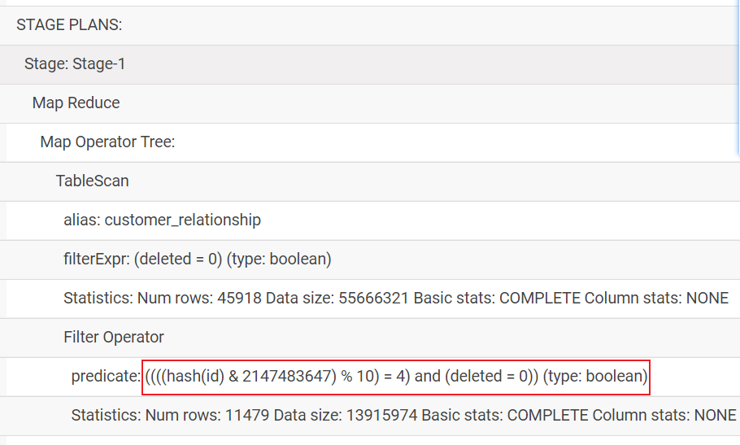

# 教育项目-意向客户咨询主题看板

## 1. 意向客户咨询主题看板_需求分析

### 1-1 总意向量

* 需求一: 计期内，新增意向客户（包含自己录入的意向客户）总数。

```properties
指标: 意向量
维度:
   时间维度 : 年 月 天 小时
   新老维度
   线上线下

涉及到表:  customer_relationship (意向表)
   
涉及到字段:
	时间维度:  create_date_time
		转换操作:  将时间 转换为 yearinfo monthinfo dayinfo hourinfo
    指标字段: customer_id
        先去重, 然后进行count统计  
        发现后续再进行建模过程中, 在DWM层无法执行提前聚合操作

```

### 1-2 各个区域意向量

* 需求二:  统计指定时间段内，新增的意向客户，所在城市区域人数热力图。

```properties
指标: 意向量
维度:
    时间维度:  年 月  天 小时
    新老维度
    线上线下
    地区(区域)维度:

涉及到表: customer_relationship(意向表) 和 customer(客户表)

涉及到字段:
   customer_relationship:
   		时间维度:   
   		     create_date_time
   		指标字段: 
   		     customer_id
   customer
       地区维度:  area

关联条件: 
    意向表.customer_id = 客户表.id
     
```

### 1-3 各个学科意向量

* 需求三: 统计指定时间段内，新增的意向客户中，意向学科人数排行榜。学科名称要关联查询出来。

```properties
指标:  意向量
维度: 
    时间维度: 年 月 天 小时
    新老维度:
    线上线下:
    学科维度:

涉及到表:  customer_relationship(意向表)  和  customer_clue(线索表) 和 itcast_subject(学科表)
涉及到字段: 
    customer_relationship(意向表) :
    	线上线下维度: origin_type 
    	    判断依据:  当这个字段的值 等于 NETSERVICE 或者 PRESIGNUP 都认为线上, 否则为线下
    	    此处可以有转换操作: 将 origin_type 转换为 origin_type_stat
    	        新的字段只会有二个字段  1(线上)  和 0(线下)
    	时间维度: create_date_time
    	学科维度:  itcast_subject_id
    	    说明: 此字段在进行操作, 如果字段为 0 或者 null 需要统一转换为 -1 (转换操作)
    	指标字段: customer_id
    customer_clue(线索表) :
       新老维度:  clue_stat
           判断依据: 当这个字段 的值为  VALID_NEW_CUES 认为是新客户, 其余其他的就是老客户
           此处可以有转换操作:  将clue_state转换为clue_state_stat字段
              新的字段只会有两个结果  1(新客户)  和  0(老客户)
       清洗操作:  deleted (将标记为删除的数据进行过滤掉)
    itcast_subject(学科表)
        学科名称: name
关联条件: 3个表  关联条件至少应该有 2个
   意向表.itcast_subject_id = 学科表.id
   线索表.customer_relationship_id = 意向表.id
```

### 1-4 各个校区意向量

* 需求四: 统计指定时间段内，新增的意向客户中，意向校区人数排行榜。

```properties
指标: 意向量
维度: 
	时间维度 : 年 月  天 小时
	新老维度
	线上线下
	校区维度

涉及到表: customer_relationship(意向表)  和  customer_clue(线索表) 和 itcast_school(校区表)

涉及到字段: 
    customer_relationship(意向表) :
    	线上线下维度: origin_type 
    	    判断依据:  当这个字段的值 等于 NETSERVICE 或者 PRESIGNUP 都认为线上, 否则为线下
    	    此处可以有转换操作: 将 origin_type 转换为 origin_type_stat
    	        新的字段只会有二个字段  1(线上)  和 0(线下)
    	时间维度: create_date_time
    	校区维度:  itcast_school_id
    	   说明: 此字段在进行操作, 如果字段为 0 或者 null 需要统一转换为 -1 (转换操作)
    	指标字段: customer_id
    customer_clue(线索表) :
       新老维度:  clue_stat
           判断依据: 当这个字段 的值为  VALID_NEW_CUES 认为是新客户, 其余其他的就是老客户
           此处可以有转换操作:  将clue_state转换为clue_state_stat字段
              新的字段只会有两个结果  1(新客户)  和  0(老客户)
       清洗操作:  将标记为删除的数据进行过滤掉
	itcast_school(校区表):
	   校区名称: name

关联条件:
    意向表.itcast_school_id =  校区表.id
    线索表.customer_relationship_id = 意向表.id
    
```

### 1-5 各个来源渠道意向量

* 需求五:  统计指定时间段内，新增的意向客户中，不同来源渠道的意向客户占比

```properties
指标: 意向量

维度:
   时间维度: 年 月 天 小时
   新老维度
   线上线下维度
   来源渠道维度

涉及到表: customer_relationship(意向表) 和 customer_clue(线索表)

涉及到字段:
     customer_relationship(意向表)
     	时间维度: create_date_time
     	线上线下: origin_type 需要转换为 origin_type_stat
     	来源渠道维度: origin_type
     	指标字段:  customer_id
     customer_clue(线索表)
         新老维度:  clue_state 需要转换为  clue_state_stat
         清洗操作:  过滤掉已经标记删除的数据
关联条件:
     线索表.customer_relationship_id = 意向表.id

```

### 1-6 各个咨询中心意向量

* 需求六  : 统计指定时间段内，新增的意向客户中，各咨询中心产生的意向客户数占比情况。

```properties
指标: 意向量
维度: 
	时间维度 : 年 月 天 小时
	新老维度
	线上线下
	各咨询中心维度:

涉及表: customer_relationship(意向表)  和  employee(员工表) 和 scrm_department(部门表) 和  customer_clue(线索表)
   
涉及到字段:
     customer_relationship(意向表)
        	时间维度: create_date_time
        	线上线下: origin_type --> origin_type_stat
        	指标字段: customer_id
     employee(员工表)
           咨询中心维度:  tdepart_id
     scrm_department(部门表)
           咨询中心名称: name
     customer_clue(线索表) :
         新老维度:  clue_state  --> clue_state_stat

关联条件:
    意向表.creator =  员工表.id
    员工表.tdepart_id =  部门表.id
    线索表.customer_relationship_id = 意向表.id
```


### 1-7 意向总结:

```properties
指标: 意向量 (也就意味着在DWS层只有一个表即可)

维度: 
   固有维度:
      时间维度: 年 月 天 小时
      线上线下
      新老维度
   产品属性维度:
      地区维度
      校区维度
      学科维度
      来源渠道维度
      各咨询中心维度
      总意向量 (只按照 固有维度统计出来的即为总意向量)

涉及到表:  
    customer_relationship(意向表) , 
    customer_clue(线索表) , 
    customer(客户表) ,
    itcast_subject(学科表) 
    itcast_school(校区表), 
    employee(员工表) , 
    scrm_department(部门表)

七个表的关联条件(至少6个条件):
    意向表.customer_id = 客户表.id
    意向表.itcast_subject_id = 学科表.id
    意向表.itcast_school_id =  校区表.id
    意向表.creator =  员工表.id
    员工表.tdepart_id =  部门表.id
    线索表.customer_relationship_id = 意向表.id

涉及到字段: 
   customer_relationship(意向表)  -- 事实表
       指标字段: customer_id
       时间维度: create_date_time --> yearinfo monthinfo dayinfo hourinfo
       线上线下: origin_type_stat --> 通过origin_type字段转换而来的  
       校区维度: itcast_school_id   -->	如果字段为 0 或者 null 需要统一转换为 -1 (转换操作)
       学科维度: itcast_subject_id	-->	如果字段为 0 或者 null 需要统一转换为 -1 (转换操作)
       来源渠道维度: origin_type
       员工id : creator
       
   customer_clue(线索表)
       新老维度: clue_stat_stat  --> 通过 clue_stat字段来转换而来的
       清洗字段: delete
   customer(客户表)
       地区维度: area
   itcast_subject(学科表) 
       学科名称: name
   itcast_school(校区表)
       校区名称: name
   employee(员工表)
       咨询中心维度: tdepart_id
   scrm_department(部门表)
       咨询中心名称: name

整理需要转换和清洗的操作:
   清洗操作:
       将标记为删除的数据进行清洗
   转换操作:
       1) 将origin_type 转换后(上卷) 得到  origin_type_stat(线上线下)
       2) 将clue_state 转换为  clue_state_stat(新老维度)
       3) 将校区id 为 0 或者 null 转换为 -1
       4) 将学科id 为 0  或者 ull 转换为 -1
       5) 将create_date_time 转换为 yearinfo monthinfo dayinfo hourinfo

```

## 2. 意向客户主题看板_建模分析

```properties
涉及到表:
    事实表: 
    customer_relationship(意向表) 
    
    维度表:
       customer_clue(线索表) , customer(客户表) ,itcast_subject(学科表) 
       itcast_school(校区表), employee(员工表) , scrm_department(部门表)
```


### ODS层:

```properties
共计为两个表:  
    意向表 (事实表)
    线索表 (下一个主题的事实表)

注意: 
    产品告知, 用户的意向信息 和 线索信息在时间增长的过程中, 数据可能会发生改变
    意向表和线索表, 数据量比较大. 后期需要进行join工作 (后期构建分桶表实施优化操作)

思考: 如何维护历史变化的数据呢?  缓慢渐变维来处理 SCD1  SCD2  SCD3
   此处一般选择 SCD2 (拉链表)


所以说: 在ODS层建表的时候, 都需要构建为拉链表, 此时表中比原有业务端表要多两个字段 start_time(抽取时间) 和 end_time

而且表建议采用内部表


思考: 第一次抽取过来的数据, 都是有效的时间, 后续再抽取的时候, 如果有变更, 才认为之前数据过期
   第一次抽取, end_time设置值为多少呢? 9999-12-31

```

### DW层:

#### DWD: 明细层

* 作用:  清洗转换操作  和 少量维度退化操作(维度退化不需要做)
* 需要清洗什么, 以及需要转换什么

```properties
DWD层表字段组合:  清洗字段 + 转换后的字段 + 事实表必须要的字段 +事实表和其他表关联字段

整理需要转换和清洗的操作:
   清洗操作:
       将标记为删除的数据进行清洗  delete
   转换操作:
       1) 将origin_type 转换后(上卷) 得到  origin_type_stat(线上线下)
       2) 将clue_state 转换为  clue_state_stat(新老维度) -- 不能在这个搞, 因为这个字段在维度表中
       3) 将校区id 为 0 或者 null 转换为 -1
       4) 将学科id 为 0  或者 ull 转换为 -1
       5) 将create_data_time 转换为 yearinfo monthinfo dayinfo hourinfo
       

表字段: 
    id,(意向表ID)
    customer_id, 
    create_date_time,
    origin_type ,
    creator
    delete, 
    origin_type_stat , 
    itcast_school_id ,
    itcast_subject_id,
	转换后的字段
		yearinfo monthinfo dayinfo hourinfo

```

#### DWM: 中间层

* 作用: 维度退化 和 提前聚合操作(当下主题无法实施)

```properties
说明: 在DWM层, 将会进行 七表关联操作, 实施维度退化过程, 将维度表相关的字段 全部合并汇总到一个表中 

表的组成: 将指标字段 + 维度字段 合并在一起即可


customer_id,  
create_date_time , 
origin_type_stat ,
clue_state_stat,
area , 
itcast_school_id,itcast_school_name,
itcast_subject_id,itcast_subject_name,
origin_type, 
tdepart_id,tdepart_name,
yearinfo,monthinfo,dayinfo,hourinfo


说明:  
    clue_state_stat: 需要关联线索表, 进行转换获取
    area : 需要关联地区表
    itcast_school_name : 关联 校区表
    itcast_subject_name : 关联 学科表
    tdepart_id : 需要关联员工表
    tdepart_name: 需要关联部门表

```

#### DWS: 业务层

* 作用: 基于各个细化维度统计指标数据
* 相关的表字段

```properties
表组成: 统计字段 + 各个维度字段 + 三个查询字段(time_Str,group_type,time_type)

最终: 
customerid_total 
origin_type_stat ,
clue_state_stat,
area , 
itcast_school_id,itcast_school_name,
itcast_subject_id,itcast_subject_name,
origin_type, 
tdepart_id,tdepart_name,
hourinfo,
time_Str,
group_type,
time_type,
yearinfo,monthinfo,dayinfo 
```

### APP 层:

### DIM: 维表层

```properties
 最终放置为 5个表, 每个表多一个starts_time字段 表示抽取的时间
 
  customer(客户表) ,
  itcast_subject(学科表) 
  itcast_school(校区表),
  employee(员工表) , 
  scrm_department(部门表)
```


## 3. 业务库初始化 

* 建库语句(mysql中)

```SQL
create database scrm default character set utf8mb4 collate utf8mb4_unicode_ci;
```

* 导入七个表的数据


## 4. 意向客户主题看板_建模操作

### 4.1 hive的分桶表

* hive的分桶表:

​      <span style="color:red;background:white;font-size:20px;font-family:楷体;">**分文件的**</span>, 在建表的时候, 设置分桶的字段, 和分桶的数量, 这样在添加的数据的时候, MR就会根据分桶字段, 将数据划分(hash取模)为多个不同的文件中, 文件的数量取决于分桶的数量, 是一种更细粒度的划分操作


- 分桶规则：
  - HIVE对key的hash值除bucket个数取余数，保证数据均匀随机分布在所有bucket里。

    

- 分桶和分区的区别

  - 分桶对数据的处理比分区更加细粒度化：<span style="color:red;background:white;font-size:20px;font-family:楷体;">**分区针对的是数据的存储路径；分桶针对的是数据文件；**</span>
  - <span style="color:blue;background:white;font-size:20px;font-family:楷体;">**分桶是按照列的哈希函数进行分割的**</span>，相对比较平均；而分区是按照列的值来进行分割的，容易造成数据倾斜；
  - 分桶和分区两者不干扰，可以把分区表进一步分桶。

  

* 如何来构建一个分桶表呢?

```sql
create table test_buck(id int, name string)
clustered by(id)  sorted by (id asc) into 6 buckets   -- 构建分桶表的核心语法
row format delimited fields terminated by '\t';

CLUSTERED BY 	来指定划分桶所用列；
SORTED BY    	对桶中的一个或多个列进行排序；
into 6 buckets	指定划分桶的个数。

```

* 如何向桶表添加数据呢?

```properties
需求: 有一个文本文件, 需要将这个文本文件中数据添加到桶表中, 如何做呢?

第一步: 根据这个桶表中字段, 创建一个相似的临时表(一定不是一个桶表)
第二步: 将数据先添加到临时表
     load data .....
第三步: 从临时表 将数据 查询出来, 然后添加到桶表中:
    insert into table  桶表表名  +  select  临时表 ...
    

注意项:
  如果 hive采用的 apache版本hive , 分桶表也是支持通过 load data方式直接添加的, 只不过没有分桶的样子
        但是对于CDH版本的HIVE, 不允许采用load data的方式, 因为在CDH版本加入了配置项, 约束此操作
        set hive.enforce.bucketing=true;  -- 启动桶表  
        set hive.strict.checks.bucketing = true; -- 限制桶表使用load data方式添加数据   默认为true


```


* 分桶表有什么作用呢?

```properties
1) 数据抽样(采样)
   场景一: 如果需要分析的数据量比较庞大, 在检查的SQL是否OK, 如果直接在这个大表进行检测, 可能导致运行时间会非常的长, 不方便测试, 可以从大量数据中, 随机采样出一部分来, 进行操作测试;
   场景二: 数据可行性分析;
   场景三: 有时候不需要计算出精确的结果, 只需要计算比率, 浮动率 .., 此时也完全没必要对整个数据进行处理, 只需要抽样出一部分来, 进行分析得比例即可;
   
2) 单表提升查询的效率:
	前提条件: 查询条件必须是分桶字段;
	
3) 两张表join提升查询效率:
	前提条件: 1- 两张表分桶字段为同一个字段; 2- join 条件就是这个分桶字段;
	一般情况: 表A 根据 id 字段分桶， 表B 根据外键B.Aid 字段分桶;
```


#### 4.1.1 如何进行数据采样操作

* 采样(抽样)函数 :  <span style="color:red;background:white;font-size:20px;font-family:楷体;">**tablesample( bucket x out of y  [on column]   )**</span>

```properties
参数说明:
   x:  从第几个桶开始抽样
   y:  抽样的比例
   column: 抽样的字段 (一般为分桶字段)

函数使用的位置:  紧紧跟在需要采样的表后面 , 如果表有别名, 需要放置在别名的前面

注意:
   1) y的值必须的表分桶数量的倍数或者因子
   2) x的值不能大于 y的值
   
案例:  假设有一个表A  , 有10个桶
   select  * from A tablesample(bucket 3 out of 5 on id)   as tmp;
请思考: 会抽取出几个桶, 抽的是哪几桶呢? 
   抽取几个桶:  总桶数 / y    10 /5 = 2 
   抽的是哪几个桶呢?  从第3个桶, 要抽2个桶, 第一个桶为 第三个, 第二桶为:  x+y的值 : 8
        3, 8 
   
   select  * from A tablesample(bucket 5 out of 10 on id);
   
请思考: 会抽取出几个桶, 抽的是哪几桶呢? 
   抽取的是 1个桶,  抽的是第五个桶

   select  * from A tablesample(bucket 2 out of 2 on id);

请思考: 会抽取出几个桶, 抽的是哪几桶呢? 
   抽取5个桶,  抽的是:  2  4  6  8  10
 
```

#### 4.1.2 如何进行join的优化操作

思考: 编写表与表 join 之后,  hive 翻译后的MR , 会如何进行join操作呢?  

- reduce端join过程
  - 缺点：
    - 效率低；
    - reduce工作量太大容易宕机；
    - 数据倾斜严重；


思考: 如何进行优化呢? 

- map端join过程


注意：<span style="color:red;background:white;font-size:20px;font-family:楷体;">**Map join可能报错Execution failed with exit status: 137**</span>

​	

原因:

```
可能是由于服务器内存不足引起的, 在进行mapJoin时候, 内存不足以放下小表中的数据
```

解决方案:

```
set hive.auto.convert.join= false;
```


##### map join方案

* 小表和大表进行join:

  * 解决方案:  通过 map join 即可解决
  * 如何开启map join呢? 使用要求:

  ```properties
  1) 	set hive.auto.convert.join=true;  -- 是否开启 map join 工作
  2)  set hive.auto.convert.join.noconditionaltask.size=512000000;  -- 设置小表临界值大小 默认值: 20M
  ```

  * 说明: map join 不局限与任何类型表

  
  
* 不等连接

  ​		mapjoin还有一个很大的好处是能够进行不等连接的join操作，如果将不等条件写在where中，那么mapreduce过程中会进行笛卡尔积，运行效率特别低，如果使用mapjoin操作，在map的过程中就完成了不等值的join操作，效率会高很多。

  ``` sql
  select A.a ,A.b from A join B where A.a>B.a
  ```

  


##### bucket map join方案（分桶）

- 原理：

  ​		两个表join的时候，<span style="color:red;background:white;font-size:20px;font-family:楷体;">**小表不足以放到内存中**</span>，但是又想用map side join这个时候就要用到bucket Map join。其方法是两个join表在join key上都做<span style="color:red;background:white;font-size:20px;font-family:楷体;">**hash bucket**</span>，并且把你打算复制的那个（相对）<span style="color:red;background:white;font-size:20px;font-family:楷体;">**小表的bucket数设置为大表的倍数**</span>。这样数据就会按照key join，做hash bucket。小表依然复制到所有节点，Map join的时候，小表的每一组bucket加载成hashtable，与对应的一个大表bucket做<span style="color:red;background:white;font-size:20px;font-family:楷体;">**局部join**</span>，这样每次只需要加载部分hashtable就可以了;


* 中型表和大表进行join:

  * 解决方案:  bucket map join

  * 使用要求:

  ```properties
  1）必须开启bucket map join支持:  set hive.optimize.bucketmapjoin = true;
  2）一个表的bucket数是另一个表bucket数的整数倍
  3）bucket列 == join列
  4）必须是应用在map join的场景中
  5) 表必须是分桶表
  ```

  


##### SMB(Sort  merge Bucket) Map join方案

* 大表和大表进行join

  * 解决方案:  SMB(Sort  merge Bucket) Map join
  * 满足条件:

  ``` properties
  1）必须开启bucket map join支持:  set hive.optimize.bucketmapjoin = true;
  2）一个表的bucket数等于另一个表bucket数
  3）bucket列 == join列 == sort列
  4）必须是应用在bucket map join的场景中
  5) 表必须是分桶表
  
  
  ```

  

##### bucket mapjoin 与SMB对比

| **bucket mapjoin**                          | **SMB join**                                                 |
| ------------------------------------------- | ------------------------------------------------------------ |
| set hive.optimize.bucketmapjoin = true;<br> | set hive.enforce.sorting=true;<br>set hive.optimize.bucketmapjoin = true;<br>set hive.auto.convert.sortmerge.join=true;<br>set hive.auto.convert.sortmerge.join.noconditionaltask=true;<br>set hive.optimize.bucketmapjoin.sortedmerge=true |
| 一个表的bucket数是另一个表bucket数的整数倍  | 小表的bucket数 **=** 大表bucket数                            |
| bucket列 == join列                          | Bucket 列 == Join 列 == **sort 列**                          |
| 必须是应用在map join的场景中                | 必须是应用在bucket mapjoin 的场景中                          |


##### 总结：

``` properties
-- 启动桶表  
set hive.enforce.bucketing=true;

-- 保证必须进行强制排序操作
set hive.enforce.sorting=true;

-- 是否开启 map join 工作
set hive.auto.convert.join=true;  
-- 设置小表临界值大小 默认值: 20M
set hive.auto.convert.join.noconditionaltask.size=512000000;  

-- 开启 bucket map join
set hive.optimize.bucketmapjoin = true;

-- 开启 SMB join
set hive.auto.convert.sortmerge.join=true;
set hive.auto.convert.sortmerge.join.noconditionaltask=true;

-- 是否自动尝试使用SMB join 连接   可以直接在CM中配置
set hive.optimize.bucketmapjoin.sortedmerge = true;


如何保证, 分桶表中,按照分桶字段进行排序呢?
第一步: 建表的时候
create table test_smb_2(mid string,age_id string)
CLUSTERED BY(mid) SORTED BY(mid) INTO 500 BUCKETS;

第二步: --写入数据强制排序
set hive.enforce.sorting=true;
```


### 4.2 建模操作

#### ODS层: 

##### customer_relationship表

```sql
set hive.exec.orc.compression.strategy=COMPRESSION;
-- 意向表:
CREATE TABLE IF NOT EXISTS itcast_ods.`customer_relationship` (
  `id` int COMMENT '客户关系id',
  `create_date_time` STRING COMMENT '创建时间',
  `update_date_time` STRING COMMENT '最后更新时间',
  `deleted` int COMMENT '是否被删除（禁用）',
  `customer_id` int COMMENT '所属客户id',
  `first_id` int COMMENT '第一条客户关系id',
  `belonger` int COMMENT '归属人',
  `belonger_name` STRING COMMENT '归属人姓名',
  `initial_belonger` int COMMENT '初始归属人',
  `distribution_handler` int COMMENT '分配处理人',
  `business_scrm_department_id` int COMMENT '归属部门',
  `last_visit_time` STRING COMMENT '最后回访时间',
  `next_visit_time` STRING COMMENT '下次回访时间',
  `origin_type` STRING COMMENT '数据来源',
  `itcast_school_id` int COMMENT '校区Id',
  `itcast_subject_id` int COMMENT '学科Id',
  `intention_study_type` STRING COMMENT '意向学习方式',
  `anticipat_signup_date` STRING COMMENT '预计报名时间',
  `level` STRING COMMENT '客户级别',
  `creator` int COMMENT '创建人',
  `current_creator` int COMMENT '当前创建人：初始==创建人，当在公海拉回时为 拉回人',
  `creator_name` STRING COMMENT '创建者姓名',
  `origin_channel` STRING COMMENT '来源渠道',
  `comment` STRING COMMENT '备注',
  `first_customer_clue_id` int COMMENT '第一条线索id',
  `last_customer_clue_id` int COMMENT '最后一条线索id',
  `process_state` STRING COMMENT '处理状态',
  `process_time` STRING COMMENT '处理状态变动时间',
  `payment_state` STRING COMMENT '支付状态',
  `payment_time` STRING COMMENT '支付状态变动时间',
  `signup_state` STRING COMMENT '报名状态',
  `signup_time` STRING COMMENT '报名时间',
  `notice_state` STRING COMMENT '通知状态',
  `notice_time` STRING COMMENT '通知状态变动时间',
  `lock_state` STRING COMMENT '锁定状态',
  `lock_time` STRING COMMENT '锁定状态修改时间',
  `itcast_clazz_id` int COMMENT '所属ems班级id',
  `itcast_clazz_time` STRING COMMENT '报班时间',
  `payment_url` STRING COMMENT '付款链接',
  `payment_url_time` STRING COMMENT '支付链接生成时间',
  `ems_student_id` int COMMENT 'ems的学生id',
  `delete_reason` STRING COMMENT '删除原因',
  `deleter` int COMMENT '删除人',
  `deleter_name` STRING COMMENT '删除人姓名',
  `delete_time` STRING COMMENT '删除时间',
  `course_id` int COMMENT '课程ID',
  `course_name` STRING COMMENT '课程名称',
  `delete_comment` STRING COMMENT '删除原因说明',
  `close_state` STRING COMMENT '关闭装填',
  `close_time` STRING COMMENT '关闭状态变动时间',
  `appeal_id` int COMMENT '申诉id',
  `tenant` int COMMENT '租户',
  `total_fee` DECIMAL COMMENT '报名费总金额',
  `belonged` int COMMENT '小周期归属人',
  `belonged_time` STRING COMMENT '归属时间',
  `belonger_time` STRING COMMENT '归属时间',
  `transfer` int COMMENT '转移人',
  `transfer_time` STRING COMMENT '转移时间',
  `follow_type` int COMMENT '分配类型，0-自动分配，1-手动分配，2-自动转移，3-手动单个转移，4-手动批量转移，5-公海领取',
  `transfer_bxg_oa_account` STRING COMMENT '转移到博学谷归属人OA账号',
  `transfer_bxg_belonger_name` STRING COMMENT '转移到博学谷归属人OA姓名',
  `end_time` STRING COMMENT '有效截止时间')
comment '客户关系表'
PARTITIONED BY(start_time STRING)
clustered by(id) sorted by(id) into 10 buckets
ROW FORMAT DELIMITED
FIELDS TERMINATED BY '\t'
stored as orc
TBLPROPERTIES ('orc.compress'='ZLIB');

```

##### customer_clue表

``` sql
-- 线索表
CREATE TABLE IF NOT EXISTS itcast_ods.customer_clue (
  id int COMMENT 'customer_clue_id',
  create_date_time STRING COMMENT '创建时间',
  update_date_time STRING COMMENT '最后更新时间',
  deleted STRING COMMENT '是否被删除（禁用）',
  customer_id int COMMENT '客户id',
  customer_relationship_id int COMMENT '客户关系id',
  session_id STRING COMMENT '七陌会话id',
  sid STRING COMMENT '访客id',
  status STRING COMMENT '状态（undeal待领取 deal 已领取 finish 已关闭 changePeer 已流转）',
  users STRING COMMENT '所属坐席',
  create_time STRING COMMENT '七陌创建时间',
  platform STRING COMMENT '平台来源 （pc-网站咨询|wap-wap咨询|sdk-app咨询|weixin-微信咨询）',
  s_name STRING COMMENT '用户名称',
  seo_source STRING COMMENT '搜索来源',
  seo_keywords STRING COMMENT '关键字',
  ip STRING COMMENT 'IP地址',
  referrer STRING COMMENT '上级来源页面',
  from_url STRING COMMENT '会话来源页面',
  landing_page_url STRING COMMENT '访客着陆页面',
  url_title STRING COMMENT '咨询页面title',
  to_peer STRING COMMENT '所属技能组',
  manual_time STRING COMMENT '人工开始时间',
  begin_time STRING COMMENT '坐席领取时间 ',
  reply_msg_count int COMMENT '客服回复消息数',
  total_msg_count int COMMENT '消息总数',
  msg_count int COMMENT '客户发送消息数',
  comment STRING COMMENT '备注',
  finish_reason STRING COMMENT '结束类型',
  finish_user STRING COMMENT '结束坐席',
  end_time STRING COMMENT '会话结束时间',
  platform_description STRING COMMENT '客户平台信息',
  browser_name STRING COMMENT '浏览器名称',
  os_info STRING COMMENT '系统名称',
  area STRING COMMENT '区域',
  country STRING COMMENT '所在国家',
  province STRING COMMENT '省',
  city STRING COMMENT '城市',
  creator int COMMENT '创建人',
  name STRING COMMENT '客户姓名',
  idcard STRING COMMENT '身份证号',
  phone STRING COMMENT '手机号',
  itcast_school_id int COMMENT '校区Id',
  itcast_school STRING COMMENT '校区',
  itcast_subject_id int COMMENT '学科Id',
  itcast_subject STRING COMMENT '学科',
  wechat STRING COMMENT '微信',
  qq STRING COMMENT 'qq号',
  email STRING COMMENT '邮箱',
  gender STRING COMMENT '性别',
  level STRING COMMENT '客户级别',
  origin_type STRING COMMENT '数据来源渠道',
  information_way STRING COMMENT '资讯方式',
  working_years STRING COMMENT '开始工作时间',
  technical_directions STRING COMMENT '技术方向',
  customer_state STRING COMMENT '当前客户状态',
  valid STRING COMMENT '该线索是否是网资有效线索',
  anticipat_signup_date STRING COMMENT '预计报名时间',
  clue_state STRING COMMENT '线索状态',
  scrm_department_id int COMMENT 'SCRM内部部门id',
  superior_url STRING COMMENT '诸葛获取上级页面URL',
  superior_source STRING COMMENT '诸葛获取上级页面URL标题',
  landing_url STRING COMMENT '诸葛获取着陆页面URL',
  landing_source STRING COMMENT '诸葛获取着陆页面URL来源',
  info_url STRING COMMENT '诸葛获取留咨页URL',
  info_source STRING COMMENT '诸葛获取留咨页URL标题',
  origin_channel STRING COMMENT '投放渠道',
  course_id int COMMENT '课程编号',
  course_name STRING COMMENT '课程名称',
  zhuge_session_id STRING COMMENT 'zhuge会话id',
  is_repeat int COMMENT '是否重复线索(手机号维度) 0:正常 1：重复',
  tenant int COMMENT '租户id',
  activity_id STRING COMMENT '活动id',
  activity_name STRING COMMENT '活动名称',
  follow_type int COMMENT '分配类型，0-自动分配，1-手动分配，2-自动转移，3-手动单个转移，4-手动批量转移，5-公海领取',
  shunt_mode_id int COMMENT '匹配到的技能组id',
  shunt_employee_group_id int COMMENT '所属分流员工组',
  ends_time STRING COMMENT '有效时间')
comment '客户关系表'
PARTITIONED BY(starts_time STRING)
clustered by(customer_relationship_id) sorted by(customer_relationship_id) into 10 buckets
ROW FORMAT DELIMITED
FIELDS TERMINATED BY '\t'
stored as orc
TBLPROPERTIES ('orc.compress'='ZLIB');

```


#### DIM层: 

``` sql
CREATE DATABASE IF NOT EXISTS itcast_dimen;
```


##### customer表

``` sql

-- 客户表
CREATE TABLE IF NOT EXISTS itcast_dimen.`customer` (
  `id` int COMMENT 'key id',
  `customer_relationship_id` int COMMENT '当前意向id',
  `create_date_time` STRING COMMENT '创建时间',
  `update_date_time` STRING COMMENT '最后更新时间',
  `deleted` int  COMMENT '是否被删除（禁用）',
  `name` STRING COMMENT '姓名',
  `idcard` STRING  COMMENT '身份证号',
  `birth_year` int COMMENT '出生年份',
  `gender` STRING COMMENT '性别',
  `phone` STRING COMMENT '手机号',
  `wechat` STRING COMMENT '微信',
  `qq` STRING COMMENT 'qq号',
  `email` STRING COMMENT '邮箱',
  `area` STRING COMMENT '所在区域',
  `leave_school_date` date COMMENT '离校时间',
  `graduation_date` date COMMENT '毕业时间',
  `bxg_student_id` STRING COMMENT '博学谷学员ID，可能未关联到，不存在',
  `creator` int COMMENT '创建人ID',
  `origin_type` STRING COMMENT '数据来源',
  `origin_channel` STRING COMMENT '来源渠道',
  `tenant` int,
  `md_id` int COMMENT '中台id')
comment '客户表'
PARTITIONED BY(start_time STRING)
ROW FORMAT DELIMITED 
FIELDS TERMINATED BY '\t'
stored as orc
TBLPROPERTIES ('orc.compress'='SNAPPY');
```

##### itcast_school表

``` sql

-- 校区表
CREATE TABLE IF NOT EXISTS itcast_dimen.`itcast_school` (
  `id` int COMMENT '自增主键',
  `create_date_time` timestamp COMMENT '创建时间',
  `update_date_time` timestamp  COMMENT '最后更新时间',
  `deleted` STRING COMMENT '是否被删除（禁用）',
  `name` STRING COMMENT '校区名称',
  `code` STRING COMMENT '校区标识',
  `tenant` int COMMENT '租户')
comment '校区字典表'
PARTITIONED BY(start_time STRING)
ROW FORMAT DELIMITED 
FIELDS TERMINATED BY '\t'
stored as orc
TBLPROPERTIES ('orc.compress'='SNAPPY');

```

##### itcast_subject表

``` sql
-- 学科表
CREATE TABLE IF NOT EXISTS itcast_dimen.`itcast_subject` (
  `id` int COMMENT '自增主键',
  `create_date_time` timestamp COMMENT '创建时间',
  `update_date_time` timestamp COMMENT '最后更新时间',
  `deleted` STRING COMMENT '是否被删除（禁用）',
  `name` STRING COMMENT '学科名称',
  `code` STRING COMMENT '学科编码',
  `tenant` int COMMENT '租户')
comment '学科字典表'
PARTITIONED BY(start_time STRING)
ROW FORMAT DELIMITED 
FIELDS TERMINATED BY '\t'
stored as orc
TBLPROPERTIES ('orc.compress'='SNAPPY');
```

##### employee表

``` sql

-- 员工表
CREATE TABLE IF NOT EXISTS itcast_dimen.employee (
  id int COMMENT '员工id',
  email STRING COMMENT '公司邮箱，OA登录账号',
  real_name STRING COMMENT '员工的真实姓名',
  phone STRING COMMENT '手机号，目前还没有使用；隐私问题OA接口没有提供这个属性，',
  department_id STRING COMMENT 'OA中的部门编号，有负值',
  department_name STRING COMMENT 'OA中的部门名',
  remote_login STRING COMMENT '员工是否可以远程登录',
  job_number STRING COMMENT '员工工号',
  cross_school STRING COMMENT '是否有跨校区权限',
  last_login_date STRING COMMENT '最后登录日期',
  creator int COMMENT '创建人',
  create_date_time STRING COMMENT '创建时间',
  update_date_time STRING COMMENT '最后更新时间',
  deleted STRING COMMENT '是否被删除（禁用）',
  scrm_department_id int COMMENT 'SCRM内部部门id',
  leave_office STRING COMMENT '离职状态',
  leave_office_time STRING COMMENT '离职时间',
  reinstated_time STRING COMMENT '复职时间',
  superior_leaders_id int COMMENT '上级领导ID',
  tdepart_id int COMMENT '直属部门',
  tenant int COMMENT '租户',
  ems_user_name STRING COMMENT 'ems用户名称'
)
comment '员工表'
PARTITIONED BY(start_time STRING)
ROW FORMAT DELIMITED
FIELDS TERMINATED BY '\t'
stored as orc
TBLPROPERTIES ('orc.compress'='SNAPPY');

```

##### scrm_department表

``` sql
-- 部门表
CREATE TABLE IF NOT EXISTS itcast_dimen.`scrm_department` (
  `id` int COMMENT '部门id',
  `name` STRING COMMENT '部门名称',
  `parent_id` int COMMENT '父部门id',
  `create_date_time` STRING COMMENT '创建时间',
  `update_date_time` STRING COMMENT '更新时间',
  `deleted` STRING COMMENT '删除标志',
  `id_path` STRING COMMENT '编码全路径',
  `tdepart_code` int COMMENT '直属部门',
  `creator` STRING COMMENT '创建者',
  `depart_level` int COMMENT '部门层级',
  `depart_sign` int COMMENT '部门标志，暂时默认1',
  `depart_line` int COMMENT '业务线，存储业务线编码',
  `depart_sort` int COMMENT '排序字段',
  `disable_flag` int COMMENT '禁用标志',
  `tenant` int COMMENT '租户')
comment 'scrm部门表'
PARTITIONED BY(start_time STRING)
ROW FORMAT DELIMITED
FIELDS TERMINATED BY '\t'
stored as orc
TBLPROPERTIES ('orc.compress'='SNAPPY');
```


#### DWD层:

##### itcast_intention_dwd表

```sql
CREATE TABLE IF NOT EXISTS itcast_dwd.`itcast_intention_dwd` (
  `rid` int COMMENT 'id',
  `customer_id` STRING COMMENT '客户id',
  `create_date_time` STRING COMMENT '创建时间',
  `itcast_school_id` STRING COMMENT '校区id',
  `deleted` STRING COMMENT '是否被删除',
  `origin_type` STRING COMMENT '来源渠道',
  `itcast_subject_id` STRING COMMENT '学科id',
  `creator` int COMMENT '创建人',
  `hourinfo` STRING COMMENT '小时信息',
  `origin_type_stat` STRING COMMENT '数据来源:0.线下；1.线上'
)
comment '客户意向dwd表'
PARTITIONED BY(yearinfo STRING,monthinfo STRING,dayinfo STRING)
clustered by(rid) sorted by(rid) into 10 buckets
ROW FORMAT DELIMITED 
FIELDS TERMINATED BY '\t'
stored as ORC
TBLPROPERTIES ('orc.compress'='SNAPPY');

```


#### DWM层

``` sql
create database IF NOT EXISTS  itcast_dwm;

```

##### itcast_intention_dwm表

```sql

CREATE TABLE IF NOT EXISTS itcast_dwm.`itcast_intention_dwm` (
  `customer_id` STRING COMMENT 'id信息',
  `create_date_time` STRING COMMENT '创建时间',
  `area` STRING COMMENT '区域信息',
  `itcast_school_id` STRING COMMENT '校区id',
  `itcast_school_name` STRING COMMENT '校区名称',
  `deleted` STRING COMMENT '是否被删除',
  `origin_type` STRING COMMENT '来源渠道',
  `itcast_subject_id` STRING COMMENT '学科id',
  `itcast_subject_name` STRING COMMENT '学科名称',
  `hourinfo` STRING COMMENT '小时信息',
  `origin_type_stat` STRING COMMENT '数据来源:0.线下；1.线上',
  `clue_state_stat` STRING COMMENT '新老客户：0.老客户；1.新客户',
  `tdepart_id` STRING COMMENT '创建者部门id',
  `tdepart_name` STRING COMMENT '咨询中心名称'
)
comment '客户意向dwm表'
PARTITIONED BY(yearinfo STRING,monthinfo STRING,dayinfo STRING)
clustered by(customer_id) sorted by(customer_id) into 10 buckets  -- 可以不建分桶表
ROW FORMAT DELIMITED
FIELDS TERMINATED BY '\t'
stored as ORC
TBLPROPERTIES ('orc.compress'='SNAPPY');

```


#### DWS层

##### itcast_intention_dws表

```sql
CREATE TABLE IF NOT EXISTS itcast_dws.itcast_intention_dws (
   `customer_total` INT COMMENT '聚合意向客户数',
   `area` STRING COMMENT '区域信息',
   `itcast_school_id` STRING COMMENT '校区id',
   `itcast_school_name` STRING COMMENT '校区名称',
   `origin_type` STRING COMMENT '来源渠道',
   `itcast_subject_id` STRING COMMENT '学科id',
   `itcast_subject_name` STRING COMMENT '学科名称',
   `hourinfo` STRING COMMENT '小时信息',
   `origin_type_stat` STRING COMMENT '数据来源:0.线下；1.线上',
   `clue_state_stat` STRING COMMENT '客户属性：0.老客户；1.新客户',
   `tdepart_id` STRING COMMENT '创建者部门id',
   `tdepart_name` STRING COMMENT '咨询中心名称',
   `time_str` STRING COMMENT '时间明细',
   `groupType` STRING COMMENT '产品属性类别：1.总意向量；2.区域信息；3.校区、学科组合分组；4.来源渠道；5.咨询中心;',
   `time_type` STRING COMMENT '时间维度：1、按小时聚合；2、按天聚合；3、按周聚合；4、按月聚合；5、按年聚合；'
)
comment '客户意向dws表'
PARTITIONED BY(yearinfo STRING,monthinfo STRING,dayinfo STRING)
ROW FORMAT DELIMITED
FIELDS TERMINATED BY '\t'
stored as orc
TBLPROPERTIES ('orc.compress'='SNAPPY');

```

## 5. 意向客户主题看板_数据采集

* 目的:  将 业务库(MySQL) 的数据导入到 Hive中
  * ODS两个表  +   DIM层 五个表
  * 技术:  sqoop

### 5.1 数据采集到ODS层

#### customer_relationship表

* 第一步： 创建 意向表的临时表:

```shell
CREATE TABLE IF NOT EXISTS itcast_ods.`customer_relationship_tmp` (
  `id` int COMMENT '客户关系id',
  `create_date_time` STRING COMMENT '创建时间',
  `update_date_time` STRING COMMENT '最后更新时间',
  `deleted` int COMMENT '是否被删除（禁用）',
  `customer_id` int COMMENT '所属客户id',
  `first_id` int COMMENT '第一条客户关系id',
  `belonger` int COMMENT '归属人',
  `belonger_name` STRING COMMENT '归属人姓名',
  `initial_belonger` int COMMENT '初始归属人',
  `distribution_handler` int COMMENT '分配处理人',
  `business_scrm_department_id` int COMMENT '归属部门',
  `last_visit_time` STRING COMMENT '最后回访时间',
  `next_visit_time` STRING COMMENT '下次回访时间',
  `origin_type` STRING COMMENT '数据来源',
  `itcast_school_id` int COMMENT '校区Id',
  `itcast_subject_id` int COMMENT '学科Id',
  `intention_study_type` STRING COMMENT '意向学习方式',
  `anticipat_signup_date` STRING COMMENT '预计报名时间',
  `level` STRING COMMENT '客户级别',
  `creator` int COMMENT '创建人',
  `current_creator` int COMMENT '当前创建人：初始==创建人，当在公海拉回时为 拉回人',
  `creator_name` STRING COMMENT '创建者姓名',
  `origin_channel` STRING COMMENT '来源渠道',
  `comment` STRING COMMENT '备注',
  `first_customer_clue_id` int COMMENT '第一条线索id',
  `last_customer_clue_id` int COMMENT '最后一条线索id',
  `process_state` STRING COMMENT '处理状态',
  `process_time` STRING COMMENT '处理状态变动时间',
  `payment_state` STRING COMMENT '支付状态',
  `payment_time` STRING COMMENT '支付状态变动时间',
  `signup_state` STRING COMMENT '报名状态',
  `signup_time` STRING COMMENT '报名时间',
  `notice_state` STRING COMMENT '通知状态',
  `notice_time` STRING COMMENT '通知状态变动时间',
  `lock_state` STRING COMMENT '锁定状态',
  `lock_time` STRING COMMENT '锁定状态修改时间',
  `itcast_clazz_id` int COMMENT '所属ems班级id',
  `itcast_clazz_time` STRING COMMENT '报班时间',
  `payment_url` STRING COMMENT '付款链接',
  `payment_url_time` STRING COMMENT '支付链接生成时间',
  `ems_student_id` int COMMENT 'ems的学生id',
  `delete_reason` STRING COMMENT '删除原因',
  `deleter` int COMMENT '删除人',
  `deleter_name` STRING COMMENT '删除人姓名',
  `delete_time` STRING COMMENT '删除时间',
  `course_id` int COMMENT '课程ID',
  `course_name` STRING COMMENT '课程名称',
  `delete_comment` STRING COMMENT '删除原因说明',
  `close_state` STRING COMMENT '关闭装填',
  `close_time` STRING COMMENT '关闭状态变动时间',
  `appeal_id` int COMMENT '申诉id',
  `tenant` int COMMENT '租户',
  `total_fee` DECIMAL COMMENT '报名费总金额',
  `belonged` int COMMENT '小周期归属人',
  `belonged_time` STRING COMMENT '归属时间',
  `belonger_time` STRING COMMENT '归属时间',
  `transfer` int COMMENT '转移人',
  `transfer_time` STRING COMMENT '转移时间',
  `follow_type` int COMMENT '分配类型，0-自动分配，1-手动分配，2-自动转移，3-手动单个转移，4-手动批量转移，5-公海领取',
  `transfer_bxg_oa_account` STRING COMMENT '转移到博学谷归属人OA账号',
  `transfer_bxg_belonger_name` STRING COMMENT '转移到博学谷归属人OA姓名',
  `end_time` STRING COMMENT '有效截止时间')
comment '客户关系表'
PARTITIONED BY(start_time STRING)
ROW FORMAT DELIMITED
FIELDS TERMINATED BY '\t'
stored as orc
TBLPROPERTIES ('orc.compress'='ZLIB');
```

* 第二步: 通过sqoop 先将数据导入到临时表

```shell
# ODS层:  意向表
sqoop import \
--connect jdbc:mysql://192.168.52.150:3306/scrm \
--username root \
--password 123456 \
--query "select id,
       create_date_time,
       update_date_time,
       deleted,
       customer_id,
       first_id,
       belonger,
       belonger_name,
       initial_belonger,
       distribution_handler,
       business_scrm_department_id,
       last_visit_time,
       next_visit_time,
       origin_type,
       itcast_school_id,
       itcast_subject_id,
       intention_study_type,
       anticipat_signup_date,
       level,
       creator,
       current_creator,
       creator_name,
       origin_channel,
       comment,
       first_customer_clue_id,
       last_customer_clue_id,
       process_state,
       process_time,
       payment_state,
       payment_time,
       signup_state,
       signup_time,
       notice_state,
       notice_time,
       lock_state,
       lock_time,
       itcast_clazz_id,
       itcast_clazz_time,
       payment_url,
       payment_url_time,
       ems_student_id,
       delete_reason,
       deleter,
       deleter_name,
       delete_time,
       course_id,
       course_name,
       delete_comment,
       close_state,
       close_time,
       appeal_id,
       tenant,
       total_fee,
       belonged,
       belonged_time,
       belonger_time,
       transfer,
       transfer_time,
       follow_type,
       transfer_bxg_oa_account,
       transfer_bxg_belonger_name,
       date_format('9999-12-31', '%Y-%m-%d')       as end_time,
       FROM_UNIXTIME(unix_timestamp(), '%Y-%m-%d') as start_time
from customer_relationship
 where 1=1 and \$CONDITIONS" \
--fields-terminated-by '\t' \
--hcatalog-database itcast_ods \
--hcatalog-table customer_relationship_tmp \
-m 1
```

* 第三步: 将临时表的数据加载到目标表: 意向表

```sql
--分区
SET hive.exec.dynamic.partition=true;
SET hive.exec.dynamic.partition.mode=nonstrict;
set hive.exec.max.dynamic.partitions.pernode=10000;
set hive.exec.max.dynamic.partitions=100000;
set hive.exec.max.created.files=150000;
--hive压缩
set hive.exec.compress.intermediate=true;
set hive.exec.compress.output=true;
--写入时压缩生效
set hive.exec.orc.compression.strategy=COMPRESSION;
--分桶
set hive.enforce.bucketing=true;
set hive.enforce.sorting=true;
set hive.optimize.bucketmapjoin = true;
set hive.auto.convert.sortmerge.join=true;
set hive.auto.convert.sortmerge.join.noconditionaltask=true;


insert into table itcast_ods.customer_relationship partition(start_time)
select * from itcast_ods.customer_relationship_tmp;
```

----

#### customer_clue表

* 第一步: 创建线索表的临时表

```sql
CREATE TABLE IF NOT EXISTS itcast_ods.customer_clue_tmp (
  id int COMMENT 'customer_clue_id',
  create_date_time STRING COMMENT '创建时间',
  update_date_time STRING COMMENT '最后更新时间',
  deleted STRING COMMENT '是否被删除（禁用）',
  customer_id int COMMENT '客户id',
  customer_relationship_id int COMMENT '客户关系id',
  session_id STRING COMMENT '七陌会话id',
  sid STRING COMMENT '访客id',
  status STRING COMMENT '状态（undeal待领取 deal 已领取 finish 已关闭 changePeer 已流转）',
  users STRING COMMENT '所属坐席',
  create_time STRING COMMENT '七陌创建时间',
  platform STRING COMMENT '平台来源 （pc-网站咨询|wap-wap咨询|sdk-app咨询|weixin-微信咨询）',
  s_name STRING COMMENT '用户名称',
  seo_source STRING COMMENT '搜索来源',
  seo_keywords STRING COMMENT '关键字',
  ip STRING COMMENT 'IP地址',
  referrer STRING COMMENT '上级来源页面',
  from_url STRING COMMENT '会话来源页面',
  landing_page_url STRING COMMENT '访客着陆页面',
  url_title STRING COMMENT '咨询页面title',
  to_peer STRING COMMENT '所属技能组',
  manual_time STRING COMMENT '人工开始时间',
  begin_time STRING COMMENT '坐席领取时间 ',
  reply_msg_count int COMMENT '客服回复消息数',
  total_msg_count int COMMENT '消息总数',
  msg_count int COMMENT '客户发送消息数',
  comment STRING COMMENT '备注',
  finish_reason STRING COMMENT '结束类型',
  finish_user STRING COMMENT '结束坐席',
  end_time STRING COMMENT '会话结束时间',
  platform_description STRING COMMENT '客户平台信息',
  browser_name STRING COMMENT '浏览器名称',
  os_info STRING COMMENT '系统名称',
  area STRING COMMENT '区域',
  country STRING COMMENT '所在国家',
  province STRING COMMENT '省',
  city STRING COMMENT '城市',
  creator int COMMENT '创建人',
  name STRING COMMENT '客户姓名',
  idcard STRING COMMENT '身份证号',
  phone STRING COMMENT '手机号',
  itcast_school_id int COMMENT '校区Id',
  itcast_school STRING COMMENT '校区',
  itcast_subject_id int COMMENT '学科Id',
  itcast_subject STRING COMMENT '学科',
  wechat STRING COMMENT '微信',
  qq STRING COMMENT 'qq号',
  email STRING COMMENT '邮箱',
  gender STRING COMMENT '性别',
  level STRING COMMENT '客户级别',
  origin_type STRING COMMENT '数据来源渠道',
  information_way STRING COMMENT '资讯方式',
  working_years STRING COMMENT '开始工作时间',
  technical_directions STRING COMMENT '技术方向',
  customer_state STRING COMMENT '当前客户状态',
  valid STRING COMMENT '该线索是否是网资有效线索',
  anticipat_signup_date STRING COMMENT '预计报名时间',
  clue_state STRING COMMENT '线索状态',
  scrm_department_id int COMMENT 'SCRM内部部门id',
  superior_url STRING COMMENT '诸葛获取上级页面URL',
  superior_source STRING COMMENT '诸葛获取上级页面URL标题',
  landing_url STRING COMMENT '诸葛获取着陆页面URL',
  landing_source STRING COMMENT '诸葛获取着陆页面URL来源',
  info_url STRING COMMENT '诸葛获取留咨页URL',
  info_source STRING COMMENT '诸葛获取留咨页URL标题',
  origin_channel STRING COMMENT '投放渠道',
  course_id int COMMENT '课程编号',
  course_name STRING COMMENT '课程名称',
  zhuge_session_id STRING COMMENT 'zhuge会话id',
  is_repeat int COMMENT '是否重复线索(手机号维度) 0:正常 1：重复',
  tenant int COMMENT '租户id',
  activity_id STRING COMMENT '活动id',
  activity_name STRING COMMENT '活动名称',
  follow_type int COMMENT '分配类型，0-自动分配，1-手动分配，2-自动转移，3-手动单个转移，4-手动批量转移，5-公海领取',
  shunt_mode_id int COMMENT '匹配到的技能组id',
  shunt_employee_group_id int COMMENT '所属分流员工组',
  ends_time STRING COMMENT '有效时间')
comment '客户关系表'
PARTITIONED BY(starts_time STRING)
ROW FORMAT DELIMITED
FIELDS TERMINATED BY '\t'
stored as orc
TBLPROPERTIES ('orc.compress'='ZLIB');

```

* 第二步: 创建sqoop命令, 执行导入临时表: 线索表

```shell
sqoop import \
--connect jdbc:mysql://192.168.52.150:3306/scrm \
--username root \
--password 123456 \
--query "select id,
       create_date_time,
       update_date_time,
       deleted,
       customer_id,
       customer_relationship_id,
       session_id,
       sid,
       status, user as users, create_time, platform, s_name, seo_source, seo_keywords, ip, referrer, from_url, landing_page_url, url_title, to_peer, manual_time, begin_time, reply_msg_count, total_msg_count, msg_count, comment, finish_reason, finish_user, end_time, platform_description, browser_name, os_info, area, country, province, city, creator, name, idcard, phone, itcast_school_id, itcast_school, itcast_subject_id, itcast_subject, wechat, qq, email, gender, level, origin_type, information_way, working_years, technical_directions, customer_state, valid, anticipat_signup_date, clue_state, scrm_department_id, superior_url, superior_source, landing_url, landing_source, info_url, info_source, origin_channel, course_id, course_name, zhuge_session_id, is_repeat, tenant, activity_id, activity_name, follow_type, shunt_mode_id, shunt_employee_group_id, 
       date_format('9999-12-31', '%Y-%m-%d') as ends_time,FROM_UNIXTIME(unix_timestamp(), '%Y-%m-%d') as starts_time
from customer_clue where 1=1 and \$CONDITIONS" \
--fields-terminated-by '\t' \
--hcatalog-database itcast_ods \
--hcatalog-table customer_clue_tmp \
-m 1
```

* 第三步: 将临时表 写入到目标表

```sql
--分区
SET hive.exec.dynamic.partition=true;
SET hive.exec.dynamic.partition.mode=nonstrict;
set hive.exec.max.dynamic.partitions.pernode=10000;
set hive.exec.max.dynamic.partitions=100000;
set hive.exec.max.created.files=150000;
--hive压缩
set hive.exec.compress.intermediate=true;
set hive.exec.compress.output=true;
--写入时压缩生效
set hive.exec.orc.compression.strategy=COMPRESSION;
--分桶
set hive.enforce.bucketing=true;
set hive.enforce.sorting=true;
set hive.optimize.bucketmapjoin = true;
set hive.auto.convert.sortmerge.join=true;
set hive.auto.convert.sortmerge.join.noconditionaltask=true;

insert into table itcast_ods.customer_clue partition(starts_time)
select * from itcast_ods.customer_clue_tmp;
```


### 5.2 数据采集到DIM层

* sqoop脚本命令:

#### customer表

``` sh
# DIM : 客户表 
sqoop import \
--connect jdbc:mysql://192.168.52.150:3306/scrm \
--username root \
--password 123456 \
--query "select  * , FROM_UNIXTIME(unix_timestamp(), '%Y-%m-%d') as start_time from customer where 1=1 and \$CONDITIONS" \
--fields-terminated-by '\t' \
--hcatalog-database itcast_dimen \
--hcatalog-table customer \
-m 1

```

#### employee表

``` shell
# DIM 员工表:
sqoop import \
--connect jdbc:mysql://192.168.52.150:3306/scrm \
--username root \
--password 123456 \
--query "select  * , FROM_UNIXTIME(unix_timestamp(), '%Y-%m-%d')  as start_time from employee where 1=1 and \$CONDITIONS" \
--fields-terminated-by '\t' \
--hcatalog-database itcast_dimen \
--hcatalog-table employee \
-m 1
```

#### scrm_department表

``` sh
# DIM 部门表
sqoop import \
--connect jdbc:mysql://192.168.52.150:3306/scrm \
--username root \
--password 123456 \
--query "select  * , FROM_UNIXTIME(unix_timestamp(), '%Y-%m-%d')  as start_time from scrm_department  where 1=1 and \$CONDITIONS" \
--fields-terminated-by '\t' \
--hcatalog-database itcast_dimen \
--hcatalog-table scrm_department \
-m 1
```

#### itcast_school表

``` shell

# DIM 校区表: 
sqoop import \
--connect jdbc:mysql://192.168.52.150:3306/scrm \
--username root \
--password 123456 \
--query "select  * , FROM_UNIXTIME(unix_timestamp(), '%Y-%m-%d')  as start_time from itcast_school  where 1=1 and \$CONDITIONS" \
--fields-terminated-by '\t' \
--hcatalog-database itcast_dimen \
--hcatalog-table itcast_school \
-m 1
```


#### itcast_subject表

```shell
# DIM 学科表
sqoop import \
--connect jdbc:mysql://192.168.52.150:3306/scrm \
--username root \
--password 123456 \
--query "select  * , FROM_UNIXTIME(unix_timestamp(), '%Y-%m-%d')  as start_time from itcast_subject  where 1=1 and \$CONDITIONS" \
--fields-terminated-by '\t' \
--hcatalog-database itcast_dimen \
--hcatalog-table itcast_subject \
-m 1
```

## 6. 意向客户主题看板_数据清洗转换

### 6.1 生成DWD层数据

需要清洗什么内容, 以及需要转换什么内容:

```properties
整理需要转换和清洗的操作:
   清洗操作:
       将标记为删除的数据进行清洗
   转换操作:
       1) 将origin_type 转换后(上卷) 得到  origin_type_stat(线上线下)
       2) 将clue_state 转换为  clue_state_stat(新老维度)  -- 此转换放在DWM层实施
       3) 将校区id 为 0 或者 null 转换为 -1
       4) 将学科id 为 0  或者 ull 转换为 -1
       5) 将create_data_time 转换为 yearinfo monthinfo dayinfo hourinfo

```

* 清洗转换的SQL:

```sql
select
id as rid, 
customer_id, 
create_date_time, 
if(itcast_school_id is null ,'-1', if(itcast_school_id = 0,'-1',itcast_school_id))  as itcast_school_id, 
deleted, 
origin_type, 
if(itcast_subject_id is null ,'-1', if(itcast_subject_id = 0,'-1',itcast_subject_id))  as itcast_subject_id, 
creator, 
substr(create_date_time,12,2) as  hourinfo, 
if(origin_type in ('NETSERVICE','PRESIGNUP') , '1' , '0')  as origin_type_stat,  
substr(create_date_time,1,4) as  yearinfo, 
substr(create_date_time,6,2) as  monthinfo, 
substr(create_date_time,9,2) as  dayinfo  
from  itcast_ods.customer_relationship where deleted = 0;
```

* 需求: 请从分桶表中, 进行数据采样工作, 采第5个桶即可

```sql
select
id as rid, 
customer_id, 
create_date_time, 
if(itcast_school_id is null ,'-1', if(itcast_school_id = 0,'-1',itcast_school_id))  as itcast_school_id, 
deleted, 
origin_type, 
if(itcast_subject_id is null ,'-1', if(itcast_subject_id = 0,'-1',itcast_subject_id))  as itcast_subject_id, 
creator, 
substr(create_date_time,12,2) as  hourinfo, 
if(origin_type in ('NETSERVICE','PRESIGNUP') , '1' , '0')  as origin_type_stat,  
substr(create_date_time,1,4) as  yearinfo, 
substr(create_date_time,6,2) as  monthinfo, 
substr(create_date_time,9,2) as  dayinfo  
from  itcast_ods.customer_relationship tablesample(bucket 5 out of 10 on id) where deleted = 0;
```

* 可以通过 查询一条SQL的执行计划, 在执行计划中 观察期是否有执行采样函数操作
  * 方案: 通过 explain 关键词 查询即可
  * 使用方式:  explain SQL语句



* 将采样后的数据 添加到 DWD层表中:

```sql
--分区
SET hive.exec.dynamic.partition=true;
SET hive.exec.dynamic.partition.mode=nonstrict;
set hive.exec.max.dynamic.partitions.pernode=10000;
set hive.exec.max.dynamic.partitions=100000;
set hive.exec.max.created.files=150000;
--hive压缩
set hive.exec.compress.intermediate=true;
set hive.exec.compress.output=true;
--写入时压缩生效
set hive.exec.orc.compression.strategy=COMPRESSION;
--分桶
set hive.enforce.bucketing=true;
set hive.enforce.sorting=true;
set hive.optimize.bucketmapjoin = true;
set hive.auto.convert.sortmerge.join=true;
set hive.auto.convert.sortmerge.join.noconditionaltask=true;

insert into table itcast_dwd.itcast_intention_dwd partition(yearinfo,monthinfo,dayinfo)
select
id as rid, 
customer_id, 
create_date_time, 
if(itcast_school_id is null ,'-1', if(itcast_school_id = 0,'-1',itcast_school_id))  as itcast_school_id, 
deleted, 
origin_type, 
if(itcast_subject_id is null ,'-1', if(itcast_subject_id = 0,'-1',itcast_subject_id))  as itcast_subject_id, 
creator, 
substr(create_date_time,12,2) as  hourinfo, 
if(origin_type in ('NETSERVICE','PRESIGNUP') , '1' , '0')  as origin_type_stat,  
substr(create_date_time,1,4) as  yearinfo, 
substr(create_date_time,6,2) as  monthinfo, 
substr(create_date_time,9,2) as  dayinfo  
from  itcast_ods.customer_relationship tablesample(bucket 5 out of 10 on id) where deleted = 0;
```

### 6.2 生成DWM层数据

整理七个表的关联条件:

```
    意向表.customer_id = 客户表.id
    意向表.itcast_subject_id = 学科表.id
    意向表.itcast_school_id =  校区表.id
    意向表.creator =  员工表.id
    员工表.tdepart_id =  部门表.id
    线索表.customer_relationship_id = 意向表.id
```

* 生成DWM层的SQL:

```sql
--分区
SET hive.exec.dynamic.partition=true;
SET hive.exec.dynamic.partition.mode=nonstrict;
set hive.exec.max.dynamic.partitions.pernode=10000;
set hive.exec.max.dynamic.partitions=100000;
set hive.exec.max.created.files=150000;
--hive压缩
set hive.exec.compress.intermediate=true;
set hive.exec.compress.output=true;
--写入时压缩生效
set hive.exec.orc.compression.strategy=COMPRESSION;
--分桶
set hive.enforce.bucketing=true;
set hive.enforce.sorting=true;
set hive.optimize.bucketmapjoin = true;
set hive.auto.convert.sortmerge.join=true;
set hive.auto.convert.sortmerge.join.noconditionaltask=true;
-- 自动尝试使用SMB JOIN
set hive.optimize.bucketmapjoin.sortedmerge = true;


select
iid.customer_id,
iid.create_date_time, 
idc.area,
iid.itcast_school_id,
idisc.name as itcast_school_name,
iid.deleted, 
iid.origin_type, 
iid.itcast_subject_id, 
idisub.name  as itcast_subject_name,
iid.hourinfo,
iid.origin_type_stat, 
if(iocc.clue_state = 'VALID_NEW_CLUES', '1' ,if(iocc.clue_state = 'VALID_PUBLIC_NEW_CLUE' ,'0','-1') ) as clue_state_stat ,  --此处需要转换
idemp.tdepart_id ,
idsd.name as tdepart_name,
iid.yearinfo,
iid.monthinfo,
iid.dayinfo
from itcast_dwd.itcast_intention_dwd iid 
    left join itcast_ods.customer_clue iocc on  iid.rid = iocc.customer_relationship_id
    left join itcast_dimen.customer idc on iid.customer_id = idc.id
    left join itcast_dimen.itcast_subject idisub  on iid.itcast_subject_id = idisub.id
    left join itcast_dimen.itcast_school idisc on iid.itcast_school_id = idisc.id
    left join itcast_dimen.employee idemp on iid.creator = idemp.id
    left join itcast_dimen.scrm_department idsd on idemp.tdepart_id = idsd.id ;
```

* 通过 explain 检查 是否有SMB JOIN  以及是否有 map join


* 将优化好的SQL, 进行执行, 将数据添加到DWM层即可

```sql
--分区
SET hive.exec.dynamic.partition=true;
SET hive.exec.dynamic.partition.mode=nonstrict;
set hive.exec.max.dynamic.partitions.pernode=10000;
set hive.exec.max.dynamic.partitions=100000;
set hive.exec.max.created.files=150000;
--hive压缩
set hive.exec.compress.intermediate=true;
set hive.exec.compress.output=true;
--写入时压缩生效
set hive.exec.orc.compression.strategy=COMPRESSION;
--分桶 此处由于电脑性能有限, 无法将所有的优化开启 此处全部关闭
set hive.auto.convert.join=false;
set hive.enforce.bucketing=false;
set hive.enforce.sorting=false;
set hive.optimize.bucketmapjoin = false;
set hive.auto.convert.sortmerge.join=false;
set hive.auto.convert.sortmerge.join.noconditionaltask=false;
set hive.optimize.bucketmapjoin.sortedmerge = false;


insert into table itcast_dwm.itcast_intention_dwm partition(yearinfo,monthinfo,dayinfo)
select
iid.customer_id,
iid.create_date_time, 
idc.area,
iid.itcast_school_id,
idisc.name as itcast_school_name,
iid.deleted, 
iid.origin_type, 
iid.itcast_subject_id, 
idisub.name  as itcast_subject_name,
iid.hourinfo,
iid.origin_type_stat, 
if(iocc.clue_state = 'VALID_NEW_CLUES', '1' ,if(iocc.clue_state = 'VALID_PUBLIC_NEW_CLUE' ,'0','-1') ) as clue_state_stat ,  --此处需要转换
idemp.tdepart_id ,
idsd.name as tdepart_name,
iid.yearinfo,
iid.monthinfo,
iid.dayinfo
from itcast_dwd.itcast_intention_dwd iid 
    left join itcast_ods.customer_clue iocc on  iid.rid = iocc.customer_relationship_id
    left join itcast_dimen.customer idc on iid.customer_id = idc.id
    left join itcast_dimen.itcast_subject idisub  on iid.itcast_subject_id = idisub.id
    left join itcast_dimen.itcast_school idisc on iid.itcast_school_id = idisc.id
    left join itcast_dimen.employee idemp on iid.creator = idemp.id
    left join itcast_dimen.scrm_department idsd on idemp.tdepart_id = idsd.id ;
```


## 7. 意向客户主题看板_数据统计分析

整理要计算的指标, 以及通过那些维度来计算

```properties
指标: 意向量 (也就意味着在DWS层只有一个表即可)

维度: 
   固有维度:
      时间维度: 年 月 天 小时
      线上线下
      新老维度
   产品属性维度:
      地区维度
      校区维度
      学科维度
      来源渠道维度
      各咨询中心维度
      总意向量 (只按照 固有维度统计出来的即为总意向量)
```


### 7-1 总意向量

```sql
-- 统计每年 线上 线下 和新老维度的总意向量信息
insert into table itcast_dws.itcast_intention_dws partition(yearinfo,monthinfo,dayinfo )
select
count( distinct customer_id) as customer_total,
'-1' as area,
'-1' as itcast_school_id,
'-1' as itcast_school_name,
'-1' as origin_type,
'-1' as itcast_subject_id,
'-1' as itcast_subject_name,
'-1' as hourinfo,
origin_type_stat,
clue_state_stat,
'-1' as tdepart_id,
'-1' as tdepart_name,
yearinfo as time_str,
'1' as grouptype,
'5' as time_type,
yearinfo,
'-1' as monthinfo,
'-1' as dayinfo
from  itcast_dwm.itcast_intention_dwm
group by  yearinfo,origin_type_stat,clue_state_stat ;

-- 统计每年 每月的总意向量信息
insert into table itcast_dws.itcast_intention_dws partition(yearinfo,monthinfo,dayinfo )
select
count( distinct customer_id) as customer_total,
'-1' as area,
'-1' as itcast_school_id,
'-1' as itcast_school_name,
'-1' as origin_type,
'-1' as itcast_subject_id,
'-1' as itcast_subject_name,
'-1' as hourinfo,
origin_type_stat,
clue_state_stat,
'-1' as tdepart_id,
'-1' as tdepart_name,
concat(yearinfo,'-',monthinfo) as time_str,
'1' as grouptype,
'4' as time_type,
yearinfo,
monthinfo,
'-1' as dayinfo
from  itcast_dwm.itcast_intention_dwm
group by  yearinfo,monthinfo,origin_type_stat,clue_state_stat ;

-- 统计每年每月每天的总意向量信息
insert into table itcast_dws.itcast_intention_dws partition(yearinfo,monthinfo,dayinfo )
select
count( distinct customer_id) as customer_total,
'-1' as area,
'-1' as itcast_school_id,
'-1' as itcast_school_name,
'-1' as origin_type,
'-1' as itcast_subject_id,
'-1' as itcast_subject_name,
'-1' as hourinfo,
origin_type_stat,
clue_state_stat,
'-1' as tdepart_id,
'-1' as tdepart_name,
concat(yearinfo,'-',monthinfo,'-',dayinfo) as time_str,
'1' as grouptype,
'2' as time_type,
yearinfo,
monthinfo,
dayinfo
from  itcast_dwm.itcast_intention_dwm
group by  yearinfo,monthinfo,dayinfo,origin_type_stat,clue_state_stat ;

-- 统计每年每月每天每小时的总意向信息
insert into table itcast_dws.itcast_intention_dws partition(yearinfo,monthinfo,dayinfo )
select
count( distinct customer_id) as customer_total,
'-1' as area,
'-1' as itcast_school_id,
'-1' as itcast_school_name,
'-1' as origin_type,
'-1' as itcast_subject_id,
'-1' as itcast_subject_name,
hourinfo,
origin_type_stat,
clue_state_stat,
'-1' as tdepart_id,
'-1' as tdepart_name,
concat(yearinfo,'-',monthinfo,'-',dayinfo,' ',hourinfo) as time_str,
'1' as grouptype,
'1' as time_type,
yearinfo,
monthinfo,
dayinfo
from  itcast_dwm.itcast_intention_dwm
group by  yearinfo,monthinfo,dayinfo,hourinfo,origin_type_stat,clue_state_stat ;

```


### 7-2 各区域维度

```sql
-- 统计每年 线上 线下 和新老维度以及各区域的意向量
insert into table itcast_dws.itcast_intention_dws partition(yearinfo,monthinfo,dayinfo )
select
count( distinct customer_id) as customer_total,
area,
'-1' as itcast_school_id,
'-1' as itcast_school_name,
'-1' as origin_type,
'-1' as itcast_subject_id,
'-1' as itcast_subject_name,
'-1' as hourinfo,
origin_type_stat,
clue_state_stat,
'-1' as tdepart_id,
'-1' as tdepart_name,
yearinfo as time_str,
'5' as grouptype,
'5' as time_type,
yearinfo,
'-1' as monthinfo,
'-1' as dayinfo
from  itcast_dwm.itcast_intention_dwm
group by  yearinfo,origin_type_stat,clue_state_stat, area;


-- 统计每年 每月 线上 线下 和新老维度以及各区域的意向量
insert into table itcast_dws.itcast_intention_dws partition(yearinfo,monthinfo,dayinfo )
select
count( distinct customer_id) as customer_total,
area,
'-1' as itcast_school_id,
'-1' as itcast_school_name,
'-1' as origin_type,
'-1' as itcast_subject_id,
'-1' as itcast_subject_name,
'-1' as hourinfo,
origin_type_stat,
clue_state_stat,
'-1' as tdepart_id,
'-1' as tdepart_name,
concat(yearinfo,'-',monthinfo) as time_str,
'5' as grouptype,
'4' as time_type,
yearinfo,
monthinfo,
'-1' as dayinfo
from  itcast_dwm.itcast_intention_dwm
group by  yearinfo,monthinfo,origin_type_stat,clue_state_stat,area ;

-- 统计每年 每月 每天 线上 线下 和新老维度以及各区域的意向量
insert into table itcast_dws.itcast_intention_dws partition(yearinfo,monthinfo,dayinfo )
select
count( distinct customer_id) as customer_total,
area,
'-1' as itcast_school_id,
'-1' as itcast_school_name,
'-1' as origin_type,
'-1' as itcast_subject_id,
'-1' as itcast_subject_name,
'-1' as hourinfo,
origin_type_stat,
clue_state_stat,
'-1' as tdepart_id,
'-1' as tdepart_name,
concat(yearinfo,'-',monthinfo,'-',dayinfo) as time_str,
'5' as grouptype,
'2' as time_type,
yearinfo,
monthinfo,
dayinfo
from  itcast_dwm.itcast_intention_dwm
group by  yearinfo,monthinfo,dayinfo,origin_type_stat,clue_state_stat,area ;


-- 统计每年 每月 每天 每小时 线上 线下 和新老维度以及各区域的意向量
insert into table itcast_dws.itcast_intention_dws partition(yearinfo,monthinfo,dayinfo )
select
count( distinct customer_id) as customer_total,
area,
'-1' as itcast_school_id,
'-1' as itcast_school_name,
'-1' as origin_type,
'-1' as itcast_subject_id,
'-1' as itcast_subject_name,
hourinfo,
origin_type_stat,
clue_state_stat,
'-1' as tdepart_id,
'-1' as tdepart_name,
concat(yearinfo,'-',monthinfo,'-',dayinfo,' ',hourinfo) as time_str,
'5' as grouptype,
'1' as time_type,
yearinfo,
monthinfo,
dayinfo
from  itcast_dwm.itcast_intention_dwm
group by  yearinfo,monthinfo,dayinfo,hourinfo,origin_type_stat,clue_state_stat,area ;

```


### 7-3 各学科维度

```sql
-- 统计每年 线上 线下 和新老维度以及各学科的意向量
insert into table itcast_dws.itcast_intention_dws partition(yearinfo,monthinfo,dayinfo )
select
count( distinct customer_id) as customer_total,
'-1' as area,
'-1' as itcast_school_id,
'-1' as itcast_school_name,
'-1' as origin_type,
itcast_subject_id,
itcast_subject_name,
'-1' as hourinfo,
origin_type_stat,
clue_state_stat,
'-1' as tdepart_id,
'-1' as tdepart_name,
yearinfo as time_str,
'5' as grouptype,
'5' as time_type,
yearinfo,
'-1' as monthinfo,
'-1' as dayinfo
from  itcast_dwm.itcast_intention_dwm
group by  yearinfo,origin_type_stat,clue_state_stat,itcast_subject_id,itcast_subject_name ;


-- 统计每年 每月 线上 线下 和新老维度以及各学科的意向量
insert into table itcast_dws.itcast_intention_dws partition(yearinfo,monthinfo,dayinfo )
select
count( distinct customer_id) as customer_total,
'-1' as area,
'-1' as itcast_school_id,
'-1' as itcast_school_name,
'-1' as origin_type,
itcast_subject_id,
itcast_subject_name,
'-1' as hourinfo,
origin_type_stat,
clue_state_stat,
'-1' as tdepart_id,
'-1' as tdepart_name,
concat(yearinfo,'-',monthinfo) as time_str,
'5' as grouptype,
'4' as time_type,
yearinfo,
monthinfo,
'-1' as dayinfo
from  itcast_dwm.itcast_intention_dwm
group by  yearinfo,monthinfo,origin_type_stat,clue_state_stat,itcast_subject_id,itcast_subject_name ;

-- 统计每年 每月 每天 线上 线下 和新老维度以及各学科的意向量
insert into table itcast_dws.itcast_intention_dws partition(yearinfo,monthinfo,dayinfo )
select
count( distinct customer_id) as customer_total,
'-1' as area,
'-1' as itcast_school_id,
'-1' as itcast_school_name,
'-1' as origin_type,
itcast_subject_id,
itcast_subject_name,
'-1' as hourinfo,
origin_type_stat,
clue_state_stat,
'-1' as tdepart_id,
'-1' as tdepart_name,
concat(yearinfo,'-',monthinfo,'-',dayinfo) as time_str,
'5' as grouptype,
'2' as time_type,
yearinfo,
monthinfo,
dayinfo
from  itcast_dwm.itcast_intention_dwm
group by  yearinfo,monthinfo,dayinfo,origin_type_stat,clue_state_stat,itcast_subject_id,itcast_subject_name ;


-- 统计每年 每月 每天 每小时 线上 线下 和新老维度以及各学科的意向量
insert into table itcast_dws.itcast_intention_dws partition(yearinfo,monthinfo,dayinfo )
select
count( distinct customer_id) as customer_total,
'-1' as area,
'-1' as itcast_school_id,
'-1' as itcast_school_name,
'-1' as origin_type,
itcast_subject_id,
itcast_subject_name,
hourinfo,
origin_type_stat,
clue_state_stat,
'-1' as tdepart_id,
'-1' as tdepart_name,
concat(yearinfo,'-',monthinfo,'-',dayinfo,' ',hourinfo) as time_str,
'5' as grouptype,
'1' as time_type,
yearinfo,
monthinfo,
dayinfo
from  itcast_dwm.itcast_intention_dwm
group by  yearinfo,monthinfo,dayinfo,hourinfo,origin_type_stat,clue_state_stat,itcast_subject_id,itcast_subject_name;

```


### 7-4 各校区维度

```sql
-- 统计每年 线上 线下 和新老维度以及各校区的意向量
insert into table itcast_dws.itcast_intention_dws partition(yearinfo,monthinfo,dayinfo )
select
count( distinct customer_id) as customer_total,
'-1' as area,
itcast_school_id,
itcast_school_name,
'-1' as origin_type,
'-1' as itcast_subject_id,
'-1' as itcast_subject_name,
'-1' as hourinfo,
origin_type_stat,
clue_state_stat,
'-1' as tdepart_id,
'-1' as tdepart_name,
yearinfo as time_str,
'5' as grouptype,
'5' as time_type,
yearinfo,
'-1' as monthinfo,
'-1' as dayinfo
from  itcast_dwm.itcast_intention_dwm
group by  yearinfo,origin_type_stat,clue_state_stat,itcast_school_id,itcast_school_name ;


-- 统计每年 每月 线上 线下 和新老维度以及各校区的意向量
insert into table itcast_dws.itcast_intention_dws partition(yearinfo,monthinfo,dayinfo )
select
count( distinct customer_id) as customer_total,
'-1' as area,
itcast_school_id,
itcast_school_name,
'-1' as origin_type,
'-1' as itcast_subject_id,
'-1' as itcast_subject_name,
'-1' as hourinfo,
origin_type_stat,
clue_state_stat,
'-1' as tdepart_id,
'-1' as tdepart_name,
concat(yearinfo,'-',monthinfo) as time_str,
'5' as grouptype,
'4' as time_type,
yearinfo,
monthinfo,
'-1' as dayinfo
from  itcast_dwm.itcast_intention_dwm
group by  yearinfo,monthinfo,origin_type_stat,clue_state_stat,itcast_school_id,itcast_school_name ;

-- 统计每年 每月 每天 线上 线下 和新老维度以及各校区的意向量
insert into table itcast_dws.itcast_intention_dws partition(yearinfo,monthinfo,dayinfo )
select
count( distinct customer_id) as customer_total,
'-1' as area,
itcast_school_id,
itcast_school_name,
'-1' as origin_type,
'-1' as itcast_subject_id,
'-1' as itcast_subject_name,
'-1' as hourinfo,
origin_type_stat,
clue_state_stat,
'-1' as tdepart_id,
'-1' as tdepart_name,
concat(yearinfo,'-',monthinfo,'-',dayinfo) as time_str,
'5' as grouptype,
'2' as time_type,
yearinfo,
monthinfo,
dayinfo
from  itcast_dwm.itcast_intention_dwm
group by  yearinfo,monthinfo,dayinfo,origin_type_stat,clue_state_stat,itcast_school_id,itcast_school_name ;


-- 统计每年 每月 每天 每小时 线上 线下 和新老维度以及各校区的意向量
insert into table itcast_dws.itcast_intention_dws partition(yearinfo,monthinfo,dayinfo )
select
count( distinct customer_id) as customer_total,
'-1' as area,
itcast_school_id,
itcast_school_name,
'-1' as origin_type,
'-1' as itcast_subject_id,
'-1' as itcast_subject_name,
hourinfo,
origin_type_stat,
clue_state_stat,
'-1' as tdepart_id,
'-1' as tdepart_name,
concat(yearinfo,'-',monthinfo,'-',dayinfo,' ',hourinfo) as time_str,
'5' as grouptype,
'1' as time_type,
yearinfo,
monthinfo,
dayinfo
from  itcast_dwm.itcast_intention_dwm
group by  yearinfo,monthinfo,dayinfo,hourinfo,origin_type_stat,clue_state_stat,itcast_school_id,itcast_school_name;

```


### 7-5 各来源渠道维度

```sql
-- 统计每年 线上 线下 和新老维度以及各来源渠道的意向量
insert into table itcast_dws.itcast_intention_dws partition(yearinfo,monthinfo,dayinfo )
select
count( distinct customer_id) as customer_total,
'-1' as area,
'-1' as itcast_school_id,
'-1' as itcast_school_name,
origin_type,
'-1' as itcast_subject_id,
'-1' as itcast_subject_name,
'-1' as hourinfo,
origin_type_stat,
clue_state_stat,
'-1' as tdepart_id,
'-1' as tdepart_name,
yearinfo as time_str,
'5' as grouptype,
'5' as time_type,
yearinfo,
'-1' as monthinfo,
'-1' as dayinfo
from  itcast_dwm.itcast_intention_dwm
group by  yearinfo,origin_type_stat,clue_state_stat,origin_type ;


-- 统计每年 每月 线上 线下 和新老维度以及各来源渠道的意向量
insert into table itcast_dws.itcast_intention_dws partition(yearinfo,monthinfo,dayinfo )
select
count( distinct customer_id) as customer_total,
'-1' as area,
'-1' as itcast_school_id,
'-1' as itcast_school_name,
origin_type,
'-1' as itcast_subject_id,
'-1' as itcast_subject_name,
'-1' as hourinfo,
origin_type_stat,
clue_state_stat,
'-1' as tdepart_id,
'-1' as tdepart_name,
concat(yearinfo,'-',monthinfo) as time_str,
'5' as grouptype,
'4' as time_type,
yearinfo,
monthinfo,
'-1' as dayinfo
from  itcast_dwm.itcast_intention_dwm
group by  yearinfo,monthinfo,origin_type_stat,clue_state_stat,origin_type ;


-- 统计每年 每月 每天 线上 线下 和新老维度以及各来源渠道的意向量
insert into table itcast_dws.itcast_intention_dws partition(yearinfo,monthinfo,dayinfo )
select
count( distinct customer_id) as customer_total,
'-1' as area,
'-1' as itcast_school_id,
'-1' as itcast_school_name,
origin_type,
'-1' as itcast_subject_id,
'-1' as itcast_subject_name,
'-1' as hourinfo,
origin_type_stat,
clue_state_stat,
'-1' as tdepart_id,
'-1' as tdepart_name,
concat(yearinfo,'-',monthinfo,'-',dayinfo) as time_str,
'5' as grouptype,
'2' as time_type,
yearinfo,
monthinfo,
dayinfo
from  itcast_dwm.itcast_intention_dwm
group by  yearinfo,monthinfo,dayinfo,origin_type_stat,clue_state_stat,origin_type ;


-- 统计每年 每月 每天 每小时 线上 线下 和新老维度以及各来源渠道的意向量
insert into table itcast_dws.itcast_intention_dws partition(yearinfo,monthinfo,dayinfo )
select
count( distinct customer_id) as customer_total,
'-1' as area,
'-1' as itcast_school_id,
'-1' as itcast_school_name,
origin_type,
'-1' as itcast_subject_id,
'-1' as itcast_subject_name,
hourinfo,
origin_type_stat,
clue_state_stat,
'-1' as tdepart_id,
'-1' as tdepart_name,
concat(yearinfo,'-',monthinfo,'-',dayinfo,' ',hourinfo) as time_str,
'5' as grouptype,
'1' as time_type,
yearinfo,
monthinfo,
dayinfo
from  itcast_dwm.itcast_intention_dwm
group by  yearinfo,monthinfo,dayinfo,hourinfo,origin_type_stat,clue_state_stat,origin_type;

```


### 7-6 各咨询中心维度

```sql
-- 统计每年 线上 线下 和新老维度以及各咨询中心的意向量
insert into table itcast_dws.itcast_intention_dws partition(yearinfo,monthinfo,dayinfo )
select
count( distinct customer_id) as customer_total,
'-1' as area,
'-1' as itcast_school_id,
'-1' as itcast_school_name,
'-1' as origin_type,
'-1' as itcast_subject_id,
'-1' as itcast_subject_name,
'-1' as hourinfo,
origin_type_stat,
clue_state_stat,
tdepart_id,
tdepart_name,
yearinfo as time_str,
'5' as grouptype,
'5' as time_type,
yearinfo,
'-1' as monthinfo,
'-1' as dayinfo
from  itcast_dwm.itcast_intention_dwm
group by  yearinfo,origin_type_stat,clue_state_stat,tdepart_id,tdepart_name ;


-- 统计每年 每月 线上 线下 和新老维度以及各咨询中心的意向量
insert into table itcast_dws.itcast_intention_dws partition(yearinfo,monthinfo,dayinfo )
select
count( distinct customer_id) as customer_total,
'-1' as area,
'-1' as itcast_school_id,
'-1' as itcast_school_name,
'-1' as origin_type,
'-1' as itcast_subject_id,
'-1' as itcast_subject_name,
'-1' as hourinfo,
origin_type_stat,
clue_state_stat,
tdepart_id,
tdepart_name,
concat(yearinfo,'-',monthinfo) as time_str,
'5' as grouptype,
'4' as time_type,
yearinfo,
monthinfo,
'-1' as dayinfo
from  itcast_dwm.itcast_intention_dwm
group by  yearinfo,monthinfo,origin_type_stat,clue_state_stat,tdepart_id,tdepart_name ;

-- 统计每年 每月 每天 线上 线下 和新老维度以及各咨询中心的意向量
insert into table itcast_dws.itcast_intention_dws partition(yearinfo,monthinfo,dayinfo )
select
count( distinct customer_id) as customer_total,
'-1' as area,
'-1' as itcast_school_id,
'-1' as itcast_school_name,
'-1' as origin_type,
'-1' as itcast_subject_id,
'-1' as itcast_subject_name,
'-1' as hourinfo,
origin_type_stat,
clue_state_stat,
tdepart_id,
tdepart_name,
concat(yearinfo,'-',monthinfo,'-',dayinfo) as time_str,
'5' as grouptype,
'2' as time_type,
yearinfo,
monthinfo,
dayinfo
from  itcast_dwm.itcast_intention_dwm
group by  yearinfo,monthinfo,dayinfo,origin_type_stat,clue_state_stat,tdepart_id,tdepart_name ;


-- 统计每年 每月 每天 每小时 线上 线下 和新老维度以及各咨询中心的意向量
insert into table itcast_dws.itcast_intention_dws partition(yearinfo,monthinfo,dayinfo )
select
count( distinct customer_id) as customer_total,
'-1' as area,
'-1' as itcast_school_id,
'-1' as itcast_school_name,
'-1' as origin_type,
'-1' as itcast_subject_id,
'-1' as itcast_subject_name,
hourinfo,
origin_type_stat,
clue_state_stat,
tdepart_id,
tdepart_name,
concat(yearinfo,'-',monthinfo,'-',dayinfo,' ',hourinfo) as time_str,
'5' as grouptype,
'1' as time_type,
yearinfo,
monthinfo,
dayinfo
from  itcast_dwm.itcast_intention_dwm
group by  yearinfo,monthinfo,dayinfo,hourinfo,origin_type_stat,clue_state_stat,tdepart_id,tdepart_name ;

```


## 8. 意向客户主题看板_数据导出

* 1) 在mysql端 scrm_bi数据库中创建导出的目标表

```sql
CREATE TABLE itcast_intention_app (
  `customer_total` int(11) COMMENT '聚合意向客户数',
  `area` varchar(32) COMMENT '区域信息',
  `itcast_school_id` varchar(32) COMMENT '校区id',
  `itcast_school_name` varchar(32) COMMENT '校区名称',
  `origin_type` varchar(32) COMMENT '来源渠道',
  `itcast_subject_id` varchar(32) COMMENT '学科id',
   `itcast_subject_name` varchar(32) COMMENT '学科名称',
   `hourinfo` varchar(32) COMMENT '小时信息',
   `origin_type_stat` varchar(32) COMMENT '数据来源:0.线下；1.线上',
   `clue_state_stat` varchar(32) COMMENT '客户属性：0.老客户；1.新客户',
  `tdepart_id` varchar(32) COMMENT '创建者',
   `tdepart_name` varchar(32) COMMENT '咨询中心名称',
   `time_str` varchar(32) COMMENT '时间明细',
  `groupType` varchar(32) COMMENT '产品属性类别：1.总意向量；2.区域信息；3.校区、学科组合分组；4.来源渠道；5.贡献中心;',
  `time_type` varchar(32) COMMENT '聚合时间类型：1、按小时聚合；2、按天聚合；3、按周聚合；4、按月聚合；5、按年聚合；',
  `dayinfo` varchar(32) COMMENT '日信息',
  `monthinfo` varchar(32) COMMENT '月信息',
  `yearinfo` varchar(32) COMMENT '年信息'
);

```

* 2) 执行数据导出操作

```sql
sqoop export \
--connect "jdbc:mysql://192.168.52.150:3306/scrm_bi?useUnicode=true&characterEncoding=utf-8" \
--username root \
--password '123456' \
--table itcast_intention_app \
--hcatalog-database itcast_dws \
--hcatalog-table itcast_intention_dws \
-m 1

```

## 9. 意向客户主题看板_增量实现


1. 构建一张增量表 B

   - 只放当天的增量数据（修改的数据和新增的数据）；
   - 用完就删除；
   - sql

   ``` sql
   select *,'当天日期' as start_time, '9999-12-31' as end_time from user where create_time='当天日期' or update_time='当天日期';
   ```

   

2. 将目标表进行修改操作，变更为过期（end_time）

   - 在目标表中找到修改的数据，并保留不修改的数据：目标表  A 和  增量表 B     做left  join  on  A.id=B.id;
   - 如果 B.id is null (这条数据本次没有修改)  or A.end_time != '9999-12-31' (这条数据之前就已经是过期数据) 这是 end_time 字段的值不变；
   - 否则 end_time 字段的修改成当前日期-1天（B.start_time-1天）
   - sql

   ``` sql
   select 
   A.id,
   A.name,
   A.address,
   A.create_time,
   A.update_time,
   A.start_time,
   if(B.id is null or A.end_time != '9999-12-31' , A.end_time , B.start_time - 1) as end_time
   from 目标表 A left join 增量表 B on A.id = B.id;
   
   ```

   

3. 将增量表是数据追加到目标表中；

   将第二步的结果在于 增量表 union all;

   

4. 最终sql

增量表B

``` sql
select 
	*,'当天日期' as start_time, '9999-12-31' as end_time 
from 
	user 
where 
	create_time='当天日期' or update_time='当天日期';
```


``` sql
select 
	A.id,
	A.name,
	A.address,
	A.create_time,
	A.update_time,
	A.start_time,
	if(B.id is null or A.end_time != '9999-12-31' , A.end_time , B.start_time - 1) as 		end_time
from 
	目标表 A 
left join 
	增量表 B 
on A.id = B.id;
union all 
增量表 B
```


