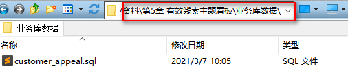
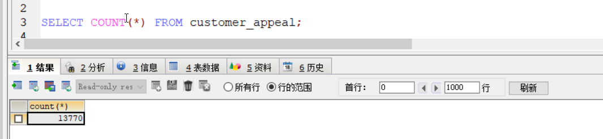
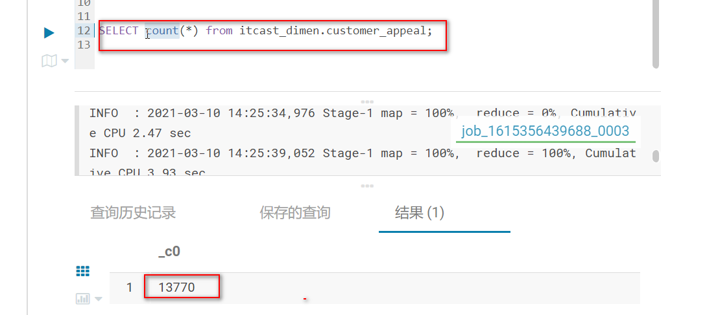
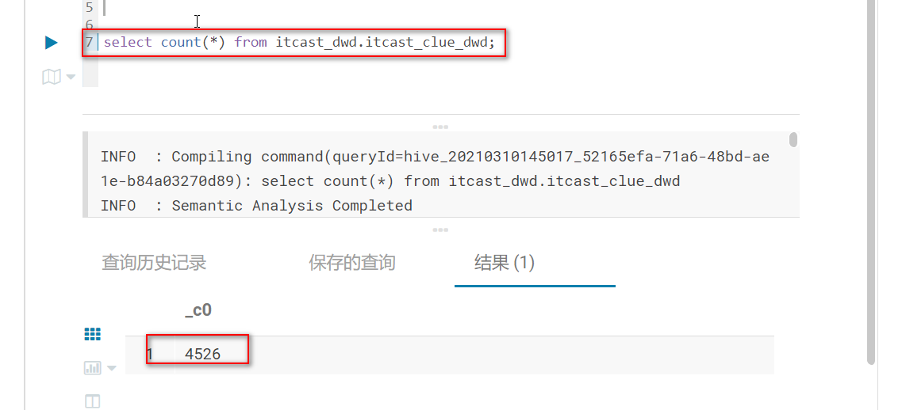
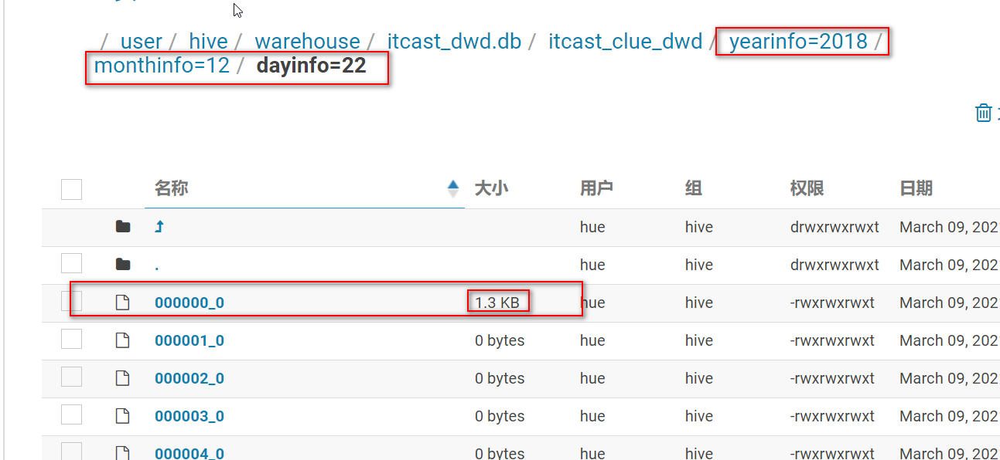
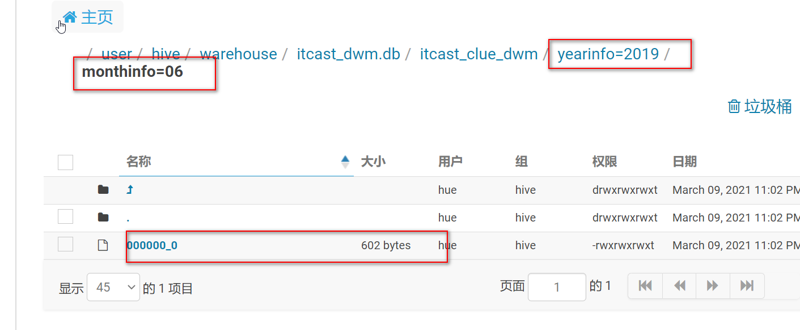
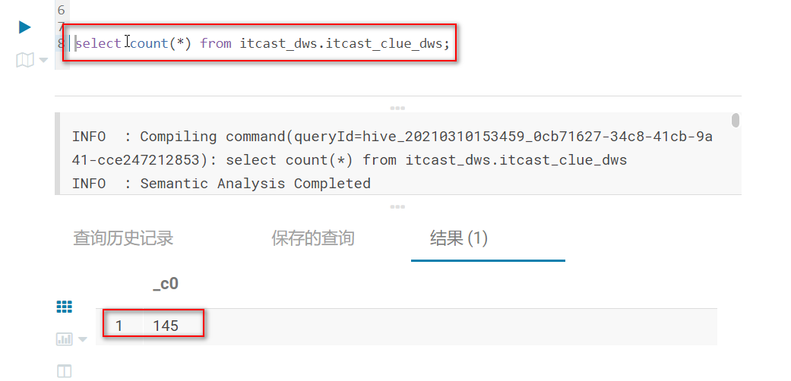
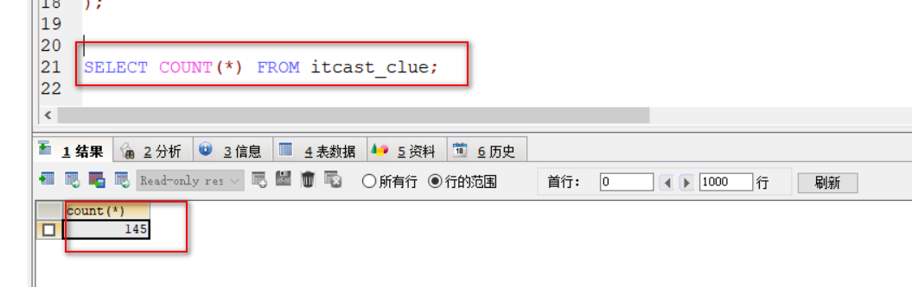

# 教育项目-有效线索主题看板

## 1- 有效线索主题看板_需求分析

### 有效线索转化率

- 需求一：统计期内，访客咨询产生的有效线索的占比。有效线索量 / 咨询量，有效线索指的是拿到电话且电话有效。

``` properties
需求理解:
	1- 期内，统计访问咨询产生的总咨询量;(在访问咨询看板已经完成)
	2- 期内，统计有效线索量;
	3- 占比=有效线索量/总咨询量;
	
	
	
指标1:咨询量
维度:
    时间维度:  年 月  天 小时
  

涉及到表: 
	web_chat_ems访问咨询表

涉及到字段:
	web_chat_ems访问咨询表
		msg_count >= 1 访问咨询表里面的咨询条件；
		create_time 

关联条件: 无
	
----------------------------------------------------------------------------
----------------------------------------------------------------------------
	
指标2: 有效线索量
维度:
    时间维度:  年 月  天 小时
    新老维度
    线上线下

涉及到表: 
	customer_clue线索表
	customer_relationship意向表
	customer_appeal申诉表
	

涉及到字段:
   	customer_clue线索表
   		意向表ID : customer_relationship_id
   			判断该字段是否为null,如果为null则转换为 -1
   		新老维度: clue_state
   			判断依据: 当这个字段的值为VALID_NEW_CUES 认为是新客户, VALID_PUBLIC_NEW_CLUE 是老客户
           	此处可以有转换操作:  将clue_state转换为clue_state_stat字段
              新的字段只会有两个结果  1(新客户)  和  0(老客户)  和无效客户 -1
              
        时间维度：create_date_time
   		清洗操作:  过滤掉已经标记删除的数据 deleted  
	customer_relationship意向表
		线上线下维度: origin_type 
    	    判断依据:  当这个字段的值 等于 NETSERVICE 或者 PRESIGNUP 都认为线上, 否则为线下
    	    此处可以有转换操作: 将 origin_type 转换为 origin_type_stat
    	        新的字段只会有二个字段  1(线上)  和 0(线下)
	customer_appeal申诉表
		第一条客户关系ID:customer_relationship_first_id
		是否投诉成功:appeal_status
			判断：1表示投诉成功；否则无效投诉；
	
		

关联条件: 
	线索表.customer_relationship_id = 意向表.id
    线索表.customer_relationship_id NOT IN 申诉表中被投诉成功的 customer_relationship_first_id 并且customer_relationship_first_id != 0
```


### 有效线索转化率时间段趋势

- 需求：统计期内，1-24h之间，每个时间段的有效线索转化率。横轴：1-24h，间隔为1h，纵轴：每个时间段的有效线索转化率

``` properties
需求理解:
	1- 期内，统计访问咨询产生的总咨询量;(在访问咨询看板已经完成)
	2- 期内，统计有效线索量;
	3- 占比=有效线索量/总咨询量;
	
	
	
指标1:咨询量
维度:
    时间维度:  年 月  天 小时
  	

涉及到表: 
	web_chat_ems访问咨询表

涉及到字段:
	web_chat_ems访问咨询表
		msg_count >= 1 访问咨询表里面的咨询条件；
		create_time 

关联条件: 无
	
----------------------------------------------------------------------------
----------------------------------------------------------------------------
	
指标2: 有效线索量
维度:
    时间维度:  年 月  天 小时
    新老维度:
    线上线下:

涉及到表: 
	customer_clue线索表
	customer_relationship意向表
	customer_appeal申诉表
	

涉及到字段:
   	customer_clue线索表
   		意向表ID : customer_relationship_id
   			判断该字段是否为null,如果为null则转换为 -1
   		新老维度: clue_state
   			判断依据: 当这个字段的值为VALID_NEW_CUES 认为是新客户, VALID_PUBLIC_NEW_CLUE 是老客户
           	此处可以有转换操作:  将clue_state转换为clue_state_stat字段
              新的字段只会有两个结果  1(新客户)  和  0(老客户)  和无效客户 -1
              
        时间维度：create_date_time
   		清洗操作:  过滤掉已经标记删除的数据 deleted  
	customer_relationship意向表
		线上线下维度: origin_type 
    	    判断依据:  当这个字段的值 等于 NETSERVICE 或者 PRESIGNUP 都认为线上, 否则为线下
    	    此处可以有转换操作: 将 origin_type 转换为 origin_type_stat
    	        新的字段只会有二个字段  1(线上)  和 0(线下)
	customer_appeal申诉表
		第一条客户关系ID:customer_relationship_first_id
		是否投诉成功:appeal_status
			判断：1表示投诉成功；否则无效投诉；
	
		

关联条件: 
	线索表.customer_relationship_id = 意向表.id
    线索表.customer_relationship_id NOT IN 申诉表中被投诉成功的 customer_relationship_first_id 并且customer_relationship_first_id != 0
```


### 有效线索量

- 需求: 统计期内，新增的咨询客户中，有效线索的数量

``` properties
需求理解:
	1- 期内，有效线索的数量
	
	
	
指标2: 有效线索量
维度:
    时间维度:  年 月  天 小时
    新老维度
    线上线下

涉及到表: 
	customer_clue线索表
	customer_relationship意向表
	customer_appeal申诉表
	

涉及到字段:
   	customer_clue线索表
   		意向表ID : customer_relationship_id
   			判断该字段是否为null,如果为null则转换为 -1
   		新老维度: clue_state
   			判断依据: 当这个字段的值为VALID_NEW_CUES 认为是新客户, VALID_PUBLIC_NEW_CLUE 是老客户
           	此处可以有转换操作:  将clue_state转换为clue_state_stat字段
              新的字段只会有两个结果  1(新客户)  和  0(老客户)  和无效客户 -1
              
        时间维度：create_date_time
   		清洗操作:  过滤掉已经标记删除的数据 deleted  
	customer_relationship意向表
		线上线下维度: origin_type 
    	    判断依据:  当这个字段的值 等于 NETSERVICE 或者 PRESIGNUP 都认为线上, 否则为线下
    	    此处可以有转换操作: 将 origin_type 转换为 origin_type_stat
    	        新的字段只会有二个字段  1(线上)  和 0(线下)
	customer_appeal申诉表
		第一条客户关系ID:customer_relationship_first_id
		是否投诉成功:appeal_status
			判断：1表示投诉成功；否则无效投诉；
	
		

关联条件: 
	线索表.customer_relationship_id = 意向表.id
	
	过滤申诉表中标记无效的线索:
    线索表.customer_relationship_id NOT IN 申诉表中被投诉成功(appeal_status = 1)的 customer_relationship_first_id 并且customer_relationship_first_id != 0
    
    SQL:
    	线索表.customer_relationship_id NOT IN (  
    	SELECT  
        	申诉表.customer_relationship_first_id  
    	FROM  --投诉表，投诉成功的数据为无效线索
        	customer_appeal ca  
    	WHERE  
        	ca.appeal_status = 1  AND ca.customer_relationship_first_id != 0
		)  
    
```


### 有效线索总结

``` properties
指标: 有效线索量 (也就意味着在DWS层只有一个表即可)

维度: 
   固有维度:
      时间维度: 年 月 天 小时
      线上线下
      新老维度
   

涉及到表:  
    customer_relationship(意向表) , 
    customer_clue(线索表) , 
    customer_appeal(申诉表)

三个表的关联条件(至少2个条件):
    1- 线索表.customer_relationship_id = 意向表.id
    2- 线索表.customer_relationship_id NOT IN 申诉表中被投诉成功的 customer_relationship_first_id 并且customer_relationship_first_id != 0

涉及到字段: 
   customer_clue线索表
   		意向表ID : customer_relationship_id
   			判断该字段是否为null,如果为null则转换为 -1
   		新老维度: clue_state
   			判断依据: 当这个字段的值为VALID_NEW_CUES 认为是新客户, VALID_PUBLIC_NEW_CLUE 是老客户
           	此处可以有转换操作:  将clue_state转换为clue_state_stat字段
              新的字段只会有两个结果  1(新客户)  和  2(老客户)  和无效客户 0
              
        时间维度：create_date_time 转换为 yearinfo - monthinfo - dayinfo - hourinfo
   		清洗操作:  过滤掉已经标记删除的数据 deleted  
	customer_relationship意向表
		意向ID:id
		线上线下维度: origin_type 
    	    判断依据:  当这个字段的值 等于 NETSERVICE 或者 PRESIGNUP 都认为线上, 否则为线下
    	    此处可以有转换操作: 将 origin_type 转换为 origin_type_stat
    	        新的字段只会有二个字段  1(线上)  和 0(线下)
	customer_appeal申诉表
		第一条客户关系ID:customer_relationship_first_id
		是否投诉成功:appeal_status
			判断：1表示投诉成功；否则无效投诉；

整理需要转换和清洗的操作:
   清洗操作:
       将标记为删除的数据进行清洗
   转换操作:
       1) customer_relationship意向表将origin_type 转换后(上卷)得到origin_type_stat(线上线下)
       2) customer_clue线索表将clue_state 转换为  clue_state_stat(新老维度)
       3) customer_clue线索表将create_date_time 转换为 yearinfo monthinfo dayinfo hourinfo


注意: 线索数据不存在重复数据，所以在DWM层需要做细颗粒聚合操作;


```


## 2- 有效线索主题看板_建模分析

``` properties
涉及到表:
    事实表: 
	    customer_clue线索表
    
    维度表:
       customer_relationship意向表 
       customer_appeal申诉表
```


### ODS层:

``` properties
共计为两个表:
	线索表（事实表）
	意向表（上一个意向主题的事实表）:判断数据来源为线上还是线下
	
注意： 这两张表在上个意向主题中已经通过桶表的方式采集到了ODS层;

桶表数据采集回顾:
	1- 为什么使用桶表？
		1- 由于意向表和线索表数据量过大， 在后期查询操作中需要有join的工作;
		2- 数据量过大时，可以抽样数据作为测试数据;
		
	2- join 操作的优化方案; 
		1- map join 方案: 在map端就join操作;
		2- bucket map join 方案: 前提条件:两张表都为桶表;bucket 列 = join列; 两个表bucket数量成倍数关系;
		3- SMB 方案: 前提条件:bucket列 == join列 == sort列;两表bucket数量相等;
		
	3- 桶表数据采集三步骤?
		第一步:创建 意向表的临时表;(桶表只支持insert into/overwrite xxx select * from xxx;)
		第二步:通过sqoop 先将数据导入到临时表
		第三步:将临时表的数据加载到目标表
		
```


### DW层:

#### DWD:明细层

- 作用:  清洗转换操作  和 少量维度退化操作(将意向维度表退化)
- 需要清洗什么, 以及需要转换什么

``` properties
DWD层表字段组合:  清洗字段 + 转换后的字段 + 事实表必须要的字段 +事实表和其他表关联字段

需要转换和清洗的操作:
	清洗操作:
       将标记为删除的数据进行清洗  delete
       
   	转换操作:
       1) 意向表中将origin_type 转换为 origin_type_stat(线上线下)
       2) 线索表中将clue_state 转换为 clue_state_stat(新老维度)
       3) 线索表中将create_date_time 转换为 yearinfo monthinfo dayinfo hourinfo
       4）线索表中将customer_relationship_id 判断该字段是否为null,如果为null则转换为 -1;
       
	维度退化操作:
		退化掉意向表,并保留origin_type_stat字段;
		
所有字段:
id,
customer_relationship_id,
origin_type_stat,
for_new_user,
deleted,
create_date_time,
hourinfo,
yearinfo,monthinfo,dayinfo
		
```


#### DWM:中间层

- 作用: 维度退化 和 提前聚合操作

``` properties
说明: 在DWM层, 将会进行 申诉表关联操作, 实施维度退化过程, 将维度表相关的字段 全部合并汇总到一个表中

操作:
	1- 去掉维度表：申诉表;
		将投诉成功的线索过滤掉;
		
	2- 可以根据小时 先进行细小颗粒聚合: 就是在group by 的时候 从上到下直至 小时;

所有字段:
clue_nums,
origin_type_stat,
for_new_user,
deleted,
create_date_time,
hourinfo,
yearinfo,monthinfo,dayinfo

```


#### DWS:业务层

* 作用: 基于各个细化维度统计指标数据

``` properties
表组成: 统计字段 + 各个维度字段 + 两个查询字段(time_Str,time_type)
	time_type:聚合时间类型：1、按小时聚合；2、按天聚合；3、按周聚合；4、按月聚合；5、按年聚合；

操作:
	根据 年-月-日 分别对数据进行最后的聚合

所有字段:
clue_nums,
origin_type_stat,
for_new_user,
deleted,
create_date_time,
hourinfo,
yearinfo,monthinfo,dayinfo

```


### APP层：

​	无

### DIM层:

``` properties
共计一张表
	customer_appeal申诉表:判断线索数据是否有效
	
注意事项:
	1- 在表的最后多加一个start_time字段，表示抽取时间;
	2- 由于申诉表需要大量的查询操作,所以需要添加索引功能;
	
```

- 索引语句

``` properties
TBLPROPERTIES ('orc.compress'='SNAPPY','orc.create.index'='true','orc.bloom.filter.columns'='appeal_status,customer_relationship_first_id')
```


## 3- 有效线索主题看板_业务初始化

* 建库语句(mysql中)

```SQL
create database scrm default character set utf8mb4 collate utf8mb4_unicode_ci;
```

* 导入申诉表的数据




## 4- 有效线索主题看板_建模操作

### ODS层：

​	无

### DIM层：

#### customer_appeal申诉表

``` sql
CREATE DATABASE IF NOT EXISTS itcast_dimen;
CREATE EXTERNAL TABLE IF NOT EXISTS itcast_dimen.`customer_appeal` (
  `id` int COMMENT 'customer_appeal_id',
  `customer_relationship_first_id` int COMMENT '第一条客户关系id',
  `employee_id` int COMMENT '申诉人',
  `employee_name` STRING COMMENT '申诉人姓名',
  `employee_department_id` int COMMENT '申诉人部门',
  `employee_tdepart_id` int COMMENT '申诉人所属部门',
  `appeal_status` int COMMENT '申诉状态，0:待稽核 1:无效 2：有效',
  `audit_id` int COMMENT '稽核人id',
  `audit_name` STRING COMMENT '稽核人姓名',
  `audit_department_id` int COMMENT '稽核人所在部门',
  `audit_department_name` STRING COMMENT '稽核人部门名称',
  `audit_date_time` STRING COMMENT '稽核时间',
  `create_date_time` STRING COMMENT '创建时间（申诉时间）',
  `update_date_time` STRING COMMENT '更新时间',
  `deleted` STRING COMMENT '删除标志位',
  `tenant` int COMMENT '租户id') 
comment '客户申诉表'
PARTITIONED BY(start_time STRING)
ROW FORMAT DELIMITED 
FIELDS TERMINATED BY '\t'
stored as orc
TBLPROPERTIES ('orc.compress'='SNAPPY','orc.create.index'='true','orc.bloom.filter.columns'='appeal_status,customer_relationship_first_id');
```


### DWD层：

#### itcast_clue_dwd表

- 根据 年 - 月 - 日 分区

``` sql
CREATE TABLE IF NOT EXISTS itcast_dwd.itcast_clue_dwd (
   `id` STRING COMMENT '线索id',
   `customer_relationship_id` int COMMENT '客户关系id',
   `origin_type_stat` STRING COMMENT '数据来源:0.线下；1.线上',
   `for_new_user` STRING COMMENT '0:未知；1：新客户线索；2：旧客户线索',
   `deleted` STRING COMMENT '是否删除',
   `create_date_time` BIGINT COMMENT '创建时间',
   `hourinfo` STRING COMMENT '小时信息'
)
comment '客户申诉dwd表'
PARTITIONED BY(yearinfo STRING,monthinfo STRING,dayinfo STRING)
clustered by(customer_relationship_id) sorted by(customer_relationship_id) into 10 buckets
ROW FORMAT DELIMITED
FIELDS TERMINATED BY '\t'
stored as orcfile
TBLPROPERTIES ('orc.compress'='SNAPPY','orc.create.index'='true','orc.bloom.filter.columns'='customer_relationship_id');
```


### DWM层：

#### itcast_clue_dwm表

- 根据 年 - 月分区

``` sql
CREATE TABLE IF NOT EXISTS itcast_dwm.itcast_clue_dwm (
   `clue_nums` STRING COMMENT '根据id聚合',
   `origin_type_stat` STRING COMMENT '数据来源:0.线下；1.线上',
   `for_new_user` STRING COMMENT '0:未知；1：新客户线索；2：旧客户线索',
   `hourinfo` STRING COMMENT '小时信息',
   `dayinfo`STRING COMMENT '天信息'
)
comment '客户申诉dwm表'
PARTITIONED BY(yearinfo STRING,monthinfo STRING)
ROW FORMAT DELIMITED
FIELDS TERMINATED BY '\t'
stored as orcfile
TBLPROPERTIES ('orc.compress'='SNAPPY');
```


### DWS层

#### itcast_clue_dws表

- 根据 年 - 月分区

``` sql
CREATE TABLE IF NOT EXISTS itcast_dws.itcast_clue_dws (
   `clue_nums` INT COMMENT '根据id聚合',
   `origin_type_stat` STRING COMMENT '数据来源:0.线下；1.线上',
   `for_new_user` STRING COMMENT '0:未知；1：新客户线索；2：旧客户线索',
   `hourinfo` STRING COMMENT '小时信息',
   `dayinfo`STRING COMMENT '天信息',
   `time_type` STRING COMMENT '聚合时间类型：1、按小时聚合；2、按天聚合；3、按周聚合；4、按月聚合；5、按年聚合；',
   `time_str` STRING COMMENT '时间明细'
)
comment '客户申诉app表'
PARTITIONED BY(yearinfo STRING,monthinfo STRING)
ROW FORMAT DELIMITED
FIELDS TERMINATED BY '\t'
stored as orcfile
TBLPROPERTIES ('orc.compress'='SNAPPY');
```


## 5- 有效线索主题看板_数据采集

### 数据采集到ODS层

无

### 数据采集到DIM层

- mysql查询SQL

``` sql
select `id`,
       `customer_relationship_first_id`,
       `employee_id`,
       `employee_name`,
       `employee_department_id`,
       `employee_tdepart_id`,
       `appeal_status`,
       `audit_id`,
       `audit_name`,
       `audit_department_id`,
       `audit_department_name`,
       `audit_date_time`,
       `create_date_time`,
       `update_date_time`,
       `deleted`,
       `tenant`,
       DATE_SUB(curdate(),INTERVAL 1 DAY) as start_time
from customer_appeal
```

- sqoop导入

``` sql
sqoop import \
--connect jdbc:mysql://192.168.52.150:3306/scrm \
--username root \
--password 123456 \
--query 'select `id`,`customer_relationship_first_id`,`employee_id`,`employee_name`,`employee_department_id`,`employee_tdepart_id`,`appeal_status`,`audit_id`,`audit_name`,`audit_department_id`,`audit_department_name`,`audit_date_time`,`create_date_time`,`update_date_time`,`deleted`,`tenant`,DATE_SUB(curdate(),INTERVAL 1 DAY) as start_time from customer_appeal where 1=1 and  $CONDITIONS' \
--hcatalog-database itcast_dimen \
--hcatalog-table customer_appeal \
-m 1 
```

- 数据验证

  - 业务数据库mysql

  

  

  - hive

  


## 6- 有效线索主题看板_数据清洗转换

### 生成DWD层数据

- 实现功能点:

``` properties
需要转换和清洗的操作:
	清洗操作:
       将标记为删除的数据进行清洗  delete
       
   	转换操作:
       1) 意向表中将origin_type 转换为 origin_type_stat(线上:1 线下:0)
       2) 线索表中将clue_state 转换为 clue_state_stat(新:1;老:2;其它:0)
       3) 线索表中将create_date_time 转换为 yearinfo monthinfo dayinfo hourinfo
       4）线索表中将customer_relationship_id 判断该字段是否为null,如果为null则转换为 -1;
       
	维度退化操作:
		退化掉意向表,并保留origin_type_stat字段;
		
	由于意向表和线索表中的数据过多,本次测试只抽取第一个桶中的数据;
	TABLESAMPLE(BUCKET 1 OUT OF 10 ON customer_relationship_id)
```

- hive sql

``` sql
--分区
SET hive.exec.dynamic.partition=true;
SET hive.exec.dynamic.partition.mode=nonstrict;
set hive.exec.max.dynamic.partitions.pernode=10000;
set hive.exec.max.dynamic.partitions=100000;
set hive.exec.max.created.files=150000;
--hive压缩
set hive.exec.compress.intermediate=true;
set hive.exec.compress.output=true;
--写入时压缩生效
set hive.exec.orc.compression.strategy=COMPRESSION;
--分桶
set hive.enforce.bucketing=true;
set hive.enforce.sorting=true;
set hive.optimize.bucketmapjoin = true;
set hive.auto.convert.sortmerge.join=true;
set hive.auto.convert.sortmerge.join.noconditionaltask=true;
--并行执行
set hive.exec.parallel=true;
set hive.exec.parallel.thread.number=8;

INSERT INTO itcast_dwd.itcast_clue_dwd PARTITION (yearinfo, monthinfo, dayinfo)
SELECT
    clue.id,
    nvl(clue.customer_relationship_id, -1) as customer_relationship_id,
    if(rs.origin_type='NETSERVICE' or rs.origin_type='PRESIGNUP', '1', '0') as origin_type_stat,
    if(clue.clue_state='VALID_NEW_CLUES', 1, if(clue.clue_state='VALID_PUBLIC_NEW_CLUE', 2, 0)) as for_new_user,
    clue.deleted,
    clue.create_date_time,
    substr(clue.create_date_time, 12, 2) as hourinfo,
    substr(clue.create_date_time, 1, 4) as yearinfo,
    substr(clue.create_date_time, 6, 2) as monthinfo,
    substr(clue.create_date_time, 9, 2) as dayinfo
FROM itcast_ods.customer_clue TABLESAMPLE(BUCKET 1 OUT OF 10 ON customer_relationship_id) clue
LEFT JOIN itcast_ods.customer_relationship rs on clue.customer_relationship_id = rs.id
where clue.clue_state is not null AND clue.deleted = 'false';
```

- 数据验证

  - 查询总量

  

  - 查询每天数据大小：由于我们分桶并抽样第一个桶里面的数据，所以这里也只有第一个桶有数据；

    


### 生成DWM层数据

- 实现功能点:

``` properties
操作:
	1- 去掉维度表：申诉表;
		将投诉成功的线索过滤掉;
		
	2- 可以根据小时 先进行细小颗粒聚合: 就是在group by 的时候 从上到下直至 小时;
```

- hive sql

``` sql
--分区
SET hive.exec.dynamic.partition=true;
SET hive.exec.dynamic.partition.mode=nonstrict;
set hive.exec.max.dynamic.partitions.pernode=10000;
set hive.exec.max.dynamic.partitions=100000;
set hive.exec.max.created.files=150000;
--hive压缩；
set hive.exec.compress.intermediate=true;
set hive.exec.compress.output=true;
--写入时压缩生效
set hive.exec.orc.compression.strategy=COMPRESSION;
--分桶
set hive.enforce.bucketing=true;
set hive.enforce.sorting=true;
set hive.optimize.bucketmapjoin = true;
set hive.auto.convert.sortmerge.join=true;
set hive.auto.convert.sortmerge.join.noconditionaltask=true;
--并行执行
set hive.exec.parallel=true;
set hive.exec.parallel.thread.number=16;
INSERT into itcast_dwm.itcast_clue_dwm partition (yearinfo,monthinfo)
SELECT
    count(dwd.id) as clue_nums,
    dwd.origin_type_stat,
    dwd.for_new_user,
    dwd.hourinfo,
    dwd.dayinfo,
    dwd.yearinfo,
    dwd.monthinfo
from itcast_dwd.itcast_clue_dwd dwd
WHERE 
dwd.customer_relationship_id NOT IN
(
    SELECT a.customer_relationship_first_id from itcast_dimen.customer_appeal a
    WHERE a.appeal_status = 1 and a.customer_relationship_first_id != 0
)
GROUP BY dwd.yearinfo, dwd.monthinfo, dwd.dayinfo, dwd.hourinfo, dwd.origin_type_stat, dwd.for_new_user;
```

- 数据验证

  - 查询总数据量

  

  - 查询每月下面数据大小

  


## 7- 有效线索主题看板_数据统计分析

### 7-1 总有效线索量

- 功能实现点：

``` properties
表组成: 统计字段 + 各个维度字段 + 两个查询字段(time_Str,time_type)
	time_type:聚合时间类型：1、按小时聚合；2、按天聚合；3、按周聚合；4、按月聚合；5、按年聚合；

操作:
	根据 年-月-日 分别对数据进行最后的聚合
	还是根据 年-月 分区
```

- 统计每年 线上 线下 和新老维度的总有效线索量信息

``` sql
INSERT INTO itcast_dws.itcast_clue_dws PARTITION(yearinfo,monthinfo)
SELECT 
    sum(clue_nums) as clue_nums,
    origin_type_stat, 
    for_new_user, 
    '-1' as hourinfo, 
    '-1' as dayinfo,  
    '5' as time_type, 
    dwm.yearinfo as time_str, 
    yearinfo,
    '-1' as monthinfo
from itcast_dwm.itcast_clue_dwm dwm
GROUP BY dwm.yearinfo, dwm.origin_type_stat, dwm.for_new_user;
```


- 统计每年-每月 线上 线下 和新老维度的总有效线索量信息

``` sql
INSERT INTO  itcast_dws.itcast_clue_dws PARTITION(yearinfo,monthinfo)
SELECT 
    sum(clue_nums) as clue_nums,
    origin_type_stat, 
    for_new_user, 
    '-1' as hourinfo, 
    '-1' as dayinfo,  
    '4' as time_type, 
    concat(dwm.yearinfo,'-',dwm.monthinfo) as time_str, 
    yearinfo,
    monthinfo
from itcast_dwm.itcast_clue_dwm dwm
GROUP BY dwm.yearinfo, dwm.monthinfo, dwm.origin_type_stat, dwm.for_new_user;
```


- 统计每年-每月-每天 线上 线下 和新老维度的总有效线索量信息

``` sql
INSERT INTO  itcast_dws.itcast_clue_dws PARTITION(yearinfo,monthinfo)
SELECT 
    sum(clue_nums) as clue_nums,
    origin_type_stat, 
    for_new_user, 
    '-1' as hourinfo, 
    dayinfo,  
    '2' as time_type, 
    concat(dwm.yearinfo,'-',dwm.monthinfo,'-',dayinfo) as time_str, 
    yearinfo,
    monthinfo
from itcast_dwm.itcast_clue_dwm dwm
GROUP BY dwm.yearinfo, dwm.monthinfo,dwm.dayinfo,dwm.origin_type_stat, dwm.for_new_user;
```


- 统计每年-每月-天-每小时 线上 线下 和新老维度的总有效线索量信息

``` sql
INSERT INTO itcast_clue_dws PARTITION(yearinfo,monthinfo)
SELECT 
    clue_nums,
    origin_type_stat, 
    for_new_user, 
    hourinfo, 
    dayinfo, 
    '1' as time_type, 
    concat(dwm.yearinfo,'-',dwm.monthinfo,'-',dwm.dayinfo,' ', dwm.hourinfo) as time_str, 
    yearinfo,
    monthinfo,
from itcast_dwm.itcast_clue_dwm dwm;
```


## 8- 有效线索主题看板_数据导出

### 8-1 在业务数据库scrm_bi创建表

``` sql
CREATE TABLE `itcast_clue` (
   `clue_nums` INT(11) COMMENT '有效线索量',
   `origin_type_stat` varchar(32) COMMENT '数据来源:0.线下；1.线上',
   `for_new_user` varchar(32) COMMENT '0:未知；1：新客户线索；2：旧客户线索',
   `hourinfo` varchar(32) COMMENT '小时信息',
   `dayinfo` varchar(32) COMMENT '日信息',
   `monthinfo` varchar(32) COMMENT '月信息',
   `time_type` varchar(32) COMMENT '聚合时间类型：1、按小时聚合；2、按天聚合；3、按周聚合；4、按月聚合；5、按年聚合；',
   `time_str` varchar(32) COMMENT '时间明细',
   `yearinfo` varchar(32) COMMENT '年信息'
);
```


### 8-2 sqoop 导出脚本

``` sql
sqoop export \
--connect "jdbc:mysql://192.168.52.150:3306/scrm_bi?useUnicode=true&characterEncoding=utf-8" \
--username root \
--password 123456 \
--table itcast_clue \
--hcatalog-database itcast_dws \
--hcatalog-table itcast_clue_dws \
-m 1
```

- 数据验证

  


​		


## 9- 有效线索主题看板_增量实现

### 9-1 数据导入 mysql->ods/dimen

#### 9-1-1 customer_relationship表 （拉链表）

- 第一步: 构建一张增量表  customer_relationship_add 和临时表 customer_relationship_tmp; 这两张表的结构完全相同

customer_relationship_add:

``` sql
CREATE TABLE IF NOT EXISTS itcast_ods.`customer_relationship_add` (
  `id` int COMMENT '客户关系id',
  `create_date_time` STRING COMMENT '创建时间',
  `update_date_time` STRING COMMENT '最后更新时间',
  `deleted` int COMMENT '是否被删除（禁用）',
  `customer_id` int COMMENT '所属客户id',
  `first_id` int COMMENT '第一条客户关系id',
  `belonger` int COMMENT '归属人',
  `belonger_name` STRING COMMENT '归属人姓名',
  `initial_belonger` int COMMENT '初始归属人',
  `distribution_handler` int COMMENT '分配处理人',
  `business_scrm_department_id` int COMMENT '归属部门',
  `last_visit_time` STRING COMMENT '最后回访时间',
  `next_visit_time` STRING COMMENT '下次回访时间',
  `origin_type` STRING COMMENT '数据来源',
  `itcast_school_id` int COMMENT '校区Id',
  `itcast_subject_id` int COMMENT '学科Id',
  `intention_study_type` STRING COMMENT '意向学习方式',
  `anticipat_signup_date` STRING COMMENT '预计报名时间',
  `level` STRING COMMENT '客户级别',
  `creator` int COMMENT '创建人',
  `current_creator` int COMMENT '当前创建人：初始==创建人，当在公海拉回时为 拉回人',
  `creator_name` STRING COMMENT '创建者姓名',
  `origin_channel` STRING COMMENT '来源渠道',
  `comment` STRING COMMENT '备注',
  `first_customer_clue_id` int COMMENT '第一条线索id',
  `last_customer_clue_id` int COMMENT '最后一条线索id',
  `process_state` STRING COMMENT '处理状态',
  `process_time` STRING COMMENT '处理状态变动时间',
  `payment_state` STRING COMMENT '支付状态',
  `payment_time` STRING COMMENT '支付状态变动时间',
  `signup_state` STRING COMMENT '报名状态',
  `signup_time` STRING COMMENT '报名时间',
  `notice_state` STRING COMMENT '通知状态',
  `notice_time` STRING COMMENT '通知状态变动时间',
  `lock_state` STRING COMMENT '锁定状态',
  `lock_time` STRING COMMENT '锁定状态修改时间',
  `itcast_clazz_id` int COMMENT '所属ems班级id',
  `itcast_clazz_time` STRING COMMENT '报班时间',
  `payment_url` STRING COMMENT '付款链接',
  `payment_url_time` STRING COMMENT '支付链接生成时间',
  `ems_student_id` int COMMENT 'ems的学生id',
  `delete_reason` STRING COMMENT '删除原因',
  `deleter` int COMMENT '删除人',
  `deleter_name` STRING COMMENT '删除人姓名',
  `delete_time` STRING COMMENT '删除时间',
  `course_id` int COMMENT '课程ID',
  `course_name` STRING COMMENT '课程名称',
  `delete_comment` STRING COMMENT '删除原因说明',
  `close_state` STRING COMMENT '关闭装填',
  `close_time` STRING COMMENT '关闭状态变动时间',
  `appeal_id` int COMMENT '申诉id',
  `tenant` int COMMENT '租户',
  `total_fee` DECIMAL COMMENT '报名费总金额',
  `belonged` int COMMENT '小周期归属人',
  `belonged_time` STRING COMMENT '归属时间',
  `belonger_time` STRING COMMENT '归属时间',
  `transfer` int COMMENT '转移人',
  `transfer_time` STRING COMMENT '转移时间',
  `follow_type` int COMMENT '分配类型，0-自动分配，1-手动分配，2-自动转移，3-手动单个转移，4-手动批量转移，5-公海领取',
  `transfer_bxg_oa_account` STRING COMMENT '转移到博学谷归属人OA账号',
  `transfer_bxg_belonger_name` STRING COMMENT '转移到博学谷归属人OA姓名',
  `end_time` STRING COMMENT '有效截止时间')
comment '客户关系表'
PARTITIONED BY(start_time STRING)
ROW FORMAT DELIMITED
FIELDS TERMINATED BY '\t'
stored as orc
TBLPROPERTIES ('orc.compress'='ZLIB');
```

customer_relationship_tmp:

``` sql
CREATE TABLE IF NOT EXISTS itcast_ods.customer_relationship_tmp like customer_relationship_add;
```


- 第二步:将新增或修改的数据导入增量表 customer_relationship_add中

  - 查询语句

    ``` sql
    select *,'当天日期' as starts_time, '9999-12-31' as end_time from customer_clue where substr(create_date_time,1,10)='当天日期' or substr(update_date_time,1,10)='当天日期';
    ```

    

  - shell脚本

    ``` shell
    #!/bin/bash
    
    export SQOOP_HOME=/usr/bin/sqoop
    
    
    if [ $# -eq 1  ]
    
    then
    
       timestr=$1
       yearAndMonth=`date -d $1 +'%Y_%m'`
    
    else
    
      timestr=`date -d '-1 day' +'%Y-%m-%d'`
      yearAndMonth=`date -d '-1 day' +'%Y_%m'`
    
    fi
    
    
    ${SQOOP_HOME} import \
    --connect jdbc:mysql://192.168.52.150:3306/scrm \
    --username root \
    --password 123456 \
    --query "select 
           id,
           create_date_time,
           update_date_time,
           deleted,
           customer_id,
           first_id,
           belonger,
           belonger_name,
           initial_belonger,
           distribution_handler,
           business_scrm_department_id,
           last_visit_time,
           next_visit_time,
           origin_type,
           itcast_school_id,
           itcast_subject_id,
           intention_study_type,
           anticipat_signup_date,
           level,
           creator,
           current_creator,
           creator_name,
           origin_channel,
           comment,
           first_customer_clue_id,
           last_customer_clue_id,
           process_state,
           process_time,
           payment_state,
           payment_time,
           signup_state,
           signup_time,
           notice_state,
           notice_time,
           lock_state,
           lock_time,
           itcast_clazz_id,
           itcast_clazz_time,
           payment_url,
           payment_url_time,
           ems_student_id,
           delete_reason,
           deleter,
           deleter_name,
           delete_time,
           course_id,
           course_name,
           delete_comment,
           close_state,
           close_time,
           appeal_id,
           tenant,
           total_fee,
           belonged,
           belonged_time,
           belonger_time,
           transfer,
           transfer_time,
           follow_type,
           transfer_bxg_oa_account,
           transfer_bxg_belonger_name,
           date_format('9999-12-31', '%Y-%m-%d')       as end_time,
           FROM_UNIXTIME(unix_timestamp(), '%Y-%m-%d') as start_time
    from customer_relationship
     where substr(create_date_time,1,10)='${timestr}' or substr(update_date_time,1,10)='${timestr}' and \$CONDITIONS" \
    --fields-terminated-by '\t' \
    --hcatalog-database itcast_ods \
    --hcatalog-table customer_relationship_add \
    -m 1
    ```

    

- 第三步: 修改目标表customer_relationship过期数据的end_time并且合并增量表中的数据，最后将数据写入临时表customer_relationship_tmp中

  sql语句：

  ``` sql
  insert into table itcast_ods.customer_relationship_tmp partition(start_time) 
  select 
  	   A.id,
         A.create_date_time,
         A.update_date_time,
         A.deleted,
         A.customer_id,
         A.first_id,
         A.belonger,
         A.belonger_name,
         A.initial_belonger,
         A.distribution_handler,
         A.business_scrm_department_id,
         A.last_visit_time,
         A.next_visit_time,
         A.origin_type,
         A.itcast_school_id,
         A.itcast_subject_id,
         A.intention_study_type,
         A.anticipat_signup_date,
         A.level,
         A.creator,
         A.current_creator,
         A.creator_name,
         A.origin_channel,
         A.comment,
         A.first_customer_clue_id,
         A.last_customer_clue_id,
         A.process_state,
         A.process_time,
         A.payment_state,
         A.payment_time,
         A.signup_state,
         A.signup_time,
         A.notice_state,
         A.notice_time,
         A.lock_state,
         A.lock_time,
         A.itcast_clazz_id,
         A.itcast_clazz_time,
         A.payment_url,
         A.payment_url_time,
         A.ems_student_id,
         A.delete_reason,
         A.deleter,
         A.deleter_name,
         A.delete_time,
         A.course_id,
         A.course_name,
         A.delete_comment,
         A.close_state,
         A.close_time,
         A.appeal_id,
         A.tenant,
         A.total_fee,
         A.belonged,
         A.belonged_time,
         A.belonger_time,
         A.transfer,
         A.transfer_time,
         A.follow_type,
         A.transfer_bxg_oa_account,
         A.transfer_bxg_belonger_name,
  	   if(B.id is null or A.end_time != '9999-12-31' , A.end_time , B.start_time - 1) as end_time,
  	   A.start_time
  
  from 
  	itcast_ods.customer_relationship A 
  	left join itcast_ods.customer_relationship_add B 
  	on A.id = B.id
  union all
  	select * from itcast_ods.customer_relationship_add;
  ```

  shell 脚本

  ``` shell
  #!/bin/bash
  
  export HIVE_HOME=/usr/bin/hive
  
  countAnalyse_sql="
  --分区
  SET hive.exec.dynamic.partition=true;
  SET hive.exec.dynamic.partition.mode=nonstrict;
  set hive.exec.max.dynamic.partitions.pernode=10000;
  set hive.exec.max.dynamic.partitions=100000;
  set hive.exec.max.created.files=150000;
  --hive压缩
  set hive.exec.compress.intermediate=true;
  set hive.exec.compress.output=true;
  --写入时压缩生效
  set hive.exec.orc.compression.strategy=COMPRESSION;
  --分桶
  set hive.enforce.bucketing=true;
  set hive.enforce.sorting=true;
  set hive.optimize.bucketmapjoin = true;
  set hive.auto.convert.sortmerge.join=true;
  set hive.auto.convert.sortmerge.join.noconditionaltask=true;
  
  insert into table itcast_ods.customer_relationship_tmp partition(start_time) 
  select 
  	   A.id,
         A.create_date_time,
         A.update_date_time,
         A.deleted,
         A.customer_id,
         A.first_id,
         A.belonger,
         A.belonger_name,
         A.initial_belonger,
         A.distribution_handler,
         A.business_scrm_department_id,
         A.last_visit_time,
         A.next_visit_time,
         A.origin_type,
         A.itcast_school_id,
         A.itcast_subject_id,
         A.intention_study_type,
         A.anticipat_signup_date,
         A.level,
         A.creator,
         A.current_creator,
         A.creator_name,
         A.origin_channel,
         A.comment,
         A.first_customer_clue_id,
         A.last_customer_clue_id,
         A.process_state,
         A.process_time,
         A.payment_state,
         A.payment_time,
         A.signup_state,
         A.signup_time,
         A.notice_state,
         A.notice_time,
         A.lock_state,
         A.lock_time,
         A.itcast_clazz_id,
         A.itcast_clazz_time,
         A.payment_url,
         A.payment_url_time,
         A.ems_student_id,
         A.delete_reason,
         A.deleter,
         A.deleter_name,
         A.delete_time,
         A.course_id,
         A.course_name,
         A.delete_comment,
         A.close_state,
         A.close_time,
         A.appeal_id,
         A.tenant,
         A.total_fee,
         A.belonged,
         A.belonged_time,
         A.belonger_time,
         A.transfer,
         A.transfer_time,
         A.follow_type,
         A.transfer_bxg_oa_account,
         A.transfer_bxg_belonger_name,
  	   if(B.id is null or A.end_time != '9999-12-31' , A.end_time , B.start_time - 1) as end_time,
  	   A.start_time
  
  from 
  	itcast_ods.customer_relationship A 
  	left join itcast_ods.customer_relationship_add B 
  	on A.id = B.id
  union all
  	select * from itcast_ods.customer_relationship_add;"
  
  ${HIVE_HOME} -S -e "${countAnalyse_sql}"
  
  ```

  

- 第四步：将临时表customer_relationship_tmp中的数据overwrite 到目标表customer_relationship中

  sql 语句

  ``` sql
  insert overwrite table itcast_ods.customer_relationship_tmp partition(start_time)
  select * from itcast_ods.customer_relationship;
  ```

  shell脚本

  ``` shell
  #!/bin/bash
  
  export HIVE_HOME=/usr/bin/hive
  
  countAnalyse_sql="
  --分区
  SET hive.exec.dynamic.partition=true;
  SET hive.exec.dynamic.partition.mode=nonstrict;
  set hive.exec.max.dynamic.partitions.pernode=10000;
  set hive.exec.max.dynamic.partitions=100000;
  set hive.exec.max.created.files=150000;
  --hive压缩
  set hive.exec.compress.intermediate=true;
  set hive.exec.compress.output=true;
  --写入时压缩生效
  set hive.exec.orc.compression.strategy=COMPRESSION;
  --分桶
  set hive.enforce.bucketing=true;
  set hive.enforce.sorting=true;
  set hive.optimize.bucketmapjoin = true;
  set hive.auto.convert.sortmerge.join=true;
  set hive.auto.convert.sortmerge.join.noconditionaltask=true;
  
  insert overwrite table itcast_ods.customer_relationship_tmp partition(start_time)
  select * from itcast_ods.customer_relationship;"
  
  ${HIVE_HOME} -S -e "${countAnalyse_sql}"
  
  ```

  


#### 9-1-2 customer_clue表（拉链表）

- 第一步: 构建一张增量表  customer_clue_add 和临时表 customer_clue_tmp; 这两张表的结构完全相同

customer_clue_add:

``` sql
CREATE TABLE IF NOT EXISTS itcast_ods.customer_clue_add (
  id int COMMENT 'customer_clue_id',
  create_date_time STRING COMMENT '创建时间',
  update_date_time STRING COMMENT '最后更新时间',
  deleted STRING COMMENT '是否被删除（禁用）',
  customer_id int COMMENT '客户id',
  customer_relationship_id int COMMENT '客户关系id',
  session_id STRING COMMENT '七陌会话id',
  sid STRING COMMENT '访客id',
  status STRING COMMENT '状态（undeal待领取 deal 已领取 finish 已关闭 changePeer 已流转）',
  users STRING COMMENT '所属坐席',
  create_time STRING COMMENT '七陌创建时间',
  platform STRING COMMENT '平台来源 （pc-网站咨询|wap-wap咨询|sdk-app咨询|weixin-微信咨询）',
  s_name STRING COMMENT '用户名称',
  seo_source STRING COMMENT '搜索来源',
  seo_keywords STRING COMMENT '关键字',
  ip STRING COMMENT 'IP地址',
  referrer STRING COMMENT '上级来源页面',
  from_url STRING COMMENT '会话来源页面',
  landing_page_url STRING COMMENT '访客着陆页面',
  url_title STRING COMMENT '咨询页面title',
  to_peer STRING COMMENT '所属技能组',
  manual_time STRING COMMENT '人工开始时间',
  begin_time STRING COMMENT '坐席领取时间 ',
  reply_msg_count int COMMENT '客服回复消息数',
  total_msg_count int COMMENT '消息总数',
  msg_count int COMMENT '客户发送消息数',
  comment STRING COMMENT '备注',
  finish_reason STRING COMMENT '结束类型',
  finish_user STRING COMMENT '结束坐席',
  end_time STRING COMMENT '会话结束时间',
  platform_description STRING COMMENT '客户平台信息',
  browser_name STRING COMMENT '浏览器名称',
  os_info STRING COMMENT '系统名称',
  area STRING COMMENT '区域',
  country STRING COMMENT '所在国家',
  province STRING COMMENT '省',
  city STRING COMMENT '城市',
  creator int COMMENT '创建人',
  name STRING COMMENT '客户姓名',
  idcard STRING COMMENT '身份证号',
  phone STRING COMMENT '手机号',
  itcast_school_id int COMMENT '校区Id',
  itcast_school STRING COMMENT '校区',
  itcast_subject_id int COMMENT '学科Id',
  itcast_subject STRING COMMENT '学科',
  wechat STRING COMMENT '微信',
  qq STRING COMMENT 'qq号',
  email STRING COMMENT '邮箱',
  gender STRING COMMENT '性别',
  level STRING COMMENT '客户级别',
  origin_type STRING COMMENT '数据来源渠道',
  information_way STRING COMMENT '资讯方式',
  working_years STRING COMMENT '开始工作时间',
  technical_directions STRING COMMENT '技术方向',
  customer_state STRING COMMENT '当前客户状态',
  valid STRING COMMENT '该线索是否是网资有效线索',
  anticipat_signup_date STRING COMMENT '预计报名时间',
  clue_state STRING COMMENT '线索状态',
  scrm_department_id int COMMENT 'SCRM内部部门id',
  superior_url STRING COMMENT '诸葛获取上级页面URL',
  superior_source STRING COMMENT '诸葛获取上级页面URL标题',
  landing_url STRING COMMENT '诸葛获取着陆页面URL',
  landing_source STRING COMMENT '诸葛获取着陆页面URL来源',
  info_url STRING COMMENT '诸葛获取留咨页URL',
  info_source STRING COMMENT '诸葛获取留咨页URL标题',
  origin_channel STRING COMMENT '投放渠道',
  course_id int COMMENT '课程编号',
  course_name STRING COMMENT '课程名称',
  zhuge_session_id STRING COMMENT 'zhuge会话id',
  is_repeat int COMMENT '是否重复线索(手机号维度) 0:正常 1：重复',
  tenant int COMMENT '租户id',
  activity_id STRING COMMENT '活动id',
  activity_name STRING COMMENT '活动名称',
  follow_type int COMMENT '分配类型，0-自动分配，1-手动分配，2-自动转移，3-手动单个转移，4-手动批量转移，5-公海领取',
  shunt_mode_id int COMMENT '匹配到的技能组id',
  shunt_employee_group_id int COMMENT '所属分流员工组',
  ends_time STRING COMMENT '有效时间')
comment '客户关系表'
PARTITIONED BY(starts_time STRING)
ROW FORMAT DELIMITED
FIELDS TERMINATED BY '\t'
stored as orc
TBLPROPERTIES ('orc.compress'='ZLIB');
```

customer_clue_tmp:

``` sql
CREATE TABLE IF NOT EXISTS itcast_ods.customer_clue_tmp like customer_clue_add;
```


- 第二步:将新增或修改的数据导入增量表 customer_clue_add中

  - 查询语句

    ``` sql
    select *,'当天日期' as starts_time, '9999-12-31' as end_time from customer_clue where substr(create_date_time,1,10)='当天日期' or substr(update_date_time,1,10)='当天日期';
    ```

    

  - shell脚本

    ``` shell
    #!/bin/bash
    
    export SQOOP_HOME=/usr/bin/sqoop
    
    
    if [ $# -eq 1  ]
    
    then
    
       timestr=$1
       yearAndMonth=`date -d $1 +'%Y_%m'`
    
    else
    
      timestr=`date -d '-1 day' +'%Y-%m-%d'`
      yearAndMonth=`date -d '-1 day' +'%Y_%m'`
    
    fi
    
    
    ${SQOOP_HOME} import \
    --connect jdbc:mysql://192.168.52.150:3306/scrm \
    --username root \
    --password 123456 \
    --query "select id,
           create_date_time,
           update_date_time,
           deleted,
           customer_id,
           first_id,
           belonger,
           belonger_name,
           initial_belonger,
           distribution_handler,
           business_scrm_department_id,
           last_visit_time,
           next_visit_time,
           origin_type,
           itcast_school_id,
           itcast_subject_id,
           intention_study_type,
           anticipat_signup_date,
           level,
           creator,
           current_creator,
           creator_name,
           origin_channel,
           comment,
           first_customer_clue_id,
           last_customer_clue_id,
           process_state,
           process_time,
           payment_state,
           payment_time,
           signup_state,
           signup_time,
           notice_state,
           notice_time,
           lock_state,
           lock_time,
           itcast_clazz_id,
           itcast_clazz_time,
           payment_url,
           payment_url_time,
           ems_student_id,
           delete_reason,
           deleter,
           deleter_name,
           delete_time,
           course_id,
           course_name,
           delete_comment,
           close_state,
           close_time,
           appeal_id,
           tenant,
           total_fee,
           belonged,
           belonged_time,
           belonger_time,
           transfer,
           transfer_time,
           follow_type,
           transfer_bxg_oa_account,
           transfer_bxg_belonger_name,
           date_format('9999-12-31', '%Y-%m-%d')       as end_time,
           FROM_UNIXTIME(unix_timestamp(), '%Y-%m-%d') as start_time
    from customer_clue
     where substr(create_date_time,1,10)='${timestr}' or substr(update_date_time,1,10)='${timestr}' and \$CONDITIONS" \
    --fields-terminated-by '\t' \
    --hcatalog-database itcast_ods \
    --hcatalog-table customer_clue_add \
    -m 1
    ```

    

- 第三步: 修改目标表customer_clue过期数据的end_time并且合并增量表中的数据，最后将数据写入临时表customer_clue_tmp中

  sql语句：

  ``` sql
  insert into table itcast_ods.customer_clue_tmp partition(start_time) 
  select 
  	   A.id,
         A.create_date_time,
         A.update_date_time,
         A.deleted,
         A.customer_id,
         A.first_id,
         A.belonger,
         A.belonger_name,
         A.initial_belonger,
         A.distribution_handler,
         A.business_scrm_department_id,
         A.last_visit_time,
         A.next_visit_time,
         A.origin_type,
         A.itcast_school_id,
         A.itcast_subject_id,
         A.intention_study_type,
         A.anticipat_signup_date,
         A.level,
         A.creator,
         A.current_creator,
         A.creator_name,
         A.origin_channel,
         A.comment,
         A.first_customer_clue_id,
         A.last_customer_clue_id,
         A.process_state,
         A.process_time,
         A.payment_state,
         A.payment_time,
         A.signup_state,
         A.signup_time,
         A.notice_state,
         A.notice_time,
         A.lock_state,
         A.lock_time,
         A.itcast_clazz_id,
         A.itcast_clazz_time,
         A.payment_url,
         A.payment_url_time,
         A.ems_student_id,
         A.delete_reason,
         A.deleter,
         A.deleter_name,
         A.delete_time,
         A.course_id,
         A.course_name,
         A.delete_comment,
         A.close_state,
         A.close_time,
         A.appeal_id,
         A.tenant,
         A.total_fee,
         A.belonged,
         A.belonged_time,
         A.belonger_time,
         A.transfer,
         A.transfer_time,
         A.follow_type,
         A.transfer_bxg_oa_account,
         A.transfer_bxg_belonger_name,
  	   if(B.id is null or A.end_time != '9999-12-31' , A.end_time , B.start_time - 1) as end_time,
  	   A.start_time
  
  from 
  	itcast_ods.customer_clue A 
  	left join itcast_ods.customer_clue_add B 
  	on A.id = B.id
  union all
  	select * from itcast_ods.customer_clue_add;
  ```

  shell 脚本

  ``` shell
  #!/bin/bash
  
  export HIVE_HOME=/usr/bin/hive
  
  countAnalyse_sql="
  --分区
  SET hive.exec.dynamic.partition=true;
  SET hive.exec.dynamic.partition.mode=nonstrict;
  set hive.exec.max.dynamic.partitions.pernode=10000;
  set hive.exec.max.dynamic.partitions=100000;
  set hive.exec.max.created.files=150000;
  --hive压缩
  set hive.exec.compress.intermediate=true;
  set hive.exec.compress.output=true;
  --写入时压缩生效
  set hive.exec.orc.compression.strategy=COMPRESSION;
  --分桶
  set hive.enforce.bucketing=true;
  set hive.enforce.sorting=true;
  set hive.optimize.bucketmapjoin = true;
  set hive.auto.convert.sortmerge.join=true;
  set hive.auto.convert.sortmerge.join.noconditionaltask=true;
  
  insert into table itcast_ods.customer_clue_tmp partition(start_time) 
  select 
  	   A.id,
         A.create_date_time,
         A.update_date_time,
         A.deleted,
         A.customer_id,
         A.first_id,
         A.belonger,
         A.belonger_name,
         A.initial_belonger,
         A.distribution_handler,
         A.business_scrm_department_id,
         A.last_visit_time,
         A.next_visit_time,
         A.origin_type,
         A.itcast_school_id,
         A.itcast_subject_id,
         A.intention_study_type,
         A.anticipat_signup_date,
         A.level,
         A.creator,
         A.current_creator,
         A.creator_name,
         A.origin_channel,
         A.comment,
         A.first_customer_clue_id,
         A.last_customer_clue_id,
         A.process_state,
         A.process_time,
         A.payment_state,
         A.payment_time,
         A.signup_state,
         A.signup_time,
         A.notice_state,
         A.notice_time,
         A.lock_state,
         A.lock_time,
         A.itcast_clazz_id,
         A.itcast_clazz_time,
         A.payment_url,
         A.payment_url_time,
         A.ems_student_id,
         A.delete_reason,
         A.deleter,
         A.deleter_name,
         A.delete_time,
         A.course_id,
         A.course_name,
         A.delete_comment,
         A.close_state,
         A.close_time,
         A.appeal_id,
         A.tenant,
         A.total_fee,
         A.belonged,
         A.belonged_time,
         A.belonger_time,
         A.transfer,
         A.transfer_time,
         A.follow_type,
         A.transfer_bxg_oa_account,
         A.transfer_bxg_belonger_name,
  	   if(B.id is null or A.end_time != '9999-12-31' , A.end_time , B.start_time - 1) as end_time,
  	   A.start_time
  
  from 
  	itcast_ods.customer_clue A 
  	left join itcast_ods.customer_clue_add B 
  	on A.id = B.id
  union all
  	select * from itcast_ods.customer_clue_add;"
  
  ${HIVE_HOME} -S -e "${countAnalyse_sql}"
  
  ```

  

- 第四步：将临时表customer_clue_tmp中的数据overwrite 到目标表customer_clue中

  sql 语句

  ``` sql
  insert overwrite table itcast_ods.customer_clue_tmp partition(start_time)
  select * from itcast_ods.customer_clue;
  ```

  shell脚本

  ``` shell
  #!/bin/bash
  
  export HIVE_HOME=/usr/bin/hive
  
  countAnalyse_sql="
  --分区
  SET hive.exec.dynamic.partition=true;
  SET hive.exec.dynamic.partition.mode=nonstrict;
  set hive.exec.max.dynamic.partitions.pernode=10000;
  set hive.exec.max.dynamic.partitions=100000;
  set hive.exec.max.created.files=150000;
  --hive压缩
  set hive.exec.compress.intermediate=true;
  set hive.exec.compress.output=true;
  --写入时压缩生效
  set hive.exec.orc.compression.strategy=COMPRESSION;
  --分桶
  set hive.enforce.bucketing=true;
  set hive.enforce.sorting=true;
  set hive.optimize.bucketmapjoin = true;
  set hive.auto.convert.sortmerge.join=true;
  set hive.auto.convert.sortmerge.join.noconditionaltask=true;
  
  insert overwrite table itcast_ods.customer_clue_tmp partition(start_time)
  select * from itcast_ods.customer_clue;"
  
  ${HIVE_HOME} -S -e "${countAnalyse_sql}"
  
  ```

  


#### 9-1-3 customer_appeal表

- sqoop导入最新数据
- 此表数据较少，因此可以直接全部覆盖同步，同全量过程。

``` shell
#!/bin/bash

export SQOOP_HOME=/usr/bin/sqoop
export HIVE_HOME=/usr/bin/hive

# 1-清空hive中customer_appeal数据
countAnalyse_sql="
truncate table itcast_dimen.customer_appeal;"

${HIVE_HOME} -S -e "${countAnalyse_sql}"

# 2- 重新全量导入
${SQOOP_HOME} import \
--connect jdbc:mysql://192.168.52.150:3306/scrm \
--username root \
--password 123456 \
--query 'select `id`,`customer_relationship_first_id`,`employee_id`,`employee_name`,`employee_department_id`,`employee_tdepart_id`,`appeal_status`,`audit_id`,`audit_name`,`audit_department_id`,`audit_department_name`,`audit_date_time`,`create_date_time`,`update_date_time`,`deleted`,`tenant`,DATE_SUB(curdate(),INTERVAL 1 DAY) as start_time from customer_appeal where 1=1 and  $CONDITIONS' \
--hcatalog-database itcast_dimen \
--hcatalog-table customer_appeal \
-m 1 


```


### 9-2 数据清洗  

#### 9-2-1 ods->dwd

- 全量数据清洗

``` sql
--分区
SET hive.exec.dynamic.partition=true;
SET hive.exec.dynamic.partition.mode=nonstrict;
set hive.exec.max.dynamic.partitions.pernode=10000;
set hive.exec.max.dynamic.partitions=100000;
set hive.exec.max.created.files=150000;
--hive压缩
set hive.exec.compress.intermediate=true;
set hive.exec.compress.output=true;
--写入时压缩生效
set hive.exec.orc.compression.strategy=COMPRESSION;
--分桶
set hive.enforce.bucketing=true;
set hive.enforce.sorting=true;
set hive.optimize.bucketmapjoin = true;
set hive.auto.convert.sortmerge.join=true;
set hive.auto.convert.sortmerge.join.noconditionaltask=true;
--并行执行
set hive.exec.parallel=true;
set hive.exec.parallel.thread.number=8;

INSERT INTO itcast_dwd.itcast_clue_dwd PARTITION (yearinfo, monthinfo, dayinfo)
SELECT
    clue.id,
    nvl(clue.customer_relationship_id, -1) as customer_relationship_id,
    if(rs.origin_type='NETSERVICE' or rs.origin_type='PRESIGNUP', '1', '0') as origin_type_stat,
    if(clue.clue_state='VALID_NEW_CLUES', 1, if(clue.clue_state='VALID_PUBLIC_NEW_CLUE', 2, 0)) as for_new_user,
    clue.deleted,
    clue.create_date_time,
    substr(clue.create_date_time, 12, 2) as hourinfo,
    substr(clue.create_date_time, 1, 4) as yearinfo,
    substr(clue.create_date_time, 6, 2) as monthinfo,
    substr(clue.create_date_time, 9, 2) as dayinfo
FROM itcast_ods.customer_clue TABLESAMPLE(BUCKET 1 OUT OF 10 ON customer_relationship_id) clue
LEFT JOIN itcast_ods.customer_relationship rs on clue.customer_relationship_id = rs.id
where clue.clue_state is not null AND clue.deleted = 'false';
```

- 增量数据清洗

  - 1- customer_clue表是一个拉链表，会保存数据的历史状态。因为业务方将更新周期限制在30天内，所以<span style="color:red;background:white;font-size:20px;font-family:楷体;">**只需查询更新30天内的数据即可。**</span>

  - 因此在统计时，我们只需要<span style="color:red;background:white;font-size:20px;font-family:楷体;">**将上个月1日至今的数据进行统计**</span>。

    ​	由于更新数据限制在30天内，所以本月统计数据时需要将上个月的数据也需要统计部分（上个月统计天n = 30 - 本月日期）。但是如果只是统计上个月后n天，在覆盖统计上个月的数据时前半个月的数据会丢失；所以需要将上个月整月的数据都统计；

``` sql
--分区
SET hive.exec.dynamic.partition=true;
SET hive.exec.dynamic.partition.mode=nonstrict;
set hive.exec.max.dynamic.partitions.pernode=10000;
set hive.exec.max.dynamic.partitions=100000;
set hive.exec.max.created.files=150000;
--hive压缩
set hive.exec.compress.intermediate=true;
set hive.exec.compress.output=true;
--写入时压缩生效
set hive.exec.orc.compression.strategy=COMPRESSION;
--分桶
set hive.enforce.bucketing=true;
set hive.enforce.sorting=true;
set hive.optimize.bucketmapjoin = true;
set hive.auto.convert.sortmerge.join=true;
set hive.auto.convert.sortmerge.join.noconditionaltask=true;
--并行执行
set hive.exec.parallel=true;
set hive.exec.parallel.thread.number=8;

INSERT INTO itcast_dwd.itcast_clue_dwd PARTITION (yearinfo, monthinfo, dayinfo)
SELECT
    clue.id,
    clue.customer_relationship_id,
    if(rs.origin_type='NETSERVICE' or rs.origin_type='PRESIGNUP', '1', '0') as origin_type_stat,
    if(clue.clue_state='VALID_NEW_CLUES', 1, if(clue.clue_state='VALID_PUBLIC_NEW_CLUE', 2, 0)) as for_new_user,
    clue.deleted,
    clue.create_date_time,
    substr(clue.create_date_time, 12, 2) as hourinfo,
    substr(clue.create_date_time, 1, 4) as yearinfo,
    substr(clue.create_date_time, 6, 2) as monthinfo,
    substr(clue.create_date_time, 9, 2) as dayinfo
FROM itcast_ods.customer_clue TABLESAMPLE(BUCKET 1 OUT OF 10 ON customer_relationship_id) clue
LEFT JOIN itcast_ods.customer_relationship rs on clue.customer_relationship_id = rs.id
where clue.clue_state is not null AND clue.deleted = 'false' AND create_date_time>='上月1号'
```


- 获取上个月1号shell

``` shell
date -d '-1 month'  +'%Y-%m-01'
```


- shell 脚本

``` shell
#!/bin/bash
export HIVE_HOME=/usr/bin/hive

# 1-先清空hive中customer_appeal数据

lastMonthFirstDay=`date -d '-1 month'  +'%Y-%m-01'`

countAnalyse_sql="
--分区
SET hive.exec.dynamic.partition=true;
SET hive.exec.dynamic.partition.mode=nonstrict;
set hive.exec.max.dynamic.partitions.pernode=10000;
set hive.exec.max.dynamic.partitions=100000;
set hive.exec.max.created.files=150000;
--hive压缩
set hive.exec.compress.intermediate=true;
set hive.exec.compress.output=true;
--写入时压缩生效
set hive.exec.orc.compression.strategy=COMPRESSION;
--分桶
set hive.enforce.bucketing=true;
set hive.enforce.sorting=true;
set hive.optimize.bucketmapjoin = true;
set hive.auto.convert.sortmerge.join=true;
set hive.auto.convert.sortmerge.join.noconditionaltask=true;
--并行执行
set hive.exec.parallel=true;
set hive.exec.parallel.thread.number=8;

INSERT INTO itcast_dwd.itcast_clue_dwd PARTITION (yearinfo, monthinfo, dayinfo)
SELECT
    clue.id,
    clue.customer_relationship_id,
    if(rs.origin_type='NETSERVICE' or rs.origin_type='PRESIGNUP', '1', '0') as origin_type_stat,
    if(clue.clue_state='VALID_NEW_CLUES', 1, if(clue.clue_state='VALID_PUBLIC_NEW_CLUE', 2, 0)) as for_new_user,
    clue.deleted,
    clue.create_date_time,
    substr(clue.create_date_time, 12, 2) as hourinfo,
    substr(clue.create_date_time, 1, 4) as yearinfo,
    substr(clue.create_date_time, 6, 2) as monthinfo,
    substr(clue.create_date_time, 9, 2) as dayinfo
FROM itcast_ods.customer_clue TABLESAMPLE(BUCKET 1 OUT OF 10 ON customer_relationship_id) clue
LEFT JOIN itcast_ods.customer_relationship rs on clue.customer_relationship_id = rs.id
where clue.clue_state is not null AND clue.deleted = 'false' AND create_date_time>='${lastMonthFirstDay}'
"

${HIVE_HOME} -S -e "${countAnalyse_sql}"


```


### 9-3 数据分析  

#### 9-3-1 dwd->dwm

shell脚本

``` sh
#!/bin/bash
export HIVE_HOME=/usr/bin/hive

# 1-先清空hive中customer_appeal数据

lastMonthFirstDay=`date -d '-1 month'  +'%Y-%m-01'`

countAnalyse_sql="


--分区
SET hive.exec.dynamic.partition=true;
SET hive.exec.dynamic.partition.mode=nonstrict;
set hive.exec.max.dynamic.partitions.pernode=10000;
set hive.exec.max.dynamic.partitions=100000;
set hive.exec.max.created.files=150000;
--hive压缩
set hive.exec.compress.intermediate=true;
set hive.exec.compress.output=true;
--写入表时压缩生效
set hive.exec.orc.compression.strategy=COMPRESSION;
--分桶
set hive.enforce.bucketing=true;
set hive.enforce.sorting=true;
set hive.optimize.bucketmapjoin = true;
set hive.auto.convert.sortmerge.join=true;
set hive.auto.convert.sortmerge.join.noconditionaltask=true;
--并行执行
set hive.exec.parallel=true;
set hive.exec.parallel.thread.number=16;

INSERT into itcast_dwm.itcast_clue_dwm partition (yearinfo)
SELECT
    count(dwd.id) as clue_nums,
    dwd.origin_type_stat,
    dwd.for_new_user,
    dwd.hourinfo,
    dwd.dayinfo,
    dwd.monthinfo,
    dwd.yearinfo
from itcast_dwd.itcast_clue_dwd dwd
WHERE 
dwd.customer_relationship_id NOT IN
(
    SELECT a.customer_relationship_first_id from itcast_ods.customer_appeal a
    WHERE a.appeal_status = 1 and a.customer_relationship_first_id != 0
)
AND concat_ws('-',dwd.yearinfo,dwd.monthinfo,dwd.dayinfo)>= '${lastMonthFirstDay}'
GROUP BY dwd.yearinfo, dwd.monthinfo, dwd.dayinfo, dwd.hourinfo, dwd.origin_type_stat, dwd.for_new_user;
"

${HIVE_HOME} -S -e "${countAnalyse_sql}"


```


#### 9-3-2 dwm->dws

- shell脚本-小时：

``` shell
#!/bin/bash
export HIVE_HOME=/usr/bin/hive

# 1-先清空hive中customer_appeal数据

lastMonthFirstDay=`date -d '-1 month'  +'%Y-%m-01'`

countAnalyse_sql="
--分区
SET hive.exec.dynamic.partition=true;
SET hive.exec.dynamic.partition.mode=nonstrict;
set hive.exec.max.dynamic.partitions.pernode=10000;
set hive.exec.max.dynamic.partitions=100000;
set hive.exec.max.created.files=150000;
--分桶
set hive.enforce.bucketing=true;
set hive.enforce.sorting=true;
set hive.optimize.bucketmapjoin = true;
set hive.auto.convert.sortmerge.join=true;
set hive.auto.convert.sortmerge.join.noconditionaltask=true;
--并行执行
set hive.exec.parallel=true;
set hive.exec.parallel.thread.number=16;
--小时
INSERT INTO itcast_dws.itcast_clue_dws PARTITION(yearinfo,monthinfo)
SELECT
    clue_nums,
    origin_type_stat,
    for_new_user,
    hourinfo,
    dayinfo,
    '1' as time_type,
    concat(dwm.yearinfo,'-',dwm.monthinfo,'-',dwm.dayinfo,' ', dwm.hourinfo) as time_str,
    yearinfo,
    monthinfo
from itcast_dwm.itcast_clue_dwm dwm
where CONCAT_WS('-', dwm.yearinfo, dwm.monthinfo, dwm.dayinfo)>='${lastMonthFirstDay}';

"

${HIVE_HOME} -S -e "${countAnalyse_sql}"

```


- shell脚本-天：

``` shell
#!/bin/bash
export HIVE_HOME=/usr/bin/hive

# 1-先清空hive中customer_appeal数据

lastMonthFirstDay=`date -d '-1 month'  +'%Y-%m-01'`
lastMonth= `date -d '-1 month'  +'%Y-%m'`

countAnalyse_sql="
--分区
SET hive.exec.dynamic.partition=true;
SET hive.exec.dynamic.partition.mode=nonstrict;
set hive.exec.max.dynamic.partitions.pernode=10000;
set hive.exec.max.dynamic.partitions=100000;
set hive.exec.max.created.files=150000;
--分桶
set hive.enforce.bucketing=true;
set hive.enforce.sorting=true;
set hive.optimize.bucketmapjoin = true;
set hive.auto.convert.sortmerge.join=true;
set hive.auto.convert.sortmerge.join.noconditionaltask=true;
--并行执行
set hive.exec.parallel=true;
set hive.exec.parallel.thread.number=16;
--小时
INSERT INTO itcast_dws.itcast_clue_dws PARTITION(yearinfo,monthinfo)
SELECT
    sum(clue_nums) as clue_nums,
    origin_type_stat,
    for_new_user,
    '-1' as hourinfo,
    dayinfo,
    '2' as time_type,
    concat(dwm.yearinfo,'-',dwm.monthinfo,'-',dwm.dayinfo) as time_str,
    yearinfo,
    monthinfo
from itcast_dwm.itcast_clue_dwm dwm
where CONCAT_WS('-', dwm.yearinfo, dwm.monthinfo, dwm.dayinfo)>='${lastMonthFirstDay}'
GROUP BY dwm.yearinfo, dwm.monthinfo, dwm.dayinfo, dwm.origin_type_stat, dwm.for_new_user; "

${HIVE_HOME} -S -e "${countAnalyse_sql}"

```


- shell脚本-月：

``` shell
#!/bin/bash
export HIVE_HOME=/usr/bin/hive

# 1-先清空hive中customer_appeal数据

lastMonthFirstDay=`date -d '-1 month'  +'%Y-%m-01'`
lastMonth= `date -d '-1 month'  +'%Y-%m'`

countAnalyse_sql="
--分区
SET hive.exec.dynamic.partition=true;
SET hive.exec.dynamic.partition.mode=nonstrict;
set hive.exec.max.dynamic.partitions.pernode=10000;
set hive.exec.max.dynamic.partitions=100000;
set hive.exec.max.created.files=150000;
--分桶
set hive.enforce.bucketing=true;
set hive.enforce.sorting=true;
set hive.optimize.bucketmapjoin = true;
set hive.auto.convert.sortmerge.join=true;
set hive.auto.convert.sortmerge.join.noconditionaltask=true;
--并行执行
set hive.exec.parallel=true;
set hive.exec.parallel.thread.number=16;
--小时
INSERT INTO itcast_dws.itcast_clue_dws PARTITION(yearinfo,monthinfo)
SELECT
    sum(clue_nums) as clue_nums,
    origin_type_stat,
    for_new_user,
    '-1' as hourinfo,
    '-1' as dayinfo,
    '4' as time_type,
    concat(dwm.yearinfo,'-',dwm.monthinfo) as time_str,
    yearinfo,
    monthinfo
from itcast_dwm.itcast_clue_dwm dwm
where CONCAT_WS('-', dwm.yearinfo, dwm.monthinfo)>='${lastMonth}'
GROUP BY dwm.yearinfo, dwm.monthinfo,dwm.origin_type_stat, dwm.for_new_user; "

${HIVE_HOME} -S -e "${countAnalyse_sql}"

```


- shell脚本-年：

``` shell
#!/bin/bash
export HIVE_HOME=/usr/bin/hive

# 1-先清空hive中customer_appeal数据

lastMonthFirstDay=`date -d '-1 month'  +'%Y-%m-01'`
lastMonth= `date -d '-1 month'  +'%Y-%m'`
lastYear= `date -d '-1 month'  +'%Y'`

countAnalyse_sql="
--分区
SET hive.exec.dynamic.partition=true;
SET hive.exec.dynamic.partition.mode=nonstrict;
set hive.exec.max.dynamic.partitions.pernode=10000;
set hive.exec.max.dynamic.partitions=100000;
set hive.exec.max.created.files=150000;
--分桶
set hive.enforce.bucketing=true;
set hive.enforce.sorting=true;
set hive.optimize.bucketmapjoin = true;
set hive.auto.convert.sortmerge.join=true;
set hive.auto.convert.sortmerge.join.noconditionaltask=true;
--并行执行
set hive.exec.parallel=true;
set hive.exec.parallel.thread.number=16;
--小时
INSERT INTO itcast_dws.itcast_clue_dws PARTITION(yearinfo,monthinfo)
SELECT
    sum(clue_nums) as clue_nums,
    origin_type_stat,
    for_new_user,
    '-1' as hourinfo,
    '-1' as dayinfo,
    '5' as time_type,
    dwm.yearinfo as time_str,
    yearinfo,
    '-1' as monthinfo
from itcast_dwm.itcast_clue_dwm dwm
where dwm.yearinfo>='${lastYear}'
GROUP BY dwm.yearinfo, dwm.monthinfo, dwm.dayinfo, dwm.origin_type_stat, dwm.for_new_user; "

${HIVE_HOME} -S -e "${countAnalyse_sql}"

```


### 9-4 数据导出

shell 脚本

``` shell
#! /bin/bash
SQOOP_HOME=/usr/bin/sqoop
HOST=192.168.52.150
USERNAME="root"

PASSWORD="123456"
PORT=3306
DBNAME="scrm_bi"
MYSQL=/usr/local/mysql_5723/bin/mysql

#上个月1日
if [[ $1 == "" ]];then
    Last_Month_DATE=$(date -d "$(date +%Y%m)01 last month" +%Y-%m-01)
else
    Last_Month_DATE=$1
fi

# 1-清空itcast_clue表中原有数据
${MYSQL} -h${HOST} -P${PORT} -u${USERNAME} -p${PASSWORD} -D${DBNAME} -e "truncate table itcast_clue;"

# 2-将itcast_clue_dws表中的数据全部导入Mysql
${SQOOP_HOME} export \
--connect "jdbc:mysql://192.168.52.150:3306/scrm_bi?useUnicode=true&characterEncoding=utf-8" \
--username root \
--password 123456 \
--table itcast_clue \
--hcatalog-database itcast_dws \
--hcatalog-table itcast_clue_dws \
-m 1

```

