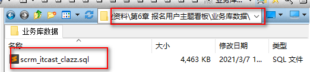
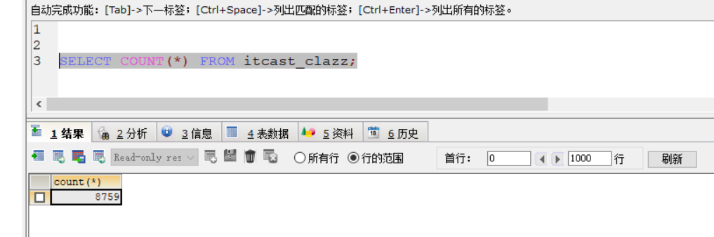
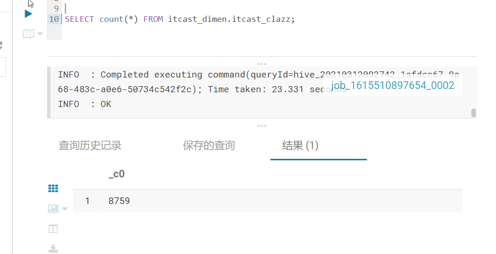
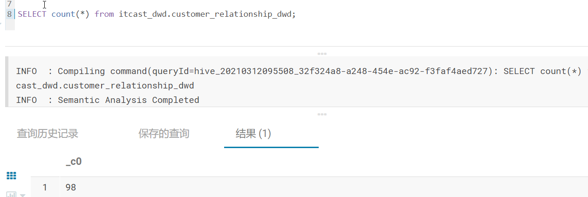
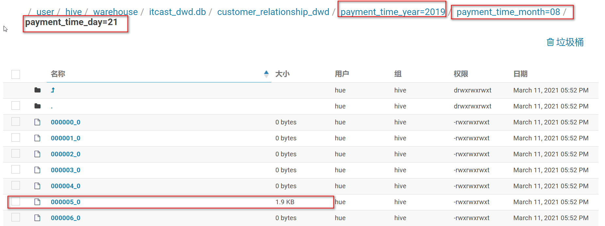
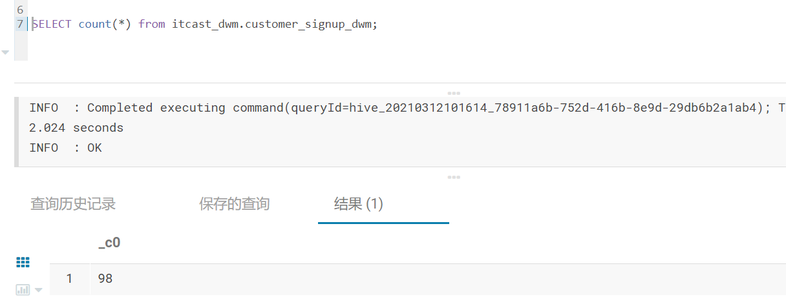
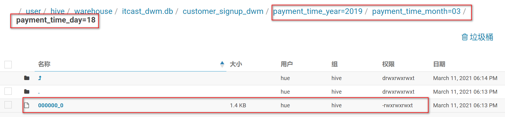
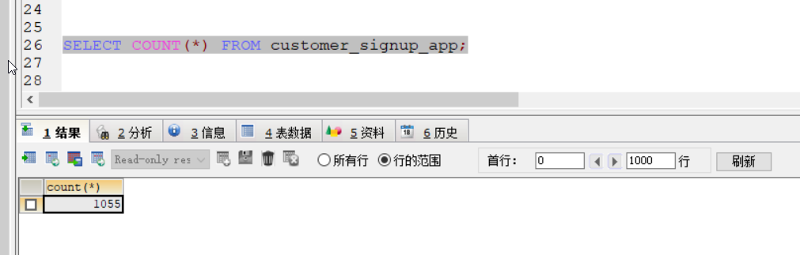
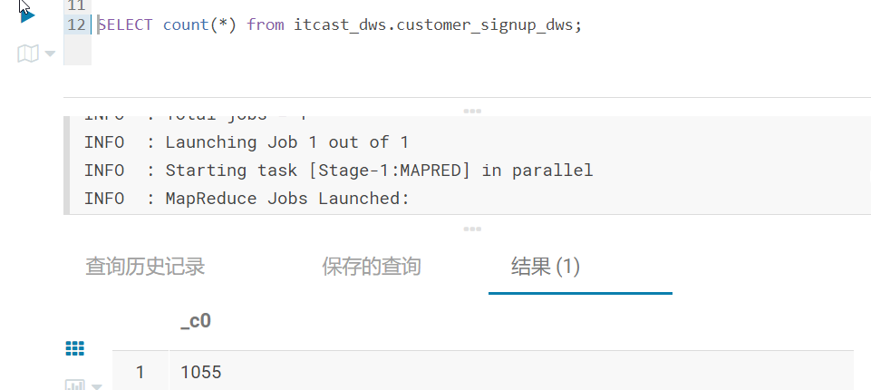

# 教育项目-报名用户主题看板

## 1- 报名用户主题看板_需求分析

### 1-1 校区报名量

- 需求：统计期内，全部报名客户中，各校区报名人数分布。
- sql

``` sql
SELECT  
    count( 1 ) '报名数量',  
    DATE_FORMAT( cr.payment_time, '%Y-%m-%d' ) '时间',  
    ic.itcast_school_name '校区名称'   
FROM  
    customer_relationship cr  
    LEFT JOIN itcast_clazz ic ON cr.itcast_clazz_id = ic.id   
WHERE  
    cr.payment_state = 'PAID'   
    AND DATE_FORMAT( cr.payment_time, '%Y-%m-%d' ) >= '2019-08-01'   
    AND DATE_FORMAT( cr.payment_time, '%Y-%m-%d' ) <= '2019-12-01'   
GROUP BY  
    DATE_FORMAT( cr.payment_time, '%Y-%m-%d' ),  
    ic.itcast_school_id   
ORDER BY  
    DATE_FORMAT( cr.payment_time, '%Y-%m-%d' ) ASC,  
    count( 1 ) DESC;  
```


``` properties
指标:报名人数
维度:
    时间维度:  年 月  天 小时
  	线上线下
  	校区维度

涉及到表: 
	customer_relationship意向表
	itcast_clazz报名课程表

涉及到字段:
	customer_relationship意向表
		cr.itcast_clazz_id	报名id
		cr.payment_state 付款状态 'PAID'表示已经付款
		cr.payment_time 付款时间
		线上线下维度: origin_type 
    	    判断依据:  当这个字段的值 等于 NETSERVICE 或者 PRESIGNUP 都认为线上, 否则为线下
    	    此处可以有转换操作: 将 origin_type 转换为 origin_type_stat
    	        新的字段只会有二个字段  1(线上)  和 0(线下)
		
	itcast_clazz报名课程表 
		id 
		itcast_school_id
		itcast_school_name '校区名称' 

关联条件: 
	意向表.itcast_clazz_id = 报名表.id
	

```


### 1-2 学科报名量

- 需求：统计期内，全部报名客户中，各学科报名人数分布
- sql

``` sql
SELECT  
    count( 1 ) '报名数量',  
    DATE_FORMAT( cr.payment_time, '%Y-%m-%d' ) '时间',  
    ic.itcast_subject_name '学科名称'   
FROM  
    customer_relationship cr  
    LEFT JOIN itcast_clazz ic ON cr.itcast_clazz_id = ic.id   
WHERE  
    cr.payment_state = 'PAID'   
    AND DATE_FORMAT( cr.payment_time, '%Y-%m-%d' ) >= '2019-08-01'   
    AND DATE_FORMAT( cr.payment_time, '%Y-%m-%d' ) <= '2019-12-01'   
GROUP BY  
    DATE_FORMAT( cr.payment_time, '%Y-%m-%d' ),  
    ic.itcast_subject_id   
ORDER BY  
    DATE_FORMAT( cr.payment_time, '%Y-%m-%d' ) ASC,  
 count( 1 ) DESC; 
```


``` properties
指标:报名人数
维度:
    时间维度:  年 月  天 小时
  	线上线下
  	学科维度

涉及到表: 
	customer_relationship意向表
	itcast_clazz报名课程表

涉及到字段:
	customer_relationship意向表
		cr.itcast_clazz_id	报名id
		cr.payment_state 付款状态 'PAID'表示已经付款
		cr.payment_time 付款时间
		
		线上线下维度: origin_type 
    	    判断依据:  当这个字段的值 等于 NETSERVICE 或者 PRESIGNUP 都认为线上, 否则为线下
    	    此处可以有转换操作: 将 origin_type 转换为 origin_type_stat
    	        新的字段只会有二个字段  1(线上)  和 0(线下)
		
	itcast_clazz报名课程表 
		id 
		itcast_subject_id 
		itcast_subject_name '学科名称'

关联条件: 
	意向表.itcast_clazz_id = 报名表.id
	

```


### 1-3 总报名量

- 需求: 统计期内，已经缴费的报名客户总量
- sql

``` sql
SELECT  
    count( customer_id ) '报名数量',  
    DATE_FORMAT( cr.payment_time, '%Y-%m-%d' ) '时间'  
FROM  
    customer_relationship cr  
WHERE  
    cr.payment_state = 'PAID'   
    AND DATE_FORMAT( cr.payment_time, '%Y-%m-%d' ) >= '2019-08-01'   
    AND DATE_FORMAT( cr.payment_time, '%Y-%m-%d' ) <= '2019-12-01'   
GROUP BY  
    DATE_FORMAT( cr.payment_time, '%Y-%m-%d' )  
ORDER BY  
    DATE_FORMAT( cr.payment_time, '%Y-%m-%d' ) ASC,  
    count( 1 ) DESC; 
```


``` properties
指标:报名人数
维度:
    时间维度:  年 月  天 小时
  	线上线下

涉及到表: 
	customer_relationship意向表

涉及到字段:
	customer_relationship意向表
		customer_id: 指标字段
		cr.payment_state 付款状态 'PAID'表示已经付款
		cr.payment_time 付款时间
		线上线下维度: origin_type 
    	    判断依据:  当这个字段的值 等于 NETSERVICE 或者 PRESIGNUP 都认为线上, 否则为线下
    	    此处可以有转换操作: 将 origin_type 转换为 origin_type_stat
    	        新的字段只会有二个字段  1(线上)  和 0(线下)
		

关联条件: 
	无
	
```


### 1-4 意向用户报名转化率

- 需求：统计期内，意向客户中报名的客户占比。全部报名人数/全部意向人数

``` properties
两个指标: 总报名人数 、 总意向人数（已经在意向主题里面完成）
指标: 总报名人数
维度:
    时间维度:  年 月  天 小时
  	线上线下
  	
总报名人数可以参考需求:总报名量
```


### 1-5 有效线索报名转化率

- 需求：线上报名量/线上有效线索量，与上一个指标类似，此处的线索量需要排除已申诉数据。

``` properties
两个指标: 总报名人数 、 有效线索总量（已经在有效线索主题里面完成）
指标: 总报名人数
维度:
    时间维度:  年 月  天 小时
  	线上线下
  	
总报名人数可以参考需求:总报名量
```


### 1-6 日报名趋势

- 需求：统计期内，每天报名人数的趋势图

``` properties
指标: 总报名人数
维度:
    时间维度:  年 月  天 小时
  	线上线下
  	
总报名人数可以参考需求:总报名量 然后下钻到小时
```


### 1-7 校区学科的报名学员TOP

- 需求：统计期内，全部报名学员中，校区学科排行榜，topN。A校区b学科第一，B校区a学科第二等等。

``` sql
SELECT  
    count(1) '总数',  
    itc.itcast_school_id,  
    itc.itcast_school_name,  
    itc.itcast_subject_id,
    itc.itcast_subject_name,  
    cr.payment_state,  
    cr.payment_time   
FROM  
    customer_relationship cr  
    LEFT JOIN itcast_clazz itc ON cr.itcast_clazz_id = itc.id   
WHERE  
    cr.payment_state = 'PAID'   
    AND cr.payment_time >= '2019-10-01'   
    AND cr.payment_time <= '2020-10-31 23:59:59'   
GROUP BY  
    itc.itcast_school_id,  
    itc.itcast_subject_id   
ORDER BY  
    count(1) DESC;
```


``` properties
指标: 报名人数
维度:
    时间维度:  年 月  天 小时
  	线上线下
  	校区维度
  	学科维度
  	
涉及到表: 
	customer_relationship意向表
	itcast_clazz报名课程表

涉及到字段:
	customer_relationship意向表
		customer_id: 指标字段
		cr.itcast_clazz_id	报名id
		cr.payment_state 付款状态 'PAID'表示已经付款
		cr.payment_time 付款时间
		线上线下维度: origin_type 
    	    判断依据:  当这个字段的值 等于 NETSERVICE 或者 PRESIGNUP 都认为线上, 否则为线下
    	    此处可以有转换操作: 将 origin_type 转换为 origin_type_stat
    	        新的字段只会有二个字段  1(线上)  和 0(线下)
		
	itcast_clazz报名课程表 
		id 
		itcast_school_id '校区ID'
		itcast_school_name '校区名称' 
		itc.itcast_subject_id '学科ID'
	    itc.itcast_subject_name '学科名称'

关联条件: 
	意向表.itcast_clazz_id = 报名表.id
```


### 1-8 来源渠道占比

- 需求：统计期内，全部报名学员中，不同来源渠道的报名学员占比情况。
- sql

``` sql
SELECT  
    count( 1 ) '总数',  
    cr.origin_type,  
    cr.payment_state,  
    cr.payment_time   
FROM  
    customer_relationship cr   
WHERE  
    cr.payment_state = 'PAID'   
    AND cr.payment_time >= '2019-10-01'   
    AND cr.payment_time <= '2019-10-31 23:59:59'   
GROUP BY  
    cr.origin_type;  
```


``` properties
指标: 报名人数
维度:
    时间维度:  年 月  天 小时
  	线上线下
  	来源渠道
  	
涉及到表: 
	customer_relationship意向表

涉及到字段:
	customer_relationship意向表
		customer_id: 指标字段
		cr.payment_state 付款状态 'PAID'表示已经付款
		cr.payment_time 付款时间
		cr.origin_type 来源渠道
		线上线下维度: origin_type 
    	    判断依据:  当这个字段的值 等于 NETSERVICE 或者 PRESIGNUP 都认为线上, 否则为线下
    	    此处可以有转换操作: 将 origin_type 转换为 origin_type_stat
    	        新的字段只会有二个字段  1(线上)  和 0(线下)

关联条件: 
	无
```


### 1-9 咨询中心报名贡献

- 需求：统计期内，全部报名学员中，各咨询中心的报名学员人数占比情况。
- sql

``` sql
SELECT  
    count( 1 ),  
    e.tdepart_id,  
    sd.`name`   
FROM  
    customer_relationship cr  
    LEFT JOIN employee e ON cr.creator = e.id  
    LEFT JOIN scrm_department sd ON e.tdepart_id = sd.id   
WHERE  
    cr.payment_state = 'PAID'   
    AND cr.payment_time >= '2019-10-01'   
    AND cr.payment_time <= '2019-10-31 23:59:59'   
GROUP BY  
    e.tdepart_id;  
```


``` properties
指标: 报名人数
维度:
    时间维度:  年 月  天 小时
  	线上线下
  	咨询中心
  	
涉及到表: 
	customer_relationship意向表
	employee员工表
	scrm_department部门表

涉及到字段:
	customer_relationship意向表
		creator 员工ID
		customer_id: 指标字段
		cr.payment_state 付款状态 'PAID'表示已经付款
		cr.payment_time 付款时间
		线上线下维度: origin_type 
    	    判断依据:  当这个字段的值 等于 NETSERVICE 或者 PRESIGNUP 都认为线上, 否则为线下
    	    此处可以有转换操作: 将 origin_type 转换为 origin_type_stat
    	        新的字段只会有二个字段  1(线上)  和 0(线下)

	employee员工表
		id 员工ID
		tdepart_id 部门ID
		
	scrm_department部门表
		name 部门名称

关联条件: 
	意向表.creator = 员工表.id 
	员工表.tdepart_id = 部门表.id
```


### 报名用户主题需求分析总结

``` properties
指标: 报名用户人数 (也就意味着在DWS层只有一个表即可)

维度: 
   	固有维度:
       	时间维度: 年 月 天 小时
      	线上线下
   	产品属性维度:
   		总报名量
   		来源渠道
   		咨询中心
   		校区维度
	  	学科维度


涉及到表:  
	事实表:
	    customer_relationship 意向表
    
    维度表:
        itcast_clazz 报名课程表
        employee 员工表
        scrm_department 部门表

四个表的关联条件(至少3个条件):
	意向表.itcast_clazz_id = 报名表.id
    意向表.creator = 员工表.id 
	员工表.tdepart_id = 部门表.id

涉及到字段: 
    
	customer_relationship意向表
		deleted = 0 有效数据;
		customer_id  指标字段 必须非空
		cr.itcast_clazz_id	报名id
		creator 员工ID
		cr.payment_state 付款状态 'PAID'表示已经付款
		cr.payment_time 付款时间 -- 转换为 payment_time_year,payment_time_month,payment_time_day payment_time_hour
		cr.origin_type 来源渠道
		线上线下维度: origin_type 
    	    判断依据:  当这个字段的值 等于 NETSERVICE 或者 PRESIGNUP 都认为线上, 否则为线下
    	    此处可以有转换操作: 将 origin_type 转换为 origin_type_stat
    	        新的字段只会有二个字段  1(线上)  和 0(线下)
	itcast_clazz报名课程表
		id 
		itcast_school_id '校区ID'
		itcast_school_name '校区名称' 
		itc.itcast_subject_id '学科ID'
	    itc.itcast_subject_name '学科名称'
	    
	employee员工表
		id
		tdepart_id 		部门ID.
		
 	scrm_department部门表
 		name 部门名称
		

整理需要转换和清洗的操作:
   清洗操作:
       1）将标记为删除的数据进行清洗 itcast_ods.customer_relationship where deleted = 0
       2）过滤已经报名信息:customer_relationship意向表.payment_state 付款状态 'PAID'表示已经付款;
       3）customer_id IS NOT NULL
       
   转换操作:
       1) customer_relationship意向表将origin_type 转换后(上卷)得到origin_type_stat(线上线下)
       	判断依据:  当这个字段的值 等于 NETSERVICE 或者 PRESIGNUP 都认为线上, 否则为线下
    	    此处可以有转换操作: 将 origin_type 转换为 origin_type_stat
    	        新的字段只会有二个字段  1(线上)  和 0(线下)
    	        
       2) customer_relationship意向表将 payment_time 转换为 payment_time_year,payment_time_month,payment_time_day payment_time_hour
  

注意: 报名数据不存在重复数据，所以在DWM层需要做细颗粒聚合操作，根据最小颗粒小时先聚合操作;
```


## 2- 报名用户主题看板_建模分析

``` properties
涉及到表:
    事实表: 
	    customer_relationship意向表
    
    维度表:
       	itcast_clazz报名课程表
		employee员工表
		scrm_department部门表
```


### ODS层:

``` properties
共计为一张表:
	
	customer_relationship意向表:已经在意向主题看板中添加了。
	
```


### DW层:

#### DWD:明细层

- 作用:  清洗转换操作  和 少量维度退化操作(本主题没有再dwd层维度退化操作)
- 需要清洗什么, 以及需要转换什么

``` properties
DWD层表字段组合:  清洗字段 + 转换后的字段 + 事实表必须要的字段 +事实表和其他表关联字段

需要转换和清洗的操作:
	清洗操作:
        1) 将标记为删除的数据进行清洗  deleted=0
 		2) customer_relationship意向表.payment_state 付款状态 'PAID'表示已经付款;
       	3) customer_id IS NOT NULL
       
   	转换操作:
       1) 意向表中将 origin_type 转换为 origin_type_stat(线上线下)
       		判断依据:  当这个字段的值 等于 NETSERVICE 或者 PRESIGNUP 都认为线上, 否则为线下
    	    此处可以有转换操作: 将 origin_type 转换为 origin_type_stat
    	        新的字段只会有二个字段  1(线上)  和 0(线下)
       2) 意向表中将 payment_time 转换为  	payment_time_year,payment_time_month,payment_time_day payment_time_hour
       

		
所有字段:
id,
customer_id,
origin_type,
origin_type_stat,
payment_time,
itcast_clazz_id,
creator,
payment_time_hour,
payment_time_year,payment_time_month,payment_time_day
		
```


#### DWM:中间层

- 作用: 维度退化 和 提前聚合操作

``` properties
说明: 在DWM层, 将会进行 申诉表关联操作, 实施维度退化过程, 将维度表相关的字段 全部合并汇总到一个表中
字段组成: 将指标字段 + 维度字段 合并在一起即可

操作:
	1- 去掉维度表：
		itcast_clazz报名课程表
		employee员工表
		scrm_department部门表
		
	2- 可以根据小时 先进行细小颗粒聚合: 就是在group by 的时候 从上到下直至 小时;

所有字段:
	customer_id,
	itcast_school_id
	itcast_school_name,
    itcast_subject_id,
    itcast_subject_name,
    tdepart_id,
    tdepart_name,
	origin_type,
	origin_type_stat,
	payment_time_hour,
	payment_time_year,payment_time_month,payment_time_day

```


#### DWS:业务层

* 作用: 基于各个细化维度统计指标数据

``` properties
表组成: 统计字段 + 各个维度字段 + 三个查询字段(time_Str,groupType,time_type)
	groupType :1：校区、学科组合分组；2：来源渠道分组；3：咨询中心分组；4:所有
  	time_type :1、按小时聚合；2、按天聚合；3、按周聚合；4、按月聚合；5、按年聚合。

操作:
	根据 年-月-日 分别对数据进行最后的聚合

所有字段:
	signup_num 
	itcast_school_id
	itcast_school_name,
    itcast_subject_id,
    itcast_subject_name,
    tdepart_id,
    tdepart_name,
	origin_type,
	origin_type_stat,
	payment_time_hour,
	time_Str,
	groupType,
	time_type,
	payment_time_year,payment_time_month,payment_time_day

```


### APP层：

​	无

### DIM层:

``` properties
共计三张表
	itcast_clazz 报名课程表
	employee员工表 : 已经在意向主题看板中添加
	scrm_department部门表: 已经在意向主题看板中添加
	
注意事项:
	1- 在表的最后多加一个starts_time字段，表示抽取时间;
	
```


## 3- 报名用户主题看板_业务初始化

* 建库语句(mysql中)

```SQL
create database  if not exists  scrm default character set utf8mb4 collate utf8mb4_unicode_ci;
```

* 导入报名课程表的数据




## 4- 报名用户主题看板_建模操作

### ODS层：

​	无

### DIM层：

#### 报名课程表

- 使用到优化技术：行组索引 + 开发过滤索引

  - 行组索引条件: 
     	1) 表必须是ORC类型
     	2) 建表时, 必须制定以下信息: ’orc.create.index’=’true’   开启行组索引
     	3) 在插入数据的时候, 必须要对建立索引的字段进行排序;否则min/max值就无意义;
     	4) 一般使用在数值类型的字段上

  - 开发过滤索引条件：

    ​	1) 表必须是ORC类型;
    ​	2) 在建表的时候, 需要指定那些字段作为开发过滤索引: "orc.bloom.filter.columns"="字段1,字段2.."
    ​	3) 只能进行 等值（=） 过滤查询, 不局限于类型

``` sql
CREATE EXTERNAL TABLE IF NOT EXISTS itcast_dimen.itcast_clazz (
  id int COMMENT 'ems课程id(非自增)',
  create_date_time STRING COMMENT '创建时间',
  update_date_time STRING COMMENT '最后更新时间',
  deleted STRING COMMENT '是否被删除（禁用）',
  itcast_school_id STRING COMMENT 'ems校区ID',
  itcast_school_name STRING COMMENT 'ems校区名称',
  itcast_subject_id STRING COMMENT 'ems学科ID',
  itcast_subject_name STRING COMMENT 'ems学科名称',
  itcast_brand STRING COMMENT 'ems品牌',
  clazz_type_state STRING COMMENT '班级类型状态',
  clazz_type_name STRING COMMENT '班级类型名称',
  teaching_mode STRING COMMENT '授课模式',
  start_time STRING COMMENT '开班时间',
  end_time STRING COMMENT '毕业时间',
  comment STRING COMMENT '备注',
  detail STRING COMMENT '详情(比如：27期)',
  uncertain STRING COMMENT '待定班(0:否,1:是)',
  tenant int COMMENT '租户',
  ends_time STRING COMMENT '有效时间')
comment '班级信息表'
PARTITIONED BY(starts_time STRING)
ROW FORMAT DELIMITED
FIELDS TERMINATED BY '\t'
stored as orc
TBLPROPERTIES ('orc.compress'='SNAPPY','orc.create.index'='true','orc.bloom.filter.columns'='id');
```


### DWD层：

#### customer_relationship_dwd表

- 根据 年 - 月 - 日 分区 

- 使用到优化技术：行组索引 + 开发过滤索引

  - 行组索引条件: 
     	1) 表必须是ORC类型
     	2) 建表时, 必须制定以下信息: ’orc.create.index’=’true’   开启行组索引
     	3) 在插入数据的时候, 必须要对建立索引的字段进行排序;否则min/max值就无意义;
     	4) 一般使用在数值类型的字段上

  - 开发过滤索引条件：

    ​	1) 表必须是ORC类型;
    ​	2) 在建表的时候, 需要指定那些字段作为开发过滤索引: "orc.bloom.filter.columns"="字段1,字段2.."
    ​	3) 只能进行 等值（=） 过滤查询, 不局限于类型

``` sql
CREATE TABLE IF NOT EXISTS itcast_dwd.customer_relationship_dwd (
  `id` int COMMENT '客户关系id',
  `customer_id` int COMMENT '所属客户id',
  `origin_type` STRING COMMENT '数据来源',
  `payment_time` STRING COMMENT '支付状态变动时间字符串',
  `payment_time_hour` STRING COMMENT '支付状态变动小时',
  `itcast_clazz_id` int COMMENT '报名课程id',
  `creator` int COMMENT '创建人id',
  `origin_type_stat` STRING COMMENT '数据来源:0.线下；1.线上' )
comment '客户关系表'
PARTITIONED BY (payment_time_year String, payment_time_month String, payment_time_day String)
CLUSTERED BY(id) sorted by(id) into 10 buckets
ROW FORMAT DELIMITED FIELDS TERMINATED BY '\t'
stored as orc
TBLPROPERTIES ('orc.compress'='SNAPPY','orc.create.index'='true','orc.bloom.filter.columns'='itcast_clazz_id,creator');
```


### DWM层：

#### customer_signup_dwm表

- 根据 年 - 月分区

``` sql
drop table itcast_dwm.customer_signup_dwm;
CREATE TABLE IF NOT EXISTS itcast_dwm.customer_signup_dwm (
  `customer_id` int COMMENT '报名客户id',
  `itcast_school_id` STRING COMMENT '学校id',
  `itcast_school_name` STRING COMMENT '学校namne',
  `itcast_subject_id` STRING COMMENT '学科id',
  `itcast_subject_name` STRING COMMENT '学科name',
  `tdepart_id` int COMMENT '咨询中心id',
  `tdepart_name` STRING COMMENT '咨询中心name',
  `origin_type` STRING COMMENT '来源渠道',
  origin_type_stat STRING COMMENT '数据来源:0.线下；1.线上',
  `payment_time_hour` STRING COMMENT '最后更新时间')
comment '报名人数统计中间表'
PARTITIONED BY (payment_time_year String, payment_time_month String, payment_time_day String)
ROW FORMAT DELIMITED
FIELDS TERMINATED BY '\t'
stored as orc
TBLPROPERTIES ('orc.compress'='SNAPPY');
```


### DWS层

#### customer_signup_dws表

- 根据 年 - 月分区

``` sql
drop table itcast_dws.customer_signup_dws;
CREATE TABLE IF NOT EXISTS itcast_dws.customer_signup_dws (
  `signup_num` int COMMENT '报名人数',
  `itcast_school_id` STRING COMMENT '学校id',
  `itcast_school_name` STRING COMMENT '学校namne',
  `itcast_subject_id` STRING COMMENT '学科id',
  `itcast_subject_name` STRING COMMENT '学科name',
  `tdepart_id` int COMMENT '咨询中心id',
  `tdepart_name` STRING COMMENT '咨询中心name',
  `origin_type` STRING COMMENT '来源渠道',
   origin_type_stat STRING COMMENT '数据来源:0.线下；1.线上',
  `payment_time_hour` STRING COMMENT '最后更新时间',
  `time_str` STRING COMMENT '时间明细',
  groupType STRING COMMENT '业务分组类型：1：校区、学科组合分组；2：来源渠道分组；3：咨询中心分组；4:所有',
  time_type STRING COMMENT '聚合时间类型：1、按小时聚合；2、按天聚合；3、按周聚合；4、按月聚合；5、按年聚合。'
  )
comment '报名人数统计业务表'
PARTITIONED BY (payment_time_year String, payment_time_month String, payment_time_day String)
ROW FORMAT DELIMITED
FIELDS TERMINATED BY '\t'
stored as orc
TBLPROPERTIES ('orc.compress'='SNAPPY');
```


## 5- 报名用户主题看板_数据采集

### 5-1 数据采集到ODS层

无

### 5-2 数据采集到DIM层

- sqoop导入

``` sql
sqoop import \
--connect jdbc:mysql://192.168.52.150:3306/scrm \
--username root \
--password 123456 \
--query 'select *,CURRENT_DATE() as starts_time,date_format("9999-12-31","%Y-%m-%d") as ends_time from itcast_clazz where $CONDITIONS' \
--hcatalog-database itcast_dimen \
--hcatalog-table itcast_clazz \
-m 1
```

- 数据验证

  - 业务数据库mysql

  

  

  - hive

  




## 6- 报名用户主题看板_数据清洗转换

### 6-1 生成DWD层数据

- 实现功能点:

``` properties
过滤清洗操作:
    1) 将标记为删除的数据进行清洗  delete = 0
    2) cr.payment_state='PAID' 确定已经付款;
    3) cr.customer_id is not null 指标字段不能为NULL;
       
   	转换操作:
       1) 意向表中将来源渠道origin_type 转换为 origin_type_stat(线上线下)
       		判断依据:  当这个字段的值 等于 NETSERVICE 或者 PRESIGNUP 都认为线上, 否则为线下
    	    此处可以有转换操作: 将 origin_type 转换为 origin_type_stat
    	        新的字段只会有二个字段  1(线上)  和 0(线下)
       2) 意向表中将 payment_time 转换为  				    payment_time_year,payment_time_month,payment_time_day payment_time_hour
       
      
```

- 使用的优化技术：

``` properties
--并行执行
set hive.exec.parallel=true;  --开启并行执行多阶段任务
set hive.exec.parallel.thread.number=8;  --支持8个阶段任务同时执行

-- 并行操作优化
	1- 并行编译多个HQL的优化;(Hive默认同时只能编译一段HiveQL，并上锁)
		set hive.driver.parallel.compilation=true
	2- 并行执行多个阶段任务的优化;(默认情况下，一次只执行一个阶段)
		set hive.exec.parallel=true;


--矢量化查询/批量化查询
set hive.vectorized.execution.enabled=true;
	1- 默认情况下MR一次只读取一行数据并处理;
	2- 批量化操作 就是一次读取1024行数据，并对整个数据处理;
	但是: 表的存储格式必须为ORC;
	
	

--读取零拷贝
set hive.exec.orc.zerocopy=true;

	1- 在读取表数据时，只读取我们需要的字段数据即可，这样就可以优化内存空间;
	但是: 表的存储格式必须为ORC;
```


- hive sql

``` sql
--分区
SET hive.exec.dynamic.partition=true;
SET hive.exec.dynamic.partition.mode=nonstrict;
set hive.exec.max.dynamic.partitions.pernode=10000;
set hive.exec.max.dynamic.partitions=100000;
set hive.exec.max.created.files=150000;
--hive压缩
set hive.exec.compress.intermediate=true;
set hive.exec.compress.output=true;
--写入时压缩生效
set hive.exec.orc.compression.strategy=COMPRESSION;
--分桶
set hive.enforce.bucketing=true;
set hive.enforce.sorting=true;
set hive.optimize.bucketmapjoin = true;
set hive.auto.convert.sortmerge.join=true;
set hive.auto.convert.sortmerge.join.noconditionaltask=true;
--并行执行
set hive.exec.parallel=true;
set hive.exec.parallel.thread.number=8;
--矢量化查询
set hive.vectorized.execution.enabled=true;
--读取零拷贝
set hive.exec.orc.zerocopy=true;

INSERT INTO itcast_dwd.customer_relationship_dwd PARTITION(payment_time_year, payment_time_month, payment_time_day)
select 
cr.id,
cr.customer_id,
nvl(cr.origin_type,-1) as origin_type,
cr.payment_time,
substr(cr.payment_time,12,2) as payment_time_hour,
nvl(cr.itcast_clazz_id,-1) as itcast_clazz_id,
nvl(cr.creator,-1) as creator ,
if(cr.origin_type='NETSERVICE' or cr.origin_type='PRESIGNUP',1,0) as origin_type_stat,
substr(cr.payment_time,1,4) as payment_time_year,
substr(cr.payment_time,6,2) as payment_time_month,
substr(cr.payment_time,9,2) as payment_time_day
from itcast_ods.customer_relationship cr 
where deleted = 0 and cr.payment_state='PAID' and cr.customer_id is not null
    
```

- 数据验证

  - 查询总量

  

  - 查询每年每月每天数据大小：因为是分桶采样数据，所以只有部分日期中有数据

    


### 6-2 生成DWM层数据

- 实现功能点:

``` properties
操作:
	1- 去掉维度表:
		itcast_clazz报名课程表
            id 
            itcast_school_id '校区ID'
            itcast_school_name '校区名称' 
            itc.itcast_subject_id '学科ID'
            itc.itcast_subject_name '学科名称'
            
        employee员工表
            id
            tdepart_id 		部门ID.
            
        scrm_department部门表
            name 部门名称
            
    关联关系:        
        意向表.itcast_clazz_id = 报名表.id
        意向表.creator = 员工表.id 
        员工表.tdepart_id = 部门表.id
		
	2- 可以根据小时 先进行细小颗粒聚合: 就是在group by 的时候 从上到下直至 小时;
```

- 使用的优化技术：

``` properties
-- 并行操作优化
set hive.exec.parallel=true;  --开启并行执行多阶段任务
set hive.exec.parallel.thread.number=8;  --支持8个阶段任务同时执行
	1- 并行编译多个HQL的优化;(Hive默认同时只能编译一段HiveQL，并上锁)
		set hive.driver.parallel.compilation=true
	2- 并行执行多个阶段任务的优化;(默认情况下，一次只执行一个阶段)
		set hive.exec.parallel=true;


--矢量化查询/批量化查询
set hive.vectorized.execution.enabled=true;
	1- 默认情况下MR一次只读取一行数据并处理;
	2- 批量化操作 就是一次读取1024行数据，并对整个数据处理;
	但是: 表的存储格式必须为ORC;
	
	

--读取零拷贝
set hive.exec.orc.zerocopy=true;
	1- 在读取表数据时，只读取我们需要的字段数据即可，这样就可以优化内存空间;
	但是: 表的存储格式必须为ORC;


--关联优化器
set hive.optimize.correlation=true;	--hive的关联优化器 减少shuffle次数
	1- 当一个MR 需要多次进入shuffle阶段的操作，当shuffle可以共享时就可以减少 shuffle操作次数来提升效率

--join数据倾斜-运行时优化
set hive.optimize.skewjoin=true;
-- set hive.skewjoin.key=100000;

--join数据倾斜-编译时优化
set hive.optimize.skewjoin.compiletime=true;

	1- join倾斜处理方案一: 
		map join ; 
		bucket map join (bucket列=join列，两表的buckets成倍数)
		smb join (bucket列=join列=sort列，两表的buckets相等)
	2- join倾斜处理方案二:
		将容易倾斜的值全部提取出来使用一个单独的MR来处理,再做最后的合并操作;
		运行时优化: 当某个值达到一定数量值后就可以优化;
		编译时优化: 在建表之前就必须指定哪些值会导致数据倾斜;
		
		

--union all的优化
set hive.optimize.union.remove=true;	
	1- 一般情况下:当union all时，也需要单独运行一个MR, 将两个结果进行合并;
	2- 开启union all 优化后，可以不用单独再开启一个MR;
```


- hive sql

``` sql
--分区
SET hive.exec.dynamic.partition=true;
SET hive.exec.dynamic.partition.mode=nonstrict;
set hive.exec.max.dynamic.partitions.pernode=10000;
set hive.exec.max.dynamic.partitions=100000;
set hive.exec.max.created.files=150000;
--hive压缩
set hive.exec.compress.intermediate=true;
set hive.exec.compress.output=true;
--写入时压缩生效
set hive.exec.orc.compression.strategy=COMPRESSION;
--分桶
set hive.enforce.bucketing=true;
set hive.enforce.sorting=true;
set hive.optimize.bucketmapjoin = true;
set hive.auto.convert.sortmerge.join=true;
set hive.auto.convert.sortmerge.join.noconditionaltask=true;
--并行执行
set hive.exec.parallel=true;
set hive.exec.parallel.thread.number=8;
--矢量化查询
set hive.vectorized.execution.enabled=true;
--关联优化器
set hive.optimize.correlation=true;
--读取零拷贝
set hive.exec.orc.zerocopy=true;
--join数据倾斜
set hive.optimize.skewjoin=true;
-- set hive.skewjoin.key=100000;
set hive.optimize.skewjoin.compiletime=true;
set hive.optimize.union.remove=true;


INSERT into itcast_dwm.customer_signup_dwm PARTITION (payment_time_year, payment_time_month, payment_time_day)

SELECT 
crd.customer_id,
ic.itcast_school_id,
ic.itcast_school_name,
ic.itcast_subject_id,
ic.itcast_subject_name,
e.tdepart_id,
sd.name as tdepart_name,
crd.origin_type,
crd.origin_type_stat,
crd.payment_time_hour,
crd.payment_time_year,
crd.payment_time_month,
crd.payment_time_day
from itcast_dwd.customer_relationship_dwd crd 
LEFT JOIN itcast_dimen.itcast_clazz ic on crd.itcast_clazz_id=ic.id 
LEFT JOIN itcast_dimen.employee e on crd.creator=e.id 
LEFT JOIN itcast_dimen.scrm_department sd on e.tdepart_id=sd.id;
```

- 数据验证

  - 查询总数据量

    

  - 查询每年每月每日下面数据大小

  


## 7- 报名用户主题看板_数据统计分析

- 功能实现点：

``` properties
表组成: 统计字段 + 各个维度字段 + 三个查询字段(time_Str,time_type,groupType)
	groupType :1：校区、学科组合分组；2：来源渠道分组；3：咨询中心分组；4:所有
  	time_type :1、按小时聚合；2、按天聚合；4、按月聚合；5、按年聚合。

操作:
	根据 年-月-日-小时 分别对数据进行最后的聚合
	还是根据 年-月-日 分区

所有字段:
	signup_num
	itcast_school_id
	itcast_school_name,
    itcast_subject_id,
    itcast_subject_name,
    tdepart_id,
    tdepart_name,
	origin_type,
	origin_type_stat,
	payment_time_hour,
	time_Str,
	groupType,
	time_type,
	payment_time_year,payment_time_month,payment_time_day
```


### 7-1 总报名用户量

- 统计每年 线上 线下 和报名用户量信息

``` sql
--分区
SET hive.exec.dynamic.partition=true;
SET hive.exec.dynamic.partition.mode=nonstrict;
set hive.exec.max.dynamic.partitions.pernode=10000;
set hive.exec.max.dynamic.partitions=100000;
set hive.exec.max.created.files=150000;
--hive压缩
set hive.exec.compress.intermediate=true;
set hive.exec.compress.output=true;
--写入时压缩生效
set hive.exec.orc.compression.strategy=COMPRESSION;
--分桶
set hive.enforce.bucketing=true;
set hive.enforce.sorting=true;
set hive.optimize.bucketmapjoin = true;
set hive.auto.convert.sortmerge.join=true;
set hive.auto.convert.sortmerge.join.noconditionaltask=true;
--并行执行
set hive.exec.parallel=true;
set hive.exec.parallel.thread.number=8;
--矢量化查询
set hive.vectorized.execution.enabled=true;
--关联优化器
set hive.optimize.correlation=true;
--读取零拷贝
set hive.exec.orc.zerocopy=true;
--join数据倾斜
set hive.optimize.skewjoin=true;
-- set hive.skewjoin.key=100000;
set hive.optimize.skewjoin.compiletime=true;
set hive.optimize.union.remove=true;
-- group倾斜
set hive.groupby.skewindata=true;


insert into itcast_dws.customer_signup_dws partition(payment_time_year, payment_time_month, payment_time_day)

SELECT 
    count(csd.customer_id) as signup_num,
	'-1' as itcast_school_id,
	'-1' as itcast_school_name,
    '-1' as itcast_subject_id,
    '-1' as itcast_subject_name,
    '-1' as tdepart_id,
    '-1' as tdepart_name,
	'-1' as origin_type,
	origin_type_stat,
	'-1' as payment_time_hour,
	concat(payment_time_year) as time_Str,
	'4' as groupType,
	'5' as time_type,
	payment_time_year,
	'-1' as payment_time_month,
	'-1' as payment_time_day
from itcast_dwm.customer_signup_dwm csd
group by csd.origin_type_stat ,csd.payment_time_year;


```


- 统计每年-每月 线上 线下 和报名用户量信息

``` sql
--分区
SET hive.exec.dynamic.partition=true;
SET hive.exec.dynamic.partition.mode=nonstrict;
set hive.exec.max.dynamic.partitions.pernode=10000;
set hive.exec.max.dynamic.partitions=100000;
set hive.exec.max.created.files=150000;
--hive压缩
set hive.exec.compress.intermediate=true;
set hive.exec.compress.output=true;
--写入时压缩生效
set hive.exec.orc.compression.strategy=COMPRESSION;
--分桶
set hive.enforce.bucketing=true;
set hive.enforce.sorting=true;
set hive.optimize.bucketmapjoin = true;
set hive.auto.convert.sortmerge.join=true;
set hive.auto.convert.sortmerge.join.noconditionaltask=true;
--并行执行
set hive.exec.parallel=true;
set hive.exec.parallel.thread.number=8;
--矢量化查询
set hive.vectorized.execution.enabled=true;
--关联优化器
set hive.optimize.correlation=true;
--读取零拷贝
set hive.exec.orc.zerocopy=true;
--join数据倾斜
set hive.optimize.skewjoin=true;
-- set hive.skewjoin.key=100000;
set hive.optimize.skewjoin.compiletime=true;
set hive.optimize.union.remove=true;
-- group倾斜
set hive.groupby.skewindata=true;


insert into itcast_dws.customer_signup_dws partition(payment_time_year, payment_time_month, payment_time_day)

SELECT 
    count(csd.customer_id) as signup_num,
	'-1' as itcast_school_id,
	'-1' as itcast_school_name,
    '-1' as itcast_subject_id,
    '-1' as itcast_subject_name,
    '-1' as tdepart_id,
    '-1' as tdepart_name,
	'-1' as origin_type,
	origin_type_stat,
	'-1' as payment_time_hour,
	concat(payment_time_year,'-',payment_time_month) as time_Str,
	'4' as groupType,
	'4' as time_type,
	payment_time_year,
	payment_time_month,
	'-1' as payment_time_day
from itcast_dwm.customer_signup_dwm csd
group by csd.origin_type_stat ,csd.payment_time_year,csd.payment_time_month;


```


- 统计每年-每月-每日 线上 线下 和报名用户量信息

``` sql
insert into itcast_dws.customer_signup_dws partition(payment_time_year, payment_time_month, payment_time_day)
SELECT 
    count(csd.customer_id) as signup_num,
	'-1' as itcast_school_id,
	'-1' as itcast_school_name,
    '-1' as itcast_subject_id,
    '-1' as itcast_subject_name,
    '-1' as tdepart_id,
    '-1' as tdepart_name,
	'-1' as origin_type,
	origin_type_stat,
	'-1' as payment_time_hour,
	concat(payment_time_year,'-',payment_time_month,'-',payment_time_day) as time_Str,
	'4' as groupType,
	'2' as time_type,
	payment_time_year,
	payment_time_month,
	payment_time_day
from itcast_dwm.customer_signup_dwm csd
group by csd.origin_type_stat ,csd.payment_time_year,csd.payment_time_month,csd.payment_time_day;
```


- 统计每年-每月-每日-每小时 线上 线下 和报名用户量信息

``` sql
insert into itcast_dws.customer_signup_dws partition(payment_time_year, payment_time_month, payment_time_day)
SELECT 
    count(csd.customer_id) as signup_num,
	'-1' as itcast_school_id,
	'-1' as itcast_school_name,
    '-1' as itcast_subject_id,
    '-1' as itcast_subject_name,
    '-1' as tdepart_id,
    '-1' as tdepart_name,
	'-1' as origin_type,
	origin_type_stat,
	payment_time_hour,
	concat(payment_time_year,'-',payment_time_month,'-',payment_time_day,' ',payment_time_hour) as time_Str,
	'4' as groupType,
	'1' as time_type,
	payment_time_year,
	payment_time_month,
	payment_time_day
from itcast_dwm.customer_signup_dwm csd
group by csd.origin_type_stat ,csd.payment_time_year,csd.payment_time_month,csd.payment_time_day,csd.payment_time_hour;
```


### 7-2 各个咨询中心报名用户量

- 统计各个咨询中心每年 线上 线下 和报名用户量信息

``` sql
--分区
SET hive.exec.dynamic.partition=true;
SET hive.exec.dynamic.partition.mode=nonstrict;
set hive.exec.max.dynamic.partitions.pernode=10000;
set hive.exec.max.dynamic.partitions=100000;
set hive.exec.max.created.files=150000;
--hive压缩
set hive.exec.compress.intermediate=true;
set hive.exec.compress.output=true;
--写入时压缩生效
set hive.exec.orc.compression.strategy=COMPRESSION;
--分桶
set hive.enforce.bucketing=true;
set hive.enforce.sorting=true;
set hive.optimize.bucketmapjoin = true;
set hive.auto.convert.sortmerge.join=true;
set hive.auto.convert.sortmerge.join.noconditionaltask=true;
--并行执行
set hive.exec.parallel=true;
set hive.exec.parallel.thread.number=8;
--矢量化查询
set hive.vectorized.execution.enabled=true;
--关联优化器
set hive.optimize.correlation=true;
--读取零拷贝
set hive.exec.orc.zerocopy=true;
--join数据倾斜
set hive.optimize.skewjoin=true;
-- set hive.skewjoin.key=100000;
set hive.optimize.skewjoin.compiletime=true;
set hive.optimize.union.remove=true;
-- group倾斜
set hive.groupby.skewindata=true;


insert into itcast_dws.customer_signup_dws partition(payment_time_year, payment_time_month, payment_time_day)

SELECT 
    count(csd.customer_id) as signup_num,
	'-1' as itcast_school_id,
	'-1' as itcast_school_name,
    '-1' as itcast_subject_id,
    '-1' as itcast_subject_name,
    tdepart_id,
    tdepart_name,
	'-1' as origin_type,
	origin_type_stat,
	'-1' as payment_time_hour,
	concat(payment_time_year) as time_Str,
	'3' as groupType,
	'5' as time_type,
	payment_time_year,
	'-1' as payment_time_month,
	'-1' as payment_time_day
from itcast_dwm.customer_signup_dwm csd
group by csd.origin_type_stat ,csd.payment_time_year,csd.tdepart_id,csd.tdepart_name;


```


- 统计各个咨询中心每年-每月 线上 线下 和报名用户量信息

``` sql
--分区
SET hive.exec.dynamic.partition=true;
SET hive.exec.dynamic.partition.mode=nonstrict;
set hive.exec.max.dynamic.partitions.pernode=10000;
set hive.exec.max.dynamic.partitions=100000;
set hive.exec.max.created.files=150000;
--hive压缩
set hive.exec.compress.intermediate=true;
set hive.exec.compress.output=true;
--写入时压缩生效
set hive.exec.orc.compression.strategy=COMPRESSION;
--分桶
set hive.enforce.bucketing=true;
set hive.enforce.sorting=true;
set hive.optimize.bucketmapjoin = true;
set hive.auto.convert.sortmerge.join=true;
set hive.auto.convert.sortmerge.join.noconditionaltask=true;
--并行执行
set hive.exec.parallel=true;
set hive.exec.parallel.thread.number=8;
--矢量化查询
set hive.vectorized.execution.enabled=true;
--关联优化器
set hive.optimize.correlation=true;
--读取零拷贝
set hive.exec.orc.zerocopy=true;
--join数据倾斜
set hive.optimize.skewjoin=true;
-- set hive.skewjoin.key=100000;
set hive.optimize.skewjoin.compiletime=true;
set hive.optimize.union.remove=true;
-- group倾斜
set hive.groupby.skewindata=true;


insert into itcast_dws.customer_signup_dws partition(payment_time_year, payment_time_month, payment_time_day)

SELECT 
    count(csd.customer_id) as signup_num,
	'-1' as itcast_school_id,
	'-1' as itcast_school_name,
    '-1' as itcast_subject_id,
    '-1' as itcast_subject_name,
    tdepart_id,
    tdepart_name,
	'-1' as origin_type,
	origin_type_stat,
	'-1' as payment_time_hour,
	concat(payment_time_year,'-',payment_time_month) as time_Str,
	'3' as groupType,
	'4' as time_type,
	payment_time_year,
	payment_time_month,
	'-1' as payment_time_day
from itcast_dwm.customer_signup_dwm csd
group by csd.origin_type_stat ,csd.payment_time_year,csd.payment_time_month,csd.tdepart_id,csd.tdepart_name;


```


- 统计各个咨询中心每年-每月-每日 线上 线下 和报名用户量信息

``` sql
insert into itcast_dws.customer_signup_dws partition(payment_time_year, payment_time_month, payment_time_day)
SELECT 
    count(csd.customer_id) as signup_num,
	'-1' as itcast_school_id,
	'-1' as itcast_school_name,
    '-1' as itcast_subject_id,
    '-1' as itcast_subject_name,
 	tdepart_id,
	tdepart_name,
	'-1' as origin_type,
	origin_type_stat,
	'-1' as payment_time_hour,
	concat(payment_time_year,'-',payment_time_month,'-',payment_time_day) as time_Str,
	'3' as groupType,
	'2' as time_type,
	payment_time_year,
	payment_time_month,
	payment_time_day
from itcast_dwm.customer_signup_dwm csd
group by csd.origin_type_stat ,csd.payment_time_year,csd.payment_time_month,csd.payment_time_day,csd.tdepart_id,csd.tdepart_name;
```


- 统计各个咨询中心每年-每月-每日-每小时 线上 线下 和报名用户量信息

``` sql
insert into itcast_dws.customer_signup_dws partition(payment_time_year, payment_time_month, payment_time_day)
SELECT 
    count(csd.customer_id) as signup_num,
	'-1' as itcast_school_id,
	'-1' as itcast_school_name,
    '-1' as itcast_subject_id,
    '-1' as itcast_subject_name,
    tdepart_id,
    tdepart_name,
	'-1' as origin_type,
	origin_type_stat,
	payment_time_hour,
	concat(payment_time_year,'-',payment_time_month,'-',payment_time_day,' ',payment_time_hour) as time_Str,
	'3' as groupType,
	'1' as time_type,
	payment_time_year,
	payment_time_month,
	payment_time_day
from itcast_dwm.customer_signup_dwm csd
group by csd.origin_type_stat ,csd.payment_time_year,csd.payment_time_month,csd.payment_time_day,csd.payment_time_hour,csd.tdepart_id,csd.tdepart_name;
```

### 7-3 各个来源渠道报名用户量

- 统计来源渠道每年 线上 线下 和报名用户量信息

``` sql
--分区
SET hive.exec.dynamic.partition=true;
SET hive.exec.dynamic.partition.mode=nonstrict;
set hive.exec.max.dynamic.partitions.pernode=10000;
set hive.exec.max.dynamic.partitions=100000;
set hive.exec.max.created.files=150000;
--hive压缩
set hive.exec.compress.intermediate=true;
set hive.exec.compress.output=true;
--写入时压缩生效
set hive.exec.orc.compression.strategy=COMPRESSION;
--分桶
set hive.enforce.bucketing=true;
set hive.enforce.sorting=true;
set hive.optimize.bucketmapjoin = true;
set hive.auto.convert.sortmerge.join=true;
set hive.auto.convert.sortmerge.join.noconditionaltask=true;
--并行执行
set hive.exec.parallel=true;
set hive.exec.parallel.thread.number=8;
--矢量化查询
set hive.vectorized.execution.enabled=true;
--关联优化器
set hive.optimize.correlation=true;
--读取零拷贝
set hive.exec.orc.zerocopy=true;
--join数据倾斜
set hive.optimize.skewjoin=true;
-- set hive.skewjoin.key=100000;
set hive.optimize.skewjoin.compiletime=true;
set hive.optimize.union.remove=true;
-- group倾斜
set hive.groupby.skewindata=true;


insert into itcast_dws.customer_signup_dws partition(payment_time_year, payment_time_month, payment_time_day)

SELECT 
    count(csd.customer_id) as signup_num,
	'-1' as itcast_school_id,
	'-1' as itcast_school_name,
    '-1' as itcast_subject_id,
    '-1' as itcast_subject_name,
    '-1' as tdepart_id,
    '-1' as tdepart_name,
	origin_type,
	origin_type_stat,
	'-1' as payment_time_hour,
	concat(payment_time_year) as time_Str,
	'2' as groupType,
	'5' as time_type,
	payment_time_year,
	'-1' as payment_time_month,
	'-1' as payment_time_day
from itcast_dwm.customer_signup_dwm csd
group by csd.origin_type_stat ,csd.payment_time_year,csd.origin_type;


```


- 统计来源渠道每年-每月 线上 线下 和报名用户量信息

``` sql
--分区
SET hive.exec.dynamic.partition=true;
SET hive.exec.dynamic.partition.mode=nonstrict;
set hive.exec.max.dynamic.partitions.pernode=10000;
set hive.exec.max.dynamic.partitions=100000;
set hive.exec.max.created.files=150000;
--hive压缩
set hive.exec.compress.intermediate=true;
set hive.exec.compress.output=true;
--写入时压缩生效
set hive.exec.orc.compression.strategy=COMPRESSION;
--分桶
set hive.enforce.bucketing=true;
set hive.enforce.sorting=true;
set hive.optimize.bucketmapjoin = true;
set hive.auto.convert.sortmerge.join=true;
set hive.auto.convert.sortmerge.join.noconditionaltask=true;
--并行执行
set hive.exec.parallel=true;
set hive.exec.parallel.thread.number=8;
--矢量化查询
set hive.vectorized.execution.enabled=true;
--关联优化器
set hive.optimize.correlation=true;
--读取零拷贝
set hive.exec.orc.zerocopy=true;
--join数据倾斜
set hive.optimize.skewjoin=true;
-- set hive.skewjoin.key=100000;
set hive.optimize.skewjoin.compiletime=true;
set hive.optimize.union.remove=true;
-- group倾斜
set hive.groupby.skewindata=true;


insert into itcast_dws.customer_signup_dws partition(payment_time_year, payment_time_month, payment_time_day)

SELECT 
    count(csd.customer_id) as signup_num,
	'-1' as itcast_school_id,
	'-1' as itcast_school_name,
    '-1' as itcast_subject_id,
    '-1' as itcast_subject_name,
    '-1' as tdepart_id,
    '-1' as tdepart_name,
	origin_type,
	origin_type_stat,
	'-1' as payment_time_hour,
	concat(payment_time_year,'-',payment_time_month) as time_Str,
	'2' as groupType,
	'4' as time_type,
	payment_time_year,
	payment_time_month,
	'-1' as payment_time_day
from itcast_dwm.customer_signup_dwm csd
group by csd.origin_type_stat ,csd.payment_time_year,csd.payment_time_month,csd.origin_type;


```


- 统计来源渠道每年-每月-每日 线上 线下 和报名用户量信息

``` sql
insert into itcast_dws.customer_signup_dws partition(payment_time_year, payment_time_month, payment_time_day)
SELECT 
    count(csd.customer_id) as signup_num,
	'-1' as itcast_school_id,
	'-1' as itcast_school_name,
    '-1' as itcast_subject_id,
    '-1' as itcast_subject_name,
    '-1' as tdepart_id,
    '-1' as tdepart_name,
	origin_type,
	origin_type_stat,
	'-1' as payment_time_hour,
	concat(payment_time_year,'-',payment_time_month,'-',payment_time_day) as time_Str,
	'2' as groupType,
	'2' as time_type,
	payment_time_year,
	payment_time_month,
	payment_time_day
from itcast_dwm.customer_signup_dwm csd
group by csd.origin_type_stat ,csd.payment_time_year,csd.payment_time_month,csd.payment_time_day,csd.origin_type;
```


- 统计来源渠道每年-每月-每日-每小时 线上 线下 和报名用户量信息

``` sql
insert into itcast_dws.customer_signup_dws partition(payment_time_year, payment_time_month, payment_time_day)
SELECT 
    count(csd.customer_id) as signup_num,
	'-1' as itcast_school_id,
	'-1' as itcast_school_name,
    '-1' as itcast_subject_id,
    '-1' as itcast_subject_name,
    '-1' as tdepart_id,
    '-1' as tdepart_name,
	origin_type,
	origin_type_stat,
	payment_time_hour,
	concat(payment_time_year,'-',payment_time_month,'-',payment_time_day,' ',payment_time_hour) as time_Str,
	'2' as groupType,
	'1' as time_type,
	payment_time_year,
	payment_time_month,
	payment_time_day
from itcast_dwm.customer_signup_dwm csd
group by csd.origin_type_stat ,csd.payment_time_year,csd.payment_time_month,csd.payment_time_day,csd.payment_time_hour,csd.origin_type;
```


### 7-4 各个校区、学科报名用户量

- 统计校区、学科每年 线上 线下 和报名用户量信息

``` sql
--分区
SET hive.exec.dynamic.partition=true;
SET hive.exec.dynamic.partition.mode=nonstrict;
set hive.exec.max.dynamic.partitions.pernode=10000;
set hive.exec.max.dynamic.partitions=100000;
set hive.exec.max.created.files=150000;
--hive压缩
set hive.exec.compress.intermediate=true;
set hive.exec.compress.output=true;
--写入时压缩生效
set hive.exec.orc.compression.strategy=COMPRESSION;
--分桶
set hive.enforce.bucketing=true;
set hive.enforce.sorting=true;
set hive.optimize.bucketmapjoin = true;
set hive.auto.convert.sortmerge.join=true;
set hive.auto.convert.sortmerge.join.noconditionaltask=true;
--并行执行
set hive.exec.parallel=true;
set hive.exec.parallel.thread.number=8;
--矢量化查询
set hive.vectorized.execution.enabled=true;
--关联优化器
set hive.optimize.correlation=true;
--读取零拷贝
set hive.exec.orc.zerocopy=true;
--join数据倾斜
set hive.optimize.skewjoin=true;
-- set hive.skewjoin.key=100000;
set hive.optimize.skewjoin.compiletime=true;
set hive.optimize.union.remove=true;
-- group倾斜
set hive.groupby.skewindata=true;


insert into itcast_dws.customer_signup_dws partition(payment_time_year, payment_time_month, payment_time_day)

SELECT 
    count(csd.customer_id) as signup_num,
	itcast_school_id,
	itcast_school_name,
    itcast_subject_id,
    itcast_subject_name,
    '-1' as tdepart_id,
    '-1' as tdepart_name,
	'-1' as origin_type,
	origin_type_stat,
	'-1' as payment_time_hour,
	concat(payment_time_year) as time_Str,
	'1' as groupType,
	'5' as time_type,
	payment_time_year,
	'-1' as payment_time_month,
	'-1' as payment_time_day
from itcast_dwm.customer_signup_dwm csd
group by csd.origin_type_stat ,csd.payment_time_year,csd.itcast_school_id,
	csd.itcast_school_name,
    csd.itcast_subject_id,
    csd.itcast_subject_name;


```


- 统计校区、学科每年-每月 线上 线下 和报名用户量信息

``` sql
--分区
SET hive.exec.dynamic.partition=true;
SET hive.exec.dynamic.partition.mode=nonstrict;
set hive.exec.max.dynamic.partitions.pernode=10000;
set hive.exec.max.dynamic.partitions=100000;
set hive.exec.max.created.files=150000;
--hive压缩
set hive.exec.compress.intermediate=true;
set hive.exec.compress.output=true;
--写入时压缩生效
set hive.exec.orc.compression.strategy=COMPRESSION;
--分桶
set hive.enforce.bucketing=true;
set hive.enforce.sorting=true;
set hive.optimize.bucketmapjoin = true;
set hive.auto.convert.sortmerge.join=true;
set hive.auto.convert.sortmerge.join.noconditionaltask=true;
--并行执行
set hive.exec.parallel=true;
set hive.exec.parallel.thread.number=8;
--矢量化查询
set hive.vectorized.execution.enabled=true;
--关联优化器
set hive.optimize.correlation=true;
--读取零拷贝
set hive.exec.orc.zerocopy=true;
--join数据倾斜
set hive.optimize.skewjoin=true;
-- set hive.skewjoin.key=100000;
set hive.optimize.skewjoin.compiletime=true;
set hive.optimize.union.remove=true;
-- group倾斜
set hive.groupby.skewindata=true;


insert into itcast_dws.customer_signup_dws partition(payment_time_year, payment_time_month, payment_time_day)

SELECT 
    count(csd.customer_id) as signup_num,
	itcast_school_id,
	itcast_school_name,
    itcast_subject_id,
    itcast_subject_name,
    '-1' as tdepart_id,
    '-1' as tdepart_name,
	'-1' as origin_type,
	origin_type_stat,
	'-1' as payment_time_hour,
	concat(payment_time_year,'-',payment_time_month) as time_Str,
	'1' as groupType,
	'4' as time_type,
	payment_time_year,
	payment_time_month,
	'-1' as payment_time_day
from itcast_dwm.customer_signup_dwm csd
group by csd.origin_type_stat ,csd.payment_time_year,csd.payment_time_month,csd.itcast_school_id,
	csd.itcast_school_name,
    csd.itcast_subject_id,
    csd.itcast_subject_name;


```


- 统计校区、学科每年-每月-每日 线上 线下 和报名用户量信息

``` sql
insert into itcast_dws.customer_signup_dws partition(payment_time_year, payment_time_month, payment_time_day)
SELECT 
    count(csd.customer_id) as signup_num,
	itcast_school_id,
	itcast_school_name,
    itcast_subject_id,
    itcast_subject_name,
    '-1' as tdepart_id,
    '-1' as tdepart_name,
	'-1' as origin_type,
	origin_type_stat,
	'-1' as payment_time_hour,
	concat(payment_time_year,'-',payment_time_month,'-',payment_time_day) as time_Str,
	'1' as groupType,
	'2' as time_type,
	payment_time_year,
	payment_time_month,
	payment_time_day
from itcast_dwm.customer_signup_dwm csd
group by csd.origin_type_stat ,csd.payment_time_year,csd.payment_time_month,csd.payment_time_day,csd.itcast_school_id,
	csd.itcast_school_name,
    csd.itcast_subject_id,
    csd.itcast_subject_name;
```


- 统计校区、学科每年-每月-每日-每小时 线上 线下 和报名用户量信息

``` sql
insert into itcast_dws.customer_signup_dws partition(payment_time_year, payment_time_month, payment_time_day)
SELECT 
    count(csd.customer_id) as signup_num,
	itcast_school_id,
	itcast_school_name,
    itcast_subject_id,
    itcast_subject_name,
    '-1' as tdepart_id,
    '-1' as tdepart_name,
	'-1' as origin_type,
	origin_type_stat,
	payment_time_hour,
	concat(payment_time_year,'-',payment_time_month,'-',payment_time_day,' ',payment_time_hour) as time_Str,
	'1' as groupType,
	'1' as time_type,
	payment_time_year,
	payment_time_month,
	payment_time_day
from itcast_dwm.customer_signup_dwm csd
group by csd.origin_type_stat ,csd.payment_time_year,csd.payment_time_month,csd.payment_time_day,csd.payment_time_hour,csd.itcast_school_id,
	csd.itcast_school_name,
    csd.itcast_subject_id,
    csd.itcast_subject_name;
```


## 8- 报名用户主题看板_数据导出

### 8-1 在业务数据库scrm_bi创建表

``` sql
CREATE TABLE `customer_signup_app` (
   `signup_num` int(11) COMMENT '报名人数',
   `itcast_school_id` varchar(32) COMMENT '学校id',
   `itcast_school_name` varchar(32) COMMENT '学校name',
   `itcast_subject_id` varchar(32) COMMENT '学科id',
   `itcast_subject_name` varchar(32) COMMENT '学科name',
   `tdepart_id` int(11) COMMENT '咨询中心id',
   `tdepart_name` varchar(32) COMMENT '咨询中心name',
   `origin_type` varchar(32) COMMENT '来源渠道',
   `origin_type_stat` varchar(32) COMMENT '数据来源:0.线下；1.线上',
   `payment_time_hour` varchar(32) COMMENT '最后更新时间',
   `time_str` varchar(32) COMMENT '时间明细',
   `groupType` varchar(32) COMMENT '统计分组类型：1：校区、学科组合分组；2：来源渠道分组；3：咨询中心分组；4:所有',
   `time_type` varchar(32) COMMENT '聚合时间类型：1、按小时聚合(；2、按天聚合；3、按周聚合；4、按月聚合；5、按年聚合。',
   `payment_time_year` varchar(32) COMMENT '年信息',
   `payment_time_month` varchar(32) COMMENT '月信息',
   `payment_time_day` varchar(32) COMMENT '日信息'
   
);
```


### 8-2 sqoop 导出脚本

``` sql
sqoop export \
--connect "jdbc:mysql://192.168.52.150:3306/scrm_bi?useUnicode=true&characterEncoding=utf-8" \
--username root \
--password 123456 \
--table customer_signup_app \
--hcatalog-database itcast_dws \
--hcatalog-table customer_signup_dws \
-m 1
```

- 数据验证

  
  
  

​		


## 9- 报名用户主题看板_增量实现

略。。。

