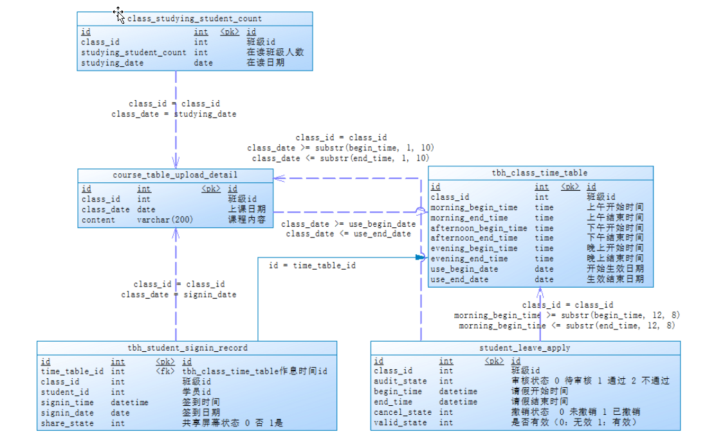
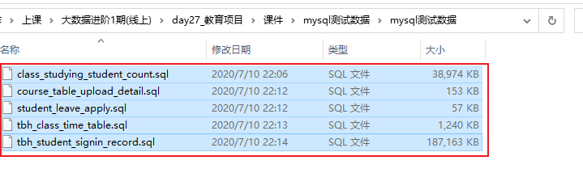

# 教育项目-学生出勤主题看板




## 1. 学生出勤主题看板_需求分析

* 需求一: 统计指定时间段内，不同班级的出勤人数。打卡时间在上课前40分钟(否则认为无效)~上课时间点之内，且未早退，则为正常上课打卡。可以下钻到具体学生的出勤数据。跨天数据直接累加。

```properties
指标:  出勤人数
维度:
   时间维度: 年 月  日   上午  下午  晚自习
   班级维度:
   学生维度:

判定是否出勤:
    打卡时间:  在上课前40分钟内 ~  上课结束时间
正常出勤: 
    打卡时间:  在上课前40分钟内 ~ 上课开始10分钟内
```

* 需求二: 统计指定时间段内，不同班级的学生出勤率。可以下钻到具体学生的出勤数据。出勤率=出勤人数/当日在读学员人数。

```properties
指标:   出勤率 
维度:
   时间维度: 年 月  日   上午  下午  晚自习
   班级维度
   学生维度

指标计算公式:  出勤率=出勤人数/当日在读学员人数

```

* 需求三: 统计指定时间段内，不同班级的迟到人数。上课10分钟后视为迟到。可以下钻到具体学生的迟到数据。跨天数据直接累加

```properties
指标:  迟到人数
维度: 
	时间维度: 年 月  日   上午  下午  晚自习
	班级维度:
	学生维度:

如何判断迟到:
    打卡时间: 开始上课时间后10分打卡 ~  上课结束时间
```

* 需求四: 统计指定时间段内，不同班级的学生迟到率。上课10分钟后视为迟到。可以下钻到具体学生的迟到数据。迟到率=迟到人数/当日在读学员人数。

```properties
指标:  迟到率
维度: 
	时间维度: 年 月  日   上午  下午  晚自习
	班级维度:
	学生维度:
迟到率=迟到人数/当日在读学员人数。


涉及到表:
    course_table_upload_detail(班级日期课程表)
    tbh_student_signin_record (学生打卡记录表)
    tbh_class_time_table(班级作息时间表)

涉及到字段:
     course_table_upload_detail(班级日期课程表):
        判断依据:
            content is not null
            content != ''
            content != '开班典礼'
        班级维度: class_id
     tbh_student_signin_record (学生打卡记录表)
         判断依据:
            share_state = 1  表示学生正常开启共屏学习
         学生维度: student_id
         指标字段: signin_time  (打卡时间)
	 
	 tbh_class_time_table(班级作息时间表)
	     morning_begin_time
	     morning_end_time
	     afternoon_begin_time
	     afternoon_end_time
	     evening_begin_time
	     evening_end_time
	
关联条件:
    学生打卡记录表.class_id = 班级日期课程表.class_id
    班级作息时间表.id = 学生打卡记录表.time_table_id
```


```sql
select 
dt.every_date,
       ctud.class_id,
       tssr.student_id,
       if(
           #上午正常打卡为0，迟到10分钟以上为1，其他(请假+旷课)为2
           sum(
               case
               #上午打卡时间是否在上课前40分钟~下课时间段之内
                   when time(tssr.signin_time) between TIMESTAMPADD(minute, -40, tctt.morning_begin_time) and tctt.morning_end_time
                       then 1   #上午来了
                   else 0 end   #上午没来
            ) > 0,  #打卡多次，只要有一次正常打卡，就会>0，返回true；否则没来，返回false
           if(
               sum(
                   case
               #上午打卡时间是否在上课前40分钟~上课后10分钟之内
                      when time(tssr.signin_time) between TIMESTAMPADD(minute, -40, tctt.morning_begin_time) and TIMESTAMPADD(minute, 10, tctt.morning_begin_time)
                          then 1    #正常出勤
                      else 0 end    #迟到
                ) > 0,              #有一次打卡是正常出勤，就会>0，返回true；否则迟到，返回false
               0,   #正常出勤
               1    #迟到
            ),
           2    #上午没来
        ) as morning_signin,
        
        
       if(
           #下午正常打卡为0，迟到10分钟以上为1，其他(请假+旷课)为2
                   sum(case
                           when time(tssr.signin_time) between TIMESTAMPADD(minute, -40, tctt.afternoon_begin_time) and tctt.afternoon_end_time
                               then 1
                           else 0 end) > 0,
                   if(sum(case
                              when time(tssr.signin_time) between TIMESTAMPADD(minute, -40, tctt.afternoon_begin_time) and TIMESTAMPADD(minute, 10, tctt.afternoon_begin_time)
                                  then 1
                              else 0 end) > 0, 0, 1), 2) as afternoon_signin,
                              
                              
       if(
           #晚自习正常打卡为0，迟到10分钟以上为1，其他(请假+旷课)为2
                   sum(case
                           when time(tssr.signin_time) between TIMESTAMPADD(minute, -20, tctt.evening_begin_time) and tctt.evening_end_time
                               then 1
                           else 0 end) > 0,
                   if(sum(case
                              when time(tssr.signin_time) between TIMESTAMPADD(minute, -20, tctt.evening_begin_time) and TIMESTAMPADD(minute, 10, tctt.evening_begin_time)
                                  then 1
                              else 0 end) > 0, 0, 1), 2) as evening_signin

from (
         #获取今天之前一周内的日期
         select datelist as every_date from calendar where datelist between '2019-09-01' and '2019-09-30'
     ) dt
         #日期课表不为空且不是开班典礼
         left join course_table_upload_detail ctud
                   on ctud.class_date = dt.every_date and ifnull(ctud.content, '') != '' and
                      ctud.content != '开班典礼'
    #学生打卡记录日期和班级匹配，且开启共屏进入学习
         left join tbh_student_signin_record tssr
                   on tssr.class_id = ctud.class_id and tssr.signin_date = dt.every_date and
                      tssr.share_state = 1
    #获取班级作息时间以判断是否按时出勤
         left join tbh_class_time_table tctt on tctt.id = tssr.time_table_id
     #按照日期、班级、学生分组统计
group by dt.every_date, ctud.class_id, tssr.student_id;

```

* 需求五: 统计指定时间段内，不同班级的请假人数。跨天数据直接累加。

```properties
指标:请假人数
维度: 
   时间维度 : 年 月 天   上午 下午 晚自习
   班级维度

涉及到表:
     student_leave_apply (学生请假表)
     tbh_class_time_table(班级作息时间表)
     course_table_upload_detail(班级日期课程表)
     
涉及到字段: 
	 course_table_upload_detail(班级日期课程表):
	    日期字段: class_date  
	    
	    判断依据:
            content is not null
            content != ''
            content != '开班典礼'
        过滤出 上课的日期对应的班级作息表的作息时间
           班级日期课程表.class_date between 班级作息时间表.use_begin_date and 班级作息时间表.use_end_date
        过滤出, 当天请假条:
            concat(cud.class_date, ' ', ct.morning_begin_time) >= sla.begin_time
            concat(cud.class_date, ' ', ct.morning_begin_time) <= sla.end_time
     student_leave_apply (学生请假表)
         过滤出有效的请假条:
             请假表，请假状态已审核通过，且没有取消、数据有效
      			sla.audit_state = 1
  				sla.cancel_state = 0
 				sla.valid_state = 1
         指标统计:
             对学生id 进行去重统计 求个数
             
	 tbh_class_time_table(班级作息时间表)
	      use_begin_date
	      use_end_date
	      morning_begin_time
	      afternoon_begin_time
	      evening_begin_time
关联条件: 
   学生请假表.class_id = 班级作息时间表.class_id
   班级作息时间表.class_id = 班级日期课程表.class_id
```

```sql
select cud.class_date as dateinfo,
       cud.class_id,
       count(distinct sla.student_id) as morning_leave_count
from student_leave_apply sla,
     tbh_class_time_table ct,
     course_table_upload_detail cud
--       表关联
where sla.class_id = ct.class_id = cud.class_id
--   课程表，当天有课程内容
  AND cud.content IS NOT NULL
  AND cud.content != '开班典礼'
--   作息时间表，数据在生效期范围内
  and cud.class_date between ct.use_begin_date and ct.use_end_date
--   请假表，请假状态已审核通过，且没有取消、数据有效
  and sla.audit_state = 1
  and sla.cancel_state = 0
  and sla.valid_state = 1
--   关联判断请假周期，请假时间周期要与课程和作息时间对比
--      cud.class_date          课程表的上课日期     2020-09-16
--      ct.morning_begin_time   作息表的早上上课时间  09:00:00
--      请假结束时间 >= 2020-09-16 09:00:00 >= 请假开始时间，认为上午请假了
  and concat(cud.class_date, ' ', ct.morning_begin_time) >= sla.begin_time
  and concat(cud.class_date, ' ', ct.morning_begin_time) <= sla.end_time
group by cud.class_date, cud.class_id;

```

* 需求六: 统计指定时间段内，不同班级的学生请假率。请假率=请假人数/当日在读学员人数。

```properties
指标:  请假率
维度: 
    时间维度: 年 月 天 小时
    班级维度
```

* 需求七: 统计指定时间段内，不同班级的旷课人数。跨天数据直接累加。旷课人数=当日在读学员人数-出勤人数-请假人数。

```properties
指标: 旷课人数
维度:
   时间维度: 年月天 上午 下午 晚自习
   班级维度

旷课人数=当日在读学员人数-出勤人数(正常出勤 + 迟到出勤)-请假人数。
```

* 需求八: 统计指定时间段内，不同班级的学生旷课率。旷课率=旷课人数/当日在读学员人数。

```properties
指标: 旷课率
维度:
   时间维度: 年月天 上午 下午 晚自习
   班级维度
```


最后提供的SQL:  将所有的指标完成后, 需要合并在一个表进行显示

``` sql
select date_format(tmp3.every_date, '%Y/%m/%d'),
       tmp3.class_count,
       tmp3.student_count,
       tmp3.morning_att_count,
       tmp3.morning_late_count,
       tmp3.morning_leave_count,
       #减出旷课人数
       (tmp3.student_count - tmp3.morning_att_count - tmp3.morning_leave_count)                    as morning_truant_count,
       concat(cast((tmp3.morning_att_count / tmp3.student_count) * 100 as decimal(8, 2)), '%')     as '上午出勤率',
       concat(cast((tmp3.morning_late_count / tmp3.student_count) * 100 as decimal(8, 2)), '%')    as '上午迟到率',
       concat(cast((tmp3.morning_leave_count / tmp3.student_count) * 100 as decimal(8, 2)), '%')   as '上午请假率',
       concat(cast(((tmp3.student_count - tmp3.morning_att_count - tmp3.morning_leave_count) / tmp3.student_count) *
                   100 as decimal(8, 2)), '%')                                                     as '上午旷课率',
       tmp3.afternoon_att_count,
       tmp3.afternoon_late_count,
       tmp3.afternoon_leave_count,
       (tmp3.student_count - tmp3.afternoon_att_count -
        tmp3.afternoon_leave_count)                                                                as afternoon_truant_count,
       concat(cast((tmp3.afternoon_att_count / tmp3.student_count) * 100 as decimal(8, 2)), '%')   as '下午出勤率',
       concat(cast((tmp3.afternoon_late_count / tmp3.student_count) * 100 as decimal(8, 2)), '%')  as '下午迟到率',
       concat(cast((tmp3.afternoon_leave_count / tmp3.student_count) * 100 as decimal(8, 2)), '%') as '下午请假率',
       concat(cast(((tmp3.student_count - tmp3.afternoon_att_count - tmp3.afternoon_leave_count) / tmp3.student_count) *
                   100 as decimal(8, 2)), '%')                                                     as '下午旷课率',
       tmp3.evening_att_count,
       tmp3.evening_late_count,
       tmp3.evening_leave_count,
       (tmp3.student_count - tmp3.evening_att_count - tmp3.evening_leave_count)                    as evening_truant_count,
       concat(cast((tmp3.evening_att_count / tmp3.student_count) * 100 as decimal(8, 2)), '%')     as '晚上出勤率',
       concat(cast((tmp3.evening_late_count / tmp3.student_count) * 100 as decimal(8, 2)), '%')    as '晚上迟到率',
       concat(cast((tmp3.evening_leave_count / tmp3.student_count) * 100 as decimal(8, 2)), '%')   as '晚上请假率',
       concat(cast(((tmp3.student_count - tmp3.evening_att_count - tmp3.evening_leave_count) / tmp3.student_count) *
                   100 as decimal(8, 2)), '%')                                                     as '晚上旷课率'
from (
         select tmp2.every_date,
                count(tmp2.class_id)            as class_count,
                sum(tmp2.student_count)         as student_count,
                sum(tmp2.morning_att_count)     as morning_att_count,
                sum(tmp2.morning_late_count)    as morning_late_count,
                sum(tmp2.morning_leave_count)   as morning_leave_count,
                sum(tmp2.afternoon_att_count)   as afternoon_att_count,
                sum(tmp2.afternoon_late_count)  as afternoon_late_count,
                sum(tmp2.afternoon_leave_count) as afternoon_leave_count,
                sum(tmp2.evening_att_count)     as evening_att_count,
                sum(tmp2.evening_late_count)    as evening_late_count,
                sum(tmp2.evening_leave_count)   as evening_leave_count
         from (
                  select tmp.every_date,
                         tmp.class_id,
                         #班级人数
                         (select cssc.studying_student_count
                          from class_studying_student_count cssc
                          where cssc.studying_date = tmp.every_date
                            and cssc.class_id = tmp.class_id)                                          as student_count,
                         #上午出勤人数(包括迟到)
                         count(distinct (
                             case
                                 #如果正常打卡，或者迟到，只要来了，就算到出勤人数中，返回student_id后去重
                                 when tmp.morning_signin = 0 or tmp.morning_signin = 1 then tmp.student_id
                                 #如果没来，返回null，count不计算到出勤人数
                                 else null end
                             ))                                                                        as morning_att_count,
                         #上午迟到人数
                         count(distinct (
                             #如果迟到，则返回student_id后去重
                             case
                                 when tmp.morning_signin = 1 then tmp.student_id
                                 else null end
                             ))                                                                        as morning_late_count,
                         #下午出勤人数(包括迟到)
                         count(distinct (case
                                             when tmp.afternoon_signin = 0 or tmp.afternoon_signin = 1
                                                 then tmp.student_id
                                             else null end))                                           as afternoon_att_count,
                         #下午迟到人数
                         count(distinct
                               (case when tmp.afternoon_signin = 1 then tmp.student_id else null end)) as afternoon_late_count,
                         #晚自习出勤人数(包括迟到)
                         count(distinct (case
                                             when tmp.evening_signin = 0 or tmp.evening_signin = 1 then tmp.student_id
                                             else null end))                                           as evening_att_count,
                         #晚自习迟到人数
                         count(distinct
                               (case when tmp.evening_signin = 1 then tmp.student_id else null end))   as evening_late_count,
                         #上午请假学生人数，审批通过、未撤销、有效、班级匹配、请假时间在课表上课时间之内
                         (select count(distinct sla.student_id)
                          from student_leave_apply sla
                          where sla.audit_state = 1
                            and sla.cancel_state = 0
                            and sla.valid_state = 1
                            and sla.class_id = tmp.class_id
                            and concat(tmp.every_date, ' ', tctt2.morning_begin_time) >= sla.begin_time
                            and concat(tmp.every_date, ' ', tctt2.morning_begin_time) <=
                                sla.end_time)                                                          as morning_leave_count,
                         #下午请假学生人数，审批通过、未撤销、有效、班级匹配、请假时间在课表上课时间之内
                         (select count(distinct sla.student_id)
                          from student_leave_apply sla
                          where sla.audit_state = 1
                            and sla.cancel_state = 0
                            and sla.valid_state = 1
                            and sla.class_id = tmp.class_id
                            and concat(tmp.every_date, ' ', tctt2.afternoon_begin_time) >= sla.begin_time
                            and concat(tmp.every_date, ' ', tctt2.afternoon_begin_time) <=
                                sla.end_time)                                                          as afternoon_leave_count,
                         #晚自习请假学生人数，审批通过、未撤销、有效、班级匹配、请假时间在课表上课时间之内
                         (select count(distinct sla.student_id)
                          from student_leave_apply sla
                          where sla.audit_state = 1
                            and sla.cancel_state = 0
                            and sla.valid_state = 1
                            and sla.class_id = tmp.class_id
                            and concat(tmp.every_date, ' ', tctt2.evening_begin_time) >= sla.begin_time
                            and concat(tmp.every_date, ' ', tctt2.evening_begin_time) <=
                                sla.end_time)                                                          as evening_leave_count
                  from (
                           #上午、下午、晚自习：正常打卡为0，迟到10分钟以上为1，其他(请假+旷课)为2
                           select dt.every_date,
                                  ctud.class_id,
                                  tssr.student_id,
                                  if(
                                      #上午正常打卡为0，迟到10分钟以上为1，其他(请假+旷课)为2
                                              sum(
                                                      case
                                                          #上午打卡时间是否在上课前40分钟~下课时间段之内
                                                          when time(tssr.signin_time) between TIMESTAMPADD(minute, -40, tctt.morning_begin_time) and tctt.morning_end_time
                                                              then 1 #上午来了
                                                          else 0 end #上午没来
                                                  ) > 0, #打卡多次，只要有一次正常打卡，就会>0，返回true；否则没来，返回false
                                              if(
                                                          sum(
                                                                  case
                                                                      #上午打卡时间是否在上课前40分钟~上课后10分钟之内
                                                                      when time(tssr.signin_time) between TIMESTAMPADD(minute, -40, tctt.morning_begin_time) and TIMESTAMPADD(minute, 10, tctt.morning_begin_time)
                                                                          then 1 #正常出勤
                                                                      else 0 end #迟到
                                                              ) > 0, #有一次打卡是正常出勤，就会>0，返回true；否则迟到，返回false
                                                          0, #正常出勤
                                                          1 #迟到
                                                  ),
                                              2 #上午没来
                                      )                                             as morning_signin,
                                  if(
                                      #下午正常打卡为0，迟到10分钟以上为1，其他(请假+旷课)为2
                                              sum(case
                                                      when time(tssr.signin_time) between TIMESTAMPADD(minute, -40, tctt.afternoon_begin_time) and tctt.afternoon_end_time
                                                          then 1
                                                      else 0 end) > 0,
                                              if(sum(case
                                                         when time(tssr.signin_time) between TIMESTAMPADD(minute, -40, tctt.afternoon_begin_time) and TIMESTAMPADD(minute, 10, tctt.afternoon_begin_time)
                                                             then 1
                                                         else 0 end) > 0, 0, 1), 2) as afternoon_signin,
                                  if(
                                      #晚自习正常打卡为0，迟到10分钟以上为1，其他(请假+旷课)为2
                                              sum(case
                                                      when time(tssr.signin_time) between TIMESTAMPADD(minute, -20, tctt.evening_begin_time) and tctt.evening_end_time
                                                          then 1
                                                      else 0 end) > 0,
                                              if(sum(case
                                                         when time(tssr.signin_time) between TIMESTAMPADD(minute, -20, tctt.evening_begin_time) and TIMESTAMPADD(minute, 10, tctt.evening_begin_time)
                                                             then 1
                                                         else 0 end) > 0, 0, 1), 2) as evening_signin
                           from (
                                    #获取今天之前一周内的日期
                                    select datelist as every_date
                                    from calendar
                                    where datelist between '2019-09-01' and '2019-09-30'
                                ) dt
                                    #日期课表不为空且不是开班典礼
                                    left join course_table_upload_detail ctud
                                              on ctud.class_date = dt.every_date and ifnull(ctud.content, '') != '' and
                                                 ctud.content != '开班典礼'
                               #学生打卡记录日期和班级匹配，且开启共屏进入学习
                                    left join tbh_student_signin_record tssr
                                              on tssr.class_id = ctud.class_id and tssr.signin_date = dt.every_date and
                                                 tssr.share_state = 1
                               #获取班级作息时间以判断是否按时出勤
                                    left join tbh_class_time_table tctt on tctt.id = tssr.time_table_id
                                #按照日期、班级、学生分组统计
                           group by dt.every_date, ctud.class_id, tssr.student_id
                       ) as tmp
                           #获取班级作息时间以判断是否按时出勤
                           left join tbh_class_time_table tctt2
                      #班级id相等，且作息数据当天正在生效中
                                     on tctt2.class_id = tmp.class_id and tmp.every_date >= tctt2.use_begin_date and
                                        tmp.every_date <= tctt2.use_end_date
                       #按照日期和班级统计
                  group by tmp.every_date, tmp.class_id
              ) as tmp2
              #按照日期统计
         group by tmp2.every_date
     ) as tmp3;
```


### 需求分析总结:

```properties
指标: 
    出勤人数
    出勤率
    迟到人数
    迟到率
维度:
    时间维度: 年月天  上午 下午 晚自习
    班级维度
    学生维度
    
涉及表和字段:
    course_table_upload_detail(班级日期课程表):  维度表
        判断依据:
            content is not null
            content != ''
            content != '开班典礼'
        班级维度: class_id
     tbh_student_signin_record (学生打卡记录表)  -- 事实表
         判断依据:
            share_state = 1  表示学生正常开启共屏学习
         学生维度: student_id
         指标字段: signin_time  (打卡时间)
	 
	 tbh_class_time_table(班级作息时间表) -- 维度表
	     morning_begin_time
	     morning_end_time
	     afternoon_begin_time
	     afternoon_end_time
	     evening_begin_time
	     evening_end_time
关联条件:
    学生打卡记录表.class_id = 班级日期课程表.class_id
    班级作息时间表.id = 学生打卡记录表.time_table_id

指标:
    请假人数
    请假率

维度:
    时间维度: 年月天  上午 下午 晚自习
    班级维度
    
涉及表和字段:
 	 course_table_upload_detail(班级日期课程表):  维度表
	    日期字段: class_date  
	    
	    判断依据:
            content is not null
            content != ''
            content != '开班典礼'
        过滤出 上课的日期对应的班级作息表的作息时间
           班级日期课程表.class_date between 班级作息时间表.use_begin_date and 班级作息时间表.use_end_date
        过滤出, 当天请假条:
            concat(cud.class_date, ' ', ct.morning_begin_time) >= sla.begin_time
            concat(cud.class_date, ' ', ct.morning_begin_time) <= sla.end_time
     student_leave_apply (学生请假表)  -- 事实表
         过滤出有效的请假条:
             请假表，请假状态已审核通过，且没有取消、数据有效
      			sla.audit_state = 1
  				sla.cancel_state = 0
 				sla.valid_state = 1
         指标统计:
             对学生id 进行去重统计 求个数
             
	 tbh_class_time_table(班级作息时间表) 维度表
	      use_begin_date
	      use_end_date
	      morning_begin_time
	      afternoon_begin_time
	      evening_begin_time
关联条件: 
   学生请假表.class_id = 班级作息时间表.class_id
   班级作息时间表.class_id = 班级日期课程表.class_id   
 


指标:
    旷课人数
    旷课率

根据上面两类计算之后得出即可
```

## 2. 学生出勤主题看板_业务数据准备操作

* 1) 构建业务数据库: MySQL

```sql
create database teach default character set utf8mb4 collate utf8mb4_unicode_ci;
```

* 2) 导入业务端数据操作




## 3. 学生出勤主题看板_建模分析

```properties
共计有五张表:
    事实表:
        学生打卡记录表
        学生请假信息表
    维度表:
        班级日期课程表
        班级作息时间表
        班级在读人数表
```


### ODS:

```properties
存储两张事实表:
        学生打卡记录表
        学生请假信息表
在构建的时候, 只需要在原有字段上添加一个抽取时间的字段即可: start_time(分区字段)
```

### DW:

#### DWD:  

- 不需要执行任何的清洗转换操作, 维度退化操作也不需要

* 此层是可以省略的

#### DWM:

* 作用: 提前聚合  和 维度退化

  

##### 学生出勤信息表

``` properties
第一个表: 学生出勤信息表
   作用: 统计每个班级每个学生 每天的 出勤状态 0 正常出勤  1迟到出勤  2 未出勤(未知)
   字段:
       日期字段 , 班级id, 学生id, 上午的出勤状态, 下午的出勤状态, 晚上的出勤状态

```


##### 班级出勤信息表

``` properties
第二个表: 班级出勤信息表
   作用: 统计每个班级 每天的出勤人数
   
   字段:
      日期字段 , 班级id, 上午的出勤人数, 上午迟到人数, 下午的出勤人数, 下午的迟到人数, 晚上出勤人数, 晚上迟到人数 
      
```


##### 班级请假信息表

```properties
第三个表: 班级请假信息表
     作用: 统计每个班级 每天的请假人数
     
     字段:
         日期字段 , 班级id, 上午的请假人数, 下午的请假人数, 晚自习请假人数
```


##### 班级旷课信息表

``` properties

第四个表: 班级旷课信息表
     作用: 统计每个班级 每天的旷课人数
     
     字段:
        日期字段, 班级id, 上午的旷课人数, 下午的旷课人数, 晚自习的旷课人数
```


##### 大聚合表

```properties
第五个表: 大聚合表, 将上面的四个表合并在一起, 分别统计每天各种比率
    字段:
       日期字段, 班级id, 
       上午的出勤人数, 上午的出勤率, 
       上午的迟到人数 上午迟到率, 
       上午请假人数, 上午的请假率, 
       上午的旷课人数, 上午的旷课率,
       
       下午的出勤人数, 下午的出勤率,
       下午的迟到人数,下午的迟到率, 
       下午的请假人数, 下午的请假率, 
       下午的旷课人数, 下午的旷课率,
       
       晚上的出勤人数, 晚上的出勤率, 
       晚上的迟到人数, 晚上的迟到率,
       晚上的请假人数, 晚上的请假率, 
       晚上的旷课人数, 晚上的旷课率,

```


#### DWS:

```properties
只需要计算 每天 每月 每年的统计结果

字段:
   日期字段, 班级id, 
   上午的出勤人数, 上午的出勤率, 
   上午的迟到人数 上午迟到率, 
   上午请假人数, 上午的请假率, 
   上午的旷课人数, 上午的旷课率,
   
   下午的出勤人数, 下午的出勤率,
   下午的迟到人数,下午的迟到率, 
   下午的请假人数, 下午的请假率,
   下午的旷课人数, 下午的旷课率,
   
   晚上的出勤人数, 晚上的出勤率, 
   晚上的迟到人数, 晚上的迟到率 
   晚上的请假人数, 晚上的请假率, 
   晚上的旷课人数, 晚上的旷课率,
time_type
```

### DIM

```properties
存储三张维度表:
        班级日期课程表
        班级作息时间表
        班级在读人数表  
在构建的时候, 只需要在原有字段上添加一个抽取时间的字段即可:dt(分区字段)
```


## 4. 学生出勤主题看板_建模操作

### ODS层:

#### student_signin_ods表

```sql
-- 学生打卡记录表

CREATE TABLE IF NOT EXISTS itcast_ods.student_signin_ods (
    id                int,
    normal_class_flag int           comment '是否正课 1 正课 2 自习 3 休息',
    time_table_id     int           comment '作息时间id normal_class_flag=2 关联tbh_school_time_table 或者 normal_class_flag=1 关联 tbh_class_time_table',
    class_id          int           comment '班级id',
    student_id        int           comment '学员id',
    signin_time       String       comment '签到时间',
    signin_date       String          comment '签到日期',
    inner_flag        int           comment '内外网标志  0 外网 1 内网',
    signin_type       int           comment '签到类型 1 心跳打卡 2 老师补卡 3 直播打卡',
    share_state       int            comment '共享屏幕状态 0 否 1是  在上午或下午段有共屏记录，则该段所有记录该字段为1，内网默认为1 外网默认为0   (暂不用)',
    inner_ip          String          comment '内网ip地址',
    create_time       String       comment '创建时间')
comment '学生打卡记录表'
PARTITIONED BY (dt STRING)
ROW FORMAT DELIMITED 
FIELDS TERMINATED BY '\t'
stored as orcfile
TBLPROPERTIES ('orc.compress'='SNAPPY','orc.bloom.filter.columns'='time_table_id,class_id,signin_date,share_state');


```


#### student_leave_apply_ods表

``` sql

-- 学生请假信息表
CREATE TABLE IF NOT EXISTS itcast_ods.student_leave_apply_ods (
    id              int,
    class_id        int           comment '班级id',
    student_id      int           comment '学员id',
    audit_state     int        comment '审核状态 0 待审核 1 通过 2 不通过',
    audit_person    int           comment '审核人',
    audit_time      String      comment '审核时间',
    audit_remark    String     comment '审核备注',
    leave_type      int           comment '请假类型  1 请假 2 销假 （查询是否请假不用过滤此类型，通过有效状态来判断）',
    leave_reason    int           comment '请假原因  1 事假 2 病假',
    begin_time      String      comment '请假开始时间',
    begin_time_type int           comment '1：上午 2：下午 3：晚自习',
    end_time        String      comment '请假结束时间',
    end_time_type   int           comment '1：上午 2：下午 3：晚自习',
    days            float         comment '请假/已休天数',
    cancel_state    int         comment '撤销状态  0 未撤销 1 已撤销',
    cancel_time     String      comment '撤销时间',
    old_leave_id    int           comment '原请假id，只有leave_type =2 销假的时候才有',
    leave_remark    String     comment '请假/销假说明',
    valid_state     int        comment '是否有效（0：无效 1：有效）',
    create_time     String      comment '创建时间')
comment '学生请假申请表'
PARTITIONED BY (dt STRING)
ROW FORMAT DELIMITED 
FIELDS TERMINATED BY '\t'
stored as orcfile
TBLPROPERTIES ('orc.compress'='SNAPPY','orc.bloom.filter.columns'='class_id,audit_state,cancel_state,valid_state');
```


### DIM层:

#### class_studying_student_count_dimen表

``` sql
-- 班级在读人数表
CREATE TABLE IF NOT EXISTS itcast_dimen.class_studying_student_count_dimen (
    id                     int,
    school_id              int  comment '校区id',
    subject_id             int  comment '学科id',
    class_id               int  comment '班级id',
    studying_student_count int  comment '在读班级人数',
    studying_date          STRING comment '在读日期')
comment '在读班级的每天在读学员人数'
PARTITIONED BY (dt STRING)
ROW FORMAT DELIMITED 
FIELDS TERMINATED BY '\t'
stored as orcfile
TBLPROPERTIES ('orc.compress'='SNAPPY','orc.bloom.filter.columns'='studying_student_count,studying_date');

```


#### course_table_upload_detail_dimen表

``` sql
-- 班级日期课程表
CREATE TABLE IF NOT EXISTS itcast_dimen.course_table_upload_detail_dimen
(
    id                  int       comment 'id',
    base_id             int         comment '课程主表id',
    class_id            int         comment '班级id',
    class_date          STRING      comment '上课日期',
    content             STRING     comment '课程内容',
    teacher_id          int         comment '老师id',
    teacher_name        STRING     comment '老师名字',
    job_number          STRING     comment '工号',
    classroom_id        int         comment '教室id',
    classroom_name      STRING     comment '教室名称',
    is_outline          int         comment '是否大纲 0 否 1 是',
    class_mode          int         comment '上课模式 0 传统全天 1 AB上午 2 AB下午 3 线上直播',
    is_stage_exam       int         comment '是否阶段考试（0：否 1：是）',
    is_pay              int         comment '代课费（0：无 1：有）',
    tutor_teacher_id    int         comment '晚自习辅导老师id',
    tutor_teacher_name  STRING     comment '辅导老师姓名',
    tutor_job_number    STRING     comment '晚自习辅导老师工号',
    is_subsidy          int         comment '晚自习补贴（0：无 1：有）',
    answer_teacher_id   int         comment '答疑老师id',
    answer_teacher_name STRING     comment '答疑老师姓名',
    answer_job_number   STRING     comment '答疑老师工号',
    remark              STRING        comment '备注',
    create_time         STRING      comment '创建时间')
comment '班级课表明细表'
PARTITIONED BY (dt STRING)
ROW FORMAT DELIMITED 
FIELDS TERMINATED BY '\t'
stored as orcfile
TBLPROPERTIES ('orc.compress'='SNAPPY','orc.bloom.filter.columns'='class_id,class_date');


```


#### class_time_dimen表

```sql
-- 班级作息时间表
CREATE TABLE IF NOT EXISTS itcast_dimen.class_time_dimen (
    id                     int,
    class_id              int              comment '班级id',
    morning_template_id   int              comment '上午出勤模板id',
    morning_begin_time    STRING         comment '上午开始时间',
    morning_end_time      STRING         comment '上午结束时间',
    afternoon_template_id int              comment '下午出勤模板id',
    afternoon_begin_time  STRING         comment '下午开始时间',
    afternoon_end_time    STRING         comment '下午结束时间',
    evening_template_id   int              comment '晚上出勤模板id',
    evening_begin_time    STRING         comment '晚上开始时间',
    evening_end_time      STRING         comment '晚上结束时间',
    use_begin_date        STRING         comment '使用开始日期',
    use_end_date          STRING         comment '使用结束日期',
    create_time           STRING       comment '创建时间',
    create_person         int              comment '创建人',
    remark                STRING      comment '备注')
comment '班级作息时间表'
PARTITIONED BY (dt STRING)
ROW FORMAT DELIMITED 
FIELDS TERMINATED BY '\t'
stored as orcfile
TBLPROPERTIES ('orc.compress'='SNAPPY','orc.bloom.filter.columns'='id,class_id');

```

### DWM层:

#### student_attendance_dwm表

``` sql
-- 学生出勤状态表:
CREATE TABLE IF NOT EXISTS itcast_dwm.student_attendance_dwm (
    dateinfo        String        comment '日期',
    class_id          int           comment '班级id',
    student_id        int           comment '学员id',
    morning_att       String       comment '上午出勤情况：0.正常出勤、1.迟到、2.其他（请假+旷课）',
    afternoon_att    String        comment '下午出勤情况：0.正常出勤、1.迟到、2.其他（请假+旷课）',
    evening_att       String        comment '晚自习出勤情况：0.正常出勤、1.迟到、2.其他（请假+旷课）')
comment '学生出勤(正常出勤和迟到)数据'
PARTITIONED BY (yearinfo STRING, monthinfo STRING, dayinfo STRING)
ROW FORMAT DELIMITED 
FIELDS TERMINATED BY '\t'
stored as orcfile
TBLPROPERTIES ('orc.compress'='SNAPPY');
```


#### class_attendance_dwm表

``` sql
-- 班级出勤信息表:
CREATE TABLE IF NOT EXISTS itcast_dwm.class_attendance_dwm (
    dateinfo        String        comment '日期',
    class_id          int           comment '班级id',
    morning_att_count       String         comment '上午出勤人数',
    afternoon_att_count      String        comment '下午出勤人数',
    evening_att_count       String        comment '晚自习出勤人数',
    morning_late_count       String         comment '上午迟到人数',
    afternoon_late_count      String        comment '下午迟到人数',
    evening_late_count       String        comment '晚自习迟到人数')
comment '学生出勤(正常出勤和迟到)数据'
PARTITIONED BY (yearinfo STRING, monthinfo STRING, dayinfo STRING)
ROW FORMAT DELIMITED
FIELDS TERMINATED BY '\t'
stored as orcfile
TBLPROPERTIES ('orc.compress'='SNAPPY');
```


#### class_leave_dwm表

``` sql
-- 班级请假信息表:
CREATE TABLE IF NOT EXISTS itcast_dwm.class_leave_dwm (
    dateinfo      String        comment '日期',
    class_id        int           comment '班级id',
    morning_leave_count       String       comment '上午请假人数',
    afternoon_leave_count    String        comment '下午请假人数',
    evening_leave_count       String        comment '晚自习请假人数')
comment '班级请假数据统计'
PARTITIONED BY (yearinfo STRING, monthinfo STRING, dayinfo STRING)
ROW FORMAT DELIMITED 
FIELDS TERMINATED BY '\t'
stored as orcfile
TBLPROPERTIES ('orc.compress'='SNAPPY');
```


#### class_truant_dwm表

``` sql
-- 班级旷课信息表
CREATE TABLE IF NOT EXISTS itcast_dwm.class_truant_dwm (
    dateinfo      String        comment '日期',
    class_id        int           comment '班级id',
    morning_truant_count       String          comment '上午旷课人数',
    afternoon_truant_count   String        comment '下午旷课人数',
    evening_truant_count       String        comment '晚自习旷课人数')
comment '班级请假数据统计'
PARTITIONED BY (yearinfo STRING, monthinfo STRING, dayinfo STRING)
ROW FORMAT DELIMITED 
FIELDS TERMINATED BY '\t'
stored as orcfile
TBLPROPERTIES ('orc.compress'='SNAPPY');

```


#### attendance_summary_dwm表

```sql
-- 大聚合表:
CREATE TABLE IF NOT EXISTS itcast_dwm.attendance_summary_dwm (
    dateinfo      String        comment '日期',
    class_id        int           comment '班级id',
   studying_student_count int  comment '在读班级人数',
    morning_att_count       String         comment '上午出勤人数',
   morning_att_ratio       String         comment '上午出勤率',
    afternoon_att_count      String        comment '下午出勤人数',
   afternoon_att_ratio      String        comment '下午出勤率',
    evening_att_count       String        comment '晚自习出勤人数',
   evening_att_ratio       String        comment '晚自习出勤率',
    
   morning_late_count       String        comment '上午迟到人数',
   morning_late_ratio       String        comment '上午迟到率',
    afternoon_late_count     String        comment '下午迟到人数',
   afternoon_late_ratio     String        comment '下午迟到率',
    evening_late_count       String        comment '晚自习迟到人数',
   evening_late_ratio       String        comment '晚自习迟到率',
    
   morning_leave_count       String       comment '上午请假人数',
   morning_leave_ratio       String       comment '上午请假率',
    afternoon_leave_count    String        comment '下午请假人数',
   afternoon_leave_ratio    String        comment '下午请假率',
    evening_leave_count       String        comment '晚自习请假人数',
   evening_leave_ratio       String        comment '晚自习请假率',
    
    morning_truant_count       String          comment '上午旷课人数',
   morning_truant_ratio       String          comment '上午旷课率',
    afternoon_truant_count   String        comment '下午旷课人数',
   afternoon_truant_ratio   String        comment '下午旷课率',
    evening_truant_count       String        comment '晚自习旷课人数',
   evening_truant_ratio       String        comment '晚自习旷课率'
)comment '班级请假数据统计'
PARTITIONED BY (yearinfo STRING, monthinfo STRING, dayinfo STRING)
ROW FORMAT DELIMITED 
FIELDS TERMINATED BY '\t'
stored as orcfile
TBLPROPERTIES ('orc.compress'='SNAPPY');


```


### DWS层建表操作


#### class_attendance_dws表

```sql
CREATE TABLE IF NOT EXISTS itcast_dws.class_attendance_dws (
    dateinfo      String        comment '日期',
    class_id        int           comment '班级id',
   studying_student_count int  comment '在读班级人数',
    morning_att_count       String         comment '上午出勤人数',
   morning_att_ratio       String         comment '上午出勤率',
    afternoon_att_count      String        comment '下午出勤人数',
   afternoon_att_ratio      String        comment '下午出勤率',
    evening_att_count       String        comment '晚自习出勤人数',
   evening_att_ratio       String        comment '晚自习出勤率',
   morning_late_count       String        comment '上午迟到人数',
   morning_late_ratio       String        comment '上午迟到率',
    afternoon_late_count     String        comment '下午迟到人数',
   afternoon_late_ratio     String        comment '下午迟到率',
    evening_late_count       String        comment '晚自习迟到人数',
   evening_late_ratio       String        comment '晚自习迟到率',
   morning_leave_count       String       comment '上午请假人数',
   morning_leave_ratio       String       comment '上午请假率',
    afternoon_leave_count    String        comment '下午请假人数',
   afternoon_leave_ratio    String        comment '下午请假率',
    evening_leave_count       String        comment '晚自习请假人数',
   evening_leave_ratio       String        comment '晚自习请假率',
    morning_truant_count       String          comment '上午旷课人数',
   morning_truant_ratio       String          comment '上午旷课率',
    afternoon_truant_count   String        comment '下午旷课人数',
   afternoon_truant_ratio   String        comment '下午旷课率',
    evening_truant_count       String        comment '晚自习旷课人数',
   evening_truant_ratio       String        comment '晚自习旷课率',
   time_type            STRING       COMMENT '聚合时间类型：1、按小时聚合；2、按天聚合；3、按周聚合；4、按月聚合；5、按年聚合。')
comment '班级请假数据统计'
PARTITIONED BY (yearinfo STRING, monthinfo STRING, dayinfo STRING)
ROW FORMAT DELIMITED 
FIELDS TERMINATED BY '\t'
stored as orcfile
TBLPROPERTIES ('orc.compress'='SNAPPY');

```

## 5. 学生出勤主题看板_数据采集操作

目标: 将ODS的两个表 和 DIM层的三个表 通过sqoop 采集到HIVE中

* sqoop的相关的命令

  ```shell
  # 学生打卡信息表:
  sqoop import \
  --connect jdbc:mysql://192.168.52.150:3306/teach \
  --username root \
  --password 123456 \
  --query "select  *, '2021-03-09' as dt from tbh_student_signin_record where 1=1 and \$CONDITIONS" \
  --fields-terminated-by '\t' \
  --hcatalog-database itcast_ods \
  --hcatalog-table student_signin_ods \
  -m 1
  
  # 学生请假信息表:
  sqoop import \
  --connect jdbc:mysql://192.168.52.150:3306/teach \
  --username root \
  --password 123456 \
  --query "select  *, '2021-03-09' as dt from student_leave_apply where 1=1 and \$CONDITIONS" \
  --fields-terminated-by '\t' \
  --hcatalog-database itcast_ods \
  --hcatalog-table student_leave_apply_ods \
  -m 1
  
  # 班级在读人数表
  sqoop import \
  --connect jdbc:mysql://192.168.52.150:3306/teach \
  --username root \
  --password 123456 \
  --query "select  *, '2021-03-09' as dt from class_studying_student_count where 1=1 and \$CONDITIONS" \
  --fields-terminated-by '\t' \
  --hcatalog-database itcast_dimen \
  --hcatalog-table class_studying_student_count_dimen \
  -m 1
  
  # 班级日期课程表
  sqoop import \
  --connect jdbc:mysql://192.168.52.150:3306/teach \
  --username root \
  --password 123456 \
  --query "select  *, '2021-03-09' as dt from course_table_upload_detail where 1=1 and \$CONDITIONS" \
  --fields-terminated-by '\t' \
  --hcatalog-database itcast_dimen \
  --hcatalog-table course_table_upload_detail_dimen \
  -m 1
  
  # 班级作息时间表:
  sqoop import \
  --connect jdbc:mysql://192.168.52.150:3306/teach \
  --username root \
  --password 123456 \
  --query "select  *, '2021-03-09' as dt from tbh_class_time_table where 1=1 and \$CONDITIONS" \
  --fields-terminated-by '\t' \
  --hcatalog-database itcast_dimen \
  --hcatalog-table class_time_dimen \
  -m 1
  ```

  

## 6. 学生出勤主题看板_DWM层

### 6.1 生成每个班级每个学生出勤信息表

* SQL语句

```sql
SET hive.exec.dynamic.partition=true;
SET hive.exec.dynamic.partition.mode=nonstrict;
set hive.exec.max.dynamic.partitions.pernode=10000;
set hive.exec.max.dynamic.partitions=100000;
set hive.exec.max.created.files=150000;
--hive压缩
set hive.exec.compress.intermediate=true;
set hive.exec.compress.output=true;
--写入时压缩生效
set hive.exec.orc.compression.strategy=COMPRESSION;
--分桶
set hive.enforce.bucketing=true;
set hive.enforce.sorting=true;
set hive.optimize.bucketmapjoin = true;
set hive.auto.convert.sortmerge.join=true;
set hive.auto.convert.sortmerge.join.noconditionaltask=true;
--并行执行
set hive.exec.parallel=true;
set hive.exec.parallel.thread.number=8;
--小文件合并
-- set mapred.max.split.size=2147483648;
-- set mapred.min.split.size.per.node=1000000000;
-- set mapred.min.split.size.per.rack=1000000000;
--矢量化查询
set hive.vectorized.execution.enabled=true;
--关联优化器
set hive.optimize.correlation=true;
--读取零拷贝
set hive.exec.orc.zerocopy=true;
--join数据倾斜
set hive.optimize.skewjoin=true;
-- set hive.skewjoin.key=100000;
set hive.optimize.skewjoin.compiletime=true;
set hive.optimize.union.remove=true;
-- group倾斜
set hive.groupby.skewindata=true;


insert into table itcast_dwm.student_attendance_dwm partition(yearinfo,monthinfo,dayinfo)
select 
ctudd.class_date as  dateinfo,
ctudd.class_id,
sso.student_id,


if(
  sum(
     if( 
         unix_timestamp(sso.signin_time,'yyyy-MM-dd HH:mm:ss')  
                between  unix_timestamp(concat( ctudd.class_date,' ',ctd.morning_begin_time ) , 'yyyy-MM-dd HH:mm:ss') -(40*60) 
                   and   unix_timestamp(concat( ctudd.class_date,' ',ctd.morning_end_time ), 'yyyy-MM-dd HH:mm:ss')
     ,1,0)
  )  > 0  ,  -- 说明: 如果计算后大于0 说明上午出勤了, 否则认为上午没有出勤

  if( 
     
     sum(
        if( 
         unix_timestamp(sso.signin_time,'yyyy-MM-dd HH:mm:ss')  
                between  unix_timestamp(concat( ctudd.class_date,' ',ctd.morning_begin_time ) , 'yyyy-MM-dd HH:mm:ss') -(40*60) 
                   and   unix_timestamp(concat( ctudd.class_date,' ',ctd.morning_begin_time ), 'yyyy-MM-dd HH:mm:ss') + (10*60)
        ,1,0)
     )  > 0  ,  -- 如果大于0 表示上午一定是正常出勤, 否则认为迟到出勤
  0,1)

,2) as morning_att,


if(
  sum(
     if( 
         unix_timestamp(sso.signin_time,'yyyy-MM-dd HH:mm:ss')  
                between  unix_timestamp(concat( ctudd.class_date,' ',ctd.afternoon_begin_time ) , 'yyyy-MM-dd HH:mm:ss') -(40*60) 
                   and   unix_timestamp(concat( ctudd.class_date,' ',ctd.afternoon_end_time ), 'yyyy-MM-dd HH:mm:ss')
     ,1,0)
  )  > 0  ,  -- 说明: 如果计算后大于0 说明上午出勤了, 否则认为上午没有出勤

  if( 
     
     sum(
        if( 
         unix_timestamp(sso.signin_time,'yyyy-MM-dd HH:mm:ss')  
                between  unix_timestamp(concat( ctudd.class_date,' ',ctd.afternoon_begin_time ) , 'yyyy-MM-dd HH:mm:ss') -(40*60) 
                   and   unix_timestamp(concat( ctudd.class_date,' ',ctd.afternoon_begin_time ), 'yyyy-MM-dd HH:mm:ss') + (10*60)
        ,1,0)
     )  > 0  ,  -- 如果大于0 表示上午一定是正常出勤, 否则认为迟到出勤
  0,1)

,2) as afternoon_att,

if(
  sum(
     if( 
         unix_timestamp(sso.signin_time,'yyyy-MM-dd HH:mm:ss')  
                between  unix_timestamp(concat( ctudd.class_date,' ',ctd.evening_begin_time ) , 'yyyy-MM-dd HH:mm:ss') -(40*60) 
                   and   unix_timestamp(concat( ctudd.class_date,' ',ctd.evening_end_time ), 'yyyy-MM-dd HH:mm:ss')
     ,1,0)
  )  > 0  ,  -- 说明: 如果计算后大于0 说明上午出勤了, 否则认为上午没有出勤

  if( 
     
     sum(
        if( 
         unix_timestamp(sso.signin_time,'yyyy-MM-dd HH:mm:ss')  
                between  unix_timestamp(concat( ctudd.class_date,' ',ctd.evening_begin_time ) , 'yyyy-MM-dd HH:mm:ss') -(40*60) 
                   and   unix_timestamp(concat( ctudd.class_date,' ',ctd.evening_begin_time ), 'yyyy-MM-dd HH:mm:ss') + (10*60)
        ,1,0)
     )  > 0  ,  -- 如果大于0 表示上午一定是正常出勤, 否则认为迟到出勤
  0,1)

,2) as evening_att,

substr(ctudd.class_date, 1,4) as yearinfo,
substr(ctudd.class_date, 6,2) as monthinfo,
substr(ctudd.class_date, 9,2) as dayinfo

from  (select * from itcast_dimen.course_table_upload_detail_dimen where nvl(content,'') != '' and content != '开班典礼' ) ctudd
   left join (select * from itcast_ods.student_signin_ods where share_state = 1) sso on ctudd.class_id = sso.class_id
   left join itcast_dimen.class_time_dimen ctd on ctd.id = sso.time_table_id
group by ctudd.class_date,ctudd.class_id,sso.student_id;
```

* 分析的思路:

```sql

select  if(unix_timestamp('2019-08-31 08:49:48','yyyy-MM-dd HH:mm:ss')  
           between  unix_timestamp(concat( '2019-08-31',' ','09:30:00' ) , 'yyyy-MM-dd HH:mm:ss')  -(40*60)
             and  unix_timestamp(concat( '2019-08-31',' ','12:30:00' ) ), 
        1, 0);  

```


### 6.2 生成每个班级出勤信息表

- 出勤人数 = 正常出勤人数 + 迟到人数

* SQL的实现操作:

```sql
select
dateinfo,
class_id,

sum( 
   if(morning_att in(0,1) ,1,0 )  
) as morning_att_count,
sum( 
   if( afternoon_att in(0,1),1,0 )  
) as afternoon_att_count,
sum( 
   if(evening_att in(0,1) ,1,0 )  
) as evening_att_count,

sum( 
   if(morning_att = 1 ,1,0 )  
) as morning_late_count,
sum( 
   if( afternoon_att  = 1 ,1,0 )  
) as afternoon_late_count,
sum( 
   if(evening_att  = 1  ,1,0 )  
) as evening_late_count,
yearinfo,
monthinfo,
dayinfo
from itcast_dwm.student_attendance_dwm
group by class_id,dateinfo,yearinfo,monthinfo,dayinfo;
```

* 将数据导入到班级出勤信息表

```sql
insert into table itcast_dwm.class_attendance_dwm partition(yearinfo,monthinfo,dayinfo)
select
dateinfo,
class_id,

sum( 
   if(morning_att in(0,1) ,1,0 )  
) as morning_att_count,
sum( 
   if( afternoon_att in(0,1),1,0 )  
) as afternoon_att_count,
sum( 
   if(evening_att in(0,1) ,1,0 )  
) as evening_att_count,

sum( 
   if(morning_att = 1 ,1,0 )  
) as morning_late_count,
sum( 
   if( afternoon_att  = 1 ,1,0 )  
) as afternoon_late_count,
sum( 
   if(evening_att  = 1  ,1,0 )  
) as evening_late_count,
yearinfo,
monthinfo,
dayinfo
from itcast_dwm.student_attendance_dwm
group by class_id,dateinfo,yearinfo,monthinfo,dayinfo;

```

### 6.3 生成每个班级请假信息表

* 模拟请假数据

```sql
-- 当下是没有请假数据的, 所以得出的内容 为 0条数据 为了查询到请假数据, 这里手动添加一条请假信息
INSERT INTO itcast_ods.student_leave_apply_ods partition (dt)
values (125, 5032, 119142, 1, 3491, '2019-09-08 16:42:29', '狂犬疫苗最后一针', 1, 2, '2019-09-03 08:00:00', 2, '2019-09-03 23:30:00', 2, 1, 0, null, null, '医院打针，狂犬疫苗最后一针了', 1, '2019-09-02 08:56:54','2020-07-07');
```

* 计算早晨各个班级的请假人数

```sql
select  
   ctud.class_date as dateinfo,
   ctud.class_id ,
   count(distinct sla.student_id) as morning_leave_count
from (select * from itcast_dimen.course_table_upload_detail_dimen where nvl(content,'')!='' and content != '开班典礼') ctud
   left join (select * from itcast_ods.student_leave_apply_ods where audit_state = 1 and cancel_state=0 and valid_state=1)  sla on sla.class_id = ctud.class_id
   left join itcast_dimen.class_time_dimen ctd on  ctd.class_id = sla.class_id
   where ctud.class_date between  ctd.use_begin_date and  ctd.use_end_date 
      and  concat(ctud.class_date,' ',ctd.morning_begin_time) >= sla.begin_time
      and concat(ctud.class_date,' ',ctd.morning_begin_time) <= sla.end_time
group by  ctud.class_date , ctud.class_id ;
```

* 计算下午的各个班级的请假人数

```sql
select  
   ctud.class_date as dateinfo,
   ctud.class_id ,
   count(distinct sla.student_id) as afternoon_leave_count
from (select * from itcast_dimen.course_table_upload_detail_dimen where nvl(content,'')!='' and content != '开班典礼') ctud
   left join (select * from itcast_ods.student_leave_apply_ods where audit_state = 1 and cancel_state=0 and valid_state=1)  sla on sla.class_id = ctud.class_id
   left join itcast_dimen.class_time_dimen ctd on  ctd.class_id = sla.class_id
   where ctud.class_date between  ctd.use_begin_date and  ctd.use_end_date 
      and  concat(ctud.class_date,' ',ctd.afternoon_begin_time) >= sla.begin_time
      and  concat(ctud.class_date,' ',ctd.afternoon_begin_time) <= sla.end_time
group by  ctud.class_date , ctud.class_id ;
```

* 计算晚上的各个班级的请假人数

```sql
select  
   ctud.class_date as dateinfo,
   ctud.class_id ,
   count(distinct sla.student_id) as evening_leave_count
from (select * from itcast_dimen.course_table_upload_detail_dimen where nvl(content,'')!='' and content != '开班典礼') ctud
   left join (select * from itcast_ods.student_leave_apply_ods where audit_state = 1 and cancel_state=0 and valid_state=1)  sla on sla.class_id = ctud.class_id
   left join itcast_dimen.class_time_dimen ctd on  ctd.class_id = sla.class_id
   where ctud.class_date between  ctd.use_begin_date and  ctd.use_end_date 
      and  concat(ctud.class_date,' ',ctd.evening_begin_time) >= sla.begin_time
      and concat(ctud.class_date,' ',ctd.evening_begin_time) <= sla.end_time
group by  ctud.class_date , ctud.class_id ;
```

* 将三条SQL语句的结果合并在一起, 将合并的结果写入到DWM层

```SQL
select 
  if(A.dateinfo is not null ,A.dateinfo, if(B.dateinfo is not null ,B.dateinfo,C.dateinfo ) ) as dateinfo,
  if(A.class_id is not null ,A.class_id, if(B.class_id is not null ,B.class_id,C.class_id ) ) as class_id,
  if(A.morning_leave_count is not null ,A.morning_leave_count, 0) as morning_leave_count,
  if(B.afternoon_leave_count is not null ,B.afternoon_leave_count, 0) as afternoon_leave_count,
  if(C.evening_leave_count is not null ,C.evening_leave_count, 0) as evening_leave_count,
  substr(if(A.dateinfo is not null ,A.dateinfo, if(B.dateinfo is not null ,B.dateinfo,C.dateinfo ) ),1,4) as yearinfo,
  substr(if(A.dateinfo is not null ,A.dateinfo, if(B.dateinfo is not null ,B.dateinfo,C.dateinfo ) ),6,2) as monthinfo,
  substr(if(A.dateinfo is not null ,A.dateinfo, if(B.dateinfo is not null ,B.dateinfo,C.dateinfo ) ),9,2) as dayinfo
from 
(select  
   ctud.class_date as dateinfo,
   ctud.class_id ,
   count(distinct sla.student_id) as morning_leave_count
from (select * from itcast_dimen.course_table_upload_detail_dimen where nvl(content,'')!='' and content != '开班典礼') ctud
   left join (select * from itcast_ods.student_leave_apply_ods where audit_state = 1 and cancel_state=0 and valid_state=1)  sla on sla.class_id = ctud.class_id
   left join itcast_dimen.class_time_dimen ctd on  ctd.class_id = sla.class_id
   where ctud.class_date between  ctd.use_begin_date and  ctd.use_end_date 
      and  concat(ctud.class_date,' ',ctd.morning_begin_time) >= sla.begin_time
      and concat(ctud.class_date,' ',ctd.morning_begin_time) <= sla.end_time
group by  ctud.class_date , ctud.class_id) as A
FULL JOIN 
(select  
   ctud.class_date as dateinfo,
   ctud.class_id ,
   count(distinct sla.student_id) as afternoon_leave_count
from (select * from itcast_dimen.course_table_upload_detail_dimen where nvl(content,'')!='' and content != '开班典礼') ctud
   left join (select * from itcast_ods.student_leave_apply_ods where audit_state = 1 and cancel_state=0 and valid_state=1)  sla on sla.class_id = ctud.class_id
   left join itcast_dimen.class_time_dimen ctd on  ctd.class_id = sla.class_id
   where ctud.class_date between  ctd.use_begin_date and  ctd.use_end_date 
      and  concat(ctud.class_date,' ',ctd.afternoon_begin_time) >= sla.begin_time
      and concat(ctud.class_date,' ',ctd.afternoon_begin_time) <= sla.end_time
group by  ctud.class_date , ctud.class_id ) AS B
ON A.dateinfo = B.dateinfo and A.class_id=B.class_id
FULL JOIN 
(select  
   ctud.class_date as dateinfo,
   ctud.class_id ,
   count(distinct sla.student_id) as evening_leave_count
from (select * from itcast_dimen.course_table_upload_detail_dimen where nvl(content,'')!='' and content != '开班典礼') ctud
   left join (select * from itcast_ods.student_leave_apply_ods where audit_state = 1 and cancel_state=0 and valid_state=1)  sla on sla.class_id = ctud.class_id
   left join itcast_dimen.class_time_dimen ctd on  ctd.class_id = sla.class_id
   where ctud.class_date between  ctd.use_begin_date and  ctd.use_end_date 
      and  concat(ctud.class_date,' ',ctd.evening_begin_time) >= sla.begin_time
      and concat(ctud.class_date,' ',ctd.evening_begin_time) <= sla.end_time
group by  ctud.class_date , ctud.class_id) AS C
ON C.dateinfo = B.dateinfo and C.class_id=B.class_id ;
```

* 将执行的结果 添加到 班级请假人数信息表

```sql
insert into table itcast_dwm.class_leave_dwm partition(yearinfo,monthinfo,dayinfo)
select 
  if(A.dateinfo is not null ,A.dateinfo, if(B.dateinfo is not null ,B.dateinfo,C.dateinfo ) ) as dateinfo,
  if(A.class_id is not null ,A.class_id, if(B.class_id is not null ,B.class_id,C.class_id ) ) as class_id,
  if(A.morning_leave_count is not null ,A.morning_leave_count, 0) as morning_leave_count,
  if(B.afternoon_leave_count is not null ,B.afternoon_leave_count, 0) as afternoon_leave_count,
  if(C.evening_leave_count is not null ,C.evening_leave_count, 0) as evening_leave_count,
  substr(if(A.dateinfo is not null ,A.dateinfo, if(B.dateinfo is not null ,B.dateinfo,C.dateinfo ) ),1,4) as yearinfo,
  substr(if(A.dateinfo is not null ,A.dateinfo, if(B.dateinfo is not null ,B.dateinfo,C.dateinfo ) ),6,2) as monthinfo,
  substr(if(A.dateinfo is not null ,A.dateinfo, if(B.dateinfo is not null ,B.dateinfo,C.dateinfo ) ),9,2) as dayinfo
from 
(select  
   ctud.class_date as dateinfo,
   ctud.class_id ,
   count(distinct sla.student_id) as morning_leave_count
from (select * from itcast_dimen.course_table_upload_detail_dimen where nvl(content,'')!='' and content != '开班典礼') ctud
   left join (select * from itcast_ods.student_leave_apply_ods where audit_state = 1 and cancel_state=0 and valid_state=1)  sla on sla.class_id = ctud.class_id
   left join itcast_dimen.class_time_dimen ctd on  ctd.class_id = sla.class_id
   where ctud.class_date between  ctd.use_begin_date and  ctd.use_end_date 
      and  concat(ctud.class_date,' ',ctd.morning_begin_time) >= sla.begin_time
      and concat(ctud.class_date,' ',ctd.morning_begin_time) <= sla.end_time
group by  ctud.class_date , ctud.class_id) as A
FULL JOIN 
(select  
   ctud.class_date as dateinfo,
   ctud.class_id ,
   count(distinct sla.student_id) as afternoon_leave_count
from (select * from itcast_dimen.course_table_upload_detail_dimen where nvl(content,'')!='' and content != '开班典礼') ctud
   left join (select * from itcast_ods.student_leave_apply_ods where audit_state = 1 and cancel_state=0 and valid_state=1)  sla on sla.class_id = ctud.class_id
   left join itcast_dimen.class_time_dimen ctd on  ctd.class_id = sla.class_id
   where ctud.class_date between  ctd.use_begin_date and  ctd.use_end_date 
      and  concat(ctud.class_date,' ',ctd.afternoon_begin_time) >= sla.begin_time
      and concat(ctud.class_date,' ',ctd.afternoon_begin_time) <= sla.end_time
group by  ctud.class_date , ctud.class_id ) AS B
ON A.dateinfo = B.dateinfo and A.class_id=B.class_id
FULL JOIN 
(select  
   ctud.class_date as dateinfo,
   ctud.class_id ,
   count(distinct sla.student_id) as evening_leave_count
from (select * from itcast_dimen.course_table_upload_detail_dimen where nvl(content,'')!='' and content != '开班典礼') ctud
   left join (select * from itcast_ods.student_leave_apply_ods where audit_state = 1 and cancel_state=0 and valid_state=1)  sla on sla.class_id = ctud.class_id
   left join itcast_dimen.class_time_dimen ctd on  ctd.class_id = sla.class_id
   where ctud.class_date between  ctd.use_begin_date and  ctd.use_end_date 
      and  concat(ctud.class_date,' ',ctd.evening_begin_time) >= sla.begin_time
      and concat(ctud.class_date,' ',ctd.evening_begin_time) <= sla.end_time
group by  ctud.class_date , ctud.class_id) AS C
ON C.dateinfo = B.dateinfo and C.class_id=B.class_id ;
```

### 6.4 生成每个班级旷课信息表

- 计算规则:  当日班级在读人数 - 班级出勤人数 -班级请假人数 = 班级旷课人数

- 注意：在整个计算过程中，如果有一个值为NULL， 整个计算结果就是NULL 值；

  - 解决方法 : 

  ``` sql
  nvl(xxx,0);--  如果xxx 为NULL, 则转换为0;
  ```

  

* SQL

```sql
INSERT into table itcast_dwm.class_truant_dwm partition(yearinfo,monthinfo,dayinfo)
SELECT
   ctud.class_date as dateinfo,
   ctud.class_id,
   nvl(csscd.studying_student_count,0) - nvl(cad.morning_att_count,0) - nvl(cld.morning_leave_count,0)  as morning_truant_count , 
   nvl(csscd.studying_student_count,0) - nvl(cad.afternoon_att_count,0) - nvl(cld.afternoon_leave_count,0)  as afternoon_truant_count ,
   nvl(csscd.studying_student_count,0) - nvl(cad.evening_att_count,0) - nvl(cld.evening_leave_count,0)  as evening_truant_count ,
   
   substr(ctud.class_date, 1 , 4) as yearinfo,
   substr(ctud.class_date, 6 , 2) as monthinfo,
   substr(ctud.class_date, 9 , 2) as dayinfo
from  (select * from itcast_dimen.course_table_upload_detail_dimen where nvl(content,'') != '' and content != '开班典礼') as ctud
   left join itcast_dimen.class_studying_student_count_dimen csscd on ctud.class_date = csscd.studying_date and ctud.class_id = csscd.class_id
   left join itcast_dwm.class_attendance_dwm as  cad on cad.dateinfo = ctud.class_date and cad.class_id = ctud.class_id
   left join itcast_dwm.class_leave_dwm  as cld  on  cld.dateinfo = ctud.class_date and cld.class_id = ctud.class_id;
```

### 6.5 合并所有的计算指标, 生成大聚合表

```sql
insert into table itcast_dwm.attendance_summary_dwm partition(yearinfo,monthinfo,dayinfo)
select 
    ctud.class_date as dateinfo,
    ctud.class_id,
    csscd.studying_student_count,
    -- 出勤相关
    nvl(cad.morning_att_count,0) as morning_att_count,
    concat(cast(nvl(cad.morning_att_count,0) / csscd.studying_student_count *100  as decimal(8,2)) ,'%') as morning_att_ratio,
    nvl(cad.afternoon_att_count,0) as afternoon_att_count,
    concat(cast(nvl(cad.afternoon_att_count,0) / csscd.studying_student_count *100  as decimal(8,2)) ,'%') as afternoon_att_ratio,
    nvl(cad.evening_att_count,0) as evening_att_count,
    concat(cast(nvl(cad.evening_att_count,0) / csscd.studying_student_count *100  as decimal(8,2)) ,'%') as evening_att_ratio,
    -- 迟到相关
    nvl(cad.morning_late_count,0) as morning_late_count,
    concat(cast(nvl(cad.morning_late_count,0) / csscd.studying_student_count *100  as decimal(8,2)) ,'%') as morning_late_ratio,
    nvl(cad.afternoon_late_count,0) as afternoon_late_count,
    concat(cast(nvl(cad.afternoon_late_count,0) / csscd.studying_student_count *100  as decimal(8,2)) ,'%') as afternoon_late_ratio,
    nvl(cad.evening_late_count,0) as evening_late_count,
    concat(cast(nvl(cad.evening_late_count,0) / csscd.studying_student_count *100  as decimal(8,2)) ,'%') as evening_late_ratio,
    
    -- 请假相关
    nvl(cld.morning_leave_count,0) as morning_leave_count,
    concat(cast(nvl(cld.morning_leave_count,0) / csscd.studying_student_count *100  as decimal(8,2)) ,'%') as morning_leave_ratio,
    nvl(cld.afternoon_leave_count,0) as afternoon_leave_count,
    concat(cast(nvl(cld.afternoon_leave_count,0) / csscd.studying_student_count *100  as decimal(8,2)) ,'%') as afternoon_leave_ratio,
    nvl(cld.evening_leave_count,0) as evening_leave_count,
    concat(cast(nvl(cld.evening_leave_count,0) / csscd.studying_student_count *100  as decimal(8,2)) ,'%') as evening_leave_ratio,
    
    -- 旷课
    nvl(ctd.morning_truant_count,0) as morning_truant_count,
    concat(cast(nvl(ctd.morning_truant_count,0) / csscd.studying_student_count *100  as decimal(8,2)) ,'%') as morning_truant_ratio,
    nvl(ctd.afternoon_truant_count,0) as afternoon_truant_count,
    concat(cast(nvl(ctd.afternoon_truant_count,0) / csscd.studying_student_count *100  as decimal(8,2)) ,'%') as afternoon_truant_ratio,
    nvl(ctd.evening_truant_count,0) as evening_truant_count,
    concat(cast(nvl(ctd.evening_truant_count,0) / csscd.studying_student_count *100  as decimal(8,2)) ,'%') as evening_truant_ratio,

    substr(ctud.class_date, 1 , 4) as yearinfo,
    substr(ctud.class_date, 6 , 2) as monthinfo,
    substr(ctud.class_date, 9 , 2) as dayinfo
from  (select * from itcast_dimen.course_table_upload_detail_dimen where nvl(content,'') != '' and content != '开班典礼') as ctud
   left join itcast_dimen.class_studying_student_count_dimen as csscd on ctud.class_date = csscd.studying_date and ctud.class_id = csscd.class_id
   left join itcast_dwm.class_attendance_dwm cad on cad.dateinfo = ctud.class_date and cad.class_id = ctud.class_id
   left join itcast_dwm.class_leave_dwm cld on cld.dateinfo = ctud.class_date and cld.class_id = ctud.class_id
   left join itcast_dwm.class_truant_dwm ctd on ctd.dateinfo = ctud.class_date and ctd.class_id = ctud.class_id ;
```

## 7. 学生出勤主题看板_DWS层

* 按天来统计, 上午 下午 和晚自习

```sql
insert into table itcast_dws.class_attendance_dws partition(yearinfo,monthinfo,dayinfo)
select  
  dateinfo, 
  class_id, 
  studying_student_count, 
  
  morning_att_count, 
  morning_att_ratio, 
  afternoon_att_count, 
  afternoon_att_ratio, 
  evening_att_count, 
  evening_att_ratio, 
  
  morning_late_count, 
  morning_late_ratio, 
  afternoon_late_count, 
  afternoon_late_ratio, 
  evening_late_count, 
  evening_late_ratio, 
  
  morning_leave_count, 
  morning_leave_ratio, 
  afternoon_leave_count, 
  afternoon_leave_ratio, 
  evening_leave_count, 
  evening_leave_ratio, 
  
  morning_truant_count, 
  morning_truant_ratio, 
  afternoon_truant_count, 
  afternoon_truant_ratio, 
  evening_truant_count, 
  evening_truant_ratio, 
  
  '2' as time_type,
  yearinfo, 
  monthinfo, 
  dayinfo
from itcast_dwm.attendance_summary_dwm ; 
```

* 按月来统计 上午 下午 和晚自习

```sql
insert into table itcast_dws.class_attendance_dws partition(yearinfo,monthinfo,dayinfo)
select  
  concat(yearinfo,'-',monthinfo) as dateinfo, 
  class_id, 
  sum(studying_student_count) as studying_student_count, 
  
  sum(morning_att_count) as morning_att_count, 
  concat(cast(sum(morning_att_count)  / sum(studying_student_count) * 100 as  decimal(8,2)), '%') as morning_att_ratio, 
  sum(afternoon_att_count) as morning_att_count, 
  concat(cast(sum(afternoon_att_count)  / sum(studying_student_count) * 100 as  decimal(8,2)), '%')  as afternoon_att_ratio, 
  sum(evening_att_count) as evening_att_count, 
  concat(cast(sum(evening_att_count)  / sum(studying_student_count) * 100 as  decimal(8,2)), '%') as evening_att_ratio, 
  
  sum(morning_late_count) as morning_late_count, 
  concat(cast(sum(morning_late_count)  / sum(studying_student_count) * 100 as  decimal(8,2)), '%') as morning_late_ratio, 
  sum(afternoon_late_count) as afternoon_late_count, 
  concat(cast(sum(afternoon_late_count)  / sum(studying_student_count) * 100 as  decimal(8,2)), '%') as afternoon_late_ratio, 
  sum(evening_late_count) as evening_late_count, 
  concat(cast(sum(evening_late_count)  / sum(studying_student_count) * 100 as  decimal(8,2)), '%') as evening_late_ratio, 
  
  sum(morning_leave_count) as morning_leave_count, 
  concat(cast(sum(morning_leave_count)  / sum(studying_student_count) * 100 as  decimal(8,2)), '%') as morning_leave_ratio, 
  sum(afternoon_leave_count) as afternoon_leave_count, 
  concat(cast(sum(afternoon_leave_count)  / sum(studying_student_count) * 100 as  decimal(8,2)), '%')  as afternoon_leave_ratio, 
  sum(evening_leave_count) as evening_leave_count, 
  concat(cast(sum(evening_leave_count)  / sum(studying_student_count) * 100 as  decimal(8,2)), '%') as evening_leave_ratio, 
  
  sum(morning_truant_count) as morning_truant_count, 
  concat(cast(sum(morning_truant_count)  / sum(studying_student_count) * 100 as  decimal(8,2)), '%')  as morning_truant_ratio, 
  sum(afternoon_truant_count) as afternoon_truant_count, 
  concat(cast(sum(afternoon_truant_count)  / sum(studying_student_count) * 100 as  decimal(8,2)), '%') as afternoon_truant_ratio, 
  sum(evening_truant_count)  as evening_truant_count, 
  concat(cast(sum(evening_truant_count)  / sum(studying_student_count) * 100 as  decimal(8,2)), '%') as evening_truant_ratio, 
  
  '4' as time_type,
  yearinfo, 
  monthinfo, 
  '-1' as dayinfo
from itcast_dwm.attendance_summary_dwm
group by  yearinfo, monthinfo,class_id ; 
```

* 按年统计, 上午 下午 和 晚自习

```sql
insert into table itcast_dws.class_attendance_dws partition(yearinfo,monthinfo,dayinfo)
select  
  yearinfo as dateinfo, 
  class_id, 
  sum(studying_student_count) as studying_student_count, 
  
  sum(morning_att_count) as morning_att_count, 
  concat(cast(sum(morning_att_count)  / sum(studying_student_count) * 100 as  decimal(8,2)), '%') as morning_att_ratio, 
  sum(afternoon_att_count) as morning_att_count, 
  concat(cast(sum(afternoon_att_count)  / sum(studying_student_count) * 100 as  decimal(8,2)), '%')  as afternoon_att_ratio, 
  sum(evening_att_count) as evening_att_count, 
  concat(cast(sum(evening_att_count)  / sum(studying_student_count) * 100 as  decimal(8,2)), '%') as evening_att_ratio, 
  
  sum(morning_late_count) as morning_late_count, 
  concat(cast(sum(morning_late_count)  / sum(studying_student_count) * 100 as  decimal(8,2)), '%') as morning_late_ratio, 
  sum(afternoon_late_count) as afternoon_late_count, 
  concat(cast(sum(afternoon_late_count)  / sum(studying_student_count) * 100 as  decimal(8,2)), '%') as afternoon_late_ratio, 
  sum(evening_late_count) as evening_late_count, 
  concat(cast(sum(evening_late_count)  / sum(studying_student_count) * 100 as  decimal(8,2)), '%') as evening_late_ratio, 
  
  sum(morning_leave_count) as morning_leave_count, 
  concat(cast(sum(morning_leave_count)  / sum(studying_student_count) * 100 as  decimal(8,2)), '%') as morning_leave_ratio, 
  sum(afternoon_leave_count) as afternoon_leave_count, 
  concat(cast(sum(afternoon_leave_count)  / sum(studying_student_count) * 100 as  decimal(8,2)), '%')  as afternoon_leave_ratio, 
  sum(evening_leave_count) as evening_leave_count, 
  concat(cast(sum(evening_leave_count)  / sum(studying_student_count) * 100 as  decimal(8,2)), '%') as evening_leave_ratio, 
  
  sum(morning_truant_count) as morning_truant_count, 
  concat(cast(sum(morning_truant_count)  / sum(studying_student_count) * 100 as  decimal(8,2)), '%')  as morning_truant_ratio, 
  sum(afternoon_truant_count) as afternoon_truant_count, 
  concat(cast(sum(afternoon_truant_count)  / sum(studying_student_count) * 100 as  decimal(8,2)), '%') as afternoon_truant_ratio, 
  sum(evening_truant_count)  as evening_truant_count, 
  concat(cast(sum(evening_truant_count)  / sum(studying_student_count) * 100 as  decimal(8,2)), '%') as evening_truant_ratio, 
  
  '5' as time_type,
  yearinfo, 
  '-1' as monthinfo, 
  '-1' as dayinfo
from itcast_dwm.attendance_summary_dwm
group by yearinfo,class_id ; 
```


## 8. 学生出勤主题看板_数据导出操作


* 第一步: 在MySQL中创建目标表

```sql
CREATE TABLE IF NOT EXISTS class_attendance_dws (
    class_id              int         comment '班级id',
   studying_student_count     int       comment '在读班级人数',
    morning_att_count       int        comment '上午出勤人数',
   morning_att_ratio       float          comment '上午出勤率',
    afternoon_att_count       int            comment '下午出勤人数',
   afternoon_att_ratio       float        comment '下午出勤率',
    evening_att_count       int            comment '晚自习出勤人数',
   evening_att_ratio       float        comment '晚自习出勤率',
   morning_late_count      int        comment '上午迟到人数',
   morning_late_ratio      float          comment '上午迟到率',
    afternoon_late_count   int            comment '下午迟到人数',
   afternoon_late_ratio   float        comment '下午迟到率',
    evening_late_count      int            comment '晚自习迟到人数',
   evening_late_ratio      float        comment '晚自习迟到率',
   morning_leave_count     int        comment '上午请假人数',
   morning_leave_ratio     float          comment '上午请假率',
    afternoon_leave_count  int            comment '下午请假人数',
   afternoon_leave_ratio  float        comment '下午请假率',
    evening_leave_count     int            comment '晚自习请假人数',
   evening_leave_ratio     float        comment '晚自习请假率',
    morning_truant_count    int        comment '上午旷课人数',
   morning_truant_ratio    float          comment '上午旷课率',
    afternoon_truant_count int            comment '下午旷课人数',
   afternoon_truant_ratio float        comment '下午旷课率',
    evening_truant_count    int            comment '晚自习旷课人数',
   evening_truant_ratio    float        comment '晚自习旷课率',
   time_type            varchar(8)    COMMENT '聚合时间类型：1、按小时聚合；2、按天聚合；3、按周聚合；4、按月聚合；5、按年聚合。',
    yearinfo            varchar(8)    COMMENT '年',
   monthinfo            varchar(8)    COMMENT '月',
   dayinfo            varchar(8)    COMMENT '日'
)
comment '班级请假数据统计';

```

* 第二步: 通过sqoop完成数据导出操作

```sql
sqoop export \
--connect "jdbc:mysql://192.168.52.150:3306/scrm_bi?useUnicode=true&characterEncoding=utf-8" \
--username root \
--password 123456 \
--table class_attendance_dws \
--hcatalog-database itcast_dws \
--hcatalog-table class_attendance_dws \
-m 1
```


