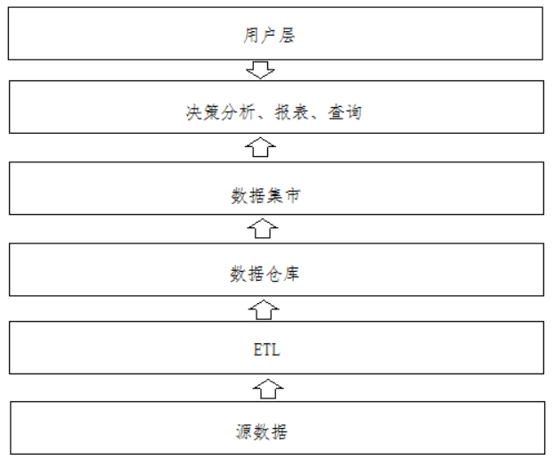
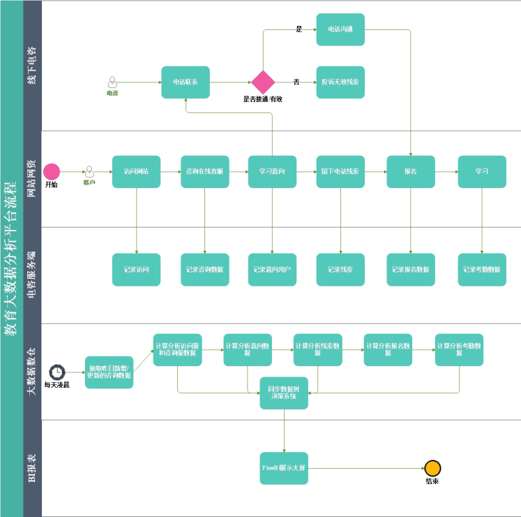
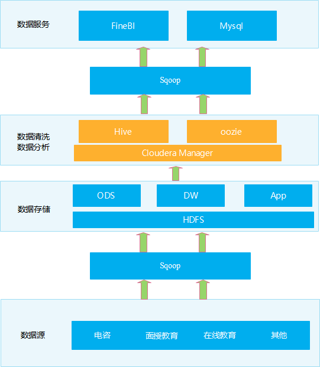
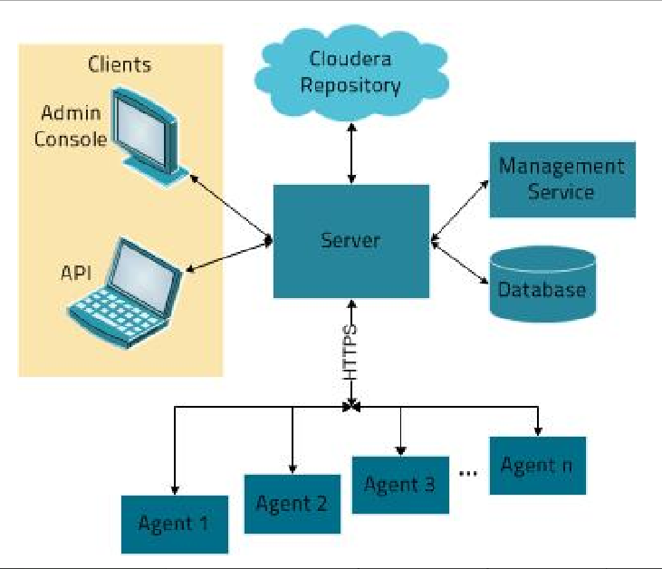
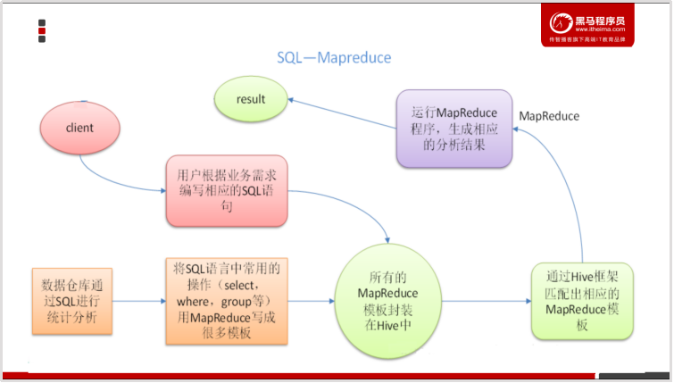

# 0- 数据仓库的基本介绍

## 0-1 数据仓库的基本概念

* 数据仓库本质上就是存储数据仓库, 仓库最大的特点既[不生产数据 也不消耗数据](), 数据来源于各个数据源；
* 数据仓库[面向于主题]()的, [主要是用于进行数据分析](), **对过去既定发生过数据, 进行分析处理, 从而对未来提供决策支持；**

## 0-2 数据仓库的特征

* 1) **面向于主题**: 所谓主题指的就是分析的[需求]()
* 2) **集成性**:  数据来源于[各个数据源,]() 种类丰富
* 3) **非易失型**:  **数据比较稳定**, [一般不会发生修改的问题 但是存在新增数据的操作]();
* 4) **时变性**:  原有分析手段可能无法满足后续的分析需求, [需要调整分析的方案](), 同时随着时间推移, 数据也会进行新增操作;

## 0-3 数据仓库(OLAP)和数据库(OLTP)的区别: 

* **OLAP**:面向于主题的, [**主要用于数据分析**]() , 主要对数据进行[查询操作]() , 存储过去既定发生过的数据(历史数据), 交互性弱 [存储数据量比较大]();
* **OLTP**: 面向于业务([**事务**]())的, 主要用于捕获数据, 主要对数据进行[CURD]()操作, 存储最近业务使用数据, 交互性强, [存储数据量较小]();

## 0-4 ETL: 抽取 转换 加载

* 狭义上ETL:
  * 指的从数据仓库的ODS层将数据抽取出来, 对数据进行清洗转换处理工作, 最终将[数据加载到DW层过程]()
* 宽泛的ETL:
  * 整个数仓全过程, 从[源数据 --> ODS层 , 从ODS --> DW层, 从DW层--> APP层]()

## 0-5 数据仓库系统结构图

# 1- 数据流程

## 1-1数据流程

- 访问咨询看板
  - 客户访问网站----记录访问信息；
  - 客户咨询在线客服----记录咨询数据；
  - 如何区分访问客户还是咨询客户？ [如果客户有咨询信息就是咨询客户，如果没有则是访问客户]()；
- 意向客户看板
  - 客户学习意向信息，比如：学习英语、吉他；
- 有效线索看板
  - 客户留了电话、微信、QQ 等有效的联系方式； 
- 报名看板
  - 客户报名的数据； （付款记录）
- 学员出勤看板
  - 学员出勤数据；

# 2- 看板

## 2-1 访问咨询看板

- 1、**总访问**客户量；
  - 统计指定时间段内，[访问客户的总数量]()。能够下钻到小时数据
- 2、**地区**独立访客热力图；
  - 访问客户中[各区域人数]()热力图。能够下钻到小时数据。
- 3、访客**咨询率**趋势；
  - [咨询率=发起咨询的人数/访问客户量]()
- 4、客户访问量和访客**咨询率双轴趋势**；
  - [每日客户访问量/咨询率双轴趋势图]()
- 5、**时间段**访问客户量趋势；
  - [1-24h之间，每个时间段的访问客户量]()
- 6、**来源渠道**访问量占比；
  - [不同来源渠道的访问客户量占比]()；
- 7、**搜索来源**访问量占比；
  - [不同搜索来源的访问客户量占比]()
- 8、**活跃页面**排行榜；
  - [产生访问客户量最多的页面排行榜TOPN]()

## 2-2 意向客户看板

- 意向学员**位置**热力图;
  - 新增的意向客户，[所在城市区域人数]()热力图
- **总意向量**;
  - 新增意向客户（包含自己录入的意向客户）[总数]()
- 意向**学科**排名;
  - 意向[学科]()人数排行榜
- 意向**校区**排名;
  - 意向[校区]()人数排行榜
- **来源渠道占比**;
  - 不同来[源渠道]()的意向客户占比
- **意向贡献中心占比**;
  - [各咨询中心产生的意向客户数占比]()

## 2-3 有效线索看板

- 有效线索**转化率**;
  - [有效线索量/咨询量]()
- 有效线索转化率**时间段趋势**;
  - [统计期内，1-24h之间，每个时间段的有效线索转化率]()
- 有效线索量;
  - 新增的咨询客户中，[有效线索的总量]()

## 2-4 报名看板

- 校区报名柱状图;
  - [各校区报名人数分布图]()
- 学科报名柱状图;
  - [各学科报名人数分布图]()
- 总报名量;
  - [已经缴费的]()报名客户[总量]()
- 线上报名量;
  - 总报名量中[来源渠道为线上]()访客渠道的报名总量
- 意向用户报名转化率;
  - [报名人数/意向人数]()
- 有效线索报名转化率;
  - [线上报名量/线上有效线索量]()
- 日报名趋势图;
  - [每天报名人数的趋势图]()
- 校区学科的报名学员TOPn；
  - [各个校区的各个学科排行榜，topN]()
- 来源渠道占比；
  - [不同来源渠道]()的报名学员占比情况；
- 咨询中心报名贡献；
  - [各咨询中心]()的报名学员人数占比情况

## 2-5 学员出勤看板

- 班级出勤人数；
- 班级出勤率；
- 班级迟到人数；
- 班级迟到率；
- 班级请假人数；
- 班级请假率；
- 班级旷课人数；
- 班级旷课率；

# 3- 项目技术架构

# 4- 开发过程总结

## 4-1 数据源：

- ​	电咨、线下面授、在线教育等OLTP系统的数据，大多存储于mysql。

## 4-2 数据抽取：

- 使用sqoop实现关系型数据库和大数据集群的双向同步。

## 4-3 数据存储：

- HDFS

## 4-4 数据清洗：

- 数据的清洗、转换、统计分析等都是使用基于CM管理的Hive来进行的。

## 4-5 数据分析：

- 数据的清洗、转换、统计分析等都是使用基于CM管理的Hive来进行的。

## 4-6 数据同步：

- 使用sqoop实现关系型数据库和大数据集群的双向同步。

## 4-7 OLAP数据服务：

- 采用常用的Mysql数据库。

# 5- 技术点介绍

## 5-1 ClouderaManager

### 5-1-1 介绍

- Cloudera Manager是用于管理CDH群集的B/S应用程序；
- 优点：
  - 统一化的**可视化界面**；
  - **自动安装部署和配置**；
  - 自带实时**监控系统**；
  - 大数据各类组件(hadoop、hive、hue、kudu、impala、zookeeper等)安装、调优极其便捷 零停机维护
  - 多个组件**依赖关系不用管**； 
  - 多用户管理；
  - 稳定性好；
- 缺点：
  - 收费；
  - 免费版本不支持弹性升级；

### 5-1-2 架构

- **Server**：
  - Cloudera Manager的**[核心]()**是Cloudera Manager Server;
  - 提供了[**统一的UI和API**]()方便用户和集群上的CDH以及其它服务进行交互；
  - 能够[安装配置CDH和其相关的服务软件]()；
  - 启动停止服务，维护集群中各个节点服务器以及上面运行的进程。

- **Agent**
  - 安装在每台主机上的[**代理服务**]()。它负责[启动和停止进程，解压缩配置]()，触发[安装和监控]()主机;
- **Management Service：**
  - 执行各种[监控、报警和报告]()功能的一组角色的服务;
- **Database**：
  - CM自身使用的[数据库]()，[存储配置和监控信息]();
- **Cloudera Repository**：
  - [云端存储库]()，提供可供Cloudera Manager分配的软件;
- **Client**：
  - 用于与服务器进行交互的接口，包含[**Admin Console和API;**]()
  - Admin Console：管理员[可视化控制台]() ;
  - API：开发人员使用[API可以创建自定义的Cloudera Manager应用程序]();

## 5-2 Sqoop

- sqoop是一款apache开源产品, 主要是用于**数据的导入导出**的工具;
  - 导入: 从RDBMS到hadoop  
  - 导出: 从Hadoop到RDBMS

### 5-2-1 Sqoop抽取的两种方式

- Sqoop API
- HCatalog API

- 区别

  - Sqoop方式支持的数据格式较少，**HCatalog支持的数据格式多，包括RCFile, ORCFile, CSV, JSON和SequenceFile等格式。**

  - Sqoop方式**允许数据覆盖**，[HCatalog不允许数据覆盖，每次都只是追加]()。

  - Sqoop方式比较随意，不要求源表和目标表字段相同(字段名称和个数都可以不相同)，**它抽取的方式是将字段按顺序插入，**比如目标表有3个字段，源表有一个字段，它会将数据插入到Hive表的第一个字段，其余字段为NULL。

    但是HCatalog不同，**源表和目标表字段名需要相同，字段个数可以不相等，如果字段名不同，抽取数据的时候会报NullPointerException错误。**HCatalog抽取数据时，会将字段对应到相同字段名的字段上，哪怕字段个数不相等。

  

## 5-3 Hive

- Hive是基于Hadoop的一个[**数据仓库工具**](),可以将[结构化的数据文件映射为一张数据库表]()，并提供类SQL查询功能。

- 其本质是将[SQL转换为MapReduce的任务进行运算]()，底层由HDFS来提供数据的存储，说白了hive可以理解为一个将SQL转换为MapReduce的任务的工具，甚至更进一步可以说hive就是一个MapReduce的客户端。

- 为什么使用Hive

  1、操作接口**采用类SQL语法**，提供快速开发的能力;

  2、**避免了去写MapReduce**，减少开发人员的学习成本;

  3、**功能扩展很方便**;

- Hive的特点

  - 适用于**离线数据分析**；
  - Hive是**将数据映射成数据库和一张张的表**，[库和表的**元数据**信息一般存在关系型数据库上]()（比如MySQL）
  - Hive最大的特点是通过[类SQL来分析大数据]()，而[避免了写MapReduce程序来分析数据]()，这样使得分析数据更容易；
  - **数据存储**：[HDFS]()
  - **数据计算**：[MapReduce]()

## 5-4 ozzie

- *Oozie* 是一个开源的[工作流和协作服务引擎]()

- 工作流具有特点:

  * 1) 整个流程可以被分为**多个节点；**
  * 2) 各个节点**存在依赖关系**(前序没有干, 后续就无法执行)；
  * 3) 此流程需要**周而复始**不断的干；
  * 总结: 如果以后发现有个任务满足了以上三个特征, 那么就可以尝试使用工作流来解决；

- 请问, 大数据的开发流程, 是否可以使用工作流呢?  

  - 回答：一定是可以的

  

  

### 5-4-1 对比Oozie 与 Azkaban

* **单独使用角度:  azkaban 比 oozie 更加的方便**

  * azkaban: 是由**领英**提供的一款工作流的调度工具, 其内部主要采用通过[配置类似于properties文件来定义工作流](), 此定义方式更加的方便,  而且领英宣称 只要是能够使用shell命令执行的软件, 统统都可以使用azkaban完成调度, [所以说azkaban本质上就是一个shell调度客户端]()
  * oozie: apache旗下的, 出现时间较早, 是大数据一款工作流的调度工具, [oozie采用xml方式来完成工作流调度](), oozie在单独使用下, [**配置是极其复杂**]()的, 而且[oozie所提供管理界面 异常难用, 比较慢]();

  

  [**所以说, 从单独使用角度上, azkaban前景要优于oozie**]()

* **如果是结合HUE 来使用呢?** 

  * azkaban: 由于azkaban是由领英公司开源, 并不属于apache环境, 所以HUE对其是不支持的, 如果需要使用azkaban, [需要单独维护一套azkaban调度环境]()
  * ooize: 是由apache开源, 属于apache怀抱下产品, 同时HUE也是apache旗下的, HUE如果要整合一款调度工具, 必然会选择自家产品 , [所以HUE是可以直接和oozie进行整合, 整合之后, 用户只需要通过鼠标点一点方式即可完成工作流的配置]()

  此时: [ooize要比azkaban更加方便,同时也是同源产品, 兼容性也会更好, 不需要单独维护]()

# 6- 项目优化

## 6-1 数据倾斜问题

