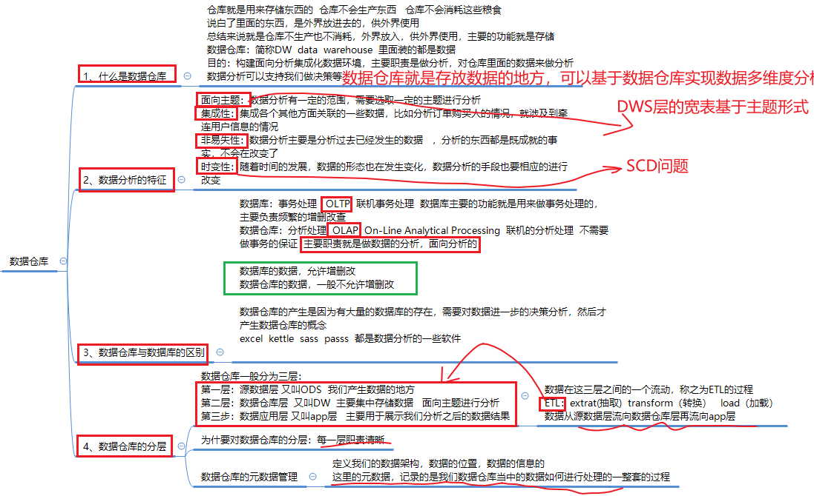
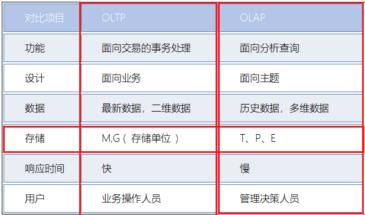
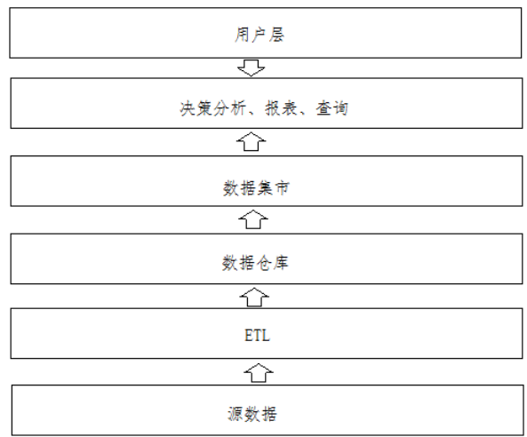
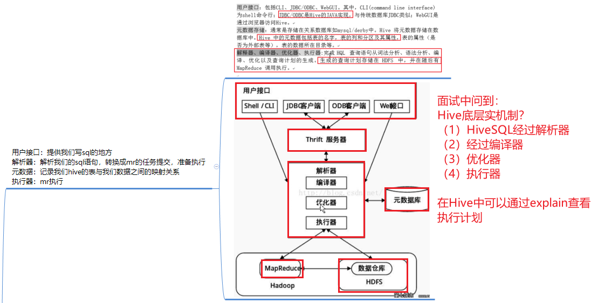

[TOC]


# 1- Hive数仓剖析

## 1-1 数仓理解



- 数仓存储的是**历史数据**，数据仓库就是区别于数据库的频繁增删改；
- **数据仓库是面向主题**用于数据分析的；
- 数仓具有**集成性**，集成各个数据源的数据；
- 数仓具有**非易失性**，历史数据是不允许改变的；
- 数仓还具有**时变性**，随着时间的发展，会有新的数据源增加；


## 1-2 理解OLTP 与 OLAP 区别

- 数据仓库属于OLAP的分析(**面向主题，面向分析**)； 数据库属于OLTP(**面向业务、事务的频繁增删改查**)
- OLAP 慢， 吞吐量高;OLTP 快，吞吐量低




## 1-3 数仓架构图

用户--数据报表、决策--数据集市-- 数据仓库--ETL--数据源；



## 1-4 数仓分层

- **数据分层就是为了更好分析， 每一层的职责更加的清晰；**

- 传统意义上分层三层
  * 1-ODS层----源数据层，映射了HDFS上的数据
  * 2-DW层----数据仓库层，主要存储数据，面向主题的分析
  * 3-APP层----经过分析之后的数据联合BI报表展示
- 大多数的项目中分层
  * DW层
    * DWD层-----**数据明细层**(对ODS层数据做一定的清洗和主题的汇总)
    * DWM层-----**中间数据层**(对明细数据按照维度做初步聚合)
    * DWS层------**数据服务层**(对业务主题形成不同主题的看板)

## 1-5 星型、雪花、星座模型

- 星型模型
  - 只有一个事实表；
  - **维度表与维度表之间没有关联；**
- 雪花模型
  - 只有一个事实表；
  - **维度表与维度表之间 有 关联**；
- 星座模型
  - 有多个事实表；
  - **维度表与维度表之间 有 关联**；

## 1-6 渐变维

目的: <span style="color:red;background:white;font-size:20px;font-family:楷体;">**用于处理历史变化数据, 是否需要存储历史变更数据**</span>

- SCD1
  - <span style="color:red;background:white;font-size:20px;font-family:楷体;">**直接覆盖, 不保存历史变更数据, 仅适合于错误数据的处理**</span>

- SCD2 拉链表  start_time 、 end_time
  - <span style="color:red;background:white;font-size:20px;font-family:楷体;">**采用拉链表方案, 建表时需要多出两个字段(起始时间和结束时间)**</span>；
  - 缺点：**数据冗余**；
- SCD3
  - 新增表字段：<span style="color:red;background:white;font-size:20px;font-family:楷体;">**当发生数据变更后,在表中新增一个字段, 用于记录最新变更数据即可**</span>;
  - 缺点：效率低，维护复杂；

## 1-7 数仓建模

- 维度建模
- 建模步骤
  - 根据主题**创建事实表**；
    - 事务事实表；
    - 周期快照事实表；
      - **每周期会创建一个事实表；**
      - 周期快照事实表以具**有规律性的、可预见的时间间隔**来记录事实，时间间隔如每天、每月、每年
    - 累积快照事实表；
      - **完全覆盖**一个事务生命周期的时间跨度，它通常具有**多个日期字段，用来记录整个生命周期中的关键时间点**；
  - 根据各个维度**创建维度表**；
  - 根据各个维度的关联关系**确定数据模型**；
    - 星型-雪花-星座；

# 2- 对Hive关键原理在梳理

- **Hive如何转化为MR的？**
  - **用户接口**：CLI(shell 命令行)， JDBC/ODBC , WebGui(浏览器访问Hive)
  - **元数据存储**：元数据通常存储在关系数据库中(mysql/derby), Hive 元数据包括表的名称、分区信息、列信息、表的属性(是否为外部表)，表的数据所在的目录等等；
  - **解析器-编译器-优化器-执行器**： 完成 HQL 查询语句从语法分析、编译、优化以及查询计划的生成。生成的查询计划存储在HDFS中，并在随后有MR调用执行；(Hive的底层机制)





- **Hive支持的数据格式和压缩的格式？**
  - 数据存储格式：
    - **行式存储 : textFile,  sequenceFile;**
    - **列式存储：ORC, Parquet;**
  - 压缩方式：ZLO，Gzip，Snappy等；
    - 压缩率：<span style="color:red;background:white;font-size:20px;font-family:楷体;">**ORC >  Parquet >  textFile**</span>
  - 具体在项目中需要结合场景应用；
  - **一般ODS层使用 ORC + Gzip;  **
  - **中间层使用ORC + Snappy;**
  - **APP层使用 textFile + Snappy;**


- **Hive创建的数据库的默认位置？**

  - Hive-site.xml 中配置

  ``` xml
  <value>/user/hive/warehouse</value>
  ```

  

- **内部表和外部表有什么区别？**
  - 内部表(管理表)和外部表的最简答的区别就是外部表 创建表时 需要制定**external**；
  - [内部表如果删除数据，会将mysql中的元数据和hdfs的数据全部删除；]()
  - [而外部表仅仅删除mysql中的元数据，不删除hdfs的数据；]()


- **分区表和分桶表有什么区别？**
  - **分区表是分[文件夹]()** 使用 partitioned By ；
    - 一般我们都是通过日期去做分区表；
  - **分桶表是分[文件]()**，使用clustered By 按照规则划分到文件中(就是使用MR中的分区)；
    * Hive采用的列值取Hash值/桶的个数决定放在哪个桶中；
    * 有几个桶hash之后可以平均划分到几个桶中;
    * **好处：可以利用分桶更好的避免数据倾斜**； 还可以**采样统计**时使用；
  
- **分区更容易产生数据倾斜？**
  - 是的。因为如果某一个分区数量较多划分在一个区间造成数据倾斜；
  - **分桶比分区更加容易防止数据倾斜现象**;

- **将hive表使用分桶的形式，有什么优势？**
  - 可以处理数据倾斜：可以使用分桶Bucket的形式以可以获取[**更高的查询效率**]()，[特别是在项目中Map-Join，Bucket-Join, SMB-Join;]()
  - 可以使用[**sampling采样技术**]()更高效，在处理大规模数据中，能够拿到一部分数据采样计算比较高效；

- **Hive的默认分割符是什么？**
  - **\001分隔符**，使用txt是打不开的，ASCII字符
  - 可以根据源数据使用不同的分隔符
  - **row format delimited fields terminated by** '\t' 

- **在Hive创建表的时候如何写注释？**
  - **comment** “这是一个学生表”；
- **Hive创建表的注意事项？**
  - **分区表**： 分区就是分文件夹；
    - 静态分区(人为指定分区的值) ： 
      - **创建表时分区的值已经确定**： partition(分区字段1=值1, 分区字段2=值2,...)
    - 动态分区(一次性向表中添加多个分区):
      - **创建表时分区的值未确定**：partition(分区字段1,分区字段2....)
      - insert overwrite xxx  select查询语句结果最后面必须是**分区字段,而且要保证顺序**
    - 动静混分区： 同时使用；
  - **分桶表:**    分桶就是分文件；
    - <span style="color:red;font-size:20px;font-faily:黑体" >提高多表join查询效率；</span>
    - <span style="color:red;font-size:20px;font-faily:黑体" >方便数据抽样查询，我们可以手动抽样； </span>
    - 分桶规则：
      - 字段.hash%分桶数量=？   <span style="color:red;font-size:20px;font-faily:黑体" >某个字段的hash值  与 分区的数量取模 ； </span>
    - **只能通过insert  overwrite  select**  : 创建普通表，并通过insert  overwrite的方式将普通表的数据通过查询的方式加载到桶表当中去；
  - 内部表： create  table if not exists stu2(id int ,name string) row format delimited fields terminated by '\t' stored as textfile location '/user/stu2';
  - 外部表：create **external** table techer (t_id string,t_name string) row format delimited fields terminated by '\t';
  - 外部表加载：**load   data   [local]  inpath**  '/export/servers/hivedatas/techer.csv' **into** table techer 
  - 分区表加载数据：**load data local inpath** '/export/servers/hivedatas/score.csv' **into** table score2 **partition(year='2018',month='06',day='01');**
  - 分桶表：**clusterd by**；


- 四种的查询的区别？order by，sort by，distrubute by，cluster by

  - 1-**order by全局排序**；
    - 使用order by最后用一个reduce的task完成全局排序
  - 2-**sort by分区排序**；
    - 每个reduce分区内排序，并不保证分区间的有序性
  - 3-**distrubute by 根据某个字段划分到不同的reduce中**；
    - 分发是hash散列 （**随机分配到不同的reduce,可以一定程度避免数据倾斜问题**）
  - 4-cluster by除了具备distrubute  by的功能还兼具sort by功能；
    - = **distrubute by + sort by**(**只有当分桶和sort字段是统一个时候**)；

- **having需要和where区分？**
  * where针对于**表中列**发挥作用，查询数据；
  * having针对**查询结果中的列**发挥作用；
  * **where后面不能写分组函数**的；
  * **having后面是可以使用分组的函数**；
  * having只能配合group by分组统计语句一起；

- **hive开窗**
  - <span style="color:red;background:white;font-size:20px;font-family:黑体;">**(函数名（） over(partition by xxx order by yyy))**</span>
  - 分组排序：row_number,rank(重复+跳),dense_rank(重复 + 不跳)
  - 聚合窗口函数 ： SUM,AVG,MIN,MAX；
- **hive行转列、列转行**
  - 行转列
    - **lateral view explode(字段名)  临时表名 as 新字段名**：
    - 使用了UDTF的原理：单行进，多行出；
  - 列转行
    - **group by  +  collect_set + concat**   : 分组 + 收集 + 拼接
- **hive自定义函数**
  - 分为**临时函数 和 永久函数**
  - <span style="color:red;background:white;font-size:20px;font-family:楷体;">**UDF（User-Defined-Function）**</span>
    - <span style="color:blue;background:white;font-size:20px;font-family:楷体;">**一进一出**</span>  
    - <span style="color:blue;background:white;font-size:20px;font-family:楷体;">**类似于:lower/lower/reverse**</span>
  - <span style="color:red;background:white;font-size:20px;font-family:楷体;">**UDAF（User-Defined Aggregation Function）**</span>
    - <span style="color:blue;background:white;font-size:20px;font-family:楷体;">**聚集函数，多进一出**</span>
    - <span style="color:blue;background:white;font-size:20px;font-family:楷体;">**类似于：count/max/min**</span>
  - <span style="color:red;background:white;font-size:20px;font-family:楷体;">**UDTF（User-Defined Table-Generating Functions）**</span>
    - <span style="color:blue;background:white;font-size:20px;font-family:楷体;">**一进多出**</span>
    - <span style="color:blue;background:white;font-size:20px;font-family:楷体;">**如lateral view explode()**</span>
  - **UDF开发步骤**
    - 新定义类继承 UDF; 重新 evaluate方法；
    - 将项目打包，并上传到hive的lib目录下；
    - 添加jar包；
    - 设置函数名 与 自定义函数关联；
    - 使用自定义函数；

- **Hive的四种的Join的方式**
  * 右外连接right join：Join的操作右边表中符合where条件的所有记录返回
  * 内连接inner join(join)：只有两边的表都存在才能保留下来
  * 左外连接(left join)：Join的操作坐边表中符合where条件的所有记录返回内连接
  * 满外连接(full join)：返回所有符合where条件的数据，没有条件符合的化也会返回nul


# 3- Hive 的优化

## 3-1 基础优化

- **Hiveserver2异常退出**，导致连接失败的问题。解决方法：修改**HiveServer2 的 Java 堆栈大小**

- **limit的优化**

- **设置并行度**；
- **小文件合并；**
- **零拷贝优化**；（只读取需要的字段数据）  ORC存储方式
- **hive矢量(批量)操作**；每次读取1024行数据并处理    ORC 存储方式；
- **hive的压缩配置： map/reduce端压缩， 中间结果压缩；**

## 3-2 数据倾斜优化

- 数据倾斜_**join倾斜**;
  - 解决方案一:  <span style="color:red;background:white;font-size:20px;font-family:楷体;">**通过 mapjoin 、 bucket mapjoin 以及 smb join**</span>;
  - 解决方案二:  将那些容易产生数据倾斜的key值抽取出来, 使用一个**单独的MR进行处理**即可;
    - **运行**时优化: 当某个key的值数量达到某个阈值自动开启一个MR单独计算；
    - **编译**时优化: 建表时 SKEWED 列出key的哪些值会有数据倾斜；

- 数据倾斜_**group by的数据倾斜**
  - **小规约**  开启 **map端的局部聚合**操作（combiner）
  - **大规约**  **运行两个MR , 第一个MR 进行局部聚合操作并打散分发到不同的reduce中, 第二个MR 基于第一个MR的结果进行最终聚合操作**；
- **关联优化器**
  - 在hive执行sql的时候, 一个sql翻译的MR中可能会出现多次shuffle操作, [而多次的shuffle操作有可能是可以共享的](), 此时就可以将shuffle进行共享, 从而[减少shuffle次数](), 从而提升效率；

## 3-3 Hive 索引

- **原始索引**
  - **索引表不会自动更新；**
  - 手动更新，本质就是在重建索引操作，效率非常低；**不推荐使用**

* ##### Row Group Index 行组索引

  * 原理：
    * 必须是ORC存储格式；
    * **ORC文件中每个stripe块中会保存每个字段的最大最小值得索引数据；（IndexData）**
    * 根据IndexData索引数据可以快速的过滤出有用的stripe块；
  * 条件：
    * 表必须是**ORC存储格式**
    * 建表时, 必须制定以下信息: ’orc.create.index’=’true’   **开启行组索引**
    * 在插入数据的时候, 必须要对建立**索引的字段进行排序**;否则min/max值就无意义;
    * 一般使用在数值类型的字段上；
    * 当查询中有<,>,=的操作时；
  * 设置**hive.optimize.index.filter**为true，并重启hive
    *  'orc.create.index'='true'
    *  distribute by  id sort byid;

* **Bloom Filter Index 开发过滤索引** 

  * 原理：

    * **必须是ORC存储格式**；
    * 需要**指定哪些字段作为开发过滤索引**： ["orc.bloom.filter.columns"="字段1,字段2.."]()
    * **在ORC文件中的Stripe块中会记录这些字段对应的所有值 具体存储在哪些位置；**
    * 查询时根据这些字段的值可以直接过滤出数据再哪些stripe块中；

  * 条件：

    * 表必须是**ORC存储格式**;
    * 在建表的时候, **需要指定那些字段作为开发过滤索引**: ["orc.bloom.filter.columns"="字段1,字段2.."]()；
    * **[只能进行 等值（=） 过滤查询]()**, 不局限于类型

    

## 3-4 Hive优化器

- 基于**规则**的优化（**RBO**) ，对逻辑计划的优化；

* 基于**代价**的优化（**CBO**）引擎，对物理计划的优化；类似于SparkSQL中的CBO基于代价函数的优化；


## 3-5 Hive中Sort By 、order by  、distribute by 、cluster by 各代表什么意思？

- order  by : **全局排序**；
- sort by : **局部排序**；
- distribute by : 将数据打散划分输出到不同的reduce中；
- cluster by == distribute by + sort by  :  将**数据打散**到不同的reduce中并**局部排序**；


# 4- Hive拉链表使用

- 使用**渐变维的SCD2** ；

- 拉链表需要新增两个字段 **start_time、end_time**；

- 拉链表实现步骤：

  1. 创建增量数据的**增量表update;**
  2. 抽取昨日新增数据到增量表；
  3. 创建**临时合并表tmp**;
  4. **合并昨日新增数据与历史数据**；
    - **将重复的旧数据end_time更新为昨天日期**，也就是从今天起不再生效；
    - **将新增数据end_time设置为 ‘9999-12-31’** , 也就是当前有效数据；
    - 合并后将数据先写入临时合并表tmp;

  5. 将临时表的数据，覆盖到拉链表中；
  6. 删除增量表 和 临时合并表 ，下次抽取需要重建update 和 tmp表；


# 5- Hive的几种环境模式

## 5-1内嵌模式

- **元数据使用内嵌的数据库 Derby 存储**；
- **Hive  与 metastore 在同一个进程中；**

## 5-2 本地模式

- **元数据使用外部的数据库 mysql/oracle 存储**；
- **Hive  与 metastore 在同一个进程中；**
- 缺点：
  - 每次启动Hive的时候，都会单独的启动一个metastore服务；
  - 一次只能一个客户端连接；

## 5-3 远程模式

- **元数据使用外部的数据库 mysql/oracle 存储**；
- **metastore 服务单独启动一个进程；**
- 优点：
  - 可以同时启动多个客户端去连接metastore 服务；


# 6- MapReduce的运行过程（MapReduce流程）


## 6-1注意事项：

- maptask的个数是根据splits 切片对应的，并不是block的个数，只不过默认splits = block;

- 环形缓冲区；

- 有3次排序

  - 分区后有一次**快速排序**
  - 局部聚合Combiner后有一次**归并排序**
  - 最后整个有一次**归并排序**

- 一共有五次落盘

  - 在map-shuffle阶段分区后有个小文件需要落盘；

  - 排序打标签后需要落盘；

  - 在reduce-shuffle阶段环形缓冲区益出的小文件需要落盘；

  - 分组后的中间文件需要落盘；

  - 最后结果文件需要落盘；

    

## 6-2 流程描述

1. [我把整个MR流程分为四个阶段]()： **MapTask 、MapShuffle 、 ReduceShuffle  、ReduceTask；**
2. **MapTask**
   - 读取HDFS中切片(split)的数据,生成K1  V1数据结构的数据；
3. **MapShuffle**
   - **通过环形缓冲区保留文件到小文件；**
   - **再讲数据合并 、 分区 、排序、等操作生成K2 V2 数据；**
   - **给数据打标签让数据分别发送到对应reduce端；**
4. **ReduceShuffle**  
   - **通过网络获取到MapShuffle端的数据，并通过缓冲区保留数据到文件；**
   - **再次合并、局部聚合、分组等操作生成 k2  v2[]  (注意这里v2是一个数组)；**
   - **最后生成中间文件落盘；**
5. **ReduceTask**
   - **根据K2 V2 做最后的统计聚合计算生成最终结果 K3 V3 并落盘；**
6. **最后再说出 中间有 3次排序 (快排 和 归并排序)  、5次落盘；**


