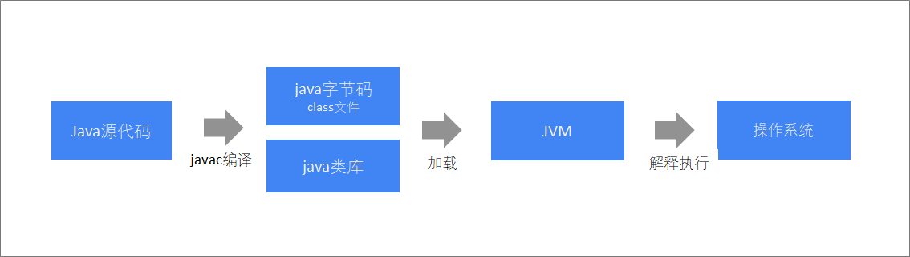
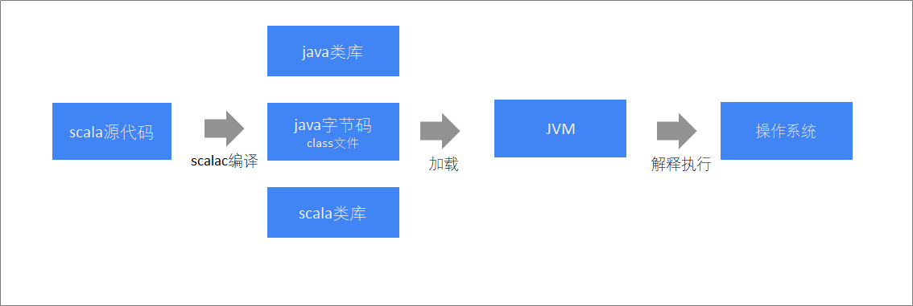
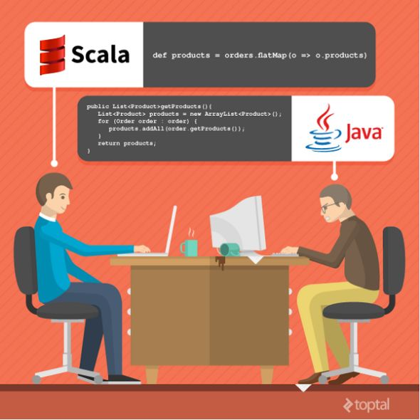
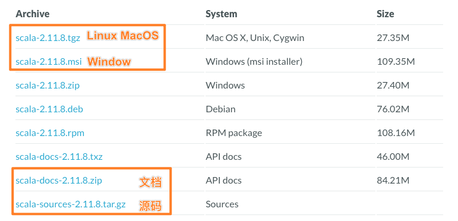
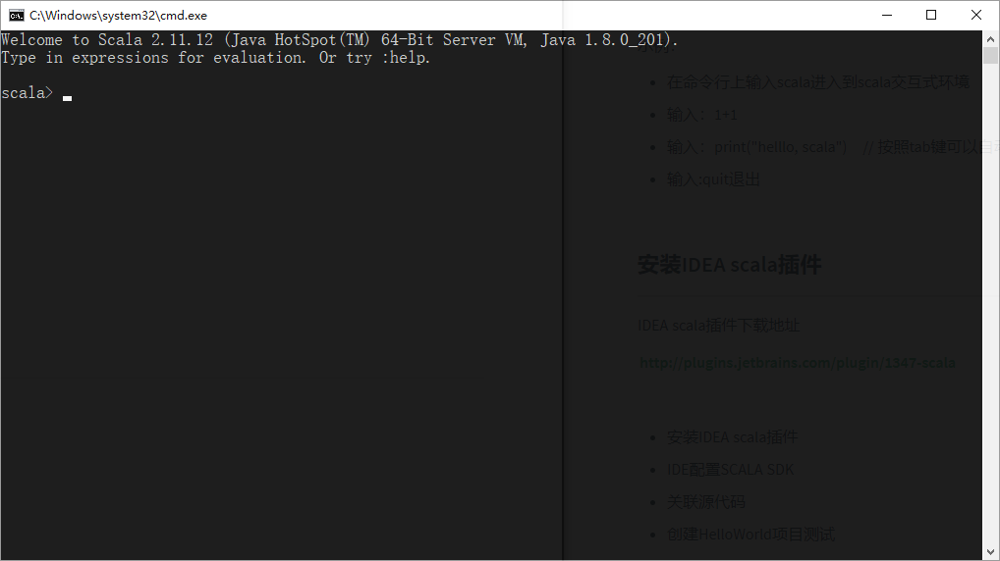
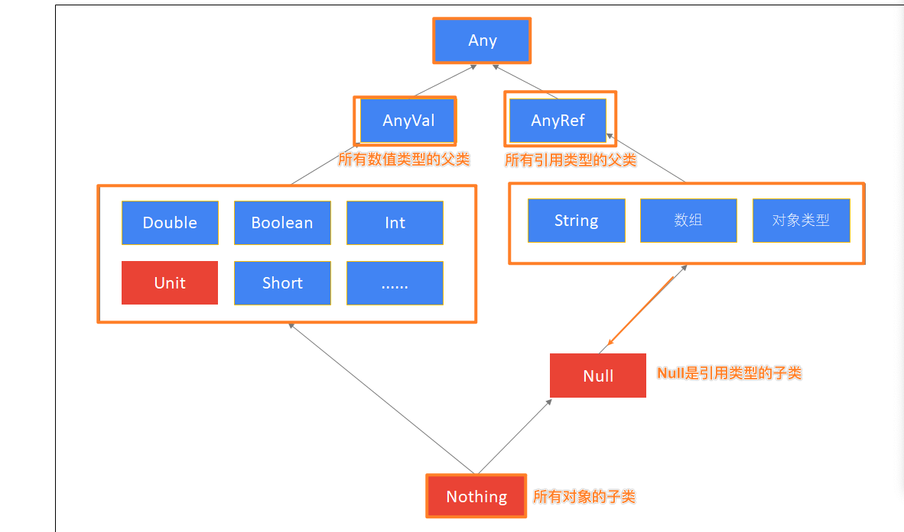
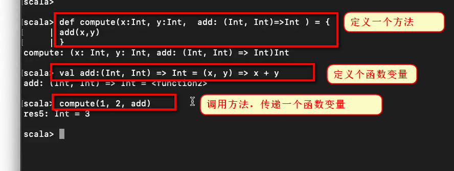
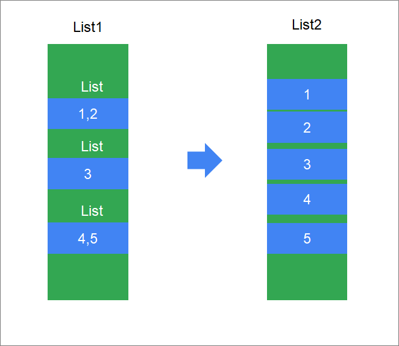

[TOC]


# 0、简单总结上一个阶段的内容

大数据的核心点：

- 分布式海量的数据存储
  - Hadoop - HDFS
- 分布式海量的数据计算
  - Hadoop - MapReduce
  - Spark
  - Flink
- 其它围绕着这两个核心点的辅助工具
  - Hive：工具，SQL计算引擎工具，能够完成将SQL翻译成MapReduce程序的工作
    - 主要包含两个核心点：
      - SQL翻译器:负责将SQL翻译成MR代码去执行
      - 元数据管理（MetaStroe）：用来记录被计算的数据的元数据信息
  - Kafka：分布式的消息队列，帮助在大数据体系下，构建消息（数据的管道）
    - 消息队列主要功能：
      - 消峰：消除峰值的影响
      - 解耦：接触组件和组件之间的强耦合性（本质上让组件和kafka进行耦合。由于Kafka强大的写入能力以及可以换成很久数据的特性，组件和Kafka进行耦合，耦合关联性是很低的，影响也很低）


# 一、scala简介

scala是运行在`JVM`上的多范式编程语言，同时支持面向对象和面向函数编程

- 多范式：就是包含多种编程思想。目前主流的编程思想有4中，即**面向对象、面向过程、面向函数、以及泛型**

- `面向函数`一句话形容：函数也是一个对象，可以作为参数进行传递。

  也就是：

  ​	面向对象    ：传递的参数是具体的对象或者值

  ​	函数式编程：传递的参数可以是一个函数（处理逻辑）

- `运行在JVM之上`：

  > Java程序编译执行流程
  >
  > 
  >
  > Scala程序编译执行流程
  >
  > > 就像学习MapReduce中, 各种序列化器. 类比一下, 比如: IntWritable 以及 Text , 都是把内容进行序列化, 也就是输入不同, 输出相同. 不同的输入, 序列化为同样格式的内容, 运行在hadoop上. 同理, 我们可以认为, scala 和 java 就类比有个 ScalaWritable 以及 JavaWritable. 负责对java 以及Scala进行序列化, 输出是什么呢? 输出就是我们的字节码, 也就是 .class 文件. 用于运行在JVM之上.
  >
  > 

  

  早期，scala刚出现的时候，并没有怎么引起重视，随着Spark和Kafka这样基于scala的大数据框架的兴起，scala逐步进入大数据开发者的眼帘。scala的主要优势是它的**表达性**。

  


## 1.1 为什么使用scala

* 开发大数据应用程序（**Spark程序、Flink程序**）

  Hadoop已经是我们大数据领域的事实标准了, Spark生态并不是要取代Hadoop生态，而是为了更好的拓展大数据生态，两者结合. 

  而Spark由我们Scala开发的，我们学习Scala为了更好的去学习Spark。

- 表达能力强，一行代码抵得上Java多行，开发速度快。 优雅，代码简介逻辑更加清晰。
- 兼容Java，可以访问庞大的Java类库，例如：操作mysql、redis、freemarker、activemq等等


## 1.2 Scala对比Java




通过下面的案例，对比分别使用Java和Scala实现的代码数量

### 案例

定义三个实体类（用户、订单、商品）

**Java代码**

```java
/**
 * 用户实体类
 */
public class User {
    private String name;
    private List<Order> orders;

    public String getName() {
    	return name;
    }

    public void setName(String name) {
    	this.name = name;
    }

    public List<Order> getOrders() {
    	return orders;
    }

    public void setOrders(List<Order> orders) {
    	this.orders = orders;
    }
}
```

```java
/**
 * 订单实体类
 */
public class Order {
    private int id;
    private List<Product> products;

    public int getId() {
    	return id;
    }

    public void setId(int id) {
    	this.id = id;
    }

    public List<Product> getProducts() {
    	return products;
    }

    public void setProducts(List<Product> products) {
    	this.products = products;
    }
}
```

```java
/**
 * 商品实体类
 */
public class Product {
    private int id;
    private String category;

    public int getId() {
    	return id;
    }

    public void setId(int id) {
    	this.id = id;
    }

    public String getCategory() {
    	return category;
    }

    public void setCategory(String category) {
    	this.category = category;
    }
}
```


**Scala代码**

```scala
case class User(var name:String, var orders:List[Order])	// 用户实体类
case class Order(var id:Int, var products:List[Product])	// 订单实体类
case class Product(var id:Int, var category:String)  		// 商品实体类
```


## 1.3 开发环境安装

当前学习的scala版本是：`2.11.8`，截止到目前（2021年03月16日）scala最新版本是`2.13.5`

目前企业中，使用最多的还是2.11的版本


学习如何编写scala代码之前，需要先安装scala编译器以及开发工具

scala程序运行需要依赖于Java类库，必须要有**Java运行环境**，scala才能正确执行

根据前面学习的流程图，要编译运行scala程序，需要

* jdk（jvm）(负责运行)
* scala编译器（scala SDK）(负责编译代码成字节码)

需要依次安装以下内容：

- 安装JDK(没有JDK scala无法工作)
- 安装scala SDK
- 安装IDEA插件(一般我们用IDE开发, 不会用记事本等工具,因为效率太低. IDEA是个多语言的开发工具, 安装SCALA的拓展就可以进行Scala的开发了)

https://www.scala-lang.org/download/2.11.8.html




#### 安装JDK

安装JDK 1.8 64位版本，并配置好环境变量

#### 安装scala SDK

scala SDK是scala语言的编译器，要开发scala程序，必须要先安装SDK

本次安装的版本是: 2.11.8

##### **步骤**

1. 下载、安装SDK
2. 测试是否安装成功

##### **windows具体操作**

1. 双击scala-2.11.8.msi，将scala安装在指定目录，例如：c:/opt

   > windows系统双机安装板一路下一步即可。 环境变量会自动配置

2. 打开控制台，输入`scala -version`

**macOS 、linux**

1. 解压scala的安装包
2. 移动到指定的目录下
3. 配置环境变量：SCALA_HOME 以及 PATH

#### 安装IDEA scala插件

IDEA默认是不支持scala程序开发，所以需要来安装scala插件来支持scala语言。

##### **步骤**

1. 下载指定版本[IDEA scala插件](http://plugins.jetbrains.com/plugin/1347-scala)

   http://plugins.jetbrains.com/plugin/1347-scala

2. IDEA配置scala插件

3. 重新启动IDEA

或者在IDEA中联网直接安装也可以


## 1.4 scala解释器

Scala是一个混合型的语言，它可以做到：

- 编译执行，和java那样编译成`.class`文件后运行
- 解释执行，和python那样，输入一条代码，立刻就执行。 可以通过scala提供的解释器来运行


后续我们会使用scala解释器来学习scala基本语法，scala解释器像Linux命令一样，执行一条代码，马上就可以让我们看到执行结果，用来测试比较方便。


我们接下来学习：

* 启动scala解释器
* 在scala解释器中执行scala代码
* 退出scala解释器

### 启动scala解释器

要启动scala解释器，只需要以下几步：

* 按住`windows键 + r`
* 输入`scala`即可




### 执行scala代码

在scala的命令提示窗口中输入`println("hello, world")`，回车执行


### 退出解释器

在scala命令提示窗口中执行`:quit`，即可退出解释器


# 二、基础语法学习

这部分内容略显枯燥，打起精神不要走神。


## 2.1 声明变量

我们将来每一天编写scala程序都会定义变量。那scala语言如何定义变量呢？

### 2.1.1 语法格式

Java变量定义

```java
int a = 0;
```

在scala中，可以使用`val`或者`var`来定义变量，语法格式如下:

```scala
val/var 变量标识:变量类型 = 初始值
```

其中

- `val`定义的是`不可重新赋值`的变量，<font color='red'>不可变</font>。不是java中final的意思。
  - [scala也有final，在scala中final表示数值不可变以及不可被覆写。val仅仅是数值不变，可以被复写]()
- `var`定义的是`可重新赋值`的变量，<font color='red'>可变</font>


> [!NOTE]
>
> * scala中定义变量类型写在变量名后面
> * scala的语句最后==不需要添加分号==

> scala中类型是==首字母大写的==

### 2.1.2 在解释器中定义一个变量

示例：定义一个变量保存一个人的名字"tom"

**步骤**

1. 打开scala解释器
2. 定义一个字符串类型的变量用来保存名字

**参考代码**

```scala
scala> val name:String = "tom"
name: String = tom
```


### 2.1.3 val和var变量

**示例**

给名字变量进行重新赋值为Jim，观察其运行结果

**参考代码**

```scala
scala> name = "Jim"
<console>:12: error: reassignment to val
       name = "Jim"
```


**示例**

使用`var`重新定义变量来保存名字"tom"，并尝试重新赋值为Jim，观察其运行结果


**参考代码**

```scala
scala> var name:String = "tom"
name: String = tom

scala> name = "Jim"
name: String = Jim
```


> [!TIP]
>
> 优先使用`val`定义变量，如果变量需要被重新赋值，才使用`var`


### 2.1.4 使用类型推断来定义变量

Scala的语法要比Java简洁，我们可以使用一种更简洁的方式来定义变量。

==Scala是强类型语言，千万不要被它省略类型所迷惑。它是可以省略类型，不代表变量没有类型==

**示例**

使用更简洁的语法定义一个变量保存一个人的名字"tom"


**参考代码**

```scala
scala> val name = "tom"
name: String = tom
```


Scala可以自动根据变量的值来自动推断变量的类型，这样编写代码更加简洁。

### 2.1.5 惰性赋值

==什么时候用到，什么时候被加载的内存中==

在企业的大数据开发中，有时候会编写非常复杂的SQL语句，这些SQL语句可能有几百行甚至上千行。这些SQL语句，如果直接加载到JVM中，会有很大的内存开销。如何解决？

当有一些变量保存的数据较大时，但是不需要马上加载到JVM内存。可以使用**惰性赋值**来提高效率。

语法格式：

```scala
lazy val 变量名 = 表达式
```

==var不可以用lazy==

error: lazy not allowed here. Only vals can be lazy

**示例**

在程序中需要执行一条以下复杂的SQL语句，我们希望只有用到这个SQL语句才加载它。

```scala
"""insert overwrite table adm.itcast_adm_personas
    select
    a.user_id,
    a.user_name,
    a.user_sex,
    a.user_birthday,
    a.user_age,
    a.constellation,
    a.province,
    a.city,
    a.city_level,
    a.hex_mail,
    a.op_mail,
    a.hex_phone,
    a.fore_phone,
    a.figure_model,
    a.stature_model,
    b.first_order_time,
    b.last_order_time,
      ...
    d.month1_hour025_cnt,
    d.month1_hour627_cnt,
    d.month1_hour829_cnt,
    d.month1_hour10212_cnt,
    d.month1_hour13214_cnt,
    d.month1_hour15217_cnt,
    d.month1_hour18219_cnt,
    d.month1_hour20221_cnt,
    d.month1_hour22223_cnt
    from gdm.itcast_gdm_user_basic a
      left join gdm.itcast_gdm_user_consume_order b on a.user_id=b.user_id
    left join gdm.itcast_gdm_user_buy_category c on a.user_id=c.user_id
    left join gdm.itcast_gdm_user_visit d on a.user_id=d.user_id;"""
```


**参考代码**

```scala
scala> lazy val sql = """insert overwrite table adm.itcast_adm_personas
     |     select
     |     a.user_id,
	....
     |     left join gdm.itcast_gdm_user_buy_category c on a.user_id=c.user_id
     |     left join gdm.itcast_gdm_user_visit d on a.user_id=d.user_id;"""
sql: String = <lazy>
```


## 2.2 字符串

scala提供多种定义字符串的方式，将来我们可以根据需要来选择最方便的定义方式。

* 使用双引号
* 使用插值表达式
* 使用三引号


### 2.2.1 使用双引号

语法

```scala
val/var 变量名 = “字符串”
```


**示例**

有一个人的名字叫"hadoop"，请打印他的名字以及名字的长度。


**参考代码**

```scala
scala> println(name + name.length)
hadoop6
```


### 2.2.2 使用插值表达式 s"${}"

scala中，可以使用插值表达式来定义字符串，有效避免大量字符串的拼接。

语法

```scala
val/var 变量名 = s"${变量/表达式}字符串"
```


> [!TIP]
>
> * 在定义字符串之前添加`s`
> * 在字符串中，可以使用`${}`来引用变量或者编写表达式


**示例**

请定义若干个变量，分别保存："zhangsan"、30、"male"，定义一个字符串，保存这些信息。

打印输出：name=zhangsan, age=30, sex=male


**参考代码**

```scala
scala> val name = "zhangsan"
name: String = zhangsan

scala> val age = 30
age: Int = 30

scala> val sex = "male"
sex: String = male

scala> val info = s"name=${name}, age=${age}, sex=${sex}"
info: String = name=zhangsan, age=30, sex=male

scala> println(info)
name=zhangsan, age=30, sex=male
```


### 2.2.3 使用三引号

如果有大段的文本需要保存，就可以使用三引号来定义字符串。例如：保存一大段的SQL语句。三个引号中间的所有字符串都将作为字符串的值。


语法

```scala
val/var 变量名 = """字符串1
字符串2"""
```


**示例**

定义一个字符串，保存以下SQL语句

```sql
select
	*
from
    t_user
where
    name = "zhangsan"
```

打印该SQL语句


**参考代码**

```scala
val sql = """select
     | *
     | from
     |     t_user
     | where
     |     name = "zhangsan""""

println(sql)
```


> 但是要注意一点, 三引号字符串不要出现重复, 比如 ""'' aaa """ bbb """
>
> 因为, scala编译器, 从第一个三引号开始, 到第二个三引号结束, 算一个完整的字符串. 后面的就是多出来的语法错误的内容


## 2.3 数据类型与操作符

scala中的类型以及操作符绝大多数和Java一样，我们主要来学习

* 与Java不一样的一些用法
* scala类型的继承体系


### 2.3.1 数据类型

| 基础类型 | 类型说明                 |
| -------- | ------------------------ |
| Byte     | 8位带符号整数            |
| Short    | 16位带符号整数           |
| **Int**  | 32位带符号整数           |
| Long     | 64位带符号整数           |
| Char     | 16位无符号Unicode字符    |
| String   | Char类型的序列（字符串） |
| Float    | 32位单精度浮点数         |
| Double   | 64位双精度浮点数         |
| Boolean  | true或false              |

注意下 scala类型与Java的区别

> [!NOTE]
>
> 1. scala中所有的类型都使用 **大写字母**开头
> 2. 整形使用`Int` <font color='red'>而不是Integer</font>
> 3. scala中定义变量可以不写类型，让scala编译器自动推断


### 2.3.2 运算符

| 类别       | 操作符                        |
| ---------- | ----------------------------- |
| 算术运算符 | +、-、*、/、%(加减乘除和取模) |
| 关系运算符 | >、<、==、!=、>=、<=          |
| 逻辑运算符 | &&、&#124;&#124;、!           |
| 位运算符   | &、&#124;&#124;、^、<<、>>    |


> Scala 中的运算符, 基本上和Java一样, 除了:

* **<font color='red'>scala中 没有，++、--运算符</font>**

* 与Java不一样，在scala中

  * <font color='red'>想要比较值是否相同，就用==即可</font>。 
  * 在Scala中 == 是很智能的， 如果对象为NULL会自动判断空的情况， 如果对象不为空会自动判断对象的值是否相等
* **想要比较内存地址，使用`.eq`方法**
  
  引用官方解释
  
  >final  def   ==(arg0: Any): Boolean
  >The expression x == that is equivalent to if (x eq null) that eq null else x.equals(that).
  >
  >final  def   eq(arg0: AnyRef): Boolean
  >Tests whether the argument (that) is a reference to the receiver object (this).
  >
  >def   equals(arg0: Any): Boolean
  >The equality method for reference types.
  >
  >意思就是:
  >
  >== 在对象是null的时候 调用eq, 对象非null 的时候调用equals
  >
  >equals 比较值
  >
  >eq 比较引用地址
  >
  >也就是如果想要判断两个对象的值是否相等的时候, 推荐使用`==`方法, 因为如果比较对象为null的时候,用equals会报错的,而`==`会帮我们进行判断


**示例**

有一个字符串"abc"，再创建第二个字符串，值为：在第一个字符串后拼接一个空字符串。

然后使用比较这两个字符串是否相等、再查看它们的引用值是否相等。


**参考代码**

```scala
val str1 = "abc"
val str2 = str1 + ""
str1 == str2
str1.eq(str2)
```


### 2.3.3 scala类型层次结构





> 所有的类型都是从Any继承了, 也就是我们Scala是一种单根继承体系

| 类型    | 说明                                                         |
| ------- | ------------------------------------------------------------ |
| Any     | **所有类型**的父类，,它有两个子类AnyRef与AnyVal              |
| AnyVal  | **所有数值类型**的父类                                       |
| AnyRef  | 所有对象类型（**引用类型**）的父类 (String 本质就是Char数组, 也是引用类型哦) |
| Unit    | **表示空**，Unit是AnyVal的子类，它只有一个的实例() <br />它类似于Java中的void，但scala要比Java更加面向对象, Unit 本身也是一个类哦, 当返回值为空的时候,返回的就是Unit, Unit的实例就是一个括号().  **这个对象用来做空返回值的时候用** |
| Null    | Null也就是AnyRef的子类，也就是说它是所有引用类型的子类。它的实例是**null**<br />可以将null赋值给任何引用对象类型. 真的是空，表示的是`引用类型`指针指向的内存地址不存在或者不指向内存区域。 |
| Nothing | 所有类型的**子类**<br />不能直接**创建该类型实例**，某个方法抛出异常时，返回的就是Nothing类型，因为Nothing是所有类的子类，那么它可以赋值为任何类型 |


**nothing**

```scala
def main(args: Array[String]): Unit = {
    val c = m3(1,0)
}

def m3(x:Int, y:Int):Int = {
    if(y == 0) throw new Exception("这是一个异常")
    x / y
}
```


**问题**

以下代码是否有问题？

```scala
val b:Int = null
```


scala会解释报错：

Null类型并不能转换为Int类型，说明**Null类型并不是Int类型的子类**, 也就是不是数值类型AnyVal的子类


## 2.4 条件表达式

条件表达式就是if表达式，if表达式可以根据给定的条件是否满足，根据条件的结果（真或假）决定执行对应的操作。scala条件表达式的语法和Java一样。


### 2.4.1 有返回值的if（有返回值）

与Java不一样的是，

> [!NOTE]
>
> * 在scala中，**条件表达式也是有返回值的**
> * 在scala中，**没有三元表达式，可以使用if表达式替代三元表达式**,比如：`if(age == 10) "haha" else "hehe"`


**示例**

定义一个变量sex，再定义一个result变量，如果sex等于"male"，result等于1，否则result等于0


**参考代码**

```scala
scala> val sex = "male"
sex: String = male

scala> val result = if(sex == "male") 1 else 0
result: Int = 1
```


### 2.4.2 代码块表达式(有返回值)

* scala中，使用{}表示一个块表达式
* 和if表达式一样，块表达式也是有返回值的
* <font color='red'>值就是最后一个表达式的值(因为scala中没有return语句)</font>


**问题**

请问以下代码，变量a的值是什么？

```scala
scala> val a = {
     | println("1 + 1")
     | 1 + 1
     | }
```


## 2.5 循环

在scala中，可以使用for和while，但一般推荐使用for表达式，因为for表达式语法更简洁


### 2.5.1 for表达式

语法

```scala
for(i <- 表达式/数组/集合) {
    // 表达式
}
```


> 就是类似java中的 比如 for(String str: strings){ xxx...}, 从一个数组/集合/或者表达式中迭代取元素

#### 简单循环

使用for表达式打印1-10的数字


**步骤**

1. 生成1-10的数字（提示：使用to方法）
2. 使用for表达式遍历，打印每个数字


**参考代码1**

```scala
scala> val nums = 1.to(10)    // 万物皆对象, 1 也可以看成是一个对象 to就是这个对象的方法                                                          
nums: scala.collection.immutable.Range.Inclusive = Range(1, 2, 3, 4, 5, 6, 7, 8, 9, 10) 
                                                                                        
scala> for(i <- nums) println(i)                                                                                                                                          
```


**简写方式**


**参考代码2**

```scala
// 中缀调用法
scala> for(i <- 1 to 10) println(i)
```


#### 嵌套循环

使用for表达式，打印以下字符

```scala
*****
*****
*****
```


**步骤**

1. 使用for表达式打印3行，5列星星
2. 每打印5个星星，换行


**参考代码**

```scala
for(i <- 1 to 3; j <- 1 to 5) {print("*");if(j == 5) println("")}
```

==可以在一个for中通过`;`来定义多层嵌套的for循环==


#### 守卫 (for if)

for表达式中，可以添加if判断语句，这个if判断就称之为守卫。我们可以使用守卫让for表达式更简洁。


**语法**

```scala
for(i <- 表达式/数组/集合 if 表达式) {
    // 表达式
}
```


**示例**

使用for表达式打印1-10之间能够整除3的数字


**参考代码**

```scala
// 添加守卫，打印能够整除3的数字
for(i <- 1 to 10 if i % 3 == 0) println(i)
```


#### for推导式 （yield）

* 将来可以使用for推导式生成一个新的集合（一组数据）

* 在for循环体中，可以使用yield表达式构建出一个集合，我们把使用yield的for表达式称之为推导式


**示例**

生成一个10、20、30...100的集合


**参考代码**

```scala
// for推导式：for表达式中以yield开始，该for表达式会构建出一个集合
val v = for(i <- 1 to 10) yield i * 10
```

> yield推导式就是将循环的每一个返回值都收集起来，收集到一个集合中作为for循环的返回值


### 2.5.2 while循环

scala中while循环和Java中是一致的


**示例**

打印1-10的数字


**参考代码**

```scala
scala> var i = 1
i: Int = 1

scala> while(i <= 10) {
     | println(i)
     | i = i+1
     | }
```


## 2.6 Scala 没有break和continue

* 在scala中，类似Java和C++的==break/continue关键字被移除了==
* 如果一定要使用break/continue，就需要使用scala.util.control包的Break类的**breakable**和**break**方法。


### 2.6.1 实现break

**用法**

* **导入Breaks包`import scala.util.control.Breaks._`**
* **使用breakable将for表达式包起来**
* **for表达式中需要退出循环的地方，添加`break()`方法调用**

**示例**

使用for表达式打印1-100的数字，如果数字到达50，退出for表达式

**参考代码**

```scala
// 导入scala.util.control包下的Break
import scala.util.control.Breaks._

breakable{
    for(i <- 1 to 100) {
        if(i >= 50) break()
        else println(i)
    }
}
```


### 2.6.2 实现continue

**用法**

continue的实现与break类似，但有一点不同：

> [!NOTE]
>
> 实现break是用breakable{}将整个for表达式包起来，而实现continue是用breakable{}将for表达式的循环体包含起来就可以了


**示例**

打印1-100的数字，使用for表达式来遍历，如果数字能整除10，不打印

```scala
// 导入scala.util.control包下的Break    
import scala.util.control.Breaks._

for(i <- 1 to 100 ) {
    breakable{
        if(i % 10 == 0) break()
        else println(i)
    }
}
```


> 解答, 为何break功能要包住外面. continue包住for循环体呢.
>
> 因为, 在这两种实现中, break方法都是跳出了breakable包含的代码块,向下继续执行
>
> 唯一不同的是, 如果breakable包住for循环, 那么跳出的时候, 就把for循环也跳出了, 就向下继续执行了, 就实现了类似java break的功能.
>
> 如果breakable包住for循环的循环体的话, 那么跳出的时候, 还在for循环内, 只是当前这一次的循环体执行完成了, 所以继续执行就是继续执行下一次的for循环.
>
> 所以, 包住的地方不同, 实现的功能不同. 但是对于breakable和break来说, 他们的功能从未改变.


## 2.7 方法

一个类可以有自己的方法，scala中的方法和Java方法类似。但scala与Java定义方法的语法是不一样的。


### 2.7.1 定义方法

**语法**

```scala
def methodName (参数名:参数类型, 参数名:参数类型) : [return type] = {
    // 方法体：一系列的代码
}
```


> [!NOTE]
>
> * 参数列表的参数类型不能省略(因为之前定义变量的时候可以省略, 这里不要混淆了,因为变量给了初始值,可以根据初始值推断类型)
> * 返回值类型可以省略，由scala编译器自动推断
> * 返回值可以不写return，默认就是{}块表达式的值


**示例**

1. 定义一个方法，实现两个整形数值相加，返回相加后的结果
2. 调用该方法


**参考代码**

```scala
scala> def add(a:Int, b:Int) = a + b
m1: (x: Int, y: Int)Int

scala> add(1,2)
res10: Int = 3
```


### 2.7.2 返回值类型推断

scala定义方法可以省略返回值，由scala自动推断返回值类型。这样方法定义后更加简洁。


> [!DANGER]
>
> 定义递归方法，不能省略返回值类型
>
> 因为, 递归调用是一层一层向内走, 当前那一层无法推断返回类型, 会导致一系列问题.


**示例**

定义递归方法（求阶乘）

比如求10的阶乘

10 * 9 * 8 * 7 * 6 * ... * 1


**参考代码**

```scala
scala> def m2(x:Int) = {
     | if(x<=1) 1
     | else m2(x-1) * x
     | }
<console>:13: error: recursive method m2 needs result type
       else m2(x-1) * x
```


## 2.8 方法参数

scala中的方法参数，使用比较灵活。它支持以下几种类型的参数：

- 默认参数（<font color='red'>必须放在后面</font>）
  - 必须放在后面；
  - 如果默认参数放在前面，传参的时候可以指定参数名称传递；

- 带名参数
  - 指定一个参数名称传递参数；

- 变长参数


### 2.8.1 默认参数

在定义方法时可以给参数定义一个默认值。


**示例**

1. 定义一个计算两个值相加的方法，这两个值默认为0
2. 调用该方法，不传任何参数


**参考代码**

```scala
// x，y带有默认值为0 
def add(x:Int = 0, y:Int = 0) = x + y
add()
```


### 2.8.2 带名参数

在调用方法时，可以指定参数的名称来进行调用。


**示例**

1. 定义一个计算两个值相加的方法，这两个值默认为0
2. 调用该方法，只设置第一个参数的值


**参考代码**

```scala
def add(x:Int = 0, y:Int = 0) = x + y
add(x=1)
```


### 2.8.3 变长参数

如果方法的参数是不固定的，可以定义一个方法的参数是变长参数。

语法格式：

```scala
def 方法名(参数名:参数类型*):返回值类型 = {
    方法体
}
```


> [!NOTE]
>
> 在参数类型后面加一个`*`号，表示参数可以是0个或者多个


**示例**

1. 定义一个计算若干个值相加的方法
2. 调用方法，传入以下数据：1,2,3,4,5


**参考代码**

```scala
scala> def add(num:Int*) = num.sum
add: (num: Int*)Int

scala> add(1,2,3,4,5)
res1: Int = 15
```


> 其他:
>
> 1. scala允许指定最后一个参数是可变长度的, 或者唯一一个参数
>
> 2. 变长参数,在函数体内本质上是一个Array实例. 也就是除了例子里面的sum 外, 我们也可以用for循环迭代它, 如: 
>
>    ```scala
>    scala> def add(x: Int*): Int = {
>         | var result = 0
>         | for(i <- x) result += i
>         | result
>         | }
>    add: (x: Int*)Int
>                   
>    scala> add(1, 2, 3)
>    res6: Int = 6
>    ```
>
> 
>
> 3. 虽然它本质上是一个Array ,但是你不可以将Array对象传递给他, 如果要传递 需要传递如 array:_* 表明将每个元素传递给它 而不是整个数组对象
>
>    如:
>
>    ```scala
>    scala> add(ar:_*)
>    res8: Int = 15
>    ```


## 2.9 方法调用方式

在scala中，有以下几种方法调用方式，

- 后缀调用法
- 中缀调用法
- 花括号调用法
- 无括号调用法

在后续编写spark、flink程序时，我们会使用到这些方法调用方式。


### 2.9.1 后缀调用法

这种方法与Java没有区别。

**语法**

```scala
对象名.方法名(参数)
```


**示例**

使用后缀法`Math.abs`求绝对值


**参考代码**

```scala
scala> Math.abs(-1)
res3: Int = 1
```


### 2.9.2 中缀调用法

**语法**

```scala
对象名 方法名 参数
```

例如：`1 to 10`


> [!TIP]
>
> 如果有多个参数，使用括号括起来


**示例**

使用中缀法`Math.abs`求绝对值


```scala
scala> Math abs -1
res4: Int = 1
```


### 2.9.3 操作符即方法

来看一个表达式

```scala
1 + 1
```

大家觉得上面的表达式像不像方法调用？


在scala中，+ - * / %等这些操作符和Java一样，但在scala中，

- 所有的操作符都是方法
- 操作符是一个方法名字是符号的方法


### 2.9.4 花括号调用法（利用了代码块的返回值）

语法

```scala
Math.abs{ 
    // 表达式1
    // 表达式2
}
```


> [!DANGER]
>
> 方法 **<font color='red'>只有一个参数</font>，才能使用花括号调用法** ，因为[块表达式只有一个返回值]()，所以只能给1个参数用


**示例**

使用花括号调用法`Math.abs`求绝对值

**参考代码**

```scala
scala> Math.abs{-10}
res13: Int = 10
```


### 2.9.5 无括号调用法

如果方法没有参数，可以省略方法名后面的括号


**示例**

- 定义一个无参数的方法，打印"hello"
- 使用无括号调用法调用该方法

**参考代码**

```scala
def m3()=println("hello")
m3()

def say()=println("hello Tom")
say

```


## 2.10 函数 - 重点掌握

scala支持函数式编程，将来编写Spark/Flink程序中，会大量使用到函数

> 函数和我们的对象一样, 在Scala中都是属于一等公民


## 2.10.1 定义函数

**简便语法**

```scala
val 函数变量名 = (参数名:参数类型, 参数名:参数类型....) => 函数体
```


定义一个**方法：**

``` scala
def methodName (参数名:参数类型, 参数名:参数类型) : [return type] = {
    // 方法体：一系列的代码
}
```


> [!TIP]
>
> * 函数是一个**对象**（变量）
> * 类似于方法，函数也有输入参数和返回值
> * 函数定义不需要使用`def`定义
> * 无需指定返回值类型


**示例**

1. 定义一个两个数值相加的函数
2. 调用该函数


**参考代码**

```scala
scala> val add = (x:Int, y:Int) => x + y
add: (Int, Int) => Int = <function2>

scala> add(1,2)
res3: Int = 3
```

<br>


### 2.10.2 方法和函数的区别

- 方法是隶属于类或者对象的，在运行时，它是加载到JVM的方法区中. 但是函数本身就是一个对象
- 可以将函数对象赋值给一个变量，在运行时，它是加载到JVM的堆内存中
- 函数是一个对象，继承自FunctionN，函数对象有apply，curried，toString，tupled这些方法。方法则没有


> 通俗来说, 从定义的方式就可以看出方法和函数的区别. 
>
> 一般我们使用def定义的为方法.
>
> 而通过val 或者var 定义一个对象来接收的, 一般就是函数
>
> 因为方法无法赋值给对象, 但是函数定义的时候, 就是直接赋值给了对象的

**示例**

方法无法赋值给变量

```scala
scala> def add(x:Int,y:Int)=x+y
add: (x: Int, y: Int)Int

scala> val a = add
<console>:12: error: missing argument list for method add
Unapplied methods are only converted to functions when a function type is expected.
You can make this conversion explicit by writing `add _` or `add(_,_)` instead of `add`.
       val a = add
```


### 2.10.3 方法转换为函数 "_"

* 有时候需要将方法转换为函数，作为变量传递，就需要将方法转换为函数

* 使用`_`即可将方法转换为函数


**示例**

1. 定义一个方法用来进行两个数相加
2. 将该方法转换为一个函数，赋值给变量


**参考代码**

```scala
scala> def add(x:Int,y:Int)=x+y
add: (x: Int, y: Int)Int

scala> val a = add _
a: (Int, Int) => Int = <function2>
```


> 大家不用过多去思考为何加了一个 _ 就能转换成函数, 这里没有什么特殊的意思, 就是语法要求而已.


### 2.10.4 完全体函数

> 前面写的函数 实际上是一种省略了返回值的写法, 完全体如下

```scala
val func: (Int, Int) => Int = (x, y) => x + y
```

其中

- 前面的(Int, Int) => Int   是对象func(也就是这个函数)的类型, 类型是一个函数, 函数的内容格式是 两个int参数输入, 返回一个int输出
- 后面的(x, y) = > x + y 就是定义形参, 给形参命名, 同时写上函数体

一般我们不写完全体, 简略体就够了


#### 2.10.4.1容易混淆的错误写法

```scala
scala> val addFunc: Int = (x:Int, y:Int) => x + y
<console>:11: error: type mismatch;
 found   : (Int, Int) => Int
 required: Int
       val addFunc: Int = (x:Int, y:Int) => x + y
```

对函数addFunc的类型定义错误

addFunc是一个函数, 函数的类型必须是能看出  什么输入 + 得到什么输出

也就是这里addFunc的类型应该是 (Int, Int) => Int 也就是, 两个Int输入参数, 得到一个Int输出返回.


### 2.10.5 函数式编程案例




## 2.11 数组 - 重点掌握

scala中数组的概念是和Java类似，可以用数组来存放一组数据。scala中，有两种数组，一种是**定长数组**，另一种是**变长数组**


### 2.11.1 定长数组 Array

* 定长数组指的是数组的**长度**是**不允许改变**的
* 数组的**元素**是**可以改变**的


> java中数组是根据类型来定义的比如 int[]  String[]
>
> 在Scala中, 数组也是一个类, Array类, 存放的内容通过泛型来定义, 类似java中List的定义

**语法**

```scala
// 通过指定长度定义数组
val/var 变量名 = new Array[元素类型](数组长度)

// 用元素直接初始化数组
val/var 变量名 = Array(元素1, 元素2, 元素3...)
```


> [!NOTE]
>
> * 在scala中，数组的泛型使用`[]`来指定(java <>)
> * 使用`()`来获取元素(java [])
>
> 这两点要注意, 不要混淆了


**示例一**

1. 定义一个长度为100的整型数组
2. 设置第1个元素为110
3. 打印第1个元素

**参考代码**

```scala
scala> val a = new Array[Int](100)
a: Array[Int] = Array(0, 0, 0, 0, 0, 0, 0, 0, 0, 0, 0, 0, 0, 0, 0, 0, 0, 0, 0, 0, 0, 0, 0, 0, 0, 0, 0, 0, 0, 0, 0, 0, 0, 0, 0, 0, 0, 0, 0, 0, 0, 0, 0, 0, 0, 0, 0, 0, 0, 0, 0, 0, 0, 0, 0, 0, 0, 0, 0, 0, 0, 0, 0, 0, 0, 0, 0, 0, 0, 0, 0, 0, 0, 0, 0, 0, 0, 0, 0, 0, 0, 0, 0, 0, 0, 0, 0, 0, 0, 0, 0, 0, 0, 0, 0, 0, 0, 0, 0, 0)

scala> a(0) = 110

scala> println(a(0))
110
```


**示例二**

1. 定义一个包含以下元素的数组

   ```scala
   "java", "scala", "python"
   ```

2. 获取数组长度

**参考代码**

```scala
// 定义包含jave、scala、python三个元素的数组
scala> val a = Array("java", "scala", "python")
a: Array[String] = Array(java, scala, python)

scala> a.length
res17: Int = 3
```

> 为什么带初值的就不用new呢.
>
> 这里会用到一个apply方法, 我们后面会详细说.
>
> 我们现在只需要知道, 直接Array(1, 2, 3)来创建数组, 其实就是自动调用了Array类中的apply方法
>
> apply方法做的事情就是, new array(3)  然后把3个元素放进去, 也就是这些工作自动帮我们做了.
>
> 大家先记住结论, 先会用, 后面我们学到面向对象的时候就会明白为什么啦


### 2.11.2 变长数组 ArrayBuffer

变长数组指的是数组的长度是可变的，可以往数组中添加、删除元素

#### 定义变长数组

创建变长数组，需要提前导入ArrayBuffer类`import scala.collection.mutable.ArrayBuffer`


**语法**

- 创建空的ArrayBuffer变长数组，语法结构：

  ```scala
  val/var a = ArrayBuffer[元素类型]()
  ```

- 创建带有初始元素的ArrayBuffer

  ```scala
  val/var a = ArrayBuffer(元素1，元素2，元素3....)
  ```


**示例一**

定义一个长度为0的整型变长数组


**参考代码**

```scala
val a = ArrayBuffer[Int]()
```

> 为什么长度为0的就必须加泛型呢? 如果不加就是下面这样
>
> ```scala
> scala> val a1 = ArrayBuffer()
> a1: scala.collection.mutable.ArrayBuffer[Nothing] = ArrayBuffer()
> ```
>
> 因为没有初值来判断泛型, 所以泛型是Nothing
>
> 同时不要忘记省略(), 不要用方法调用的概念认为不带参数就可以不写括号了, 这样是不可以的, 如下:
>
> ```scala
> scala> val a1 = ArrayBuffer[Int]
> <console>:12: error: missing argument list for method apply in class GenericCompanion
> Unapplied methods are only converted to functions when a function type is expected.
> You can make this conversion explicit by writing `apply _` or `apply(_)` instead of `apply`.
>     val a1 = ArrayBuffer[Int]
> ```
>
> 就像前面提过一句的apply方法, 如果不带() 那么就不会调用apply方法, 不调用apply方法, 那么就没有ArrayBuffer的调用.也就是不知道调用谁了.


**示例二**

定义一个包含以下元素的变长数组

```scala
"hadoop", "storm", "spark"
```


**参考代码**

```scala
scala> val a = ArrayBuffer("hadoop", "storm", "spark")
a: scala.collection.mutable.ArrayBuffer[String] = ArrayBuffer(hadoop, storm, spark)
```


#### 添加/修改/删除元素

- 使用`+=`添加元素
- 使用`-=`删除元素
- 使用`++=`追加一个数组到变长数组


**示例**

1. 定义一个变长数组，包含以下元素: "hadoop", "spark", "flink"
2. 往该变长数组添加一个"flume"元素
3. 从该变长数组删除"hadoop"元素
4. 再将一个数组，该数组包含"hive", "sqoop"追加到变长数组中


**参考代码**

```scala
// 定义变长数组
scala> val a = ArrayBuffer("hadoop", "spark", "flink")
a: scala.collection.mutable.ArrayBuffer[String] = ArrayBuffer(hadoop, spark, flink)

// 追加一个元素
scala> a += "flume"
res10: a.type = ArrayBuffer(hadoop, spark, flink, flume)

// 删除一个元素
scala> a -= "hadoop"
res11: a.type = ArrayBuffer(spark, flink, flume)

// 追加一个数组
scala> a ++= Array("hive", "sqoop")
res12: a.type = ArrayBuffer(spark, flink, flume, hive, sqoop)
```


### 2.11.3 遍历数组

可以使用以下两种方式来遍历数组：

- 使用`for表达式`直接遍历数组中的元素

- 使用`索引`遍历数组中的元素


**示例一**

1. 定义一个数组，包含以下元素1,2,3,4,5
2. 使用for表达式直接遍历，并打印数组的元素


**参考代码**

```scala
scala> val a = Array(1,2,3,4,5)
a: Array[Int] = Array(1, 2, 3, 4, 5)

scala> for(i<-a) println(i)
1
2
3
4
5
```


**示例二**

1. 定义一个数组，包含以下元素1,2,3,4,5
2. 使用for表达式基于索引下标遍历，并打印数组的元素


**参考代码**

```scala
scala> val a = Array(1,2,3,4,5)
a: Array[Int] = Array(1, 2, 3, 4, 5)

scala> for(i <- 0 to a.length - 1) println(a(i))
1
2
3
4
5

scala> for(i <- 0 until a.length) println(a(i))
1
2
3
4
5
```


> [!NOTE]
>
> 0 until n——生成一系列的数字，包含0，不包含n
>
> 0 to n ——包含0，也包含n


### 2.11.4 数组常用算法

scala中的数组封装了一些常用的计算操作，将来在对数据处理的时候，不需要我们自己再重新实现。以下为常用的几个算法：

* 求和——sum方法

- 求最大值——max方法
- 求最小值——min方法
- 排序——sorted方法


#### 求和

数组中的`sum`方法可以将所有的元素进行累加，然后得到结果


**示例**

1. 定义一个数组，包含以下几个元素（1,2,3,4)
2. 请计算该数组的和


**参考代码**

```scala
scala> val a = Array(1,2,3,4)
a: Array[Int] = Array(1, 2, 3, 4)

scala> a.sum
res49: Int = 10
```


#### 最大值

数组中的`max`方法，可以获取到数组中的最大的那个元素值


**示例**

1. 定义一个数组，包含以下几个元素（4,1,2,4,10）
2. 获取数组的最大值


**参考代码**

```scala
scala> val a = Array(4,1,2,4,10)
a: Array[Int] = Array(4, 1, 2, 4, 10)

scala> a.max
res50: Int = 10
```


#### 最小值

数组的`min`方法，可以获取到数组中最小的那个元素值


**示例**

1. 定义一个数组，包含以下几个元素（4,1,2,4,10）
2. 获取数组的最小值


**参考代码**

```scala
scala> val a = Array(4,1,2,4,10)
a: Array[Int] = Array(4, 1, 2, 4, 10)

scala> a.min
res51: Int = 1
```


#### 排序

数组的`sorted`方法，可以对数组进行升序排序。而`reverse`方法，可以将数组进行反转，从而实现降序排序


**示例**

1. 定义一个数组，包含以下几个元素（4,1,2,4,10）
2. 对数组进行升序排序、降序排序


**参考代码**

```scala
// 升序排序
scala> a.sorted
res53: Array[Int] = Array(1, 2, 4, 4, 10)

// 降序
scala> a.sorted.reverse
res56: Array[Int] = Array(10, 4, 4, 2, 1)
```


## 2.12 元组 - 重点掌握

元组可以用来包含一组不同类型的值。例如：姓名，年龄，性别，出生年月。元组的元素是不可变的。

> 数组: 同一类数据成组
>
> 元组: 不同的元素成组
>
> 元祖内容(元素)不可变


### 2.12.1 定义元组

**语法**

方式1: 使用括号来定义元组

```scala
val/var 元组 = (元素1, 元素2, 元素3....)
```


方式2: 使用箭头来定义元组（元组只能有两个元素）

```scala
val/var 元组 = 元素1->元素2
```

> 这里预告一下, 使用箭头创建元组, 数量被限制到了2, 这个是有原因的. 
>
> 一般两个元素是key value格式比较多, 后面我们就能感受到了


**示例**

定义一个元组，包含一个学生的以下数据

| id   | 姓名     | 年龄 | 地址    |
| ---- | -------- | ---- | ------- |
| 1    | zhangsan | 20   | beijing |

**参考代码**

```scala
scala> val a = (1, "zhangsan", 20, "beijing")
a: (Int, String, Int, String) = (1,zhangsan,20,beijing)
```


**示例**

* 定义一个元组，包含学生的姓名和年龄（zhangsan、20）
* 分别使用括号、和箭头来定义元组

**参考代码**

```scala
scala> val a = ("zhangsan", 20)
a: (String, Int) = (zhangsan,20)

scala> val a = "zhangsan" -> 20
a: (String, Int) = (zhangsan,20)
```


### 2.12.2 访问元组

使用\_1、\_2、\_3....来访问元组中的元素，_1表示访问第一个元素，依次类推


**示例**

* 定义一个元组，包含一个学生的姓名和性别，"zhangsan",  "male"
* 分别获取该学生的姓名和性别

**参考代码**

```scala
scala> val a = "zhangsan" -> "male"
a: (String, String) = (zhangsan,male)

// 获取第一个元素
scala> a._1
res41: String = zhangsan

// 获取第二个元素
scala> a._2
res42: String = male
```


## 2.13 列表 - List - 重点掌握

列表是scala中最重要的、也是最常用的数据结构。List具备以下性质：

- 可以保存重复的值
- ==有先后顺序==


在scala中，也有两种列表，一种是不可变列表、另一种是可变列表


### 2.13.1 不可变列表定义

不可变列表就是列表的**元素、长度**都是不可变的。


**语法**

使用`List(元素1, 元素2, 元素3, ...)`来创建一个不可变列表，语法格式：

```scala
val/var 变量名 = List(元素1, 元素2, 元素3...)
```


使用`Nil`创建一个不可变的空列表

```scala
val/var 变量名 = Nil
```


使用`::`方法创建一个不可变列表

```scala
val/var 变量名 = 元素1 :: 元素2 :: Nil
```

> [!TIP]
>
> 使用**::**拼接方式来创建列表，必须在最后添加一个**Nil**


#### 示例一

创建一个不可变列表，存放以下几个元素（1,2,3,4）


**参考代码**

```scala
scala> val a = List(1,2,3,4)
a: List[Int] = List(1, 2, 3, 4)
```


#### 示例二

使用Nil创建一个不可变的空列表


**参考代码**

```scala
scala> val a = Nil
a: scala.collection.immutable.Nil.type = List()
```


#### 示例三

使用`::`方法创建列表，包含-2、-1两个元素


**参考代码**

```scala
scala> val a = -2 :: -1 :: Nil
a: List[Int] = List(-2, -1)
```

### 2.13.2 可变列表

可变列表就是列表的元素、长度都是可变的。

要使用可变列表，先要导入`import scala.collection.mutable.ListBuffer`


> [!NOTE]
>
> - 可变集合都在`mutable`包中
> - 不可变集合都在`immutable`包中（默认导入）


#### 定义

使用ListBuffer\[元素类型\]()创建空的可变列表，语法结构：

```scala
val/var 变量名 = ListBuffer[Int]()
```


使用ListBuffer(元素1, 元素2, 元素3...)创建可变列表，语法结构：

```scala
val/var 变量名 = ListBuffer(元素1，元素2，元素3...)
```


#### 示例一

创建空的整形可变列表


**参考代码**

```scala
  scala> val a = ListBuffer[Int]()
  a: scala.collection.mutable.ListBuffer[Int] = ListBuffer()
```


#### 示例二

创建一个可变列表，包含以下元素：1,2,3,4


**参考代码**

```scala
scala> val a = ListBuffer(1,2,3,4)
a: scala.collection.mutable.ListBuffer[Int] = ListBuffer(1, 2, 3, 4)
```


#### 可变列表操作

- 获取元素（使用括号访问`(索引值)`）
- 添加元素（`+=`）
- 追加一个列表（`++=`）
- 更改元素（`使用括号获取元素，然后进行赋值`）
- 删除元素（`-=`）
- 转换为List（`toList`）转换为不可变列表
- 转换为Array（`toArray`）转换为定长数组

> 说一下, 
>
> 定长数组Array 长度固定, 元素可变
>
> 不可变List, 长度固定, 元素不可变
>
> 大家不要记混淆了, 怎么记呢, 看名字
>
> 定长数组, 就是只是固定长度, 元素可变
>
> 不可变List, 不可变了就是都不可变了


#### 可变列表示例

1. 定义一个可变列表包含以下元素：1,2,3
2. 获取第一个元素
3. 添加一个新的元素：4
4. 追加一个列表，该列表包含以下元素：5,6,7
5. 删除元素7
6. 将可变列表转换为不可变列表
7. 将可变列表转换为数组


**参考代码**

```scala
// 导入不可变列表
scala> import scala.collection.mutable.ListBuffer
import scala.collection.mutable.ListBuffer

// 创建不可变列表
scala> val a = ListBuffer(1,2,3)
a: scala.collection.mutable.ListBuffer[Int] = ListBuffer(1, 2, 3)

// 获取第一个元素
scala> a(0)
res19: Int = 1

// 追加一个元素
scala> a += 4
res20: a.type = ListBuffer(1, 2, 3, 4)

// 追加一个列表
scala> a ++= List(5,6,7)
res21: a.type = ListBuffer(1, 2, 3, 4, 5, 6, 7)

// 删除元素
scala> a -= 7
res22: a.type = ListBuffer(1, 2, 3, 4, 5, 6)

// 转换为不可变列表
scala> a.toList
res23: List[Int] = List(1, 2, 3, 4, 5, 6)

// 转换为数组
scala> a.toArray
res24: Array[Int] = Array(1, 2, 3, 4, 5, 6)
```


### 2.14.3 列表常用操作

以下是列表常用的操作

- 判断列表是否为空（`isEmpty`）
- 拼接两个列表（`++`）
- 获取列表的首个元素（`head`）和剩余部分(`tail`)
- 反转列表（`reverse`）
- 获取前缀（`take`）、获取后缀（`drop`）
- 扁平化（`flaten`）
- 拉链（`zip`）和拉开（`unzip`）
- 转换字符串（`toString`）
- 生成字符串（`mkString`）
- 并集（`union`）
- 交集（`intersect`）
- 差集（`diff`）


#### 判断列表是否为空

**示例**

* 定义一个列表，包含以下元素：1,2,3,4
* 使用isEmpty判断列表是否为空

**参考代码**

```scala
scala> val a = List(1,2,3,4)
a: List[Int] = List(1, 2, 3, 4)

scala> a.isEmpty
res51: Boolean = false
```


#### 拼接两个列表

**示例**

* 有两个列表，分别包含以下元素1,2,3和4,5,6
* 使用`++`将两个列表拼接起来

> 和 ++= 不同的是, ++= 是 追加, 也就是 将一个追加到另一个
>
> ++ 是两个串联在一起 形成一个新的, 这个概念不要混淆
>
> 如 a ++= b,  最终是a 变化了 加长了
>
> a ++ b 执行完后, a b 均不变, 但结果是a和b的串联, 需要用变量接收

**参考代码**

```scala
scala> val a = List(1,2,3)
a: List[Int] = List(1, 2, 3)

scala> val b = List(4,5,6)
b: List[Int] = List(4, 5, 6)

scala> a ++ b
res52: List[Int] = List(1, 2, 3, 4, 5, 6)
```


#### 获取列表的首个元素和剩余部分

**示例**

* 定义一个列表，包含以下几个元素：1,2,3
* 使用head方法，获取列表的首个元素(返回值是单个元素)
* 使用tail方法，获取除第一个元素以外的元素，它也是一个列表(返回值是剩余元素列表)

**参考代码**

```scala
scala> val a = List(1,2,3)
a: List[Int] = List(1, 2, 3)

scala> a.head
res4: Int = 1

scala> a.tail
res5: List[Int] = List(2, 3)
```


#### 反转列表

**示例**

* 定一个列表，包含以下元素：1,2,3
* 使用reverse方法将列表的元素反转

> 注意, 列表本身不会变, 只是生成了一个新结果, 需要被变量接收

```scala
scala> val a = List(1,2,3)
a: List[Int] = List(1, 2, 3)

scala> a.reverse
res6: List[Int] = List(3, 2, 1)
```


#### 获取列表前缀和后缀

**示例**

* 定义一个列表，包含以下元素：1,2,3,4,5
* 使用take方法获取前缀（前三个元素）：1,2, 3(返回的也是列表)
* 使用drop方法获取后缀（除前三个以外的元素）：4,5(返回的也是列表)

> 是不是和head 和tail 很像?
>
> 我们可以认为head 就是take(1)然后取出值(因为head返回是单个元素, take返回list)
>
> tail 就是 drop(1)

**参考代码**

```scala
scala> val a = List(1,2,3,4,5)
a: List[Int] = List(1, 2, 3, 4, 5)

scala> a.take(3)
res56: List[Int] = List(1, 2, 3)

scala> a.drop(3)
res60: List[Int] = List(4, 5)
```


#### 扁平化(压平)

扁平化表示将列表中的列表中的所有元素放到一个列表中。




**示例**

* 有一个列表，列表中又包含三个列表，分别为：List(1,2)、List(3)、List(4,5)
* 使用flatten将这个列表转换为List(1,2,3,4,5)

**参考代码**

```scala
scala> val a = List(List(1,2), List(3), List(4,5))
a: List[List[Int]] = List(List(1, 2), List(3), List(4, 5))

scala> a.flatten
res0: List[Int] = List(1, 2, 3, 4, 5)
```


> 注意, 一次flatten只能解开一层嵌套
>
> 如:
>
> ```scala
> scala> l6
> res19: List[List[List[Int]]] = List(List(List(1, 2), List(3, 4)), List(List(5, 6), List(7, 8)))
> 
> scala> l6.flatten
> res20: List[List[Int]] = List(List(1, 2), List(3, 4), List(5, 6), List(7, 8))
> ```
>
> 如果要解开两层或者多层嵌套呢?
>
> ```scala
> scala> l6.flatten.flatten
> res21: List[Int] = List(1, 2, 3, 4, 5, 6, 7, 8)
> ```

> 注意, 如果元素不均衡, 就不好弄了, 需要手动处理了
>
> ```scala
> scala> val l5 = List(List(1 ,2), List(3 ,4), List(List(5, 6), 7))
> l5: List[List[Any]] = List(List(1, 2), List(3, 4), List(List(5, 6), 7))
> 
> scala> l5.flatten
> res17: List[Any] = List(1, 2, 3, 4, List(5, 6), 7)
> // 这里有5, 6没有解开, 但是不能继续串 flatten了, 再串一次, 对5, 6有效 对别的元素无效, 会报错, 如:
> scala> l5.flatten.flatten
> <console>:13: error: No implicit view available from Any => scala.collection.GenTraversableOnce[B].
>     l5.flatten.flatten
> ```
>
> **所以使用flatten要注意, 数据要规范才可用**
>
> 也就是说, 目前的flatten方法 适合规范数据, 如果是示例中这样的数据 ,可能需要大家自行实现自己的myFlatten方法啦. 相信大家可以做到的.(毕业后工作了再试, 现在还是抓紧时间学习课堂内容)

#### 拉链与拉开

* 拉链：使用zip将两个列表，组合成一个元素为元组的列表
* 拉开：将一个包含元组的列表，解开成包含两个列表的元组


**示例**

* 有两个列表
  * 第一个列表保存三个学生的姓名，分别为：zhangsan、lisi、wangwu
  * 第二个列表保存三个学生的年龄，分别为：19, 20, 21
* 使用zip操作将两个列表的数据"拉"在一起，形成 zhangsan->19, lisi ->20, wangwu->21

**参考代码**

```scala
scala> val a = List("zhangsan", "lisi", "wangwu")
a: List[String] = List(zhangsan, lisi, wangwu)

scala> val b = List(19, 20, 21)
b: List[Int] = List(19, 20, 21)

scala> a.zip(b)
res1: List[(String, Int)] = List((zhangsan,19), (lisi,20), (wangwu,21))

// 注意: 结果是 List 的元素是一个个元组,  然后一个个元组的内容是两个元素(名字,年龄)
```


**示例**

* 将上述包含学生姓名、年龄的元组列表，解开成两个列表

**参考代码**

```scala
scala> res1.unzip
res2: (List[String], List[Int]) = (List(zhangsan, lisi, wangwu),List(19, 20, 21))

// 注意: 结果是 一个 元组 包含了两个元素, 这两个元素分别是两个list ,第一个list存放的字符串, 第二个list存放的int
// 也就是如果想要得到zhangsan   需要这样: res2._1(0)  先取元组的元素1, 然后取元素1的元素1
// 注意角标, 元组从1开始, list从0开始
```


#### 转换字符串

toString方法可以返回List中的所有元素


**示例**

* 定义一个列表，包含以下元素：1,2,3,4
* 使用toString输出该列表的元素

**参考代码**

```scala
scala> val a = List(1,2,3,4)
a: List[Int] = List(1, 2, 3, 4)

scala> println(a.toString)
List(1, 2, 3, 4)
```

> List(1, 2, 3, 4) 整体都是string哦, 并不是只是(1, 2, 3, 4)


#### 生成字符串

mkString方法，可以将元素以分隔符拼接起来。默认没有分隔符


**示例**

* 定义一个列表，包含以下元素1,2,3,4
* 使用mkString，用冒号将元素都拼接起来

**参考代码**

```scala
scala> val a = List(1,2,3,4)
a: List[Int] = List(1, 2, 3, 4)

scala> a.mkString
res7: String = 1234

scala> a.mkString(":")
res8: String = 1:2:3:4
```


#### 并集

union表示对两个列表取并集，**不去重**


**示例**

* 定义第一个列表，包含以下元素：1,2,3,4
* 定义第二个列表，包含以下元素：3,4,5,6
* 使用union操作，获取这两个列表的并集(类似拼接)
* 使用distinct操作，去除重复的元素(list的方法, 去重)

**参考代码**

```scala
scala> val a1 = List(1,2,3,4)
a1: List[Int] = List(1, 2, 3, 4)

scala> val a2 = List(3,4,5,6)
a2: List[Int] = List(3, 4, 5, 6)

// 并集操作
scala> a1.union(a2)
res17: List[Int] = List(1, 2, 3, 4, 3, 4, 5, 6)

// 可以调用distinct去重
scala> a1.union(a2).distinct
res18: List[Int] = List(1, 2, 3, 4, 5, 6)
```


#### 交集

intersect表示对两个列表取交集

> 取出两个列表中一样的元素


**示例**

- 定义第一个列表，包含以下元素：1,2,3,4
- 定义第二个列表，包含以下元素：3,4,5,6
- 使用intersect操作，获取这两个列表的交集

```scala
scala> val a1 = List(1,2,3,4)
a1: List[Int] = List(1, 2, 3, 4)

scala> val a2 = List(3,4,5,6)
a2: List[Int] = List(3, 4, 5, 6)

scala> a1.intersect(a2)
res19: List[Int] = List(3, 4)
```


#### 差集

diff表示对两个列表取差集，例如： a1.diff(a2)，表示获取a1在a2中不存在的元素

> 同理 a2.diff(a1) 就是取 a2 在 a1中不存在的元素. 不要混淆.


**示例**

- 定义第一个列表，包含以下元素：1,2,3,4
- 定义第二个列表，包含以下元素：3,4,5,6
- 使用diff获取这两个列表的差集

```scala
scala> val a1 = List(1,2,3,4)
a1: List[Int] = List(1, 2, 3, 4)

scala> val a2 = List(3,4,5,6)
a2: List[Int] = List(3, 4, 5, 6)

scala> a1.diff(a2)
res24: List[Int] = List(1, 2)
```


## 2.15 Set

Set(集)是代表没有重复元素的集合。Set具备以下性质：

1. 元素不重复
2. 不保证插入顺序

> 和List正好相反, List:
>
> 1. 元素可以重复
> 2. 保证插入顺序


scala中的集也分为两种，一种是不可变集，另一种是可变集。


### 2.15.1 不可变-set


#### 定义

**语法**

创建一个空的不可变集，语法格式：

```scala
val/var 变量名 = Set[类型]()
```


给定元素来创建一个不可变集，语法格式：

```scala
val/var 变量名 = Set(元素1, 元素2, 元素3...)
```


#### 示例一

定义一个空的不可变集

**参考代码**

```scala
scala> val a = Set[Int]()
a: scala.collection.immutable.Set[Int] = Set()
```


#### 示例二

定义一个不可变集，保存以下元素：1,1,3,2,4,8

**参考代码**

```scala
scala> val a = Set(1,1,3,2,5,9)
a: scala.collection.immutable.Set[Int] = Set(1, 2, 3, 9, 5)
// 可以看到 1. 去重了 2. 顺序乱了   这些就是Set的特性
```


#### 基本操作

- 获取集的大小（`size`）
- 遍历集（`和遍历数组一致`）
- 添加一个元素，生成一个Set（`+`）
- 拼接两个集，生成一个Set（`++`）
- 拼接集和列表，生成一个Set（`++`）


#### 示例

---

1. 创建一个集，包含以下元素：1,1,2,3,4,5
2. 获取集的大小
3. 遍历集，打印每个元素
4. 删除元素1，生成新的集
5. 拼接另一个集（6, 7, 8)
6. 拼接一个列表(6,7,8, 9)


**参考代码**

```scala
// 创建集
scala> val a = Set(1,1,2,3,4,5)
a: scala.collection.immutable.Set[Int] = Set(5, 1, 2, 3, 4)

// 获取集的大小
scala> a.size
res0: Int = 5

// 遍历集
scala> for(i <- a) println(i)

// 删除一个元素
scala> a - 1
res5: scala.collection.immutable.Set[Int] = Set(5, 2, 3, 4)

// 拼接两个集
scala> a ++ Set(6,7,8)
res2: scala.collection.immutable.Set[Int] = Set(5, 1, 6, 2, 7, 3, 8, 4)

// 拼接集和列表
scala> a ++ List(6,7,8,9)
res6: scala.collection.immutable.Set[Int] = Set(5, 1, 6, 9, 2, 7, 3, 8, 4)

// 注意, 每次对a的操作, 都是生成了一个新的Set, a自身是不会变化的. 不仅仅指a是不可变集, 同时a 也是val定义的
// 如果是var 定义的
scala> var a = Set(1, 2, 3, 4, 5)
a: scala.collection.immutable.Set[Int] = Set(5, 1, 2, 3, 4)

scala> a = a + 6
a: scala.collection.immutable.Set[Int] = Set(5, 1, 6, 2, 3, 4)

scala> a
res13: scala.collection.immutable.Set[Int] = Set(5, 1, 6, 2, 3, 4)
// 实际上a 虽然+ 1了 ,但是操作前后的两个a 不是同一个对象.
// Set是不可变的, 如果+1 就是生成了新的Set ,同时因为a是var定义的, 所以就可以重新将这个新生成的结果赋值给a, 原本a的内容就抛弃了.
```


### 2.15.1 可变-set


#### 定义

可变集合不可变集的创建方式一致，只不过需要提前导入一个可变集类。

手动导入：`import scala.collection.mutable.Set`


#### 示例

1. 定义一个可变集，包含以下元素: 1,2,3, 4
2. 添加元素5到可变集中
3. 从可变集中移除元素1


#### **参考代码**

```scala
scala> val a = Set(1,2,3,4)
a: scala.collection.mutable.Set[Int] = Set(1, 2, 3, 4)                          

// 添加元素
scala> a += 5
res25: a.type = Set(1, 5, 2, 3, 4)

// 删除元素
scala> a -= 1
res26: a.type = Set(5, 2, 3, 4)
```


## 2.16 Map对象

Map可以称之为映射。它是由键值对组成的集合。在scala中，Map也分为不可变Map和可变Map。


### 2.16.1 不可变Map

#### 定义

**语法**

```scala
val/var map = Map(键->值, 键->值, 键->值...)	// 推荐，可读性更好
val/var map = Map((键, 值), (键, 值), (键, 值), (键, 值)...)
```


#### 示例

1. 定义一个映射，包含以下学生姓名和年龄数据

   ```scala
   "zhangsan", 30
   "lisi", 40
   ```

2. 获取zhangsan的年龄


**参考代码**

```scala
scala> val map = Map("zhangsan"->30, "lisi"->40)
map: scala.collection.immutable.Map[String,Int] = Map(zhangsan -> 30, lisi -> 40)

scala> val map = Map(("zhangsan", 30), ("lisi", 30))
map: scala.collection.immutable.Map[String,Int] = Map(zhangsan -> 30, lisi -> 30)

// 根据key获取value
scala> map("zhangsan")
res10: Int = 30
```


### 2.16.2 可变Map

#### 定义

定义语法与不可变Map一致。但定义可变Map需要手动导入`import scala.collection.mutable.Map`


#### 示例

1. 定义一个映射，包含以下学生姓名和年龄数据

   ```scala
   "zhangsan", 30
   "lisi", 40
   ```

2. 修改zhangsan的年龄为20


```scala
scala> val map = Map("zhangsan"->30, "lisi"->40)
map: scala.collection.mutable.Map[String,Int] = Map(lisi -> 40, zhangsan -> 30)

// 修改value
scala> map("zhangsan") = 20

// 获取值
scala> map.getOrElse("wangwu",50)
50
```


### 2.16.3 Map基本操作

#### 基本操作

- 获取值(`map(key)`)
- 获取所有key（`map.keys`）
- 获取所有value（`map.values`）
- 遍历map集合
- getOrElse
- 增加key,value对
- 删除key


#### 示例

1. 定义一个映射，包含以下学生姓名和年龄数据

   ```scala
   "zhangsan", 30
   "lisi", 40
   ```

2. 获取zhangsan的年龄

3. 获取所有的学生姓名

4. 获取所有的学生年龄

5. 打印所有的学生姓名和年龄

6. 获取wangwu的年龄，如果wangwu不存在，则返回-1

7. 新增一个学生：wangwu, 35

8. 将lisi从可变映射中移除


**参考代码**

```scala
scala> val map = Map("zhangsan"->30, "lisi"->40)
map: scala.collection.mutable.Map[String,Int] = Map(lisi -> 40, zhangsan -> 30)

// 获取zhagnsan的年龄
scala> map("zhangsan")
res10: Int = 30

// 获取所有的学生姓名
scala> map.keys
res13: Iterable[String] = Set(lisi, zhangsan)

// 获取所有的学生年龄
scala> map.values
res14: Iterable[Int] = HashMap(40, 30)

// 打印所有的学生姓名和年龄
scala> for((x,y) <- map) println(s"$x $y")
lisi 40
zhangsan 30

// 获取wangwu的年龄，如果wangwu不存在，则返回-1
scala> map.getOrElse("wangwu", -1)
res17: Int = -1

// 新增一个学生：wangwu, 35
scala> map + ("wangwu"->35) // 要用括号括起来. 因为+可以加多个, 加一个也要括起来
res22: scala.collection.mutable.Map[String,Int] = Map(lisi -> 40, zhangsan -> 30, wangwu -> 35)
// 一次增加两个
scala> map + (("ppp", 10), ("iii", 9)) // 或者这样  map + ("ppp" ->10, "iii" -> 9)
res37: scala.collection.mutable.Map[String,Int] = Map(lisi -> 40, zhangsan -> 30, ppp -> 10, iii -> 9)
// 将lisi从可变映射中移除
scala> map - "lisi"
res23: scala.collection.mutable.Map[String,Int] = Map(zhangsan -> 30)
```


## 2.17 iterator迭代器

scala针对每一类集合都提供了一个迭代器（iterator）用来迭代访问集合


### 2.17.1 使用迭代器遍历集合

- 使用`iterator`方法可以从集合获取一个迭代器
- 迭代器的两个基本操作
  - hasNext——查询容器中是否有下一个元素
  - next——返回迭代器的下一个元素，如果没有，抛出NoSuchElementException
- 每一个迭代器都是有状态的(只能用一次, 内部指针只走一次, 走到最后就结束了, 不会再回到开头, 除非你再取得一个新的迭代器)
  - 迭代完后保留在最后一个元素的位置
  - 再次使用则抛出NoSuchElementException
- 可以使用while或者for来逐个返回元素


#### 示例

1. 定义一个列表，包含以下元素：1,2,3,4,5
2. 使用while循环和迭代器，遍历打印该列表

**参考代码**

```scala
scala> val ite = a.iterator
ite: Iterator[Int] = non-empty iterator

scala> while(ite.hasNext) {
     | println(ite.next)
     | }
```


**示例**

1. 定义一个列表，包含以下元素：1,2,3,4,5
2. 使用for 表达式和迭代器，遍历打印该列表

**参考代码**

```scala
scala> val a = List(1,2,3,4,5)
a: List[Int] = List(1, 2, 3, 4, 5)

scala> for(i <- a) println(i)
```


