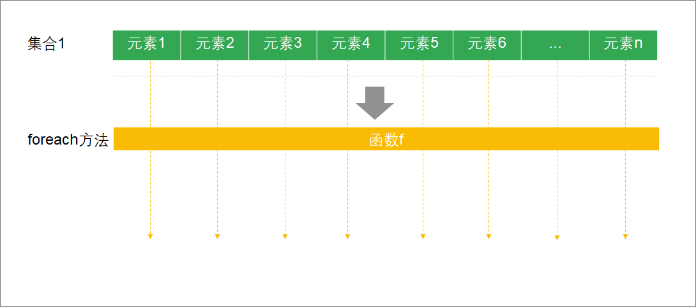
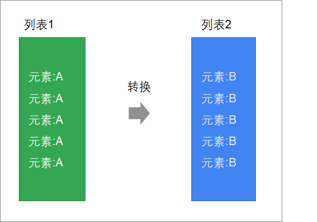
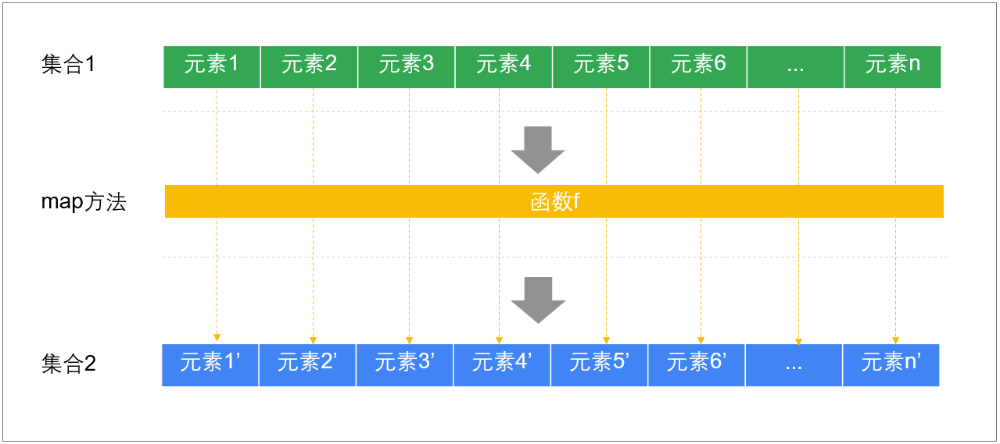
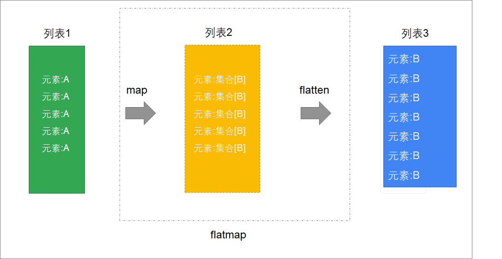
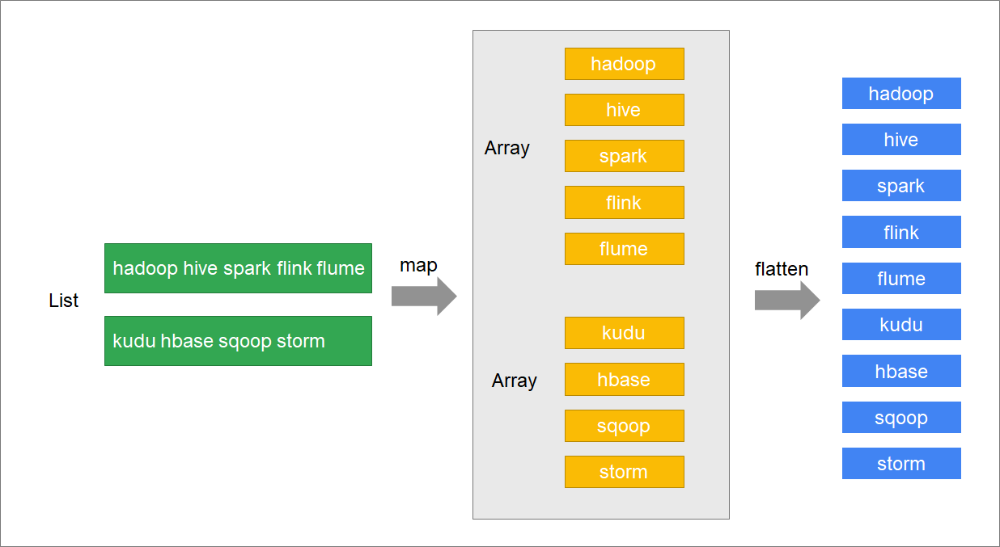
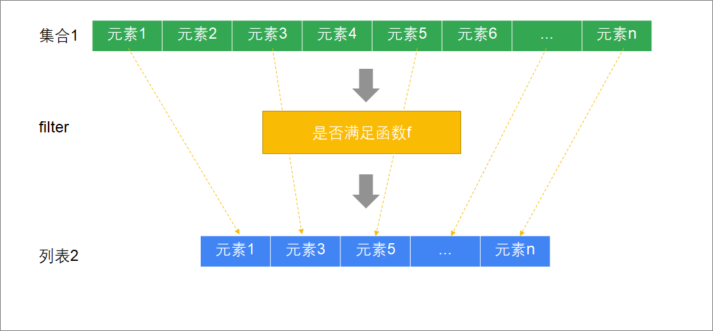
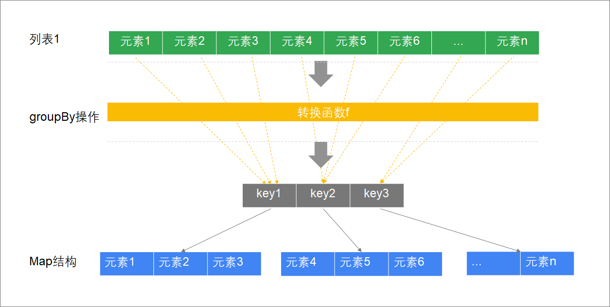
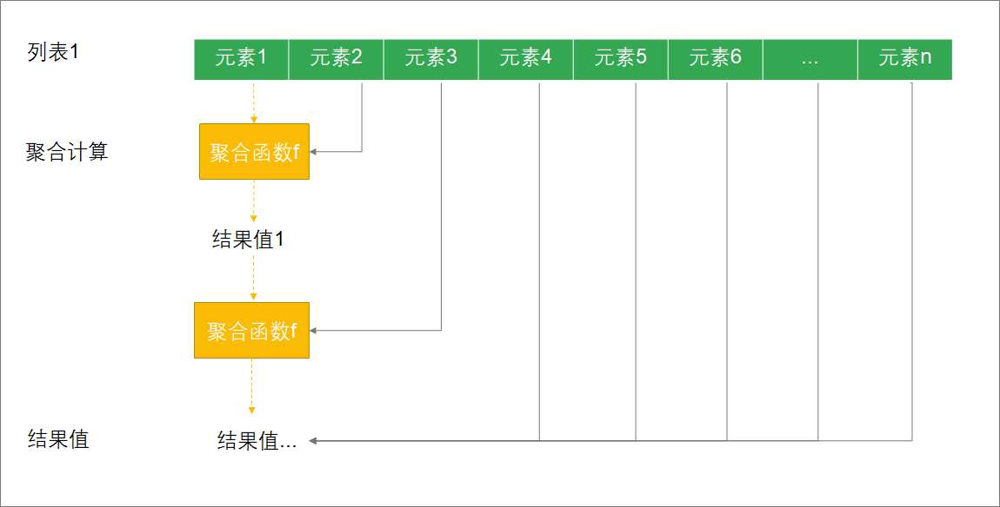

# 1- 函数式编程

我们将来使用Spark/Flink的大量业务代码都会使用到函数式编程。下面的这些操作是学习的重点。

现在我们将会逐渐接触函数式编程的方式.

比如我们要说的第一个foreach方法, 就是一个典型的函数式编程方式.

我们==将一个函数当做参数 传递给另一个方法/函数==

start...

- 遍历（`foreach`）
- 映射（`map`）
- 映射扁平化（`flatmap`）
- 过滤（`filter`）
- 是否存在（`exists`）
- 排序（`sorted`、`sortBy`、`sortWith`）
- 分组（`groupBy`）
- 聚合计算（`reduce`）
- 折叠（`fold`）


## 1-1 函数式编程的意义在哪？

函数是对象，可以作为参数传递。

函数除了是对象以为，函数也是一种逻辑的封装。

所以传递函数，本质上是传递`计算逻辑`


普通的编程形式，方法传递的参数是数据

但是函数式编程中，可以将函数进行传递，那么传递的是`计算逻辑`


回想，Java中也有类似的传递计算逻辑的写法：

- 反射（比如：匿名内部类，MapReduce）


那么，可以知道：Scala的函数式编程，底层是Java的反射


# 2- 遍历 | foreach

之前，学习过了使用for表达式来遍历集合。我们接下来将学习scala的函数式编程，使用`foreach`方法来进行遍历、迭代。它可以让代码更加简洁。

> 用途:
>
> foreach 会帮我们对集合中的每一个元素取出来进行处理, 处理的逻辑由我们自行定义

集合中的元素，都会传入给你提供的函数去计算


**方法签名**

```scala
foreach(f: (A) ⇒ Unit): Unit
```

> f 表明一个函数, A表明传入的参数 =>表明函数返回值是Unit, foreach 整体返回值Unit

**说明**

| foreach | API           | 说明                                                         |
| ------- | ------------- | ------------------------------------------------------------ |
| 参数    | f: (A) ⇒ Unit | 接收一个函数对象<br />函数的输入参数为集合的元素，返回值为空 |
| 返回值  | Unit          | 空                                                           |


foreach执行过程

> 我们传入foreach的是一个函数, 那么怎么工作的呢?
>
> foreach 帮我们把集合中的每一个元素取出来, 然后传给函数, 然函数进行操作
>
> 如下图




**示例**

有一个列表，包含以下元素1,2,3,4，请使用foreach方法遍历打印每个元素


**参考代码**

```scala
// 定义一个列表
scala> val a = List(1,2,3,4)
a: List[Int] = List(1, 2, 3, 4)

// 迭代打印
scala> a.foreach((x:Int)=>println(x))
```


## 2-1 使用类型推断简化函数定义

上述案例函数定义有点啰嗦，我们有更简洁的写法。因为使用foreach去迭代列表，而列表中的每个元素类型是确定的

* scala可以自动来推断出来集合中每个元素参数的类型
* 创建函数时，可以省略其参数列表的类型


**示例**

1. 有一个列表，包含以下元素1,2,3,4，请使用foreach方法遍历打印每个元素
2. 使用类型推断简化函数定义


**参考代码**

```scala
scala> val a = List(1,2,3,4)
a: List[Int] = List(1, 2, 3, 4)

// 省略参数类型
scala> a.foreach(x=>println(x))
```


## 2-2 使用下划线来简化函数定义

当函数参数，只在函数体中出现一次，而且函数体没有嵌套调用时，可以使用下划线来简化函数定义


> 我们来强调一下要求:
>
> 1. 参数只在函数体(注意是函数体, 不包含参数定义那里)里出现一次
> 2. 对这个参数没有复杂的调用, 如(if for 等循环 或迭代等嵌套, 或者在println语句中等(通俗来说就是被括号包起来了))

**示例**

1. 有一个列表，包含以下元素1,2,3,4，请使用foreach方法遍历打印每个元素
2. 使用下划线简化函数定义


**参考代码**

```scala
scala> val a = List(1,2,3,4)
a: List[Int] = List(1, 2, 3, 4)

a.foreach(println(_))
```


* 如果方法参数是函数，如果出现了下划线，scala编译器会自动将代码封装到一个函数中
* 参数列表也是由scala编译器自动处理


https://www.baeldung.com/scala/underscore


# 3- 映射 | map

集合的映射操作是将来在编写Spark/Flink用得最多的操作，是我们必须要掌握的。因为进行数据计算的时候，就是一个将一种数据类型转换为另外一种数据类型的过程。


map方法接收一个函数，将这个函数应用到每一个元素，返回一个新的列表

> 和foreach不同的是, map将处理好的元素封装到新的列表中, 并返回
>
> 而foreach不会返回我们新的列表
>
> 所以一般视使用场景, 来选择带返回的map还是不返回的foreach




## 3-1 用法

**方法签名**

```scala
def map[B](f: (A) ⇒ B): TraversableOnce[B]
```

**方法解析**

map方法就是将集合的每一个元素，传递给提供的函数去处理，将函数处理后的每一个返回值都收集起来

全部存入到List中。这个List作为`map方法`的返回值。

| map方法 | API                | 说明                                                         |
| ------- | ------------------ | ------------------------------------------------------------ |
| 泛型    | [B]                | 指定map方法最终返回的集合泛型(**前后两个B是相互对应的. 一般我们可以省略, scala会帮我自动推断出来的. 因为输入的类型是确定的, 来自集合. 而对于输出, 每一个元素都会被同一个函数(逻辑)进行处理, 那么每一个元素转换后的类型也是一样的. 所以可以自动推断**) |
| 参数    | f: (A) ⇒ B         | 传入一个函数对象<br />该函数接收一个元素A（要转换的列表元素），返回值为类型B |
| 返回值  | TraversableOnce[B] | B类型的==集合==                                              |

> traversable once 字面意思表示可遍历一次的,也就是集合的意思


**map方法解析**




## 3-2 案例一

1. 创建一个列表，包含元素1,2,3,4

2. 对List中的每一个元素加1


**参考代码**

```scala
scala> a.map(x=>x+1)
res4: List[Int] = List(2, 3, 4, 5) // 可以看到返回了res4, 如果是foreach用这个逻辑, 无任何返回
```


## 3-3 案例二

1. 创建一个列表，包含元素1,2,3,4

2. 使用下划线来定义函数，对List中的每一个元素加1


**参考代码**

```scala
scala> val a = List(1,2,3,4)
a: List[Int] = List(1, 2, 3, 4)

scala> a.map(_ + 1)
```


# 4- 扁平化映射 | flatMap

扁平化映射也是将来用得非常多的操作，也是必须要掌握的。


## 4-1 定义

**可以把flatMap，理解为先map，然后再flatten**




就是说, 我们对待处理列表, 正常我们处理它 需要 先对其进行map操作, 然后再进行flatten操作 这样两步操作才可以得到我们想要的结果.

如果我们有这样的需求, 我们就可以使用flatMap( 此方法帮我们实现 先map 后flatten的操作)

- map是将列表中的**元素转换为一个List**

  - > 这是什么意思呢? 这里是指待处理列表中的每一个元素, 都有转换成一个list的需求, 如果我们没有这样的需求, 那么其实就用不到flatMap 直接用flatten方法就行.
    >
    > 可能大家还是有点晕, 我们向下看, 到下面具体的例子就会明白.

- flatten再将整个列表进行扁平化


**方法签名**

```scala
def flatMap[B](f: (A) ⇒ GenTraversableOnce[B]): TraversableOnce[B]
```

**方法解析**

| flatmap方法 | API                            | 说明                                                         |
| ----------- | ------------------------------ | ------------------------------------------------------------ |
| 泛型        | [B]                            | 最终要转换的集合元素类型                                     |
| 参数        | f: (A) ⇒ GenTraversableOnce[B] | 传入一个函数对象<br />函数的参数是集合的元素<br />函数的返回值是一个集合 |
| 返回值      | TraversableOnce[B]             | B类型的集合                                                  |


## 4-2 案例

**案例说明**

1. 有一个包含了若干个文本行的列表："hadoop hive spark flink flume", "kudu hbase sqoop storm"
2. 获取到文本行中的每一个单词，并将每一个单词都放到列表中


**思路分析**



**步骤**

1. 使用map将文本行拆分成数组
2. 再对数组进行扁平化


**参考代码**

```scala
// 定义文本行列表
scala> val a = List("hadoop hive spark flink flume", "kudu hbase sqoop storm")
a: List[String] = List(hadoop hive spark flink flume, kudu hbase sqoop storm)

// 使用map将文本行转换为单词数组
scala> a.map(x=>x.split(" "))
res5: List[Array[String]] = List(Array(hadoop, hive, spark, flink, flume), Array(kudu, hbase, sqoop, storm))

// 扁平化，将数组中的
scala> a.map(x=>x.split(" ")).flatten
res6: List[String] = List(hadoop, hive, spark, flink, flume, kudu, hbase, sqoop, storm)
```


**使用flatMap简化操作**

**参考代码**

```scala
scala>  val a = List("hadoop hive spark flink flume", "kudu hbase sqoop storm")
a: List[String] = List(hadoop hive spark flink flume, kudu hbase sqoop storm)

scala> a.flatMap(_.split(" "))
res7: List[String] = List(hadoop, hive, spark, flink, flume, kudu, hbase, sqoop, storm)
```


# 5- 过滤 | filter

过滤符合一定条件的元素




## 5-1 定义

**方法签名**

```scala
def filter(p: (A) ⇒ Boolean): TraversableOnce[A]
```

**方法解析**

| filter方法 | API                  | 说明                                                         |
| ---------- | -------------------- | ------------------------------------------------------------ |
| 参数       | p: (A) ⇒ **Boolean** | 传入一个函数对象<br />接收一个集合类型的参数<br />返回布尔类型，满足条件返回true, 不满足返回false |
| 返回值     | TraversableOnce[A]   | 列表                                                         |


## 5-2 案例

1. 有一个数字列表，元素为：1,2,3,4,5,6,7,8,9

2. 请过滤出所有的偶数


**参考代码**

```scala
scala> List(1,2,3,4,5,6,7,8,9).filter(_ % 2 == 0)
res8: List[Int] = List(2, 4, 6, 8)
```


# 6- 排序

在scala集合中，可以使用以下几种方式来进行排序

* sorted默认排序
* sortBy指定字段排序
* sortWith自定义排序


## 6-1 默认排序 | sorted

**示例**

1. 定义一个列表，包含以下元素: 3, 1, 2, 9, 7
2. 对列表进行升序排序


**参考代码**

```scala
scala> List(3,1,2,9,7).sorted
res16: List[Int] = List(1, 2, 3, 7, 9)
```


## 6-2 指定字段排序 | sortBy

根据传入的函数转换后，再进行排序

<br>
**方法签名**

```scala
def sortBy[B](f: (A) ⇒ B): List[A]
```

**方法解析**

| sortBy方法 | API        | 说明                                                         |
| ---------- | ---------- | ------------------------------------------------------------ |
| 泛型       | [B]        | 按照什么类型来进行排序                                       |
| 参数       | f: (A) ⇒ B | 传入函数对象<br />接收一个集合类型的元素参数<br />返回B类型的元素进行排序 |
| 返回值     | List[A]    | 返回排序后的列表                                             |

<br>

**示例**

1. 有一个列表，分别包含几下文本行："01 hadoop", "02 flume", "03 hive", "04 spark"
2. 请按照单词字母进行排序


**参考代码**

```scala
scala> val a = List("01 hadoop", "02 flume", "03 hive", "04 spark")
a: List[String] = List(01 hadoop, 02 flume, 03 hive, 04 spark)

// 获取单词字段
scala> a.sortBy(_.split(" ")(1))
res8: List[String] = List(02 flume, 01 hadoop, 03 hive, 04 spark)
```


## 6-3 自定义排序 | sortWith

自定义排序，根据一个函数来进行自定义排序

> 类似在Java中实现Comparable接口

**方法签名**

```scala
def sortWith(lt: (A, A) ⇒ Boolean): List[A]
```

**方法解析**

| sortWith方法 | API                  | 说明                                                         |
| ------------ | -------------------- | ------------------------------------------------------------ |
| 参数         | lt: (A, A) ⇒ Boolean | 传入一个比较大小的函数对象<br />接收两个集合类型的元素参数<br />返回两个元素大小，小于返回true，大于返回false, 也就是升序排序的意思, 如果要实现降序, 可以自行控制小于返回false 大于返回true<br />不用去想这两个参数是如何传递的, scala会自动帮我们将带处理列表的元素两两传递过来让我们进行排序 |
| 返回值       | List[A]              | 返回排序后的列表                                             |

<br>


**示例**

1. 有一个列表，包含以下元素：2,3,1,6,4,5
2. 使用sortWith对列表进行降序排序


**参考代码**

```scala
scala> val a = List(2,3,1,6,4,5)
a: List[Int] = List(2, 3, 1, 6, 4, 5)

scala> a.sortWith((x,y) => if(x<y)true else false)
res15: List[Int] = List(1, 2, 3, 4, 5, 6)

scala> res15.reverse
res18: List[Int] = List(6, 5, 4, 3, 2, 1)
```


使用下划线简写上述案例


**参考代码**

```scala
scala> val a = List(2,3,1,6,4,5)
a: List[Int] = List(2, 3, 1, 6, 4, 5)

// 函数参数只在函数中出现一次，可以使用下划线代替
scala> a.sortWith(_ < _).reverse
res19: List[Int] = List(6, 5, 4, 3, 2, 1)
```

> 两个参数都是只出现一次, 并没有嵌套, 那么可以用下划线代替
>
> 第一个下划线代表参数1
>
> 第二个下划线代表参数2


# 7- 分组 | groupBy

。我们如果要将数据按照分组来进行统计分析，就需要使用到分组方法

> 等同于SQL中的 group by的概念， 就是给数据按照指定的列进行分组用。


## 7-1 定义

groupBy表示按照函数将列表分成不同的组


**方法签名**

```scala
def groupBy[K](f: (A) ⇒ K): Map[K, List[A]]
```

**方法解析**

| groupBy方法 | API             | 说明                                                         |
| ----------- | --------------- | ------------------------------------------------------------ |
| 泛型        | [K]             | 分组字段的类型                                               |
| 参数        | f: (A) ⇒ K      | 传入一个函数对象<br />接收集合元素类型的参数<br />返回一个K类型的key，这个key会用来进行分组，相同的key放在一组中 |
| 返回值      | Map[K, List[A]] | 返回一个映射，K为分组字段，List为这个分组字段对应的一组数据  |


**groupBy执行过程分析**




## 7-2 示例

1. 有一个列表，包含了学生的姓名和性别: 

   ```scala
   "张三", "男"
   "李四", "女"
   "王五", "男"
   ```

2. 请按照性别进行分组，统计不同性别的学生人数


**步骤**

1. 定义一个元组列表来保存学生姓名和性别
2. 按照性别进行分组
3. 将分组后的Map转换为列表：List(("男" -> 2), ("女" -> 1))


**参考代码**

```scala
scala> val a = List("张三"->"男", "李四"->"女", "王五"->"男")
a: List[(String, String)] = List((张三,男), (李四,女), (王五,男))

// 按照性别分组
scala> a.groupBy(_._2)
res0: scala.collection.immutable.Map[String,List[(String, String)]] = Map(男 -> List((张三,男), (王五,男)),
女 -> List((李四,女)))

// 将分组后的映射转换为性别/人数元组列表
scala> res0.map(x => x._1 -> x._2.size)
res3: scala.collection.immutable.Map[String,Int] = Map(男 -> 2, 女 -> 1)
```


# 8- 聚合操作

聚合操作，可以将一个列表中的数据合并为一个。这种操作经常用来统计分析中


## 8-1 聚合 | reduce

reduce表示将列表，传入一个函数进行聚合计算


### 8-1-1 定义

---

**方法签名**

```scala
def reduce[A1 >: A](op: (A1, A1) ⇒ A1): A1
```

**方法解析**

| reduce方法 | API               | 说明                                                         |
| ---------- | ----------------- | ------------------------------------------------------------ |
| 泛型       | [A1 >: A]         | （下界）A1必须是集合元素类型的子类                           |
| 参数       | op: (A1, A1) ⇒ A1 | 传入函数对象，用来不断进行聚合操作<br />第一个A1类型参数为：当前聚合后的变量<br />第二个A1类型参数为：当前要进行聚合的元素 |
| 返回值     | A1                | 列表最终聚合为一个元素                                       |


reduce执行流程分析




> [!NOTE]
>
> * reduce和reduceLeft效果一致，表示从左到右计算
>
> * reduceRight表示从右到左计算


### 8-1-2 案例

---

1. 定义一个列表，包含以下元素：1,2,3,4,5,6,7,8,9,10
2. 使用reduce计算所有元素的和


**参考代码**

```scala
scala> val a = List(1,2,3,4,5,6,7,8,9,10)
a: List[Int] = List(1, 2, 3, 4, 5, 6, 7, 8, 9, 10)

scala> a.reduce((x,y) => x + y)
res5: Int = 55

// 第一个下划线表示第一个参数，就是历史的聚合数据结果
// 第二个下划线表示第二个参数，就是当前要聚合的数据元素
scala> a.reduce(_ + _)
res53: Int = 55

// 与reduce一样，从左往右计算
scala> a.reduceLeft(_ + _)
res0: Int = 55

// 从右往左聚合计算
scala> a.reduceRight(_ + _)
res1: Int = 55
```


## 8-2 折叠 |  fold

fold与reduce很像，但是多了一个指定初始值参数


### 8-2-1 定义

---

**方法签名**

```scala
def fold[A1 >: A](z: A1)(op: (A1, A1) ⇒ A1): A1
```

**方法解析**

| reduce方法 | API               | 说明                                                         |
| ---------- | ----------------- | ------------------------------------------------------------ |
| 泛型       | [A1 >: A]         | （下界）A1必须是集合元素类型的子类                           |
| 参数1      | z: A1             | 初始值                                                       |
| 参数2      | op: (A1, A1) ⇒ A1 | 传入函数对象，用来不断进行折叠操作<br />第一个A1类型参数为：当前折叠后的变量<br />第二个A1类型参数为：当前要进行折叠的元素 |
| 返回值     | A1                | 列表最终折叠为一个元素                                       |


> [!NOTE]
>
> * fold和foldLet效果一致，表示从左往右计算
>
> * foldRight表示从右往左计算


### 8-2-2 案例

---

1. 定义一个列表，包含以下元素：1,2,3,4,5,6,7,8,9,10
2. 使用fold方法计算所有元素的和


**参考代码**

```scala
scala> val a = List(1,2,3,4,5,6,7,8,9,10)
a: List[Int] = List(1, 2, 3, 4, 5, 6, 7, 8, 9, 10)

scala> a.fold(0)(_ + _)
res4: Int = 155
```


