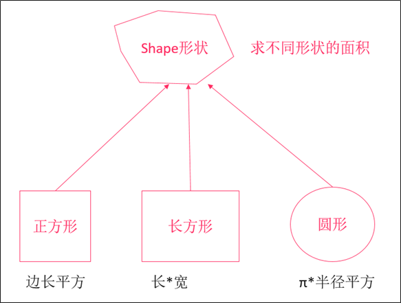
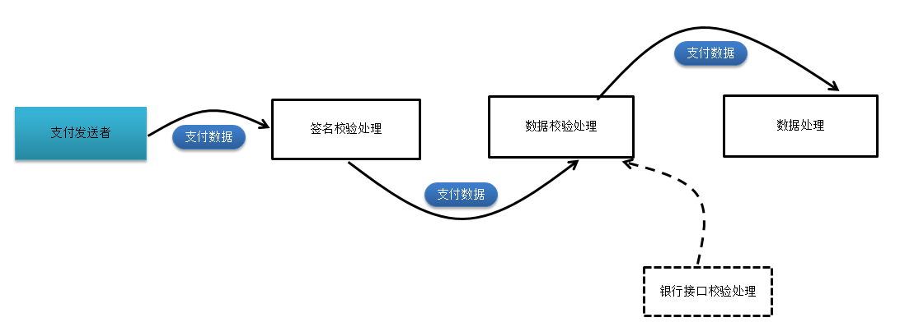

## MAVEN依赖 - 掌握

```xml
<?xml version="1.0" encoding="UTF-8"?>
<project xmlns="http://maven.apache.org/POM/4.0.0"
         xmlns:xsi="http://www.w3.org/2001/XMLSchema-instance"
         xsi:schemaLocation="http://maven.apache.org/POM/4.0.0 http://maven.apache.org/xsd/maven-4.0.0.xsd">
    <modelVersion>4.0.0</modelVersion>

    <groupId>com.itheima</groupId>
    <artifactId>akka-demo</artifactId>
    <version>1.0-SNAPSHOT</version>


    <properties>
        <maven.compiler.source>1.8</maven.compiler.source>
        <maven.compiler.targer>1.8</maven.compiler.targer>
        <encoding>UTF-8</encoding>
        <scala.version>2.11.8</scala.version>
        <scala.compat.version>2.11.8</scala.compat.version>
    </properties>

    <dependencies>
        <!-- https://mvnrepository.com/artifact/org.scala-lang/scala-library -->
        <dependency>
            <groupId>org.scala-lang</groupId>
            <artifactId>scala-library</artifactId>
            <version>${scala.version}</version>
        </dependency>

    <!--
        <dependency>
            <groupId>com.typesafe.akka</groupId>
            <artifactId>akka-actor_2.11</artifactId>
            <version>2.3.14</version>
        </dependency>

        <dependency>
            <groupId>com.typesafe.akka</groupId>
            <artifactId>akka-remote_2.11</artifactId>
            <version>2.3.14</version>
        </dependency>
    -->
    </dependencies>

    <build>
        <sourceDirectory>src/main/scala</sourceDirectory>
        <testSourceDirectory>src/test/scala</testSourceDirectory>
        <plugins>
            <plugin>
                <groupId>net.alchim31.maven</groupId>
                <artifactId>scala-maven-plugin</artifactId>
                <version>3.2.2</version>
                <executions>
                    <execution>
                        <goals>
                            <goal>compile</goal>
                            <goal>testCompile</goal>
                        </goals>
                        <configuration>
                            <args>
                                <!--<arg>-make:transitive</arg>-->
                                <arg>-dependencyfile</arg>
                                <arg>${project.build.directory}/.scala_dependencies</arg>
                            </args>
                        </configuration>
                    </execution>
                </executions>
            </plugin>

            <plugin>
                <groupId>org.apache.maven.plugins</groupId>
                <artifactId>maven-shade-plugin</artifactId>
                <version>2.4.3</version>
                <executions>
                    <execution>
                        <phase>package</phase>
                        <goals>
                            <goal>shade</goal>
                        </goals>
                        <configuration>
                            <filters>
                                <filter>
                                    <artifact>*:*</artifact>
                                    <excludes>
                                        <exclude>META-INF/*.SF</exclude>
                                        <exclude>META-INF/*.DSA</exclude>
                                        <exclude>META-INF/*.RSA</exclude>
                                    </excludes>
                                </filter>
                            </filters>
                            <transformers>
                                <transformer implementation="org.apache.maven.plugins.shade.resource.AppendingTransformer">
                                    <resource>reference.conf</resource>
                                </transformer>
                                <transformer implementation="org.apache.maven.plugins.shade.resource.ManifestResourceTransformer">
                                    <mainClass></mainClass>
                                </transformer>
                            </transformers>
                        </configuration>
                    </execution>
                </executions>
            </plugin>
        </plugins>
    </build>

</project>
```

**学习目标**

* 掌握scala类与object的用法
* 掌握继承的用法
* 掌握trait（特质）的用法


## 类  - 掌握

scala是支持面向对象的，也有类和对象的概念。


### 创建类和对象  - 掌握

---

* 使用`class`关键字来定义类
* 使用`var`/`val`来定义成员变量
* 使用`def`来定义成员方法
* 使用`new`来创建一个实例对象


示例1：

1. 定义一个Customer类，该类包含以下成员：


| 成员变量                           |
| ---------------------------------- |
| 姓名（例如：张三、李四）           |
| 性别（例如：男、女）               |
| 注册时间（不可修改）（2010/03/12） |

| 成员方法    |
| ----------- |
| sayHi(消息) |


2. 定义好类之后，创建该类的对象。并给该对象赋值，并打印对象中的成员，调用成员方法。


**步骤**

1. 定义一个Customer类，并添加成员变量/成员方法
2. 添加一个main方法，并创建Customer类的对象，并给对象赋值，打印对象中的成员，调用成员方法


scala代码：

```scala
class Customer {
  var name:String = _
  var sex:String = _
  val registerDate:Date = new Date

  def sayHi(msg:String) = {
    println(msg)
  }
}

object Main {
  def main(args: Array[String]): Unit = {
    val customer = new Customer

    customer.name = "张三"
    customer.sex = "男"

    println(s"姓名: ${customer.name}, 性别：${customer.sex}, 注册时间: ${customer.registerDate}")
    customer.sayHi("你好!")
  }
}
```


> 2. var name:String = \_，\_表示使用默认值进行初始化
>
>    例如：String类型默认值是null，Int类型默认值是0，Boolean类型默认值是false...
>
> 3. val变量不能使用_来进行初始化，因为val是不可变的，所以必须手动指定一个默认值
>
> 4. main方法必须要放在一个scala的`object`（单例对象）中才能执行


### getter/setter - 了解

---


**问题1：**

上述的案例，创建出来一个Customer实例，就可以给name、sex这些字段进行赋值、并可以获取它们的值。这是否意味着这些字段默认都是public的呢？


为了验证上述问题，我们需要反编译scala编译出来的class文件，看一看最终编译器出来的字节码是什么样的。


**使用jd-gui工具反编译Customer类**


**使用jd-gui反编译Main类**


**问题2：**

是否能够生成类似于Java的getter/setter方法呢？


可以，在字段上加上`@BeanProperty`就可以了。

```scala
  @BeanProperty
  var name:String = _             // 姓名

  @BeanProperty
  val registerDate = new Date()   // 注册时间
```


	通过查看反编译的代码，scalac编译器已经自动帮助我们添加了Java的getter/setter


> 1. scala会自动为成员变量生成scala语言的getter/setter
> 2. scala的getter为`字段名()`，setter为`字段名_=()`
> 3. 要生成Java的getter/setter，可以在成员变量上加一个`@BeanProperty`注解，这样将来去调用一些Java库的时候很有用


### 类的构造器 - 掌握

---

* 主构造器

  主构造器是写在类后面，例如：

  ```scala
  class 类名(var/val 参数名:类型 = 默认值, var/val 参数名:类型 = 默认值){
      // 构造代码块
  }
  ```

* 辅助构造器

  辅助构造器，使用`this`来定义，例如：

  ```scala
  def this(参数名:类型, 参数名:类型) {
      ...
  }
  ```

  


示例1：定义主构造器

```scala
class Student(_name:String, _age:Int) {
  var name:String = _
  var age:Int = _
  
  // 构造器的代码可以直接写在类中
  name = _name
  age = _age
}
```


示例2：简化定义主构造器

```scala
// 在主构造器中，可以直接定义成员变量
class Student(val name:String, val age:Int)
```


示例3：定义辅助构造器

```scala
class Student(val name:String, val age:Int) {
  // 定义一个参数的辅助构造器
  def this(name:String) {
    // 第一行必须调用主构造器、其他辅助构造器或者super父类的构造器
    this(name, 20)
  }

  def this(age:Int) {
    this("某某某", age)
  }
}
```


> 1. 主构造器直接在类名后面定义
> 2. 主构造器中的参数列表会自动定义为私有的成员变量
> 3. 一般在主构造器中直接使用val/var定义成员变量，这样看起来会更简洁
> 4. 在辅助构造器中必须调用其他构造器（主构造器、其他辅助构造器）


## 单例对象

Scala中没有static关键字，但是它支持静态

如果要定义静态的东西，==统统定义==到object中

语法：

```scala
object xxx{
  // 内容
}
```

> 反向理解，class中的东西， 全部是 `非静态的`


### 定义object - 掌握

---

定义单例对象和定义类很像，就是把class换成object


示例：定义一个工具类，用来格式化日期时间

```scala
object DateUtils {

  // 在object中定义的成员变量，相当于Java中定义一个静态变量
  // 定义一个SimpleDateFormat日期时间格式化对象
  val simpleDateFormat = new SimpleDateFormat("yyyy-MM-dd HH:mm")

  // 构造代码
  println("构造代码")
    
  // 相当于Java中定义一个静态方法
  def format(date:Date) = simpleDateFormat.format(date)

  // main是一个静态方法，所以必须要写在object中
  def main(args: Array[String]): Unit = {
    println { DateUtils.format(new Date()) };
  }
}
```


> 1. 使用`object 单例对象名`定义一个单例对象，可以用object作为工具类或者存放常量
> 2. 在单例对象中定义的变量，类似于Java中的static成员变量
> 3. 在单例对象中定义的方法，类似于Java中的static方法
> 4. object单例对象的构造代码可以直接写在花括号中
> 5. 调用单例对象的方法，直接使用`单例对象名.方法名`，访问单例对象的成员变量也是使用`单例对象名.变量名`
> 6. ==单例对象只能有一个无参的主构造器，不能添加其他参数==


### 伴生对象 - 掌握

---

在Java中，经常会有一些类，同时有实例成员又有静态成员。如下：


```java
public class CustomerService {

    private static Logger logger = Logger.getLogger("customerService");

    public void save(String customer) {
        logger.info("添加一个用户");
        // 保存客户
    }

    public static void main(String[] args) {
        new CustomerService().save("客户");
    }
}
```


在scala中，可以使用`伴生对象`来实现。


**一个class和object具有同样的名字。这个object称为`伴生对象`，这个class称为`伴生类`**


实例1：使用scala重写上面的案例。


```scala
class CustomerService {

  private val serviceName = "CustomerService"

  def save(customer:String):Unit = {
    // 在类中可以获取伴生对象的私有成员变量
    CustomerService.logger.info("添加一个用户")
    // 新增客户
  }
}

// 定义一个伴生对象
object CustomerService {
  // 定义一个日志器
  private val logger = Logger.getLogger("CustomerService")

  def main(args: Array[String]): Unit = {
    val customerService = new CustomerService()
    customerService.save("张三")

    // 在伴生对象中也可以访问伴生类的私有方法
    println(customerService.serviceName)
  }
}
```


> 1.  伴生类和伴生对象的名字必须是一样的
> 2.  伴生类和伴生对象需要在一个scala源文件中
> 3.  伴生类和伴生对象可以互相访问private的属性


### apply方法 - 掌握

---

我们之前使用过这种方式来创建一个Array对象。


```scala
// 创建一个Array对象
val a = Array(1,2,3,4)
```


这种写法非常简便，不需要再写一个new，然后敲一个空格，再写类名。如何直接使用类名来创建对象呢？


查看scala源代码：


答案就是：**实现伴生对象的`apply`方法**

伴生对象的apply方法用来快速地创建一个伴生类的对象。


示例1：

```scala
class Person(var name:String, var age:Int) {

  override def toString = s"Person($name, $age)"
}

object Person {
  // 实现apply方法
  // 返回的是伴生类的对象
  def apply(name:String, age:Int): Person = new Person(name, age)

  // apply方法支持重载
  def apply(name:String):Person = new Person(name, 20)

  def apply(age:Int):Person = new Person("某某某", age)

  def apply():Person = new Person("某某某", 20)
}

object Main2 {
  def main(args: Array[String]): Unit = {
    val p1 = Person("张三", 20)
    val p2 = Person("李四")
    val p3 = Person(100)
    val p4 = Person()

    println(p1)
    println(p2)
    println(p3)
    println(p4)
  }
}
```


> 1. 当遇到`类名(参数1, 参数2...)`会自动调用apply方法，在apply方法中来创建对象
>
> 2. 定义apply时，如果参数列表是空，也不能省略括号()，否则引用的是伴生对象


### main方法

---

scala和Java一样，如果要运行一个程序，必须有一个main方法。而在Java中main方法是静态的，而在scala中没有静态方法。在scala中，这个main方法必须放在一个object中。


示例1：

```scala
object Main5 {
  def main(args:Array[String]) = {
    println("hello, scala")
  }
}
```


也可以继承自App Trait（特质），然后将需要编写在main方法中的代码，写在object的构造方法体内。

示例2：

```scala
object Main5 extends App {
  println("hello, scala")
}
```


## 继承(extends) - 了解


### 简单继承

---

scala和Java一样，使用**extends**关键字来实现继承。可以在子类中定义父类中没有的字段和方法，或者重写父类的方法。


示例1：实现简单继承


```scala
class Person {
  var name = "super"

  def getName = this.name
}

class Student extends Person

object Main13 {
  def main(args: Array[String]): Unit = {
    val p1 = new Person()
    val p2 = new Student()

    p2.name = "张三"

    println(p2.getName)
  }
}
```


示例2：单例对象实现继承


```scala
class Person {
  var name = "super"

  def getName = this.name
}

object Student extends Person

object Main13 {
  def main(args: Array[String]): Unit = {

    println(Student.getName)
  }
}
```


### override和super

---

* 如果子类要覆盖父类中的一个非抽象方法，必须要使用override关键字
* 可以使用override关键字来重写一个==val==字段(var无需重写，直接改值即可)
* 可以使用super关键字来访问父类的成员


示例1：class继承class

```scala
class Person {
  val name = "super"

  def getName = name
}

class Student extends Person {
  // 重写val字段
  override val name: String = "child"

  // 重写getName方法
  override def getName: String = "hello, " + super.getName
}

object Main13 {
  def main(args: Array[String]): Unit = {
    println(new Student().getName)
  }
}
## 注意，当字段被子类覆盖的时候，用super无法访问父类字段会报错，或者不报错也无法访问到父类的原始值，只能访问到覆盖的值哦。
## 如上代码，通过getName访问父类的字段也无法访问到super这个值，因为子类对字段值进行覆盖，得到的就只能是child这个值。
```


### isInstanceOf和asInstanceOf

---

我们经常要在代码中进行类型的判断和类型的转换。在Java中，我们可以使用instanceof关键字、以及(类型)object来实现，在scala中如何实现呢？


scala中对象提供isInstanceOf和asInstanceOf方法。

* isInstanceOf判断对象是否为指定类的对象
* asInstanceOf将对象转换为指定类型


```scala
class Person3
class Student3 extends Person3

object Main3 {
  def main(args: Array[String]): Unit = {
    val s1:Person3 = new Student3

    // 判断s1是否为Student3类型
    if(s1.isInstanceOf[Student3]) {
      // 将s1转换为Student3类型
      val s2 =  s1.asInstanceOf[Student3]
      println(s2)
    }

  }
}

```


### getClass和classOf

---

isInstanceOf 只能判断出对象是否为指定类以及其子类的对象，而不能精确的判断出，对象就是指定类的对象。如果要求精确地判断出对象就是指定类的对象，那么就只能使用 getClass 和 classOf 。


* p.getClass可以精确获取对象的类型
* classOf[x]可以精确获取类型
* 使用==操作符就可以直接比较


示例：

```scala
class Person4
class Student4 extends Person4

object Student4{
  def main(args: Array[String]) {
    val p:Person4=new Student4
    //判断p是否为Person4类的实例
    println(p.isInstanceOf[Person4])//true

    //判断p的类型是否为Person4类
    println(p.getClass == classOf[Person4])//false

    //判断p的类型是否为Student4类
    println(p.getClass == classOf[Student4])//true
  }
}
```


### 访问修饰符 - 了解

---

Java中的访问控制，同样适用于scala，可以在成员前面添加private/protected关键字来控制成员的可见性。但在scala中，**`没有public关键字`**，==任何没有被标为private或protected的成员都是公共的。==


**private[this]修饰符**

==被修饰的成员只能在当前类中被访问。==或者可以理解为：`只能通过this.来访问`（在当前类中访问成员会自动添加this.）。


示例：

1. 创建一个Person类
   * 添加一个`private[this]`修饰符的name字段，并赋值为"super"
   * 添加一个getName方法，获取name字段
   * 添加一个sayHelloTo方法，接收一个Person类型参数，尝试打印该参数的name字段
2. 创建一个Person的伴生对象
   * 添加一个showName方法，接收一个Person类型参数，尝试打印该参数的name字段


代码：

```scala
class Person {
  // 只有在当前对象中能够访问
  private[this] var name = "super"

  def getName = this.name	// 正确！

  def sayHelloTo(p:Person) = {
    println("hello" + p.name)     // 报错!无法访问
  }
}

object Person {
  def showName(p:Person) = println(p.name)  // 报错!无法访问
}
```


**protected[this]修饰符**

被修饰的成员只能在当前类和当前子类中被访问。也可以理解为：当前类通过**this.**访问或者子类通过**this.**访问


示例：

1. 将Person类的name字段访问修饰符改为`protected[this]`
2. 创建一个Student类
   * 添加一个showName方法，在方法中访问name字段
   * 添加一个sayHelloTo2方法，接收一个Person类型参数，在方法中打印该参数的name字段


```scala
class Person {
  // 只有在当前对象以及继承该类的当前对象中能够访问
  protected[this] var name = "super"
  
  def getName = {
    // 正确！
    this.name
  }

  def sayHelloTo1(p:Person) = {
    // 编译错误！无法访问
    println(p.name)
  }
}

object Person {
  def sayHelloTo3(p:Person) = {
    // 编译错误！无法访问
    println(p.name)
  }
}

class Student extends Person {
  def showName = {
    // 正确！
    println(name)
  }

  def sayHelloTo2(p:Person) = {
    // 编译错误！无法访问
    println(p.name)
  }
}
```


### 调用父类的constructor

---

实例化子类对象，必须要调用父类的构造器，在scala中，只能在子类的`主构造器`中调用父类的构造器


步骤：

1. 创建一个Person类，编写带有一个可变的name字段的主构造器
2. 创建一个Student类，继承自Person类
   * 编写带有一个name参数、clazz班级字段的主构造器
   * 调用父类的构造器
3. 创建main方法，创建Student对象实例，并打印它的姓名、班级


代码：

```scala
class Person5(var name:String)
// 直接在父类的类名后面调用父类构造器
class Student5(name:String, var clazz:String) extends Person5(name)

object Main5 {
  def main(args: Array[String]): Unit = {
    val s1 = new Student5("张三", "三年二班")
    println(s"${s1.name} - ${s1.clazz}")
  }
}
```


### 抽象类

---

如果类的某个成员在当前类中的定义是不包含完整的，它就是一个**抽象类**

不完整定义有两种情况：

1. 方法没有方法体
2. 变量没有初始化

没有方法体的方法称为**抽象方法**，没有初始化的变量称为**抽象字段**。定义抽象类和Java一样，在类前面加上**abstract**关键字就可以了


#### 抽象方法

示例1：



设计4个类，表示上述图中的继承关系，每一个形状都有自己求面积的方法，但是不同的形状计算面积的方法不同。


步骤：

1. 创建一个Shape抽象类，添加一个area抽象方法，用于计算面积
2. 创建一个Square正方形类，继承自Shape，它有一个边长的主构造器，并实现计算面积方法
3. 创建一个长方形类，继承自Shape，它有一个长、宽的主构造器，实现计算面积方法
4. 创建一个圆形类，继承自Shape，它有一个半径的主构造器，并实现计算面积方法
5. 编写main方法，分别创建正方形、长方形、圆形对象，并打印它们的面积


代码：

```scala
// 创建形状抽象类
abstract class Shape {
  def area:Double
}

// 创建正方形类
class Square(var edge:Double /*边长*/) extends Shape {
  // 实现父类计算面积的方法
  override def area: Double = edge * edge
}

// 创建长方形类
class Rectangle(var length:Double /*长*/, var width:Double /*宽*/) extends Shape {
  override def area: Double = length * width
}

// 创建圆形类
class Cirle(var radius:Double /*半径*/) extends Shape {
  override def area: Double = Math.PI * radius * radius
}

object Main6 {
  def main(args: Array[String]): Unit = {
    val s1:Shape = new Square(2)
    val s2:Shape = new Rectangle(2,3)
    val s3:Shape = new Cirle(2)

    println(s1.area)
    println(s2.area)
    println(s3.area)
  }
}
```


#### 抽象字段

示例2：


步骤：

1. 创建一个Person抽象类，它有一个String抽象字段WHO_AM_I
2. 创建一个Student类，继承自Person类，重写WHO_AM_I字段，初始化为学生
3. 创建一个Policeman类，继承自Person类，重写WHO_AM_I字段，初始化警察
4. 添加main方法，分别创建Student/Policeman的实例，然后分别打印WHO_AM_I


代码

```scala
// 定义一个人的抽象类
abstract class Person6 {
  // 没有初始化的val字段就是抽象字段
  val WHO_AM_I:String
}

class Student6 extends Person6 {
  override val WHO_AM_I: String = "学生"
}

class Policeman6 extends Person6 {
  override val WHO_AM_I: String = "警察"
}

object Main6 {
  def main(args: Array[String]): Unit = {
    val p1 = new Student6
    val p2 = new Policeman6

    println(p1.WHO_AM_I)
    println(p2.WHO_AM_I)
  }
}
```


### 匿名内部类

---

匿名内部类是没有名称的子类，直接用来创建实例对象。Spark的源代码中有大量使用到匿名内部类。


示例：

1. 创建一个Person10抽象类，并添加一个sayHello抽象方法
2. 添加main方法，通过创建匿名内部类的方式来实现Person10
3. 调用匿名内部类对象的sayHello方法


代码：

```scala
abstract class Person7 {
  def sayHello:Unit
}

object Main7 {
  def main(args: Array[String]): Unit = {
    // 直接用new来创建一个匿名内部类对象
    val p1 = new Person7 {
      override def sayHello: Unit = println("我是一个匿名内部类")
    }
    p1.sayHello
  }
}
```


## 特质(trait) - 了解


OLTP  = online transaction processing


大数据：OLAP = online analysis  processing


scala中没有interfact的接口

可以用trait来实现接口的功能。

同时trait比接口更强大


* ==特质是scala中代码复用的基础单元==
* 它可以将方法和字段定义封装起来，然后添加到类中
* 与类继承不一样的是，类继承要求每个类都只能继承`一个`超类，而一个类可以添加`任意数量`的特质。
* 特质的定义和抽象类的定义很像，但它是使用`trait`关键字


```properties
1. trait 中可以有 抽象的 也可以有 具体的
2. 一个类可以实现多个trait（通过with关键字）
3. 单个对象也可以附件多个trait
4. trait本身也可以继承其它class

通过这3个特性，我们可以体现出来。trait是一种 代码复用的最小单元
我们可以将想要的特性功能封装到trait中
不管是让class去附加 还是单个对象去附加 都OK
同时附加的数量不受到影响。
```


接下来，我们就来学习trait的几种用法。


### 作为接口使用

---

* 使用`extends`来继承trait（scala不论是类还是特质，都是使用extends关键字）
* 如果要继承多个trait，则使用`with`关键字


**案例1：继承单个trait**


实现步骤：

1. 创建一个Logger特质，添加一个接受一个String类型参数的log抽象方法
2. 创建一个ConsoleLogger类，继承Logger特质，实现log方法，打印消息
3. 添加main方法，创建ConsoleLogger对象，调用log方法


示例代码：

```scala
trait Logger {
  // 抽象方法
  def log(msg:String)
}

class ConsoleLogger extends Logger {
  override def log(msg: String): Unit = println(msg)
}

object LoggerTrait {
  def main(args: Array[String]): Unit = {
    val logger = new ConsoleLogger
    logger.log("控制台日志: 这是一条Log")
  }
}
```


**案例2：继承多个trait**


实现步骤：


1. 在上一个案例的基础上，创建一个MessageSender特质，添加接受一个String类型参数的send方法
2. 再让ConsoleLogger实现一个MessageSender特质，并实现它的send方法，打印"发送消息..."
3. 在main中调用，send方法


示例代码：


```scala
trait Logger {
  // 抽象方法
  def log(msg:String)
}

trait MessageSender {
  def send(msg:String)
}

class ConsoleLogger extends Logger with MessageSender {
  
  override def log(msg: String): Unit = println(msg)

  override def send(msg: String): Unit = println(s"发送消息:${msg}")
}

object LoggerTrait {
  def main(args: Array[String]): Unit = {
    val logger = new ConsoleLogger
    logger.log("控制台日志: 这是一条Log")
    logger.send("你好!")
  }
}
```


**案例3：object继承trait**


实现步骤：

1. 创建一个LoggerForObject特质，添加一个接受一个String类型参数的log抽象方法
2. 创建一个ConsoleLogger的object，实现LoggerForObject特质，实现log方法，打印消息
3. 编写main方法，调用ConsoleLogger的log方法


```scala
trait LoggerForObject {
  // 抽象方法
  def log(msg:String)
}

// object也可以继承trait
object ConsoleLogger extends LoggerForObject {
  override def log(msg: String): Unit = println(s"控制台信息 $msg")
}

object ObjectTrait {
  def main(args: Array[String]): Unit = {
    ConsoleLogger.log("程序退出")
  }
}
```


> 1. 在trait中可以定义抽象方法，不写方法体就是抽象方法
> 2. 和继承类一样，使用extends来继承trait
> 3. 继承多个trait，使用with关键字
> 4. 单例对象也可以继承trait


### 定义具体的方法

---

和类一样，trait中还可以定义具体的方法。·


**案例：在trait中定义具体方法**


实现步骤：

1. 定义一个LoggerDetail特质
   * 添加接受一个String类型的log方法，并打印参数
2. 定义一个UserService类，实现LoggerDetail特质
   * 添加add方法，调用log方法打印"添加用户"
3. 添加main方法
   * 创建UserService对象实例
   * 调用add方法


示例代码：


```scala
trait LoggerDetail {
  // 在trait中定义具体方法
  def log(msg:String) = println(msg)
}

class UserService extends LoggerDetail {
  def add() = log("添加用户")
}

object MethodInTrait {
  def main(args: Array[String]): Unit = {
    val userService = new UserService
    userService.add()
  }
}
```


### 定义具体方法和抽象方法

---

* 在trait中，可以混合使用具体方法和抽象方法
* 使用具体方法依赖于抽象方法，而抽象方法可以放到继承trait的子类中实现，这种设计方式也称为**模板模式**


案例：实现一个模板模式


实现步骤：

1. 添加一个LoggerFix特质
   * 添加一个log抽象方法，接收String参数
   * 添加一个info具体方法，接收String参数，调用log方法，参数添加"INFO:"
   * 添加一个warn具体方法，接收String参数，调用log方法，参数添加"WARN:"
   * 添加一个error具体方法，接收String参数，调用log方法，参数添加"ERROR:"
2. 创建ConsoleLoggerFix类
   * 实现LoggerFix特质
   * 实现log方法，打印参数
3. 添加main方法
   * 创建ConsoleLoggerFix类对象
   * 调用info方法
   * 调用warn方法
   * 调用error方法


示例代码：


```scala
trait Logger08 {
  // 抽象方法
  def log(msg:String)
  // 具体方法（该方法依赖于抽象方法log
  def info(msg:String) = log("INFO:" + msg)
  def warn(msg:String) = log("WARN:" + msg)
  def error(msg:String) = log("ERROR:" + msg)
}

class ConsoleLogger08 extends Logger08 {
  override def log(msg: String): Unit = println(msg)
}

object Trait08 {
  def main(args: Array[String]): Unit = {
    val logger08 = new ConsoleLogger08

    logger08.info("这是一条普通信息")
    logger08.warn("这是一条警告信息")
    logger08.error("这是一条错误信息")
  }
}
```


### 定义具体的字段和抽象的字段

---

* 在trait中可以定义具体字段和抽象字段
* 继承trait的子类自动拥有trait中定义的字段
* 字段直接被添加到子类中


**案例：在trait中定义具体的字段和抽象的字段**


实现步骤：

1. 创建LoggerEx特质
   * 定义一个sdf具体字段，类型为SimpleDateFormat，用来格式化日志（显示到时间）
   * 创建一个INFO具体字段，类型为String，初始化为："信息:当前日期"
   * 创建一个TYPE抽象字段，类型为String
   * 创建一个log抽象方法，参数为String类型
2. 创建ConsoleLoggerEx类
   * 实现LoggerEx特质
   * 实现TYPE抽象字段，初始化为"控制台"
   * 实现log抽象方法，分别打印TYPE字段，INFO字段和参数
3. 添加main方法
   * 创建ConsoleLoggerEx类对象
   * 调用log方法


示例代码：


```scala
trait LoggerEx {
  // 具体字段
  val sdf = new SimpleDateFormat("yyyy-MM-dd HH:mm")
  val INFO = "信息:" + sdf.format(new Date)
  // 抽象字段
  val TYPE:String

  // 抽象方法
  def log(msg:String)
}

class ConsoleLoggerEx extends LoggerEx {
  // 实现抽象字段
  override val TYPE: String = "控制台"
  // 实现抽象方法
  override def log(msg:String): Unit = print(s"$TYPE$INFO $msg")
}

object FieldInTrait {
  def main(args: Array[String]): Unit = {
    val logger = new ConsoleLoggerEx

    logger.log("这是一条消息")
  }
}

```


### 实例对象混入trait

---

* trait还可以混入到`实例对象`中，给对象实例添加额外的行为
* 只有混入了trait的对象才具有trait中的方法，其他的类对象不具有trait中的行为
* 使用with将trait混入到实例对象中


**案例：将一个特质混入到一个对象中**


实现步骤：

1. 创建一个LoggerMix混入
   * 添加一个log方法，参数为String类型
   * 打印参数
2. 创建一个UserService类
3. 添加main方法
   * 创建UserService对象，还如LoggerMix特质
   * 调用log方法


示例代码：


```scala
trait LoggerMix {
  def log(msg:String) = println(msg)
}

class UserService

object FixedInClass {
  def main(args: Array[String]): Unit = {
    // 使用with关键字直接将特质混入到对象中
    val userService = new UserService with LoggerMix

    userService.log("你好")
  }
}
```


### trait调用链 - 了解

---

**责任链模式**


需求：




类继承了多个trait后，可以依次调用多个trait中的同一个方法，只要让多个trait中的同一个方法在最后都依次执行super关键字即可。类中调用多个tait中都有这个方法时，首先会从最右边的trait方法开始执行，然后依次往左执行，形成一个调用链条。


案例：实现一个模拟支付过程的调用链


实现步骤：

1. 定义一个HandlerTrait特质
   * 定义一个具体的handler方法，接收String参数，打印"处理数据..."
2. 定义一个DataValidHandlerTrait，继承HandlerTrait特质
   * 重写handler方法
   * 打印"验证数据"
   * 调用父特质的handler方法
3. 定义一个SignatureValidHandlerTrait，继承HandlerTrait特质
   * 重写Handler方法
   * 打印"检查签名"
   * 调用父特质的handler方法
4. 创建一个PaymentService类
   * 继承DataValidHandlerTrait
   * 继承SignatureValidHandlerTrait
   * 定义pay方法
     * 打印"准备支付"
     * 调用父特质的handler方法
5. 添加main方法
   * 创建PaymentService对象实例
   * 调用pay方法


示例：

```scala
// 支付数据处理
trait HandlerTrait {
  def handle(data: String) = {
    println("处理数据...")
  }
}

// 数据校验处理
trait DataValidHandlerTrait extends HandlerTrait {
  override def handle(data: String) = {
    println("验证数据...")
    super.handle(data)
  }
}

// 签名校验处理
trait SignatureValidHandlerTrait extends HandlerTrait {
  override def handle(data: String) = {
    println("检查签名...")
    super.handle(data)
  }
}

// 支付服务
class PaymentService extends DataValidHandlerTrait with SignatureValidHandlerTrait {
  def pay(data:String) = {
    println("准备支付...")
    this.handle(data)
  }
}

object PaymentService {
  def main(args: Array[String]) {
    val payService = new PaymentService()
    payService.pay("signature:10233123||md5:123889a3d5s1f6123||data:{order:001,money:200}")
  }
}

// 程序运行输出如下：
// 准备支付...
// 检查签名...
// 验证数据...
// 处理数据...
```


### trait的构造机制 - 理解

---

责任链模式和类构造顺序不同

责任链（指的是对父类方法的调用）：

- 从右向左， 同层优先

父类构造顺序：

- 从左到右，父类优先


* trait也有构造代码，但和类不一样，特质不能有构造器参数
* 每个特质只有**`一个无参数`**的构造器。

* 一个类继承另一个类、以及多个trait，当创建该类的实例时，它的构造顺序如下：

  1. 执行父类的构造器
  2. `从左到右`依次执行trait的构造器
  3. 如果trait有父trait，先构造父trait，如果多个trait有同样的父trait，则只初始化一次
  4. 执行子类构造器


**案例：演示trait的构造顺序**


实现步骤：

1. 创建一个Person_One特质，在构造器中打印"执行Person构造器!"
2. 创建一个Logger_One特质，在构造器中打印"执行Logger构造器!"
3. 创建一个MyLogger_One特质，继承自Logger_One特质，，在构造器中打印"执行MyLogger构造器!"
4. 创建一个TimeLogger_One特质，继承自Logger_One特质，在构造器中打印"执行TimeLogger构造器!"
5. 创建一个Student_One类，继承自Person_One、MyLogger_One、TimeLogger_One特质，在构造器中打印"执行Student构造器!"
6. 添加main方法，实例化Student_One类，观察输出。


示例代码：


```scala
class Person_One {
  println("执行Person构造器!")
}
trait Logger_One {
  println("执行Logger构造器!")
}
trait MyLogger_One extends Logger_One {
  println("执行MyLogger构造器!")
}
trait TimeLogger_One extends Logger_One {
  println("执行TimeLogger构造器!")
}
class Student_One extends Person_One with MyLogger_One with TimeLogger_One {
  println("执行Student构造器!")
  }
object exe_one {
  def main(args: Array[String]): Unit = {
    val student = new Student_One
  }
}

// 程序运行输出如下：
// 执行Person构造器!
// 执行Logger构造器!
// 执行MyLogger构造器!
// 执行TimeLogger构造器!
// 执行Student构造器!
```


### trait继承class

---

* trait也可以继承class
* 这个class就会成为所有该trait子类的超级父类。


==单个实例对象附加trait的时候， 无法在任何地方调用trait父类的成员==

==必须是class继承trait才可以==

**案例：定义一个特质，继承自一个class**


实现步骤：

1. 创建一个MyUtils类
   * 定义printMsg方法，接收String参数，并打印参数
2. 创建一个Logger_Two特质
   * 继承自MyUtils
   * 定义log方法，接收String参数，并打印一个前缀和参数
3. 创建一个Person_Three类
   * 实现String类型name字段的主构造器
   * 继承Logger_Two特质
   * 实现sayHello方法
     * 调用log，传入"Hi， I‘m "加上name字段
     * 调用printMsg，传入"Hello, I'm "加上name字段
4. 添加main方法
   * 创建一个Person_Three对象
   * 调用sayHello方法


示例：

```scala
class MyUtil {
  def printMsg(msg: String) = println(msg)
}
trait Logger_Two extends MyUtil {
  def log(msg: String) = this.printMsg("log: " + msg)
}
class Person_Three(val name: String) extends Logger_Two {
    def sayHello {
        this.log("Hi, I'm " + this.name)
        this.printMsg("Hello, I'm " + this.name)
  }
}
object Person_Three{
  def main(args: Array[String]) {
      val p=new Person_Three("Tom")
      p.sayHello
    //执行结果：
//      log: Hi, I'm Tom
//      Hello, I'm Tom
  }
}
```

