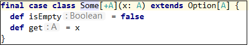
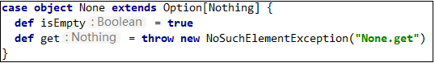
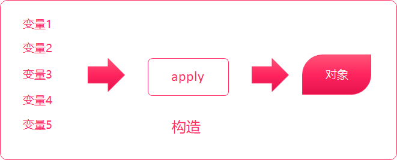
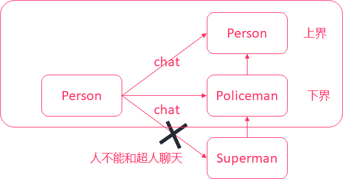
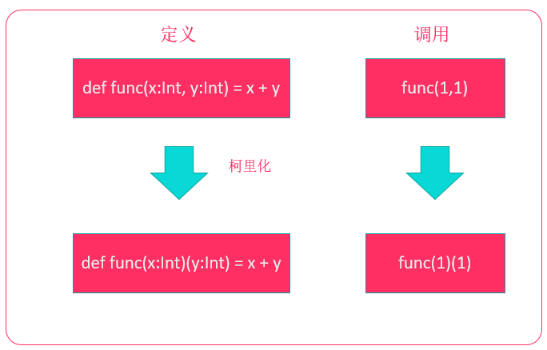
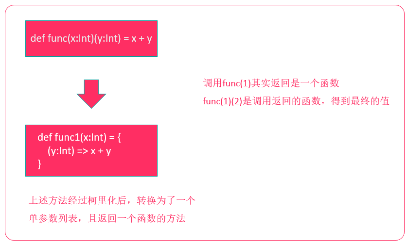

# scala高级用法


**课程目标**

* 掌握样例类、模式匹配、偏函数、正则表达式的使用
* 理解协变、逆变、非变和上下界
* 掌握Actor并发编程模型


## 样例类 - 重点掌握经常用

样例类是一种特殊类，它可以用来快速定义一个用于**保存数据**的类（类似于Java POJO类），而且它会自动生成apply方法，允许我们快速地创建样例类实例对象。后面，在并发编程和spark、flink这些框架也都会经常使用它。


### 定义样例类

---

语法结构：

```scala
case class 样例类名(成员变量名1:类型1, 成员变量名2:类型2, 成员变量名3:类型3)[{类体}]
```


示例1：

```scala
// 定义一个样例类
// 样例类有两个成员name、age
case class CasePerson(name:String, age:Int)

// 使用var指定成员变量是可变的
case class CaseStudent(var name:String, var age:Int)

object CaseClassDemo {
  def main(args: Array[String]): Unit = {
    // 1. 使用new创建实例
    val zhagnsan = new CasePerson("张三", 20)
    println(zhagnsan)

    // 2. 使用类名直接创建实例
    val lisi = CasePerson("李四", 21)
    println(lisi)

    // 3. 样例类默认的成员变量都是val的，除非手动指定变量为var类型
    //lisi.age = 22  // 编译错误！age默认为val类型

    val xiaohong = CaseStudent("小红", 23)
    xiaohong.age = 24
    println(xiaohong)
  }
}
```


### 样例类方法

---

**toString方法**

toString返回：样例类名称(成员变量1, 成员变量2, 成员变量3....)

```scala
case class CasePerson(name:String, age:Int)

object CaseClassDemo {
  def main(args: Array[String]): Unit = {
    val lisi = CasePerson("李四", 21)
    println(lisi.toString)
    // 输出：CasePerson(李四,21)
  }
}
```


**equals方法**

样例类自动实现了equals方法，可以直接使用==比较两个样例类是否相等，即所有的成员变量是否相等

```scala
val lisi1 = CasePerson("李四", 21)
val lisi2 = CasePerson("李四", 21)
println(lisi1 == lisi2)
// 输出：true
```


**hashCode方法**

样例类自动实现了hashCode方法，如果所有成员变量的值相同，则hash值相同，只要有一个不一样，则hash值不一样。

```scala
val lisi1 = CasePerson("李四", 21)
val lisi2 = CasePerson("李四", 22)

println(lisi1.hashCode())
println(lisi2.hashCode())
```


**copy方法**

样例类实现了copy方法，可以快速创建一个相同的实例对象，可以使用带名参数指定给成员进行重新赋值。

```scala
val lisi1 = CasePerson("李四", 21)

val wangwu = lisi1.copy(name="王五")
println(wangwu)
```


### 样例对象

---

使用case object可以创建样例对象。样例对象是单例的，而且它**没有主构造器**。样例对象是可序列化的。格式：

```scala
case object 样例对象名
```

它主要用在两个地方：

1. 定义枚举
2. 作为没有任何参数的消息传递（后面Akka编程会讲到）


示例：定义枚举

```scala
trait Sex /*定义一个性别特质*/
case object Male extends Sex		// 定义一个样例对象并实现了Sex特质
case object Female extends Sex		

case class Person(name:String, sex:Sex)

object CaseClassDemo {
  def main(args: Array[String]): Unit = {
    val zhangsan = Person("张三", Male)

    println(zhangsan)
  }
}
```


示例：定义消息

```scala
case class StartSpeakingMessage(textToSpeak: String)
// 消息如果没有任何参数，就可以定义为样例对象
case object StopSpeakingMessage
case object PauseSpeakingMessage
case object ResumeSpeakingMessage
```


> 1. 样例类可以使用**类名(参数1, 参数2...)**快速创建实例对象
> 2. 定义样例类成员变量时，可以指定var类型，表示可变。默认是不可变的
> 3. 样例类自动生成了toString、equals、hashCode、copy方法
> 4. 样例对象没有主构造器，可以使用样例对象来创建枚举、或者标识一类没有任何数据的消息


## 模式匹配 - 理解

scala中有一个非常强大的模式匹配机制，可以应用在很多场景：

* switch语句
* 类型查询
* 以及快速获取数据


### 简单匹配 match case

---

在Java中，有switch关键字，可以简化if条件判断语句。在scala中，可以使用match表达式替代。

语法结构：

```scala
变量 match {
    case "常量1" => 表达式1
    case "常量2" => 表达式2
    case "常量3" => 表达式3
    case _ => 表达式4		// 默认匹配
}
```


示例1：

```scala
println("请输出一个词：")
// StdIn.readLine表示从控制台读取一行文本
val name = StdIn.readLine()

val result = name match {
    case "hadoop" => s"$name：大数据分布式存储和计算框架"
    case "zookeeper" => s"$name：大数据分布式协调服务框架"
    case "spark" => s"$name：大数据分布式内存计算框架..."
    case _ => s"未匹配到$name"
}

println(result)
```


> match表达式是有返回值的，可以将match表达式对其他的变量进行赋值


### 守卫  match case  if

---

在Java中，只能简单地添加多个case标签，例如：要匹配0-7，就需要写出来8个case语句。例如：

**[java]()** 代码

```java
int a = 0;
switch(a) {
    case 0: a += 1;
    case 1: a += 1;
    case 2: a += 1;
    case 3: a += 1;
    case 4: a += 2;
    case 5: a += 2;
    case 6: a += 2;
    case 7: a += 2;
    default: a = 0;
}
```

在scala中，可以使用守卫来简化上述代码——也就是在**case语句中添加if条件判断**。

示例：

```scala
println("请输入一个数字:")
var a = StdIn.readInt()

a match {
    case a1 if a >= 0 && a <= 3 => a += 1
    case a2 if a > 3 && a < 8 => a += 2
    case _ => a = 0
}

println(a)
```


### 匹配类型

---

match表达式还可以进行类型匹配。

语法格式如下：

```scala
变量 match {
    case 类型1变量名: 类型1 => 表达式1
    case 类型2变量名: 类型2 => 表达式2
    case 类型3变量名: 类型3 => 表达式3
    ...
    case _ => 表达式4
}
```


示例：

```scala
    // stripMargin表示删除前面的竖线，这样看起来会显得比较整齐
    val prompt =
      """
        |0：字符串类型
        |1：整形
        |2：浮点型
        |3：Person对象类型
        |
        |请选择:
      """.stripMargin
    
    println(prompt)

    val select = StdIn.readInt()

    val selectedValue = select match {
      case 0 => "hello"
      case 1 => 1
      case 2 => 2.0
      case _ => new Person("张三")
    }


    selectedValue match {
      case x: Int => println("Int " + x)
      case y: Double => println("Double " + y)
      case z: String => println("String " + z)
      case _ => throw new Exception("not match exception")
    }
```


### 匹配集合

---

**匹配数组**

示例：

```scala
val arr = Array(1, 3, 5)
arr match {
    case Array(1, x, y) => println(x + " " + y)
    case Array(0) => println("only 0")
    case Array(0, _*) => println("0 ...")
    case _ => println("something else")
}
```

_:表示内容任意

*：表示数量任意

**匹配列表**

示例：

```scala
val lst = List(3, -1)
lst match {
    case 0 :: Nil => println("only 0")
    case x :: y :: Nil => println(s"x: $x y: $y")
    case 0 :: tail => println("0 ...")
    case _ => println("something else")
}
```


**匹配元组**

示例：

```scala
val tup = (1, 3, 7)
tup match {
    case (1, x, y) => println(s"1, $x , $y")
    case (_, z, 5) => println(z)
    case  _ => println("else")
}
```


### 变量声明中的模式匹配

---

在定义变量的时候，可以使用模式匹配快速获取数据。


示例：获取数组中的元素

```scala
val arr = Range(0, 10).toArray

arr.foreach(println(_))

// 使用模式匹配，获取第二个、第三个、第四个元素的值
val Array(_, x, y, z, _*) = arr

println(s"x=$x, y=$y, z=$z, ")
```


示例：获取List中的数据

```scala
val list = Range(0, 10).toList

// 匹配列表的第一个、第二个元素的值
val x::y::tail = list

println(s"x=$x, y=$y")
```


### 匹配样例类 - 常用

---

scala可以使用模式匹配来匹配样例类，从而可以快速获取样例类中的成员数据。后续，我们在开发Akka案例时，还会用到。


示例：

```scala
// 定义样例类
case class SubmitTask(id: String, name: String)
case class HeartBeat(time: Long)
case object CheckTimeOutTask

val msg1 = SubmitTask("001", "task-001")
val msg2 = HeartBeat(1000)
val msg3 = CheckTimeOutTask

val list = List(msg1, msg2, msg3)

list(2) match {
    case SubmitTask(id, name) => println(s"id=$id, name=$name")
    case HeartBeat(time) => println(s"time=$time")
    case CheckTimeOutTask => println("检查超时")
}
```


示例：可以使用@符号分隔case语句，用来获取用于匹配的整个示例对象

```scala
list(0) match {
    // obj表示获取用于匹配的样例对象，而id,name表示获取样例中的元素
    case  obj @ SubmitTask(id, name) => println(s"id=$id, name=$name");println(s"样例类:$obj")
    case HeartBeat(time) => println(s"time=$time")
    case CheckTimeOutTask => println("检查超时")
}
```


## Option类型 - 重点掌握经常用

scala中，Option类型来表示可选值。这种类型的数据有两种形式：

* Some(x)：表示实际的值

  

* None：表示没有值

  

使用Option类型，可以用来有效避免空引用(null)异常。也就是说，将来我们返回某些数据时，可以返回一个Option类型来替代。


示例：

```scala
  /**
    * 定义除法操作
    * @param a 参数1
    * @param b 参数2
    * @return Option包装Double类型
    */
  def dvi(a:Double, b:Double):Option[Double] = {
    if(b != 0) {
      Some(a / b)
    }
    else {
      None
    }
  }

  def main(args: Array[String]): Unit = {
    val result1 = dvi(1.0, 5)

    result1 match {
      case Some(x) => println(x)
      case None => println("除零异常")
    }
  }
```


**getOrElse方法**

使用getOrElse方法，当Option对应的实例是None时，可以指定一个默认值，从而避免空指针异常


示例：

```scala
val result1 = dvi(1.0, 1)

println(result1.getOrElse("除零错误"))
```


> 1. scala鼓励使用Option类型来封装数据，可以有效减少，在代码中判断某个值是否为null
> 2. 可以使用getOrElse方法来针对None返回一个默认值


## 偏函数 - 理解

被包在花括号内没有match的一组case语句是一个偏函数，它是PartialFunction[A, B]的一个实例，A代表输入参数类型，B代表返回结果类型。可以理解为：偏函数是一个参数和一个返回值的函数。


示例：

```scala
// func1是一个输入参数为Int类型，返回值为String类型的偏函数
val func1: PartialFunction[Int, String] = {
    case 1 => "一"
    case 2 => "二"
    case 3 => "三"
    case _ => "其他"
}

println(func1(2))
```


示例：获取List中能够整除2的数字

```scala
val list = List(1,2,3,4,5,6,7)

val list2 = list.filter{
    case x if x % 2 == 0 => true
    case _ => false
}
println(list2)
```


## 正则表达式 - 了解

在scala中，可以很方便地使用正则表达式来匹配数据。

scala中提供了Regex类来定义正则表达式，要构造一个RegEx对象，直接使用String类的r方法即可。

建议使用三个双引号来表示正则表达式，不然就得对正则中的反斜杠来进行转义。

```scala
val regEx = """正则表达式""".r
```


示例：检测是否匹配正则表达式

```scala
val emailRE = """.+@(.+)\..+""".r

val emailList = List("38123845@qq.com", "a1da88123f@gmail.com", "zhansan@163.com", "123afadff.com")

// 检查邮箱是否匹配正则
val size = emailRE.findAllMatchIn(emailList(0)).size
// 如果匹配size为1，否则size为0
println(size)

```


示例：找出列表中的所有不合法的邮箱

```scala
// 找出列表中不合法的邮箱格式
println("不合法的邮箱为：")
emailList.filter{
    eml => emailRE.findAllIn(eml).size < 1
}.foreach {
    println(_)
}

println("------")
```


示例：使用正则表达式进行模式匹配，获取正则中匹配的分组

```scala
// 找到所有邮箱运营公司
println("邮箱的运营公司为")
emailList.foreach {
    case email @ emailRE(company) => println(s"$email => ${company}")
    case _ => println("未知")
}
```


## 异常处理 - 了解

来看看下面一段代码。

```scala
  def main(args: Array[String]): Unit = {
   val i = 10 / 0
    
    println("你好！")
  }

Exception in thread "main" java.lang.ArithmeticException: / by zero
	at ForDemo$.main(ForDemo.scala:3)
	at ForDemo.main(ForDemo.scala)
```

执行程序，可以看到scala抛出了异常，而且没有打印出来"你好"。说明程序出现错误后就终止了。

那怎么解决该问题呢？


### 捕获异常

------

在scala中，可以使用异常处理来解决这个问题。以下为scala中try...catch异常处理的语法格式：

```scala
try {
    // 代码
}
catch {
    case ex:异常类型1 => // 代码
    case ex:异常类型2 => // 代码
}
finally {
    // 代码
}
```

- try中的代码是我们编写的业务处理代码
- 在catch中表示当出现某个异常时，需要执行的代码
- 在finally中，是不管是否出现异常都会执行的代码


示例：

```scala
try {
    val i = 10 / 0

    println("你好！")
} catch {
    case ex: Exception => println(ex.getMessage)
} finally {
    println("我始终都会执行!")
}
```


### 抛出异常

------

我们也可以在一个方法中，抛出异常。语法格式和Java类似，使用throw new Exception...


示例：

```scala
  def main(args: Array[String]): Unit = {
    throw new Exception("这是一个异常")
  }

Exception in thread "main" java.lang.Exception: 这是一个异常
	at ForDemo$.main(ForDemo.scala:3)
	at ForDemo.main(ForDemo.scala)
```


我们可以看到，scala不需要再main方法上声明要抛出的异常，它已经解决了再Java中被认为是设计失败的检查型异常。下面是Java代码


```java
    public static void main(String[] args) throws Exception {
        throw new Exception("这是一个异常");
    }

```


scala异常处理语法要比Java简洁、易用。


> 1. scala中也是使用try...catch...finally处理异常
>
> 2. 所有异常处理都是在catch语句中，每一个异常处理写成
>
>    ```scala
>    case ex1:异常类型1 => 异常处理代码
>    case ex2:异常类型1 => 异常处理代码
>    case ex3:异常类型1 => 异常处理代码
>    ```
>
> 3. 抛出异常使用throw
>
> 4. scala中方法抛出异常不需要像Java一样编写异常声明


## 提取器(Extractor) - 了解 - 很少用


我们之前已经使用过scala中非常强大的模式匹配功能了，通过模式匹配，我们可以快速匹配样例类中的成员变量。例如：

```scala
// 定义样例类
case class SubmitTask(id: String, name: String)
case class HeartBeat(time: Long)
case object CheckTimeOutTask

val msg1 = SubmitTask("001", "task-001")
val msg2 = HeartBeat(1000)
val msg3 = CheckTimeOutTask

val list = List(msg1, msg2, msg3)

list(2) match {
    // 可以使用模式匹配快速匹配到到SubmitTask样例类中的id和name
    case SubmitTask(id, name) => println(s"id=$id, name=$name")
    case HeartBeat(time) => println(s"time=$time")
    case CheckTimeOutTask => println("检查超时")
}
```

那是不是所有的类都可以进行这样的模式匹配呢？答案是`不可以`的。要支持模式匹配，必须要实现一个**提取器**。


### 定义提取器

---

之前我们学习过了，实现一个类的伴生对象中的apply方法，可以用类名来快速构建一个对象。伴生对象中，还有一个unapply方法。与apply相反，unapply是将该类的对象，拆解为一个个的元素。





要实现一个类的提取器，只需要在该类的伴生对象中实现一个unapply方法即可。


示例：实现一个类的解构器，并使用match表达式进行模式匹配，提取类中的字段。

```scala
class Student {
  var name:String = _   // 姓名
  var age:Int = _       // 年龄
  
  // 实现一个辅助构造器
  def this(name:String, age:Int) = {
    this()
    
    this.name = name
    this.age = age
  }
}

object Student {
  def apply(name:String, age:Int): Student = new Student(name, age)

  // 实现一个解构器
  def unapply(arg: Student): Option[(String, Int)] = Some((arg.name, arg.age))
}

object extractor_DEMO {
  def main(args: Array[String]): Unit = {
    val zhangsan = Student("张三", 20)

    zhangsan match {
      case Student(name, age) => println(s"姓名：$name 年龄：$age")
      case _ => println("未匹配")
    }
  }
}
```


> 样例类自动实现了apply、unapply方法（可以使用scalap反编译一个样例类的字节码）


## 泛型 - 理解 - 经常看源码要懂

scala和Java一样，类和特质、方法都可以支持泛型。我们在学习集合的时候，一般都会涉及到泛型。

```scala
scala> val list1:List[String] = List("1", "2", "3")
list1: List[String] = List(1, 2, 3)

scala> val list1:List[String] = List("1", "2", "3")
list1: List[String] = List(1, 2, 3)
```

在scala中，使用方括号来定义类型参数。


### 定义一个泛型方法

---

需求：用一个方法来获取任意类型数组的中间的元素


1. 不考虑泛型直接实现（基于Array[Int]实现）
2. 加入泛型支持


不考虑泛型的实现

```scala
  def getMiddle(arr:Array[Int]) = arr(arr.length / 2)

  def main(args: Array[String]): Unit = {
    val arr1 = Array(1,2,3,4,5)

    println(getMiddle(arr1))
  }
```


加入泛型支持

```scala
  def getMiddle[A](arr:Array[A]) = arr(arr.length / 2)

  def main(args: Array[String]): Unit = {
    val arr1 = Array(1,2,3,4,5)
    val arr2 = Array("a", "b", "c", "d", "f")

    println(getMiddle[Int](arr1))
    println(getMiddle[String](arr2))

    // 简写方式
    println(getMiddle(arr1))
    println(getMiddle(arr2))
  }
```


### 定义一个泛型类

---

我们接下来要实现一个Pair类（一对数据）来讲解scala泛型相关的知识点。

Pair类包含两个值，而且两个值的类型不固定。


```scala
// 类名后面的方括号，就表示这个类可以使用两个类型、分别是T和S
// 这个名字可以任意取
class Pair[T, S](val first: T, val second: S) 

case class Person(var name:String, val age:Int)

object Pair {
  def main(args: Array[String]): Unit = {
    val p1 = new Pair[String, Int]("张三", 10)
    val p2 = new Pair[String, String]("张三", "1988-02-19")
    val p3 = new Pair[Person, Person](Person("张三", 20), Person("李四", 30))
  }
}
```


> 1. 要定义一个泛型类，直接在类名后面加上方括号，指定要使用的类型参数。上述的T、S都是类型参数，就代表一个类型
> 2. 指定了类对应的类型参数后，就可以使用这些类型参数来定义变量了


### 上下界 - 了解 用于阅读源码

---

现在，有一个需求，在Pair类中，我们只想用来保存Person类型的对象，因为我们要添加一个方法，让好友之间能够聊天。例如：

```scala
def chat(msg:String) = println(s"${first.name}对${second.name}说: $msg")
```

但因为，Pair类中根本不知道first有name这个字段，上述代码会报编译错误。

而且，添加了这个方法，就表示Pair类，现在只能支持Person类或者Person的子类的泛型。所以，我们需要给Pair的泛型参数，添加一个上界。


使用`<: 类型名`表示给类型添加一个**上界**，表示泛型参数必须要从上界继承。

```scala
// 类名后面的方括号，就表示这个类可以使用两个类型、分别是T和S
// 这个名字可以任意取
class Pair[T <: Person, S <:Person](val first: T, val second: S) {
  def chat(msg:String) = println(s"${first.name}对${second.name}说: $msg")
}

class Person(var name:String, val age:Int)

object Pair {
  def main(args: Array[String]): Unit = {

    val p3 = new Pair(new Person("张三", 20), new Person("李四", 30))
    p3.chat("你好啊！")
  }
}
```


接着再提一个需求，Person类有几个子类，分别是Policeman、Superman。





要控制Person只能和Person、Policeman聊天，但是不能和Superman聊天。此时，还需要给泛型添加一个下界。

```scala
// 类名后面的方括号，就表示这个类可以使用两个类型、分别是T和S
// 这个名字可以任意取
class Pair[T <: Person, S >: Policeman <:Person](val first: T, val second: S) {
  def chat(msg:String) = println(s"${first.name}对${second.name}说: $msg")
}

class Person(var name:String, val age:Int)
class Policeman(name:String, age:Int) extends Person(name, age)
class Superman(name:String) extends Policeman(name, -1)

object Pair {
  def main(args: Array[String]): Unit = {
	// 编译错误：第二个参数必须是Person的子类（包括本身）、Policeman的父类（包括本身）
    val p3 = new Pair(new Person("张三", 20), new Superman("李四"))
    p3.chat("你好啊！")
  }
}
```


> U >: T	表示U必须是类型T的父类或本身
>
> S <: T	表示S必须是类型T的子类或本身


### 协变、逆变、非变 - 了解 用于阅读源码

---

来一个类型转换的问题：

```scala
class Pair[T]

object Pair {
  def main(args: Array[String]): Unit = {
    val p1 = Pair("hello")
    // 编译报错，无法将p1转换为p2
    val p2:Pair[AnyRef] = p1

    println(p2)
  }
}
```


**非变**

class Pair[T]{}，这种情况就是非变（默认），类型B是A的子类型，Pair[A]和Pair[B]没有任何从属关系，这种情况和Java是一样的。


**协变**

class Pair[+T]，这种情况是协变。类型B是A的子类型，Pair[B]可以认为是Pair[A]的子类型。这种情况，参数化类型的方向和类型的方向是一致的。


**逆变**

class Pair[-T]，这种情况是逆变。类型B是A的子类型，Pair[A]反过来可以认为是Pair[B]的子类型。这种情况，参数化类型的方向和类型的方向是相反的。


示例：

```scala
class Super
class Sub extends Super

//非变
class Temp1[A](title: String)
//协变
class Temp2[+A](title: String)
//逆变
class Temp3[-A](title: String)

object Covariance_demo {
  def main(args: Array[String]): Unit = {
    val a = new Sub()
    // 没有问题，Sub是Super的子类
    val b:Super = a

    // 非变
    val t1:Temp1[Sub] = new Temp1[Sub]("测试")
    // 报错！默认不允许转换
    // val t2:Temp1[Super] = t1

    // 协变
    val t3:Temp2[Sub] = new Temp2[Sub]("测试")
    val t4:Temp2[Super] = t3
    
    // 非变
    val t5:Temp3[Super] = new Temp3[Super]("测试")
    val t6:Temp3[Sub] = t5
  }
}
```


## 高阶函数用法

Scala 混合了面向对象和函数式的特性，在函数式编程语言中，函数是“头等公民”，它和Int、String、Class等其他类型处于同等的地位，可以像其他任何数据类型一样被传递和操作。


高阶函数包含：作为值的函数、匿名函数、闭包、柯里化等等。


### 作为值的函数

---

在scala中，函数就像和数字、字符串一样，可以将函数传递给一个方法。我们可以对算法进行封装，然后将具体的动作传递给算法，这种特性很有用。


我们之前学习过List的map方法，它就可以接收一个函数，完成List的转换。


示例：将一个小数列表中的每个元素转换为对应个数的小星星

List(1, 2, 3...) => *, *\*, *\* 

代码：

```scala
val list = List(1, 2, 3, 4)

// 字符串*方法，表示生成指定数量的字符串
val func_num2star = (num:Int) => "*" * num

print(list.map(func_num2star))
```


### 匿名函数

---

上面的代码，给(num:Int) => "*" * num函数赋值给了一个变量，但是这种写法有一些啰嗦。在scala中，可以不需要给函数赋值给变量，没有赋值给变量的函数就是**匿名函数**


示例：优化上述代码

```scala
val list = List(1, 2, 3, 4)

list.map(num => "*" * num).foreach(println)
// 因为此处num变量只使用了一次，而且只是进行简单的计算，所以可以省略参数列表，使用_替代参数
list.map("*" * _).foreach(println)
```


### 柯里化（多参数列表） - 了解

---

柯里化（Currying）允许方法接收多个参数列表的语法特性。

多数用于隐式转换或者在逻辑上划分不同批次的参数用。

> 特点：参数如果不传递完全，得到一个函数




**柯里化过程解析**




**使用柯里化，让传递匿名函数作为参数的语法更为简洁**


示例：编写一个泛型方法，用来完成两个值类型的计算（具体的计算封装到函数中）

```scala
object CurryingDemo2 {

  // 实现对两个数进行计算的方法
  def calc[A <: AnyVal](x:A, y:A, func_calc:(A, A)=>A) = {
    func_calc(x, y)
  }

  // 柯里化：实现对两个数进行计算
  def calc_carried[A <: AnyVal](x:A, y:A)(func_calc:(A, A)=>A) = {
    func_calc(x, y)
  }

  def main(args: Array[String]): Unit = {
    // 这种写法是不能被简化的，必须要写出函数的定义
    println(calc(10, 10, (x:Int, y:Int)=> x + y))
    println(calc(10.1, 10.2, (x:Double, y:Double)=> x*y))
    
    // 柯里化之后可以快乐地使用下划线了
    println(calc_carried(10, 10)(_ + _))
    println(calc_carried(10.1, 10.2)(_ * _))
    println(calc_carried(100.2, 10)(_ - _))
  }
}
```


### 闭包 - 了解

---

闭包其实就是一个函数，只不过这个函数的返回值依赖于声明在函数外部的变量。

可以简单认为，就是可以访问不在当前作用域范围的一个函数。

==可以不修改方法体，通过外部变量来控制方法返回结果==

示例：定义一个闭包

```scala
object ClosureDemo {

  def add(x:Int) = {
    val y = 10

    // add返回一个函数，该函数引用了add方法的一个局部变量
    val funcAdd = () => x + y
    funcAdd
  }

  def main(args: Array[String]): Unit = {

    // 调用add方法时，任然可以引用到y的值
    // funcAdd函数就是一个闭包
    println(add(10)())
  }
}
```


==上面的演示只是使用一个普通的int值来做的闭包。 如果依赖的外部变量是一个函数呢？==


> 那就是，无需修改方法体， 修改外部函数就能修改计算逻辑。


## 隐式转换和隐式参数 - 了解 - 后续经常用但自己不会主动定义

隐式转换和隐式参数是scala非常有特色的功能，也是Java等其他编程语言没有的功能。我们可以很方便地利用隐式转换来丰富现有类的功能。


### 隐式转换

---

来看一个案例，

```scala
object SuperIntDemo {
  def main(args: Array[String]): Unit = {
    val a:Int = 1
	// 使用中缀调用to方法
    println(a to 10)
  }
}
```

通过查看Int的源代码，你会惊奇地发现，Int类型根本没有to方法。这难道是让人怀疑人生的大bug吗？

——这其实就是隐式转换的强大之处。它在背后偷偷摸摸地帮我们了某种类型转换。


所谓**隐式转换**，是指以implicit关键字声明的带有**单个参数**的方法。它是**自动被调用**的，自动将某种类型转换为另外一种类型。


> 隐式转换的使用步骤：
>
> 1. 在object中定义隐式转换方法（使用implicit）
> 2. 在需要用到隐式转换的地方，引入隐式转换（使用import）
> 3. 自动调用隐式转化后的方法


示例：使用隐式转换，让File具备有reada

```scala
class RichFile(val f:File) {
  // 将文件中内容读取成字符串
  def read() = Source.fromFile(f).mkString
}

object MyPredef {
  // 定义隐式转换方法
  implicit def file2RichFile(f:File) = new RichFile(f)
}

object ImplicitConvertDemo {

  def main(args: Array[String]): Unit = {
    val f = new File("./data/textfiles/1.txt")
    
    // 导入隐式准换
    import MyPredef.file2RichFile
    // 调用的其实是RichFile的read方法
    println(f.read())
  }
}
```


### 自动导入隐式转换方法

---

前面，我们手动使用了import来导入隐式转换。是否可以不手动import呢？

在scala中，如果在当前作用域中有隐式转换方法，会自动导入隐式转换。


示例：将隐式转换方法定义在main所在的object中

```scala
class RichFile(val f:File) {
  // 将文件中内容读取成字符串
  def read() = Source.fromFile(f).mkString
}

object ImplicitConvertDemo {
  // 定义隐式转换方法
  implicit def file2RichFile(f:File) = new RichFile(f)

  def main(args: Array[String]): Unit = {
    val f = new File("./data/textfiles/1.txt")

    // 调用的其实是RichFile的read方法
    println(f.read())
  }
}
```


### 隐式转换的时机

---

什么时候会自动执行隐式转换呢？


1. 当对象调用中不存在的方法时，编译器会自动将对象进行隐式转换
2. 当方法中的参数类型与目标类型不一致时


示例：

```scala
object ImplicitConvertDemo {
  // 定义隐式转换方法
  implicit def file2RichFile(f:File) = new RichFile(f)

  def main(args: Array[String]): Unit = {
    val f = new File("./data/textfiles/1.txt")

    // test1接收的参数类型为Rich，此时也自动进行了隐式转换
    test1(f)
  }

  def test1(r:RichFile) = println(r.read())
}
```


### 隐式参数

---

函数或方法可以带有一个标记为implicit的参数列表。这种情况，编译器会查找缺省值，提供给该方法。


定义隐式参数：

1. 在方法后面添加一个参数列表，参数使用implicit修饰
2. 在object中定义implicit修饰的隐式值
3. 调用方法，可以不传入implicit修饰的参数列表，编译器会自动查找缺省值


示例：

```scala
// 定义一个分隔符类
case class Delimiters(left:String, right:String)

object MyPredef1 {
  implicit val quoteDelimiters = Delimiters("<<<", ">>>")
}

object ImplicitParamDemo {

  // 使用分隔符将想要引用的字符串括起来
  def quote(what:String)(implicit delims:Delimiters) = delims.left + what + delims.right

  def main(args: Array[String]): Unit = {
    println(quote("hello, world")(Delimiters("<<", ">>")))

    // 手动导入
    import MyPredef1._
    println(quote("hello, world"))
  }
}
```


> 1. 和隐式转换一样，可以使用import手动导入隐式参数
>
> 2. 如果在当前作用域定义了隐式值，会自动进行导入

