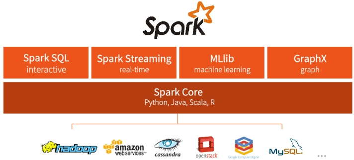
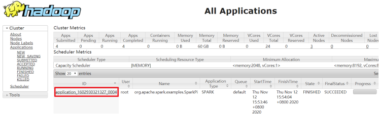

[TOC]


# 1- Spark 框架概述

## 1-1 Spark 是什么

- 定义：分布式内存迭代计算框架

  ``` properties
  Apache Spark是用于大规模数据（large-scala data）处理的统一（unified）分析引擎。
  分布式内存迭代计算框架
  ```

  


- 官方网址：
  - http://spark.apache.org/
  - https://databricks.com/spark/about

 

- 官方定义：

 

​		Spark 最早源于一篇论文 Resilient Distributed Datasets: A Fault-Tolerant Abstraction for In-Memory Cluster Computing，该论文是由加州大学柏克莱分校的 Matei Zaharia 等人发表的。<span style="color:red;background:white;font-size:20px;font-family:楷体;">**论文中提出了一种弹性分布式数据集（即 RDD）的概念**</span>，原文开头对其的解释是：


​		翻译过来就是：<span style="color:red;background:white;font-size:20px;font-family:楷体;">**RDD 是一种分布式内存抽象，其使得程序员能够在大规模集群中做内存运算，并且有一定的容错方式**</span>。而这也是整个 Spark 的核心数据结构，Spark 整个平
台都围绕着RDD进行。

 

## 1-2 Spark 四大特点

​		Spark 使用Scala语言进行实现，<span style="color:red;background:white;font-size:20px;font-family:楷体;">**它是一种面向对象、函数式编程语言，**</span>能够像操作本地集合一样轻松的操作分布式数据集。<span style="color:red;background:white;font-size:20px;font-family:楷体;">**Spark具有运行速度快、易用性好、通用性强和随处运行等特点**</span>。


### 1-2-1 速度快

​		由于Apache Spark支持内存计算，并且通过**DAG（有向无环图）**执行引擎支持无环数据流，所以官方宣称其在内存中的运算速度要比Hadoop的MapReduce快100倍，在硬盘中要快10倍。

 

  Spark处理数据与MapReduce处理数据相比，有如下两个不同点：

- 其一、Spark处理数据时，可以将中间处理结果数据存储到内存中；

  

- 其二、Spark Job调度以DAG方式，并且每个任务Task执行以**<font color='red'>线程</font>**（Thread）方式，并不是像MapReduce以<font color='red'>**进程**</font>（Process）方式执行。

  

  2014 年的如此Benchmark测试中，Spark 秒杀Hadoop，在使用十分之一计算资源的情况下，相同数据的排序上，Spark 比Map Reduce快3倍！

  


### 1-2-2 易于使用

​		Spark 的版本已经更新到 **Spark 2.4.5**（截止日期2020.05.01），支持了包括 Java、Scala、Python 、R和SQL语言在内的多种语言。


### 1-2-3 通用性强

​		在 Spark 的基础上，Spark 还提供了包括**Spark SQL、Spark Streaming、MLib 及GraphX**在内的多个工具库，我们可以在一个应用中无缝地使用这些工具库。其中，Spark SQL 提供了结构化的数据处理方式，Spark Streaming 主要针对流式处理任务（也是本书的重点），MLlib提供了很多有用的机器学习算法库，GraphX提供图形和图形并行化计算。


### 1-2-4 多种运行方式

​		Spark 支持多种运行方式，包括在 Hadoop 和 Mesos 上，也支持 Standalone的独立运行模式，同时也可以运行在云Kubernetes（Spark 2.3开始支持）上。

 

对于数据源而言，Spark 支持从HDFS、HBase、Cassandra 及 Kafka 等多种途径获取数据。

 


## 1-3 Spark 框架模块-了解

​		整个Spark 框架模块包含：**Spark Coke、 Spark SQL、 Spark Streaming、 Spark GraphX、 Spark MLlib **，而后四项的能力都是建立在核心引擎之上 。

 


### 1-3-1 Spark Core

实现了 Spark 的基本功能，包含RDD、任务调度、内存管理、错误恢复、与存储系统交互等模块。<span style="color:red;background:white;font-size:20px;font-family:楷体;">**数据结构：RDD**</span>

 

### 1-3-2 Spark SQL

​		Spark 用来操作**结构化数据**的程序包。通过 Spark SQL，我们可以使用 SQL操作数据。<span style="color:red;background:white;font-size:20px;font-family:楷体;">**数据结构：Dataset/DataFrame = RDD + Schema**</span>

 


- 官网：http://spark.apache.org/sql/


### 1-3-3 Spark Streaming

​		Spark 提供的对**实时数据**进行**流式计算**的组件。提供了用来操作数据流的 API。 <span style="color:red;background:white;font-size:20px;font-family:楷体;">**数据结构：DStream = Seq[RDD]**</span>

 

-  官网：http://spark.apache.org/streaming/


### 1-3-4 Spark MLlib 机器学习

​		提供常见的机器学习(ML)功能的程序库。包括分类、回归、聚类、协同过滤等，还提供了模型评估、数据导入等额外的支持功能。 <span style="color:red;background:white;font-size:20px;font-family:楷体;">**数据结构：RDD或者DataFrame**</span>

 

- 官网：http://spark.apache.org/mllib/


### 1-3-5 Spark GraphX 图计算的API

Spark中用于图计算的API，性能良好，拥有丰富的功能和运算符，能在海量数据上自如地运行复杂的图算法。<span style="color:red;background:white;font-size:20px;font-family:楷体;">**数据结构：RDD或者DataFrame**</span>

 

- 官网：http://spark.apache.org/graphx/

​		在Full Stack 理想的指引下，Spark 中的Spark SQL 、SparkStreaming 、MLLib 、GraphX 几大子框架和库之间可以无缝地共享数据和操作，这不仅打造了Spark 在当今大数据计算领域其他计算框架都无可匹敌的优势，而且使得Spark 正在加速成为大数据处理中心首选通用计算平台。


### 1-3-6 Structured Streaming

​		Structured Streaming**结构化流处理模块**针对，流式结构化数据封装到DataFrame中进行分析。

 

​		<span style="color:blue;background:white;font-size:20px;font-family:楷体;">**Structured Streaming是建立在SparkSQL引擎之上的可伸缩和高容错的流式处理引擎，可以像操作静态数据的批量计算一样来执行流式计算**</span>。当流式数据不断的到达的过程中Spark SQL的引擎会连续不断的执行计算并更新最终结果。简而言之，<span style="color:red;background:white;font-size:20px;font-family:楷体;">**Structured Streaming提供了快速、可伸缩、可容错、端到端精确的流处理**</span>。


- 官网：http://spark.apache.org/docs/2.4.5/structured-streaming-programming-guide.html


## 1-4 Spark 运行模式

- Spark 框架编写的应用程序可以运行在
  - **本地模式（Local Mode）** 
  - **集群模式（Cluster Mode）**
  - **云服务（Cloud）**方便开发测试和生产部署。


### 1-4-1 本地模式：Local Mode

将Spark 应用程序中任务<span style="color:red;background:white;font-size:20px;font-family:楷体;">**Task运行在一个本地JVM Process进程**</span>中，通常开发测试使用。


### 1-4-2 集群模式：Cluster Mode

​		将Spark应用程序运行在集群上，比如Hadoop YARN集群，Spark 自身集群Standalone及Apache Mesos集群，网址：[http://spark.apache.org/docs/2.4.3/](http://spark.apache.org/docs/latest/)

​		


- **Spark Standalone集群模式**（<span style="color:red;background:white;font-size:20px;font-family:楷体;">**开发测试及生成环境使用**</span>）：类似Hadoop YARN架构，典型的Mater/Slaves模式，使用Zookeeper搭建高可用，避免Master是有单点故障的。

  

- **Hadoop YARN集群模式**（<span style="color:red;background:white;font-size:20px;font-family:楷体;">**生产环境使用**</span>）：运行在 yarn 集群之上，由 yarn 负责资源管理，Spark 负责任务调度和计算，好处：计算资源按需伸缩，集群利用率高，共享底层存储，避免数据跨集群迁移。

  

- **Apache Mesos集群模式**（<span style="color:red;background:white;font-size:20px;font-family:楷体;">**国内使用较少**</span>）：运行在 mesos 资源管理器框架之上，由 mesos 负责资源管理，Spark 负责任务调度和计算。


### 1-4-3 云服务：Kubernetes 模式

- 中小公司未来会更多的使用云服务，Spark 2.3开始支持将Spark 开发应用运行到K8s上。

- AWS 阿里云 等等云平台都提供了 EMR产品（弹性MapReduce计算）

 


# 2- 环境搭建-Local

Spark中有2类角色，一个是Master类似Namenode做管理

一个是Worker类似DataNode是干活的。

 

<span style="color:red;background:white;font-size:20px;font-family:楷体;">**Local模式就是，以一个JVM进程，去模拟整个Spark的运行环境，就是将Master和Worker角色以线程的形式运行在这个进程中。**</span>


## 2-1 安装包下载

目前Spark最新稳定版本：2.4.x系列，官方推荐使用的版本，也是目前企业中使用较多版本，网址：
https://github.com/apache/spark/releases
http://spark.apache.org/downloads.html
http://archive.apache.org/dist/spark/spark-2.4.5/


Spark 2.4.x依赖其他语言版本如下，其中既支持Scala 2.11，也支持Scala 2.12，推荐使用2.11。


## 2-2 Spark安装

将spark安装包【spark-2.4.5-bin-hadoop2.7.tgz】解压至【/export/server】目录：

``` shell
#解压软件包
tar -zxvf spark-2.4.5-bin-hadoop2.7.tgz

#创建软连接，方便后期升级
ln -s /export/server/spark-2.4.5-bin-hadoop2.7 /export/server/spark

#如果有权限问题，可以修改为root，方便学习时操作，实际中使用运维分配的用户和权限即可
chown -R root /export/server/spark-2.4.5-bin-hadoop2.7
chgrp -R root /export/server/spark-2.4.5-bin-hadoop2.7
```

其中各个目录含义如下：
<span style="color:red;background:white;font-size:20px;font-family:楷体;">**bin**</span>        可执行脚本
<span style="color:red;background:white;font-size:20px;font-family:楷体;">**conf**</span>       配置文件
data       示例程序使用数据
examples   示例程序
jars       依赖 jar 包
python     pythonAPI
<span style="color:red;background:white;font-size:20px;font-family:楷体;">**sbin**</span>       集群管理命令
yarn       整合yarn需要的东东


## 2-3 运行spark-shell

- 开箱即用

  ``` properties
  直接启动bin目录下的spark-shell: 
  进入Spark安装目录
  cd /export/server/spark
  ##直接使用spark-shell,默认使用local[*]
  bin/spark-shell
  
  ## 或
  
  bin/spark-shell --master local[2]
  ```

  

- spark-shell说明

  ``` properties
  1.直接使用./spark-shell 
  表示使用local 模式启动，在本机启动一个SparkSubmit进程
  
  2.还可指定参数 --master，如：
  spark-shell --master local[N] 表示在本地模拟N个线程来运行当前任务
  spark-shell --master local[*] 表示使用当前机器上所有可用的资源
  
  3.不携带参数默认就是
  spark-shell --master local[*]
  
  4.后续还可以使用--master指定集群地址，表示把任务提交到集群上运行，如
  ./spark-shell --master spark://node01:7077,node02:7077
  
  5.退出spark-shell
  使用 :quit
  ```

  

- 本地模式启动spark-shell：

  ​	运行成功以后，有如下提示信息：

  

其中

创建SparkContext实例对象：sc

SparkSession实例对象：spark

启动应用监控页面端口号：4040


## 2-4 初体验-读取本地文件

- 准备数据

``` properties
vim /root/words.txt
hello me you her 
hello you her
hello her 
hello 
```

- 执行WordCount

``` scala
val textFile = sc.textFile("file:///root/words.txt")
val counts = textFile.flatMap(_.split(" ")).map((_,1)).reduceByKey(_ + _)
counts.collect
```


## 2-5 初体验-读取HDFS文件

- 准备数据

  - 上传文件到hdfs

    hadoop fs -put /root/words.txt /wordcount/input/words.txt

  - 目录如果不存在可以创建

    hadoop fs -mkdir -p /wordcount/input

  - 结束后可以删除测试文件夹

    hadoop fs -rm -r /wordcount

- 执行WordCount

  ``` scala
  val textFile = sc.textFile("hdfs://node1:8020/wordcount/input/words.txt")
  val counts = textFile.flatMap(_.split(" ")).map((_,1)).reduceByKey(_ + _)
  counts.collect
  counts.saveAsTextFile("hdfs://node1:8020/wordcount/output")
  ```


- 查看文件内容

  ``` properties
  hadoop fs -text /wordcount/output/part*
  ```

  


## 2-6 监控页面

每个Spark Application应用运行时，启动WEB UI监控页面，默认端口号为4040，

可以使用浏览器打开页面，

http://node1:4040/jobs/


# 3- 环境搭建-Standalone

- Standalone模式是Spark自带的一种集群模式，不同于前面本地模式启动多个进程来模拟集群的环境，

- Standalone模式是真实地在多个机器之间搭建Spark集群的环境，完全可以利用该模式搭建多机器集群，用于实际的大数据处理。

  

## 3-1 概念

- StandAlone就是将Spark的角色，以独立的进程的形式运行在服务器上

- 2个角色：
  - master
  - worker

 

根据机器的分布，StandAlone也分为3个变种：

-  伪分布式（测试开发用）：将Master进程和Worker进程在一台机器内运行。

 

- 完全分布式（测试开发用）：将Master进程和Worker进程分开在不同的机器上运行，比如机器1运行Master进程，机器2机器3机器4运行Worker进程

 

- 高可用的完全分布式模式（企业生产环境有可能用）： 将Master进程和Worker进程分开在不同的机器上运行，同时，拥有多个Master做备份

 

 

 

 

## 3-2 Standalone 架构

- Standalone集群使用了分布式计算中的master-slave模型，master是集群中含有Master进程的节点，slave是集群中的Worker节点含有Executor进程。
- http://spark.apache.org/docs/latest/cluster-overview.html


Spark Standalone集群，类似Hadoop YARN，管理集群资源和调度资源：

- 主节点Master：

  - 管理整个集群资源，接收提交应用，分配资源给每个应用，运行Task任务

    

- 从节点Workers：

  - 管理每个机器的资源，分配对应的资源来运行Task；

  - 每个从节点分配资源信息给Worker管理，资源信息包含内存Memory和CPU Cores核数

    

- 历史服务器HistoryServer(可选)：

  - Spark Application运行完成以后，保存事件日志数据至HDFS，启动HistoryServer可以查看应用运行相关信息。


## 3-3 集群规划

- Standalone集群安装服务规划与资源配置：

``` properties
node01:master
node02:slave/worker  
node03:slave/worker 
```

- 官方文档：http://spark.apache.org/docs/2.4.5/spark-standalone.html


## 3-4 修改配置并分发

- 修改slaves

``` properties
进入配置目录
cd /export/server/spark/conf

修改配置文件名称
mv slaves.template slaves

vim slaves
内容如下：
node2
node3
```

- 修改spark-env.sh

``` properties
进入配置目录
cd /export/server/spark/conf
修改配置文件名称
mv spark-env.sh.template spark-env.sh
修改配置文件
vim spark-env.sh
增加如下内容：
```

``` shell
## 设置JAVA安装目录
JAVA_HOME=/export/server/jdk

## HADOOP软件配置文件目录，读取HDFS上文件和运行YARN集群
HADOOP_CONF_DIR=/export/server/hadoop/etc/hadoop
YARN_CONF_DIR=/export/server/hadoop/etc/hadoop

## 指定spark老大Master的IP和提交任务的通信端口
export SPARK_MASTER_HOST=node1
export SPARK_MASTER_PORT=7077

SPARK_MASTER_WEBUI_PORT=8080
SPARK_WORKER_CORES=1
SPARK_WORKER_MEMORY=1g
```


## 3-5 分发到其他机器

将配置好的将 Spark 安装包分发给集群中其它机器，命令如下：

``` shell
cd /export/server/
scp -r spark-2.4.5-bin-hadoop2.7 root@node2:$PWD
scp -r spark-2.4.5-bin-hadoop2.7 root@node3:$PWD
##创建软连接
ln -s /export/server/spark-2.4.5-bin-hadoop2.7 /export/server/spark
```


## 3-6 启动服务进程

- 集群启动和停止

``` properties
在主节点上启动spark集群
/export/server/spark/sbin/start-all.sh 
 
在主节点上停止spark集群
/export/server/spark/sbin/stop-all.sh
```


- 单独启动和停止

``` properties
在 master 安装节点上启动和停止 master：
start-master.sh
stop-master.sh

在 Master 所在节点上启动和停止worker(work指的是slaves 配置文件中的主机名)
start-slaves.sh
stop-slaves.sh
```

- WEB UI页面

``` properties
http://node1:8080/
```

- 总结

``` properties
	可以看出，配置了2个Worker进程实例，每个Worker实例为1核1GB内存，总共是2核 2GB 内存。目前显示的Worker资源都是空闲的，当向Spark集群提交应用之后，Spark就会分配相应的资源给程序使用，可以在该页面看到资源的使用情况。
```


## 3-7 测试

- 1- 使用spark-submit 

``` properties
bin/spark-submit --class org.apache.spark.examples.SparkPi --master spark://node1:7077 lib/spark-examples-1.0.0-hadoop2.2.0.jar
```


- 开始spark-shell

``` properties
/export/server/spark/bin/spark-shell --master spark://node1:7077
```

- 运行程序

``` scala
sc.textFile("hdfs://node1:8020/input/wordcount/a.txt")
.flatMap(_.split(" ")).map((_, 1)).reduceByKey(_ + _)
.saveAsTextFile("hdfs://node1:8020/output3333")
```

- 查看结果

``` properties
hadoop fs -text /wordcount/output2/part*
```

- 注意：

``` properties
集群模式下程序是在集群上运行的，不要直接读取本地文件，应该读取hdfs上的
因为程序运行在集群上，具体在哪个节点上我们运行并不知道，其他节点可能并没有那个数据文件
```

- SparkContext web UI

``` properties
http://node1:4040/jobs/
```


- 查看Master主节点WEB UI界面

  ``` properties
  http://node1:8080/
  ```

  


## 3-8 Spark 应用架构

### 3-8-1 Driver 和Executors

- 从图中可以看到Spark Application运行到集群上时，由两部分组成：

  - **Driver Program**

  - **Executors**

    

- 第一、Driver Program

  - 相当于AppMaster，**整个应用管理者，负责应用中所有Job的调度执行**;

  - 运行JVM Process，运行程序的MAIN函数，**必须创建SparkContext上下文对象**；

  - 一个SparkApplication仅有一个；

    

-  第二、Executors		

  - **相当于一个线程池**，运行JVM Process，其中有很多线程，每个线程运行一个Task任务，一个Task运行需要1 Core CPU，**所有可以认为Executor中线程数就等于CPU Core核数**；
  - 一个Spark Application可以有多个，可以设置个数和资源信息；


​		**Driver Program是用户编写的数据处理逻辑**，这个逻辑中包含用户**创建的SparkContext**。SparkContext 是**用户逻辑与Spark集群主要的交互接口**，**它会和Cluster Manager交互，包括向它申请计算资源等**。 **Cluster Manager负责集群的资源管理和调度**，现在支持Standalone、Apache Mesos和Hadoop的 YARN。Worker Node是集群中可以执行计算任务的节点。 Executor是在一个Worker Node上为某应用启动的一个进程，该进程负责运行任务，并且负责将数据存在内存或者磁盘上。**Task 是被送到某个Executor上的计算单元**，每个应用都有各自独立的 Executor，计算最终在计算节点的 Executor中执行


- 用户程序从最开始的提交到最终的计算执行，需要经历以下几个阶段：

  - 1）、用户程序创建 SparkContext 时，新创建的 SparkContext 实例会连接到 ClusterManager。 Cluster Manager 会根据用户提交时设置的 CPU 和内存等信息为本次提交分配计算资源，启动 Executor。

    

  - 2）、Driver会将用户程序划分为不同的执行阶段Stage，每个执行阶段Stage由一组完全相同Task组成，这些Task分别作用于待处理数据的不同分区。在阶段划分完成和Task创建后， Driver会向Executor发送 Task；

    

  - 3）、Executor在接收到Task后，会下载Task的运行时依赖，在准备好Task的执行环境后，会开始执行Task，并且将Task的运行状态汇报给Driver；

    

  - 4）、Driver会根据收到的Task的运行状态来处理不同的状态更新。 Task分为两种：一种是Shuffle Map Task，它实现数据的重新洗牌，洗牌的结果保存到Executor 所在节点的文件系统中；另外一种是Result Task，它负责生成结果数据；

    

  - 5）、Driver 会不断地调用Task，将Task发送到Executor执行，在所有的Task 都正确执行或者超过执行次数的限制仍然没有执行成功时停止；

    


### 3-8-2 Job、DAG和Stage

- 还可以发现在一个Spark Application中，包含多个Job，每个Job有多个Stage组成，每个Job执行按照DAG图进行的。

 


- 其中每个Stage中包含多个Task任务，每个Task以线程Thread方式执行，需要1Core CPU。

 


​		可以看到Spark为应用程序提供了非常详尽的统计页面，每个应用的Job和Stage等信息都可以在这里查看到。通过观察应用详情页的各个信息，对进一步优化程序，调整瓶颈有着重要作用，后期综合项目案例详细讲解。

  Spark Application程序运行时三个核心概念：Job、Stage、Task，说明如下：


- Task：

  - 被分配到各个 Executor 的单位工作内容，它是 Spark 中的最小执行单位，一般来说有多少Paritition（物理层面的概念，即分支可以理解为将数据划分成不同部分并行处理），就会有多少个 Task，每个 Task 只会处理单一分支上的数据。

    

-  Job：

  - 由多个 Task 的并行计算部分，一般 Spark 中的 action 操作（如 save、collect，后面进一步说明），会生成一个 Job。

    

- Stage：

  - Job 的组成单位，一个 Job 会切分成多个 Stage，Stage 彼此之间相互依赖顺序执行，而每个 Stage 是多个 Task 的集合，类似 map 和 reduce stage。

    


# 4- 环境搭建-Standalone HA

## 4-1 高可用HA

​		Spark Standalone集群是Master-Slaves架构的集群模式，和大部分的Master-Slaves结构集群一样，存在着Master单点故障（SPOF）的问题。

- 如何解决这个单点故障的问题，Spark提供了两种方案：
  - 1.基于文件系统的单点恢复(Single-Node Recovery with Local File System)--只能用于开发或测试环境。
  - 2.基于zookeeper的Standby Masters(Standby Masters with ZooKeeper)--可以用于生产环境。


​		ZooKeeper提供了一个Leader Election机制，利用这个机制可以保证虽然集群存在多个Master，但是只有一个是Active的，其他的都是Standby。当Active的Master出现故障时，另外的一个Standby Master会被选举出来。由于集群的信息，包括Worker， Driver和Application的信息都已经持久化到文件系统，因此在切换的过程中只会影响新Job的提交，对于正在进行的Job没有任何的影响。加入ZooKeeper的集群整体架构如下图所示。


## 4-2 基于Zookeeper实现HA

- 官方文档：

  ``` properties
  http://spark.apache.org/docs/2.4.5/spark-standalone.html#standby-masters-with-zookeeper
  ```

  

- 先停止Sprak集群

  ``` shell
  /export/server/spark/sbin/stop-all.sh
  ```

  

- 在node01上配置：

  ``` properties
  vim /export/server/spark/conf/spark-env.sh
  # 注释或删除MASTER_HOST内容：
  # SPARK_MASTER_HOST=node1
  
  ```

  - 增加如下配置:

  ``` properties
  SPARK_DAEMON_JAVA_OPTS="-Dspark.deploy.recoveryMode=ZOOKEEPER -Dspark.deploy.zookeeper.url=node1:2181,node2:2181,node3:2181 -Dspark.deploy.zookeeper.dir=/spark-ha"
  ```

  

  - 参数含义说明：

  ``` properties
  spark.deploy.recoveryMode：恢复模式
  spark.deploy.zookeeper.url：ZooKeeper的Server地址
  spark.deploy.zookeeper.dir：保存集群元数据信息的文件、目录。包括Worker、Driver、Application信息。
  ```

- 将spark-env.sh分发集群

  ``` properties
  cd /export/server/spark/conf
  scp -r spark-env.sh root@node2:$PWD
  scp -r spark-env.sh root@node3:$PWD
  ```

  

- 启动集群服务

  ``` properties
  启动ZOOKEEPER服务
  zkServer.sh status
  zkServer.sh stop
  zkServer.sh start
  
  node1上启动Spark集群执行
  /export/server/spark/sbin/start-all.sh
  
  在node2上再单独只起个master:
  /export/server/spark/sbin/start-master.sh
  
  
  查看WebUI
  http://node1:8080/
  http://node2:8080/
  ```

- 停止集群

  ``` properties
  /export/server/spark/sbin/stop-all.sh
  ```

  


## 4-3 测试运行

- 测试主备切换
  - 1.在node1上使用jps查看master进程id
  - 2.使用kill -9 id号强制结束该进程
  - 3.稍等片刻后刷新node2的web界面发现node2为Alive

 

- 如启动spark-shell,需要指定多个master地址

  ``` scala
  /export/server/spark/bin/spark-shell --master spark://node1:7077,node2:7077
  
  sc.textFile("hdfs://node1:8020/wordcount/input/words.txt")
  .flatMap(_.split(" ")).map((_, 1)).reduceByKey(_ + _)
  .saveAsTextFile("hdfs://node1:8020/wordcount/output3")
  ```

  

- 停止集群

  ``` properties
  /export/server/spark/sbin/stop-all.sh
  ```

  


# 5- 环境搭建-Spark on YARN

## 5-1 模式概念

- Spark运行在YARN上是有2个模式的， 
  - **Client模式;**
  - **Cluster模式；**

 

- Spark On Yarn - Cluster模式

 

- Spark On Yarn - Client模式

 

​		

​		Yarn是一个成熟稳定且强大的资源管理和任务调度的大数据框架,在企业中市场占有率很高,意味着有很多公司都在用Yarn,将公司的资源交给Yarn做统一的管理! 并支持对任务做多种模式的调度,如FIFO/Capacity/Fair等多种调度模式!

​		所以很多计算框架,都主动支持将计算任务放在Yarn上运行,如Spark/Flink

企业中也都是将Spark Application提交运行在YANR上;

文档：	[http://spark.apache.org/docs/2.4.5/running-on-yarn.html#launching-spark-on-yarn](#launching-spark-on-yarn)


## 5-2 注意事项

- Spark On Yarn的本质?
  - **将Spark任务的class字节码文件打成jar包,提交到Yarn的JVM中去运行**

- Spark On Yarn需要啥?
  - 1.需要Yarn集群:已经安装了
  - 2.需要提交工具:spark-submit命令--在spark/bin目录
  - 3.需要被提交的jar:Spark任务的jar包(如spark/example/jars中有示例程序,或我们后续自己开发的Spark任务)
  - 4.需要其他依赖jar:Yarn的JVM运行Spark的字节码需要Spark的jar包支持!Spark安装目录中有jar包，在spark/jars/中

 

- 总结:

  - SparkOnYarn

  - 不需要搭建Spark集群
  - 只需要:Yarn+单机版Spark(里面有提交命令,依赖jar,示例jar)
  - 当然还要一些配置


## 5-3 修改配置

​		当Spark Application运行到YARN上时，在提交应用时指定master为yarn即可，同时需要告知YARN集群配置信息（比如ResourceManager地址信息），此外需要监控Spark Application，配置历史服务器相关属性。


### 5-3-1 修改spark-env.sh


- 添加内容

``` properties
cd /export/server/spark/conf
vim /export/server/spark/conf/spark-env.sh

## HADOOP软件配置文件目录，读取HDFS上文件和运行YARN集群
HADOOP_CONF_DIR=/export/server/hadoop/etc/hadoop
YARN_CONF_DIR=/export/server/hadoop/etc/hadoop
```

- 同步

``` properties
cd /export/server/spark/conf
scp -r spark-env.sh root@node2:$PWD
scp -r spark-env.sh root@node3:$PWD
```


### 5-3-2 整合历史服务器并关闭资源检查

- 整合Yarn历史服务器并关闭资源检查
  - 在【$HADOOP_HOME/etc/hadoop/yarn-site.xml】配置文件中，指定MRHistoryServer地址信息，添加如下内容，在node1上修改
  - cd /export/server/hadoop/etc/hadoop
  - vim /export/server/hadoop/etc/hadoop/yarn-site.xml
  
- 添加内容

``` xml
<configuration>
    <!-- 配置yarn主节点的位置 -->
    <property>
        <name>yarn.resourcemanager.hostname</name>
        <value>node1</value>
    </property>
    <property>
        <name>yarn.nodemanager.aux-services</name>
        <value>mapreduce_shuffle</value>
    </property>
    <!-- 设置yarn集群的内存分配方案 -->
    <property>
        <name>yarn.nodemanager.resource.memory-mb</name>
        <value>20480</value>
    </property>
    <property>
        <name>yarn.scheduler.minimum-allocation-mb</name>
        <value>2048</value>
    </property>
    <property>
        <name>yarn.nodemanager.vmem-pmem-ratio</name>
        <value>2.1</value>
    </property>
    
    <!--********************新增开始******************-->
    <!-- 开启日志聚合功能 -->
    <property>
        <name>yarn.log-aggregation-enable</name>
        <value>true</value>
    </property>
    <!-- 设置聚合日志在hdfs上的保存时间 -->
    <property>
        <name>yarn.log-aggregation.retain-seconds</name>
        <value>604800</value>
    </property>
    <!-- 设置yarn历史服务器地址 -->
    <property>
        <name>yarn.log.server.url</name>
        <value>http://node1:19888/jobhistory/logs</value>
    </property>
    <!-- 关闭yarn内存检查 -->
    <property>
        <name>yarn.nodemanager.pmem-check-enabled</name>
        <value>false</value>
    </property>
    <property>
        <name>yarn.nodemanager.vmem-check-enabled</name>
        <value>false</value>
    </property>
    <!--********************新增结束******************-->
</configuration>
```


- 在yarn-site.xml 中添加proxyserver的配置，可以让点击applicationmaster的时候跳转到spark的WEBUI上

``` xml
<property>
    <name>yarn.web-proxy.address</name>
    <value>node1:8088</value>
</property>

注意： 以前我们配置的是8089，但是配置了yarn.web-proxy.address  yarn启动方式为: /export/server/hadoop-2.7.5/sbin/yarn-daemon.sh start proxyserver 
所以我们把端口改为8088 使用hadoop的一键启动也可以使用。
```

- 同步

``` shell
cd /export/server/hadoop/etc/hadoop
scp -r yarn-site.xml root@node2:$PWD
scp -r yarn-site.xml root@node3:$PWD
```


- 配置spark历史服务器 spark-defaults.conf

``` properties
## 进入配置目录
cd /export/server/spark/conf

## 修改配置文件名称
mv spark-defaults.conf.template spark-defaults.conf
vim spark-defaults.conf

## 添加内容：
spark.eventLog.enabled                  true
spark.eventLog.dir                      hdfs://node1:8020/sparklog/
spark.eventLog.compress                 true
spark.yarn.historyServer.address        node1:18080
```


- 修改spark-env.sh

``` properties
进入配置目录
cd /export/server/spark/conf

修改配置文件
vim spark-env.sh

增加如下内容：
## 配置spark历史服务器地址
SPARK_HISTORY_OPTS="-Dspark.history.fs.logDirectory=hdfs://node1:8020/sparklog/ -Dspark.history.fs.cleaner.enabled=true"
```


- hdfs上创建Sparklog日志文件路径

``` properties
注意:sparklog需要手动创建
hadoop fs -mkdir -p /sparklog
```


- 设置日志级别

``` properties
## 进入目录
cd /export/server/spark/conf

## 修改日志属性配置文件名称
mv log4j.properties.template log4j.properties

## 改变日志级别
vim log4j.properties

修改内容如下：
```


- 同步

``` shell
cd /export/server/spark/conf
scp -r spark-env.sh root@node2:$PWD
scp -r spark-env.sh root@node3:$PWD
scp -r spark-defaults.conf root@node2:$PWD
scp -r spark-defaults.conf root@node3:$PWD
scp -r log4j.properties root@node2:$PWD
scp -r log4j.properties root@node3:$PWD
```


### 5-3-3 配置依赖Spark Jar包

​		当Spark Application应用提交运行在YARN上时，默认情况下，每次提交应用都需要将依赖Spark相关jar包上传到YARN 集群中，为了节省提交时间和存储空间，将Spark相关jar包上传到HDFS目录中，设置属性告知Spark Application应用。

``` properties
## hdfs上创建存储spark相关jar包目录
hadoop fs -mkdir -p /spark/jars/

## 上传$SPARK_HOME/jars所有jar包
hadoop fs -put /export/server/spark/jars/* /spark/jars/
```


- 在**spark-defaults.conf中**增加Spark相关jar包位置信息：

``` properties
在node1上操作 
vim /export/server/spark/conf/spark-defaults.conf

添加内容:
spark.yarn.jars  hdfs://node1:8020/spark/jars/*
```


- 同步

``` shell
cd /export/server/spark/conf
scp -r spark-defaults.conf root@node2:$PWD
scp -r spark-defaults.conf root@node3:$PWD
```


## 5-4 启动服务

- Spark Application运行在YARN上时，上述配置完成
  - 启动服务：HDFS、YARN、MRHistoryServer和Spark HistoryServer，命令如下：

``` properties
## 启动HDFS和YARN服务，在node1执行命令
start-dfs.sh
start-yarn.sh
或
start-all.sh  ##(常用)


## 启动MRHistoryServer服务，在node1执行命令
mr-jobhistory-daemon.sh start historyserver

## 启动Spark HistoryServer服务，，在node1执行命令
/export/server/spark/sbin/start-history-server.sh


## 启动Yarn的ProxyServer服务
/export/server/hadoop/sbin/yarn-deamon.sh start proxyserver
```


- Spark HistoryServer服务WEB UI页面地址：

  ``` properties
  http://node1:18080/
  ```

  


## 5-5 Spark On Yarn两种模式


### 5-5-1 引入

- 当一个MR应用提交运行到Hadoop YARN上时包含两个部分：
  - 应用管理者AppMaster
  - 运行应用进程Process（如MapReduce程序MapTask和ReduceTask任务），如下图所示：


- 当一个Spark应用提交运行在集群上时应用架构有两部分组成：
  - Driver Program（资源申请和调度Job执行）
  - Executors（运行Job中Task任务和缓存数据），都是JVM Process进程：


- 而Driver程序运行的位置可以通过--deploy-mode 来指定,值可以是:

  - 1.client:  表示Driver运行在提交应用的Client上(默认)

  - 2.cluster:表示Driver运行在集群中(Standalone：Worker，YARN：NodeManager)


- 补充Driver是什么:

  ``` properties
  The process running the main() function of the application and creating the SparkContext
  
  运行应用程序的main()函数并创建SparkContext的进程
  ```

  

- 注意

  <span style="color:red;background:white;font-size:20px;font-family:楷体;">**cluster和client模式最最本质的区别是：Driver程序运行在哪里。**</span>

  企业实际生产环境中使用cluster


### 5-5-2 client 模式

- DeployMode为Client，表示应用Driver Program运行在提交应用Client主机上，示意图如下：

 


-   运行圆周率PI程序，采用client模式，命令如下：

  ``` properties
  SPARK_HOME=/export/server/spark
  /export/server/spark-2.4.5/bin/spark-submit \
  --master yarn  \
  --deploy-mode client \
  --driver-memory 512m \
  --executor-memory 512m \
  --num-executors 1 \
  --total-executor-cores 2 \
  --class org.apache.spark.examples.SparkPi \
  /export/server/spark-2.4.5/examples/jars/spark-examples_2.11-2.4.5.jar \
  10
  ```

  


- http://node1:8088/cluster

  


### 5-5-3 cluster 模式

- DeployMode为Cluster，表示应用Driver Program运行在集群从节点某台机器上，示意图如下：

 


- 运行圆周率PI程序，采用cluster模式，命令如下：

  ``` properties
  SPARK_HOME=/export/server/spark
  /export/server/spark-2.4.5//bin/spark-submit \
  --master yarn \
  --deploy-mode cluster \
  --driver-memory 512m \
  --executor-memory 512m \
  --num-executors 1 \
  --total-executor-cores 2 \
  --class org.apache.spark.examples.SparkPi \
  /export/server/spark-2.4.5/examples/jars/spark-examples_2.11-2.4.5.jar \
  10
  ```

  


- http://node1:8088/cluster

  

  


### 5-5-4 总结

Client模式和Cluster模式最最本质的区别是：<span style="color:red;background:white;font-size:20px;font-family:楷体;">**Driver程序运行在哪里**</span>。

 

- Client模式：学习测试时使用，开发不用，了解即可

  -  1.Driver运行在Client上,和集群的通信成本高

  -  2.Driver输出结果会在客户端显示


- Cluster模式：生产环境中使用该模式

  -  1.Driver程序在YARN集群中，和集群的通信成本低
  -  2.Driver输出结果不能在客户端显示
  -  3.该模式下Driver运行ApplicattionMaster这个节点上,由Yarn管理，如果出现问题，yarn会重启ApplicattionMaster(Driver)

  

## 5-6两种模式详细流程

### 5-6-1 Client模式

- 在YARN Client模式下，Driver在任务提交的本地机器上运行，示意图如下：

 


-   具体流程步骤如下：

  - 1）、Driver在任务提交的本地机器上运行，Driver启动后会和ResourceManager通讯**申请启动ApplicationMaster**；

    

  - 2）、随后ResourceManager分配Container，在合适的NodeManager上启动ApplicationMaster，此时的ApplicationMaster的功能相当于**一个ExecutorLaucher，只负责向ResourceManager申请Executor内存**；

    

  - 3）、ResourceManager接到ApplicationMaster的资源申请后会分配Container，然后ApplicationMaster在资源分配**指定的NodeManager上启动Executor进程**；

    

  - 4）、Executor进程启动后会向Driver反向注册，Executor全部注册完成后Driver开始**执行main函数**；

    

  - 5）、之后执行到**Action算子时，触发一个Job，并根据宽依赖开始划分Stage，每个Stage生成对应的TaskSet，之后将Task分发到各个Executor上执行**。


### 5-6-2 cluster模式

- 在YARN Cluster模式下，Driver运行在NodeManager Contanier中，此时Driver与AppMaster合为一体，示意图如下：


- 具体流程步骤如下：

  - 1）、任务提交后会和ResourceManager**通讯申请启动ApplicationMaster**;

    

  - 2）、随后ResourceManager分配Container，在合适的NodeManager上 **启动ApplicationMaster，此时的ApplicationMaster就是Driver**；

    ​	

  

  - 3）、Driver启动后**向ResourceManager申请Executor内存**，ResourceManager接到ApplicationMaster的资源申请后会分配Container,然后**在合适的NodeManager上启动Executor进程**;

    ​		

    

  - 4）、Executor进程启动后会向Driver反向注册;

    

  - 5）、Executor全部注册完成后**Driver开始执行main函数，之后执行到Action算子时，触发一个job，并根据宽依赖开始划分stage，每个stage生成对应的taskSet，之后将task分发到各个Executor上执行**;


- [**Spark on Yarn cluster模式流程详解**]()


## 5-7 Spark 集群角色（重点）

**四个角色Master Worker Driver Executor**

- Local模式
  - **一个JVM进程中通过线程模拟整个Spark的运行环境；**
  - JVM 进程能拿到多少资源，就是整个Spark能使用的资源；
  - Local模式下，使用**Driver线程 、Executor线程**来维持集群环境；

- StandAlone模式
  - <span style="color:red;background:white;font-size:20px;font-family:楷体;">**注意： 只有在standalone模式下， 才有master worker  这两个角色**</span>
  - master :  **任务调度 、分配 + 资源调度、分配 + worker管理** ；
  - worker : 计算；
  - **master(管理资源、任务) + worker(计算)**

- Yarn 模式
  - **资源管理和分配，无需spark操心，由Yarn集群管理；**
  - **spark只负责计算饥渴；**
  - **Yarn(资源管理) + Spark(计算)**
  - **Driver进程：任务管理、调度**
  - **Executor进程：计算；**
  - **client 模式：Driver是独立的进程；**
  - **cluster 模式：Driver 和 Appmaster 在一起；**


- 当Spark Application运行在集群上时，主要有四个部分组成，如下示意图：

  


- 1）、Driver：是一个JVM Process 进程，编写的Spark应用程序就运行在Driver上，由Driver进程执行；

  

- 2）、Master(ResourceManager)：是一个JVM Process 进程，主要负责 **资源调度和分配，任务调度和分配，worker 管理**；并进行集群的监控等职责 (<span style="color:red;background:white;font-size:20px;font-family:楷体;">**注意： 只有在standalone模式下， 才有master worker  这两个角色**</span>)；

  

- 3）、Worker(NodeManager)：（**纯干活，负责计算**）是一个JVM Process 进程，一个Worker运行在集群中的一台服务器上，主要负责两个职责，一个是用自己的内存存储RDD的某个或某些partition；另一个是启动其他进程和线程（Executor），对RDD上的partition进行并行的处理和计算 (<span style="color:red;background:white;font-size:20px;font-family:楷体;">**注意： 只有在standalone模式下， 才有master worker  这两个角色**</span>)。

  

- 4）、Executor：是一个JVM Process 进程，一个Worker(NodeManager)上可以运行多个Executor，Executor通过启动多个线程（task）来执行对RDD的partition进行并行计算，也就是执行我们对RDD定义的例如map、flatMap、reduce等算子操作。


## 5-8 spark-shell和spark-submit


Spark支持多种集群管理器（Cluster Manager）,取决于传递给SparkContext的MASTER环境变量的值：local、spark、yarn，区别如下：

| **Master URL**                                            | **Meaning**                                                  |
| --------------------------------------------------------- | ------------------------------------------------------------ |
| **local**                                                 | 在本地运行，只有一个工作进程，无并行计算能力。               |
| **local[K]**                                              | 在本地运行，有K个工作进程，通常设置K为机器的CPU核心数量。    |
| **local[\*]**                                             | 在本地运行，工作进程数量等于机器的CPU核心数量。              |
| **spark://HOST:PORT**                                     | 以Standalone模式运行，这是Spark自身提供的集群运行模式，默认端口号: 7077。详细文档见:Spark standalone cluster。Client 部署模式：7077Cluster 部署模式：6066 |
| **mesos://HOST:PORT**                                     | 在Mesos集群上运行，Driver进程和Worker进程运行在Mesos集群上，部署模式必须使用固定值:--deploy-mode cluster。详细文档见:MesosClusterDispatcher. |
| yarn-client<br/>--master yarn<br/>--deploy-mode client    | 在Yarn集群上运行，Driver进程在本地，Executor进程在Yarn集群上，部署模式必须使用固定值:--deploy-mode client。Yarn集群地址必须在HADOOP_CONF_DIR or YARN_CONF_DIR变量里定义。 |
| yarn-cluster<br/>--master yarn <br/>--deploy-mode cluster | 在Yarn集群上运行，Driver进程在Yarn集群上,Executor进程也在Yarn集群上，部署模式必须使用固定值:--deploy-mode cluster。Yarn集群地址必须在HADOOP_CONF_DIR or YARN_CONF_DIR变量里定义。 |


### 5-8-1 spark-shell

- 引入
  
- 之前我们使用提交任务都是使用spark-shell提交，spark-shell是Spark自带的交互式Shell程序，方便用户进行交互式编程，用户可以在该命令行下可以用scala编写spark程序，适合学习测试时使用！
  
- 示例

  ``` properties
  spark-shell可以携带参数
  
  spark-shell --master local[N] 数字N表示在本地模拟N个线程来运行当前任务
  
  spark-shell --master local[*] *表示使用当前机器上所有可用的资源
  
  默认不携带参数就是--master local[*]
  
  spark-shell --master spark://node01:7077,node02:7077 表示运行在集群上
  
  
  ```

  

### 5-8-2 spark-submit

- 引入
  - spark-shell交互式编程确实很方便我们进行学习测试，但是在实际中我们一般是使用IDEA开发Spark应用程序打成jar包交给Spark集群/YARN去执行，所以我们还得学习一个spark-submit命令用来帮我们提交jar包给spark集群/YARN
  - spark-submit命令是我们开发时常用的!!!

- 示例 

  - --master local[2]

  ``` properties
  SPARK_HOME=/export/server/spark
  ${SPARK_HOME}/bin/spark-submit \
  --master local[2] \
  --class org.apache.spark.examples.SparkPi \
  ${SPARK_HOME}/examples/jars/spark-examples_2.11-2.4.5.jar \
  10
  ```

  - -- master  spark 一个节点

  ``` properties
  SPARK_HOME=/export/server/spark
  ${SPARK_HOME}/bin/spark-submit \
  --master spark://node1:7077 \
  --class org.apache.spark.examples.SparkPi \
  ${SPARK_HOME}/examples/jars/spark-examples_2.11-2.4.5.jar \
  10
  ```

  - master spark 集群

  ``` properties
  SPARK_HOME=/export/server/spark
  ${SPARK_HOME}/bin/spark-submit \
  --master spark://node1:7077,node2:7077 \
  --class org.apache.spark.examples.SparkPi \
  ${SPARK_HOME}/examples/jars/spark-examples_2.11-2.4.5.jar \
  10
  ```

  


## 5-9 命令参数

开发中需要根据实际任务的数据量大小、任务优先级、公司服务器的实际资源情况，参考公司之前的提交的任务的脚本参数，灵活设置即可

官方文档：http://spark.apache.org/docs/2.4.5/submitting-applications.html

``` properties
[root@node1 ~]# /export/server/spark/bin/spark-submit --help
Usage: spark-submit [options] <app jar | python file | R file> [app arguments]
Usage: spark-submit --kill [submission ID] --master [spark://...]
Usage: spark-submit --status [submission ID] --master [spark://...]
Usage: spark-submit run-example [options] example-class [example args]

Options:
  --master MASTER_URL         spark://host:port, mesos://host:port, yarn,
                              k8s://https://host:port, or local (Default: local[*]).
  --deploy-mode DEPLOY_MODE   Whether to launch the driver program locally ("client") or
                              on one of the worker machines inside the cluster ("cluster")
                              (Default: client).
  --class CLASS_NAME          Your application's main class (for Java / Scala apps).
  --name NAME                 A name of your application.
  --jars JARS                 Comma-separated list of jars to include on the driver
                              and executor classpaths.
  --packages                  Comma-separated list of maven coordinates of jars to include
                              on the driver and executor classpaths. Will search the local
                              maven repo, then maven central and any additional remote
                              repositories given by --repositories. The format for the
                              coordinates should be groupId:artifactId:version.
  --exclude-packages          Comma-separated list of groupId:artifactId, to exclude while
                              resolving the dependencies provided in --packages to avoid
                              dependency conflicts.
  --repositories              Comma-separated list of additional remote repositories to
                              search for the maven coordinates given with --packages.
  --py-files PY_FILES         Comma-separated list of .zip, .egg, or .py files to place
                              on the PYTHONPATH for Python apps.
  --files FILES               Comma-separated list of files to be placed in the working
                              directory of each executor. File paths of these files
                              in executors can be accessed via SparkFiles.get(fileName).

  --conf PROP=VALUE           Arbitrary Spark configuration property.
  --properties-file FILE      Path to a file from which to load extra properties. If not
                              specified, this will look for conf/spark-defaults.conf.

  --driver-memory MEM         Memory for driver (e.g. 1000M, 2G) (Default: 1024M).
  --driver-java-options       Extra Java options to pass to the driver.
  --driver-library-path       Extra library path entries to pass to the driver.
  --driver-class-path         Extra class path entries to pass to the driver. Note that
                              jars added with --jars are automatically included in the
                              classpath.

  --executor-memory MEM       Memory per executor (e.g. 1000M, 2G) (Default: 1G).

  --proxy-user NAME           User to impersonate when submitting the application.
                              This argument does not work with --principal / --keytab.

  --help, -h                  Show this help message and exit.
  --verbose, -v               Print additional debug output.
  --version,                  Print the version of current Spark.

 Cluster deploy mode only:
  --driver-cores NUM          Number of cores used by the driver, only in cluster mode
                              (Default: 1).

 Spark standalone or Mesos with cluster deploy mode only:
  --supervise                 If given, restarts the driver on failure.
  --kill SUBMISSION_ID        If given, kills the driver specified.
  --status SUBMISSION_ID      If given, requests the status of the driver specified.

 Spark standalone and Mesos only:
  --total-executor-cores NUM  Total cores for all executors.

 Spark standalone and YARN only:
  --executor-cores NUM        Number of cores per executor. (Default: 1 in YARN mode,
                              or all available cores on the worker in standalone mode)

 YARN-only:
  --queue QUEUE_NAME          The YARN queue to submit to (Default: "default").
  --num-executors NUM         Number of executors to launch (Default: 2).
                              If dynamic allocation is enabled, the initial number of
                              executors will be at least NUM.
  --archives ARCHIVES         Comma separated list of archives to be extracted into the
                              working directory of each executor.
  --principal PRINCIPAL       Principal to be used to login to KDC, while running on
                              secure HDFS.
  --keytab KEYTAB             The full path to the file that contains the keytab for the
                              principal specified above. This keytab will be copied to
                              the node running the Application Master via the Secure
                              Distributed Cache, for renewing the login tickets and the
                              delegation tokens periodically.
```


### 5-9-1 应用提交语法

使用【spark-submit】提交应用语法如下：

``` properties
Usage: spark-submit [options] <app jar | python file> [app arguments]
```

如果使用Java或Scala语言编程程序，需要将应用编译后打成Jar包形式，提交运行。


### 5-9-2 基本参数配置

- 提交运行Spark Application时，有些基本参数需要传递值，如下所示：


- 动态加载Spark Applicaiton运行时的参数，通过--conf进行指定，如下使用方式：


### 5-9-3 Driver Program 参数配置

- 每个Spark Application运行时都有一个Driver Program，属于一个JVM Process进程，可以设置内存Memory和CPU Core核数。


### 5-9-4 Executor 参数配置

- 每个Spark Application运行时，需要启动Executor运行任务Task，需要指定Executor个数及每个Executor资源信息（内存Memory和CPU Core核数）。

  


### 5-9-5 官方案例

- Spark 官方提供一些针对不同模式运行Spark Application如何设置参数提供案例，具体如下：

``` properties
# Run application locally on 8 cores
./bin/spark-submit \
  --class org.apache.spark.examples.SparkPi \
  --master local[8] \
  /path/to/examples.jar \
  100

# Run on a Spark standalone cluster in client deploy mode
./bin/spark-submit \
  --class org.apache.spark.examples.SparkPi \
  --master spark://207.184.161.138:7077 \
  --executor-memory 20G \
  --total-executor-cores 100 \
  /path/to/examples.jar \
  1000

# Run on a Spark standalone cluster in cluster deploy mode with supervise
./bin/spark-submit \
  --class org.apache.spark.examples.SparkPi \
  --master spark://207.184.161.138:7077 \
  --deploy-mode cluster \
  --supervise \
  --executor-memory 20G \
  --total-executor-cores 100 \
  /path/to/examples.jar \
  1000

# Run on a YARN cluster
export HADOOP_CONF_DIR=XXX
./bin/spark-submit \
  --class org.apache.spark.examples.SparkPi \
  --master yarn \
  --deploy-mode cluster \  # can be client for client mode
  --executor-memory 20G \
  --num-executors 50 \
  /path/to/examples.jar \
  1000

# Run a Python application on a Spark standalone cluster
./bin/spark-submit \
  --master spark://207.184.161.138:7077 \
  examples/src/main/python/pi.py \
  1000

# Run on a Mesos cluster in cluster deploy mode with supervise
./bin/spark-submit \
  --class org.apache.spark.examples.SparkPi \
  --master mesos://207.184.161.138:7077 \
  --deploy-mode cluster \
  --supervise \
  --executor-memory 20G \
  --total-executor-cores 100 \
  http://path/to/examples.jar \
  1000

# Run on a Kubernetes cluster in cluster deploy mode
./bin/spark-submit \
  --class org.apache.spark.examples.SparkPi \
  --master k8s://xx.yy.zz.ww:443 \
  --deploy-mode cluster \
  --executor-memory 20G \
  --num-executors 50 \
  http://path/to/examples.jar \
  1000
```


# 6- Spark应用开发-基于IDEA


## 6-1 创建工程

创建Maven Project工程

 

添加依赖至POM文件中，内容如下：

``` xml
<?xml version="1.0" encoding="UTF-8"?>
<project xmlns="http://maven.apache.org/POM/4.0.0"
         xmlns:xsi="http://www.w3.org/2001/XMLSchema-instance"
         xsi:schemaLocation="http://maven.apache.org/POM/4.0.0 http://maven.apache.org/xsd/maven-4.0.0.xsd">
    <modelVersion>4.0.0</modelVersion>

    <groupId>cn.itcast</groupId>
    <artifactId>spark_v8_bak</artifactId>
    <version>1.0-SNAPSHOT</version>
    <repositories>
        <repository>
            <id>aliyun</id>
            <url>http://maven.aliyun.com/nexus/content/groups/public/</url>
        </repository>
        <repository>
            <id>apache</id>
            <url>https://repository.apache.org/content/repositories/snapshots/</url>
        </repository>
        <repository>
            <id>cloudera</id>
            <url>https://repository.cloudera.com/artifactory/cloudera-repos/</url>
        </repository>
    </repositories>
    <properties>
        <encoding>UTF-8</encoding>
        <maven.compiler.source>1.8</maven.compiler.source>
        <maven.compiler.target>1.8</maven.compiler.target>
        <scala.version>2.11.8</scala.version>
        <hadoop.version>2.7.5</hadoop.version>
        <spark.version>2.4.5</spark.version>
    </properties>
    <dependencies>
        <!--依赖Scala语言-->
        <dependency>
            <groupId>org.scala-lang</groupId>
            <artifactId>scala-library</artifactId>
            <version>${scala.version}</version>
        </dependency>
        <!--SparkCore依赖-->
        <dependency>
            <groupId>org.apache.spark</groupId>
            <artifactId>spark-core_2.11</artifactId>
            <version>${spark.version}</version>
        </dependency>
        <!--SparkSQL依赖-->
        <dependency>
            <groupId>org.apache.spark</groupId>
            <artifactId>spark-sql_2.11</artifactId>
            <version>${spark.version}</version>
        </dependency>
        <!--SparkSQL+ Hive依赖-->
        <dependency>
            <groupId>org.apache.spark</groupId>
            <artifactId>spark-hive_2.11</artifactId>
            <version>${spark.version}</version>
        </dependency>
        <dependency>
            <groupId>org.apache.spark</groupId>
            <artifactId>spark-hive-thriftserver_2.11</artifactId>
            <version>${spark.version}</version>
        </dependency>
        <!-- spark-streaming-->
        <dependency>
            <groupId>org.apache.spark</groupId>
            <artifactId>spark-streaming_2.11</artifactId>
            <version>${spark.version}</version>
        </dependency>
        <dependency>
            <groupId>org.apache.spark</groupId>
            <artifactId>spark-mllib_2.11</artifactId>
            <version>${spark.version}</version>
        </dependency>
        <!--spark-streaming+Kafka依赖-->
        <dependency>
            <groupId>org.apache.spark</groupId>
            <artifactId>spark-streaming-kafka-0-10_2.11</artifactId>
            <version>${spark.version}</version>
        </dependency>
        <!--StructuredStreaming+Kafka依赖-->
        <dependency>
            <groupId>org.apache.spark</groupId>
            <artifactId>spark-sql-kafka-0-10_2.11</artifactId>
            <version>${spark.version}</version>
        </dependency>

        <dependency>
            <groupId>org.apache.hadoop</groupId>
            <artifactId>hadoop-client</artifactId>
            <version>2.7.5</version>
        </dependency>

        <dependency>
            <groupId>mysql</groupId>
            <artifactId>mysql-connector-java</artifactId>
            <version>5.1.38</version>
        </dependency>
        <dependency>
            <groupId>com.alibaba</groupId>
            <artifactId>fastjson</artifactId>
            <version>1.2.47</version>
        </dependency>
    </dependencies>

    <build>
        <sourceDirectory>src/main/scala</sourceDirectory>
        <plugins>
            <!-- 指定编译java的插件 -->
            <plugin>
                <groupId>org.apache.maven.plugins</groupId>
                <artifactId>maven-compiler-plugin</artifactId>
                <version>3.5.1</version>
            </plugin>
            <!-- 指定编译scala的插件 -->
            <plugin>
                <groupId>net.alchim31.maven</groupId>
                <artifactId>scala-maven-plugin</artifactId>
                <version>3.2.2</version>
                <executions>
                    <execution>
                        <goals>
                            <goal>compile</goal>
                            <goal>testCompile</goal>
                        </goals>
                        <configuration>
                            <args>
                                <arg>-dependencyfile</arg>
                                <arg>${project.build.directory}/.scala_dependencies</arg>
                            </args>
                        </configuration>
                    </execution>
                </executions>
            </plugin>
            <plugin>
                <groupId>org.apache.maven.plugins</groupId>
                <artifactId>maven-surefire-plugin</artifactId>
                <version>2.18.1</version>
                <configuration>
                    <useFile>false</useFile>
                    <disableXmlReport>true</disableXmlReport>
                    <includes>
                        <include>**/*Test.*</include>
                        <include>**/*Suite.*</include>
                    </includes>
                </configuration>
            </plugin>
            <plugin>
                <groupId>org.apache.maven.plugins</groupId>
                <artifactId>maven-shade-plugin</artifactId>
                <version>2.3</version>
                <executions>
                    <execution>
                        <phase>package</phase>
                        <goals>
                            <goal>shade</goal>
                        </goals>
                        <configuration>
                            <filters>
                                <filter>
                                    <artifact>*:*</artifact>
                                    <excludes>
                                        <exclude>META-INF/*.SF</exclude>
                                        <exclude>META-INF/*.DSA</exclude>
                                        <exclude>META-INF/*.RSA</exclude>
                                    </excludes>
                                </filter>
                            </filters>
                            <transformers>
                                <transformer
                                        implementation="org.apache.maven.plugins.shade.resource.ManifestResourceTransformer">
                                    <mainClass></mainClass>
                                </transformer>
                            </transformers>
                        </configuration>
                    </execution>
                </executions>
            </plugin>
        </plugins>
    </build>
</project>
```


## 6-2 WordCount本地运行

``` scala
package cn.itcast.hello

import org.apache.spark.rdd.RDD
import org.apache.spark.{SparkConf, SparkContext}

object WordCount {
    def main(args: Array[String]): Unit = {
        //1.创建SparkContext
        val conf: SparkConf = new SparkConf().setAppName("wc").setMaster("local[*]")//设置运行参数
        val sc: SparkContext = new SparkContext(conf)//创建sc
        sc.setLogLevel("WARN") //设置日志级别

        //2.读取文本文件
        //RDD:A Resilient Distributed Dataset (RDD)
        //弹性分布式数据集,我们可以把它理解为一个分布式的集合
        //Spark对于Scala集合的封装,使用起来更方便,就像操作起来就像本地集合一样简单,那这样程序员用起来就很happy
        //RDD[每一行数据]
        val fileRDD: RDD[String] = sc.textFile("data/input/words.txt")

        //3.处理数据,每一行按" "切分,每个单词记为1,按照单词进行聚合
        //3.1每一行按" "切分
        //RDD[单词]
        val wordRDD: RDD[String] = fileRDD.flatMap(_.split(" "))//_表示每一行
        //3.2每个单词记为1
        //val unit: RDD[(String, Int)] = wordRDD.map(word=>(word,1))
        //(hello,1),(hello,1),(hello,1),(hello,1)
        val wordAndOneRDD: RDD[(String, Int)] = wordRDD.map((_,1))//_表示每个单词
        //3.3按照单词进行聚合
        //reduceByKey是Spark提供的API,Scala没有,如果是Scala得先groupBy,再对Value进行操作
        //reduceByKey即根据key进行reduce(聚合)
        //_+_
        //第1个_表示之前聚合的历史值
        //第2个_表示当前这一次操作的值
        //RDD[(hello,4)]....
        val resultRDD: RDD[(String, Int)] = wordAndOneRDD.reduceByKey(_+_)

        //4.将结果收集到本地,变为本地集合
        val result: Array[(String, Int)] = resultRDD.collect()

        //5.打印
        //result.foreach(println)
        println(result.toBuffer)//array转为buffer可以直接打印内容

        //为了测试，线程休眠，查看WEB UI界面
        Thread.sleep(1000 * 120)

        //6.关闭
        sc.stop()
    }
}
```


## 6-3 WordCount集群运行

- 注意
  - 写入HDFS如果存在权限问题:
  - 进行如下设置:
  - hadoop fs -chmod -R 777  /
  - 并在代码中添加:
  - System.setProperty("HADOOP_USER_NAME", "root")

 

- 修改代码如下
  - 将开发测试完成的WordCount程序打成jar保存，使用【spark-submit】分别提交运行在本地模式LocalMode和集群模式Standalone集群。先修改代码，通过master设置运行模式及传递处理数据路径，代码如下：

``` scala
package cn.itcast.hello

import org.apache.spark.rdd.RDD
import org.apache.spark.{SparkConf, SparkContext}

object WordCount {
    def main(args: Array[String]): Unit = {
        //为了程序健壮性，判断是否传递参数
        if(args.length != 2){
            println("Usage: SparkSubmit <input> <output>............")
            System.exit(1)//非0表示非正常退出程序
        }

        //1.创建SparkContext
        val conf: SparkConf = new SparkConf().setAppName("wc")//.setMaster("local[*]")//设置运行参数
        val sc: SparkContext = new SparkContext(conf)//创建sc
        sc.setLogLevel("WARN") //设置日志级别

        //2.读取文本文件
        //RDD:A Resilient Distributed Dataset (RDD)
        //弹性分布式数据集,我们可以把它理解为一个分布式的集合
        //Spark对于Scala集合的封装,使用起来更方便,就像操作起来就像本地集合一样简单,那这样程序员用起来就很happy
        //RDD[每一行数据]
        val fileRDD: RDD[String] = sc.textFile(args(0))

        //3.处理数据,每一行按" "切分,每个单词记为1,按照单词进行聚合
        //3.1每一行按" "切分
        //RDD[单词]
        val wordRDD: RDD[String] = fileRDD.flatMap(_.split(" "))//_表示每一行
        //3.2每个单词记为1
        //val unit: RDD[(String, Int)] = wordRDD.map(word=>(word,1))
        //(hello,1),(hello,1),(hello,1),(hello,1)
        val wordAndOneRDD: RDD[(String, Int)] = wordRDD.map((_,1))//_表示每个单词
        //3.3按照单词进行聚合
        //reduceByKey是Spark提供的API,Scala没有,如果是Scala得先groupBy,再对Value进行操作
        //reduceByKey即根据key进行reduce(聚合)
        //_+_
        //第1个_表示之前聚合的历史值
        //第2个_表示当前这一次操作的值
        //RDD[(hello,4)]....
        val resultRDD: RDD[(String, Int)] = wordAndOneRDD.reduceByKey(_+_)

        //4.将结果收集到本地,变为本地集合
        //val result: Array[(String, Int)] = resultRDD.collect()

        //5.输出
        //result.foreach(println)
        //println(result.toBuffer)//array转为buffer可以直接打印内容
        
        resultRDD.saveAsTextFile(s"${args(1)}-${System.currentTimeMillis()}")//文件输出路径
        
        //为了测试，线程休眠，查看WEB UI界面
        Thread.sleep(1000 * 120)

        //6.关闭
        sc.stop()
    }
}

```


## 6-4 WordCount-Java8版

- 说明:
  - Scala中函数的本质是对象
  - Java8中函数的本质可以理解为匿名内部类对象,即Java8中的函数本质也是对象
  - Java8中的函数式编程的语法,lambda表达式
  - (参数)->{函数体}
  - 书写原则:能省则省,不能省则加上

``` java
import org.apache.spark.SparkConf;
import org.apache.spark.api.java.JavaPairRDD;
import org.apache.spark.api.java.JavaRDD;
import org.apache.spark.api.java.JavaSparkContext;
import scala.Tuple2;

import java.util.Arrays;
import java.util.List;


public class WordCountJava8 {
    public static void main(String[] args){
        //1.创建sc
        SparkConf conf = new SparkConf().setAppName("wc").setMaster("local[*]");
        JavaSparkContext jsc = new JavaSparkContext(conf);
        jsc.setLogLevel("WARN");
        //2.读取文件
        JavaRDD<String> fileRDD = jsc.textFile("data/input/words.txt");
        //3.处理数据
        //3.1每一行按照" "切割
        //java8中的函数格式: (参数列表)->{函数体;}  注意:原则也是能省则省
        //public interface FlatMapFunction<T, R> extends Serializable {
        //  Iterator<R> call(T t) throws Exception;
        //}
        //通过查看源码,我们发现,flatMap中需要的函数的参数是T(就是String)
        //返回值是Iterator
        //所以我们在函数体里面要返回Iterator
        JavaRDD<String> wordRDD = fileRDD.flatMap(line -> Arrays.asList(line.split(" ")).iterator());
        //3.2每个单词记为1 (word,1)
        //public interface PairFunction<T, K, V> extends Serializable {
        //  Tuple2<K, V> call(T t) throws Exception;
        //}
        JavaPairRDD<String, Integer> wordAndOneRDD = wordRDD.mapToPair(word -> new Tuple2<>(word, 1));
        //3.3按照key进行聚合
        //public interface Function2<T1, T2, R> extends Serializable {
        //  R call(T1 v1, T2 v2) throws Exception;
        //}
        JavaPairRDD<String, Integer> wrodAndCountRDD = wordAndOneRDD.reduceByKey((a, b) -> a + b);

        //4.收集结果并输出
        List<Tuple2<String, Integer>> result = wrodAndCountRDD.collect();
        //result.forEach(t->System.out.println(t));
        result.forEach(System.out::println);
        //函数式编程的思想:行为参数化,你要干嘛,把要做的事情当作参数进行传递就可以了

        //5.关闭
        jsc.stop();
    }
}
```


## 6-5 WordCount流程图解

- WordCount，主要流程如下图所示：


## 6-6 main函数执行流程


- Spark Application应用程序运行时，无论client还是cluster部署模式DeployMode，当Driver Program和Executors启动完成以后，就要开始执行应用程序中MAIN函数的代码，以词频统计WordCount程序为例剖析讲解。


- 第一、构建SparkContex对象和关闭SparkContext资源，都是在Driver Program中执行，上图中①和③都是，如下图所示：

  

- 第二、上图中②的加载数据【A】、处理数据【B】和输出数据【C】代码，都在Executors上执行，从WEB UI监控页面可以看到此Job（RDD#action触发一个Job）对应DAG图，如下所示：

  ​	


将结果数据**resultRDD调用saveAsTextFile方法，保存数据到外部存储系统中，代码在Executor中执行的**。但是如果**resultRDD调用take、collect或count方法时，获取到最终结果数据返回给Driver**，代码如下：

 

运行应用程序时，将数组resultArray数据打印到标准输出，Driver Program端日志打印结果：

 


- 综上所述Spark Application中Job执行有两个主要点：
  - 1）、RDD输出函数分类两类
    - 第一类：**返回值给Driver Progam，比如count、first、take、collect等**
    - 第二类：**没有返回值，比如直接打印结果、保存至外部存储系统（HDFS文件）等**
  - 2）、在Job中从读取数据封装为RDD和一切RDD调用方法都是在Executor中执行，其他代码都是在Driver Program中执行
    - **SparkContext创建与关闭、其他变量创建等在Driver Program中执行**
    - **RDD调用函数都是在Executors中执行**


## 6-7 集群硬件配置要求


性能重要性排序

<span style="color:red;background:white;font-size:20px;font-family:楷体;">**内存 > 网络 > CPU > 存储**</span>


## 6-8 蒙特卡罗算法求PI


``` java
import java.util.Scanner;

public class MonteCarlo {
   // 蒙特卡罗算法
   static double MontePI(int n) {
      double x, y;
      int sum = 0;//记录落在阴影部分的点的个数
      for (int i = 0; i < n; i++) {
         x = Math.random();// 产生0~1之间的一个随机数
         y = Math.random();
         if ((x * x + y * y) <= 1){// 若在阴影区域计数
            sum++;
         }
      }
      double PI = 4.0 * sum / n;// 计算PI
      return PI;
   }

   public static void main(String[] args) {
      //1.随机生成[0,1]之间的x,y,共n次
      //2.统计x^2+y^2 <=1的数量sum
      //3.sum/n= π/4
      System.out.println("蒙特卡罗概率算法计算π:");
      Scanner input = new Scanner(System.in);
      System.out.print("输入点的数量:");
      // 输入撒点个数
      int n = input.nextInt();
      // 计算PI
      double PI = MontePI(n);
      System.out.println("PI=" + PI);
   }
}
```


