[TOC]


# 1- RDD详解


## 1-1 为什么需要RDD?

- 没有RDD之前,
  - 1.MR:只提供了map和reduce的API,而且<span style="color:red;background:white;font-size:20px;font-family:楷体;">**编写麻烦,运行效率低!---早就淘汰了!**</span>
  - 2.使用Scala/Java的本地集合:但是只能完成本地单机版的,如果要实现分布式的,很困难!


​		所以需要有一个<span style="color:blue;background:white;font-size:20px;font-family:楷体;">**分布式的数据抽象,也就是用该抽象,可以表示分布式的集合,那么基于这个分布式集合进行操作**</span>,就可以很方便的完成分布式的WordCount!(该分布式集合底层应该将实现的细节封装好,提供简单易用的API!)---在此背景之下,RDD就诞生了!

​		AMP实验室发表的一篇关于RDD的论文:《Resilient Distributed Datasets: A Fault-Tolerant Abstraction for In-Memory Cluster Computing》就是为了解决这些问题的

​		RDD提供了一个**抽象的数据模型**，不必担心底层数据的分布式特性，只需将具体的应用逻辑表达为一系列转换操作（函数），<span style="color:red;background:white;font-size:20px;font-family:楷体;">**不同RDD之间的转换操作之间还可以形成依赖关系，进而实现管道化，从而避免了中间结果的存储，大大降低了数据复制、磁盘IO和序列化开销**</span>，并且还提供了更多的API(map/reduec/filter/groupBy...)。


## 1-2 什么是RDD?

​		在Spark开山之作Resilient Distributed Datasets: A Fault-Tolerant Abstraction for In-Memory Cluster Computing这篇paper中（以下简称 RDD Paper），Matei等人提出了RDD这种数据结构，文中开头对RDD的定义是：


​		A Resilient Distributed Dataset (RDD), the basic abstraction in Spark. Represents an immutable, partitioned collection of elements that can be operated on in parallel.

​		RDD（Resilient Distributed Dataset）**弹性分布式数据集**，是Spark中最基本的数据抽象，**代表一个不可变、可分区、里面的元素可并行计算的集合**。

所有的运算以及操作都建立在 RDD 数据结构的基础之上。

- RDD设计的核心点为：


- 拆分核心要点三个方面：


- 可以认为RDD是分布式的列表List或数组Array，抽象的数据结构，RDD是一个抽象类Abstract Class和泛型Generic Type：


- RDD弹性分布式数据集核心点示意图如下：


本地List集合		|	单机硬盘存储

RDD分布式集合	|	HDFS分布式存储

分布式的List


## 1-3 RDD的5大特性


前三个特征每个RDD都具备的，后两个特征可选的。

- 第一个：A list of partitions （**每个RDD都是有分区的(分布式)**）

  - 一组分片(Partition)/一个分区(Partition)列表，即数据集的基本组成单位；
  - 对于RDD来说，每个分片都会被一个计算任务处理，分片数决定并行度；
  - 用户可以在创建RDD时指定RDD的分片个数，如果没有指定，那么就会采用默认值；

  

- 第二个：A function for computing each split  （**每个算子作用于每个分区上**）

  - **一个函数会被作用在每一个分区**；
  - Spark中RDD的计算是以分片为单位的，compute函数会被作用到每个分区上；

  


- 第三个：A list of dependencies on other RDDs （**RDD之间相互依赖**）

  - 一个RDD会依赖于其他多个RDD；

  - RDD的每次转换都会生成一个新的RDD，所以RDD之间就会形成类似于流水线一样的前后依赖关系。在部

    分分区数据丢失时，Spark可以通过这个依赖关系重新计算丢失的分区数据，而不是对RDD的所有分区进

    行重新计算（Spark的容错机制）；

    


- 第四个：（**key-value 数据可自定义分区器**）Optionally, a Partitioner for key-value RDDs (e.g. to say that the RDD is hash-partitioned)
  - 可选项,对于KeyValue类型的RDD会有一个Partitioner，即RDD的分区函数；
  - 当前Spark中实现了两种类型的分区函数，一个是基于哈希的HashPartitioner，另外一个是基于范围的RangePartitioner。
  - **只有对于key-value的RDD，才会有Partitioner**，非key-value的RDD的Parititioner的值是None。
  - Partitioner函数不但决定了RDD本身的分片数量，也决定了parent RDD Shuffle输出时的分片数量。
  
  
  
  
  
- 第五个：（**移动数据不如移动算法**）Optionally, a list of preferred locations to compute each split on (e.g. block locations for an HDFS file)

  - 可选项，一个列表，存储存取每个Partition的优先位置(preferred location)；
  - 对于一个HDFS文件来说，这个列表保存的就是每个Partition所在的块的位置。
  - 按照"**移动数据不如移动计算**"的理念，Spark在进行任务调度的时候，会尽可能选择那些存有数据的worker节点来进行任务计算。（数据本地性）


​		RDD 是一个**分布式弹性数据集**的表示，不仅表示了数据集，还表示了这个数据集从哪来、如何计算，主要属性包括五个方面（必须牢记，通过编码加深理解，面试常问）：


​		RDD将Spark的底层的细节都隐藏起来（**自动容错（弹性）、位置感知、任务调度执行，失败重试**等），让开发者可以像操作本地集合一样以函数式编程的方式操作RDD这个分布式数据集，进行各种**并行计算**，RDD中很多处理数据函数与列表List中相同与类似。


## 1-4 WordCount中RDD

在内部，每个RDD都有五个主要特性：

1.-分区列表:每个RDD都有会分区的概念,类似与HDFS的分块, 分区的目的:提高并行度!

2.-用于计算每个分区的函数:用函数来操作各个分区中的数据

3.-对其他RDD的依赖列表:后面的RDD需要依赖前面的RDD

4.-可选地，键值RDDs的分区器（例如，reduceByKey中的默认的Hash分区器）

5.-可选地，计算每个分区的首选位置列表/最佳位置（例如HDFS文件）--移动计算比移动数据更划算!


以词频统计WordCount程序为例，查看整个Job中各个RDD类型及依赖关系

运行程序结束后，查看WEB UI监控页面，此Job（RDD调用**foreach**触发）执行DAG图：


上图中相关说明如下：

- 第一点、黑色圆圈表示一个RDD

  - 上图中有5个黑色圆圈，说明整个Job中有个5个RDD
  - 【1号】RDD类型：HadoopRDD，从HDFS或LocalFS读取文件数据；
  - 【2号、3号和4号】RDD类型：MapPartitionsRDD，从一个RDD转换而来，没有经过shuffle操作；
  - 【5号】RDD类型：ShuffledRDD，从一个RDD转换而来，经过Shuffle重分区操作，Spark Shuffle类似MapReduce流程中Map Phase和Reduce Phase中的Shuffle；
  - 

-  第二点、浅蓝色矩形框表示调用RDD函数

  - 上图中【5号】RDD所在在蓝色矩形框上的函数【reduceByKey】，表明【5号】RDD是【4号】RDD调用reduceByKey函数得到；

    

- 第三点、查看ShuffleRDD源码，实现RDD的5个特性

 

​		RDD 设计的一个重要优势是能够记录 RDD 间的依赖关系，即所谓血统（lineage）。

通过丰富的转移操作（Transformation），可以构建一个复杂的有向无环图，并通过这

个图来一步步进行计算。


# 2- RDD的创建

官方文档：[http://spark.apache.org/docs/latest/rdd-programming-guide.html#resilient-distributed-datasets-rdds](#resilient-distributed-datasets-rdds)

​		如何将数据封装到RDD集合中，主要有两种方式：并行化本地集合（Driver Program中）和引用加载外部存储系统（如HDFS、Hive、HBase、Kafka、Elasticsearch等）数据集。


## 2-1 并行化集合 


### 2-1-1 parallelize

### 2-1-2 makeRDD

- 案例

``` scala
package cn.itcast.core

import org.apache.spark.rdd.RDD
import org.apache.spark.{SparkConf, SparkContext}

/**
 * Spark 采用并行化的方式构建Scala集合Seq中的数据为RDD
 *  - 将Scala集合转换为RDD
 *      sc.parallelize(seq)
 *  - 将RDD转换为Scala中集合
 *      rdd.collect()
 *      rdd.collectAsMap()
 */
object SparkParallelizeTest {
    def main(args: Array[String]): Unit = {
        // 创建应用程序入口SparkContext实例对象
        val sparkConf: SparkConf = new SparkConf()
          .setAppName(this.getClass.getSimpleName.stripSuffix("$"))
          .setMaster("local[*]")
        val sc: SparkContext = new SparkContext(sparkConf)
        sc.setLogLevel("WARN")
        
        // 1、Scala中集合Seq序列存储数据
        val linesSeq: Seq[String] = Seq(
            "hello me you her",
            "hello you her",
            "hello her",
            "hello"
        )
        
        // 2、并行化集合创建RDD数据集
        /*
          def parallelize[T: ClassTag](
              seq: Seq[T],
              numSlices: Int = defaultParallelism
          ): RDD[T]
         */
        val inputRDD: RDD[String] = sc.parallelize(linesSeq, numSlices = 2)
        //val inputRDD: RDD[String] = sc.makeRDD(linesSeq, numSlices = 2)
        
        // 3、调用集合RDD中函数处理分析数据
        val resultRDD: RDD[(String, Int)] = inputRDD
            .flatMap(_.split("\\s+"))
            .map((_, 1))
            .reduceByKey(_ + _)
        
        // 4、保存结果RDD到外部存储系统（HDFS、MySQL、HBase。。。。）
        resultRDD.foreach(println)
        
        // 应用程序运行结束，关闭资源
        sc.stop()
    }
}
```


## 2-2 外部存储系统

### 2-2-1 textFile

- **可指定一个文件；**
- **可指定一个文件夹；**

​		由外部存储系统的数据集创建，包括本地的文件系统，还有所有 Hadoop支持的数据集，比如 HDFS、Cassandra、HBase 等。实际使用最多的方法：textFile，读取HDFS或LocalFS上文本文件，指定文件路径和RDD分区数目。

​	

- 案例
  - 其中文件路径：可以指定文件名称，可以指定文件目录，可以使用通配符指定。

``` scala
package cn.itcast.core

import org.apache.spark.rdd.RDD
import org.apache.spark.{SparkConf, SparkContext}

/**
 * 从HDFS/LocalFS文件系统加载文件数据，封装为RDD集合, 可以设置分区数目
 *  - 从文件系统加载
 *      sc.textFile("")
 *  - 保存文件系统
 *      rdd.saveAsTextFile("")
 */
object SparkFileSystemTest {
    def main(args: Array[String]): Unit = {
        // 创建应用程序入口SparkContext实例对象
        val sparkConf: SparkConf = new SparkConf()
          .setAppName(this.getClass.getSimpleName.stripSuffix("$"))
          .setMaster("local[*]")
        val sc: SparkContext = new SparkContext(sparkConf)
        sc.setLogLevel("WARN")
        
        // 1、从文件系统加载数据，创建RDD数据集
        /*
          def textFile(
              path: String,
              minPartitions: Int = defaultMinPartitions
          ): RDD[String]
         */
        val inputRDD: RDD[String] = sc.textFile("data/input/words.txt",2)
        println(s"Partitions Number : ${inputRDD.getNumPartitions}")
        
        // 2、调用集合RDD中函数处理分析数据
        val resultRDD: RDD[(String, Int)] = inputRDD
            .flatMap(_.split("\\s+"))
            .map((_, 1))
            .reduceByKey(_ + _)
        
        // 3、保存结果RDD到外部存储系统（HDFS、MySQL、HBase。。。。）
        resultRDD.foreach(println)
        
        // 应用程序运行结束，关闭资源
        sc.stop()
    }
    
}
```


## 2-3 小文件读取

### 2-3-1 wholeTextFiles

​		在实际项目中，有时往往处理的数据文件属于小文件（每个文件数据数据量很小，比如KB，几十MB等），文件数量又很大，如果一个个文件读取为RDD的一个个分区，计算数据时很耗时性能低下，使用SparkContext中提供：wholeTextFiles类，专门读取小文件数据。


- 案例

``` scala
package cn.itcast.core

import org.apache.spark.rdd.RDD
import org.apache.spark.{SparkConf, SparkContext}

/**
 * 采用SparkContext#wholeTextFiles()方法读取小文件
 */
object SparkWholeTextFileTest {
    def main(args: Array[String]): Unit = {
        // 创建应用程序入口SparkContext实例对象
        val sparkConf: SparkConf = new SparkConf()
          .setAppName(this.getClass.getSimpleName.stripSuffix("$"))
          .setMaster("local[*]")
        val sc: SparkContext = new SparkContext(sparkConf)
        sc.setLogLevel("WARN")
        
        // wholeTextFiles()
        val filesRDD: RDD[(String, String)] = sc.wholeTextFiles("data/input/ratings10", minPartitions = 2)
        filesRDD.map(_._1).foreach(println)
        val inputRDD: RDD[String] = filesRDD.flatMap(_._2.split("\\n"))
        println(s"Partitions Number = ${inputRDD.getNumPartitions}")
        println(s"Count = ${inputRDD.count()}")
        
        // 应用程序运行结束，关闭资源
        sc.stop()
    }
}
```


​		实际项目中，可以先使用wholeTextFiles方法读取数据，设置适当RDD分区，再将数据保存到文件系统，以便后续应用读取处理，大大提升性能


## 2-4 获取RDD分区数


- 在讲解 RDD 属性时，多次提到了分区（partition）的概念。分区是一个偏物理层的概念，也是 RDD 并行计算的单位。
- 数据在 RDD 内部被切分为多个子集合，每个子集合可以被认为是一个分区，运算逻辑最小会被应用在每一个分区上，**每个分区是由一个单独的任务（task）来运行的**，所以**分区数越多，整个应用的并行度也会越高**。


- 获取RDD分区数目两种方式：

  - **rdd.getNumPartitions();**
  - **rdd.partitions.length;**

  

- RDD分区的数据取决于哪些因素？
  - 第一点：RDD分区的原则是使得分区的个数尽量等于集群中的**CPU核心(core)数目**，这样可以充分利用CPU的计算资源；
  -  第二点：在实际中为了更加充分的压榨CPU的计算资源，**会把并行度设置为cpu核数的2~3倍**；
  -  第三点：RDD分区数和**启动时指定的核数**、**调用方法时指定的分区数**、**如文件本身分区数**有关系，具体如下说明：
    - 1）、启动的时候指定的CPU核数确定了一个参数值:
      - **spark.default.parallelism=指定的CPU核数(集群模式最小2)**
    - 2）、对于Scala集合调用**parallelize(集合,分区数)**方法
      - 如果没有指定分区数，就使用spark.default.parallelism
      - 如果指定了就使用指定的分区数(不要指定大于spark.default.parallelism)
    - 3）、对于textFile(文件, 分区数)
      - defaultMinPartitions （**默认是2个分区**）
        - 如果没有指定分区数sc.defaultMinPartitions=min(defaultParallelism,2) 
        - 如果指定了就使用指定的分区数sc.defaultMinPartitions=指定的分区数rdd的分区数
      - rdd的分区数
        - 对于本地文件
          - rdd的分区数 = max(本地file的分片数， 	sc.defaultMinPartitions)
        - 对于HDFS文件
          - rdd的分区数 = max(hdfs文件的block数目， sc.defaultMinPartitions)
        - 所以如果分配的核数为多个，且从文件中读取数据创建RDD，即使hdfs文件只有1个切片，最后的Spark的RDD的partition数也有可能是2

# 3- RDD的操作

​		有一定开发经验的读者应该都使用过多线程，利用多核 CPU 的并行能力来加快运算速率。在开发并行程序时，可以利用类似 Fork/Join 的框架将一个大的任务切分成细小的任务，每个小任务模块之间是相互独立的，可以并行执行，然后将所有小任务的结果汇总起来，得到最终的结果。

​		一个非常好的例子便是归并排序。对整个序列进行排序时，可以将序列切分成多个子序列进行排序，然后将排好序的子序列归并起来得到最终的结果。


​		对 Hadoop 有所了解的读者都知道 map、reduce 操作。对于大量的数据，我们可以通过 map 操作让不同的集群节点并行计算，之后通过 reduce 操作将结果整合起来得到最终输出。


## 3-1 函数（算子）分类

​	对于 Spark 处理的大量数据而言，会将数据切分后放入RDD作为Spark 的基本数据结构，开发者可以在 RDD 上进行丰富的操作，之后 Spark 会根据操作调度集群资源进行计算。总结起来，RDD 的操作主要可以分为 **Transformation 和 Action 两种**。


官方文档：[http://spark.apache.org/docs/latest/rdd-programming-guide.html#rdd-operations](#rdd-operations)

RDD中操作（函数、算子）分为两类：

- 1）、Transformation转换操作：<span style="color:red;background:white;font-size:20px;font-family:楷体;">**返回一个新的RDD**</span>
  - which create a new dataset from an existing one
  - <span style="color:red;background:white;font-size:20px;font-family:楷体;">**所有Transformation函数都是Lazy，不会立即执行，需要Action函数触发**</span>
  - 可以理解为在写 计划书
-  2）、Action动作操作：<span style="color:red;background:white;font-size:20px;font-family:楷体;">**返回值不是RDD(无返回值或返回其他的)**</span>
  - which return a value to the driver program after running a computation on the datase
  - **所有Action函数立即执行（Eager）**，比如count、first、collect、take等
  - 可以理解为拿着计划书干活了


- 此外注意RDD中函数细节：
  - 第一点：RDD不实际存储真正要计算的数据，而是记录了数据的位置在哪里，数据的转换关系(调用了什么方法，传入什么函数)；
  -  第二点：RDD中的所有转换都是**惰性求值/延迟执行**的，也就是说并不会直接计算。只有当发生一个要求返回结果给Driver的**Action动作**时，这些转换才会真正运行。之所以使用惰性求值/延迟执行，是因为这样<span style="color:red;background:white;font-size:20px;font-family:楷体;">**可以在Action时对RDD操作形成DAG有向无环图进行Stage的划分和并行优化，这种设计让Spark更加有效率地运行。**</span>
  - 也就是在运行action之前，前面的计划都列出来了，就可以根据集群的具体情况，优化分区的分布，和网络的传输关系。让性能最优。
    如果没有懒操作，那么一步步的执行，就没办法从整体做规划，做优化了。


## 3-2 Transformation函数

​		在Spark中Transformation操作表示将一个RDD通过一系列操作变为另一个RDD的过程，这个操作可能是简单的加减操作，也可能是某个函数或某一系列函数。值得注意的是**Transformation操作并不会触发真正的计算，只会建立RDD间的关系图**。


常用Transformation执行函数。

| 转换                                                 | 含义                                                         |
| ---------------------------------------------------- | ------------------------------------------------------------ |
| map(func)                                            | 返回一个新的RDD，该RDD由每一个输入元素经过func函数转换后组成 |
| filter(func)                                         | 返回一个新的RDD，该RDD由经过func函数计算后返回值为true的输入元素组成 |
| flatMap(func)                                        | 类似于map，但是每一个输入元素可以被映射为0或多个输出元素(所以func应该返回一个序列，而不是单一元素) |
| mapPartitions(func)                                  | 类似于map，但独立地在RDD的每一个分片上运行，因此在类型为T的RDD上运行时，func的函数类型必须是Iterator[T] => Iterator[U] |
| mapPartitionsWithIndex(func)                         | 类似于mapPartitions，但func带有一个整数参数表示分片的索引值，因此在类型为T的RDD上运行时，func的函数类型必须是(Int, Interator[T]) => Iterator[U] |
| sample(withReplacement, fraction, seed)              | 根据fraction指定的比例对数据进行采样，可以选择是否使用随机数进行替换，seed用于指定随机数生成器种子 |
| union(otherDataset)                                  | 对源RDD和参数RDD求并集后返回一个新的RDD                      |
| intersection(otherDataset)                           | 对源RDD和参数RDD求交集后返回一个新的RDD                      |
| distinct([numTasks]))                                | 对源RDD进行去重后返回一个新的RDD                             |
| groupByKey([numTasks])                               | 在一个(K,V)的RDD上调用，返回一个(K, Iterator[V])的RDD        |
| reduceByKey(func, [numTasks])                        | 在一个(K,V)的RDD上调用，返回一个(K,V)的RDD，使用指定的reduce函数，将相同key的值聚合到一起，与groupByKey类似，reduce任务的个数可以通过第二个可选的参数来设置 |
| aggregateByKey(zeroValue)(seqOp, combOp, [numTasks]) |                                                              |
| sortByKey([ascending], [numTasks])                   | 在一个(K,V)的RDD上调用，K必须实现Ordered接口，返回一个按照key进行排序的(K,V)的RDD |
| sortBy(func,[ascending], [numTasks])                 | 与sortByKey类似，但是更灵活                                  |
| join(otherDataset, [numTasks])                       | 在类型为(K,V)和(K,W)的RDD上调用，返回一个相同key对应的所有元素对在一起的(K,(V,W))的RDD |
| cogroup(otherDataset, [numTasks])                    | 在类型为(K,V)和(K,W)的RDD上调用，返回一个(K,(Iterable<V>,Iterable<W>))类型的RDD |
| cartesian(otherDataset)                              | 笛卡尔积                                                     |
| pipe(command, [envVars])                             | 对rdd进行管道操作                                            |
| coalesce(numPartitions)                              | 减少 RDD 的分区数到指定值。在过滤大量数据之后，可以执行此操作 |
| repartition(numPartitions)                           | 重新给 RDD 分区                                              |


## 3-3 Action函数

​		不同于Transformation操作，**Action操作代表一次计算的结束，不再产生新的 RDD，将结果返回到Driver程序或者输出到外部**。所以<span style="color:red;background:white;font-size:20px;font-family:楷体;">**Transformation操作只是建立计算关系，而Action 操作才是实际的执行者。**</span>每个Action操作都会调用SparkContext的runJob 方法向集群正式提交请求，所以每个Action操作对应一个Job。

常用Action执行函数。

| 动作                                    | 含义                                                         |
| --------------------------------------- | ------------------------------------------------------------ |
| reduce(func)                            | 通过func函数聚集RDD中的所有元素，这个功能必须是可交换且可并联的 |
| collect()                               | 在驱动程序中，以数组的形式返回数据集的所有元素               |
| count()                                 | 返回RDD的元素个数                                            |
| first()                                 | 返回RDD的第一个元素(类似于take(1))                           |
| take(n)                                 | 返回一个由数据集的前n个元素组成的数组                        |
| takeSample(withReplacement,num, [seed]) | 返回一个数组，该数组由从数据集中随机采样的num个元素组成，可以选择是否用随机数替换不足的部分，seed用于指定随机数生成器种子 |
| takeOrdered(n, [ordering])              | 返回自然顺序或者自定义顺序的前 n 个元素                      |
| saveAsTextFile(path)                    | 将数据集的元素以textfile的形式保存到HDFS文件系统或者其他支持的文件系统，对于每个元素，Spark将会调用toString方法，将它装换为文件中的文本 |
| saveAsSequenceFile(path)                | 将数据集中的元素以Hadoop sequencefile的格式保存到指定的目录下，可以使HDFS或者其他Hadoop支持的文件系统。 |
| saveAsObjectFile(path)                  | 将数据集的元素，以 Java 序列化的方式保存到指定的目录下       |
| countByKey()                            | 针对(K,V)类型的RDD，返回一个(K,Int)的map，表示每一个key对应的元素个数。 |
| foreach(func)                           | 在数据集的每一个元素上，运行函数func进行更新。               |
| foreachPartition(func)                  | 在数据集的每一个分区上，运行函数func                         |


## 3-4 常用算子

- 主要常见使用函数如下，一一通过演示范例讲解。


### 3-4-1 基本算子

RDD中map、filter、flatMap及foreach等函数为最基本函数，都是都RDD中每个元素进行操作，将元素传递到函数中进行转换。


- map 算子：

  - map(f:T=>U) : RDD[T]=>RDD[U]，表示将 RDD 经由某一函数 f 后，转变为另一个RDD。
  - flatMap 算子：

- flatMap(f:T=>Seq[U]) : RDD[T]=>RDD[U])，表示将 RDD 经由某一函数 f 后，转变为一个新的 RDD，但是与 map 不同，RDD 中的每一个元素会被映射成新的 0 到多个元素（f 函数返回的是一个序列 Seq）。

-  filter 算子：

  - filter(f:T=>Bool) : RDD[T]=>RDD[T]，表示将 RDD 经由某一函数 f 后，只保留 f 返回为 true 的数据，组成新的 RDD。

-  foreach 算子：

  - foreach(func)，将函数 func 应用在数据集的每一个元素上，通常用于更新一个累加器，或者和外部存储系统进行交互，例如 Redis。关于 foreach，在后续章节中还会使用，到时会详细介绍它的使用方法及注意事项。 

-  saveAsTextFile 算子：

  - saveAsTextFile(path:String)，数据集内部的元素会调用其 toString 方法，转换为字符串形式，然后根据传入的路径保存成文本文件，既可以是本地文件系统，也可以是HDFS 等。

    

### 3-4-2 分区操作函数算子

- 每个RDD由多分区组成的，实际开发建议**对每个分区数据的进行操作**，map函数使用mapPartitions代替、foreache函数使用foreachPartition代替。

  

- 案例

``` scala
package cn.itcast.core

import org.apache.spark.rdd.RDD
import org.apache.spark.{SparkConf, SparkContext, TaskContext}

/**
 * 分区操作函数：mapPartitions和foreachPartition
 */
object SparkIterTest {
    def main(args: Array[String]): Unit = {
        val sparkConf: SparkConf = new SparkConf()
          .setAppName(this.getClass.getSimpleName.stripSuffix("$"))
          .setMaster("local[*]")
        val sc: SparkContext = new SparkContext(sparkConf)
        sc.setLogLevel("WARN")
        
        // 1、从文件系统加载数据，创建RDD数据集
        val inputRDD: RDD[String] = sc.textFile("data/input/words.txt", minPartitions = 2)
        
        // 2、处理数据，调用RDD集合中函数（类比于Scala集合类中列表List）
        /*
          def mapPartitions[U: ClassTag](
              f: Iterator[T] => Iterator[U],
              preservesPartitioning: Boolean = false
          ): RDD[U]
        */
        val wordcountsRDD: RDD[(String, Int)] = inputRDD
            // 将每行数据按照分隔符进行分割，将数据扁平化
            .flatMap(_.trim.split("\\s+"))
            // 针对每个分区数据操作
            .mapPartitions{ iter =>
                // iter 表示RDD中每个分区中的数据，存储在迭代器中，相当于列表List
                iter.map((_, 1))
            }
            // 按照Key聚合统计, 先按照Key分组，再聚合统计（此函数局部聚合，再进行全局聚合）
            .reduceByKey(_+_)
        
        // 3、输出结果RDD到本地文件系统
        wordcountsRDD.foreachPartition{ iter =>
            // 获取各个分区ID
            val partitionId: Int = TaskContext.getPartitionId()
            // val xx: Iterator[(String, Int)] = datas
            iter.foreach{ case (word, count) =>
                println(s"p-${partitionId}: word = $word, count = $count")
            }
        }
        
        // 应用程序运行结束，关闭资源
        sc.stop()
    }
}

```


### 3-4-3 重分区函数算子

如何对RDD中分区数目进行调整（增加分区或减少分区），在RDD函数中主要有如下三个函数。

- 1）、**增加/减少分区函数repartition**

  - 函数名称：**repartition**，此函数使用的谨慎，会产生Shuffle。

    

  -  注意: **repartition底层调用coalesce(numPartitions, shuffle=true)**

  

  

- 2）、**增加/减少分区函数 coalesce**
  
  - **默认是减少分区数**，如果设置的分区数大于原来的分区数，默认不做任何操作；
  - **如果想增加分区数，第二个参数设置为true;**
  - 函数名称：**coalesce**，shuffle参数默认为false,不会产生Shuffle，默认只能减少分区
  - 比如RDD的分区数目为10个分区，此时调用rdd.coalesce(12)，不会对RDD进行任何操作。


-  3）、**自定义分区器-调整分区函数**

  - 在PairRDDFunctions中partitionBy函数：

    

    ``` scala
    import org.apache.spark.Partitioner
    
    /**
     * 自定义分区器，实现RDD分区，在进行Shuffle过程中
     */
    class MyPartitioner extends Partitioner{
    	// 确定分区数目
    	override def numPartitions: Int = 3
    	
    	// 依据Key，确定所属分区，返回值：0,...,2
    	override def getPartition(key: Any): Int = {
    		// 获取每个单词第一个字符
    		val firstChar: Int = key.asInstanceOf[String].charAt(0).toInt
    		
    		if(firstChar >= 97 && firstChar <= 122){
    			 0  // 小写字母开头单词，在第一个分区
    		}else if(firstChar >= 65 && firstChar <= 90){
    			 1 // 大写字母开头单词，在第二个分区
    		}else{
    			 2 // 非大小字母开头单词，在第三个分区
    		}
    	}
    }
    ```

- 案例

``` scala
package cn.itcast.core

import org.apache.spark.rdd.RDD
import org.apache.spark.{SparkConf, SparkContext}

/**
 * RDD中分区函数，调整RDD分区数目，可以增加分区和减少分区
 */
object SparkPartitionTest {
    def main(args: Array[String]): Unit = {
        val sparkConf: SparkConf = new SparkConf()
          .setAppName(this.getClass.getSimpleName.stripSuffix("$"))
          .setMaster("local[*]")
        val sc: SparkContext = new SparkContext(sparkConf)
        sc.setLogLevel("WARN")
        
        // 读取本地文件系统文本文件数据
        val datasRDD: RDD[String] = sc.textFile("data/input/words.txt", minPartitions = 2)
        
        // 增加RDD分区数
        val etlRDD: RDD[String] = datasRDD.repartition(3)
        println(s"EtlRDD 分区数目 = ${etlRDD.getNumPartitions}")
        
        // 词频统计
        val resultRDD: RDD[(String, Int)] = etlRDD
            // 数据分析，考虑过滤脏数据
            .filter(line => null != line && line.trim.length > 0)
            // 分割单词，注意去除左右空格
            .flatMap(line => line.trim.split("\\s+"))
            // 转换为二元组，表示单词出现一次
            .mapPartitions{iter =>
                iter.map((_, 1))
            }
            // 分组聚合，按照Key单词
            .reduceByKey(_+_)
        //resultRDD.partitionBy(传入自定义分区器)
        // 输出结果RDD
        resultRDD
            // 对结果RDD降低分区数目
            .coalesce(1)
            .foreachPartition(iter => iter.foreach(println))
        
        // 应用程序运行结束，关闭资源
        sc.stop()
    }
}
```


在实际开发中，什么时候适当调整RDD的分区数目呢？让程序性能更好好呢？？？？

- 第一点：增加分区数目
  - 当处理的数据很多的时候，可以考虑增加RDD的分区数目


- 第二点：减少分区数目

  - 其一：当对RDD数据进行过滤操作（filter函数）后，考虑是否降低RDD分区数目

    

  - 其二：当对结果RDD存储到外部系统

    


### 3-4-4 聚合函数算子

​		在数据分析领域中，对数据聚合操作是最为关键的，在Spark框架中各个模块使用时，主要就是其中聚合函数的使用。

#### Scala集合中的聚合函数

- 回顾列表List中reduce聚合函数核心概念：**聚合的时候，往往需要聚合中间临时变量**。查看列表List中聚合函数reduce和fold源码如下：

 


- 通过代码，看看列表List中聚合函数使用：

 


- 运行截图如下所示：


- fold聚合函数，比reduce聚合函数，多提供一个可以初始化聚合中间临时变量的值参数：

 


- 聚合操作时，往往聚合过程中需要中间临时变量（到底时几个变量，具体业务而定），如下案例：


 

#### RDD中的聚合函数

##### 总结

- **sum、 reduce、 fold、aggregate**
  - **sum:简单的求和；**
  - **reduce：可以自定义计算方法（加减乘除）；**
  - **fold:在reduce基础上 + 可初始化值；**
  - **aggregate: 在fold基础上 + 分区内的计算方法 + 分区间的计算方法；**

##### 案例

- 在RDD中提供类似列表List中聚合函数**reduce和fold**，查看如下：

 

- 案例演示：求列表List中元素之和，RDD中分区数目为2，核心业务代码如下：

 

- 运行原理分析：


 

- 使用RDD中fold聚合函数：

 

- 查看RDD中高级聚合函数aggregate，函数声明如下：


​		seqOp函数的第一个参数是累加器，第一次执行时，会把zeroValue赋给累加器。第一次之后会把返回值赋给累加器，作为下一次运算的第一个参数。

​		seqOP函数每个分区下的每个key有个累加器，combOp函数全部分区有几个key就有几个累加器。如果某个key只存在于一个分区下，不会对他执行combOp函数

 

业务需求：**使用aggregate函数实现RDD中最大的两个数据**，分析如下：

 

核心业务代码如下：


运行结果原理剖析示意图：


 

上述完整范例演示代码：

```scala
package cn.itcast.core

import org.apache.spark.rdd.RDD
import org.apache.spark.{SparkConf, SparkContext, TaskContext}

import scala.collection.mutable
import scala.collection.mutable.ListBuffer

/**
 * RDD中聚合函数：reduce、aggregate函数
 */
object SparkAggTest {
  def main(args: Array[String]): Unit = {
    val sparkConf: SparkConf = new SparkConf()
      .setAppName(this.getClass.getSimpleName.stripSuffix("$"))
      .setMaster("local[*]")
    val sc: SparkContext = new SparkContext(sparkConf)
    sc.setLogLevel("WARN")

    // 模拟数据，1 到 10 的列表，通过并行方式创建RDD
    val datas = 1 to 10

    val datasRDD: RDD[Int] = sc.parallelize(datas, numSlices = 2)
    // 查看每个分区中的数据
    datasRDD.foreachPartition { iter =>
      println(s"p-${TaskContext.getPartitionId()}: ${iter.mkString(", ")}")
    }

    println("==================使用reduce函数聚合=======================")
    // 使用reduce函数聚合
    val result: Int = datasRDD.reduce((tmp, item) => {
      println(s"p-${TaskContext.getPartitionId()}: tmp = $tmp, item = $item")
      tmp + item
    })
    println(result)

    println("==================使用fold函数聚合=======================")
    // 使用fold函数聚合
    val result2: Int = datasRDD.fold(0)((tmp, item) => {
      println(s"p-${TaskContext.getPartitionId()}: tmp = $tmp, item = $item")
      tmp + item
    })
    println(result2)

    println("================使用aggregate函数获取最大的两个值=========================")
    // 使用aggregate函数获取最大的两个值
    val top2: mutable.Seq[Int] = datasRDD.aggregate(new ListBuffer[Int]())(
      // 分区内聚合函数，每个分区内数据如何聚合  seqOp: (U, T) => U,
      (u, t) => {
        println(s"p-${TaskContext.getPartitionId()}: u = $u, t = $t")
        // 将元素加入到列表中
        u += t //
        // 降序排序
        val top = u.sorted.takeRight(2)
        // 返回
        top
      },
      // 分区间聚合函数，每个分区聚合的结果如何聚合 combOp: (U, U) => U
      (u1, u2) => {
        println(s"p-${TaskContext.getPartitionId()}: u1 = $u1, u2 = $u2")
        u1 ++= u2 // 将列表的数据合并，到u1中
        //
        u1.sorted.takeRight(2)
      }
    )
    println(top2)

    // 应用程序运行结束，关闭资源
    sc.stop()
  }
}
```


#### 带有key的聚合函数

##### 总结

- **groupByKey 、 reduceByKey、 foldByKey、aggregateByKey**

  - **groupByKey:简单的求和；**
  - **reduceByKey：可以自定义计算方法（加减乘除）；**
  - **foldByKey:在reduce基础上 + 可初始化值；**
  - **aggregateByKey: 在fold基础上 + 分区内的计算方法 + 分区间的计算方法；**

- <span style="color:red;background:white;font-size:20px;font-family:楷体;">**groupByKey 与 reduceByKey的区别是？**</span> 

  - <span style="color:red;background:white;font-size:20px;font-family:楷体;">**reduceByKey 有预聚合；**</span>
  - <span style="color:red;background:white;font-size:20px;font-family:楷体;">**groupByKey没有预聚合；**</span>

  

​		在Spark中有一个object对象PairRDDFunctions，主要针对RDD的数据类型是Key/Value对的数据提供函数，方便数据分析处理。比如使用过的函数：**reduceByKey、groupByKey**等。<span style="color:red;background:white;font-size:20px;font-family:楷体;">**ByKey函数：将相同Key的Value进行聚合操作的，省去先分组再聚合。**</span>

##### 案例

-  第一类：分组函数groupByKey

  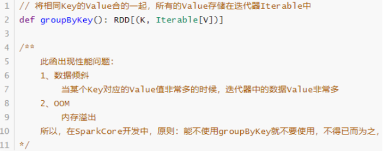

-  第二类：分组聚合函数reduceByKey和foldByKey

  

但是**reduceByKey和foldByKey**聚合以后的结果数据类型与RDD中Value的数据类型是一样的。


- 第三类：分组聚合函数aggregateByKey

  

  ​	在企业中如果对数据聚合使用，**不能使用reduceByKey完成时，考虑使用aggregateByKey函数**，基本上都能完成任意聚合功能。
  演示范例代码如下：

  ``` scala
  package cn.itcast.core
  
  import org.apache.spark.rdd.RDD
  import org.apache.spark.{SparkConf, SparkContext}
  
  /**
   * RDD中聚合函数，针对RDD中数据类型Key/Value对：
   *      groupByKey
   *      reduceByKey/foldByKey
   *      aggregateByKey
   */
  object SparkAggByKeyTest {
      def main(args: Array[String]): Unit = {
          val sparkConf: SparkConf = new SparkConf()
            .setAppName(this.getClass.getSimpleName.stripSuffix("$"))
            .setMaster("local[*]")
          val sc: SparkContext = new SparkContext(sparkConf)
          sc.setLogLevel("WARN")
          
          // 1、并行化集合创建RDD数据集
          val linesSeq: Seq[String] = Seq(
              "hello me you her",
              "hello you her",
              "hello her",
              "hello"
          )
          val inputRDD: RDD[String] = sc.parallelize(linesSeq, numSlices = 2)
          
          // 2、分割单词，转换为二元组
          val wordsRDD: RDD[(String, Int)] = inputRDD
              .flatMap(_.split("\\s+"))
              .map((_,1))
  
          println("==使用groupByKey函数分组，再使用mapValues函数聚合==")
          val wordsGroupRDD: RDD[(String, Iterable[Int])] = wordsRDD.groupByKey()
          val resultRDD: RDD[(String, Int)] = wordsGroupRDD.mapValues(_.sum)
          println(resultRDD.collectAsMap())
  
          println("==使用reduceByKey或foldByKey分组聚合==")
          val resultRDD2: RDD[(String, Int)] = wordsRDD.reduceByKey(_+_)
          println(resultRDD2.collectAsMap())
          val resultRDD3 = wordsRDD.foldByKey(0)(_+_)
          println(resultRDD3.collectAsMap())
          
          println("==使用aggregateByKey聚合==")
          /*
            def aggregateByKey[U: ClassTag]
            (zeroValue: U) // 聚合中间临时变量初始值，类似fold函数zeroValue
            (
                seqOp: (U, V) => U, // 各个分区内数据聚合操作函数
                combOp: (U, U) => U // 分区间聚合结果的聚合操作函数
            ): RDD[(K, U)]
           */
          val resultRDD4 = wordsRDD.aggregateByKey(0)(
              (tmp: Int, item: Int) => {
                  tmp + item
              },
              (tmp: Int, result: Int) => {
                  tmp + result
              }
          )
          println(resultRDD4.collectAsMap())
          
          // 应用程序运行结束，关闭资源
          sc.stop()
      }
      
  }
  ```

  

#### 面试题:groupByKey和reduceByKey区别

**RDD中groupByKey和reduceByKey区别？？？**

- groupByKey函数：在一个(K,V)的RDD上调用，返回一个(K,V)的RDD，使用指定的函数，将相同key的值聚合到一起。


- 
  reduceByKey函数：在一个(K,V)的RDD上调用，返回一个(K,V)的RDD，使用指定的reduce函数，将相同key的值聚合到一起，**reduce任务的个数可以通过第二个可选的参数来设置**。**有预聚合**


### 3-4-5 join关联函数

#### 总结：


- **join: 内关联；**
- **leftOuterJoin: 左外关联；**
- **rightOuterJoin: 右外关联；**
- **fullOuterJoin:全关联；**
- **union:合并，笛卡尔积；**

- 关联条件：**以两个RDD 的两个key 关联；** 


#### 原理：

- 当两个RDD的数据类型为二元组Key/Value对时，可以依据Key进行关联Join。

 


- 首先回顾一下SQL JOIN，用Venn图表示如下：

 


- RDD中关联JOIN函数都在**PairRDDFunctions**中，具体截图如下：

 


- 具体看一下join（等值连接）函数说明：

 


- 范例演示代码：

``` scala
package cn.itcast.core

import org.apache.spark.rdd.RDD
import org.apache.spark.{SparkConf, SparkContext}

/**
 * RDD中关联函数Join，针对RDD中数据类型为Key/Value对
 */
object SparkJoinTest {
  def main(args: Array[String]): Unit = {
    val sparkConf: SparkConf = new SparkConf()
      .setAppName(this.getClass.getSimpleName.stripSuffix("$"))
      .setMaster("local[*]")
    val sc: SparkContext = new SparkContext(sparkConf)
    sc.setLogLevel("WARN")

    // 模拟数据集
    val empRDD: RDD[(Int, String)] = sc.parallelize(
      Seq((1001, "zhangsan"), (1002, "lisi"), (1003, "wangwu"), (1004, "zhangliu"))
    )
    val deptRDD: RDD[(Int, String)] = sc.parallelize(
      Seq((1001, "sales"), (1002, "tech"))
    )

    /*
        def join[W](other: RDD[(K, W)]): RDD[(K, (V, W))]
     */
    val joinRDD: RDD[(Int, (String, String))] = empRDD.join(deptRDD)
    println(joinRDD.collectAsMap())

    /*
        def leftOuterJoin[W](other: RDD[(K, W)]): RDD[(K, (V, Option[W]))]
     */
    val leftJoinRDD: RDD[(Int, (String, Option[String]))] = empRDD.leftOuterJoin(deptRDD)
    println(leftJoinRDD.collectAsMap())

    // 应用程序运行结束，关闭资源
    sc.stop()
  }
}
```


### 3-4-6 排序函数-求TopKey

#### 总结：sortByKey 、sortBy

- **sortByKey**
  - **按照Key进行排序**，默认升序；
  - **第一个参数为false 时，为降序**；
  - <span style="color:red;background:white;font-size:20px;font-family:楷体;">**注意： 如果不指定第二个参数（分区数），默认只是分区内的排序；**</span>
- **sortBy**
  - **自定义排序规则**；
  - **参数1：按照谁排序；**
  - **参数2：升序(true),降序(false);**
  - **参数3：指定分区数**,(<span style="color:red;background:white;font-size:20px;font-family:楷体;">**注意： 如果分区数不是1，只做分区内的排序**</span>)
- **top**
  - 如果是Key/Value对，**按照Key降序排序**;
  - 参数1：求top 几；
  - 参数2：**是个隐士参数，：Ordering.by() 。 指定使用哪个排序；**
  - <span style="color:red;background:white;font-size:20px;font-family:楷体;">**注意：该算子仅用于结果数据比较小的时候，如果数据量大会oom Driver;**</span>


#### 原理：

​		在上述词频统计WordCount代码基础上，对统计出的每个单词的词频Count，按照降序排序，获取词频次数最多Top3单词。

RDD中关于排序函数有如下三个：

-  1）、sortByKey：针对RDD中数据类型key/value对时，按照Key进行排序

  

-  2）、sortBy：针对RDD中数据指定排序规则

  

-  3）、top：按照RDD中数据采用降序方式排序，如果是Key/Value对，按照Key降序排序

  


具体演示代码如下，注意慎用top函数。

``` scala
package cn.itcast.hello

import org.apache.spark.rdd.RDD
import org.apache.spark.{SparkConf, SparkContext}

/**
  * 获取词频最高三个单词
  */
object WordCountTopKey {
    def main(args: Array[String]): Unit = {
        val sparkConf: SparkConf = new SparkConf().setMaster("local[*]").setAppName("wc")
        val sc: SparkContext = new SparkContext(sparkConf)
        sc.setLogLevel("WARN")
        val inputRDD: RDD[String] = sc.textFile("data/input/words.txt")
        val wordsRDD = inputRDD.flatMap(line => line.split("\\s+"))
        val tuplesRDD: RDD[(String, Int)] = wordsRDD.map((_, 1))
        val wordCountsRDD: RDD[(String, Int)] = tuplesRDD.reduceByKey(_+_)
        wordCountsRDD.foreach(println)

        // 按照词频count降序排序获取前3个单词, 有三种方式
        println("======================== sortByKey =========================")
        // 方式一：按照Key排序sortByKey函数，
        /*
            def sortByKey(
                ascending: Boolean = true,
                numPartitions: Int = self.partitions.length
            ): RDD[(K, V)]
         */
        wordCountsRDD
            .map(tuple => tuple.swap) //.map(tuple => (tuple._2, tuple._1))
            .sortByKey(ascending = false)//逆序
            .take(3)
            .foreach(println)

        println("======================== sortBy =========================")
        // 方式二：sortBy函数, 底层调用sortByKey函数
        /*
              def sortBy[K](
                  f: (T) => K, // T 表示RDD集合中数据类型，此处为二元组
                  ascending: Boolean = true,
                  numPartitions: Int = this.partitions.length
              )
              (implicit ord: Ordering[K], ctag: ClassTag[K]): RDD[T]
         */
        wordCountsRDD
            .sortBy(tuple => tuple._2, ascending = false)
            .take(3)
            .foreach(println)

        println("======================== top =========================")
        // 方式三：top函数，含义获取最大值，传递排序规则， 慎用
        /*
            def top(num: Int)(implicit ord: Ordering[T]): Array[T]
         */
        wordCountsRDD
            .top(3)(Ordering.by(_._2))
            .foreach(println)

        
        sc.stop()
    }
}
```


### 3-4-7 xxxPartitions算子

#### 总结：

**mapPartitions** 、**foreachPartitions** ......

像这种带有Partitions 的算子都是**批处理**的算子。


主要功能：**大大减少的网络的IO次数；**

- 例如：map 与 mapPartitions 对比
  - 如果数据分为3个分区， 数据量分别是 3000条、2500条、3500条；
  - map: 需要传递 3000 + 2500 + 3500 = 9000次； 
  - mapPartitions ： 只需要传递3次（3个分区）；


## 3-5 课后练习-作业


### swap 元组反转

**tuple.swap;**


### map 算子

对RDD中的每一个元素进行操作并返回操作的结果。


``` scala
//通过并行化生成rdd
val rdd1 = sc.parallelize(List(5, 6, 4, 7, 3, 8, 2, 9, 1, 10))  
//对rdd1里的每一个元素
rdd1.map(_ * 2).collect  //collect方法表示收集,是action操作
//res4: Array[Int] = Array(10, 12, 8, 14, 6, 16, 4, 18, 2, 20)
```


### filter 算子

函数中返回True的被留下,返回False的被过滤掉。


``` scala
val rdd2 = sc.parallelize(List(5, 6, 4, 7, 3, 8, 2, 9, 1, 10))
val rdd3 = rdd2.filter(_ >= 10) //大于等于10的留下
rdd3.collect //10
```


### flatMap 算子

对RDD中的每一个元素进行先map再压扁,最后返回操作的结果。


``` scala
//对RDD中的每一个元素进行先map再压扁,最后返回操作的结果
val rdd1 = sc.parallelize(Array("a b c", "d e f", "h i j"))

//将rdd1里面的每一个元素先切分再压平
val rdd2 = rdd1.flatMap(_.split(' '))//_是每一个元素,如其中一个:"a b c"   

rdd2.collect

//Array[String] = Array(a, b, c, d, e, f, h, i, j)
```


### 交集、并集、差集、笛卡尔积

类似Scala集合类Set中相关函数，注意类型要一致。


``` scala
注意类型要一致
val rdd1 = sc.parallelize(List(5, 6, 4, 3))
val rdd2 = sc.parallelize(List(1, 2, 3, 4))
//union并集不会去重
val rdd3 = rdd1.union(rdd2) 
rdd3.collect//Array[Int] = Array(5, 6, 4, 3, 1, 2, 3, 4)
//去重
rdd3.distinct.collect
//求交集
val rdd4 = rdd1.intersection(rdd2)
rdd4.collect
//求差集
val rdd5 = rdd1.subtract(rdd2)
rdd5.collect
//笛卡尔积
val rdd1 = sc.parallelize(List("jack", "tom"))//学生
val rdd2 = sc.parallelize(List("java", "python", "scala"))//课程
val rdd3 = rdd1.cartesian(rdd2) 
//可以表示所有学生的所有可能的选课情况
rdd3.collect//Array((jack,java), (jack,python), (jack,scala), (tom,java), (tom,python), (tom,scala))

```


### distinct 算子

对RDD中元素进行去重，与Scala集合中distinct类似。


``` scala
val rdd = sc.parallelize(Array(1,2,3,4,5,5,6,7,8,1,2,3,4), 3)
rdd.distinct.collect 
```


### first、take、top 算子

从RDD中获取某些元素，比如first为第一个元素，take为前N个元素，top为最大的N个元素。


``` scala
val rdd1 = sc.parallelize(List(3,6,1,2,4,5))
rdd1.top(2)// 6 5
//按照原来的顺序取前N个
rdd1.take(2) //3 6
//按照原来的顺序取前第一个
rdd1.first
```


### keys、values 算子

针对RDD中数据类型为KeyValue对时，获取所有key和value的值，类似Scala中Map集合。


``` scala
val rdd1 = sc.parallelize(List("dog", "tiger", "lion", "cat", "panther", "eagle"), 2)
val rdd2 = rdd1.map(x => (x.length, x))
rdd2.collect
//Array[(Int, String)] = Array((3,dog), (5,tiger), (4,lion), (3,cat), (7,panther), (5,eagle))
rdd2.keys.collect
//Array[Int] = Array(3, 5, 4, 3, 7, 5)
rdd2.values.collect
//Array[String] = Array(dog, tiger, lion, cat, panther, eagle) 
```

### mapValues 算子

mapValues表示对RDD中的元素进行操作,Key不变,**Value变为操作之后**。


``` scala
//mapValues表示对RDD中的元素进行操作,Key不变,Value变为操作之后
val rdd1 = sc.parallelize(List((1,10),(2,20),(3,30)))
val rdd2 = rdd1.mapValues(_*2).collect //_表示每一个value ,key不变,将函数作用于value
// Array[(Int, Int)] = Array((1,20), (2,40), (3,60))
```

### collectAsMap 算子

当RDD中数据类型为Key/Value对时，**转换为Map集合**。


``` scala
val rdd = sc.parallelize(List(("a", 1), ("b", 2)))
rdd.collectAsMap
//scala.collection.Map[String,Int] = Map(b -> 2, a -> 1)/Map((b ,2), (a , 1)) //Scala中Map底层就是多个二元组
```

### mapPartitionsWithIndex 算子

取分区中对应的数据时，还可以将分区的编号取出来，这样就可以知道数据是属于哪个分区的。


``` scala
//功能：取分区中对应的数据时，还可以将分区的编号取出来，这样就可以知道数据是属于哪个分区的

val rdd1 = sc.parallelize(List(1,2,3,4,5,6,7,8,9), 3)

//该函数的功能是将对应分区中的数据取出来，并且带上分区编号
val func = (index: Int, iter: Iterator[Int]) => {
  iter.map(x => "[partID:" +  index + ", val: " + x + "]")
}

rdd1.mapPartitionsWithIndex(func).collect

//Array[String] = Array(
//[partID:0, val: 1], [partID:0, val: 2], [partID:0, val: 3], 
//[partID:1, val: 4], [partID:1, val: 5], [partID:1, val: 6],
//[partID:2, val: 7], [partID:2, val: 8], [partID:2, val: 9]
//)
```


# 4- RDD持久化与Checkpoint

## 4-1 RDD 持久化

### 总结：

- 原因： **因为spark的rdd默认都是 过程数据, 临时的,用完就丢的,不能二次使用**.

- 使用场景：**如果这些RDD后续还会频繁的被使用到，那么可以将这些RDD进行持久化/缓存**
- 使用方法：
  - **1- 缓存到内存：persist()，cache();**
    - **cache() 底层调用的persist(StorageLevel.MEMORY_ONLY);**
  - **2- 设置缓存级别：inputRDD.persist(StorageLevel.MEMORY_AND_DISK)**
    - 将RDD以非序列化的Java对象存储在JVM中。**如果数据在内存中放不下，则溢写到磁盘上**．需要时则会从磁盘上读取
  - **缓存函数与Transformation函数一样，都是Lazy操作**，需要Action函数触发，通常使用count函数触发。
  - **释放缓存：**
    - **rdd.unpersist();**

### 4-1-1 引入


如图,rdd2 如果被使用2次, 就会被 生产2次.

**因为spark的rdd默认都是 过程数据, 临时的,用完就丢的**.

 

​		在实际开发中某些RDD的计算或转换可能会比较耗费时间，**如果这些RDD后续还会频繁的被使用到，那么可以将这些RDD进行持久化/缓存**，这样下次再使用到的时候就不用再重新计算了，提高了程序运行的效率。


### 4-1-2 API

- 缓存/持久化函数

可以将RDD数据直接缓存到内存中，函数声明如下：

 

​	但是实际项目中，不会直接使用上述的缓存函数，RDD数据量往往很多，内存放不下的。在实际的项目中缓存RDD数据时，往往使用如下函数，依据具体的业务和数据量，指定缓存的级别


- 缓存/持久化级别

在Spark框架中对数据缓存可以指定不同的级别，对于开发来说至关重要，如下所示：

 

| 持久化级别                           | 说明                                                         |
| ------------------------------------ | ------------------------------------------------------------ |
| MEMORY_ONLY(默认)                    | 将RDD以非序列化的Java对象存储在JVM中。 如果没有足够的内存存储RDD，则某些分区将不会被缓存，每次需要时都会重新计算。 这是默认级别。 |
| MEMORY_AND_DISK(开发中可以使用这个)  | 将RDD以非序列化的Java对象存储在JVM中。如果数据在内存中放不下，则溢写到磁盘上．需要时则会从磁盘上读取 |
| MEMORY_ONLY_SER (Java and Scala)     | 将RDD以序列化的Java对象(每个分区一个字节数组)的方式存储．这通常比非序列化对象(deserialized objects)更具空间效率，特别是在使用快速序列化的情况下，但是这种方式读取数据会消耗更多的CPU。 |
| MEMORY_AND_DISK_SER (Java and Scala) | 与MEMORY_ONLY_SER类似，但如果数据在内存中放不下，则溢写到磁盘上，而不是每次需要重新计算它们。 |
| DISK_ONLY                            | 将RDD分区存储在磁盘上。                                      |
| MEMORY_ONLY_2, MEMORY_AND_DISK_2等   | 与上面的储存级别相同，只不过将持久化数据存为两份，备份每个分区存储在两个集群节点上。 |
| OFF_HEAP(实验中)                     | 与MEMORY_ONLY_SER类似，但将数据存储在堆外内存中。 (即不是直接存储在JVM内存中)如：Tachyon-分布式内存存储系统、Alluxio - Open Source Memory Speed Virtual Distributed Storage |

实际项目中缓存数据时，往往选择 <span style="color:red;background:white;font-size:20px;font-family:楷体;">**MEMORY_AND_DISK**</span>

缓存函数与Transformation函数一样，都是Lazy操作，需要Action函数触发，通常使用count函数触发。


- 释放缓存/持久化

当缓存的RDD数据，不再被使用时，考虑释资源，使用如下函数：

 

此函数属于eager，立即执行。

 

### 4-1-3 代码演示

``` scala
package cn.itcast.core

import org.apache.spark.rdd.RDD
import org.apache.spark.storage.StorageLevel
import org.apache.spark.{SparkConf, SparkContext}

/**
 * RDD中缓存函数，将数据缓存到内存或磁盘、释放缓存
 */
object SparkCacheTest {
    def main(args: Array[String]): Unit = {
        val sparkConf: SparkConf = new SparkConf()
          .setAppName(this.getClass.getSimpleName.stripSuffix("$"))
          .setMaster("local[*]")
        val sc: SparkContext = new SparkContext(sparkConf)
        sc.setLogLevel("WARN")
        
        // 读取文本文件数据
        val inputRDD: RDD[String] = sc.textFile("data/input/words.txt", minPartitions = 2)

        // 缓存数据
        inputRDD.persist(StorageLevel.MEMORY_AND_DISK)
        // 使用Action函数触发缓存
        println(s"Count = ${inputRDD.count()}")
        println(s"Count = ${inputRDD.count()}")

        // 释放缓存
        inputRDD.unpersist()
        // 应用程序运行结束，关闭资源
        sc.stop()
    }
}
```


### 4-1-4  总结：何时使用缓存/持久化

在实际项目开发中，什么时候缓存RDD数据，最好呢？？？

- 第一点：当某个RDD被使用多次的时候，建议缓存此RDD数据

  - 比如，从HDFS上读取网站行为日志数据，进行多维度的分析，最好缓存数据

  

- 第二点：当某个RDD来之不易，并且使用不止一次，建议缓存此RDD数据
  - 比如，从HBase表中读取历史订单数据，与从MySQL表中商品和用户维度信息数据，进行关联Join等聚合操作，获取RDD：etlRDD，后续的报表分析使用此RDD，此时建议缓存RDD数据
  - 案例：	etlRDD.persist(StoageLeval.MEMORY_AND_DISK_2)


## 4-2 RDD Checkpoint

### 总结：

- 原因：
  - RDD 数据可以持久化，但是持久化/缓存可以把数据放在内存中，虽然是快速的，但是也是最**不可靠**的；也可以把数据放在磁盘上，**也不是完全可靠**的！例如磁盘会损坏等。
- 优点：（**保存到HDFS中，容错 + 高可用**）
  - **更加可靠的数据持久化，实现了RDD的容错和高可用**
    - 在**Checkpoint的时候一般把数据放在在HDFS上**，这就天然的借助了HDFS天生的高容错、高可靠来实现数据最大程度上的安全；
- 使用方法：
  - **第一步:sc.setCheckpointDir("HDFS目录") //HDFS的目录**
  - **第二步:rdd.checkpoint //后续会被多次频繁使用到的RDD/很重要的RDD**

### 4-2-1 引入

- RDD 数据可以持久化，但是持久化/缓存可以把数据放在内存中，虽然是快速的，但是也是最不可靠的；也可以把数据放在磁盘上，也不是完全可靠的！例如磁盘会损坏等。

- Checkpoint的产生就是为了更加可靠的数据持久化，在Checkpoint的时候一般把数据放在在HDFS上，这就天然的借助了HDFS天生的高容错、高可靠来实现数据最大程度上的安全，实现了RDD的容错和高可用。

- 在Spark Core中对RDD做checkpoint，可以切断做checkpoint RDD的依赖关系，将RDD数据保存到可靠存储（如HDFS）以便数据恢复；

### 4-2-2 API

``` properties
第一步:sc.setCheckpointDir("HDFS目录") //HDFS的目录
第二步:rdd.checkpoint //后续会被多次频繁使用到的RDD/很重要的RDD
```


### 4-2-3 代码演示

``` scala
package cn.itcast.core

import org.apache.spark.{SparkConf, SparkContext}

/**
 * RDD数据Checkpoint设置，案例演示
 */
object SparkCkptTest {
  def main(args: Array[String]): Unit = {
    val sparkConf: SparkConf = new SparkConf()
      .setAppName(this.getClass.getSimpleName.stripSuffix("$"))
      .setMaster("local[*]")
    val sc: SparkContext = new SparkContext(sparkConf)
    sc.setLogLevel("WARN")

    // 设置检查点目录，将RDD数据保存到那个目录
    sc.setCheckpointDir("./ckp")

    // 读取文件数据
    val datasRDD = sc.textFile("data/input/words.txt")

    // 调用checkpoint函数，将RDD进行备份，需要RDD中Action函数触发
    datasRDD.checkpoint()
    datasRDD.count()

    //再次执行count函数, 此时从checkpoint读取数据
    datasRDD.count()

    // 应用程序运行结束，关闭资源
    sc.stop()
  }
}
```


## 4-3 总结：持久化和Checkpoint的区别

- 问题:
  缓存持久化 VS Checkpoint 开发中用哪个?
- 答案:
  **缓存持久化(保证后续再次使用的速度) + Checkpoint(保证安全)** 

- 区别:

  - 1）、**存储位置**

    -  **Persist 和 Cache 只能保存在本地的磁盘和内存中(或者堆外内存)；**
    - **Checkpoint 可以保存数据到 HDFS 这类可靠的存储上；**

  -  2）、**生命周期**

    - Cache和Persist的RDD会在**程序结束后会被清除或者手动调用unpersist方法**；
    - Checkpoint的RDD在程序结束后依然存在，**不会被删除**；

  -  3）、**[Lineage]()(血统、依赖链、依赖关系)**

    - Persist和Cache，**不会丢掉RDD间的依赖链/依赖关系**，因为这种缓存是不可靠的，如果出现了一些错误(例如 Executor 宕机)，需要通过回溯依赖链重新计算出来；
    - **Checkpoint会斩断依赖链**，因为Checkpoint会把结果保存在HDFS这类存储中，更加的安全可靠，一般不需要回溯依赖链；

    


# 5- 共享变量

​		在默认情况下，当Spark在集群的多个不同节点的多个任务上并行运行一个函数时，它会把函数中涉及到的每个变量，在每个任务上都生成一个副本。但是，有时候需要在多个任务之间共享变量，或者在任务(Task)和任务控制节点(Driver Program)之间共享变量。

为了满足这种需求，Spark提供了两种类型的变量：

- 1）、广播变量Broadcast Variables
  - 广播变量用来把变量在所有节点的内存之间进行共享，在每个机器上缓存一个只读的变量，而不是为机器上的每个任务都生成一个副本；
-   2）、累加器Accumulators
  - 累加器支持在所有不同节点之间进行累加计算(比如计数或者求和)；

官方文档：http://spark.apache.org/docs/2.4.5/rdd-programming-guide.html#shared-variables


## 5-1 广播变量


### 总结：

- 原因：
  - rdd1(大) join rdd2(小)；
  - **让一个Executor中的所有task 共用一个公有的数据rdd2；**

- 使用方法：
  - **发布广播变量**：val listBroadcast: Broadcast[List[String]] = **sc.broadcast(list)**
  - **获取广播变量**： val listValue = **listBroadcast.value**

### 原理：

​		广播变量允许开发人员在每个节点（Worker or Executor）缓存只读变量，而不是在Task之间传递这些变量。使用广播变量能够高效地在集群每个节点创建大数据集的副本。同时Spark还使用高效的广播算法分发这些变量，从而减少通信的开销。


可以通过调用**sc.broadcast(v)**创建一个广播变量，该广播变量的值封装在v变量中，可使用获取该变量value的方法进行访问。

 


## 5-2 累加器

### 总结：

- 原因：

  - **用于多个节点对一个变量进行共享性的操作**;

- 特性：

  - **多个task对一个变量并行操作的功能；**
  - **task只能对Accumulator进行累加操作，不能读取Accumulator的值；**
  - **只有Driver程序可以读取Accumulator的值** 

- 种类：

  - <span style="color:red;background:white;font-size:20px;font-family:楷体;">**LongAccumulator用来累加整数型，**</span>
  - <span style="color:red;background:white;font-size:20px;font-family:楷体;">**DoubleAccumulator用来累加浮点型，**</span>
  - <span style="color:red;background:white;font-size:20px;font-family:楷体;">**CollectionAccumulator用来累加集合元素。**</span>

- 使用方法：

  - **定义累加器**：val accumulator: LongAccumulator = **sc.longAccumulator("mycounter")**
  - **累加计算**：accumulator.**add**(1L)；
  - **获取累加值**：accumulator.**value**

- 扩展：

  - **自定义累加器**

    - **第一步、继承AccumulatorV2，实现相关方法；**
    - **第二步、创建自定义Accumulator的实例，然后在SparkContext上注册它；**

    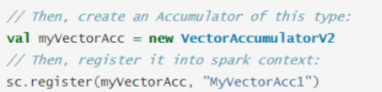

- 注意：
  
  - <span style="color:red;background:white;font-size:20px;font-family:楷体;">**累加器在Driver中；**</span>

### 原理：

​		Spark提供的Accumulator，主要**用于多个节点对一个变量进行共享性的操作**。Accumulator只提供了累加的功能，即确提供了多个task对一个变量并行操作的功能。但是task只能对Accumulator进行累加操作，不能读取Accumulator的值，只有Driver程序可以读取Accumulator的值。创建的Accumulator变量的值能够在Spark Web UI上看到，在创建时应该尽量为其命名。


- Spark内置了三种类型的Accumulator；
  - <span style="color:red;background:white;font-size:20px;font-family:楷体;">**LongAccumulator用来累加整数型，**</span>
  - <span style="color:red;background:white;font-size:20px;font-family:楷体;">**DoubleAccumulator用来累加浮点型，**</span>
  - <span style="color:red;background:white;font-size:20px;font-family:楷体;">**CollectionAccumulator用来累加集合元素。**</span>

- 当内置的Accumulator无法满足要求时，可以继承AccumulatorV2实现自定义的累加器。实现自定义累加器的步骤：
  -  第一步、<font color='red'>继承AccumulatorV2，实现相关方法</font>；
  -  第二步、<font color='red'>创建自定义Accumulator的实例，然后在SparkContext上注册它</font>；

官方提供实例如下：


## 5-3 案例演示

```properties
以词频统计WordCount程序为例，假设处理的数据如下所示，包括非单词符合，统计数据词频时过滤非单词的特殊符号并且统计总的格式。
```


实现功能：

-  第一、过滤特殊字符

  - 非单词符合存储列表List中

    

  - 使用广播变量广播列表

    


-  第二、累计统计非单词符号出现次数

  - 定义一个LongAccumulator累加器，进行计数

    

示例代码：

``` scala
package cn.itcast.core

import org.apache.spark.broadcast.Broadcast
import org.apache.spark.rdd.RDD
import org.apache.spark.util.LongAccumulator
import org.apache.spark.{SparkConf, SparkContext}

/**
 * 基于Spark框架使用Scala语言编程实现词频统计WordCount程序，将符号数据过滤，并统计出现的次数
 * -a. 过滤标点符号数据
 * 使用广播变量
 * -b. 统计出标点符号数据出现次数
 * 使用累加器
 */
object SparkSharedVariableTest {
  def main(args: Array[String]): Unit = {
    val sparkConf: SparkConf = new SparkConf()
      .setAppName(this.getClass.getSimpleName.stripSuffix("$"))
      .setMaster("local[*]")
    val sc: SparkContext = new SparkContext(sparkConf)
    sc.setLogLevel("WARN")

    // 读取文件数据
    val datasRDD: RDD[String] = sc.textFile("data/input/words2.txt", minPartitions = 2)

    // 字典数据，只要有这些单词就过滤: 特殊字符存储列表List中
    val list: List[String] = List(",", ".", "!", "#", "$", "%")
    // 通过广播变量 将列表list广播到各个Executor内存中，便于多个Task使用
    val listBroadcast: Broadcast[List[String]] = sc.broadcast(list)

    // 定义累加器，记录单词为符号数据的个数
    val accumulator: LongAccumulator = sc.longAccumulator("mycounter")

    // 分割单词，过滤数据
    val wordsRDD = datasRDD
      // 1)、过滤数据，去除空行数据
      .filter(line => line != null && line.trim.length > 0)
      // 2)、分割单词
      .flatMap(_.trim.split("\\s+"))
      // 3)、过滤字典数据：符号数据
      .filter(word => {
        // 获取符合列表 ,从广播变量中获取列表list的值
        val listValue = listBroadcast.value
        // 判断单词是否为符号数据，如果是就过滤掉
        val isCharacter = listValue.contains(word)
        if (isCharacter) {
          // 如果单词为符号数据，累加器加1
          accumulator.add(1L)
        }
        !isCharacter
      })

    val resultRDD: RDD[(String, Int)] = wordsRDD
      // 转换为二元组
      .mapPartitions(iter => {
        iter.map((_, 1))
      })
      // 按照单词聚合统计
      .reduceByKey(_+_)

    resultRDD.foreach(println)
    println(s"过滤符合数据的个数：${accumulator.value}")

    // 应用程序运行结束，关闭资源
    sc.stop()
  }
}
```

也可以通过WEB UI查看累加器的值


# 6- 外部数据源


​		Spark可以从外部存储系统读取数据，比如RDBMs表中或者HBase表中读写数据，这也是企业中常常使用，如：

-  1）、要分析的数据存储在HBase表中，需要从其中读取数据数据分析
  - 日志数据：电商网站的商家操作日志
  - 订单数据：保险行业订单数据
-  2）、使用Spark进行离线分析以后，往往将报表结果保存到MySQL表中
  - 网站基本分析（pv、uv。。。。。）

<span style="color:red;background:white;font-size:20px;font-family:楷体;">**注意：实际开发中会封装为工具类直接使用**</span>
https://github.com/teeyog/blog/issues/22
https://blog.csdn.net/u011817217/article/details/81667115


## 6-1 Sequence  数据源

### 总结：

- **写：saveAsSequenceFile**

  ``` scala
  dataWithOne.coalesce(1).saveAsSequenceFile("data/output/seq")
  ```

- **读：sequenceFile**

  ``` scala
  val seqDataRDD: RDD[(Int, Int)] = sc.sequenceFile[Int, Int]("data/output/seq")
  ```

  

​	

- 写

``` scala
def writeData2Seq_Obj(sc: SparkContext) = {
    // 1- 创造数据
    val dataRDD: RDD[Int] = sc.parallelize(List(1, 2, 3, 4, 5, 6, 7, 8))


    // 2- 数据转换
    val dataWithOne = dataRDD.mapPartitions(iter => {
        iter.map(_ -> 1)
    })

    dataWithOne.coalesce(1)
    .saveAsSequenceFile("data/output/seq")
  
}
```

- 读

``` scala
def readDateFromSeq_Obj(sc: SparkContext): Unit = {

    val seqDataRDD: RDD[(Int, Int)] = sc.sequenceFile[Int, Int]("data/output/seq")
    seqDataRDD.foreach(x => println(s"SEQ: ${x}  "))

}
```


## 6-2 Obj 数据源

### 总结

- **写: saveAsObjectFile**

  ``` scala
  dataWithOne.coalesce(1).saveAsObjectFile("data/output/obj")
  ```

- **读:objectFile**

  ``` scala
  val objDataRDD = sc.objectFile[(Int,Int)]("data/output/obj")
  objDataRDD.foreach(x => println(s"OBJ: ${x}  "))
  ```

  


- 写

``` scala
def writeData2Seq_Obj(sc: SparkContext) = {
    // 1- 创造数据
    val dataRDD: RDD[Int] = sc.parallelize(List(1, 2, 3, 4, 5, 6, 7, 8))


    // 2- 数据转换
    val dataWithOne = dataRDD.mapPartitions(iter => {
        iter.map(_ -> 1)
    })

     dataWithOne.coalesce(1)
                .saveAsObjectFile("data/output/obj")
  
}
```

- 读

``` scala
def readDateFromSeq_Obj(sc: SparkContext): Unit = {

    val objDataRDD = sc.objectFile[(Int,Int)]("data/output/obj")
    objDataRDD.foreach(x => println(s"OBJ: ${x}  "))

}
```


## 6-3 MySQL 数据源

### 总结：

- **写入数据库的时候必须使用foreachPartition；**
  - **将connection 和 PreparedStatement 都写在foreachPartition中；**
  - **原因： jdbc连接构建如果在Driver,再传递给executor用是不行的。必须让每个executor都去连接MYSQL;**		
    - **Driver序列化传输给Executor的只是对象的数据， 而无法将TCP连接传递给Executor使用；**

- **写**  （将connection 和 PreparedStatement 都写在foreachPartition中）

``` scala
rdd.foreachPartition(dataToMySQL) //方法即函数,函数即对象

def dataToMySQL(itar: Iterator[(String, Int)]): Unit = {
    //0.加载驱动
    //Class.forName("") //源码中已经加载了
    //1.获取连接
    val connection: Connection = DriverManager.getConnection("jdbc:mysql://localhost:3306/bigdata?characterEncoding=UTF-8","root","root")
    //2.编写sql
    val sql:String = "INSERT INTO `t_student` (`name`, `age`) VALUES (?, ?);"
    //3.获取ps
    val ps: PreparedStatement = connection.prepareStatement(sql)
    itar.foreach(data=>{
      //4.设置参数
      ps.setString(1,data._1)
      ps.setInt(2,data._2)
      //5.执行sql
      ps.addBatch()
    })
    ps.executeBatch()
    ps.close()
    connection.close()
  }
```

- **读  JdbcRDD**

``` scala
val getConnection = ()=> DriverManager.getConnection(
        "jdbc:mysql://localhost:3306/bigdata?characterEncoding=UTF-8",
        "root",
        "root")
      
    // 源码要求: 必须有占位符;
    val sql:String = "select id,name,age from t_student where id >= ? and id <= ?"
      
    val mapRow = (rs:ResultSet) => {
      val id: Int = rs.getInt(1)
      val name: String = rs.getString(2)
      val age: Int = rs.getInt("age")
      (id,name,age)
    }
      
    val studentRDD: JdbcRDD[(Int, String, Int)] = new JdbcRDD(
        sc,
        getConnection,// 构建connection 的函数（让每个Executor都去连接mysql）
        sql,
        4,
        5,
        2,
        mapRow)  // 获取结果的函数
      
    println(studentRDD.collect().toBuffer)
```


### 原理：

​		实际开发中常常将分析结果RDD保存至MySQL表中，使用**foreachPartition函数**；此外Spark中提供**JdbcRDD用于从MySQL表中读取数据**。

​		调用RDD foreachPartition函数将每个分区数据保存至MySQL表中，保存时考虑降低RDD分区数目和批量插入，提升程序性能。

``` scala
package cn.itcast.core

import java.sql.{Connection, DriverManager, PreparedStatement, ResultSet}

import org.apache.spark.SparkConf
import org.apache.spark.SparkContext
import org.apache.spark.rdd.{JdbcRDD, RDD}

/**
  * Author itcast
  * Desc 演示使用Spark将数据写入到MySQL,再从MySQL读取出来
  */
object SparkJdbcDataSource {
  def main(args: Array[String]): Unit = {
    //1.创建SparkContext
    val sparkConf: SparkConf = new SparkConf()
      .setAppName(this.getClass.getSimpleName.stripSuffix("$"))
      .setMaster("local[*]")
    val sc: SparkContext = new SparkContext(sparkConf)
    sc.setLogLevel("WARN")
    //2.准备数据
    val data: RDD[(String, Int)] = sc.parallelize(List(("jack", 18), ("tom", 19), ("rose", 20)))
    //3.将RDD中的数据保存到MySQL中去
    //将每一个分区中的数据保存到MySQL中去,有几个分区,就会开启关闭连接几次
    //data.foreachPartition(itar=>dataToMySQL(itar))
    data.foreachPartition(dataToMySQL) //方法即函数,函数即对象


    //4.从MySQL读取数据
    /*
    class JdbcRDD[T: ClassTag](
    sc: SparkContext,
    getConnection: () => Connection,
    sql: String,// 源码要求: 必须有占位符;
    lowerBound: Long,	// 指定开始边界值
    upperBound: Long,	// 指定结束边界值
    numPartitions: Int,  // 指定分区数量
    mapRow: (ResultSet) => T = JdbcRDD.resultSetToObjectArray _
    )
     */
    val getConnection = ()=> DriverManager.getConnection(
        "jdbc:mysql://localhost:3306/bigdata?characterEncoding=UTF-8",
        "root",
        "root")
      
    // 源码要求: 必须有占位符;
    val sql:String = "select id,name,age from t_student where id >= ? and id <= ?"
      
    val mapRow = (rs:ResultSet) => {
      val id: Int = rs.getInt(1)
      val name: String = rs.getString(2)
      val age: Int = rs.getInt("age")
      (id,name,age)
    }
      
    val studentRDD: JdbcRDD[(Int, String, Int)] = new JdbcRDD(
        sc,
        getConnection,// 构建connection 的函数（让每个Executor都去连接mysql）
        sql,
        4,
        5,
        2,
        mapRow)  // 获取结果的函数
      
    println(studentRDD.collect().toBuffer)
  }

  /**
    * 将分区中的数据保存到MySQL
    * @param itar 传过来的每个分区有多条数据
    */
  def dataToMySQL(itar: Iterator[(String, Int)]): Unit = {
    //0.加载驱动
    //Class.forName("") //源码中已经加载了
    //1.获取连接
    val connection: Connection = DriverManager.getConnection("jdbc:mysql://localhost:3306/bigdata?characterEncoding=UTF-8","root","root")
    //2.编写sql
    val sql:String = "INSERT INTO `t_student` (`name`, `age`) VALUES (?, ?);"
    //3.获取ps
    val ps: PreparedStatement = connection.prepareStatement(sql)
    itar.foreach(data=>{
      //4.设置参数
      ps.setString(1,data._1)
      ps.setInt(2,data._2)
      //5.执行sql
      ps.addBatch()
    })
    ps.executeBatch()
    ps.close()
    connection.close()
  }
}
```

- 使用JdbcRDD 读取mysql 中的数据封装到样例类中


## 6-4 HBase 数据源

​		Spark可以从HBase表中读写（Read/Write）数据，底层采用**TableInputFormat**和**TableOutputFormat**方式，与MapReduce与HBase集成完全一样，使用输入格式InputFormat和输出格式OutputFormat。


### HBase Sink

​		回顾MapReduce向HBase表中写入数据，使用TableReducer，其中OutputFormat为TableOutputFormat，读取数据Key：ImmutableBytesWritable(Rowkey)，Value：Put(Put对象)。

​		写入数据时，需要将RDD转换为RDD[(ImmutableBytesWritable, Put)]类型，调用saveAsNewAPIHadoopFile方法数据保存至HBase表中。

​		HBase Client连接时，需要设置依赖Zookeeper地址相关信息及表的名称，通过Configuration设置属性值进行传递。

​	

``` java
// 构建HBase Client配置信息
val conf: Configuration = HBaseConfiguration.create()
    
// 设置连接Zookeeper属性
conf.set("hbase.zookeeper.quorum", "node1")
conf.set("hbase.zookeeper.property.clientPort", "2181")
conf.set("zookeeper.znode.parent", "/hbase")
    
// 设置将数据保存的HBase表的名称
conf.set(TableOutputFormat.OUTPUT_TABLE, "htb_wordcount")
```


范例演示：将词频统计结果保存HBase表，表的设计

​	


``` scala
package cn.itcast.core

import org.apache.hadoop.conf.Configuration
import org.apache.hadoop.hbase.HBaseConfiguration
import org.apache.hadoop.hbase.client.Put
import org.apache.hadoop.hbase.io.ImmutableBytesWritable
import org.apache.hadoop.hbase.mapreduce.TableOutputFormat
import org.apache.hadoop.hbase.util.Bytes
import org.apache.spark.rdd.RDD
import org.apache.spark.{SparkConf, SparkContext}

/**
 * 将RDD数据保存至HBase表中
 */
object SparkWriteHBase {
  def main(args: Array[String]): Unit = {
    val sparkConf: SparkConf = new SparkConf()
      .setAppName(this.getClass.getSimpleName.stripSuffix("$"))
      .setMaster("local[*]")
    val sc: SparkContext = new SparkContext(sparkConf)
    sc.setLogLevel("WARN")

    // 构建RDD
    val list = List(("hadoop", 234), ("spark", 3454), ("hive", 343434), ("ml", 8765))
    val outputRDD: RDD[(String, Int)] = sc.parallelize(list, numSlices = 2)

    // 将数据写入到HBase表中, 使用saveAsNewAPIHadoopFile函数，要求RDD是(key, Value)
    //  组装RDD[(ImmutableBytesWritable, Put)]
    /**
     * HBase表的设计：
     * 表的名称：htb_wordcount
     * Rowkey:  word
     * 列簇:    info
     * 字段名称： count
     */
    val putsRDD: RDD[(ImmutableBytesWritable, Put)] = outputRDD.mapPartitions { iter =>
      iter.map { case (word, count) =>
        // 创建Put实例对象
        val put = new Put(Bytes.toBytes(word))
        // 添加列
        put.addColumn(
          // 实际项目中使用HBase时，插入数据，先将所有字段的值转为String，再使用Bytes转换为字节数组
          Bytes.toBytes("info"), Bytes.toBytes("cout"), Bytes.toBytes(count.toString)
        )
        // 返回二元组
        (new ImmutableBytesWritable(put.getRow), put)
      }
    }

    // 构建HBase Client配置信息
    val conf: Configuration = HBaseConfiguration.create()
    // 设置连接Zookeeper属性
    conf.set("hbase.zookeeper.quorum", "node1")
    conf.set("hbase.zookeeper.property.clientPort", "2181")
    conf.set("zookeeper.znode.parent", "/hbase")
    // 设置将数据保存的HBase表的名称
    conf.set(TableOutputFormat.OUTPUT_TABLE, "htb_wordcount")
    /*
         def saveAsNewAPIHadoopFile(
             path: String,// 保存的路径
             keyClass: Class[_], // Key类型
             valueClass: Class[_], // Value类型
             outputFormatClass: Class[_ <: NewOutputFormat[_, _]], // 输出格式OutputFormat实现
             conf: Configuration = self.context.hadoopConfiguration // 配置信息
         ): Unit
     */
    putsRDD.saveAsNewAPIHadoopFile(
      "datas/spark/htb-output-" + System.nanoTime(), //
      classOf[ImmutableBytesWritable], //
      classOf[Put], //
      classOf[TableOutputFormat[ImmutableBytesWritable]], //
      conf
    )

    // 应用程序运行结束，关闭资源
    sc.stop()
  }
}
```

运行完成以后，使用hbase shell查看数据：


### Hbase source

回顾MapReduce从读HBase表中的数据，使用TableMapper

- 其中InputFormat为**TableInputFormat**，
- 读取数据Key：**ImmutableBytesWritable**，
- Value：**Result**。

  ​	

​		从HBase表读取数据时，同样需要设置依赖Zookeeper地址信息和表的名称，使用Configuration设置属性，形式如下：

 

   

​		此外，读取的数据封装到RDD中，Key和Value类型分别为：**ImmutableBytesWritable和Result**不支持Java Serializable导致处理数据时报序列化异常。**设置Spark Application使用Kryo序列化**，性能要比Java 序列化要好，创建SparkConf对象设置相关属性，如下所示：

 


**范例演示：**从HBase表读取词频统计结果，代码如下

``` scala
package cn.itcast.core

import org.apache.hadoop.conf.Configuration
import org.apache.hadoop.hbase.{CellUtil, HBaseConfiguration}
import org.apache.hadoop.hbase.client.Result
import org.apache.hadoop.hbase.io.ImmutableBytesWritable
import org.apache.hadoop.hbase.mapreduce.TableInputFormat
import org.apache.hadoop.hbase.util.Bytes
import org.apache.spark.rdd.RDD
import org.apache.spark.{SparkConf, SparkContext}

/**
 * 从HBase 表中读取数据，封装到RDD数据集
 */
object SparkReadHBase {
  def main(args: Array[String]): Unit = {
    val sparkConf: SparkConf = new SparkConf()
      .setAppName(this.getClass.getSimpleName.stripSuffix("$"))
      .setMaster("local[*]")
    val sc: SparkContext = new SparkContext(sparkConf)
    sc.setLogLevel("WARN")

    // 读取HBase Client 配置信息
    val conf: Configuration = HBaseConfiguration.create()
    conf.set("hbase.zookeeper.quorum", "node1")
    conf.set("hbase.zookeeper.property.clientPort", "2181")
    conf.set("zookeeper.znode.parent", "/hbase")

    // 设置读取的表的名称
    conf.set(TableInputFormat.INPUT_TABLE, "htb_wordcount")
    /*
         def newAPIHadoopRDD[K, V, F <: NewInputFormat[K, V]](
             conf: Configuration = hadoopConfiguration,
             fClass: Class[F],
             kClass: Class[K],
             vClass: Class[V]
         ): RDD[(K, V)]
     */
    val resultRDD: RDD[(ImmutableBytesWritable, Result)] = sc.newAPIHadoopRDD(
      conf,
      classOf[TableInputFormat],
      classOf[ImmutableBytesWritable],
      classOf[Result]
    )

    println(s"Count = ${resultRDD.count()}")
    resultRDD
      .take(5)
      .foreach { case (rowKey, result) =>
        println(s"RowKey = ${Bytes.toString(rowKey.get())}")
        // HBase表中的每条数据封装在result对象中，解析获取每列的值
        result.rawCells().foreach { cell =>
          val cf = Bytes.toString(CellUtil.cloneFamily(cell))
          val column = Bytes.toString(CellUtil.cloneQualifier(cell))
          val value = Bytes.toString(CellUtil.cloneValue(cell))
          val version = cell.getTimestamp
          println(s"\t $cf:$column = $value, version = $version")
        }
      }

    // 应用程序运行结束，关闭资源
    sc.stop()
  }
}
```

- 上课老师代码


# 7- 案例-SogouQ日志分析

总结：

- 分析技术：
  - **HanLP 中文分词**
    - **HanLP.segment("杰克奥特曼全集视频")**
  - **java List 转scala** 
    - **asScala 方法**
  - 


​		使用搜狗实验室提供【用户查询日志(SogouQ)】数据，使用Spark框架，将数据封装到RDD中进行业务数据处理分析。数据网址：http://www.sogou.com/labs/resource/q.php

-  1）、数据介绍：搜索引擎查询日志库设计为包括约1个月(2008年6月)Sogou搜索引擎部分网页查询需求及用户点击情况的网页查询日志数据集合。

-  2）、数据格式

  - 访问时间\t用户ID\t[查询词]\t该URL在返回结果中的排名\t用户点击的顺序号\t用户点击的URL

    

  - 用户ID是根据用户使用浏览器访问搜索引擎时的Cookie信息自动赋值，即同一次使用浏览器输入的不同查询对应同一个用户ID

-  3）、数据下载：分为三个数据集，大小不一样
  - 迷你版(样例数据, 376KB)：http://download.labs.sogou.com/dl/sogoulabdown/SogouQ/SogouQ.mini.zip
  - 精简版(1天数据，63MB)：http://download.labs.sogou.com/dl/sogoulabdown/SogouQ/SogouQ.reduced.zip
  - 完整版(1.9GB)：http://www.sogou.com/labs/resource/ftp.php?dir=/Data/SogouQ/SogouQ.zip


## 业务需求

针对SougoQ用户查询日志数据中不同字段，不同业务进行统计分析：

 

使用SparkContext读取日志数据，封装到RDD数据集中，调用Transformation函数和Action函数处理分析，灵活掌握Scala语言编程。


## HanLP 中文分词

使用比较流行好用中文分词：**HanLP**，面向生产环境的自然语言处理工具包，HanLP 是由一系列模型与算法组成的 Java 工具包，目标是普及自然语言处理在生产环境中的应用。

官方网站：http://www.hanlp.com/，添加Maven依赖

``` xml
<dependency>
    <groupId>com.hankcs</groupId>
    <artifactId>hanlp</artifactId>
    <version>portable-1.7.7</version>
</dependency>
```

**演示范例：**HanLP 入门案例，基本使用

``` scala
package cn.itcast.core

import java.util

import com.hankcs.hanlp.HanLP
import com.hankcs.hanlp.seg.common.Term
import com.hankcs.hanlp.tokenizer.StandardTokenizer

import scala.collection.JavaConverters._

/**
 * HanLP 入门案例，基本使用
 */
object HanLPTest {
    def main(args: Array[String]): Unit = {
        // 入门Demo
        val terms: util.List[Term] = HanLP.segment("杰克奥特曼全集视频")
        println(terms)
        println(terms.asScala.map(_.word.trim))
        
        // 标准分词
        val terms1: util.List[Term] = StandardTokenizer.segment("放假++端午++重阳")
        println(terms1)
        println(terms1.asScala.map(_.word.replaceAll("\\s+", "")))
        
        val words: Array[String] =
            """00:00:00 2982199073774412    [360安全卫士]   8 3 download.it.com.cn/softweb/software/firewall/antivirus/20067/17938.html"""
            .split("\\s+")
        println(words(2).replaceAll("\\[|\\]", ""))//将"["和"]"替换为空""
    }
    
}
```


## 完整代码

``` scala
package com.fiberhome.spark.example

import com.hankcs.hanlp.HanLP
import com.hankcs.hanlp.seg.common.Term
import org.apache.spark.rdd.RDD
import org.apache.spark.storage.StorageLevel
import org.apache.spark.{SparkConf, SparkContext}

import java.text.SimpleDateFormat
import java.util
import scala.collection.JavaConverters._

case class SoGouDefine(time:String,userID:String,key:String,resultRank:Int,clickRank:Int,url:String)

object Demo2_SparkRDDExample {
    def main(args: Array[String]): Unit = {

        val sparkConf = new SparkConf().setMaster("local[*]").setAppName(this.getClass.getSimpleName)
        val sc  = new JdbcUtils(sparkConf)
        sc.setLogLevel("WARN")


        /**
         * 1- 搜索关键词的统计
         * 2- 用户搜索次数的统计
         * 3- 搜索时间段的统计
         */


        val sdf = new SimpleDateFormat("yyyy-MM-dd HH:mm:ss")

        // 1- 读取日志文件
        val fileRDD: RDD[String] = sc.textFile("data/input/SogouQ.sample")
        val dataRDD: RDD[SoGouDefine] = fileRDD.filter(line => (line != null) && (line.trim.split("\\s+").length == 6))
                .mapPartitions(iter => {
                    iter.map(line => {
                        val arr = line.trim.split("\\s+")
                        // 将数据封装刀样例类中
                        SoGouDefine(
                            arr(0),
                            arr(1),
                            arr(2).replaceAll("\\[|\\]", ""),
                            arr(3).toInt,
                            arr(4).toInt,
                            arr(5)
                        )
                    })
                })

        // 后面会多次使用
        dataRDD.persist(StorageLevel.MEMORY_AND_DISK)
        dataRDD.foreach(println)

        println("---------- 关键词统计需求1 ----------")
        val wordRDD = dataRDD.mapPartitions(iter => {
            iter.flatMap(record => {
                val terms: util.List[Term] = HanLP.segment(record.key)
                terms.asScala.map(_.word)
                        .filter(x =>{
                            if (x == "+" || x == "." )
                                false 
                            else 
                            	true
                        })
            })
        })


        val top10Word = wordRDD.map(_ -> 1).reduceByKey(_ + _)
                .sortBy(_._2, false, 1).take(10)

        top10Word.foreach(x => println(s"需求1:TOP10 搜索关键词${x}"))


        println("---------- 需求2： 用户搜索次数统计 ----------")
        val userKeyWordRDD = dataRDD.map(record => {
            record.userID + "_" + record.key -> 1
        }).reduceByKey(_ + _).sortBy(_._2, false, 1)

        println(s"被搜索最多的Top10  ${userKeyWordRDD.take(10).mkString(",")}  ")
        println(s"被搜索最多first  ${userKeyWordRDD.first()}  ")

        userKeyWordRDD.take(10).foreach(println)


        println("---------- 需求3: 时间段统计 ----------")

        dataRDD.map(record => {
            // 获取时间 小时、分钟属性
            record.time.substring(3,5) -> 1
        }).reduceByKey(_ + _ )
                .sortBy(_._2,false,1)
                .foreach(x => println(s"热门分钟倒序输出${x}"))

        sc.stop()

    }
}

```


# 8- Spark内核原理

​		Spark的核心是根据RDD来实现的，Spark Scheduler则为Spark核心实现的重要一环，其作用就是<span style="color:red;background:white;font-size:20px;font-family:楷体;">**任务调度**</span>。Spark的任务调度就是<span style="color:red;background:white;font-size:20px;font-family:楷体;">**如何组织任务去处理RDD中每个分区的数据，根据RDD的依赖关系构建DAG，基于DAG划分Stage，将每个Stage中的任务发到指定节点运行**</span>。基于Spark的任务调度原理，可以合理规划资源利用，做到尽可能用最少的资源高效地完成任务计算。
​		以词频统计WordCount程序为例，Job执行是DAG图：


## 8-1 RDD 依赖

### 8-1-1窄依赖（Narrow Dependency）

​		窄依赖中：**即父 RDD 与子 RDD 间的分区是一对一的**。换句话说父RDD中，一个分区内的数据是不能被分割的，只能由子RDD中的一个分区整个利用。


​		上图中 P代表 RDD中的每个分区（Partition），我们看到，RDD 中每个分区内的数据在上面的几种转移操作之后被一个分区所使用，即其依赖的父分区只有一个。比如图中的 map、union 和 join 操作，都是窄依赖的。注意，join 操作比较特殊，可能同时存在宽、窄依赖。


### 8-1-2 Shuffle 依赖（宽依赖 Wide Dependency）

​		Shuffle 有“洗牌、搅乱”的意思，这里所谓的 **Shuffle 依赖也会打乱原 RDD 结构的操作**。具体来说，**父 RDD 中的分区可能会被多个子 RDD 分区使用**。因为父 RDD 中一个分区内的数据会被分割并发送给子 RDD 的所有分区，因此 Shuffle 依赖也意味着父 RDD与子 RDD 之间存在着 Shuffle 过程。


​		上图中 P 代表 RDD 中的多个分区，我们会发现对于 Shuffle 类操作而言，结果 RDD 中的每个分区可能会依赖多个父 RDD 中的分区。需要说明的是，依赖关系是 RDD 到 RDD 之间的一种映射关系，是两个 RDD 之间的依赖，如果在一次操作中涉及多个父 RDD，也有可能同时包含窄依赖和 Shuffle 依赖。


### 8-1-3 如何区分宽窄依赖

区分RDD之间的依赖为宽依赖还是窄依赖，主要在于**父RDD分区数据与子RDD分区数据关系**：

- 窄依赖：**父RDD的一个分区只会被子RDD的一个分区依赖**；

-  宽依赖：**父RDD的一个分区会被子RDD的多个分区依赖，涉及Shuffle**；


为什么要设计宽窄依赖？？

-  1）、对于窄依赖来说
  - **Spark可以并行计算**
  - 如果有一个分区数据丢失，只需要从父RDD的对应个分区重新计算即可，不需要重新计算整个任务，**提高容错。**
-  2）、对应宽依赖来说
  - **划分Stage的依据，产生Shuffle**


## 8-2 DAG和Stage

​		在图论中，**如果一个有向图无法从任意顶点出发经过若干条边回到该点**，则这个图是一个有向无环图（DAG图）。而在Spark中，由于计算过程很多时候会有先后顺序，受制于某些任务必须比另一些任务较早执行的限制，必须对任务进行排队，形成一个队列的任务集合，这个队列的任务集合就是DAG图，**每一个定点就是一个任务，每一条边代表一种限制约束（Spark中的依赖关系）。**


- 要记住: 

  - <span style="color:red;background:white;font-size:20px;font-family:楷体;">**一个Action产生一个DAG**</span>

  - **DAG 是有向无环图,是一个个的节点组成的节点迭代流程图.**

  - Spark中DAG中的节点是: **算子**

    

比如典型的WordCount的DAG可以表示如下:


​		Spark中DAG生成过程的重点是对**Stage的划分**，其划分的依据是RDD的依赖关系，对于不同的依赖关系，高层调度器会进行不同的处理。

-  **对于窄依赖**，<span style="color:red;background:white;font-size:20px;font-family:楷体;">**RDD之间的数据不需要进行Shuffle**</span>，**多个数据处理可以在同一台机器的内存中完成，所以窄依赖在Spark中被划分为同一个Stage**；
-  **对于宽依赖**，由于<span style="color:red;background:white;font-size:20px;font-family:楷体;">**Shuffle的存在，必须等到父RDD的Shuffle处理完成后**</span>，才能开始接下来的计算，所以会在此处进行Stage的切分。

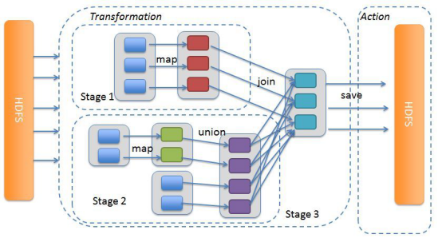

​		在Spark中，DAG生成的流程关键在于**回溯**，在程序提交后，高层调度器将所有的RDD看成是一个Stage，然后对此Stage进行**从后往前的回溯**，**遇到Shuffle就断开，遇到窄依赖，则归并到同一个Stage**。等到所有的步骤回溯完成，便生成一个DAG图。


- 把DAG划分成互相依赖的多个Stage；
- **划分依据是RDD之间的宽依赖**；
- Stage是由一组**并行的Task组成**；
- Stage切割规则：**从后往前，遇到宽依赖就切割Stage**。
  ​	


​	**Stage计算模式**	

- Stage计算模式：**pipeline管道计算模式**；内存迭代模式
  - pipeline只是一种计算思想、模式，来一条数据然后计算一条数据，把所有的逻辑走完，然后落地；
- 准确的说：**一个task处理一串分区的数据，整个计算逻辑全部走完**。
- **每个算子可以看作一个task;**
- **再同一个stage中多个算子之间（窄依赖）组成一个taskSet;**
- **一个taskSet 就是就是i一个PipLine；**
- **多个taskSet 组成一个Stage;**
- **一个taskSet 中可以内存迭代；**


**上图是分区完全一致的情况下,阶段内是100%的内存迭代**

 

如果分区情况不一致,如下图,一个阶段内是大部分内存迭代:


### 总结:

- <span style="color:red;background:white;font-size:20px;font-family:楷体;">**通过阶段划分,可以确保阶段内全部是窄依赖.同时,如果分区一致,全部是内存迭代.**</span>
- <span style="color:red;background:white;font-size:20px;font-family:楷体;">**只有宽依赖才走网络.**</span>（**窄依赖中当分区不一样时也会走网络**）
- <span style="color:red;background:white;font-size:20px;font-family:楷体;">**阶段划分的意义就在于,让大部分数据在内存中完成迭代.只有无可避免的时候(宽依赖)才会走网络传输**</span>


- 还有一个重要的点是:

  - 不要闲的没事在代码里面用API修改算子的分区

  - 因为你修改了会导致窄依赖内分区不一致,就不能完全100%内存迭代.

  - 一般情况下,我们通过配置文件,去配置整体(全局的)的并行度分区数.

    

## 8-3 词汇表


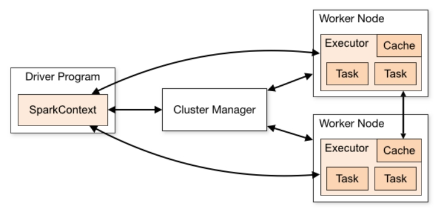 

http://spark.apache.org/docs/2.4.5/cluster-overview.html

The following table summarizes terms you’ll see used to refer to cluster concepts:

| **Term**        | **Meaning**                                                  |
| --------------- | ------------------------------------------------------------ |
| Application     | User program built on Spark. Consists of a **driver program** and **executors** on the cluster. |
| Application jar | A jar containing the user's Spark application. In some cases users will want to create an "uber jar" containing their application along with its dependencies. The user's jar should never include Hadoop or Spark libraries, however, these will be added at runtime. |
| Driver program  | The process running the main() function of the application and creating the SparkContext |
| Cluster manager | An external service for acquiring resources on the cluster (e.g. standalone manager, Mesos, YARN) |
| Deploy mode     | Distinguishes where the driver process runs. In "cluster" mode, the framework launches the driver inside of the cluster. In "client" mode, the submitter launches the driver outside of the cluster. |
| Worker node     | Any node that can run application code in the cluster        |
| Executor        | A process launched for an application on a worker node, that runs tasks and keeps data in memory or disk storage across them. Each application has its own executors. |
| Task            | A unit of work that will be sent to one executor             |
| Job             | A parallel computation consisting of multiple tasks that gets spawned in response to a Spark action (e.g. save, collect); you'll see this term used in the driver's logs.<br>一个Job = 一个DAG;<br>一个Application = 多个Job |
| Stage           | Each job gets divided into smaller sets of tasks called **stages** that depend on each other (similar to the map and reduce stages in MapReduce); you'll see this term used in the driver's logs. |

 

 

## 8-4 Spark内存迭代

我们说Spark的性能对比MR是划时代的。主要原因是**基于内存的迭代**，具体是如何迭代的呢？

 

我们先明白一个概念：DAG

前面说过，<span style="color:red;background:white;font-size:20px;font-family:楷体;">**DAG是一个有向无环图，而有向无环图中的每一个节点，就是一个个的算子。**</span>

 

- 首先，**MR的计算模型中，只有2个算子，一个Map 一个Reduce**。
  - **M->R 的迭代需要走HDFS 硬盘；**
  - **同时两个MR之间也需要通过HDFS硬盘；**

仅有的两个算子，就导致了许多复杂的任务很难用这两个算子计算出来。

很多复杂任务需要进行MR任务的迭代计算，也就是一个MR结束后下一个MR紧接着启动。

如果将这一整个复杂任务描述为DAG的话，类似于：

 

 

 

反之看一下算子丰富的Spark任务，如果这个复杂任务用Spark开发，其DAG可能是类似这样：

 

所以，我们说Spark比MR效率高主要就是2个原因：

- 1.**MR计算模型中，Map算子和Reduce算子进行数据传输需要通过硬盘进行**
- 2.**MR计算模型的算子匮乏，只有Map和Reduce两个算子，导致复杂任务需要串接多个MR任务，中间的传输都经过HDFS硬盘**


​		**也就是M和R之间走硬盘，多个MR之间也走硬盘，**同时涉及到多次的MapReduce任务的启动和释放，对效率很影响。

​		反观Spark（Flink），由于算子丰富，任务基本上都能一个Spark任务搞定，这就避免了多个Spark任务串联。同时，在Spark内部，多个算子之间的数据沟通是通过内存或者网络进行直接传输的，避免了低效的硬盘传输。

 

**为什么可以内存传输或者网络直传呢？**

- **内存传输**
  - **分布式集群有多个节点；**
  - **一个节点有多个Executor;**
  - **一个Executor有多个Task;**
  - **Spark的最小执行单位是Task也就是单个线程;**
  - **一个算子可以被并行执行，每个并行就是一个线程（一个task）**
- **网络传输**
  - 如果算子A的所有Task在Executor1、3中执行，算子B的所有Task运行在Executor2、4中执行。算子AB的关系是 先计算A然后基于A的结果计算B

 

那么执行可能为：

\- 如果Executor1和3在同一个节点之上，那么内存传输即可

\- 如果Executor3和5在不同节点上，那么数据走网络传输即可

 

 

Spark会尽量安排DAG中的数据流转在内存中流转。尽量避免网络。

实在不行走网络，也比MR的硬盘快了太多了。


## 8-5 Spark基本概念

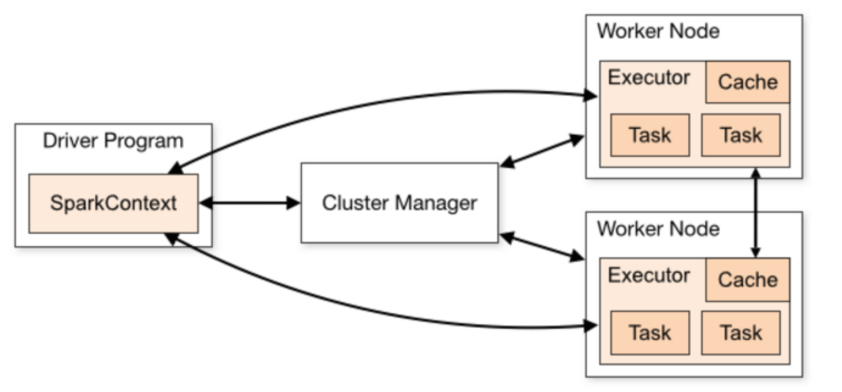


- 官方文档：[http://spark.apache.org/docs/2.4.5/cluster-overview.html#glossary](#glossary)

- Spark Application运行时，涵盖很多概念，主要如下表格：


- 1.**Application**：
  - 应用,就是程序员编写的Spark代码,如WordCount代码

 

- 2.**Driver 任务调度、分配**：
  - 驱动,就是用来执行main方法的JVM进程,里面会执行一些Driver端的代码,如创建SparkContext,设置应用名,设置日志级别...

 

- 3.**SparkContext 上下文环境**:	
  - Spark运行时的上下文环境,用来和ClusterManager(**AppMaster**)进行通信的,并进行资源的申请、任务的分配和监控等

 

- 4.**ClusterManager 集群管理器**：
  - 集群管理器,对于Standalone模式,就是**AppMaster,**对于Yarn模式就是ResourceManager/ApplicationMaster,在集群上做统一的资源管理的进程

 

- 5.Worker: （**只有StandAlone模式下才有Master  和 Worker**）
  - 工作节点,是拥有CPU/内存的机器,是真正干活的节点。Yarn模式中就是nodeManager

 

- 6.**Executor 进程**：
  - 运行在Worker中的JVM进程!

 

- 7.RDD：
  - **弹性分布式数据集**

 

- 8.DAG：
  - 有向无环图,就是根据Action形成的RDD的执行流程图---静态的图

 

- 9.Job：
  - 作业,按照DAG进行执行就形成了Job---按照图动态的执行
  - **一个Action 就是一个Job;**

 

- 10.Stage：
  - DAG中,根据**shuffle 宽依赖划分出来**的一个个的执行阶段!

 

- 11.Task：
  - 一个分区上的一系列操作（算子）(pipline上的一系列操作)就是一个Task,同一个Stage中的多个Task可以并行执行!(每一个Task由线程执行),所以也可以这样说:Task(线程)是运行在Executor(进程)中的最小单位!

 

- 12.TaskSet:
  - 任务集,就是同一个Stage中的各个Task组成的集合!


## 8-6 Job调度流程


- Spark运行基本流程

  - 1.当一个Spark应用被提交时，首先需要为这个Spark Application构建基本的运行环境，即由任务控制节点(Driver)创建一个SparkContext(还会构建DAGScheduler和TaskScheduler)

    

  - 2.SparkContext向资源管理器注册并申请运行Executor资源；

    

  - 3.资源管理器为Executor分配资源并启动Executor进程，Executor运行情况将随着心跳发送到资源管理器上；

    

  - 4.SparkContext**根据RDD的依赖关系构建成DAG图**，并提交给**DAGScheduler进行解析划分成Stage**，并把该**Stage中的Task组成的Taskset发送给TaskScheduler**。

    

  - 5.**TaskScheduler将Task发放给Executor运行**，同时SparkContext将应用程序代码发放给Executor。

    

  - 6.Executor将Task丢入到线程池中执行，把执行结果反馈给任务调度器，然后反馈给DAG调度器，运行完毕后写入数据并释放所有资源。

    

### Spark运行基本流程总结：

- **Driver 创建入口SparkContext 、DAGScheduler 、TaskScheduler；**
- **SparkContext 想ResouceManager 申请资源；**
- **ResourceManager 分配nodeManager上的资源并启动Executor, Executor与ResourceManager心跳包；**
- **SparkContext 根据RDD 依赖关系构建DAG并交给DAGScheduler；**
- **DAGScheduler 划分Stage,并将Stage 中的Task提交给TaskScheduler 管理；**
- **TaskScheduler 将Task 分配给Executor 去执行；**
- **Executor执行完后反馈结果给Driver,并释放资源；**


​		Spark Application应用的用户代码都是**基于RDD的一系列计算操作**，实际运行时，这些**计算操作是Lazy执行的**，并不是所有的RDD操作都会触发Spark往Cluster上提交实际作业，基本上**只有一些需要返回数据或者向外部输出的操作才会触发实际计算工作（Action算子）**，其它的变换操作基本上只是生成对应的RDD记录依赖关系（Transformation算子）。
​     

​		当RDD调用Action函数（比如count、saveTextFile或foreachPartition）时，触发一个Job执行，调度中流程如下图所示：


Spark RDD通过其Transactions操作，形成了RDD血缘关系图，即DAG，最后通过Action的调用，触发Job并调度执行。


Spark的任务调度总体来说分两路进行:**Stage级的调度和Task级的调度**

- **DAGScheduler负责Stage级的调度**，主要是将DAG依据RDD宽依赖切分成若干Stages，并将每个Stage打包成TaskSet交给TaskScheduler调度。
- **TaskScheduler负责Task级的调度**，将DAGScheduler给过来的TaskSet按照指定的调度策略分发到Executor上执行，调度过程中SchedulerBackend负责提供可用资源，其中SchedulerBackend有多种实现，分别对接不同的资源管理系统。


总结： 一个Spark应用程序包括Job、Stage及Task：

- **一个Job 就有一个DAG;**

-  <span style="color:red;background:white;font-size:20px;font-family:楷体;">**Job/DAG是以Action方法为界，遇到一个Action方法则触发一个Job；**</span>

-  <span style="color:red;background:white;font-size:20px;font-family:楷体;">**Stage是Job的子集，以RDD宽依赖(即Shuffle)为界，遇到Shuffle做一次划分；**</span>

-  <span style="color:red;background:white;font-size:20px;font-family:楷体;">**Task是Stage的子集，以并行度(分区数)来衡量，分区数是多少，则有多少个task。**</span>


## 8-7 扩展阅读：Spark并行度

​		Spark作业中，**各个stage的task/partitions/parallelism数量**，代表了Spark作业在各个阶段stage的并行度！

### 8-7-1 资源并行度与数据并行度

在Spark Application运行时，并行度可以从两个方面理解：

-  1）、**资源的并行度(资源总量)：由节点数(executor)和cpu数(core)决定的**

-  2）、**处理的并行度(计算的时候的分区数)：task的数据，partition大小**

  - task又分为map时的task和reduce(shuffle)时的task；

  - task的数目和很多因素有关:

    - 资源的总core数，
    - spark.default.parallelism参数，
    - spark.sql.shuffle.partitions参数，
    - 读取数据源的类型,
    - shuffle方法的第二个参数,
    - repartition的数目等等。
    
    
    
    如果core有多少Task就有多少，那么有些比较快的task执行完了，一些资源就会处于等待的状态。
    如果Task的数量多，能用的资源也多，那么并行度自然就好。
    如果Task的数据少，资源很多，有一定的浪费，但是也还好。
    如果Task数目很多，但是资源少，那么会执行完一批，再执行下一批。
    所以官方给出的建议是，**这个Task数目要是core总数的2-3倍为佳。**
    
    

### 8-7-2 案例1

将Task/Partition/Parallelism数量设置成与Application总CPU Core 数量相同

150个core，理想情况，设置150 Task

与理想情况不同的是：

有些Task会运行快一点，比如50s就完了，

有些Task可能会慢一点，要一分半才运行完，

<span style="color:blue;background:white;font-size:20px;font-family:楷体;">**如果你的Task数量，刚好设置的跟CPU Core数量相同，也可能会导致资源的浪费，比如150 Task，10个先运行完了，剩余140个还在运行，但是这个时候，就有10个CPU Core空闲出来了，导致浪费。**</span>

如果设置2~3倍，那么一个Task运行完以后，另外一个Task马上补上来，尽量让CPU Core不要空闲。

所以，<span style="color:red;background:white;font-size:20px;font-family:楷体;">**官方推荐，Task数量，设置成Application总CPU Core数量的2~3倍（150个cpu core，设置task数量为300~500**</span>

 

 

参数**spark.defalut.parallelism**默认是没有值的，如果设置了值，是在shuffle的过程才会起作用


### 8-7-3 案例2

当提交一个Spark Application时，设置资源信息如下，基本已经达到了集群或者yarn队列的资源上限：

 


​		**Task设置为100个task** ，平均分配一下，每个executor 分配到2个task，每个executor 剩下的一个cpu core 就浪费掉了！
​		虽然分配充足了，但是问题是：并行度没有与资源相匹配，导致你分配下去的资源都浪费掉了。<span style="color:red;background:white;font-size:20px;font-family:楷体;">**合理的并行度的设置，应该要设置的足够大，大到可以完全合理的利用你的集群资源**</span>。可以调整Task数目，<span style="color:red;background:white;font-size:20px;font-family:楷体;">**按照原则：Task数量，设置成Application总CPU Core数量的2~3倍**</span>


## 8-8 Spark Shuffle 机制 （面试重点）


### 8-8-1 原理

https://blog.csdn.net/u012369535/article/details/90757029

 

MapReduce框架中Shuffle过程，整体流程图如下：


Spark在DAG调度阶段会将**一个Job划分为多个Stage，上游Stage做map工作，下游Stage做reduce工作，其本质上还是MapReduce计算框架**。Shuffle是连接map和reduce之间的桥梁，它<span style="color:red;background:white;font-size:20px;font-family:楷体;">**将map的输出对应到reduce输入中**</span>，涉及到序列化反序列化、跨节点网络IO以及磁盘读写IO等。


Spark的Shuffle分为**Write和Read两个阶段，分属于两个不同的Stage**，前者是Parent Stage的最后一步，后者是Child Stage的第一步。


​		执行Shuffle的主体是Stage中的并发任务，这些**任务分ShuffleMapTask和ResultTask**两种，<span style="color:red;background:white;font-size:20px;font-family:楷体;">**ShuffleMapTask要进行Shuffle，ResultTask负责返回计算结果，一个Job中只有最后的Stage采用ResultTask，其他的均为ShuffleMapTask**</span>。如果要按照map端和reduce端来分析的话，ShuffleMapTask可以即是map端任务，又是reduce端任务，因为Spark中的Shuffle是可以串行的；ResultTask则只能充当reduce端任务的角色。
​		Spark在1.1以前的版本一直是采用**Hash Shuffle**的实现的方式，到1.1版本时**参考Hadoop MapReduce**的实现开始引入<span style="color:red;background:white;font-size:20px;font-family:楷体;">**Sort Shuffle**</span>，在1.5版本时开始**Tungsten钨丝计划，引入UnSafe Shuffle优化内存及CPU的使用**，在1.6中**将Tungsten统一到Sort Shuffle中**，实现自我感知选择最佳Shuffle方式，<span style="color:red;background:white;font-size:20px;font-family:楷体;">**到的2.0版本，Hash Shuffle已被删除，所有Shuffle方式全部统一到Sort Shuffle一个实现中。**</span>


具体各阶段Shuffle如何实现，如下：


### 8-8-2 总结

#### 8-8-2-1 Spark的shuffle机制如何理解？

1. 在RDD之间出现了<span style="color:red;background:white;font-size:20px;font-family:楷体;">**宽依赖**</span>的时候会出现Shuffle机制；
2. shuffle分为两个阶段 ： **上游stage的writeshuffle ，下游stage的readshuffle;**
3. Spark 目前使用shuffle实现方式是： **Sort Shuffle**;
4. **Sort Shuffle 实现流程（普通机制）：**
   1. **先将数据写入内存数据结构中；**
   2. **每写一条数据进入内存数据结构，就会判断是否达到了Storage内存的临界值；**
   3. **如果达到临界值就会将内存数据结构中的数据溢写到磁盘中；**
   4. **再溢写之前需要根据key排序；（方便生成index文件查询使用）**
   5. **每次溢写后都会生成一个文件，最后将这些文件合并成一个大的数据文件和一个index文件；** 
   6. **最后下游的stage根据index文件去读取数据文件；**


#### 8-8-2-2 ShuffleWriter分为几类？

- **ShuffleWriter分为三类：**

  - **ByPassMergeSortShuffleWriter:**

    - **没有使用map端预聚合；比如使用的groupbykey;**

    - **分区数小于参数：spark.shuffle.sort.bypassMergeThreshold  默认：200；**

      

  - **UnsafeShuffleWriter:**

    - **判断序列化支持relacaotion;**

    - **有定义聚合器；**

    - **分区数小于16777215；**

      

  - **[SortShuffleWriter]():** 用最多

    - **不满足上面的条件就使用sortshufflewriter;**

    


## 8-9 Spark的内存管理


- 当内存不足时序列化到磁盘中，Spark有两种序列化
  - **java序列化；**
  - **kryo序列化； 10倍；**


## 8-10 如何选择缓存级别；


# 9- 面试题：


## 9-0 你对Spark的RDD是如何理解的？

### 9-0-1 讲解RDD是什么、RDD五大特性

- [弹性分布式数据集]();
  - [不可变的集合]()；
  - [分区的集合]()；
  - [并行计算]()；
  - [有依赖关系]()；
- **每个RDD都是有分区的(分布式)**；
- **每个算子作用于每个分区上**；
- **RDD之间相互依赖**;
- **key-value 数据可自定义分区器**；
- **移动数据不如移动算法**;


### 9-0-2 讲解RDD的原理是什么

- 分布式的[**数据抽象**](),也就是用该抽象,可以[**表示分布式的集合**](),那么可以基于这个分布式集合进行计算操作；
- 抽象的数据模型，<span style="color:red;background:white;font-size:20px;font-family:楷体;">**不同RDD之间的转换操作之间还可以形成依赖关系，进而实现管道化，从而避免了中间结果的存储，大大降低了数据复制、磁盘IO和序列化开销**</span>；


### 9-0-3 RDD在工作中怎么使用？

- 有三种方式创建RDD:
  - sc.textfile；
  - [**sc.makerdd/paralleise；**]()
  - [**RDD与DataFrame、DataSet之间的转换;**]()


### 9-0-4 RDD常用的算子

- 算子的分类：

  - transformation 算子： <span style="color:red;background:white;font-size:20px;font-family:楷体;">**返回一个新的RDD;**</span>
    - <span style="color:red;background:white;font-size:20px;font-family:楷体;">**所有Transformation函数都是Lazy，不会立即执行，需要Action函数触发;**</span>
  - action 算子：<span style="color:red;background:white;font-size:20px;font-family:楷体;">**返回值不是RDD(无返回值或返回其他的)**</span>
    - <span style="color:red;background:white;font-size:20px;font-family:楷体;">**可以在Action时对RDD操作形成DAG有向无环图进行Stage的划分和并行优化，这种设计让Spark更加有效率地运行。**</span>

- 获取RDD分区数目两种方式
  - **rdd.getNumPartitions();**
  - **rdd.partitions.length;**
- 基本算子
  - map、flatmap、filter、foreach、saveAsTextFile......
- 分区算子
  - mapPartitions 、 foreachPartition ；
  - 像这种带有Partitions 的算子都是**批处理**的算子。
- 重分区算子
  - repartition、 coalesce、partitionBy
- 聚合算子
  - 不带key聚合算子
    - **sum:简单的求和；**
    - **reduce：可以自定义计算方法（加减乘除）；**
    - **fold:在reduce基础上 + 可初始化值；**
    - **aggregate: 在fold基础上 + 分区内的计算方法 + 分区间的计算方法；**
  - 带key 聚合算子 ： **groupByKey 、 reduceByKey、 foldByKey、aggregateByKey**
    - **groupByKey:简单的求和；**
    - **reduceByKey：可以自定义计算方法（加减乘除）；**
    - **foldByKey:在reduce基础上 + 可初始化值；**
    - **aggregateByKey: 在fold基础上 + 分区内的计算方法 + 分区间的计算方法；**
  - <span style="color:red;background:white;font-size:20px;font-family:楷体;">**groupByKey 与 reduceByKey的区别是？**</span> 

    - <span style="color:red;background:white;font-size:20px;font-family:楷体;">**reduceByKey 有预聚合；**</span>
    - <span style="color:red;background:white;font-size:20px;font-family:楷体;">**groupByKey 没有预聚合；**</span>
- join关联算子
  - **join: 内关联；**
  - **leftOuterJoin: 左外关联；**
  - **rightOuterJoin: 右外关联；**
  - **fullOuterJoin:全关联；**
  - **union:合并，笛卡尔积；**
  - 关联条件：**以两个RDD 的两个key 关联；** 

- 排序算子 ：sortByKey 、sortBy

  - **sortByKey**
    - **按照Key进行排序**，默认升序；
    - **第一个参数为false 时，为降序**；
    - <span style="color:red;background:white;font-size:20px;font-family:楷体;">**注意： 如果不指定第二个参数（分区数），默认只是分区内的排序；**</span>
  - **sortBy**
    - **自定义排序规则**；
    - **参数1：按照谁排序；**
    - **参数2：升序(true),降序(false);**
    - **参数3：指定分区数**,(<span style="color:red;background:white;font-size:20px;font-family:楷体;">**注意： 如果分区数不是1，只做分区内的排序**</span>)
  - **top**
    - 如果是Key/Value对，**按照Key降序排序**;
    - 参数1：求top 几；
    - 参数2：**是个隐士参数，：Ordering.by() 。 指定使用哪个排序；**
    - <span style="color:red;background:white;font-size:20px;font-family:楷体;">**注意：该算子仅用于结果数据比较小的时候，如果数据量大会oom Driver;**</span>

  - **orderby**
    - [**全局排序**]()


### 9-0-5 引出Spark的RDD的宽窄依赖

​		对于日常工作中常用的昂贵的算子都会使用cache或persist方法将数据
​		缓存在内存或本地磁盘中，如果考虑到安全性，需要使用checkpoint可以
​		将数据和元数据放置在hdfs的分布式文件系统中


## 9-1 Spark 集群角色（重点）

**四个角色Master Worker Driver Executor**

- Local模式
  - **一个JVM进程中通过线程模拟整个Spark的运行环境；**
  - JVM 进程能拿到多少资源，就是整个Spark能使用的资源；
  - Local模式下，使用**Driver线程 、Executor线程**来维持集群环境；

- StandAlone模式
  - <span style="color:red;background:white;font-size:20px;font-family:楷体;">**注意： 只有在standalone模式下， 才有master worker  这两个角色**</span>
  - master :  **任务调度 、分配 + 资源调度、分配 + worker管理** ；
  - worker : 计算；
  - **master(管理资源、任务) + worker(计算)**

- Yarn 模式
  - **资源管理和分配，无需spark操心，由Yarn集群管理；**
  - **spark只负责计算即可；**
  - **Yarn(资源管理) + Spark(计算)**
  - **Driver进程：任务管理、调度**
  - **Executor进程：计算；**
  - **client 模式：Driver是独立的进程；**
  - **cluster 模式：Driver 和 Appmaster 在一起；**


## 9-2 spark-submit 面试题


## 9-3 简单介绍一下DAG

- **DAG 叫做有向无环图；**
- **是根据RDD的一个依赖关系构建的，RDD的迭代关系图；**
- **一个Action算子就是一个DAG/JOb;**
- **DAG 根据宽依赖划分Stage;**
- **Stage中的Task分发给Executor去运行计算；**


## 9-4 简单介绍一下Job的基本流程


- **Driver 创建入口SparkContext 、DAGScheduler 、TaskScheduler；**
- **SparkContext 向ResouceManager 申请资源；**
- **ResourceManager 分配nodeManager上的资源并启动Executor, Executor与ResourceManager心跳包；**
- **SparkContext 根据RDD 依赖关系构建DAG并交给DAGScheduler；**
- **DAGScheduler **
  - **根据RDD的宽依赖划分Stage和tasks;**
  - **准备提交Stage;**
  - **并将Stage 中的Tasks提交给TaskScheduler 管理；**
- **TaskScheduler**
  - **管理、调度所有Task；**
  - **将Task 分配给Executor 去执行；**
  - **重试一些失败任务**；(对于失败的任务会拉取其他线程执行 （**推测执行**）)
- **Executor执行完后反馈结果给Driver,并释放资源；**
- [**推测执行**]()：
  - 一个stage里面的不同task的执行时间可能不一样，[有的task很快就执行完成了，而有的可能执行很长一段时间也没有完成]()。造成这种情况的原因可能是集群内机器的配置性能不同、网络波动、或者是由于**数据倾斜引起的**。而[**推测执行(speculative)**]()就是[当出现同一个stage里面有task长时间完成不了任务]()，spark就会[在不同的executor上再启动一个task来跑这个任务]()，然后看哪个task先完成，就取该task的结果，并kill掉另一个task。其实对于集群内有不同性能的机器开启这个功能是比较有用的。


## 9-5 简单介绍一下Spark的shuffle 机制；

1. 在RDD之间出现了<span style="color:red;background:white;font-size:20px;font-family:楷体;">**宽依赖**</span>的时候会出现Shuffle机制；
2. shuffle分为两个阶段 ： **上游stage的writeshuffle ，下游stage的readshuffle;**
3. Spark 目前使用shuffle实现方式是： **byPass 、UnsafeShuffleWriter 、Sort Shuffle;**
4. **Sort Shuffle 实现流程（普通机制）：**
   - **先将数据写入内存数据结构中；**
   - **每写一条数据进入内存数据结构，就会判断是否达到了Storage内存的临界值；**
   - **如果达到临界值就会将内存数据结构中的数据溢写到磁盘中；**
   - **再溢写之前需要根据key排序；（方便生成index文件查询使用）**
   - **每次溢写后都会生成一个文件，最后将这些文件合并成一个大的数据文件和一个index文件；** 
   - **最后下游的stage根据index文件去读取数据文件；**


## 9-6 介绍一下Spark并行度

- Spark并行度分为两个：

  - **资源的并行度(资源总量)：由节点数(executor)和cpu数(core)决定的**

  - **处理的并行度(计算的时候的分区数)：task的数据，partition大小**

    - task又分为map时的task和reduce(shuffle)时的task；
    - task的数目和很多因素有关:

      - 资源的总core数，
      - spark.default.parallelism参数，
      - spark.sql.shuffle.partitions参数，
      - 读取数据源的类型,
      - shuffle方法的第二个参数,
      - repartition的数目等等。

    

## 9-7 介绍一下Spark 内存管理

### 9-7-1 内存分配

- **总内存**
  - **预留内存（300M）当总内存非常大时，可以忽略；**
  - **可用内存：usable memory;**
    - **其他内存：用于用户自定义的数据结构以及spark的元数据存储；**
    - **统一内存：用于Storage 和 Exection 的内存；**
      - **Storage 内存：用于存放RDD 数据；**
      - **Exection内存：用于存放Shuffle时生成的临时数据；**


### 9-7-2 内存动态占用机制

- 规则如下：
  - 设定基本的**存储内存(storage)和执行内存(execution**)区域:spark.storage.storageFraction
  - 双方的空间**都不足时**， 则**溢写到硬盘**；
  - **若自己的空间不足，而对方有空余时**，<span style="color:red;background:white;font-size:20px;font-family:楷体;">**可借用对方的空间；(存储空间不足：不足存放一个完整的block)**</span>
  - **执行空间不足时，如果有被对方占用的空间**，<span style="color:red;background:white;font-size:20px;font-family:楷体;">**可以让对方见该数据溢写到磁盘中，强制要回空间；**</span>
  - **存储空间不足时，如果有被对方占用的空间**，<span style="color:red;background:white;font-size:20px;font-family:楷体;">**无法让对方“归还”，因为Shuffle过程复杂，优先级高；**</span>


## 9-8 Spark如何实现容错？

1. Spark会首先查看内存中是否已经**cache或persist**当前的rdd的链条;
2. 否则查看**linage**是否**checkpoint值hdfs中**;
3. 最后根据依赖链构建血缘关系**重建rdd**


## 9-9 Spark的任务执行?

1-Spark一个Application拥有**多个job**，**一个action**操作会出发**一个Job(DAG)**划分
2-Spark**一个Job/DAG有多个Stages**，发生**shuffle**操作触发一个Stage的划分
3-**一个Stage有很多个tasksets**，**一个RDD的不同的分区就是代表的taskset**，很多的taskset组成tasksets
4-一个taskset由很多个RDD的分区组成，**一个RDD的分区的数据需要由一个task线程拉取执行，而不是进程**


## 9-10 Spark的Transformation算子有几类？

- 3类
  - **单value**：如mapValue，map，filter
  - **双value**：union，zip，distinct
  - **key-value类型**：reduceBykey(一定不属于Action算子)，foldByKey


## 9-11 RDD创建的三种方法？


## 9-12-1 持久化和Checkpoint的区别

- 问题:
  缓存持久化 VS Checkpoint 开发中用哪个?

- 答案:
  **缓存持久化(保证后续再次使用的速度) + Checkpoint(保证安全)** 

- 区别:

  - 1）、**存储位置**

    -  **Persist 和 Cache 只能保存在本地的磁盘和内存中(或者堆外内存)；**
    -  **Checkpoint 可以保存数据到 HDFS 这类可靠的存储上；**

  - 2）、**生命周期**

    - Cache和Persist的RDD会在**程序结束后会被清除或者手动调用unpersist方法**；**或者LRU(最近最少使用机制删除)**
    - Checkpoint的RDD在程序结束后依然存在，**不会被删除**；

  - 3）、**[Lineage]()(血统、依赖链、依赖关系)**

    - Persist和Cache，**不会丢掉RDD间的依赖链/依赖关系**，因为这种缓存是不可靠的，如果出现了一些错误(例如 Executor 宕机)，需要通过回溯依赖链重新计算出来；
    - **Checkpoint会斩断依赖链**，因为Checkpoint会把结果保存在HDFS这类存储中，更加的安全可靠，一般不需要回溯依赖链；

    

## 9-12-2 如何选择缓存级别；

- **Spark建议如何选择cache或persist的级别？**

  - 尽可能的放到**内存**；
  - 如果内存放不下， 尝试使用基于序列化，可以使用**kryo序列化**；
  - 一般不要放在磁盘，除非这个算子非常昂贵；

- **如何释放缓存？**

  - unpersist();
  
  - rdd.unpersist或df.uncache，[如果没有显示调用方法，使用什么算法自动释放内存？]()
  - **LRU机制**：最近最少使用；
  
  


## 9-13 介绍一下Spark中的共享变量

### 9-13-1 广播变量

- 原因：
  - rdd1(大) join rdd2(小)；
  - **让一个Executor中的所有task 共用一个公有的数据rdd2；**

- 使用方法：
  - **Driver端：发布广播变量**：val listBroadcast: Broadcast[List[String]] = **sc.broadcast(list)**
  - **Executor端：获取广播变量**： val listValue = **listBroadcast.value**

- 原理：

​		[**广播变量只在每个节点（Worker or Executor）缓存一份只读变量，共这个节点下的所有Task使用。**]()

### 9-13-2 累加器

- 原理：

  - **用于[多个节点对一个变量]()进行共享性的操作**;

- 特性：

  - **多个task对一个变量并行操作的功能；**
  - **task只能对Accumulator进行累加操作，不能读取Accumulator的值；**
  - **只有Driver程序可以读取Accumulator的值**；
  - [**累加器存在于Driver端；**]()

- 种类：

  - <span style="color:red;background:white;font-size:20px;font-family:楷体;">**LongAccumulator用来累加整数型，**</span>
  - <span style="color:red;background:white;font-size:20px;font-family:楷体;">**DoubleAccumulator用来累加浮点型，**</span>
  - <span style="color:red;background:white;font-size:20px;font-family:楷体;">**CollectionAccumulator用来累加集合元素。**</span>

- 使用方法：

  - **定义累加器**：val accumulator: LongAccumulator = **sc.longAccumulator("mycounter")**
  - **累加计算**：accumulator.**add**(1L)；
  - **获取累加值**：accumulator.**value**；

- 扩展：

  - **自定义累加器**

    - **第一步、继承AccumulatorV2，实现相关方法；**
    - **第二步、创建自定义Accumulator的实例，然后在SparkContext上注册它；**

    

- 注意：

  - <span style="color:red;background:white;font-size:20px;font-family:楷体;">**累加器在Driver中；**</span>

### 9-13-3 使用累加器的坑

- 问题： 定义累计器之后执行累加，只有触发Action操作才能够得到结果；[如果在触发action之后，又一次触发action会发生什么现象？]()
- 回答：**累加器会多次累加**；
- 解决方法：[使用Accumulator时，为了保证准确性，只使用一次action操作]()。**如果需要使用多次则使用cache或persist操作切断依赖**。

``` scala
scala> val counter2 = sc.longAccumulator("counter") 
	counter2: org.apache.spark.util.LongAccumulator = LongAccumulator(id: 227, name: Some(counter), value: 0)

scala>  val rdd2=sc.parallelize(Seq(1, 2, 3, 4, 5)) .map(counter2.add(_)).cache() 
	rdd2: org.apache.spark.rdd.RDD[Unit] = MapPartitionsRDD[9] at map at <console>:26
```


## 9-14 两种模式详细流程

### 9-14-1 Client模式

- 在YARN Client模式下，Driver在任务提交的本地机器上运行，示意图如下：

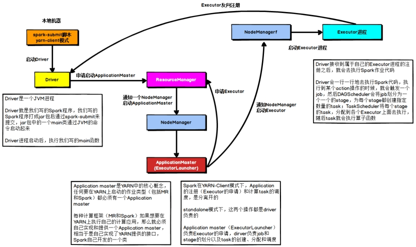 


- 具体流程步骤如下：

  - 1）、Driver在任务提交的本地机器上运行，Driver启动后会和ResourceManager通讯**申请启动ApplicationMaster**；

    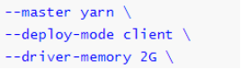

  - 2）、随后ResourceManager分配Container，在合适的NodeManager上启动ApplicationMaster，此时的ApplicationMaster的功能相当于**一个ExecutorLaucher，只负责向ResourceManager申请Executor内存**；

    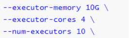

  - 3）、ResourceManager接到ApplicationMaster的资源申请后会分配Container，然后ApplicationMaster在资源分配**指定的NodeManager上启动Executor进程**；

    

  - 4）、Executor进程启动后会向Driver反向注册，Executor全部注册完成后Driver开始**执行main函数**；

    

  - 5）、之后执行到**Action算子时，触发一个Job，并根据宽依赖开始划分Stage，每个Stage生成对应的TaskSet，之后将Task分发到各个Executor上执行**。


### 9-14-2 cluster模式

- 在YARN Cluster模式下，Driver运行在NodeManager Contanier中，此时Driver与AppMaster合为一体，示意图如下：


- 具体流程步骤如下：

  - 1）、任务提交后会和ResourceManager**通讯申请启动ApplicationMaster**;

    

  - 2）、随后ResourceManager分配Container，在合适的NodeManager上 **启动ApplicationMaster，此时的ApplicationMaster就是Driver**；

    ​	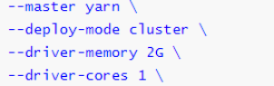

  

  - 3）、Driver启动后**向ResourceManager申请Executor内存**，ResourceManager接到ApplicationMaster的资源申请后会分配Container,然后**在合适的NodeManager上启动Executor进程**;

    ​		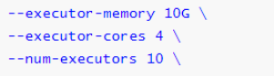

    

  - 4）、Executor进程启动后会向Driver反向注册;

    

  - 5）、Executor全部注册完成后**Driver开始执行main函数，之后执行到Action算子时，触发一个job，并根据宽依赖开始划分stage，每个stage生成对应的taskSet，之后将task分发到各个Executor上执行**;


### 9-14-3 Spark on Yarn 流程详解

1. Client 运行spark-submit提交一个任务；
2. **Client向RM申请启动AM和Driver；**
3. RM选择一个NM中的Container资源容器启动AM和Driver;
4. AM向RM申请资源用于启动Executor；
5. RM返回NM列表；
6. AM连接其它的NM并在Container中启动Executor;
7. Executor 反向注册给Driver;
8. **Driver端创建两个任务：DAGScheduler 、TaskScheduler;**
9. **Driver端根据Action算子划分job,回溯RDD依赖关系构建DAG图；**
10. **DAGScheduler 将DAG图根据宽依赖划分成Stages,每个Stage划分成Task;**
11. **DAGScheduler 将每组Task提交给TaskScheduler；**
12. **TaskScheduler 将一个个task发送给NM中的executor中去执行；**
13. **TaskScheduler 还会重启失败的task任务；**
14. NM中的Executor执行完任务将结果反馈给TaskScheduler 再重复步骤11；

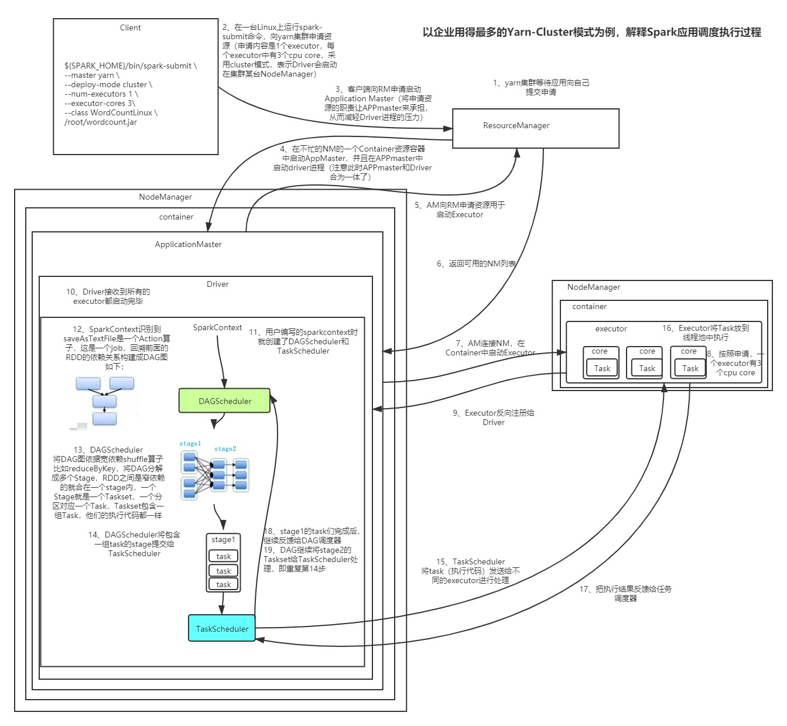

