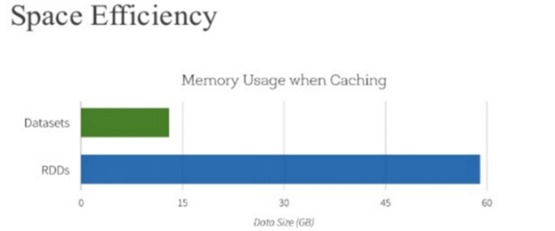
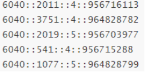

[TOC]


# 1- SparkSQL 概述

## 1-1 前世今生

### 1-1-1 Shark 框架-淘汰了

首先回顾SQL On Hadoopp框架：Hive（可以说Hive时大数据生态系统中第一个SQL框架），架构如下所示：

 

可以发现Hive框架底层就是***\*MapReduce\****，所以在Hive中执行SQL时，往往很慢很慢。

 

Spark出现以后，将HiveQL语句翻译成基于RDD操作，此时Shark框架诞生了。

 

​		Spark SQL的前身是Shark，它发布时Hive可以说是SQL on Hadoop的唯一选择（Hive负责将SQL编译成可扩展的MapReduce作业），鉴于Hive的性能以及与Spark的兼容，Shark由此而生。Shark即Hive on Spark，本质上是通过Hive的HQL进行解析，把HQL翻译成Spark上对应的RDD操作，然后通过Hive的Metadata获取数据库里表的信息，实际为HDFS上的数据和文件，最后有Shark获取并放到Spark上计算。

​		但是Shark框架更多是对Hive的改造，替换了Hive的物理执行引擎，使之有一个较快的处理速度。然而不容忽视的是Shark继承了大量的Hive代码，因此给优化和维护带来大量的麻烦。为了更好的发展，Databricks在2014年7月1日Spark Summit上宣布终止对Shark的开发，将重点放到SparkSQL模块上。


文档：https://databricks.com/blog/2014/07/01/shark-spark-sql-hive-on-spark-and-the-future-of-sql-on-spark.html

 


SparkSQL模块主要将以前依赖Hive框架代码实现的功能自己实现，称为**Catalyst引擎**。

Catalyst: SQL翻译器

 

 


### 1-1-2 SparkSQL 模块

​		从Spark框架1.0开始发布SparkSQL模块开发，直到1.3版本发布SparkSQL Release版本可以在生产环境使用，此时数据结构为**DataFrame = RDD + Schame**。

- 1）、解决的问题
  - Spark SQL 执行计划和优化交给优化器 Catalyst；
  - 内建了一套简单的SQL解析器，可以不使用HQL；
  - 还引入和 DataFrame 这样的DSL API，完全可以不依赖任何 Hive 的组件；


- 2）、新的问题
  - 对于初期版本的SparkSQL，依然有挺多问题，例如只能支持SQL的使用，不能很好的兼容命令式，入口不够统一等；


​        SparkSQL 在 1.6 时代，增加了一个新的API叫做 Dataset，**Dataset 统一和结合了 SQL 的访问和命令式 API 的使用**，这是一个划时代的进步。在 Dataset 中可以轻易的做到**使用 SQL 查询并且筛选数据，然后使用命令式 API 进行探索式分析**。

​		<span style="color:red;background:white;font-size:20px;font-family:楷体;">**Spark 2.x发布时，将Dataset和DataFrame统一为一套API，以Dataset数据结构为主（Dataset = RDD + Schema），其中DataFrame = Dataset[Row]。**</span>


### 1-1-3 Hive 与 SparkSQL

​		从SparkSQL模块前世今生可以发现，从Hive框架衍生逐渐发展而来，Hive框架提供功能SparkSQL几乎全部都有，并且SparkSQL完全兼容Hive，从其加载数据进行处理。

 

​	Hive是将SQL转为MapReduce，SparkSQL可以理解成是将SQL解析成RDD + 优化再执行。


## 1-2 官方定义

SparkSQL模块官方定义：针对结构化数据处理Spark Module模块。

 

主要包含三层含义：

 

- 第一、针对结构化数据处理，属于Spark框架一个部分

  - 结构化数据：一般指数据有固定的 Schema(约束)，例如在用户表中，name 字段是 String 型，那么每一条数据的 name 字段值都可以当作 String 来使用；

    

  - 半结构化数据

  ``` json
  [
  {
      "name": "jack",
      "tel": "1388888888",
  },
  {
      "name": "jack",
      "tel": "1388888888",
      "age":18
  },
  {
      "name": "jack",
      "tel": "1388888888",
      "age": "18"
  }
  ]
  ```

  - n schema信息，包含**字段的名称和字段的类型**；

- 第二、抽象数据结构：DataFrame
  - 将要处理的结构化数据封装在DataFrame中，来源Python数据分析库Pandas和R语言dataframe
  - **DataFrame = RDD + Schema** 信息；

- 第三、分布式SQL引擎，类似Hive框架

  - 从Hive框架继承而来，Hive中提供**bin/hive交互式SQL命令行及HiveServer2服务**，SparkSQL都可以；

  

Spark SQL模块架构示意图如下：

​		


## 1-3 SparkSQL 特性

Spark SQL是Spark用来处理结构化数据的一个模块，主要四个特性：


- **第一、易整合**

  ​	可以使用Java、Scala、Python、R等语言的API操作。

 


- 第二、**统一的数据访问**

    	连接到任何数据源的方式相同。

 


- 第三、**兼容Hive**

    	支持Hive HQL的语法，兼容hive(元数据库、SQL语法、UDF、序列化、反序列化机制)。

 


- 第四、**标准的数据连接**

  ​	可以使用行业标准的JDBC或ODBC连接。

 


SparkSQL模块官方文档：http://spark.apache.org/docs/2.4.5/sql-programming-guide.html

 

# 2- SparkSQL数据抽象

## 2-1 DataFrame

### 2-1-1 引入

​		就易用性而言，对比传统的MapReduce API，Spark的RDD API有了数量级的飞跃并不为过。然而，**对于没有MapReduce和函数式编程经验的新手来说，RDD API仍然存在着一定的门槛**。

​		另一方面，数据科学家们所熟悉的R、Pandas等传统数据框架虽然提供了直观的API，却局限于单机处理，无法胜任大数据场景。

​		为了解决这一矛盾，**Spark SQL 1.3.0在原有SchemaRDD的基础上提供了与R和Pandas风格类似的DataFrame API**。

​		新的DataFrame API不仅可以大幅度降低普通开发者的学习门槛，同时还支持Scala、Java与Python三种语言。更重要的是，由于脱胎自SchemaRDD，DataFrame天然适用于分布式大数据场景。

注意:
		DataFrame它不是Spark SQL提出来的，而是早期在R、Pandas语言就已经有了的。


### 2-1-2 DataFrame是什么

​		**在Spark中，DataFrame是一种以RDD为基础的分布式数据集，类似于传统数据库中的二维表格**。DataFrame与RDD的主要区别在于，前者**带有schema元信息，即DataFrame所表示的二维表数据集的每一列都带有名称和类型。**


​		使得Spark SQL得以洞察更多的结构信息，从而对藏于DataFrame背后的数据源以及作用于DataFrame之上的变换进行针对性的优化，最终达到大幅提升运行时效率。**反观RDD，由于无从得知所存数据元素的具体内部结构，Spark Core只能在stage层面进行简单、通用的流水线优化。**


​		上图中左侧的RDD[Person]虽然以Person为类型参数，但**Spark框架本身不了解Person类的内部结构**。而中间的**DataFrame却提供了详细的结构信息，使得Spark SQL可以清楚地知道该数据集中包含哪些列，每列的名称和类型各是什么**。了解了这些信息之后，Spark SQL的查询优化器就可以进行针对性的优化。后者由于在编译期有详尽的类型信息，编译期就可以编译出更加有针对性、更加优化的可执行代码。官方定义：

- **Dataset**：A DataSet is a distributed collection of data. (分布式的数据集)
- **DataFrame**： A DataFrame is a DataSet organized into named columns.（以列（列名，列类型，列值）的形式构成的分布式的数据集，按照列赋予不同的名称）


DataFrame有如下特性：

``` properties
1）、分布式的数据集，并且以列的方式组合的，相当于具有schema的RDD；
2）、相当于关系型数据库中的表，但是底层有优化；
3）、提供了一些抽象的操作，如select、filter、aggregation、plot；
4）、它是由于R语言或者Pandas语言处理小数据集的经验应用到处理分布式大数据集上；
5）、在1.3版本之前，叫SchemaRDD；
```


### 2-1-3 Schema 信息

查看DataFrame中Schema是什么，执行如下命令：

``` properties
df.schema
```


Schema信息封装在StructType中，包含很多StructField对象，源码。

- **StructType** 定义，是一个样例类，属性为StructField的数组


- **StructField** 定义，同样是一个样例类，有四个属性，其中字段名称和类型为必填


- 自定义Schema结构，官方提供的示例代码：


### 2-1-4 Row

DataFrame中每条数据封装在Row中，Row表示每行数据

如何构建Row对象：要么是传递 **value**，要么传递 **Seq**，官方实例代码：

``` scala
import org.apache.spark.sql._

// Create a Row from values.
Row(value1, value2, value3, ...)

// Create a Row from a Seq of values.
Row.fromSeq(Seq(value1, value2, ...))
```

### 2-1-5 获取Row中每个字段

- 方式一：下标获取，从0开始，类似数组下标获取

   


- 方式二：指定下标，知道类型

  ​	 


- 方式三：通过As转换类型


## 2-2 Dataset

### 2-2-1 引入

​		Spark在Spark 1.3版本中引入了Dataframe，DataFrame是组织到命名列中的分布式数据集合，但是有如下几点限制：

- **编译时类型不安全：** 

  - Dataframe API不支持编译时安全性，这限制了在结构不知道时操纵数据。

  - 以下示例在编译期间有效。但是，执行此代码时将出现运行时异常。

    

 

-  **无法对域对象（丢失域对象）进行操作：**

  - 将域对象转换为DataFrame后，无法从中重新生成它；

  - 下面的示例中，一旦我们从personRDD创建personDF，将不会恢复Person类的原始RDD（RDD [Person]）；

    

 

​		基于上述的两点，从Spark 1.6开始出现Dataset，至Spark 2.0中将DataFrame与Dataset合并，其中DataFrame为Dataset特殊类型，类型为Row。

 

   

​		针对RDD、DataFrame与Dataset三者编程比较来说，Dataset API无论语法错误和分析错误在编译时都能发现，然而RDD和DataFrame有的需要在运行时才能发现。

 


​		此外RDD与Dataset相比较而言，由于Dataset数据使用特殊编码，所以在存储数据时更加节省内存。

 

 

- 总结：

  - Dataset是在Spark1.6中添加的新的接口，是DataFrame API的一个扩展，是Spark最新的数据抽象，结合了RDD和DataFrame的优点。

  

  - **与RDD相比**：保存了**更多的描述信息**，概念上等同于关系型数据库中的二维表；

  
  - **与DataFrame相比**：保存了**类型信息，是强类型的，提供了编译时类型检查**，调用Dataset的方法先会生成逻辑计划，然后被Spark的优化器进行优化，最终生成物理计划，然后提交到集群中运行；

 

### 2-2-2 Dataset 是什么

​		Dataset是**一个强类型的特定领域的对象**，这种**对象可以函数式或者关系操作并行地转换**。

 

​		

​		从Spark 2.0开始，DataFrame与Dataset合并，每个Dataset也有一个被称为一个DataFrame的类型化视图，这种**DataFrame是Row类型的Dataset，即Dataset[Row]**。

 


​		**Dataset API是DataFrames的扩展，它提供了一种类型安全的，面向对象的编程接口。**它是一个强类型，不可变的对象集合，映射到关系模式。在数据集的核心 API是一个称为编码器的新概念，它负责在JVM对象和表格表示之间进行转换。表格表示使用Spark内部Tungsten二进制格式存储，允许对序列化数据进行操作并提高内存利用率。Spark 1.6支持自动生成各种类型的编码器，包括基本类型（例如String，Integer，Long），Scala案例类和Java Bean。

针对Dataset数据结构来说，可以简单的从如下四个要点记忆与理解：

 


​		Spark 框架从最初的数据结构RDD、到SparkSQL中针对结构化数据封装的数据结构DataFrame，最终使用Dataset数据集进行封装，发展流程如下。

 

所以在实际项目中建议使用Dataset进行数据封装，数据分析性能和数据存储更加好。


## 2-3 面试题：如何理解RDD、DataFrame和Dataset


 SparkSQL中常见面试题：如何理解Spark中三种数据结构RDD、DataFrame和Dataset关系？

- **RDD**：
  - RDD（Resilient Distributed Datasets）叫做**弹性分布式数据集**，**是Spark中最基本的数据抽象**，源码中是一个抽象类，代表一个不可变、可分区、里面的元素可并行计算的集合。
  - **编译时类型安全**，但是无论是集群间的通信，还是IO操作都需要对对象的结构和数据进行序列化和反序列化，还存在较大的GC的性能开销，会频繁的创建和销毁对象。

- **DataFrame**：
  - 与RDD类似，DataFrame是一个**分布式数据容器**，不过它更**像数据库中的二维表格**，除了数据之外，还记录这数据的结构信息（即schema）。
  - DataFrame也是**懒执行**的，性能上要比RDD高（主要因为执行计划得到了优化）。
  - 由于DataFrame每一行的数据结构一样，且存在schema中，Spark通过schema就能读懂数据，因此在通信和IO时只需要序列化和反序列化数据，而结构部分不用。
  - Spark能够以二进制的形式序列化数据到JVM堆以外（off-heap：非堆）的内存，这些内存直接受操作系统管理，也就不再受JVM的限制和GC的困扰了。**但是DataFrame不是类型安全的**。

- **Dataset**：
  - **Dataset是DataFrame API的一个扩展**，是Spark最新的数据抽象，结合了RDD和DataFrame的优点。
  - **DataFrame=Dataset[Row]**（Row表示表结构信息的类型），DataFrame只知道字段，但是不知道字段类型，而**Dataset是强类型的，不仅仅知道字段，而且知道字段类型**。
  - 样例类CaseClass被用来在Dataset中定义数据的结构信息，样例类中的每个属性名称直接对应到Dataset中的字段名称。
  - **Dataset具有类型安全检查**，也具有DataFrame的查询优化特性，还支持编解码器，当需要访问非堆上的数据时可以避免反序列化整个对象，提高了效率。


# 3- RDD、DF、DS相关操作

## 3-1 SparkSQL初体验


​		Spark 2.0开始，SparkSQL应用程序入口为**SparkSession**，加载不同数据源的数据，封装到**DataFrame/Dataset**集合数据结构中，使得编程更加简单，程序运行更加快速高效。

 

 


- SparkSession 应用入口

  **SparkSession：这是一个新入口，取代了原本的SQLContext与HiveContext**。 对于DataFrame API的用户来说，Spark常见的混乱源头来自于使用哪个“context”。现在使用SparkSession，它作为单个入口可以兼容两者，注意原本的SQLContext与HiveContext仍然保留，以支持向下兼容。

  

文档：[http://spark.apache.org/docs/2.4.5/sql-getting-started.html#starting-point-sparksession](#starting-point-sparksession)


-  1）、添加MAVEN依赖

``` xml
<dependency>
	    <groupId>org.apache.spark</groupId>
        <artifactId>spark-sql_2.11</artifactId>
        <version>2.4.5</version>
</dependency>
```

- 2)、SparkSession对象实例通过建造者模式构建，代码如下：

  


其中：

​	①表示导入SparkSession所在的包，

​	②表示建造者模式构建对象和设置属性，

​	③**表示导入SparkSession类中implicits对象object中隐式转换函数。**


- 3）、范例演示：构建SparkSession实例，加载文本数据，统计条目数。

``` scala
package cn.itcast.sql

import org.apache.spark.SparkContext
import org.apache.spark.sql.{DataFrame, SaveMode, SparkSession}

/**
 * Author itcast
 * Desc 演示SparkSQL
 */
object SparkSQLDemo00_hello {
  def main(args: Array[String]): Unit = {
    //1.准备SparkSQL开发环境
    println(this.getClass.getSimpleName)
    println(this.getClass.getSimpleName.stripSuffix("$"))
    val spark: SparkSession =SparkSession
      	.builder()
      .appName(this.getClass.getSimpleName.stripSuffix("$"))
      .master("local[*]").getOrCreate()
      
    val sc: SparkContext = spark.sparkContext
    sc.setLogLevel("WARN")

    // 读取 text
    val df1: DataFrame = spark.read.text("data/input/text")
      
    // 读取 json
    val df2: DataFrame = spark.read.json("data/input/json")

    // 读取 csv
    val df3: DataFrame = spark.read.csv("data/input/csv")
      
    // 读取 parquet
    val df4: DataFrame = spark.read.parquet("data/input/parquet")

    df1.printSchema()
    df1.show(false)
      
    df2.printSchema()
    df2.show(false)
      
    df3.printSchema()
    df3.show(false)
      
    df4.printSchema()
    df4.show(false)

    // 写入
    df1.coalesce(1).write.mode(SaveMode.Overwrite).text("data/output/text")
    df2.coalesce(1).write.mode(SaveMode.Overwrite).json("data/output/json")
    df3.coalesce(1).write.mode(SaveMode.Overwrite).csv("data/output/csv")
    df4.coalesce(1).write.mode(SaveMode.Overwrite).parquet("data/output/parquet")

    //关闭资源
    sc.stop()
    spark.stop()
  }
}
```

​		使用SparkSession加载数据源数据，将其封装到DataFrame或Dataset中，直接使用**show**函数就可以显示样本数据（默认显示前20条）。

​		Spark2.0使用全新的SparkSession接口替代Spark1.6中的SQLContext及HiveContext接口来实现其对数据加载、转换、处理等功能。SparkSession实现了SQLContext及HiveContext所有功能。		

​		SparkSession支持从不同的数据源加载数据，并把数据转换成DataFrame，并且支持把DataFrame转换成SQLContext自身中的表，然后使用SQL语句来操作数据。SparkSession亦提供了HiveQL以及其他依赖于Hive的功能的支持。


## 3-2 获取DataFrame/DataSet

​		实际项目开发中，往往需要将RDD数据集转换为DataFrame，本质上就是给RDD加上Schema信息，官方提供两种方式：类型推断和自定义Schema。

官方文档：[http://spark.apache.org/docs/2.4.5/sql-getting-started.html#interoperating-with-rdds](#interoperating-with-rdds)


### 3-2-1 使用样例类

​		当RDD中数据类型CaseClass样例类时，通过**反射Reflecttion获取属性名称和类型**，构建Schema，应用到RDD数据集，将其转换为DataFrame。

``` scala
package cn.itcast.sql

import org.apache.spark.SparkContext
import org.apache.spark.rdd.RDD
import org.apache.spark.sql.{DataFrame, SparkSession}

/**
 * Author itcast
 * Desc 演示基于RDD创建DataFrame--使用样例类
 */
object CreateDataFrameDemo1 {
  case class Person(id:Int,name:String,age:Int)

  def main(args: Array[String]): Unit = {
    //1.准备环境-SparkSession
    val spark: SparkSession = SparkSession
      .builder()
      .appName("SparkSQL")
      .master("local[*]")
      .getOrCreate()
      
    val sc: SparkContext = spark.sparkContext
    sc.setLogLevel("WARN")

    //2.加载数据
    val lines: RDD[String] = sc.textFile("data/input/person.txt")

    //3.切割
    //val value: RDD[String] = lines.flatMap(_.split(" "))//错误的
    val linesArrayRDD: RDD[Array[String]] = lines.map(_.split(" "))

    //4.将每一行(每一个Array)转为样例类(相当于添加了Schema)
    val personRDD: RDD[Person] = linesArrayRDD
      .map(arr=>Person(arr(0).toInt,arr(1),arr(2).toInt))

    //5.将RDD转为DataFrame(DF)
    //注意:RDD的API中没有toDF方法,需要导入隐式转换!
    import spark.implicits._
    val personDF: DataFrame = personRDD.toDF

    //6.查看约束
    personDF.printSchema()

    //7.查看分布式表中的数据集
    personDF.show(6,false)//false表示不截断列名,也就是列名很长的时候不会用...代替
      
  }
}
```

​		此种方式要求RDD数据类型必须为CaseClass，转换的DataFrame中字段名称就是CaseClass中属性名称。


### 3-2-2 指定类型+列名

​		除了上述两种方式将RDD转换为DataFrame以外，SparkSQL中提供一个函数：**toDF**，通过**指定列名称，将数据类型为元组的RDD或Seq转换为DataFrame**，实际开发中也常常使用。


``` scala
val personDF: DataFrame = personWithColumnsTypeRDD.toDF("id","name","age")
```

``` scala
package cn.itcast.sql

import org.apache.spark.SparkContext
import org.apache.spark.rdd.RDD
import org.apache.spark.sql.{DataFrame, SparkSession}

/**
 * Author itcast
 * Desc 演示基于RDD创建DataFrame--使用类型加列名
 */
object CreateDataFrameDemo2 {
  def main(args: Array[String]): Unit = {
    //1.准备环境-SparkSession
    val spark: SparkSession = SparkSession
      .builder()
      .appName("SparkSQL")
      .master("local[*]")
      .getOrCreate()
    val sc: SparkContext = spark.sparkContext
    sc.setLogLevel("WARN")

    //2.加载数据
    val lines: RDD[String] = sc.textFile("data/input/person.txt")

    //3.切割
    //val value: RDD[String] = lines.flatMap(_.split(" "))//错误的
    val linesArrayRDD: RDD[Array[String]] = lines.map(_.split(" "))

    //4.将每一行(每一个Array)转为三元组(相当于有了类型!)
    val personWithColumnsTypeRDD: RDD[(Int, String, Int)] = linesArrayRDD
      .map(arr=>(arr(0).toInt,arr(1),arr(2).toInt))

    //5.将RDD转为DataFrame(DF)并指定列名
    //注意:RDD的API中没有toDF方法,需要导入隐式转换!
    import spark.implicits._
    val personDF: DataFrame = personWithColumnsTypeRDD.toDF("id","name","age")

    //6.查看约束
    personDF.printSchema()

    //7.查看分布式表中的数据集
    personDF.show(6,false)//false表示不截断列名,也就是列名很长的时候不会用...代替
  }
}
```


### 3-2-3 自定义Schema

依据RDD中数据自定义Schema，类型为StructType，每个字段的约束使用StructField定义，具体步骤如下：

- l 第一步、RDD中数据类型为Row：**RDD[Row]**；

- l 第二步、针对Row中数据定义Schema：**StructType**；

- l 第三步、使用SparkSession中方法将定义的Schema应用到RDD[Row]上；

``` scala
val schema: StructType = StructType(List(
          StructField("id", IntegerType, false),
          StructField("name", StringType, false),
          StructField("age", IntegerType, false)
    	))
```


``` scala
package cn.itcast.sql

import org.apache.spark.SparkContext
import org.apache.spark.rdd.RDD
import org.apache.spark.sql.types.{IntegerType, LongType, StringType, StructField, StructType}
import org.apache.spark.sql.{DataFrame, Row, SparkSession}

/**
 * Author itcast
 * Desc 演示基于RDD创建DataFrame--使用StructType
 */
object CreateDataFrameDemo3 {
  def main(args: Array[String]): Unit = {
    //1.准备环境-SparkSession
    val spark: SparkSession = SparkSession
      .builder()
      .appName("SparkSQL")
      .master("local[*]")
      .getOrCreate()
    val sc: SparkContext = spark.sparkContext
    sc.setLogLevel("WARN")

    //2.加载数据
    val lines: RDD[String] = sc.textFile("data/input/person.txt")

    //3.切割
    //val value: RDD[String] = lines.flatMap(_.split(" "))//错误的
    val linesArrayRDD: RDD[Array[String]] = lines.map(_.split(" "))

    //4.将每一行(每一个Array)转为Row
    val rowRDD: RDD[Row] = linesArrayRDD.map(arr=>Row(arr(0).toInt,arr(1),arr(2).toInt))

    //5.将RDD转为DataFrame(DF)并指定列名
    //注意:RDD的API中没有toDF方法,需要导入隐式转换!
    import spark.implicits._
    /*val schema: StructType = StructType(
          StructField("id", IntegerType, false) ::
          StructField("name", StringType, false) ::
          StructField("age", IntegerType, false) :: Nil)*/
    
     val schema: StructType = StructType(List(
          StructField("id", IntegerType, false),
          StructField("name", StringType, false),
          StructField("age", IntegerType, false)
    	))
    val personDF: DataFrame = spark.createDataFrame(rowRDD,schema)

    //6.查看约束
    personDF.printSchema()

    //7.查看分布式表中的数据集
    personDF.show(6,false)//false表示不截断列名,也就是列名很长的时候不会用...代替
  }

}
```

此种方式可以更加体会到DataFrame = RDD[Row] + Schema组成，在实际项目开发中灵活的选择方式将RDD转换为DataFrame。


## 3-3 RDD、DF、DS相互转换


``` scala
package cn.itcast.sql

import org.apache.spark.SparkContext
import org.apache.spark.rdd.RDD
import org.apache.spark.sql.{DataFrame, Dataset, Row, SparkSession}

/**
 * Author itcast
 * Desc 演示基于RDD/DataFrame/DataSet三者之间的相互转换
 */
object TransformationDemo {
  case class Person(id:Int,name:String,age:Int)

  def main(args: Array[String]): Unit = {
    //1.准备环境-SparkSession
    val spark: SparkSession = SparkSession
      .builder()
      .appName("SparkSQL")
      .master("local[*]")
      .getOrCreate()
    val sc: SparkContext = spark.sparkContext
    sc.setLogLevel("WARN")

    //2.加载数据
    val lines: RDD[String] = sc.textFile("data/input/person.txt")

    //3.切割
    //val value: RDD[String] = lines.flatMap(_.split(" "))//错误的
    val linesArrayRDD: RDD[Array[String]] = lines.map(_.split(" "))

    //4.将每一行(每一个Array)转为样例类(相当于添加了Schema)
    val personRDD: RDD[Person] = linesArrayRDD
      .map(arr=>Person(arr(0).toInt,arr(1),arr(2).toInt))

    //5.将RDD转为DataFrame(DF)
    //注意:RDD的API中没有toDF方法,需要导入隐式转换!
    import spark.implicits._
    
    //转换1:rdd-->df
    val personDF: DataFrame = personRDD.toDF //注意:DataFrame没有泛型
    //转换2:rdd-->ds
    val personDS: Dataset[Person] = personRDD.toDS() //注意:Dataset具有泛型
    
    //转换3:df-->rdd
    val rdd: RDD[Row] = personDF.rdd //注意:DataFrame没有泛型,也就是不知道里面是Person,所以转为rdd之后统一的使用Row表示里面是很多行
    //转换4:df-->ds
    val personDS2: Dataset[Person] = personDF.as[Person]
    
    //转换5:ds-->rdd
    val rdd1: RDD[Person] = personDS.rdd //注意:Dataset具有泛型,所以转为rdd之后还有原来泛型!
    //转换6:ds-->df
    val dataFrame: DataFrame = personDS.toDF()
    
    
    //目前DataFrame和DataSet使用类似,如:也有show/createOrReplaceTempView/select
    personDS.show()
    personDS.createOrReplaceTempView("t_person")
    personDS.select("name").show()
  
  }
}
```


# 4- SparkSQL数据处理分析


## 4-0 SQL执行顺序

``` properties
from

on

添加外部行

where

group by 

聚合函数

having

select

distinct

order by 

limit
```


​		在SparkSQL模块中，将结构化数据封装到DataFrame或Dataset集合中后，提供两种方式分析处理数据，正如前面案例【词频统计WordCount】两种方式：


- 第一种：**DSL（domain-specific language）编程**，调用DataFrame/Dataset API（函数），类似RDD中函数；

- 第二种：**SQL 编程**，将DataFrame/Dataset注册为临时视图或表，编写SQL语句，类似HiveQL；

  ​	

  ​		两种方式底层转换为RDD操作，包括性能优化完全一致，在实际项目中语句不通的习惯及业务灵活选择。比如机器学习相关特征数据处理，习惯使用DSL编程；比如数据仓库中数据ETL和报表分析，习惯使用SQL编程。无论哪种方式，都是相通的，必须灵活使用掌握。

## 4-1 基于DSL分析

调用DataFrame/Dataset中API（函数）分析数据，其中函数包含**RDD中转换函数**和类似**SQL语句函数**，部分截图如下：


类似SQL语法函数：调用Dataset中API进行数据分析，Dataset中涵盖很多函数，大致分类如下：

- 1、选择函数**select**：选取某些列的值

 


- 2、过滤函数**filter/where**：设置过滤条件，类似SQL中WHERE语句

 


- 3、分组函数**groupBy/rollup/cube**：对某些字段分组，在进行聚合统计

 


- 4、聚合函数**agg**：通常与分组函数连用，使用一些count、max、sum等聚合函数操作

 


- 5、排序函数**sort/orderBy**：按照某写列的值进行排序（升序ASC或者降序DESC）

 


- 6、限制函数**limit**：获取前几条数据，类似RDD中take函数

 


- 7、重命名函数**withColumnRenamed**：将某列的名称重新命名

 


- 8、删除函数**drop**：删除某些列

 


- 9、增加列函数**withColumn**：当某列存在时替换值，不存在时添加此列

 


​		上述函数在实际项目中经常使用，尤其数据分析处理的时候，其中要注意，调用函数时，通常指定某个列名称，传递Column对象，通过**隐式转换转换字符串String类型为Column对象**。

 

Dataset/DataFrame中转换函数，类似RDD中Transformation函数，使用差不多：

 


## 4-2 基于SQL分析

将Dataset/DataFrame注册为临时视图，编写SQL执行分析，分为两个步骤：


- 第一步、注册为临时视图

 

- 第二步、编写SQL，执行分析

 

其中SQL语句类似Hive中SQL语句，查看Hive官方文档，SQL查询分析语句语法，

官方文档文档：https://cwiki.apache.org/confluence/display/Hive/LanguageManual+Select


 


## 4-3 案例1：花式查询

``` scala
package cn.itcast.sql

import org.apache.spark.SparkContext
import org.apache.spark.rdd.RDD
import org.apache.spark.sql.{DataFrame, SparkSession}

/**
 * Author itcast
 * Desc 演示SparkSQL的各种花式查询
 */
object FlowerQueryDemo {
  case class Person(id:Int,name:String,age:Int)

  def main(args: Array[String]): Unit = {
    //1.准备环境-SparkSession
    val spark: SparkSession = SparkSession
      .builder()
      .appName("SparkSQL")
      .master("local[*]")
      .getOrCreate()
      
    val sc: SparkContext = spark.sparkContext
    sc.setLogLevel("WARN")

    //2.加载数据
    val lines: RDD[String] = sc.textFile("data/input/person.txt")

    //3.切割
    //val value: RDD[String] = lines.flatMap(_.split(" "))//错误的
    val linesArrayRDD: RDD[Array[String]] = lines.map(_.split(" "))

    //4.将每一行(每一个Array)转为样例类(相当于添加了Schema)
    val personRDD: RDD[Person] = linesArrayRDD
      .map(arr=>Person(arr(0).toInt,arr(1),arr(2).toInt))

    //5.将RDD转为DataFrame(DF)
    //注意:RDD的API中没有toDF方法,需要导入隐式转换!
    import spark.implicits._
    val personDF: DataFrame = personRDD.toDF

    //6.查看约束
    personDF.printSchema()

    //7.查看分布式表中的数据集
    personDF.show(6,false)//false表示不截断列名,也就是列名很长的时候不会用...代替


    //演示SQL风格查询
    //0.注册表名
    //personDF.registerTempTable("t_person")//已经过时
    //personDF.createTempView("t_person")//创建表,如果已存在则报错:TempTableAlreadyExistsException
    //personDF.createOrReplaceGlobalTempView("t_person")//创建全局表,可以夸session使用,查询的时候使用:SELECT * FROM global_temp.表名;生命周期太大,一般不用
    
    //创建一个临时表,只有当前session可用!且表如果存在会替换!
    personDF.createOrReplaceTempView("t_person")

    //1.查看name字段的数据
    spark.sql("select name from t_person").show
    //2.查看 name 和age字段数据
    spark.sql("select name,age from t_person").show
    //3.查询所有的name和age，并将age+1
    spark.sql("select name,age,age+1 from t_person").show
    //4.过滤age大于等于25的
    spark.sql("select name,age from t_person where age >=25").show
    //5.统计年龄大于30的人数
    spark.sql("select count(age) from t_person where age >30").show
    //6.按年龄进行分组并统计相同年龄的人数
    spark.sql("select age,count(age) from t_person group by age").show


    //演示DSL风格查询
    //1.查看name字段的数据
    import org.apache.spark.sql.functions._
    personDF.select(personDF.col("name")).show
    personDF.select(personDF("name")).show
    personDF.select(col("name")).show
    personDF.select("name").show
    personDF.select($"name").show

    //2.查看 name 和age字段数据
    personDF.select(personDF.col("name"),personDF.col("age")).show
    personDF.select($"name",$"age").show

    //3.查询所有的name和age，并将age+1
    //personDF.select("name","age","age+1").show//错误,没有age+1这一列
    //personDF.select("name","age","age"+1).show//错误,没有age1这一列
    personDF.select(col("name"),col("age"),col("age")+1).show
    personDF.select($"name",$"age",$"age"+1).show
    //$表示将"age"变为了列对象,先查询再和+1进行计算
    personDF.select('name,'age,'age+1).show
    //'表示将age变为了列对象,先查询再和+1进行计算


    //4.过滤age大于等于25的，使用filter方法/where方法过滤
    personDF.select("name","age").filter("age>=25").show
    personDF.select("name","age").where("age>=25").show

    //5.统计年龄大于30的人数
    personDF.where("age>30").count()

    //6.按年龄进行分组并统计相同年龄的人数
    personDF.groupBy("age").count().show

  }

}
```


## 4-4 案例2：WordCount

- 基于DSL编程

  ​	使用SparkSession加载文本数据，封装到Dataset/DataFrame中，调用API函数处理分析数据（类似RDD中API函数，如flatMap、map、filter等），编程步骤：

  

  -  第一步、构建SparkSession实例对象，设置应用名称和运行本地模式；
  -  第二步、读取HDFS上文本文件数据；
  -  第三步、使用DSL（Dataset API），类似RDD API处理分析数据；
  -  第四步、控制台打印结果数据和关闭SparkSession；

- 基于SQL编程

  ​	也可以实现类似HiveQL方式进行词频统计，直接对单词分组group by，再进行count即可，步骤如下：

  

  -  第一步、构建SparkSession对象，加载文件数据，分割每行数据为单词；
  -  第二步、将DataFrame/Dataset注册为临时视图（Spark 1.x中为临时表）；
  -  第三步、编写SQL语句，使用SparkSession执行获取结果；
  -  第四步、控制台打印结果数据和关闭SparkSession；


``` scala
package cn.itcast.sql

import org.apache.spark.SparkContext
import org.apache.spark.rdd.RDD
import org.apache.spark.sql.{DataFrame, Dataset, SparkSession}

/**
 * Author itcast
 * Desc 使用SparkSQL完成WordCount---SQL风格和DSL风格
 */
object WordCount {
  def main(args: Array[String]): Unit = {
    //1.准备环境
    val spark: SparkSession = SparkSession
      .builder()
      .appName("WordCount")
      .master("local[*]")
      .getOrCreate()
      
    val sc: SparkContext = spark.sparkContext
    sc.setLogLevel("WARN")
    import spark.implicits._

    //2.加载数据
    //val rdd: RDD[String] = sc.textFile("data/input/words.txt")//可以使用该方式,然后使用昨天的知识将rdd转为df/ds
    val df: DataFrame = spark.read.text("data/input/words.txt")
    val ds: Dataset[String] = spark.read.textFile("data/input/words.txt")
    //df.show()//查看分布式表数据
    //ds.show()//查看分布式表数据
    

    //3.做WordCount
    //切割
    //df.flatMap(_.split(" ")) //注意:直接这样写报错!因为df没有泛型,不知道_是String!
    //df.flatMap(row=>row.getAs[String]("value").split(" "))
    val wordsDS: Dataset[String] = ds.flatMap(_.split(" "))
    //wordsDS.show()
    
    //使用SQL风格做WordCount
    wordsDS.createOrReplaceTempView("t_words")
    val sql:String =
      """
        |select value,count(*) as count
        |from t_words
        |group by value
        |order by count desc
        |""".stripMargin
    spark.sql(sql).show()

    //使用DSL风格做WordCount
    wordsDS
      .groupBy("value")
      .count()
      .orderBy($"count".desc)
      .show()
    
    /*
    +-----+-----+
    |value|count|
    +-----+-----+
    |hello|    4|
    |  her|    3|
    |  you|    2|
    |   me|    1|
    +-----+-----+
    
    +-----+-----+
    |value|count|
    +-----+-----+
    |hello|    4|
    |  her|    3|
    |  you|    2|
    |   me|    1|
    +-----+-----+
     */

  }
}
```


## 4-5 案例3：电影评分数据分析


对电影评分数据进行统计分析，**获取Top10电影（电影评分平均值最高，并且每个电影被评分的次数大于200)。**

数据格式如下，每行数据各个字段之间使用双冒号分开：



数据处理分析步骤如下：

``` properties
第一步、读取电影评分数据，从本地文件系统读取

第二步、转换数据，指定Schema信息，封装到DataFrame

第三步、基于SQL方式分析：

第四步、基于DSL方式分析
```


``` scala
package com.fiberhom.sparkSQL

import org.apache.spark.rdd.RDD
import org.apache.spark.sql.SparkSession

object Demo08_Top10MoviesRank {
    def main(args: Array[String]): Unit = {
        val spark = SparkSession.builder()
                .master("local[*]")
                .appName(this.getClass.getSimpleName)
                .getOrCreate()
        val sc = spark.sparkContext
        sc.setLogLevel("WARN")

        val rdd: RDD[(Int, Int, Double)] = sc
        .textFile("data/input/rating_100K.data")
        .map(line => {
            val arr = line.split("\t")
            (arr(0).toInt, arr(1) toInt, arr(2).toDouble)
        })

        import spark.implicits._
        val df = rdd.toDF("userID", "movieID", "rating")
        df.show()

        df.createOrReplaceTempView("movies")

        println("---------- SQL 风格 ----------")
        spark.sql(
            """
              |select
              | movieID,
              | round(avg(rating),2) as avg_rating
              |from movies
              | group by movieID
              | having count(userID) > 200
              | order by avg_rating desc
              | limit 10
              |""".stripMargin).show()

        println("---------- DSL 风格 ----------")
        import  org.apache.spark.sql.functions._
        df.groupBy($"movieID")
                .agg(
                    count("userID").as("cnt"),
                    round(avg($"rating"),2).as("avg_rating")
                ).filter($"cnt" > 200)
                .select($"movieID",$"avg_rating")
                .orderBy($"avg_rating".desc)
                .limit(10).show()

        sc.stop()
    }


}

```


### 4-5-1 shuffle 分区数

​		运行上述程序时，查看WEB UI监控页面发现，某个Stage中有200个Task任务，也就是说RDD有200分区Partition。

 


原因：在SparkSQL中当Job中产生Shuffle时，<span style="color:red;background:white;font-size:20px;font-family:楷体;">**默认的分区数（spark.sql.shuffle.partitions ）为200**</span>，在实际项目中要合理的设置。可以在构建SparkSession实例对象时进行设置：

``` scala
val spark = SparkSession.builder()
  .appName(this.getClass.getSimpleName.stripSuffix("$"))
  .master("local[*]")

  // TODO: 设置shuffle时分区数目
  .config("spark.sql.shuffle.partitions", "2")

  .getOrCreate()

val sc: SparkContext = spark.sparkContext
sc.setLogLevel("WARN")

import spark.implicits._
```


## 4-6 案例4：开窗函数


``` properties
//使用ROW_NUMBER顺序排序
"select name, class, score, row_number() over(partition by class order by score) num from t_scores"

//使用RANK跳跃排序
"select name, class, score, rank() over(partition by class order by score) num from t_scores"

//使用DENSE_RANK连续排序
"select name, class, score, dense_rank() over(partition by class order by score) num from t_scores"
```

- 注意： **开窗函数不支持 DSL 风格**

- 代码演示

``` scala
package cn.itcast.sql

import org.apache.spark.SparkContext
import org.apache.spark.sql.expressions.Window
import org.apache.spark.sql.{DataFrame, Dataset, Row, SparkSession}

/**
 * Author itcast
 * Date 2020/9/21 9:33
 * Desc 使用SparkSQL支持的开窗函数/窗口函数完成对各个班级的学生成绩的排名
 */
object RowNumberDemo {
  case class Score(name: String, clazz: Int, score: Int)
  def main(args: Array[String]): Unit = {
    //1.准备环境
    val spark: SparkSession = SparkSession.builder().appName("WordCount").master("local[*]").getOrCreate()
    val sc: SparkContext = spark.sparkContext
    sc.setLogLevel("WARN")
    import spark.implicits._

    //2.加载数据
    val scoreDF: DataFrame = sc.makeRDD(Array(
      Score("a1", 1, 80),
      Score("a2", 1, 78),
      Score("a3", 1, 95),
      Score("a4", 2, 74),
      Score("a5", 2, 92),
      Score("a6", 3, 99),
      Score("a7", 3, 99),
      Score("a8", 3, 45),
      Score("a9", 3, 55),
      Score("a10", 3, 78),
      Score("a11", 3, 100))
    ).toDF("name", "class", "score")
    scoreDF.createOrReplaceTempView("t_scores")
    scoreDF.show()
    /*
    +----+-----+-----+
    |name|class|score|num
    +----+-----+-----+
    |  a1|    1|   80|
    |  a2|    1|   78|
    |  a3|    1|   95|
    |  a4|    2|   74|
    |  a5|    2|   92|
    |  a6|    3|   99|
    |  a7|    3|   99|
    |  a8|    3|   45|
    |  a9|    3|   55|
    | a10|    3|   78|
    | a11|    3|  100|
    +----+-----+-----+
     */


    //使用ROW_NUMBER顺序排序
    spark.sql("select name, class, score, row_number() over(partition by class order by score) num from t_scores").show()
    //使用RANK跳跃排序
    spark.sql("select name, class, score, rank() over(partition by class order by score) num from t_scores").show()
    //使用DENSE_RANK连续排序
    spark.sql("select name, class, score, dense_rank() over(partition by class order by score) num from t_scores").show()

    /*
ROW_NUMBER顺序排序--1234
+----+-----+-----+---+
|name|class|score|num|
+----+-----+-----+---+
|  a2|    1|   78|  1|
|  a1|    1|   80|  2|
|  a3|    1|   95|  3|
|  a8|    3|   45|  1|
|  a9|    3|   55|  2|

| a10|    3|   78|  3|
|  a6|    3|   99|  4|
|  a7|    3|   99|  5|
| a11|    3|  100|  6|

|  a4|    2|   74|  1|
|  a5|    2|   92|  2|
+----+-----+-----+---+

使用RANK跳跃排序--1224
+----+-----+-----+---+
|name|class|score|num|
+----+-----+-----+---+
|  a2|    1|   78|  1|
|  a1|    1|   80|  2|
|  a3|    1|   95|  3|
|  a8|    3|   45|  1|
|  a9|    3|   55|  2|

| a10|    3|   78|  3|
|  a6|    3|   99|  4|
|  a7|    3|   99|  4|
| a11|    3|  100|  6|

|  a4|    2|   74|  1|
|  a5|    2|   92|  2|
+----+-----+-----+---+

DENSE_RANK连续排序--1223
+----+-----+-----+---+
|name|class|score|num|
+----+-----+-----+---+
|  a2|    1|   78|  1|
|  a1|    1|   80|  2|
|  a3|    1|   95|  3|
|  a8|    3|   45|  1|
|  a9|    3|   55|  2|

| a10|    3|   78|  3|
|  a6|    3|   99|  4|
|  a7|    3|   99|  4|
| a11|    3|  100|  5|

|  a4|    2|   74|  1|
|  a5|    2|   92|  2|
+----+-----+-----+---+
     */

    /*
    
    val sql =
      """
        |select 字段1,字段2,字段n,
        |row_number() over(partition by 字段1 order by 字段2 desc) num
        |from 表名
        |having num <= 3
        |""".stripMargin

    import org.apache.spark.sql.functions._
    df.withColumn(
      "num",
      row_number().over(Window.partitionBy('字段1).orderBy('字段2.desc))
    ).filter('num <= 3).show(false)
    
     */
  }
}
```


# 5- 自定义UDF函数

​		无论Hive还是SparkSQL分析处理数据时，往往需要使用函数，SparkSQL模块本身自带很多实现公共功能的函数，在**org.apache.spark.sql.functions**中。SparkSQL与Hive一样支持定义函数：UDF和UDAF，尤其是UDF函数在实际项目中使用最为广泛。


- 回顾Hive中自定义函数有三种类型：

  **第一种：UDF（User-Defined-Function） 函数**

  - 一对一的关系，输入一个值经过函数以后输出一个值；
  - 在Hive中继承UDF类，方法名称为evaluate，返回值不能为void，其实就是实现一个方法；
  
  
  
  **第二种：UDAF（User-Defined Aggregation Function） 聚合函数**
  
  - 多对一的关系，输入多个值输出一个值，通常与groupBy联合使用；

 

​		**第三种：UDTF（User-Defined Table-Generating Functions） 函数**

​			一对多的关系，输入一个值输出多个值（一行变为多行）；

```properties
		用户自定义生成函数，有点像flatMap；
```


- 注意

目前来说Spark 框架各个版本及各种语言对自定义函数的支持：

 


**在SparkSQL中，目前仅仅支持UDF函数和UDAF函数：**

- UDF函数：一对一关系；

- UDAF函数：聚合函数，通常与group by 分组函数连用，多对一关系；


​		由于SparkSQL数据分析有两种方式：DSL编程和SQL编程，所以定义UDF函数也有两种方式，不同方式可以在不同分析中使用。

 

- SQL方式  **用于 DSL 和 SQL**

   使用SparkSession中**udf**方法定义和注册函数，在SQL中使用，使用如下方式定义：

 

 

- DSL方式  **只能用于DSL**

  使用**org.apache.sql.functions.udf**函数定义和注册函数，在DSL中使用，如下方式：

 


- 代码演示

``` scala
package com.fiberhom.sparkSQL

import org.apache.spark.sql.SparkSession
import org.apache.spark.sql.expressions.UserDefinedFunction

object Demo10_CustomUserFunction {
    def main(args: Array[String]): Unit = {
        val spark = SparkSession.builder()
                .master("local[*]")
                .appName(this.getClass.getSimpleName)
                .getOrCreate()
        val sc = spark.sparkContext
        sc.setLogLevel("WARN")

        /**
         * 用户自定义函数 UDF
         */
        import  spark.implicits._
        val df = sc.textFile("data/input/udf.txt").toDF("word")

        df.createOrReplaceTempView("words")

        println("---------- 定义UDF 方式一 只能用于DSL ----------")
        import org.apache.spark.sql.functions._

        val myfun = (word: String) => word.toUpperCase
        
        val lowCase2UpperCase1: UserDefinedFunction = udf(
            // 这里是一个匿名函数， udf: 一进一出
//            (word: String) => word.toUpperCase
            myfun
        )

        println("---------- 定义UDF 方式二 用于 DSL 和 SQL ----------")
        val lowCase2UpperCase2 = spark.udf.register(
            name = "lowCase2UpperCase2",
            (word: String) => word.toUpperCase()
        )


        // SQL 只能使用spark.udf.register的方式
        spark.sql("select  lowCase2UpperCase2(word) as upWord from words").show()

        // DSL 两种注册方式都可以使用
        df.select(lowCase2UpperCase1($"word").as("upWord")).show()
        df.select(lowCase2UpperCase2($"word").as("upWord")).show()


        sc.stop()
    }
}

```


- 有无样例类案例代码

``` scala
package com.fiberhom.sparkSQL

import org.apache.spark.rdd.RDD
import org.apache.spark.sql.types.{IntegerType, StringType, StructField, StructType}
import org.apache.spark.sql.{Row, SparkSession}


object Demo2_CreateDateFrame2 {

    case class Person(id:Int,name:String,age:Int)

    def main(args: Array[String]): Unit = {
        val sparkSession = SparkSession.builder()
                .appName(this.getClass.getSimpleName)
                .master("local[*]")
                .getOrCreate()
        val sc = sparkSession.sparkContext
        sc.setLogLevel("WARN")

        println("---------- 通过RDD (有样例类) 来构建一个DataFrame ----------")
        println("---------- 获取一个RDD ----------")

        val personRDD = sc.textFile("data/input/person.txt")
                .map(line => {
                    val arr: Array[String] = line.split(" ")
                    Person(arr(0).toInt, arr(1), arr(2).toInt)
                })

        import sparkSession.implicits._
        val df1 = personRDD.toDF
        df1.printSchema()
        df1.show()


        println("---------- 通过RDD (没有样例类) 来构建一个DataFrame ----------")
        val tupleRDD: RDD[(Int, String, Int)] = personRDD.map(person => (person.id, person.name, person.age))

        val df2 = tupleRDD.toDF("id","name","age")// 需要指定列名
        df2.printSchema()
        df2.show()


        println("---------- 手动指定schema的方式构建dataframe ----------")
        val rowRDD: RDD[Row] = personRDD.map(person => {
            Row(person.id, person.name, person.age)
        })

        val df3 = sparkSession.createDataFrame(rowRDD,
            StructType(
                Array(
                    StructField("id", IntegerType, false),
                    StructField("name", StringType, true),
                    StructField("id", IntegerType, false)
                )
            ))
        df3.printSchema()
        df3.show()

        sc.stop()
    }

}

```


# 6- External DataSource

## 6-1 Load加载数据

在SparkSQL中读取数据使用**SparkSession**读取，并且封装到数据结构Dataset/DataFrame中。

 


**DataFrameReader**专门用于加载load读取外部数据源的数据，基本格式如下：

``` properties
spark.read.format("").schema(StructType).option("","").load(Path)
```


 


SparkSQL模块本身自带支持读取外部数据源的数据：


 


总结起来三种类型数据，也是实际开发中常用的：

- **第一类：文件格式数据**
  - 文本文件text、csv文件和json文件
- **第二类：列式存储数据**
  - Parquet格式、ORC格式

- **第三类：数据库表**
  - 关系型数据库RDBMS：MySQL、DB2、Oracle和MSSQL
  - Hive仓库表

 


官方文档：http://spark.apache.org/docs/2.4.5/sql-data-sources-load-save-functions.html


此外加载文件数据时，可以直接使用SQL语句，指定文件存储格式和路径：

 

## 6-2 save 保存数据


SparkSQL模块中可以从某个外部数据源读取数据，就能向某个外部数据源保存数据，提供相应接口，通过**DataFrameWrite**类将数据进行保存。

 

与DataFrameReader类似，提供一套规则，将数据Dataset保存，基本格式如下：

``` properties
ds/df.write.mode(SaveMode).format("").option("").save(path)
```


 

SparkSQL模块内部支持保存数据源如下：

 


​		所以使用SpakrSQL分析数据时，从数据读取，到数据分析及数据保存，链式操作，更多就是ETL操作。当将结果数据DataFrame/Dataset保存至Hive表中时，可以设置分区partition和分桶bucket，形式如下：

 

 

 

### 6-3 保存模式

​		将Dataset/DataFrame数据保存到外部存储系统中，考虑是否存在，存在的情况下的下如何进行保存，DataFrameWriter中有一个mode方法指定模式：

 

通过源码发现**SaveMode**时枚举类，使用Java语言编写，如下四种保存模式：

- l 第一种：Append 追加模式，当数据存在时，继续追加；

- l 第二种：Overwrite 覆写模式，当数据存在时，覆写以前数据，存储当前最新数据；

- l 第三种：ErrorIfExists 存在及报错；

- l 第四种：Ignore 忽略，数据存在时不做任何操作；

  

实际项目依据具体业务情况选择保存模式，通常选择**Append和Overwrite**模式。


## 6-4 案例演示

``` properties
text 数据
csv 数据
json 数据
parquet 数据
jdbc 数据
```

### 6-1-1 普通数据案例代码

``` scala
package com.fiberhom.sparkSQL

import org.apache.spark.sql.{DataFrame, SaveMode, SparkSession}

object Demo1_CreateDataFrame {

    def main(args: Array[String]): Unit = {

        val sparkSession = SparkSession.builder()
                .master("local[*]")
                .appName(this.getClass.getSimpleName)
                .getOrCreate() // 构建sparksession 执行入口

        val sc = sparkSession.sparkContext
        sc.setLogLevel("WARN")

        println("---------- 获取dataframe 的各种方式 ----------")
        println("---------- 获取一个单列的dataframe  text----------")
        val df1: DataFrame = sparkSession.read.text("data/input/person.txt")
        df1.printSchema()
        df1.show()

        println("---------- 获取多列的 dataframe  csv----------")
        val df2 = sparkSession.read
                .option("sep", " ")
                .option("header",false)
                .option("encoding","UTF-8")
                .schema("id Int,name String,age Int")
                .csv("data/input/person.txt")
        df2.printSchema()
        df2.show()


        println("---------- 获取多列的 dataframe  json----------")
        val df3 = sparkSession.read
                .option("encoding", "UTF-8")
                .option("lineSep", "\n")
                .option("dateFormat", "yyyy-MM-dd")
                .option("timestampFormat", "yyyy-MM-dd'T'HH:mm:ss..SSSXXX")
                .json("data/input/Person.json")
        df3.printSchema()
        df3.show()


        println("---------- 获取多列的 dataframe  parquet----------")
        val df4 = sparkSession.read
                .parquet("data/input/users.parquet")

        df4.printSchema()
        df4.show()


        // 写出到文件中
        println("---------- 写出数据 text ----------")
        df1.write
                .mode(SaveMode.Overwrite)
                .text("data/output/text")

        println("---------- 写出数据 csv ----------")
        df2.write
                .mode(SaveMode.Overwrite)
                .option("sep","|")
                .csv("data/output/csv")

        println("---------- 写出数据 json ----------")
        df3.write
                .mode(SaveMode.Overwrite)
                .json("data/output/json")

        println("---------- 写出数据 parquet ----------")
        df3.write
                .mode(SaveMode.Overwrite)
                .parquet("data/output/parquet")

        sc.stop()
    }

}

```


### 6-1-2 jdbc 案例代码

``` scala
package com.fiberhom.sparkSQL

import org.apache.spark.sql.{DataFrame, SaveMode, SparkSession}

import java.util.Properties

object Demo11_LoadDataFromJDBC {
    def main(args: Array[String]): Unit = {
        val spark = SparkSession.builder()
                .master("local[*]")
                .appName(this.getClass.getSimpleName)
                .getOrCreate()
        val sc = spark.sparkContext
        sc.setLogLevel("WARN")

        /**
         * 读取JDBC有三种方式：
         * 1- 单分区
         * 2- 多分区
         * 3- 自定义分区
         */

        val url = """jdbc:mysql://localhost:3306/bigdata?characterEncoding=UTF-8&Unicode=true"""
//        val url = """jdbc:mysql://localhost:3306/bigdata?characterEncoding=utf8&Unicode=true"""
//        val url = """jdbc:mysql://localhost:3306/bigdata?useUnicode=yes&characterEncoding=UTF-8&useSSL=false&serverTimezone=UTC"""
        val properties = new Properties()
        properties.setProperty("user","root")
        properties.setProperty("password","123456")
        properties.setProperty("fetchsize","100")
        properties.setProperty("queryTimeout","30")

        println("---------- 单分区 ----------")
        val df1: DataFrame = spark.read
                .jdbc(url, "person", properties)
        df1.show()


        println("---------- 多分区 ----------")

        /**
         * low 1 upp 10 partitions 3
         * where id < 1 // 分区一查询条件
         * where id >=1 and id <= 10 //分区二查询条件
         * where id > 10 //分区三查询条件
         *
         * 一定要注意：
         *              lowerBound 、upperBound不管怎么设置， 都会查询表的全部数据；
         *              RDD 的连接JDBC只查询lowerBound 、upperBound区间内的数据；
         */
        spark.read.jdbc(
            url,
            "person",
            "id",
            1,
            10,
            3,
            properties
        ).show()

        println("---------- 自定义分区 : 给每个分区写条件 ----------")
        val df = spark.read
                .jdbc(
                    url,
                    "person",
                    Array(
                        /**
                         * 想要几个分区就写几个条件，
                         * 要注意：条件是自己控制的，控制有遗漏，那么就会有数据遗漏；
                         * 数据倾斜不要乖SPARK， 因为条件是自己写的。
                         */
                        "id <= 5", // 分区1查询条件
                        "id > 5 and id <= 9", // 分区2查询条件 这里条件重复了id = 8 id = 9.数据就重复了
                        "id > 7" // 分区3查询条件
                    ),
                    properties
                )
        df.show()
        

        /**
         * 写数据到jdbc
         */
        df.write
                .mode(SaveMode.Overwrite)
                .jdbc(url,"person2",properties)
        sc.stop()
    }

}

```


### 6-1-3 有/无 样例类案例代码

``` scala
package com.fiberhom.sparkSQL

import org.apache.spark.rdd.RDD
import org.apache.spark.sql.types.{IntegerType, StringType, StructField, StructType}
import org.apache.spark.sql.{Row, SparkSession}


object Demo2_CreateDateFrame2 {

    case class Person(id:Int,name:String,age:Int)

    def main(args: Array[String]): Unit = {
        val sparkSession = SparkSession.builder()
                .appName(this.getClass.getSimpleName)
                .master("local[*]")
                .getOrCreate()
        val sc = sparkSession.sparkContext
        sc.setLogLevel("WARN")

        println("---------- 通过RDD (有样例类) 来构建一个DataFrame ----------")
        println("---------- 获取一个RDD ----------")

        val personRDD = sc.textFile("data/input/person.txt")
                .map(line => {
                    val arr: Array[String] = line.split(" ")
                    Person(arr(0).toInt, arr(1), arr(2).toInt)
                })

        import sparkSession.implicits._
        val df1 = personRDD.toDF
        df1.printSchema()
        df1.show()


        println("---------- 通过RDD (没有样例类) 来构建一个DataFrame ----------")
        val tupleRDD: RDD[(Int, String, Int)] = personRDD.map(person => (person.id, person.name, person.age))

        val df2 = tupleRDD.toDF("id","name","age")// 需要指定列名
        df2.printSchema()
        df2.show()


        println("---------- 手动指定schema的方式构建dataframe ----------")
        val rowRDD: RDD[Row] = personRDD.map(person => {
            Row(person.id, person.name, person.age)
        })

        val df3 = sparkSession.createDataFrame(rowRDD,
            StructType(
                Array(
                    StructField("id", IntegerType, false),
                    StructField("name", StringType, true),
                    StructField("id", IntegerType, false)
                )
            ))
        df3.printSchema()
        df3.show()

        sc.stop()
    }

}

```


# 7- Spark On Hive

​		Spark SQL模块从发展来说，从Apache Hive框架而来，发展历程：**Hive（MapReduce）-> Shark (Hive on Spark) -> Spark SQL（SchemaRDD -> DataFrame -> Dataset)**，所以SparkSQL天然无缝集成Hive，可以加载Hive表数据进行分析。


http://spark.apache.org/docs/latest/sql-data-sources-hive-tables.html

## 7-1 spark-sql中集成Hive

- SparkSQL集成Hive本质就是：**读取Hive框架元数据MetaStore，此处启动Hive MetaStore服务即可**。


- 

- 启动 metastore

  我们的hive安装在node3 （192.168.88.163）节点上

``` properties
nohup /export/server/hive-2.1.0/bin/hive --service metastore &
启动后jps 有个RunJar
使用 ps -ef | grep 进程号 查看一下
```


- 编写配置文件**hive-site.xml**，并放于node1的【**$SPARK_HOME/conf**】目录

  cd /export/server/spark2.4.5/conf/

  vim hive-site.xml

  ``` xml
  <?xml version="1.0"?>
  <?xml-stylesheet type="text/xsl" href="configuration.xsl"?>
  <configuration>
      <!-- hive hdfs 默认的数仓地址-->
      <property>
        <name>hive.metastore.warehouse.dir</name>
        <value>/user/hive/warehouse</value>
  	</property>
  
  	<!-- 是否为本地模式： false-->
      <property>
        <name>hive.metastore.local</name>
        <value>false</value>
  	</property>
  
  	<!-- metaStore 的URL-->
      <property>
        <name>hive.metastore.uris</name>
        <value>thrift://node3:9083</value>
      </property>
   </configuration>
  ```

  

- 也可以将hive-site.xml分发到集群中所有Spark的conf目录，此时任意机器启动应用都可以访问Hive表数据。

  ``` properties
  scp -r hive-site.xml root@node2:$PWD
  
  scp -r hive-site.xml root@node3:$PWD
  ```

  

- 使用sparksql操作hive

  ``` shell
  /export/server/spark-2.4.5/bin/spark-sql --master local[2] --conf spark.sql.shuffle.partitions=2
  
  show database;
  
  show tables;
  
  CREATE TABLE person (id int, name string, age int) row format delimited fields terminated by ' ';
  
  LOAD DATA LOCAL INPATH 'file:///export/data/person.txt' INTO TABLE person;
  show tables;
  select * from person;
  ```

  

## 7-2 Spark代码中集成Hive

​		在IDEA中开发应用，集成Hive，读取表的数据进行分析，构建SparkSession时需要设置HiveMetaStore服务器地址及集成Hive选项，首先添加MAVEN依赖包：

- 依赖

  ``` xml
  <!--SparkSQL+ Hive依赖-->
  <dependency>
      <groupId>org.apache.spark</groupId>
      <artifactId>spark-hive_2.11</artifactId>
      <version>${spark.version}</version>
  </dependency>
  <dependency>
      <groupId>org.apache.spark</groupId>
      <artifactId>spark-hive-thriftserver_2.11</artifactId>
      <version>${spark.version}</version>
  </dependency>
  ```

- 代码演示

  - 演示IDEA中的Local 模式的spark 去连接MetaStore
  - 核心代码
  
  ``` scala
  .config("spark.sql.shuffle.partitions", "2")
  .config("spark.sql.warehouse.dir", "hdfs://node1:8020/user/hive/warehouse")
  .config("hive.metastore.uris", "thrift://node3:9083")
  .enableHiveSupport()//开启hive语法的支持
  
  
  //查看所有表
  spark.sql("show tables").show()
  
  //创建表
  spark.sql("CREATE TABLE person2 (id int, name string, age int) row format delimited fields terminated by ' '")
  
  //加载数据
  spark.sql("LOAD DATA LOCAL INPATH 'file:///D:/person.txt' INTO TABLE person2")
  
  //查看有哪些表
  spark.sql("show tables").show()
  
  //查询数据
  spark.sql("select * from person2").show()
  ```
  
- 完整代码

``` scala
package cn.itcast.sql

import org.apache.spark.SparkContext
import org.apache.spark.sql.SparkSession

/**
  * SparkSQL集成Hive
  */
object SparkSQLHive {
    def main(args: Array[String]): Unit = {
        val spark: SparkSession = SparkSession
        	.builder()
            .appName(this.getClass.getSimpleName.stripSuffix("$"))
            .master("local[*]")
            .config("spark.sql.shuffle.partitions", "2")
            .config("spark.sql.warehouse.dir", "hdfs://node1:8020/user/hive/warehouse")
            .config("hive.metastore.uris", "thrift://node3:9083")
            .enableHiveSupport()//开启hive语法的支持
            .getOrCreate()
        val sc: SparkContext = spark.sparkContext
        sc.setLogLevel("WARN")
        
        import spark.implicits._
        import org.apache.spark.sql.functions._


        //查看有哪些表
        spark.sql("show tables").show()

        //创建表
        spark.sql("CREATE TABLE person2 (id int, name string, age int) row format delimited fields terminated by ' '")

        //加载数据
        spark.sql("LOAD DATA LOCAL INPATH 'file:///D:/person.txt' INTO TABLE person2")
        
        //查看有哪些表
        spark.sql("show tables").show()
        
        //查询数据
        spark.sql("select * from person2").show(100,false) // 100: 表示显示100条数据; truncate = false， 不隐藏显示;

    }
}
```


# 8- 分布式SQL引擎


## 8-1 Hive的SQL交互方式

回顾一下，如何使用Hive进行数据分析的，提供哪些方式交互分析？？？

- 方式一：**交互式命令行（CLI）**
  - bin/hive，编写SQL语句及DDL语句

- 方式二：**启动服务HiveServer2（Hive ThriftServer2)**
  - <span style="color:red;background:white;font-size:20px;font-family:楷体;">**将Hive当做一个服务启动(类似MySQL数据库，启动一个服务)，端口为10000**</span>
  - 1 ）、交互式命令行，bin/beeline，CDH 版本HIVE建议使用此种方式，CLI方式过时
  - 2 ）、JDBC/ODBC方式，类似MySQL中JDBC/ODBC方式


SparkSQL模块从Hive框架衍生发展而来，所以Hive提供的所有功能（数据分析交互式方式）都支持。


文档：http://spark.apache.org/docs/2.4.5/sql-distributed-sql-engine.html。


## 8-2 ThriftServer JDBC/ODBC Server


### 8-2-1 开启sparksql的thriftserver

​		Spark Thrift Server将Spark Applicaiton当做一个服务运行，提供Beeline客户端和JDBC方式访问，与Hive中HiveServer2服务一样的。

​		在企业中使用PySpark和SQL分析数据，尤其针对数据分析行业。


在$SPARK_HOME目录下的**sbin**目录，有相关的服务启动命令:

- <span style="color:red;background:white;font-size:20px;font-family:楷体;">**开启 start-thriftserver.sh  node1上执行**</span>

``` properties
/export/server/spark-2.4.5/sbin/start-thriftserver.sh \
--hiveconf hive.server2.thrift.port=10000 \
--hiveconf hive.server2.thrift.bind.host=node1 \
--master local[2]
```


​		在实际大数据分析项目中，使用SparkSQL时，往往启动一个ThriftServer服务，分配较多资源（Executor数目和内存、CPU），不同的用户启动 beeline客户端 连接，编写SQL语句分析数据。


- <span style="color:red;background:white;font-size:20px;font-family:楷体;">**停止使用:**</span>

``` properties
/export/server/spark-2.4.5/sbin/stop-thriftserver.sh
```


### 8-2-2 使用beeline 客户端连接

使用SparkSQL的beeline客户端命令行连接ThriftServer，启动命令如下：

``` properties
/export/server/spark-2.4.5/bin/beeline
!connect jdbc:hive2://node1:10000
root
123456
```


- 编写SQL语句执行分析：
  - show databases;	

    

  - show tables;

  - select * from person2;

    

  

- 监控WEB UI界面：

  http://node1:4040/jobs/


### 8-2-3 JDBC/ODBC 客户端


参考文档：[https://cwiki.apache.org/confluence/display/Hive/HiveServer2+Clients#HiveServer2Clients-JDBC](#HiveServer2Clients-JDBC)

SparkSQL中提供类似**JDBC/ODBC方式，连接Spark ThriftServer服务**，执行SQL语句，首先添加Maven依赖库：

``` XML
<dependency>
    <groupId>org.apache.spark</groupId>
    <artifactId>spark-hive-thriftserver_2.11</artifactId>
    <version>${spark.version}</version>
</dependency>
```


- 代码演示

``` scala
package com.fiberhom.sparkSQL.review

import java.sql.{DriverManager, ResultSet}

object Demo13_SparkThriftServerJDBC {
    def main(args: Array[String]): Unit = {
        // 1- 加载驱动
        Class.forName("org.apache.hive.jdbc.HiveDriver")
        // 2- 创建connection
        val conn = DriverManager.getConnection(
            "jdbc:hive2://node1:10000/default",
            "root",
            "123456"
        )

        // 3- 创建sql语句
        val sql = """select * from person2"""


        // 4- 获取预处理对象
        val prep = conn.prepareStatement(sql)

        // 5- 执行sql
        val resultSet: ResultSet = prep.executeQuery()

        // 6- 处理结果
        while (resultSet.next()){
            println(s"id =  ${resultSet.getInt(1)};" +
                    s"name = ${resultSet.getString(2)};" +
                    s"age = ${resultSet.getInt(3)}")
        }

        // 7- 释放资源
        resultSet.close()
        prep.close()
        conn.close()

    }
}

```


# 9- Spark On Hive 总结

## 9-0 架构

### 9-0-1 原Hive


### 9-0-2 Hive on Spark(淘汰的Shark)


### 9-0-3 Spark on Hive

- **什么都是Spark的， 只有元数据管理用的Hive的MetaStore;**


## 9-1 配置

### 9-1-1 copy hive-site.xml配置文件；

- 编写配置文件**hive-site.xml**，并放于node1的【**$SPARK_HOME/conf**】目录
  - 目的： 让Spark指定hive的元数据信息；

cd /export/server/spark2.4.5/conf/

vim hive-site.xml

``` xml
<?xml version="1.0"?>
<?xml-stylesheet type="text/xsl" href="configuration.xsl"?>
<configuration>
    <!-- hive hdfs 默认的数仓地址-->
    <property>
      <name>hive.metastore.warehouse.dir</name>
      <value>/user/hive/warehouse</value>
	</property>

	<!-- 是否为本地模式： false-->
    <property>
      <name>hive.metastore.local</name>
      <value>false</value>
	</property>

	<!-- metaStore 的URL-->
    <property>
      <name>hive.metastore.uris</name>
      <value>thrift://node3:9083</value>
    </property>
 </configuration>
```

- 将hive-site.xml分发到集群中所有Spark的conf目录，此时任意机器启动应用都可以访问Hive表数据。


``` properties
scp -r hive-site.xml root@node2:$PWD

scp -r hive-site.xml root@node3:$PWD
```

### 9-1-2 copy MySql驱动jar包

- 将Mysql驱动jar包copy到spark 的jars目录下；

### 9-1-3 启动Hive 的metaStore服务

​	

## 9-2 启动服务

### 9-2-1 启动zookeeper

``` properties
node1: /export/shell/start-zookeepers
```


### 9-2-2 启动hadoop

``` properties
node1: /export/server/hadoop-2.7.5/sbin/start-all.sh
```


### 9-2-3 启动metastore服务

``` properties
node3:nohup /export/server/hive-2.1.0/bin/hive --service metastore &

```


### 9-2-4 启动thirftServer 10000

``` properties
node1: /export/server/spark-2.4.5/sbin/start-thriftserver.sh \
> --hiveconf hive.server2.thrift.port=10000 \
> --hiveconf hive.server2.thrift.bind.host=node1 \
> --master local[2]

```


## 9-3 操作spark

### 9-3-1 使用sparksql操作hive

``` shell
/export/server/spark-2.4.5/bin/spark-sql --master local[2] --conf spark.sql.shuffle.partitions=2

show database;

show tables;

CREATE TABLE person (id int, name string, age int) row format delimited fields terminated by ' ';

LOAD DATA LOCAL INPATH 'file:///export/data/person.txt' INTO TABLE person;
show tables;
select * from person;
```


### 9-3-2 使用beeLine操作hive

使用SparkSQL的beeline客户端命令行连接ThriftServer，启动命令如下：

``` properties
/export/server/spark-2.4.5/bin/beeline
!connect jdbc:hive2://node1:10000
root
123456
```


- 编写SQL语句执行分析：

  - show databases;	

    

  - show tables;

  - select * from person2;

    

  

- 监控WEB UI界面：

  http://node1:4040/jobs/


## 9-3 关闭服务

``` properties
1- 关闭 thriftserver
node1:/export/server/spark-2.4.5/sbin/stop-thriftserver.sh

2- 关闭metastore服务
node3: kill -9

3- 关闭hadoop
node1: /export/server/hadoop-2.7.5/sbin/stop-all.sh

4- 关闭zookeeper
node1: /export/shell/start-zookeepers

```


# 10- 面试题

## 10-1  简单介绍一下SparkSQL

- 一句话概括：**写的是SQL ，执行的是Spark**; 让Sql也有分布式执行的能力；

- Spark 1.0版本才有Spark SQL 框架；

- 数据结构： DataFrame(1.3版本) -> DataSet(1.6版本)->DataFrame=DataSet[Row] (2.0版本)；

- 现使用的版本：2.4.5

  

## 10-2 介绍一下 SparkSQL 的特性

- **易整合**
  - 支持的语言多：java scala go python
- **统一的数据访问模式**
  - 连接到任何数据源的方式相同: **spark.read**.json/text/csv/parquet(一种序列化数据文件)....
  - 写出时方式相同：**spark.write.mode**.text/json/csv/parquet
- **兼容Hive**
  - 支持Hive HQL的语法，兼容hive(元数据库、SQL语法、UDF、序列化、反序列化机制)。
- **标准的数据连接**
  - 可以使用行业标准的JDBC或ODBC连接。


## 10-3 介绍一下SparkSQL 的数据抽象


- SparkCore 中的数据结构是RDD;
  - **RDD 支持泛型 ：RDD[Person]**
- SparkSQL 1.3 版本 中的数据结构是DataFrame （**二维表格**）；
  - **DataFrame 不支持泛型；**
  - **RDD转DataFrame  会丢失泛型；**
  - **DataFrame反转成RDD,也没有泛型；**
  - DataFrame 中每一行数据叫做**Row对象**；所以DataFrame->RDD 变成RDD[Row]

- SparkSQL1.6 版本中的数据结构是DataSet;
  - **DataSet支持泛型；** ： DataSet[Person]
  - DataSet[Person] 可以**直接反转成RDD**[Person]
- SparkSQL2.0 版本中的数据结构是DataSet;
  - **DataFrame 实际类已经不存在了；**
  - **DataFrame = DataSet[Row]** ; （就是DataSet[Row] 的**别名** DataFrame）


## 10-4 RDD-DataFrame-DataSet相互转换

- RDD
  - rdd-->df ：**personRDD.toDF** //注意:DataFrame没有泛型； 注意：需要导包import spark.implicits._
  - rdd-->ds：**personRDD.toDS()** //注意:Dataset具有泛型
- DF
  - df-->rdd : **personDF.rdd** 
    - 注意:DataFrame没有泛型,也就是不知道里面是Person,所以转为rdd之后统一的使用Row表示里面是很多行
  - df-->ds : **personDF.as[Person]**
- DS
  - ds-->rdd : **personDS.rdd**
  - ds-->df：**personDS.toDF()**


## 10-5 SparkSQL 的执行环境入口是什么？

- **SparkSession;**

  ``` scala
  val spark: SparkSession = SparkSession
        .builder()
        .appName("SparkSQL")
        .master("local[*]")
        .getOrCreate()
  ```


## 10-6 RDD-DataSet和DataFrame的区别和联系？

- RDD+Scheme=DataFrame.as[]+泛型=DataSet.rdd=RDD；

- DataFrame是**弱类型**的数据类型，在**运行时**候数据类型检查；

- DataSet是**强类型**的数据类型，在**编译时**候进行类型检查；

  

## 10-7 SparkSQL中查询一列的字段的方法有几种？

- df.select( **['id']** )；
- df.select( **col('id')** )；
- df.select( **colomns('id')** )；
- df.select( **'id** )；#注意： **只有一个单引号**
- df.select( **$"id"** )  : 常用；


## 10-8 SparkSQL中的如何动态增加Schema?

- **StructedType**(**StructedFileld**(data,name,nullable)::Nil)；
- **new StructedType()**.add(data,name,nullable).add()

``` scala
val schema = StructType(Array(
    StructField("id", StringType, true, Metadata.empty),
    StructField("customerTotalCount", LongType, true, Metadata.empty),
    StructField("addtionTotalCount", LongType, true, Metadata.empty),
    StructField("lostCustomerTotalCount", LongType, true, Metadata.empty),
    StructField("lostRate", DoubleType, true, Metadata.empty),
    StructField("activeCount", LongType, true, Metadata.empty),
    StructField("monthOfNewCustomerCount", LongType, true, Metadata.empty),
    StructField("sleepCustomerCount", LongType, true, Metadata.empty),
    StructField("loseCustomerCount", LongType, true, Metadata.empty),
    StructField("customerBillCount", LongType, true, Metadata.empty),
    StructField("customerAvgAmount", DoubleType, true, Metadata.empty),
    StructField("avgCustomerBillCount", LongType, true, Metadata.empty)
))
//5.2：将组织好的指标结果转换成RDD对象
val data: RDD[Row] = spark.sparkContext.makeRDD(rows)

//5.3：创建DataFrame对象，写入数据
val quotaDF: DataFrame = spark.createDataFrame(rddData, schema)
```


## 10-9 SparkSQL中DSL和SQL风格差异？

- DSL风格df.select；

- SQL风格**需要注册一张临时表或试图**进行展示；


## 10-10 SQL风格全局Session和局部Session的差别是什么？

- 全局的Session可以**跨Session**访问注册的临时试图或表；
- 局部Session**只能访问当前会话中临时试图或表**


## 10-11 SparkSQL执行流程-如何执行SQL转化成RDD?（重点）

SQL的查询引擎

- **使用Catalyst优化器 去做优化**
  1. 基于**规则**优化（Rule-based optimization, **RBO**）--- 逻辑执行计划中，进行逻辑计划优化；
     1. **列值裁剪**：选择需要查询的字段而不是 * ；
     2. **谓词下推**：先filter 在join；
  2. 基于**代价**优化（Cost-based optimization, **CBO**）--- 物理执行计划中 选择最优物理执行计划；
     1. 多个物理计划 **使用代价函数优化 选择一个最优的物理计划**；
- **最后使用代码生成器生成RDD;**


## 10-12 SparkSQL整合Hive?

- 原始Hive 架构


- **Spark on Hive 架构**
  1. **计算引擎是Spark;**
  2. **thrishift:10000 是SparkSQL；**
  3. **beeLine也是SparkSql下的beeline;**
  4. **JDBC就是普通的JDBC;**


**Spark引擎替代Hive的执行引擎；**

**SparkSQL 除了引用Hive的元数据信息之外，其它的Hive部分都没有耦合；**

- 第一步：将hive-site.xml拷贝到Spark安装路径的conf目录下；

  - 目的：**让Spark 知道Hive 中的元数据信息**

- 第二步：将mysql的连接驱动包拷贝到spark的jars目录下；

  - **Hive的元数据信息是存在mysql 中**，那么Spark也是需要去连接mysql的；

- 第三步：Hive开启MetaStore服务；

  

- 第四步：**启动Spark 中的thirftServer 10000**


## 10-13 IDEA  Spark整合Hive?

- **将hive-site.xml 放在resources 目录下；**
- **配置 warehouse的hive数据存储地址；**
- **配置 metastore服务地址 thrift;**


## 10-14 介绍一下Spark 中的自定义UDF

- **分类**：
  - **UDF: 一进一出；**
  - **UDAF: 多进一出；**
  - **UDTF:一进多出；**

- **功能：**

  - **用于HiveSql 中没有的一些功能函数；**

- 定义方式一：udf()

  ``` scala
  val myfun = (word: String) => word.toUpperCase
          
  val lowCase2UpperCase1: UserDefinedFunction = udf(
      // 这里是一个匿名函数， udf: 一进一出
      // (word: String) => word.toUpperCase
      myfun
  )
  ```

- 定义方式二：**spark.udf.register**

  ``` scala
  println("---------- 定义UDF 方式二 用于 DSL 和 SQL ----------")
  val lowCase2UpperCase2 = spark.udf.register(
      name = "lowCase2UpperCase2",
      (word: String) => word.toUpperCase()
  )
  
  ```

- 使用方法：

  ``` scala
  // SQL 只能使用spark.udf.register的方式
  spark.sql("select  lowCase2UpperCase2(word) as upWord from words").show()
  
  // DSL 两种注册方式都可以使用
  df.select(lowCase2UpperCase1($"word").as("upWord")).show()
  df.select(lowCase2UpperCase2($"word").as("upWord")).show()
  ```

  


